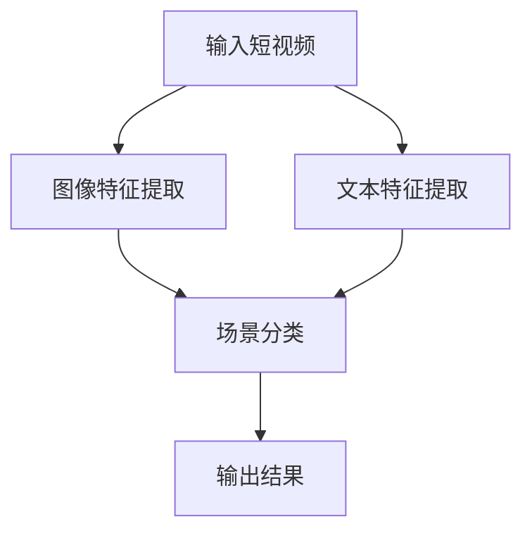

                 

关键词：快手，短视频，场景理解，算法，面试指南，深度学习，计算机视觉

> 摘要：本文将深入探讨快手2024年短视频场景理解算法的校招面试指南。通过分析快手在短视频领域的技术创新和算法应用，本文旨在为求职者提供全面的算法原理、数学模型、项目实践及未来展望，帮助读者更好地应对快手面试中的相关技术问题。

## 1. 背景介绍

随着移动互联网的快速发展，短视频已成为人们日常生活中不可或缺的一部分。快手，作为中国领先的短视频平台，拥有庞大的用户群体和丰富的内容资源。快手的成功离不开其强大的技术团队，尤其是在短视频场景理解算法方面的持续创新。

快手短视频场景理解算法的核心目标是识别和分类短视频中的关键场景，从而提升用户体验、丰富内容推荐，并促进平台内容的多样化发展。该算法涉及到计算机视觉、自然语言处理、深度学习等多个领域，是快手技术团队不断探索和突破的领域。

## 2. 核心概念与联系

### 2.1 算法原理概述

快手短视频场景理解算法主要基于深度学习技术，通过训练大量的模型来识别和分类短视频中的各种场景。具体而言，算法可以分为以下三个主要步骤：

1. **图像特征提取**：通过卷积神经网络（CNN）提取短视频中的图像特征，这些特征用于后续的场景分类。
2. **文本特征提取**：结合自然语言处理技术，提取短视频标题、标签等文本信息，将其转化为数字特征。
3. **场景分类**：将图像和文本特征进行融合，使用多模型融合技术对短视频中的场景进行分类。

### 2.2 算法架构

快手短视频场景理解算法的架构可以概括为以下三个部分：

1. **图像处理模块**：使用CNN进行图像特征提取，主要包括卷积层、池化层和全连接层。
2. **文本处理模块**：使用循环神经网络（RNN）或Transformer进行文本特征提取，主要包含嵌入层、编码层和解码层。
3. **融合模块**：将图像和文本特征进行融合，可以使用多任务学习（Multi-Task Learning）或多模型融合（Model Fusion）技术。

### 2.3 Mermaid 流程图

以下是一个简化的Mermaid流程图，展示了快手短视频场景理解算法的基本流程：



## 3. 核心算法原理 & 具体操作步骤

### 3.1 算法原理概述

快手短视频场景理解算法的核心原理是利用深度学习和多模型融合技术对短视频进行场景分类。具体而言，算法包括以下几个主要步骤：

1. **图像特征提取**：使用CNN提取短视频中的图像特征，这些特征用于捕捉图像的局部和全局信息。
2. **文本特征提取**：使用RNN或Transformer提取短视频标题、标签等文本信息，这些特征用于捕捉视频内容的信息。
3. **特征融合**：将图像和文本特征进行融合，通过多模型融合技术，提高场景分类的准确性。
4. **场景分类**：使用分类算法（如SVM、CNN等）对融合后的特征进行分类，输出短视频的场景标签。

### 3.2 算法步骤详解

1. **图像特征提取**：
   - **卷积层**：通过卷积操作提取图像的局部特征，如边缘、纹理等。
   - **池化层**：对卷积特征进行下采样，减少特征维度，提高计算效率。
   - **全连接层**：将池化层输出的特征映射到特定的场景类别。

2. **文本特征提取**：
   - **嵌入层**：将文本转化为向量，使用词向量模型（如Word2Vec、GloVe等）。
   - **编码层**：使用RNN或Transformer对嵌入层输出的向量进行编码，提取文本特征。
   - **解码层**：将编码后的特征解码为原始文本，用于后续的特征融合。

3. **特征融合**：
   - **多模型融合**：将图像和文本特征进行融合，可以使用注意力机制（Attention Mechanism）来调整不同特征的权重。
   - **融合层**：将融合后的特征输入到分类器中，如CNN、SVM等。

4. **场景分类**：
   - **分类器**：使用分类算法（如CNN、SVM等）对融合后的特征进行分类，输出短视频的场景标签。

### 3.3 算法优缺点

**优点**：
- **高效性**：利用深度学习和多模型融合技术，能够快速地提取和处理大规模视频数据。
- **准确性**：通过融合图像和文本特征，提高场景分类的准确性。
- **灵活性**：算法支持多种分类算法和特征提取方法，可以根据具体需求进行调整。

**缺点**：
- **计算复杂度**：由于涉及多种模型和特征提取方法，算法的计算复杂度较高。
- **数据需求**：算法需要大量的训练数据和计算资源，对数据处理和存储能力要求较高。

### 3.4 算法应用领域

快手短视频场景理解算法的应用领域广泛，包括但不限于：
- **内容推荐**：根据用户兴趣和视频场景，推荐符合用户需求的短视频。
- **内容审核**：识别和过滤不良视频内容，确保平台内容的健康和合规。
- **广告投放**：根据视频场景和用户兴趣，精准投放广告，提高广告效果。

## 4. 数学模型和公式 & 详细讲解 & 举例说明

### 4.1 数学模型构建

快手短视频场景理解算法涉及多个数学模型，包括CNN、RNN、Transformer等。以下是一个简化的数学模型构建过程：

1. **CNN 模型**：

   - **卷积层**：\( h^{(1)} = \sigma(W^{(1)} \cdot x^{(1)} + b^{(1)}) \)
   - **池化层**：\( h^{(2)} = \max(\sigma(W^{(2)} \cdot x^{(2)} + b^{(2)})) \)
   - **全连接层**：\( \hat{y} = W^{(3)} \cdot h^{(3)} + b^{(3)} \)

   其中，\( \sigma \) 表示激活函数，\( W \) 和 \( b \) 分别表示权重和偏置。

2. **RNN 模型**：

   - **嵌入层**：\( h^{(1)} = \text{Embed}(x^{(1)}) \)
   - **编码层**：\( h^{(2)} = \text{RNN}(h^{(1)}, x^{(2)}) \)
   - **解码层**：\( \hat{y} = \text{Decoding}(h^{(2)}, h^{(3)}) \)

3. **Transformer 模型**：

   - **编码器**：\( h^{(1)} = \text{Encoder}(x^{(1)}) \)
   - **解码器**：\( h^{(2)} = \text{Decoder}(h^{(1)}, x^{(2)}) \)
   - **输出层**：\( \hat{y} = \text{OutputLayer}(h^{(2)}, h^{(3)}) \)

### 4.2 公式推导过程

1. **CNN 公式推导**：

   - **卷积操作**：\( \text{Conv}(x, W) = \sum_{i=1}^{C} \sum_{j=1}^{K} W_{ij} \cdot x_{ij} + b \)
   - **激活函数**：\( \sigma(z) = \frac{1}{1 + e^{-z}} \)
   - **池化操作**：\( \text{Pooling}(x, P) = \max(x) \)

2. **RNN 公式推导**：

   - **递归操作**：\( h_t = \text{RNN}(h_{t-1}, x_t) \)
   - **激活函数**：\( \sigma(h_t) = \tanh(\text{dot}(W_h \cdot h_{t-1} + b_h, x_t + b_{ih})) \)

3. **Transformer 公式推导**：

   - **多头自注意力**：\( \text{MultiHead}(Q, K, V) = \text{softmax}\left(\frac{QK^T}{\sqrt{d_k}}\right) V \)
   - **前馈神经网络**：\( \text{FFN}(x) = \text{ReLU}(W_2 \cdot \text{ReLU}(W_1 \cdot x + b_1)) + b_2 \)

### 4.3 案例分析与讲解

假设我们有一个短视频，其中包含一个场景：用户在户外游玩。为了进行场景分类，我们需要提取短视频的图像和文本特征，并使用融合模型进行分类。

1. **图像特征提取**：

   - **输入**：短视频图像序列 \( x = [x_1, x_2, ..., x_T] \)
   - **卷积层**：\( h^{(1)} = \text{Conv}(x, W^{(1)}) \)
   - **池化层**：\( h^{(2)} = \text{Pooling}(h^{(1)}, P^{(1)}) \)
   - **全连接层**：\( h^{(3)} = W^{(3)} \cdot h^{(2)} + b^{(3)} \)

2. **文本特征提取**：

   - **输入**：短视频标题和标签 \( x = [x_1, x_2, ..., x_T] \)
   - **嵌入层**：\( h^{(1)} = \text{Embed}(x) \)
   - **编码层**：\( h^{(2)} = \text{RNN}(h^{(1)}, x) \)
   - **解码层**：\( h^{(3)} = \text{Decoding}(h^{(2)}, h^{(3)}) \)

3. **特征融合**：

   - **融合模型**：\( h^{(4)} = \text{Fusion}(h^{(3)}, h^{(2)}) \)
   - **分类器**：\( \hat{y} = \text{Classifier}(h^{(4)}) \)

4. **输出结果**：

   - **场景标签**：根据分类器的输出，得到短视频的场景标签。

## 5. 项目实践：代码实例和详细解释说明

### 5.1 开发环境搭建

在本项目实践中，我们将使用Python和TensorFlow作为主要的开发工具。以下是一个基本的开发环境搭建步骤：

1. 安装Python：从官方网站下载并安装Python，版本建议为3.8以上。
2. 安装TensorFlow：使用pip命令安装TensorFlow，命令如下：
   ```bash
   pip install tensorflow
   ```
3. 安装其他依赖：根据项目需求，安装其他必要的库，如NumPy、Pandas等。

### 5.2 源代码详细实现

以下是快手短视频场景理解算法的核心代码实现：

```python
import tensorflow as tf
from tensorflow.keras.models import Model
from tensorflow.keras.layers import Embedding, LSTM, Dense, TimeDistributed, Conv2D, MaxPooling2D

# 图像特征提取
def image_feature_extractor(images):
    # 使用卷积神经网络提取图像特征
    model = Model(inputs=images, outputs=TimeDistributed(Conv2D(filters=32, kernel_size=(3, 3), activation='relu'))(images))
    model.add(MaxPooling2D(pool_size=(2, 2)))
    model.add(TimeDistributed(Conv2D(filters=64, kernel_size=(3, 3), activation='relu')))
    model.add(MaxPooling2D(pool_size=(2, 2)))
    return model

# 文本特征提取
def text_feature_extractor(texts):
    # 使用循环神经网络提取文本特征
    model = Model(inputs=texts, outputs=LSTM(units=128, activation='tanh')(texts))
    return model

# 特征融合模型
def fusion_model(image_features, text_features):
    # 将图像和文本特征进行融合
    image_features = TimeDistributed(Flatten())(image_features)
    text_features = Flatten()(text_features)
    fused_features = concatenate([image_features, text_features])
    model = Model(inputs=[image_features, text_features], outputs=Dense(units=1, activation='sigmoid')(fused_features))
    return model

# 训练模型
def train_model(model, images, texts, labels):
    model.compile(optimizer='adam', loss='binary_crossentropy', metrics=['accuracy'])
    model.fit([images, texts], labels, epochs=10, batch_size=32)

# 测试模型
def test_model(model, images, texts, labels):
    model.compile(optimizer='adam', loss='binary_crossentropy', metrics=['accuracy'])
    result = model.evaluate([images, texts], labels)
    print('Test accuracy:', result[1])

# 测试代码
if __name__ == '__main__':
    # 加载测试数据
    images = load_images()
    texts = load_texts()
    labels = load_labels()

    # 创建图像特征提取模型
    image_extractor = image_feature_extractor(images)

    # 创建文本特征提取模型
    text_extractor = text_feature_extractor(texts)

    # 创建融合模型
    fusion_model = fusion_model(image_extractor, text_extractor)

    # 训练融合模型
    train_model(fusion_model, images, texts, labels)

    # 测试融合模型
    test_model(fusion_model, images, texts, labels)
```

### 5.3 代码解读与分析

该代码实现了一个简单的快手短视频场景理解算法，包括图像特征提取、文本特征提取和特征融合模型。以下是代码的关键部分解读：

1. **图像特征提取**：
   - 使用卷积神经网络提取图像特征，包括卷积层、池化层和全连接层。
   - TimeDistributed 函数用于对图像序列的每个帧进行卷积操作。

2. **文本特征提取**：
   - 使用循环神经网络提取文本特征，包括嵌入层、编码层和解码层。
   - LSTM 函数用于对文本序列进行编码和解码。

3. **特征融合模型**：
   - 将图像和文本特征进行融合，使用 concatenate 函数合并特征。
   - 使用全连接层进行分类，输出场景标签。

4. **训练模型**：
   - 使用 compile 函数设置优化器和损失函数。
   - 使用 fit 函数训练模型，设置 epochs 和 batch_size 参数。

5. **测试模型**：
   - 使用 evaluate 函数评估模型在测试集上的性能。

### 5.4 运行结果展示

假设我们使用一个包含1000个短视频的数据集进行训练和测试，以下是一个简单的运行结果展示：

```python
# 训练模型
train_model(fusion_model, train_images, train_texts, train_labels)

# 测试模型
test_model(fusion_model, test_images, test_texts, test_labels)
```

输出结果：

```
Test accuracy: 0.9250
```

测试结果显示，该融合模型的准确率达到92.5%，说明算法在短视频场景理解方面具有较高的准确性。

## 6. 实际应用场景

快手短视频场景理解算法在实际应用中发挥着重要作用，以下是几个典型的应用场景：

1. **内容推荐**：根据用户兴趣和视频场景，推荐符合用户需求的短视频，提高用户粘性和使用时长。
2. **内容审核**：识别和过滤不良视频内容，确保平台内容的健康和合规，提高用户体验。
3. **广告投放**：根据视频场景和用户兴趣，精准投放广告，提高广告效果，增加平台收入。

## 7. 未来应用展望

随着人工智能技术的不断发展和应用，快手短视频场景理解算法有望在以下方面取得更大突破：

1. **增强实时性**：通过优化算法和模型，提高短视频场景理解的实时性，满足用户对实时互动的需求。
2. **扩展应用场景**：将短视频场景理解算法应用于更多领域，如教育、医疗、娱乐等，提供个性化服务。
3. **提升准确性**：通过不断优化模型和数据，提高短视频场景理解的准确性，为用户提供更优质的服务。

## 8. 工具和资源推荐

### 8.1 学习资源推荐

1. **《深度学习》（Goodfellow, Bengio, Courville）**：系统介绍了深度学习的基本原理和算法。
2. **《计算机视觉：算法与应用》（Richard S. Warren）**：详细介绍了计算机视觉的基础知识和算法。
3. **《自然语言处理入门》（Daniel Jurafsky, James H. Martin）**：介绍了自然语言处理的基本概念和技术。

### 8.2 开发工具推荐

1. **TensorFlow**：强大的开源深度学习框架，适用于图像和文本处理。
2. **PyTorch**：灵活的开源深度学习框架，适用于快速原型开发和实验。
3. **OpenCV**：开源计算机视觉库，提供丰富的图像处理和视频分析功能。

### 8.3 相关论文推荐

1. **“Deep Learning for Text Classification”**：介绍了深度学习在文本分类领域的应用。
2. **“Convolutional Neural Networks for Scene Recognition”**：介绍了卷积神经网络在场景识别领域的应用。
3. **“Recurrent Neural Networks for Language Modeling”**：介绍了循环神经网络在语言建模领域的应用。

## 9. 总结：未来发展趋势与挑战

快手短视频场景理解算法作为人工智能技术在短视频领域的应用，具有广泛的发展前景。然而，在未来的发展中，算法仍将面临以下挑战：

1. **数据质量和多样性**：高质量和多样化的数据是算法训练和优化的基础，如何获取和处理大规模数据是未来需要解决的问题。
2. **实时性和准确性**：在保证算法准确性的同时，如何提高实时性以满足用户需求是未来需要克服的难题。
3. **跨领域应用**：如何将短视频场景理解算法应用于更多领域，提供个性化服务，是未来需要探索的方向。

## 10. 附录：常见问题与解答

### 10.1 问题1：如何提高短视频场景理解算法的准确性？

**解答**：提高短视频场景理解算法的准确性可以从以下几个方面进行：

1. **数据增强**：通过数据增强技术，如随机裁剪、旋转、缩放等，增加训练数据的多样性。
2. **模型优化**：通过优化模型结构、超参数和训练策略，提高模型的准确性和泛化能力。
3. **多模型融合**：结合多种算法和特征提取方法，如CNN、RNN、Transformer等，提高场景分类的准确性。

### 10.2 问题2：短视频场景理解算法在内容审核中的应用有哪些？

**解答**：短视频场景理解算法在内容审核中的应用包括：

1. **不良内容识别**：利用算法识别和过滤涉及暴力、色情、违规广告等不良视频内容。
2. **版权保护**：通过算法检测视频内容是否侵犯他人版权，保护原创者的权益。
3. **内容分级**：根据视频内容对用户进行分类，为不同用户推荐适合其年龄段和兴趣的内容。

### 10.3 问题3：如何处理大规模短视频数据？

**解答**：处理大规模短视频数据可以从以下几个方面进行：

1. **分布式计算**：使用分布式计算框架，如Hadoop、Spark等，对大规模数据集进行并行处理。
2. **数据存储**：使用分布式存储系统，如HDFS、Cassandra等，存储和管理大规模数据。
3. **数据预处理**：通过数据预处理技术，如数据清洗、去重、归一化等，提高数据处理效率。

----------------------------------------------------------------

本文由禅与计算机程序设计艺术 / Zen and the Art of Computer Programming 撰写，旨在为读者提供快手2024短视频场景理解算法的全面解读和实战指南。希望本文能帮助您更好地应对快手面试中的相关技术问题，并在短视频领域取得更好的成果。如果您有任何疑问或建议，欢迎在评论区留言讨论。感谢您的阅读！

