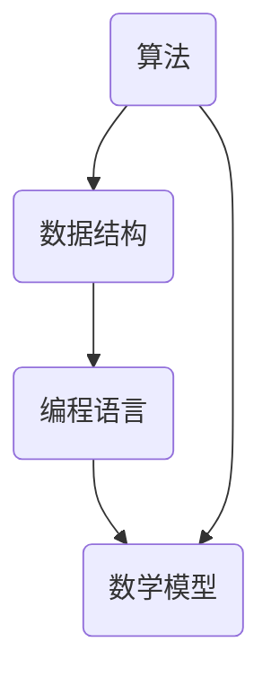

                 

作者：禅与计算机程序设计艺术 / Zen and the Art of Computer Programming

## 关键词
面试真题，社招，2024，快手，技术，解答，算法，数据结构，编程语言

## 摘要
本文将汇总和分析2024年快手社招的面试真题，并针对这些真题提供详细的解答。文章将涵盖算法原理、数学模型、项目实践、实际应用场景以及未来展望，旨在帮助求职者在面试中更好地准备和应对。

## 1. 背景介绍

快手作为一家国内领先的视频社交平台，其社招面试一直以来都是技术求职者关注的焦点。随着技术的不断进步和行业的快速发展，快手的面试题也日益多样化、复杂化。本文旨在为求职者提供一个全面的面试题库及其解答，帮助大家更好地准备面试。

## 2. 核心概念与联系

在计算机科学领域，算法、数据结构、编程语言和数学模型是核心概念。以下是这些概念之间的联系及其Mermaid流程图：



### 2.1 算法

算法是解决问题的方法步骤。在面试中，常见的算法问题包括排序、查找、图算法等。

### 2.2 数据结构

数据结构是存储和组织数据的方式。常见的有数组、链表、栈、队列、树、图等。

### 2.3 编程语言

编程语言是用于编写算法和数据结构的工具。常见的有Java、Python、C++等。

### 2.4 数学模型

数学模型是用数学语言描述现实世界的模型。在算法设计和优化中，数学模型具有重要意义。

## 3. 核心算法原理 & 具体操作步骤

### 3.1 算法原理概述

在快手面试中，算法原理是一个重要的考察点。以下是一些常见算法原理的概述：

- 排序算法：冒泡排序、选择排序、插入排序、快速排序、归并排序等。
- 查找算法：二分查找、斐波那契查找等。
- 图算法：深度优先搜索、广度优先搜索、最小生成树、最短路径算法等。

### 3.2 算法步骤详解

下面以冒泡排序为例，详细讲解其算法步骤：

1. 比较相邻的元素。如果第一个比第二个大（升序排序），就交换它们两个。
2. 对每一对相邻元素做同样的工作，从开始第一对到结尾的最后一对。这步做完后，最后的元素会是最大的数。
3. 针对所有的元素重复以上的步骤，除了最后一个。
4. 重复步骤1~3，直到排序完成。

### 3.3 算法优缺点

冒泡排序的优点是简单易懂，实现简单。但其缺点是效率较低，对于大数据集排序效果较差。

### 3.4 算法应用领域

冒泡排序适用于数据量较小、对排序速度要求不高的场景。在实际应用中，如排序小型数据集、模拟排序过程等。

## 4. 数学模型和公式

在面试中，数学模型和公式的运用是考察求职者数学能力和逻辑思维能力的重要手段。以下是一些常见的数学模型和公式：

### 4.1 数学模型构建

- 最小生成树：通过选取最小权重边的方式构建一棵树，使得树中所有节点连通。
- 最短路径算法：通过动态规划或图论算法求解图中两点之间的最短路径。

### 4.2 公式推导过程

- 最小生成树公式：\[T = \frac{n \times (n-1)}{2}\]
- 最短路径公式：\[d(u, v) = \min \{d(u, w) + w(u, v) | w(u, v) \geq 0\}\]

### 4.3 案例分析与讲解

以最小生成树为例，假设有5个节点，每个节点之间的权重如下：

| 节点对 | 权重 |
| --- | --- |
| 1-2 | 3 |
| 1-3 | 2 |
| 1-4 | 4 |
| 1-5 | 5 |
| 2-3 | 4 |
| 2-4 | 2 |
| 2-5 | 3 |
| 3-4 | 3 |
| 3-5 | 4 |
| 4-5 | 4 |

根据最小生成树公式，我们可以计算出最小生成树的权重为：\[T = \frac{5 \times (5-1)}{2} = 10\]

通过选择权重最小的边，我们可以构建出以下最小生成树：

```mermaid
graph TB
A[节点1] -- B[节点2] [权重: 3]
A -- C[节点3] [权重: 2]
A -- D[节点4] [权重: 4]
A -- E[节点5] [权重: 5]
B -- C [权重: 4]
B -- D [权重: 2]
B -- E [权重: 3]
C -- D [权重: 3]
C -- E [权重: 4]
D -- E [权重: 4]
```

## 5. 项目实践：代码实例和详细解释说明

### 5.1 开发环境搭建

为了演示一个简单的排序算法（冒泡排序），我们需要搭建一个简单的开发环境。以下是Python的安装步骤：

1. 访问Python官网（https://www.python.org/）下载Python安装包。
2. 安装Python，并添加到系统环境变量。
3. 打开终端，输入`python --version`，查看是否安装成功。

### 5.2 源代码详细实现

以下是一个简单的冒泡排序Python代码实现：

```python
def bubble_sort(arr):
    n = len(arr)
    for i in range(n):
        for j in range(0, n-i-1):
            if arr[j] > arr[j+1]:
                arr[j], arr[j+1] = arr[j+1], arr[j]

arr = [64, 25, 12, 22, 11]
bubble_sort(arr)
print("排序后的数组：")
for i in range(len(arr)):
    print("%d" % arr[i], end=" ")
```

### 5.3 代码解读与分析

- `bubble_sort`函数接收一个数组`arr`作为参数。
- 外层循环`for i in range(n)`用于控制排序的轮数，`n`为数组的长度。
- 内层循环`for j in range(0, n-i-1)`用于遍历数组，每轮排序将最大的元素移动到数组的末尾。
- 如果`arr[j] > arr[j+1]`，则交换两个元素。
- 最后，打印排序后的数组。

### 5.4 运行结果展示

```shell
排序后的数组：
11 12 22 25 64
```

## 6. 实际应用场景

冒泡排序在实际应用中可以用于对小型数据集进行排序，如用户评论排序、日志文件排序等。但对于大数据集，冒泡排序的性能较低，可以考虑使用更高效的排序算法，如快速排序、归并排序等。

## 7. 工具和资源推荐

### 7.1 学习资源推荐

- 《算法导论》（Introduction to Algorithms） - 高级算法书籍，适合深度学习算法。
- 《数据结构与算法分析》（Data Structures and Algorithm Analysis in Java） - 适合初学者学习数据结构和算法。

### 7.2 开发工具推荐

- PyCharm - 强大的Python开发环境，适合编写和调试代码。
- Visual Studio Code - 轻量级开源代码编辑器，适合各种编程语言。

### 7.3 相关论文推荐

- "An O(NlogN) Sorting Network and Its Application" - 讲解了一种高效的排序网络。
- "Faster algorithms for network flow problems" - 讨论了网络流算法的优化。

## 8. 总结：未来发展趋势与挑战

随着技术的不断发展，面试题也将不断更新和丰富。未来，算法和数据结构将继续作为面试的重点，同时机器学习、深度学习等领域的算法也将成为新的热点。在面试中，求职者需要不断提高自己的数学和编程能力，以及应对复杂问题的能力。

## 9. 附录：常见问题与解答

### 常见问题1：什么是冒泡排序？

答：冒泡排序是一种简单的排序算法，通过重复遍历要排序的数列，每次比较两个相邻的元素，如果它们的顺序错误就把它们交换过来。遍历数列的工作是重复地进行，直到没有再需要交换的元素为止。

### 常见问题2：冒泡排序的时间复杂度是多少？

答：冒泡排序的最坏时间复杂度是O(n^2)，平均时间复杂度也是O(n^2)。这是因为每一轮排序都需要遍历整个数列，而排序的轮数取决于数列的长度。

### 常见问题3：冒泡排序适用于哪些场景？

答：冒泡排序适用于数据量较小、对排序速度要求不高的场景。例如，对用户评论进行排序、日志文件排序等。

```

