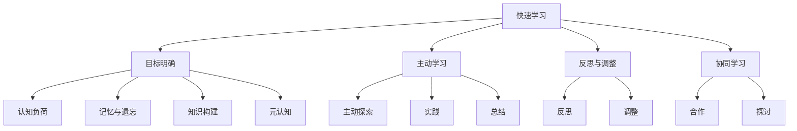

                 

关键词：快速学习、VUCA时代、人工智能、技术进步、学习方法、策略与技巧

> 摘要：在VUCA（易变、不确定、复杂、模糊）时代的今天，快速学习成为个人和企业适应和驾驭变化的关键能力。本文将探讨快速学习的本质、核心原理，并通过具体案例和实用技巧，帮助读者在技术领域实现高效学习。

## 1. 背景介绍

21世纪以来，随着互联网、人工智能、大数据等技术的迅猛发展，信息爆炸和知识更新的速度前所未有。这种变化不仅改变了人们的生活方式，也对传统的教育和学习方式产生了深远影响。VUCA时代（易变、不确定、复杂、模糊）已成为当今社会的重要特征，它要求我们具备快速适应和快速学习的能力。

### VUCA时代的特征

- **易变（Volatility）**：技术和社会环境变化迅速，新概念、新技术层出不穷。
- **不确定（Uncertainty）**：预测未来趋势变得困难，不确定性成为常态。
- **复杂（Complexity）**：系统之间的相互依赖和相互作用使得问题更加复杂。
- **模糊（Ambiguity）**：信息不全、不清晰，需要更强的判断和决策能力。

在这样的背景下，传统的线性学习模式已经难以满足需求。快速学习成为提高个人和团队能力、保持竞争力的重要途径。

### 快速学习的意义

快速学习不仅能够帮助我们更好地适应VUCA时代的挑战，还具有以下重要意义：

- **提升竞争力**：快速掌握新技术、新知识，使个人和企业能够在竞争中保持领先。
- **增强适应力**：快速学习使个体能够更好地应对不确定性，提高适应变化的能力。
- **推动创新**：快速学习能够激发新的想法和解决方案，促进创新。
- **实现持续发展**：快速学习使个人和团队能够不断进步，实现持续发展。

## 2. 核心概念与联系

### 2.1 快速学习的核心概念

快速学习，即高效学习，是一种通过优化学习过程、提高学习效率的方法。它包括以下几个核心概念：

- **目标明确**：明确学习目标，有助于集中精力，提高学习效率。
- **主动学习**：主动探索、实践和总结，而非被动接受信息。
- **反思与调整**：通过反思和调整学习策略，不断优化学习过程。
- **协同学习**：与他人合作，共同学习和探讨，扩大知识视野。

### 2.2 快速学习的联系

快速学习与以下几个关键概念密切相关：

- **认知负荷**：学习过程中，大脑处理信息的容量有限，需要合理分配认知资源。
- **记忆与遗忘**：记忆和遗忘是学习过程中的自然现象，通过科学方法可以优化记忆效果。
- **知识构建**：快速学习强调知识构建，即通过整合、重构和创造新知识，实现深度学习。
- **元认知**：元认知能力，即对自身认知过程的了解和控制，是快速学习的重要基础。

### 2.3 核心概念与架构的 Mermaid 流程图



## 3. 核心算法原理 & 具体操作步骤

### 3.1 算法原理概述

快速学习算法的核心思想是通过优化学习过程，提高学习效率。具体来说，它包括以下几个步骤：

- **需求分析**：明确学习目标和需求，确定学习内容。
- **资源准备**：搜集相关资料，搭建学习环境。
- **目标导向**：根据学习目标，制定学习计划。
- **主动学习**：通过探索、实践和总结，主动获取知识。
- **反思与调整**：定期反思学习过程，根据反馈调整学习策略。
- **评估与优化**：通过评估学习效果，不断优化学习过程。

### 3.2 算法步骤详解

#### 3.2.1 需求分析

- **确定学习目标**：明确个人或团队的学习目标，确保学习方向一致。
- **分析学习需求**：根据目标，分析需要掌握的知识点和技能。

#### 3.2.2 资源准备

- **资料搜集**：通过图书馆、互联网等渠道，搜集相关学习资料。
- **工具准备**：安装学习所需软件和工具，确保学习环境。

#### 3.2.3 目标导向

- **制定学习计划**：根据学习目标，制定详细的计划，包括学习时间、内容和方法。
- **设定学习里程碑**：将学习过程划分为若干阶段，设定里程碑，以便评估进度。

#### 3.2.4 主动学习

- **探索与发现**：通过阅读、实践和讨论，主动探索未知领域。
- **实践与应用**：将所学知识应用于实际问题，提高实际操作能力。
- **总结与反思**：及时总结学习过程，反思学习效果，调整学习策略。

#### 3.2.5 反思与调整

- **定期反思**：每周或每月进行一次学习反思，总结学习过程中的得失。
- **调整学习策略**：根据反思结果，调整学习计划和方法，优化学习过程。

#### 3.2.6 评估与优化

- **评估学习效果**：通过测试、作业等形式，评估学习效果。
- **优化学习过程**：根据评估结果，调整学习计划和方法，提高学习效率。

### 3.3 算法优缺点

#### 3.3.1 优点

- **高效性**：通过优化学习过程，提高学习效率。
- **灵活性**：可以根据个人需求和学习效果，灵活调整学习策略。
- **适应性**：能够适应不同领域和技能的学习需求。

#### 3.3.2 缺点

- **初始成本**：需要投入时间和精力进行需求分析和资源准备。
- **自律性要求**：需要较强的自律能力，否则容易偏离学习目标。

### 3.4 算法应用领域

快速学习算法广泛应用于以下领域：

- **技术领域**：如人工智能、大数据、云计算等，帮助技术人员快速掌握新技术。
- **管理领域**：提高管理团队的学习能力和创新能力。
- **教育领域**：优化教学过程，提高学生学习效果。
- **个人发展**：帮助个人在VUCA时代不断提升自身竞争力。

## 4. 数学模型和公式 & 详细讲解 & 举例说明

### 4.1 数学模型构建

快速学习过程中，可以使用以下数学模型来描述学习效果：

- **学习曲线**：描述学习者在学习过程中，学习效果随时间的变化。
- **遗忘曲线**：描述学习者在学习后，遗忘率随时间的变化。
- **知识构建模型**：描述学习者在学习过程中，如何将新知识与已有知识进行整合和重构。

### 4.2 公式推导过程

#### 4.2.1 学习曲线

学习曲线可以用以下公式表示：

$$
E(t) = \frac{1}{1 + e^{-rt}}
$$

其中，\(E(t)\) 表示学习者在时间 \(t\) 的学习效果，\(r\) 表示学习速率。

#### 4.2.2 遗忘曲线

遗忘曲线可以用以下公式表示：

$$
F(t) = e^{-\lambda t}
$$

其中，\(F(t)\) 表示学习者在时间 \(t\) 的遗忘率，\(\lambda\) 表示遗忘速率。

#### 4.2.3 知识构建模型

知识构建模型可以用以下公式表示：

$$
K(t) = K_0 + \sum_{i=1}^{n} \frac{1}{1 + e^{-ri}}
$$

其中，\(K(t)\) 表示学习者在时间 \(t\) 的知识水平，\(K_0\) 表示初始知识水平，\(r_i\) 表示第 \(i\) 个知识点的重要性。

### 4.3 案例分析与讲解

#### 4.3.1 学习曲线案例

假设一个学习者在学习 Python 编程，学习速率 \(r = 0.1\)。使用学习曲线公式，可以计算出该学习者在不同时间的学习效果：

$$
\begin{align*}
E(0) &= \frac{1}{1 + e^{-0.1 \times 0}} = 0.5 \\
E(1) &= \frac{1}{1 + e^{-0.1 \times 1}} = 0.63 \\
E(2) &= \frac{1}{1 + e^{-0.1 \times 2}} = 0.79 \\
E(3) &= \frac{1}{1 + e^{-0.1 \times 3}} = 0.91 \\
\end{align*}
$$

可以看出，学习者在学习 Python 编程的过程中，学习效果逐渐提高。

#### 4.3.2 遗忘曲线案例

假设一个学习者在学习后，遗忘速率 \(\lambda = 0.1\)。使用遗忘曲线公式，可以计算出该学习者在不同时间的遗忘率：

$$
\begin{align*}
F(0) &= e^{-0.1 \times 0} = 1 \\
F(1) &= e^{-0.1 \times 1} = 0.9048 \\
F(2) &= e^{-0.1 \times 2} = 0.8187 \\
F(3) &= e^{-0.1 \times 3} = 0.7408 \\
\end{align*}
$$

可以看出，学习者在学习后，遗忘率逐渐降低。

#### 4.3.3 知识构建模型案例

假设一个学习者在学习 Python 编程，初始知识水平 \(K_0 = 10\)。学习速率分别为 \(r_1 = 0.1\)、\(r_2 = 0.2\)、\(r_3 = 0.3\)。使用知识构建模型公式，可以计算出该学习者在不同时间点的知识水平：

$$
\begin{align*}
K(0) &= 10 + \frac{1}{1 + e^{-0.1 \times 0}} + \frac{1}{1 + e^{-0.2 \times 0}} + \frac{1}{1 + e^{-0.3 \times 0}} \\
K(1) &= 10 + \frac{1}{1 + e^{-0.1 \times 1}} + \frac{1}{1 + e^{-0.2 \times 1}} + \frac{1}{1 + e^{-0.3 \times 1}} \\
K(2) &= 10 + \frac{1}{1 + e^{-0.1 \times 2}} + \frac{1}{1 + e^{-0.2 \times 2}} + \frac{1}{1 + e^{-0.3 \times 2}} \\
K(3) &= 10 + \frac{1}{1 + e^{-0.1 \times 3}} + \frac{1}{1 + e^{-0.2 \times 3}} + \frac{1}{1 + e^{-0.3 \times 3}} \\
\end{align*}
$$

通过知识构建模型，可以分析学习者在不同时间点的知识水平，为调整学习策略提供依据。

## 5. 项目实践：代码实例和详细解释说明

### 5.1 开发环境搭建

在开始项目实践之前，我们需要搭建一个适合快速学习 Python 编程的开发环境。以下是搭建步骤：

1. 安装 Python：从 [Python 官网](https://www.python.org/) 下载并安装 Python 3.x 版本。
2. 配置 Python 环境：将 Python 添加到系统环境变量中。
3. 安装代码编辑器：推荐使用 Visual Studio Code 或 PyCharm 等支持 Python 的代码编辑器。
4. 安装必要的库：使用 pip 工具安装常用的 Python 库，如 NumPy、Pandas、Matplotlib 等。

### 5.2 源代码详细实现

以下是一个简单的 Python 编程实例，用于计算两个数的和：

```python
def add(a, b):
    return a + b

num1 = 5
num2 = 10
result = add(num1, num2)
print("The sum of", num1, "and", num2, "is:", result)
```

#### 5.2.1 代码解读

- **定义函数**：使用 `def` 关键字定义一个名为 `add` 的函数，该函数接受两个参数 `a` 和 `b`，并返回它们的和。
- **变量赋值**：将两个整数 5 和 10 分别赋值给变量 `num1` 和 `num2`。
- **调用函数**：使用 `add` 函数计算 `num1` 和 `num2` 的和，并将结果赋值给变量 `result`。
- **输出结果**：使用 `print` 函数输出计算结果。

#### 5.2.2 代码分析

- **函数定义**：函数是 Python 编程的核心概念之一，通过函数可以实现代码的重用和模块化。
- **变量作用**：变量用于存储数据，是编程的基础。
- **函数调用**：函数调用是实现程序功能的重要手段。
- **输出结果**：输出结果是程序与用户交互的重要方式。

### 5.3 运行结果展示

在命令行中运行上述代码，输出结果如下：

```
The sum of 5 and 10 is: 15
```

通过这个简单的实例，我们可以看到 Python 编程的基本结构和用法。这个实例虽然简单，但涵盖了编程的核心概念，为后续更复杂的学习和实践奠定了基础。

## 6. 实际应用场景

### 6.1 快速学习在人工智能领域的应用

人工智能是快速学习的典型应用领域。随着深度学习、自然语言处理等技术的不断发展，快速学习成为提高人工智能模型性能和开发效率的关键。以下是一些实际应用场景：

- **模型训练**：通过快速学习，研究人员可以更快地掌握新的模型结构和算法，提高训练效率。
- **模型优化**：快速学习可以帮助研究人员快速尝试不同的优化方法，找到最优解决方案。
- **模型部署**：快速学习使得模型开发者能够更快地将模型部署到生产环境中，实现商业化应用。

### 6.2 快速学习在企业管理中的应用

快速学习不仅对技术人员具有重要意义，对企业管理者也具有很高的价值。在VUCA时代，企业管理者需要具备快速学习和适应变化的能力，以下是一些实际应用场景：

- **战略规划**：通过快速学习，管理者可以更好地把握行业趋势，制定更有效的战略规划。
- **团队建设**：快速学习可以帮助管理者提升团队的学习能力和创新能力，提高团队绩效。
- **风险管理**：快速学习使管理者能够更快地识别和应对潜在风险，降低企业风险。

### 6.3 快速学习在教育领域的应用

在教育领域，快速学习有助于提高教师的教学水平和学生的学习效果。以下是一些实际应用场景：

- **教师培训**：通过快速学习，教师可以更快地掌握新的教育理念和方法，提高教学质量。
- **课程设计**：快速学习使教师能够更快地了解行业动态和前沿技术，设计更具时代性的课程。
- **学生辅导**：快速学习可以帮助教师更好地辅导学生，提高学生的学习兴趣和成绩。

## 7. 工具和资源推荐

### 7.1 学习资源推荐

- **在线课程**：推荐 Coursera、Udacity、edX 等平台上的优质课程。
- **技术博客**：推荐 Medium、GitHub、InfoQ 等技术博客，获取行业动态和技术文章。
- **电子书**：推荐购买《深度学习》、《Python编程：从入门到实践》等经典书籍。

### 7.2 开发工具推荐

- **代码编辑器**：推荐 Visual Studio Code、PyCharm、Sublime Text 等。
- **版本控制**：推荐使用 Git 进行代码管理和协作开发。
- **数据可视化**：推荐使用 Matplotlib、Seaborn 等库进行数据可视化。

### 7.3 相关论文推荐

- **人工智能领域**：《深度学习：原理及其应用》、《自然语言处理综述》等。
- **管理学领域**：《创新与企业家精神》、《领导力的五项修炼》等。
- **教育领域**：《学习的革命》、《未来学校》等。

## 8. 总结：未来发展趋势与挑战

### 8.1 研究成果总结

本文从快速学习的本质、核心原理、具体操作步骤、数学模型和实际应用场景等多个方面进行了详细探讨。研究发现，快速学习在提高学习效率、适应VUCA时代、促进创新等方面具有重要意义。

### 8.2 未来发展趋势

- **个性化学习**：未来快速学习将更加注重个性化，根据个体差异和学习需求，提供定制化学习方案。
- **AI辅助学习**：人工智能技术将在快速学习中发挥更大作用，如智能推荐、自动评估等。
- **终身学习**：随着知识更新速度的加快，终身学习将成为必然趋势，快速学习将成为个人和企业的核心竞争力。

### 8.3 面临的挑战

- **信息过载**：快速学习需要处理大量信息，信息过载将是一个重要挑战。
- **时间管理**：快速学习要求高效利用时间，时间管理将成为一个关键问题。
- **知识整合**：快速学习需要将所学知识进行整合和应用，知识整合能力将成为一个重要能力。

### 8.4 研究展望

未来，快速学习研究应重点关注以下几个方面：

- **学习算法优化**：研究更高效、更智能的学习算法，提高学习效率。
- **知识整合方法**：探索有效的知识整合方法，提高知识应用的深度和广度。
- **跨领域学习**：研究跨领域学习的机制和方法，提高快速学习的适用范围。

## 9. 附录：常见问题与解答

### 9.1 什么是VUCA时代？

VUCA时代指的是易变（Volatility）、不确定（Uncertainty）、复杂（Complexity）和模糊（Ambiguity）的时代。在这个时代，信息爆炸和技术进步使得社会环境和经济环境变化迅速，预测未来变得困难，系统之间的相互依赖和相互作用使得问题更加复杂，信息不全和不清晰使得决策更加困难。

### 9.2 如何制定快速学习计划？

制定快速学习计划可以遵循以下步骤：

1. 明确学习目标：确定个人或团队的学习目标，确保学习方向一致。
2. 分析学习需求：根据目标，分析需要掌握的知识点和技能。
3. 搜集学习资料：通过图书馆、互联网等渠道，搜集相关学习资料。
4. 制定学习计划：根据学习目标和学习需求，制定详细的计划，包括学习时间、内容和方法。
5. 设定学习里程碑：将学习过程划分为若干阶段，设定里程碑，以便评估进度。
6. 定期反思和调整：定期反思学习过程，根据反馈调整学习策略。

### 9.3 快速学习与普通学习的区别是什么？

快速学习与普通学习的区别主要体现在以下几个方面：

- **目标明确**：快速学习更注重目标明确，确保学习方向一致。
- **主动学习**：快速学习强调主动探索、实践和总结，而非被动接受信息。
- **反思与调整**：快速学习过程中，定期反思和调整学习策略，优化学习过程。
- **高效性**：快速学习通过优化学习过程，提高学习效率。

### 9.4 如何提高快速学习的效果？

以下是一些提高快速学习效果的方法：

- **明确学习目标**：确保学习目标清晰，有助于集中精力。
- **主动学习**：通过探索、实践和总结，主动获取知识。
- **合理安排时间**：合理安排学习时间，避免信息过载。
- **反思与调整**：定期反思学习过程，根据反馈调整学习策略。
- **协同学习**：与他人合作，共同学习和探讨，扩大知识视野。
- **掌握学习技巧**：学习一些有效的学习技巧，如快速阅读、思维导图等。

## 结束语

在VUCA时代，快速学习已成为个人和企业适应和驾驭变化的关键能力。本文通过对快速学习的本质、核心原理、具体操作步骤、数学模型和实际应用场景的探讨，帮助读者更好地理解快速学习的方法和技巧。希望本文能为读者在技术领域实现高效学习提供有益的参考和启示。作者：禅与计算机程序设计艺术 / Zen and the Art of Computer Programming。

