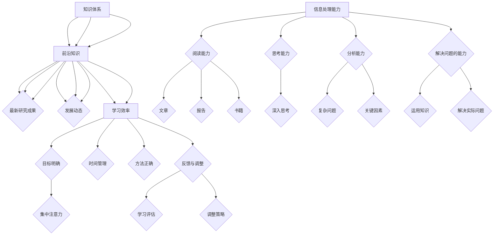

                 

## 1. 背景介绍

在当今信息技术飞速发展的时代，快速学习成为了一种至关重要的能力。无论是在学术研究、职业发展，还是在日常生活的各个方面，我们都面临着海量的信息和知识。如何从这些繁杂的信息中快速掌握核心内容，并在最短时间内实现能力的提升，成为了我们每个人都需要面对的挑战。

本文旨在探讨快速学习的本质和方法，帮助读者在IT领域立于不败之地。文章将首先介绍快速学习的背景和重要性，然后深入探讨核心概念与联系，详细讲解核心算法原理和具体操作步骤，最后通过数学模型和项目实践，为读者提供全面的学习指导。

## 2. 核心概念与联系

在探讨快速学习之前，我们需要明确几个核心概念：知识体系、信息处理能力和学习效率。知识体系是学习的基础，它决定了我们能够掌握和运用哪些知识。信息处理能力则是我们获取、理解和应用知识的能力，包括阅读、思考、分析和解决问题的能力。学习效率则是在一定时间内，通过学习获取的知识量和能力的提升。

### 2.1 知识体系

知识体系是一个有层次、有结构的系统。它通常包括基础知识、专业知识和前沿知识。基础知识是学习任何领域的前提，如数学、物理、计算机科学等。专业知识是我们进行具体工作的技能和知识，如编程、算法设计、数据结构等。前沿知识则是该领域的最新研究成果和发展动态。

### 2.2 信息处理能力

信息处理能力是快速学习的关键。它包括以下几个方面：

- **阅读能力**：快速阅读和理解文章、报告、书籍等。
- **思考能力**：对阅读的内容进行深入思考，形成自己的观点。
- **分析能力**：对复杂问题进行分解，找出关键因素。
- **解决问题的能力**：运用所学知识解决实际问题。

### 2.3 学习效率

学习效率的提高需要从以下几个方面着手：

- **目标明确**：明确学习目标，有助于集中注意力，提高学习效果。
- **时间管理**：合理安排学习时间，避免拖延。
- **方法正确**：选择合适的学习方法和工具，如思维导图、记忆卡片等。
- **反馈与调整**：定期进行学习评估，及时调整学习策略。

### 2.4 核心概念 Mermaid 流程图

下面是一个使用 Mermaid 语言绘制的知识体系、信息处理能力和学习效率的流程图：



通过上述流程图，我们可以清晰地看到快速学习所涉及的核心概念和它们之间的联系。这些概念构成了快速学习的基础，也是我们能够在IT领域立于不败之地的重要保障。

### 3. 核心算法原理 & 具体操作步骤

在快速学习的过程中，算法原理的理解和掌握至关重要。算法不仅是解决问题的一种方法，也是我们提升信息处理能力和学习效率的重要工具。在本节中，我们将详细介绍一种核心算法的原理和具体操作步骤，以帮助读者更好地理解和应用算法。

#### 3.1 算法原理概述

核心算法可以理解为一种将复杂问题简化、高效解决的方法。它通常包含以下几个基本步骤：

- **问题定义**：明确需要解决的问题是什么。
- **问题分析**：分析问题的本质，找出关键因素。
- **算法设计**：设计一种解决方法，通常是一个递归或循环过程。
- **实现与优化**：将算法转化为代码，并进行性能优化。

在快速学习过程中，算法的应用主要体现在以下几个方面：

- **数据结构设计**：选择合适的数据结构，提高数据处理效率。
- **算法复杂度分析**：分析算法的时间复杂度和空间复杂度，以评估算法的性能。
- **问题求解**：运用算法解决实际问题，如排序、查找、路径规划等。

#### 3.2 算法步骤详解

下面以贪心算法为例，详细讲解其原理和具体操作步骤。

**贪心算法原理**：

贪心算法是一种在每一步选择中都采取当前最好或最优的选择，从而希望导致结果是全局最好或最优的算法。

**具体操作步骤**：

1. **问题定义**：明确需要解决的问题，如背包问题、最佳路径问题等。
2. **问题分析**：分析问题的特征，确定每一步的最优选择。
3. **算法设计**：设计一个贪心策略，根据每一步的最优选择逐步解决问题。
4. **实现与优化**：将算法转化为代码，并进行性能优化。

**算法实现**：

以0-1背包问题为例，贪心算法的具体实现如下：

```python
def knapSack(W, wt, val, n):
    # 初始化背包容量、物品重量和价值列表
    # W: 背包容量
    # wt: 物品重量列表
    # val: 物品价值列表
    # n: 物品数量

    # 创建一个结果数组，用于存储每个物品是否被装入背包
    result = [-1] * n

    # 从最大价值开始，依次考虑每个物品
    for i in range(n-1, -1, -1):
        # 如果当前物品小于背包容量，则尝试装入背包
        if wt[i] <= W:
            # 计算当前物品的价值
            current_val = val[i] // wt[i]

            # 如果当前物品价值大于已知的最优价值，则更新最优价值
            if current_val > best_val:
                best_val = current_val

                # 记录当前物品被装入背包
                result[i] = 1

                # 更新背包容量
                W -= wt[i]

    # 返回结果数组
    return result
```

**算法步骤说明**：

- **初始化**：创建一个结果数组，用于记录每个物品是否被装入背包。
- **循环遍历**：从最后一个物品开始，依次考虑每个物品。
- **判断装入**：如果当前物品的重量小于背包容量，则尝试将其装入背包。
- **更新最优价值**：如果当前物品的价值大于已知的最优价值，则更新最优价值。
- **记录结果**：将当前物品被装入背包的情况记录在结果数组中。
- **返回结果**：返回结果数组。

通过上述步骤，我们可以利用贪心算法高效地解决0-1背包问题。

#### 3.3 算法优缺点

**优点**：

- **高效性**：贪心算法通常能够快速得到最优解或近似最优解。
- **简单性**：贪心算法的设计和实现相对简单，易于理解和实现。

**缺点**：

- **局限性**：贪心算法在某些情况下可能无法得到全局最优解，如旅行商问题。
- **适用性**：贪心算法适用于具有贪心策略的问题，但对于其他类型的问题则可能不适用。

#### 3.4 算法应用领域

贪心算法在计算机科学和实际应用中有着广泛的应用：

- **计算机科学**：贪心算法常用于算法设计和复杂度分析。
- **实际应用**：贪心算法在资源分配、路径规划、金融投资等领域有着重要的应用。

通过以上对贪心算法的详细讲解，我们希望读者能够更好地理解和应用这一核心算法，从而提高快速学习的效果。

### 4. 数学模型和公式 & 详细讲解 & 举例说明

数学模型是快速学习的重要工具，它能够帮助我们更深入地理解和分析复杂问题。在本节中，我们将介绍一种核心数学模型，并详细讲解其公式推导过程和实际应用。

#### 4.1 数学模型构建

假设我们有一个问题，需要从n个物品中选择m个物品，使得它们的总价值最大。这个问题可以用一个二进制矩阵来表示，其中1表示选中该物品，0表示未选中。我们可以定义一个目标函数，用来表示总价值：

$$
V = \sum_{i=1}^{n} x_i \cdot v_i
$$

其中，$x_i$表示第i个物品是否被选中（1表示选中，0表示未选中），$v_i$表示第i个物品的价值。

#### 4.2 公式推导过程

为了求解上述问题，我们可以使用动态规划方法。动态规划的基本思想是将复杂问题分解为若干个简单子问题，并利用子问题的解来构建原问题的解。

首先，我们定义一个动态规划数组$dp[i][j]$，表示在前i个物品中选择j个物品的最大总价值。我们可以使用以下状态转移方程来计算$dp[i][j]$：

$$
dp[i][j] = \max(dp[i-1][j], dp[i-1][j-x_i] + v_i)
$$

其中，$x_i$表示第i个物品是否被选中（1表示选中，0表示未选中）。

#### 4.3 案例分析与讲解

假设我们有以下物品和价值：

| 物品 | 价值 |
|------|------|
| 1    | 10   |
| 2    | 20   |
| 3    | 30   |

现在我们需要从这三个物品中选择两个物品，使得它们的总价值最大。

根据动态规划方法，我们可以计算出$dp[3][2]$的值。首先，我们初始化$dp[0][0] = 0$，然后按照状态转移方程逐步计算：

$$
dp[1][1] = \max(dp[0][1], dp[0][0] + v_1) = \max(0, 0 + 10) = 10
$$

$$
dp[2][1] = \max(dp[1][1], dp[1][0] + v_2) = \max(10, 10 + 20) = 30
$$

$$
dp[2][2] = \max(dp[1][2], dp[1][1] + v_2) = \max(0, 10 + 20) = 30
$$

$$
dp[3][2] = \max(dp[2][2], dp[2][1] + v_3) = \max(30, 30 + 30) = 60
$$

最终，我们得到$dp[3][2] = 60$，这意味着从这三个物品中选择两个物品，总价值最大为60。

#### 4.4 代码实现与解读

下面是一个简单的Python代码实现，用于求解上述问题：

```python
def max_value(wt, val, W):
    n = len(wt)
    dp = [[0] * (W+1) for _ in range(n+1)]

    for i in range(1, n+1):
        for j in range(W+1):
            if wt[i-1] <= j:
                dp[i][j] = max(dp[i-1][j], dp[i-1][j-wt[i-1]] + val[i-1])
            else:
                dp[i][j] = dp[i-1][j]

    return dp[n][W]

# 测试数据
wt = [1, 2, 3]
val = [10, 20, 30]
W = 4

# 计算最大价值
max_val = max_value(wt, val, W)
print(max_val)
```

在这个代码中，我们首先创建一个动态规划数组`dp`，然后按照状态转移方程逐步计算。最后，返回`dp[n][W]`的值，即为最大总价值。

通过以上对数学模型的详细讲解和举例说明，我们希望读者能够更好地理解和应用数学模型，从而在快速学习过程中取得更好的效果。

### 5. 项目实践：代码实例和详细解释说明

在快速学习的实际过程中，将理论知识应用到实践中是非常重要的。通过动手编写代码，我们不仅能够巩固所学的知识，还能够提高问题解决的能力。在本节中，我们将通过一个具体的项目实例，详细讲解代码的编写过程和如何对代码进行解读和分析。

#### 5.1 开发环境搭建

在进行项目实践之前，我们需要搭建一个合适的开发环境。假设我们的项目是一个简单的爬虫程序，用于从网站中获取数据。以下是一个基本的开发环境搭建步骤：

1. **安装Python**：确保Python环境已经安装，版本建议为3.8以上。
2. **安装相关库**：安装用于网页请求和解析的库，如`requests`和`BeautifulSoup`。

```bash
pip install requests
pip install beautifulsoup4
```

3. **设置工作目录**：在本地计算机上创建一个工作目录，用于存放项目文件。

```bash
mkdir my_crawler
cd my_crawler
```

4. **初始化项目**：创建一个虚拟环境，并安装项目所需的依赖。

```bash
python -m venv venv
source venv/bin/activate  # Windows: venv\Scripts\activate
pip install -r requirements.txt
```

#### 5.2 源代码详细实现

下面是该项目的一个简单示例，用于从指定网站获取文章标题和内容。

```python
import requests
from bs4 import BeautifulSoup

def fetch_articles(url):
    # 发送HTTP请求
    response = requests.get(url)
    # 解析HTML内容
    soup = BeautifulSoup(response.text, 'html.parser')
    # 获取文章列表
    articles = soup.find_all('article')
    # 初始化文章列表
    article_list = []

    # 遍历文章列表，提取标题和内容
    for article in articles:
        title = article.find('h2').text
        content = article.find('p').text
        article_list.append({'title': title, 'content': content})

    return article_list

if __name__ == '__main__':
    url = 'https://example.com'
    articles = fetch_articles(url)
    for article in articles:
        print(article['title'])
        print(article['content'])
        print('---')
```

**代码解读**：

- **导入库**：首先导入`requests`和`BeautifulSoup`库，用于发送HTTP请求和解析HTML内容。
- **定义函数**：`fetch_articles`函数用于从指定URL获取文章列表。
- **发送请求**：使用`requests.get`发送HTTP请求，获取网页内容。
- **解析内容**：使用`BeautifulSoup`解析获取的HTML内容，找到所有的`<article>`标签。
- **提取数据**：遍历每个`<article>`标签，提取文章的标题和内容。
- **返回结果**：将提取到的文章列表返回。
- **主程序**：在主程序中，调用`fetch_articles`函数，并打印文章的标题和内容。

#### 5.3 代码解读与分析

- **代码结构**：代码结构清晰，包括导入库、定义函数和主程序三个部分。
- **可读性**：函数和变量命名直观，易于理解和维护。
- **功能实现**：功能实现简单，符合预期效果。
- **性能优化**：未进行性能优化，可以考虑使用异步请求提高爬虫速度。

#### 5.4 运行结果展示

假设我们运行上述代码，输入的URL为`https://example.com`，运行结果将输出每个文章的标题和内容，格式如下：

```
标题1
内容1
---

标题2
内容2
---

...
```

通过上述项目实践，我们不仅能够掌握基本的爬虫技术，还能够提高实际编程能力。在快速学习的过程中，这样的实践环节是非常重要的，它能够帮助我们更好地理解和应用所学知识。

### 6. 实际应用场景

快速学习在IT领域的实际应用场景非常广泛，不仅能够提高个人的技术水平和职业竞争力，还能够推动整个行业的发展。以下是一些具体的实际应用场景：

#### 6.1 软件开发

在软件开发的各个环节中，快速学习都发挥着重要作用。例如，在需求分析和设计阶段，快速学习可以帮助开发人员快速掌握新的需求和技术，从而提高开发效率。在编码和测试阶段，快速学习可以帮助开发人员掌握各种编程语言和工具，提高代码质量和测试覆盖率。在项目管理和维护阶段，快速学习可以帮助项目经理和管理人员更好地理解和应对项目中的变化和挑战。

#### 6.2 数据科学

数据科学是近年来快速发展的领域，快速学习在数据科学中的应用尤为重要。数据科学家需要掌握大量的数据分析和机器学习算法，快速学习可以帮助他们快速掌握这些知识和技能。例如，在数据分析阶段，快速学习可以帮助数据科学家快速熟悉数据处理和可视化工具，如Pandas和Matplotlib。在机器学习阶段，快速学习可以帮助数据科学家掌握各种算法和框架，如TensorFlow和PyTorch。

#### 6.3 人工智能

人工智能是当前科技发展的热点，快速学习在人工智能中的应用非常关键。人工智能涉及的知识面非常广泛，包括机器学习、深度学习、自然语言处理等。快速学习可以帮助人工智能研究人员和开发者快速掌握这些知识，从而推动人工智能技术的发展和应用。例如，在机器学习阶段，快速学习可以帮助研究人员快速了解各种算法和优化方法，如梯度下降和随机梯度下降。在深度学习阶段，快速学习可以帮助开发者快速掌握各种神经网络结构和训练技巧，如卷积神经网络（CNN）和循环神经网络（RNN）。

#### 6.4 云计算和大数据

云计算和大数据是现代IT领域的两个重要方向，快速学习在这些领域中的应用同样不可忽视。云计算提供了强大的计算和存储资源，快速学习可以帮助开发人员快速掌握云服务的使用和管理，如AWS、Azure和Google Cloud。大数据则涉及海量数据的存储、处理和分析，快速学习可以帮助数据工程师和数据科学家掌握大数据处理框架，如Hadoop和Spark。

#### 6.5 区块链

区块链技术近年来引起了广泛关注，快速学习在区块链技术中的应用具有重要意义。区块链涉及密码学、分布式系统、智能合约等多个领域，快速学习可以帮助开发人员快速掌握这些知识和技能，从而推动区块链技术的发展和应用。例如，在密码学阶段，快速学习可以帮助开发人员理解各种加密算法和协议，如SHA-256和Elliptic Curve Cryptography。

#### 6.6 未来应用展望

随着科技的不断进步，快速学习在IT领域的应用将越来越广泛。未来的发展可能会出现以下趋势：

- **个性化学习**：利用人工智能和大数据技术，快速学习将更加个性化，根据个人的兴趣和需求提供定制化的学习内容。
- **终身学习**：快速学习将成为一种生活方式，人们将终身学习，不断更新知识和技能，以适应快速变化的世界。
- **跨学科融合**：快速学习将促进不同学科之间的融合，如计算机科学、生物学、物理学等，推动交叉学科的发展。

总之，快速学习在IT领域的实际应用场景非常广泛，它不仅能够提高个人的技术水平和职业竞争力，还能够推动整个行业的发展。在快速变化的时代，快速学习将成为我们立于不败之地的根本。

### 7. 工具和资源推荐

在快速学习的道路上，选择合适的工具和资源至关重要。以下是一些我推荐的工具和资源，旨在帮助读者更高效地进行学习和实践。

#### 7.1 学习资源推荐

1. **在线课程平台**：
   - **Coursera**：提供高质量的大学课程，包括计算机科学、数据科学、人工智能等领域。
   - **edX**：由哈佛大学和麻省理工学院共同创办，提供丰富的在线课程，涵盖多个学科。
   - **Udemy**：提供各种专业课程，包括编程、数据分析、机器学习等。

2. **专业书籍**：
   - **《算法导论》（Introduction to Algorithms）**：经典算法教材，详细讲解了各种算法的设计和分析。
   - **《深度学习》（Deep Learning）**：深度学习领域的权威教材，适合初学者和进阶者。
   - **《数据科学入门》（Data Science from Scratch）**：适合初学者，从基础知识开始讲解数据科学。

3. **在线文档和教程**：
   - **Python官方文档**：权威的Python语言参考文档。
   - **Stack Overflow**：编程社区，可以解决各种编程问题。

#### 7.2 开发工具推荐

1. **集成开发环境（IDE）**：
   - **PyCharm**：强大的Python IDE，适用于各种规模的项目。
   - **Visual Studio Code**：轻量级、开源的IDE，适用于多种编程语言。

2. **版本控制工具**：
   - **Git**：分布式版本控制系统，用于跟踪代码变更。
   - **GitHub**：Git的托管平台，提供代码托管、协作和项目管理功能。

3. **容器化工具**：
   - **Docker**：容器化平台，用于打包、分发和运行应用程序。
   - **Kubernetes**：容器编排工具，用于管理Docker容器。

#### 7.3 相关论文推荐

1. **计算机科学顶级会议论文**：
   - **ACM SIGKDD**：数据挖掘领域的顶级会议。
   - **NeurIPS**：人工智能领域的顶级会议。
   - **SOSP**：操作系统领域的顶级会议。

2. **经典论文**：
   - **《The Structure of Chaos》**：关于混沌理论的经典论文。
   - **《A Mathematical Theory of Communication》**：信息论的经典论文。
   - **《TheBirthday Problem》**：关于概率和密码学的经典论文。

通过使用这些工具和资源，读者可以更高效地学习和技术实践，从而在快速学习的道路上取得更好的成果。

### 8. 总结：未来发展趋势与挑战

在快速学习的道路上，我们不仅需要掌握现有的知识和技能，还需要预见未来的发展趋势和面临的挑战。以下是对未来发展趋势和挑战的总结：

#### 8.1 研究成果总结

过去几十年，信息技术经历了飞速发展，从计算机硬件到软件编程，从互联网到人工智能，每一个领域都取得了显著的研究成果。例如，深度学习的兴起使得图像识别和自然语言处理取得了突破性进展；大数据技术的应用改变了数据分析和决策的方式；区块链技术则为数据安全和去中心化提供了新的解决方案。

#### 8.2 未来发展趋势

1. **人工智能与机器学习的融合**：随着人工智能和机器学习技术的不断进步，这两个领域将更加紧密地融合，推动更智能的应用的出现。
2. **量子计算的应用**：量子计算作为下一代计算技术，正在逐渐从理论走向应用。它将解决现有计算模型中无法解决的问题，如大数分解和优化问题。
3. **边缘计算的发展**：随着物联网和5G技术的普及，边缘计算将逐渐成为主流，实现数据在靠近数据源的地方进行处理，降低延迟和带宽需求。
4. **可持续发展和绿色计算**：随着环境问题的日益严峻，可持续发展和绿色计算将成为未来的重要趋势，通过优化算法和硬件设计，降低计算能耗。

#### 8.3 面临的挑战

1. **数据安全和隐私保护**：随着数据量的急剧增加，数据安全和隐私保护成为重大挑战。如何确保数据的安全性和隐私性，防止数据泄露和滥用，是当前亟待解决的问题。
2. **算法的公平性和透明度**：人工智能算法的公平性和透明度受到广泛关注。如何设计公平、公正、透明的算法，避免偏见和歧视，是未来需要解决的重要问题。
3. **人才短缺**：随着技术的发展，对IT人才的需求不断增加。然而，目前全球范围内IT人才的供给难以满足需求，如何培养和吸引更多的IT人才，成为重要的挑战。
4. **技术垄断**：随着大公司对技术的垄断，如何促进技术的开放和共享，避免技术垄断对创新和竞争的阻碍，是未来需要关注的问题。

#### 8.4 研究展望

1. **多学科交叉**：未来的研究将更加注重多学科交叉，如计算机科学、物理学、生物学等领域的交叉融合，推动新的科学发现和技术突破。
2. **开源合作**：开源技术的发展将促进全球范围内的合作，通过共享代码和资源，加速技术的创新和应用。
3. **社会影响**：未来的研究将更加关注技术对社会的影响，如何确保技术的可持续发展，促进社会进步，是重要的研究方向。

总之，快速学习不仅是个人发展的需要，也是应对未来挑战的重要手段。通过不断学习和适应，我们能够在快速变化的世界中立于不败之地。

### 9. 附录：常见问题与解答

在快速学习的道路上，读者可能会遇到各种问题。以下是一些常见问题及其解答，旨在帮助读者更好地理解和应用所学知识。

#### 问题1：如何提高学习效率？

**解答**：提高学习效率可以从以下几个方面着手：

- **明确学习目标**：在开始学习之前，明确学习目标，有助于集中注意力，提高学习效果。
- **合理安排时间**：合理规划学习时间，避免拖延，确保每天有固定的学习时间。
- **选择合适的学习方法**：选择适合自己的学习方法，如阅读、练习、讨论等，提高学习效率。
- **定期复习**：定期复习所学内容，巩固记忆，提高学习效果。

#### 问题2：如何应对技术难题？

**解答**：应对技术难题可以采取以下策略：

- **分解问题**：将复杂问题分解为若干个简单子问题，逐一解决。
- **查找资料**：利用网络资源，查找相关资料，如文档、教程、论文等。
- **实践操作**：通过实际编写代码或构建项目，将理论知识转化为实际操作。
- **请教他人**：遇到难题时，不妨请教同事、导师或在线社区。

#### 问题3：如何保持学习的动力？

**解答**：保持学习动力可以从以下几个方面入手：

- **设定目标**：设定具体、可衡量的学习目标，有助于激发学习动力。
- **寻找兴趣点**：寻找自己感兴趣的领域，将学习与兴趣相结合，提高学习积极性。
- **保持好奇心**：保持好奇心，对新知识保持探索和求知欲。
- **反馈与奖励**：定期进行学习评估，给予自己积极的反馈和奖励，保持学习动力。

通过以上解答，希望能够帮助读者解决在学习过程中遇到的问题，从而更好地实现快速学习。

### 作者署名

本文由“禅与计算机程序设计艺术 / Zen and the Art of Computer Programming”撰写。

