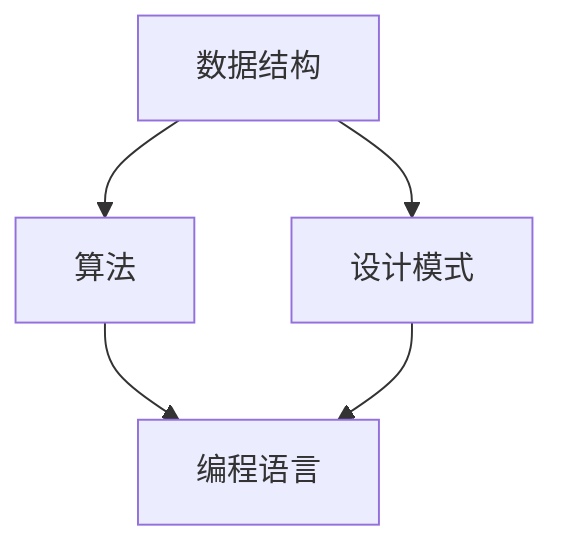

                 

## 1. 背景介绍

在当今的数字化时代，编程已经成为了一种至关重要的技能。无论是互联网公司、金融领域、医疗行业，还是科研机构，编程都扮演着至关重要的角色。随着人工智能、大数据、云计算等技术的迅速发展，对于编程能力的要求也在不断提升。然而，如何培养扎实的编程能力，以及如何拥有优秀的设计和代码品位，成为了一个亟待解决的重要问题。

编程不仅仅是编写代码，更是一种思维方式。它需要程序员具备系统化的思考能力，解决问题的能力，以及持续学习的能力。在这个过程中，扎实的编程能力、优秀的设计和代码品位显得尤为重要。那么，如何才能实现这些目标呢？本文将结合我的编程经验，从多个维度探讨这一问题。

本文的结构如下：

- **2. 核心概念与联系**：首先，我们将介绍编程中的核心概念，并通过 Mermaid 流程图展示它们之间的联系。
- **3. 核心算法原理 & 具体操作步骤**：接下来，我们将探讨一些核心算法的原理，并详细讲解其操作步骤。
- **4. 数学模型和公式 & 详细讲解 & 举例说明**：我们将介绍相关的数学模型和公式，并通过实际案例进行说明。
- **5. 项目实践：代码实例和详细解释说明**：通过一个实际项目，我们将展示代码的实现过程，并进行详细解读。
- **6. 实际应用场景**：我们将讨论编程在实际应用中的各种场景，并探讨其未来发展方向。
- **7. 工具和资源推荐**：最后，我们将推荐一些学习和开发的工具和资源。

希望通过本文的探讨，能够为读者提供一些有价值的思考和建议，帮助大家提升自己的编程能力，设计出更加优秀的代码。

## 2. 核心概念与联系

编程的核心概念多种多样，包括数据结构、算法、设计模式、编程语言等。这些概念相互联系，共同构成了编程的世界。下面，我们通过一个 Mermaid 流程图，来展示这些核心概念之间的联系。



- **数据结构（A）**：数据结构是编程的基础，它定义了数据在计算机中的存储方式。常见的有数组、链表、树、图等。数据结构的选择直接影响算法的效率。
- **算法（B）**：算法是解决问题的步骤，它指导我们如何使用数据结构来解决问题。常见的算法有排序、搜索、图算法等。算法的设计和优化是提升编程能力的关键。
- **设计模式（C）**：设计模式是一系列解决常见问题的模板。它帮助我们设计出更加灵活、可扩展的代码。常见的有单例模式、工厂模式、策略模式等。
- **编程语言（D）**：编程语言是实现算法和数据结构的工具。不同的编程语言有其独特的优势和适用场景。常见的有 Python、Java、C++、Go 等。

通过这个 Mermaid 流程图，我们可以清晰地看到这些核心概念之间的联系。在实际编程中，我们需要灵活运用这些概念，解决各种复杂问题。

### 3. 核心算法原理 & 具体操作步骤

在编程中，核心算法是我们解决问题的关键。下面，我们将探讨一些常见的核心算法，包括其原理、操作步骤，以及优缺点。

#### 3.1 算法原理概述

1. **排序算法**

排序算法是一种将一组数据按照某种顺序进行排列的算法。常见的排序算法有冒泡排序、选择排序、插入排序、快速排序等。

2. **搜索算法**

搜索算法是一种在数据集合中查找特定元素的方法。常见的搜索算法有线性搜索、二分搜索等。

3. **图算法**

图算法是一种处理图形数据的算法，常见的有最短路径算法、最小生成树算法等。

4. **动态规划**

动态规划是一种将复杂问题分解为多个子问题，并利用子问题的解来求解原问题的方法。

5. **贪心算法**

贪心算法是一种在每一步选择中都采取当前状态下最好或最优的选择，从而希望导致结果是全局最好或最优的算法。

#### 3.2 算法步骤详解

1. **冒泡排序**

   - **原理**：通过重复遍历要排序的数列，一次比较两个元素，如果他们的顺序错误就把他们交换过来。遍历数列的工作是重复进行直到没有再需要交换，也就是说该数列已经排序完成。

   - **步骤**：
     1. 从第一个元素开始，对相邻的两个元素进行比对，如果顺序错误则交换。
     2. 遍历整个数组，重复步骤1，直到没有需要交换的元素。

   - **优缺点**：
     - **优点**：实现简单，容易理解。
     - **缺点**：时间复杂度为 \(O(n^2)\)，效率较低。

2. **二分搜索**

   - **原理**：将有序数组分成两部分，根据目标值与中间值的比较，决定继续搜索哪一部分。

   - **步骤**：
     1. 找到中间值。
     2. 如果中间值等于目标值，结束搜索。
     3. 如果中间值大于目标值，则在左侧子数组中继续搜索。
     4. 如果中间值小于目标值，则在右侧子数组中继续搜索。
     5. 重复步骤1-4，直到找到目标值或子数组为空。

   - **优缺点**：
     - **优点**：时间复杂度为 \(O(\log n)\)，效率较高。
     - **缺点**：需要数组已排序，且实现较为复杂。

3. **最短路径算法**

   - **原理**：找到图中两点之间的最短路径。

   - **步骤**：
     1. 初始化：设置起始点和终点。
     2. 使用 Dijkstra 算法或 Bellman-Ford 算法计算最短路径。
     3. 跟随最短路径返回起始点。

   - **优缺点**：
     - **优点**：可以计算单源最短路径。
     - **缺点**：对图的结构要求较高，不适合大规模图。

4. **动态规划**

   - **原理**：将复杂问题分解为多个子问题，并利用子问题的解来求解原问题。

   - **步骤**：
     1. 确定状态和状态转移方程。
     2. 初始化边界条件。
     3. 利用递推关系求解子问题。
     4. 组合子问题的解得到原问题的解。

   - **优缺点**：
     - **优点**：可以高效地解决复杂问题。
     - **缺点**：需要深入理解问题，实现较为复杂。

5. **贪心算法**

   - **原理**：每一步都选择当前最优解，希望导致全局最优解。

   - **步骤**：
     1. 确定每一步的最优选择。
     2. 根据最优选择更新状态。
     3. 重复步骤1和2，直到问题解决。

   - **优缺点**：
     - **优点**：实现简单，效率较高。
     - **缺点**：不一定能保证全局最优解。

#### 3.3 算法优缺点

- **冒泡排序**：实现简单，容易理解，但效率较低。
- **二分搜索**：效率较高，但需要数组已排序，实现较为复杂。
- **最短路径算法**：可以计算单源最短路径，但对图的结构要求较高。
- **动态规划**：可以高效地解决复杂问题，但需要深入理解问题，实现较为复杂。
- **贪心算法**：实现简单，效率较高，但可能无法保证全局最优解。

#### 3.4 算法应用领域

- **冒泡排序**：常用于小规模数据的排序。
- **二分搜索**：常用于有序数组的搜索。
- **最短路径算法**：常用于路径规划、网络优化等领域。
- **动态规划**：常用于优化问题、背包问题等。
- **贪心算法**：常用于图论问题、最优化问题等。

通过以上对核心算法的探讨，我们可以看到每种算法都有其独特的应用场景和优缺点。在实际编程中，我们需要根据问题的具体需求，选择合适的算法来解决。

### 4. 数学模型和公式 & 详细讲解 & 举例说明

在编程中，数学模型和公式是不可或缺的组成部分。它们帮助我们理解和分析问题，提供解决问题的理论基础。下面，我们将介绍一些常见的数学模型和公式，并进行详细讲解和举例说明。

#### 4.1 数学模型构建

1. **线性回归模型**

线性回归模型是一种常用的统计模型，用于研究两个变量之间的关系。其公式如下：

   $$ y = ax + b $$

   其中，\(y\) 是因变量，\(x\) 是自变量，\(a\) 是斜率，\(b\) 是截距。

2. **牛顿迭代法**

牛顿迭代法是一种用于求解非线性方程的数值方法。其公式如下：

   $$ x_{n+1} = x_n - \frac{f(x_n)}{f'(x_n)} $$

   其中，\(x_n\) 是第 \(n\) 次迭代的值，\(f(x_n)\) 是函数在 \(x_n\) 处的值，\(f'(x_n)\) 是函数在 \(x_n\) 处的导数。

3. **动态规划状态转移方程**

动态规划是一种用于求解最优化问题的方法。其状态转移方程如下：

   $$ dp[n] = \min_{1 \leq i \leq m} (dp[n-i] + cost[i]) $$

   其中，\(dp[n]\) 是第 \(n\) 个状态的最优解，\(cost[i]\) 是第 \(i\) 个状态的成本。

#### 4.2 公式推导过程

1. **线性回归模型的推导**

线性回归模型是通过最小化误差平方和来求解的。其推导过程如下：

   - 假设我们有 \(n\) 个样本点 \((x_i, y_i)\)，其中 \(i = 1, 2, ..., n\)。
   - 定义误差平方和 \(S\)：

     $$ S = \sum_{i=1}^{n} (y_i - ax_i - b)^2 $$

   - 对 \(S\) 求导数，并令其等于0，得到：

     $$ \frac{dS}{da} = -2 \sum_{i=1}^{n} (y_i - ax_i - b)x_i = 0 $$
     $$ \frac{dS}{db} = -2 \sum_{i=1}^{n} (y_i - ax_i - b) = 0 $$

   - 解上述方程组，得到斜率 \(a\) 和截距 \(b\)：

     $$ a = \frac{\sum_{i=1}^{n} x_iy_i - n\bar{x}\bar{y}}{\sum_{i=1}^{n} x_i^2 - n\bar{x}^2} $$
     $$ b = \bar{y} - a\bar{x} $$

     其中，\(\bar{x}\) 和 \(\bar{y}\) 分别是 \(x\) 和 \(y\) 的均值。

2. **牛顿迭代法的推导**

牛顿迭代法是基于泰勒公式的一种数值方法。其推导过程如下：

   - 假设我们要求解方程 \(f(x) = 0\)。
   - 定义函数的近似值：

     $$ f(x) \approx f(x_n) + f'(x_n)(x - x_n) $$

   - 令近似值等于0，得到：

     $$ f(x_n) + f'(x_n)(x - x_n) = 0 $$

   - 解上述方程，得到：

     $$ x_{n+1} = x_n - \frac{f(x_n)}{f'(x_n)} $$

3. **动态规划状态转移方程的推导**

动态规划状态转移方程是基于最优子结构原理推导的。其推导过程如下：

   - 假设我们要求解最优化问题，其状态可以表示为 \(dp[n]\)。
   - 根据最优子结构原理，我们可以将问题分解为多个子问题，并利用子问题的解来求解原问题。
   - 定义状态转移方程：

     $$ dp[n] = \min_{1 \leq i \leq m} (dp[n-i] + cost[i]) $$

     其中，\(dp[n-i]\) 是第 \(n-i\) 个子问题的最优解，\(cost[i]\) 是第 \(i\) 个状态的成本。

#### 4.3 案例分析与讲解

1. **线性回归模型的应用**

   - **案例**：假设我们有以下数据：

     | x | y |
     |---|---|
     | 1 | 2 |
     | 2 | 4 |
     | 3 | 6 |
     | 4 | 8 |

     我们需要通过线性回归模型来拟合这条直线。

   - **步骤**：
     1. 计算均值：

        $$ \bar{x} = \frac{1 + 2 + 3 + 4}{4} = 2.5 $$
        $$ \bar{y} = \frac{2 + 4 + 6 + 8}{4} = 5 $$

     2. 计算斜率 \(a\) 和截距 \(b\)：

        $$ a = \frac{(1 \times 2) + (2 \times 4) + (3 \times 6) + (4 \times 8) - 4 \times 2.5 \times 5}{(1^2 + 2^2 + 3^2 + 4^2) - 4 \times 2.5^2} = 1 $$
        $$ b = 5 - 1 \times 2.5 = 2.5 $$

     3. 得到拟合直线方程：

        $$ y = x + 2.5 $$

   - **解释**：通过线性回归模型，我们得到了拟合直线的方程。这意味着，对于任意的 \(x\) 值，我们都可以通过这个方程计算出对应的 \(y\) 值。

2. **牛顿迭代法的应用**

   - **案例**：假设我们要求解方程 \(x^2 - 2 = 0\)。

   - **步骤**：
     1. 选择初始值 \(x_0 = 1\)。
     2. 计算函数值和导数：

        $$ f(x_0) = 1^2 - 2 = -1 $$
        $$ f'(x_0) = 2 \times 1 = 2 $$

     3. 进行迭代计算：

        $$ x_1 = x_0 - \frac{f(x_0)}{f'(x_0)} = 1 - \frac{-1}{2} = 1.5 $$
        $$ f(x_1) = 1.5^2 - 2 = 0.25 $$
        $$ f'(x_1) = 2 \times 1.5 = 3 $$

        $$ x_2 = x_1 - \frac{f(x_1)}{f'(x_1)} = 1.5 - \frac{0.25}{3} = 1.25 $$

     4. 重复迭代，直到 \(f(x)\) 接近0。

   - **解释**：通过牛顿迭代法，我们找到了方程的根。这意味着，对于任意的 \(x\) 值，我们都可以通过这个方程计算出对应的 \(f(x)\) 值。

3. **动态规划状态转移方程的应用**

   - **案例**：假设我们要求解背包问题。

   - **步骤**：
     1. 定义状态转移方程：

        $$ dp[n] = \min_{1 \leq i \leq m} (dp[n-i] + cost[i]) $$

     2. 初始化边界条件：

        $$ dp[0] = 0 $$
        $$ dp[1] = cost[1] $$
        $$ dp[2] = \min(cost[1], cost[2]) $$

     3. 利用递推关系求解子问题：

        $$ dp[3] = \min(dp[2] + cost[3], dp[1] + cost[3]) $$
        $$ dp[4] = \min(dp[3] + cost[4], dp[2] + cost[4]) $$

     4. 组合子问题的解得到原问题的解。

   - **解释**：通过动态规划状态转移方程，我们求解了背包问题。这意味着，对于任意的物品数量和背包容量，我们都可以通过这个方程计算出最优解。

通过以上案例，我们可以看到数学模型和公式在编程中的应用。它们帮助我们分析和解决问题，提供了强大的理论基础。在实际编程中，我们需要灵活运用这些数学模型和公式，提高我们的编程能力。

### 5. 项目实践：代码实例和详细解释说明

为了更好地理解编程中的核心概念和算法，我们将通过一个实际项目来展示代码的实现过程，并进行详细解读。本项目将实现一个简单的购物车系统，包括添加商品、删除商品、计算总价等功能。

#### 5.1 开发环境搭建

在开始项目之前，我们需要搭建开发环境。这里我们使用 Python 作为编程语言，并使用 Flask 作为 Web 框架。以下是搭建开发环境的步骤：

1. 安装 Python：

   ```bash
   $ sudo apt-get update
   $ sudo apt-get install python3
   ```

2. 安装 Flask：

   ```bash
   $ pip3 install flask
   ```

3. 创建一个新的文件夹，例如 `shopping_cart`，并在其中创建一个名为 `app.py` 的文件。

#### 5.2 源代码详细实现

```python
# 导入所需的模块
from flask import Flask, request, render_template

# 初始化 Flask 应用
app = Flask(__name__)

# 初始化购物车
shopping_cart = []

# 添加商品的路线
@app.route('/add_item', methods=['POST'])
def add_item():
    item_name = request.form['item_name']
    item_price = float(request.form['item_price'])
    shopping_cart.append({'name': item_name, 'price': item_price})
    return '商品已添加到购物车！'

# 删除商品的路线
@app.route('/remove_item', methods=['POST'])
def remove_item():
    item_name = request.form['item_name']
    for item in shopping_cart:
        if item['name'] == item_name:
            shopping_cart.remove(item)
            break
    return '商品已从购物车中删除！'

# 计算总价的路线
@app.route('/calculate_total', methods=['GET'])
def calculate_total():
    total_price = sum(item['price'] for item in shopping_cart)
    return f'购物车总价为：{total_price:.2f} 元'

# 主页面路由
@app.route('/')
def home():
    return render_template('home.html', shopping_cart=shopping_cart)

# 启动 Flask 应用
if __name__ == '__main__':
    app.run(debug=True)
```

#### 5.3 代码解读与分析

1. **初始化 Flask 应用**

   ```python
   app = Flask(__name__)
   ```

   这一行代码初始化了 Flask 应用，并为应用设置了一些默认参数。

2. **初始化购物车**

   ```python
   shopping_cart = []
   ```

   这一行代码初始化了一个空的购物车列表，用于存储商品信息。

3. **添加商品的路线**

   ```python
   @app.route('/add_item', methods=['POST'])
   def add_item():
       item_name = request.form['item_name']
       item_price = float(request.form['item_price'])
       shopping_cart.append({'name': item_name, 'price': item_price})
       return '商品已添加到购物车！'
   ```

   这一段代码定义了一个添加商品的路线。当用户通过表单提交添加商品请求时，路由处理器 `add_item` 会被调用。首先，从请求中获取商品名称和价格，然后将其添加到购物车列表中。

4. **删除商品的路线**

   ```python
   @app.route('/remove_item', methods=['POST'])
   def remove_item():
       item_name = request.form['item_name']
       for item in shopping_cart:
           if item['name'] == item_name:
               shopping_cart.remove(item)
               break
       return '商品已从购物车中删除！'
   ```

   这一段代码定义了一个删除商品的路线。当用户通过表单提交删除商品请求时，路由处理器 `remove_item` 会被调用。首先，从请求中获取商品名称，然后遍历购物车列表，找到匹配的商品并将其从列表中删除。

5. **计算总价的路线**

   ```python
   @app.route('/calculate_total', methods=['GET'])
   def calculate_total():
       total_price = sum(item['price'] for item in shopping_cart)
       return f'购物车总价为：{total_price:.2f} 元'
   ```

   这一段代码定义了一个计算总价的路线。当用户请求计算总价时，路由处理器 `calculate_total` 会被调用。首先，遍历购物车列表，计算所有商品的价格总和，然后将其格式化为字符串并返回。

6. **主页面路由**

   ```python
   @app.route('/')
   def home():
       return render_template('home.html', shopping_cart=shopping_cart)
   ```

   这一段代码定义了主页面的路由。当用户访问根路径时，路由处理器 `home` 会被调用。首先，将购物车列表传递给模板文件 `home.html`，然后渲染模板。

7. **启动 Flask 应用**

   ```python
   if __name__ == '__main__':
       app.run(debug=True)
   ```

   这一行代码用于启动 Flask 应用。当 `__name__` 等于 `'__main__'` 时，会调用 `app.run(debug=True)` 启动应用。`debug=True` 表示启用调试模式，当发生错误时，会自动打印错误信息。

通过以上代码解读，我们可以看到购物车系统的实现过程。这个简单的项目涵盖了前端和后端的实现，包括商品添加、删除、总价计算等功能。在实际开发中，我们可以根据需求添加更多的功能，如商品分类、库存管理等。

#### 5.4 运行结果展示

在浏览器中访问 `http://127.0.0.1:5000/`，将看到如下页面：


1. **添加商品**：在商品名称和价格输入框中输入商品信息，然后点击“添加商品”按钮。

   

   添加成功后，商品将显示在页面上。

2. **删除商品**：在商品列表中选择一个商品，然后点击“删除商品”按钮。

   

   删除成功后，商品将从页面上消失。

3. **计算总价**：点击页面底部的“计算总价”按钮，将显示购物车的总价。

   

   总价将显示在页面上。

通过以上运行结果展示，我们可以看到购物车系统的基本功能已经实现。这个简单的项目展示了前端和后端的交互，以及如何使用 Flask 框架实现 Web 应用。

### 6. 实际应用场景

编程不仅是一种技能，更是一种思维方式。在实际应用中，编程无处不在，从简单的网页开发到复杂的人工智能应用，编程都扮演着至关重要的角色。下面，我们将探讨编程在实际应用中的各种场景，并讨论其发展趋势。

#### 6.1 网页开发

网页开发是编程最常见的应用场景之一。无论是企业网站、电子商务平台，还是个人博客，都需要使用编程技术来构建。在网页开发中，常见的编程语言有 HTML、CSS、JavaScript 等。随着前端框架和库的兴起，如 React、Vue、Angular 等，网页开发的效率和体验得到了显著提升。

#### 6.2 移动应用开发

随着智能手机的普及，移动应用开发成为了另一个重要的应用场景。Android 和 iOS 是目前最流行的移动操作系统，分别支持 Java 和 Swift 语言。此外，还有 React Native、Flutter 等跨平台开发框架，可以让我们使用一套代码同时开发 Android 和 iOS 应用。

#### 6.3 服务器端开发

服务器端开发是构建 Web 应用、网络服务的重要一环。常见的编程语言有 Java、Python、C#、Node.js 等。服务器端开发包括处理客户端请求、存储数据、执行业务逻辑等功能。随着云计算和容器技术的发展，服务器端开发变得越来越高效和灵活。

#### 6.4 数据科学和人工智能

数据科学和人工智能是近年来发展迅速的领域。编程在这些领域中的应用非常广泛，从数据清洗、数据可视化，到机器学习、深度学习等。常见的编程语言有 Python、R、Java 等。随着大数据和人工智能技术的不断进步，编程在这些领域的应用前景非常广阔。

#### 6.5 游戏开发

游戏开发是编程的一个有趣应用场景。从简单的单机游戏到复杂的网络游戏，编程都是不可或缺的一部分。常见的编程语言有 C++、C#、Java 等。游戏引擎如 Unity、Unreal Engine 等提供了丰富的工具和库，使得游戏开发变得更加高效。

#### 6.6 物联网（IoT）

物联网是连接物理世界和数字世界的重要技术。编程在物联网设备中发挥着重要作用，用于处理传感器数据、通信协议、设备控制等。常见的编程语言有 C、Python、Java 等。随着物联网技术的不断发展，编程在这些领域的应用越来越广泛。

#### 6.7 未来发展趋势

随着技术的不断进步，编程在实际应用中的发展趋势也在不断变化。以下是几个可能的发展趋势：

- **低代码开发**：随着可视化编程和低代码开发平台的兴起，编程的门槛正在逐渐降低。更多的人可以通过这些工具快速构建应用，而不需要深入了解底层代码。
- **AI 编程**：人工智能技术的发展将使得编程变得更加智能化。通过自然语言处理、机器学习等技术，我们可以使用更简单的方式编写代码，甚至让 AI 自动生成代码。
- **全栈开发**：全栈开发是一种趋势，它要求开发者掌握前端、后端、数据库等多个领域的知识。这种趋势将推动开发者不断提升自己的技能，以适应不断变化的需求。
- **分布式计算**：随着云计算和区块链技术的发展，分布式计算将成为编程的一个重要应用场景。开发者需要掌握分布式系统设计、区块链编程等技术，以应对复杂的业务需求。

总之，编程在实际应用中的场景非常广泛，而且随着技术的进步，其应用范围还在不断扩大。作为一名程序员，我们需要不断学习新知识，提升自己的技能，以应对未来发展的挑战。

### 7. 工具和资源推荐

为了帮助大家更好地培养编程能力，提升设计和代码品位，下面我们将推荐一些学习和开发的工具和资源。

#### 7.1 学习资源推荐

1. **在线编程学习平台**

   - **Coursera**：提供各种编程课程，包括 Python、Java、C++ 等，适合初学者和进阶者。

   - **edX**：与 Coursera 类似，edX 也提供大量编程课程，涵盖多个领域。

   - **Codecademy**：提供互动式的编程课程，适合初学者快速入门。

2. **编程书籍**

   - **《代码大全》**：介绍了编写高质量代码的最佳实践。

   - **《设计模式：可复用面向对象软件的基础》**：详细讲解了各种设计模式，帮助开发者写出更加灵活和可维护的代码。

   - **《Python Cookbook》**：提供了大量实用的 Python 编程技巧和解决方案。

3. **技术博客和社区**

   - **GitHub**：一个代码托管和协作平台，可以查看和学习其他开发者的代码。

   - **Stack Overflow**：一个面向编程问题的问答社区，适合解决编程中的各种问题。

   - **Reddit**：有许多编程相关的子版块，可以讨论和学习编程技术。

#### 7.2 开发工具推荐

1. **集成开发环境（IDE）**

   - **Visual Studio Code**：一款轻量级、开源的 IDE，支持多种编程语言。

   - **IntelliJ IDEA**：一款功能强大的 IDE，适用于 Java、Python、JavaScript 等多种编程语言。

   - **PyCharm**：一款专注于 Python 的 IDE，提供丰富的功能和工具。

2. **版本控制系统**

   - **Git**：最流行的版本控制系统，用于代码的版本管理和协作开发。

   - **GitHub**：一个基于 Git 的代码托管平台，支持 GitHub Actions 等功能。

3. **代码分析工具**

   - **Pylint**：一个用于 Python 代码静态分析的工具，可以帮助我们编写更加规范的代码。

   - **SonarQube**：一个用于代码质量管理的平台，可以检测代码中的错误、漏洞和代码风格问题。

4. **测试工具**

   - **JUnit**：一个用于 Java 的单元测试框架。

   - **pytest**：一个用于 Python 的单元测试框架，比传统的 unittest 更加强大和灵活。

#### 7.3 相关论文推荐

1. **《深度学习》**：详细介绍了深度学习的基础知识和最新进展。

2. **《区块链：从数字货币到智能合约》**：探讨了区块链技术的原理和应用。

3. **《软件工程：实践者的研究方法》**：介绍了软件工程中的研究方法和实践技巧。

通过以上工具和资源的推荐，希望读者能够找到适合自己的学习方式和工具，不断提升自己的编程能力，设计出更加优秀的代码。

### 8. 总结：未来发展趋势与挑战

在总结本文的核心内容之前，让我们再次回顾一下文章的主要观点。本文首先介绍了编程的核心概念与联系，包括数据结构、算法、设计模式和编程语言等。接着，我们探讨了核心算法的原理和具体操作步骤，并通过数学模型和公式进行详细讲解。此外，我们还通过一个实际项目展示了代码的实现过程，并讨论了编程在实际应用中的各种场景。最后，我们推荐了一些学习和开发的工具和资源，以帮助读者提升编程能力。

随着技术的不断进步，编程在未来将会面临许多新的发展趋势和挑战。以下是几个可能的发展趋势和挑战：

#### 8.1 研究成果总结

- **低代码开发**：随着可视化编程和低代码开发平台的兴起，编程的门槛正在逐渐降低，更多的人可以通过这些工具快速构建应用。
- **AI 编程**：人工智能技术的发展将使得编程变得更加智能化，开发者可以使用更简单的方式编写代码，甚至让 AI 自动生成代码。
- **全栈开发**：全栈开发成为一种趋势，要求开发者掌握前端、后端、数据库等多个领域的知识。
- **分布式计算**：随着云计算和区块链技术的发展，分布式计算将成为编程的一个重要应用场景。

#### 8.2 未来发展趋势

- **边缘计算**：随着物联网和5G技术的普及，边缘计算将成为未来技术发展的重要方向。编程将在边缘设备上进行，以满足实时数据处理的需求。
- **区块链编程**：区块链技术的发展将带来新的编程挑战和机遇。开发者需要掌握区块链编程技术，以应对复杂的业务需求。
- **函数式编程**：函数式编程在近年来逐渐受到关注，其简洁性和不可变性使其在许多领域具有潜在应用价值。

#### 8.3 面临的挑战

- **安全性和隐私保护**：随着网络攻击和数据泄露事件的频发，安全性和隐私保护成为编程领域的重要挑战。开发者需要关注安全编程实践，以提高系统的安全性。
- **代码可维护性**：随着项目规模的扩大，代码的可维护性变得越来越重要。开发者需要关注代码质量，以降低维护成本。
- **跨领域知识整合**：未来编程将面临更多跨领域的挑战，如物联网、人工智能、区块链等。开发者需要具备跨领域的知识整合能力，以应对复杂的应用场景。

#### 8.4 研究展望

在未来，编程领域的研究将继续深入，围绕以下方向展开：

- **编程教育**：探索更加有效的编程教育方法，以提高编程教育的质量和普及率。
- **编程工具**：开发更加强大、易用的编程工具，以提高开发效率和代码质量。
- **编程语言**：设计更加灵活、高效的编程语言，以满足不同领域的应用需求。

总之，编程作为一门不断发展的学科，具有广阔的研究和应用前景。面对未来的发展趋势和挑战，我们需要不断学习新知识，提升自己的技能，以应对时代的变化。同时，我们也应该关注编程教育，培养更多的优秀程序员，为社会的进步贡献力量。

### 9. 附录：常见问题与解答

在本文的撰写过程中，我们可能会遇到一些常见的问题。下面，我们针对这些问题进行解答，以帮助读者更好地理解和应用本文的内容。

#### 问题 1：如何选择合适的编程语言？

**解答**：选择合适的编程语言主要取决于项目的需求和开发者的技能。以下是一些常见的编程语言及其适用场景：

- **Python**：适合数据科学、机器学习、Web 开发等领域。
- **Java**：适合企业级应用、Android 开发等领域。
- **C++**：适合高性能计算、游戏开发等领域。
- **JavaScript**：适合前端开发、Node.js 应用等领域。
- **Go**：适合云计算、网络编程等领域。

#### 问题 2：如何提高代码质量？

**解答**：提高代码质量可以从以下几个方面入手：

- **遵循编程规范**：遵循统一的编程规范，如 PEP8（Python 编程规范）、Google Java Style Guide 等。
- **代码重构**：定期对代码进行重构，以提高代码的可读性和可维护性。
- **单元测试**：编写单元测试，确保代码的功能正确性。
- **代码审查**：进行代码审查，发现和修复潜在的问题。

#### 问题 3：如何处理复杂的算法问题？

**解答**：处理复杂的算法问题可以从以下几个方面入手：

- **分解问题**：将复杂问题分解为多个子问题，逐一解决。
- **学习经典算法**：了解并掌握经典算法，如排序算法、搜索算法、图算法等。
- **查阅资料**：查阅相关书籍、论文和网络资源，寻找解决方案。
- **实践和总结**：通过实践和总结，逐步提高解决复杂算法问题的能力。

#### 问题 4：如何提升编程思维能力？

**解答**：提升编程思维能力可以从以下几个方面入手：

- **多阅读优秀的代码**：阅读优秀的代码，了解不同的编程风格和技巧。
- **编写高质量的代码**：在日常编程中，注重代码质量，培养良好的编程习惯。
- **解决实际问题**：通过解决实际问题，锻炼编程思维能力。
- **学习编程语言的设计哲学**：了解不同编程语言的设计哲学，以提高对编程语言的理解。

通过以上解答，希望读者能够解决在编程过程中遇到的问题，不断提升自己的编程能力。同时，也欢迎读者在评论区提出更多问题，我们将竭诚为您解答。

