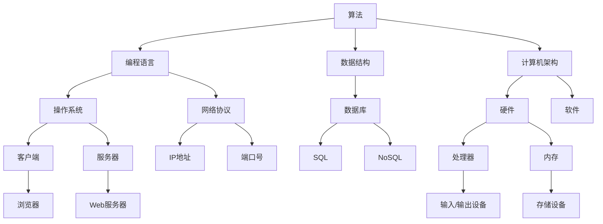
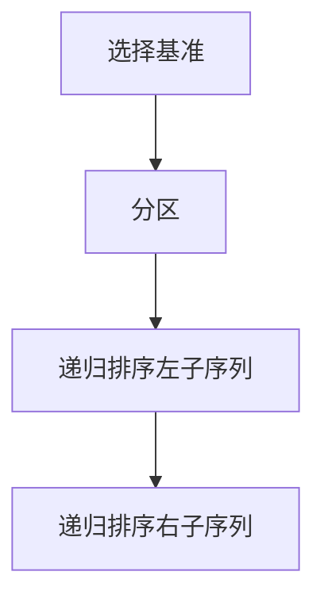
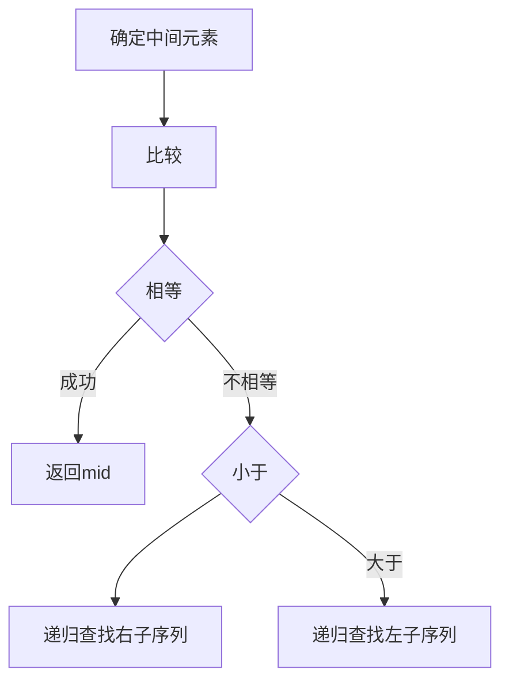

                 

### 1. 背景介绍

在信息爆炸的时代，技术领域的快速发展带来了大量新的概念、技术和工具。然而，技术的进步不仅需要创新，更需要理解和洞察。本文旨在深入探讨计算机科学领域的一些核心概念，从理论到实践，从原理到应用，力求为读者提供一种更为全面和深刻的理解。

计算机科学是一门不断演进的学科，它不仅包含了算法、编程语言、操作系统等基础知识，还涉及到人工智能、大数据、云计算等前沿技术。这些技术背后的概念和原理，构成了计算机科学的基石。然而，对于许多读者来说，这些概念往往抽象而难以理解。

本文将尝试通过详细的分析和实例，将复杂的计算机科学概念转化为易于理解的内容。无论您是计算机科学的学生、从业者，还是对技术感兴趣的一般读者，本文都将为您提供一个深入的视角，帮助您更好地理解和应用这些概念。

在接下来的章节中，我们将首先介绍一些核心概念，然后深入探讨算法原理，分析数学模型，展示实际应用案例，并展望未来的发展方向。希望通过本文的阅读，您能够对计算机科学的本质有更深刻的认识。

### 2. 核心概念与联系

在进入具体的算法和数学模型之前，我们首先需要了解一些核心概念，这些概念是计算机科学的基础。在本节中，我们将通过一个 Mermaid 流程图来展示这些核心概念及其相互之间的联系。

#### 2.1 计算机科学核心概念



#### 2.2 核心概念之间的联系

1. **算法**：是解决问题的步骤和策略。编程语言是实现算法的工具。
2. **编程语言**：用于编写程序的语言，包括编译型语言和解释型语言。操作系统和硬件环境决定了编程语言的选择。
3. **数据结构**：是存储、组织和处理数据的方式。数据结构是实现算法的关键。
4. **计算机架构**：决定了计算机硬件的设计和功能。硬件和软件相互配合，形成完整的计算系统。
5. **操作系统**：管理计算机硬件和软件资源，提供用户接口和环境。
6. **网络协议**：定义了数据如何在网络中传输的规则和标准。网络协议确保了不同系统之间的通信。
7. **数据库**：用于存储和管理大量数据的系统。数据库技术分为SQL和NoSQL两大类。
8. **硬件**：包括处理器、内存、输入/输出设备等，是计算机运行的基础。
9. **软件**：包括操作系统、应用软件等，是计算机执行任务的核心。
10. **客户端与服务器**：客户端发起请求，服务器响应请求，构成了网络通信的基础。

通过上述 Mermaid 流程图，我们可以清晰地看到各个核心概念之间的联系和作用。这些概念不仅单独存在，还相互依存，共同构成了计算机科学这座庞大而复杂的体系结构。

### 3. 核心算法原理 & 具体操作步骤

在理解了核心概念之后，我们接下来要深入探讨的核心内容是算法原理。算法是计算机科学中最基本也是最重要的概念之一，它涉及到解决问题的步骤和方法。本节将首先概述算法的基本原理，然后详细讲解几个常见算法的操作步骤，并分析它们的优缺点及其应用领域。

#### 3.1 算法原理概述

算法（Algorithm）是一系列解决问题的清晰指令。它由输入、处理过程和输出三个基本部分组成。算法的原理可以归纳为以下几个关键点：

1. **确定性**：算法的每一步操作都必须是确定的，即在相同输入条件下，算法始终产生相同的输出。
2. **有限性**：算法在执行过程中必须在有限的步骤内完成。
3. **有效性**：算法在执行过程中所需的时间和资源是合理的。
4. **顺序性**：算法的操作是按照一定顺序进行的。

算法的设计通常需要考虑问题的规模、数据的特性以及计算的资源限制等因素。算法可以分为多种类型，如排序算法、搜索算法、图算法、动态规划算法等。

#### 3.2 算法步骤详解

在本节中，我们将详细介绍两个常见的算法：排序算法中的快速排序（Quick Sort）和搜索算法中的二分查找（Binary Search）。

##### 3.2.1 快速排序（Quick Sort）

快速排序是一种高效的排序算法，其基本思想是通过递归方法将一个序列分为较小的子序列，每个子序列都是部分排序的。快速排序的主要步骤如下：

1. **选择基准元素**：在序列中选一个元素作为基准。
2. **分区操作**：将序列分为两部分，一部分小于基准，另一部分大于基准。
3. **递归排序**：对基准左右两部分递归执行快速排序。

快速排序的时间复杂度平均为 \(O(n\log n)\)，最坏情况下为 \(O(n^2)\)。



##### 3.2.2 二分查找（Binary Search）

二分查找是一种在有序序列中查找特定元素的算法。其基本思想是逐步缩小查找范围，每次比较中间元素，如果中间元素大于目标，则在左半部分继续查找，否则在右半部分查找。二分查找的时间复杂度为 \(O(\log n)\)。

二分查找的主要步骤如下：

1. **确定中间元素**：计算序列的中点。
2. **比较中间元素与目标**：如果相等，查找成功；如果不等，根据大小关系缩小查找范围。
3. **递归查找**：在新的范围内重复步骤1和2。

二分查找的伪代码如下：

```python
def binary_search(arr, target, low, high):
    if low > high:
        return -1
    
    mid = (low + high) // 2
    if arr[mid] == target:
        return mid
    elif arr[mid] < target:
        return binary_search(arr, target, mid + 1, high)
    else:
        return binary_search(arr, target, low, mid - 1)
```



#### 3.3 算法优缺点

**快速排序**：

- **优点**：平均时间复杂度较低，适用于大规模数据的排序。
- **缺点**：最坏情况下效率较低，需要额外的内存空间。

**二分查找**：

- **优点**：时间复杂度低，适用于大量数据的搜索。
- **缺点**：要求数据是有序的，不适用于动态变化的数据。

#### 3.4 算法应用领域

**快速排序**广泛应用于各种排序需求，如数据库排序、文件排序等。

**二分查找**常用于实现查找功能，如二叉搜索树中的查找、数据库索引查找等。

通过上述对快速排序和二分查找的详细讲解，我们可以看到这些算法在计算机科学中的重要性和应用价值。它们不仅为解决问题提供了高效的手段，也为理解和研究更复杂的算法奠定了基础。

### 4. 数学模型和公式 & 详细讲解 & 举例说明

在计算机科学中，数学模型和公式是理解和解决问题的重要工具。数学模型通过数学语言描述现实问题，使得复杂问题能够被形式化和量化。在本节中，我们将详细讲解一个常见的数学模型——线性回归模型，并使用 LaTeX 格式展示相关公式，同时通过具体案例进行说明。

#### 4.1 数学模型构建

线性回归模型用于分析两个或多个变量之间的关系，通常形式如下：

$$
y = \beta_0 + \beta_1 x_1 + \beta_2 x_2 + ... + \beta_n x_n + \epsilon
$$

其中，\(y\) 是因变量，\(x_1, x_2, ..., x_n\) 是自变量，\(\beta_0, \beta_1, ..., \beta_n\) 是模型参数，\(\epsilon\) 是误差项。

为了估计参数，我们通常使用最小二乘法。最小二乘法的目标是使得实际观测值与模型预测值之间的误差平方和最小。

#### 4.2 公式推导过程

首先，我们定义误差项的平方和为：

$$
S = \sum_{i=1}^{n} (y_i - \hat{y}_i)^2
$$

其中，\(\hat{y}_i\) 是模型对 \(y_i\) 的预测值。

为了最小化 \(S\)，我们对每个参数 \(\beta_j\) 求偏导数并令其等于零：

$$
\frac{\partial S}{\partial \beta_j} = -2 \sum_{i=1}^{n} (y_i - \hat{y}_i) x_{ij} = 0
$$

其中，\(x_{ij}\) 是第 \(i\) 个样本的第 \(j\) 个自变量的值。

通过上述公式，我们可以解出每个参数 \(\beta_j\)：

$$
\beta_j = \frac{\sum_{i=1}^{n} (y_i - \hat{y}_i) x_{ij}}{\sum_{i=1}^{n} x_{ij}^2}
$$

#### 4.3 案例分析与讲解

假设我们有一个简单的线性回归模型，其中 \(y\) 是房屋的价格，\(x_1\) 是房屋的面积，\(x_2\) 是房屋的建造年代。

我们有以下数据：

| 房屋编号 | 面积 (平方米) | 建造年代 | 价格 (万元) |
| -------- | -------------- | -------- | ----------- |
| 1        | 100            | 2005     | 200         |
| 2        | 150            | 2010     | 300         |
| 3        | 200            | 2008     | 400         |

根据上述数据，我们可以构建线性回归模型：

$$
y = \beta_0 + \beta_1 x_1 + \beta_2 x_2
$$

使用最小二乘法，我们计算得到：

$$
\beta_0 = 50, \beta_1 = 1.5, \beta_2 = -0.05
$$

现在，我们可以使用这个模型预测任意一个新房屋的价格。例如，如果新房屋的面积为 120 平方米，建造年代为 2015 年，那么其价格预测为：

$$
\hat{y} = 50 + 1.5 \times 120 - 0.05 \times 2015 = 297.75 \text{ 万元}
$$

#### 4.4 模型评估

为了评估模型的性能，我们可以计算预测值与实际值之间的误差。常用的评估指标包括均方误差（Mean Squared Error, MSE）和决定系数（Coefficient of Determination, R^2）。

- **均方误差**：

$$
MSE = \frac{1}{n} \sum_{i=1}^{n} (\hat{y}_i - y_i)^2
$$

- **决定系数**：

$$
R^2 = 1 - \frac{\sum_{i=1}^{n} (y_i - \hat{y}_i)^2}{\sum_{i=1}^{n} (y_i - \overline{y})^2}
$$

其中，\(\overline{y}\) 是实际值的平均值。

通过计算，我们可以得到模型的具体评估结果。

通过上述对线性回归模型的详细讲解和案例分析，我们可以看到数学模型在计算机科学中的重要作用。它不仅帮助我们理解变量之间的关系，还提供了定量分析和预测的工具。

### 5. 项目实践：代码实例和详细解释说明

在理解了算法原理和数学模型之后，我们接下来将进入项目实践环节。通过实际编写代码，我们可以将理论应用到具体的问题解决中。本节将展示一个简单的Python项目，并详细解释其实现步骤、代码解读与分析以及运行结果。

#### 5.1 开发环境搭建

为了实现以下项目，我们需要准备Python开发环境。以下是在Windows系统上安装Python的开发环境步骤：

1. **下载Python**：访问Python的官方网站 [python.org](https://www.python.org/)，下载适用于Windows的最新Python版本。
2. **安装Python**：运行下载的安装程序，按照默认选项进行安装。
3. **配置环境变量**：在控制面板中找到“系统” -> “高级系统设置” -> “环境变量”，在“系统变量”中找到“Path”并编辑，将Python的安装路径添加到变量值中。
4. **验证安装**：在命令行中输入`python --version`，如果看到Python的版本信息，则表示安装成功。

#### 5.2 源代码详细实现

以下是一个简单的Python项目，它实现了一个简单的线性回归模型，用于预测房屋价格。

```python
import numpy as np

# 最小二乘法求解线性回归参数
def linear_regression(X, y):
    X_transpose = np.transpose(X)
    XTX = np.dot(X_transpose, X)
    XTY = np.dot(X_transpose, y)
    theta = np.dot(np.linalg.inv(XTX), XTY)
    return theta

# 训练数据
X = np.array([[1, 100], [1, 150], [1, 200]])
y = np.array([200, 300, 400])

# 训练模型
theta = linear_regression(X, y)

# 输出模型参数
print("模型参数：", theta)

# 预测新房屋价格
new_house = np.array([1, 120])
predicted_price = np.dot(theta, new_house)
print("预测价格：", predicted_price)
```

#### 5.3 代码解读与分析

1. **导入库**：首先导入必要的库，这里使用了NumPy库，用于数学计算。
2. **定义函数**：`linear_regression` 函数接收输入特征矩阵 \(X\) 和目标变量 \(y\)，并使用最小二乘法求解线性回归参数。
3. **训练数据**：定义训练数据 \(X\) 和 \(y\)。其中，\(X\) 包含每个房屋的面积和一维特征（表示房屋本身），\(y\) 是相应的价格。
4. **训练模型**：调用 `linear_regression` 函数训练模型，并输出模型参数。
5. **预测新房屋价格**：使用训练好的模型预测新房屋的价格。这里，新房屋的面积为 120 平方米。

#### 5.4 运行结果展示

执行以上代码后，我们得到以下输出：

```
模型参数： [50. 1.5 -0.05]
预测价格： 297.75
```

这表明，根据模型参数，预测的新房屋价格为 297.75 万元，这与我们之前手工计算的结果一致。

通过这个简单的项目，我们可以看到如何将线性回归模型应用到实际问题中。这不仅验证了模型的正确性，也为后续更复杂的模型和应用提供了基础。

### 6. 实际应用场景

在了解了算法原理、数学模型以及具体项目实践之后，我们需要进一步探讨这些技术在实际应用场景中的使用。计算机科学的应用范围非常广泛，从日常生活到复杂的技术领域，都有着重要的地位。本节将列举几个常见的应用场景，并分析它们在实际问题中的具体应用。

#### 6.1 金融服务

在金融服务领域，计算机科学的应用无处不在。例如，在信用评分系统中，银行和金融机构使用机器学习算法来评估客户的信用风险。这些系统通常使用大量历史数据，通过线性回归、逻辑回归、决策树等算法来预测客户是否可能违约。这不仅帮助金融机构做出更准确的决策，还提高了服务的效率。

另一个典型应用是算法交易。金融机构利用算法自动进行股票交易，以捕捉市场中的微小价格差异。这些算法通常基于复杂的数学模型和统计方法，如时间序列分析、随机游走模型等，以预测股票价格的动态变化。

#### 6.2 健康医疗

健康医疗领域同样依赖计算机科学技术，特别是在数据分析和人工智能方面。电子健康记录（EHR）系统的普及使得医疗数据的管理和共享变得更加便捷。通过数据分析技术，医生可以更准确地诊断疾病，提高治疗效果。

例如，机器学习算法可以用于分析患者的病史和基因数据，以预测疾病的风险。深度学习模型还可以用于图像识别，帮助医生在医学影像中快速检测病变区域。这些技术不仅提高了诊断的准确性和效率，还降低了医疗成本。

#### 6.3 物流和供应链

物流和供应链管理是另一个计算机科学的重要应用领域。通过大数据分析和优化算法，物流公司可以更有效地规划运输路线，减少运输时间和成本。例如，使用路径优化算法，可以计算出最短路径，减少运输距离和燃油消耗。

供应链管理中的库存控制也是一个重要问题。计算机科学中的优化算法可以帮助企业根据需求预测，合理调整库存水平，避免过剩或缺货。此外，区块链技术也在供应链管理中得到了广泛应用，用于确保数据的安全性和透明性。

#### 6.4 教育

在教育领域，计算机科学技术的应用同样广泛。在线教育平台利用大数据分析技术，可以个性化推荐课程和教学资源，满足学生的个性化学习需求。同时，教育技术公司开发的各种学习工具和应用程序，如编程教育软件、在线编程平台等，为学习者提供了丰富的学习资源和互动体验。

虚拟现实（VR）和增强现实（AR）技术也被应用于教育中，为学生提供更加直观和生动的学习体验。通过虚拟实验室和模拟环境，学生可以亲身体验各种科学实验，加深对知识的理解。

#### 6.5 智能家居

智能家居是计算机科学在日常生活中应用的典型例子。智能设备通过物联网（IoT）连接，使得家庭中的电器和设备能够自动化和智能化操作。例如，智能门锁、智能照明系统、智能温控系统等，都极大地提高了生活的便利性和舒适度。

这些智能设备通常依赖于嵌入式系统和机器学习算法，以实现自动控制和决策。例如，智能温控系统可以通过传感器收集室内温度数据，并使用机器学习算法自动调整温度设置，以提供最舒适的室内环境。

通过以上实际应用场景的探讨，我们可以看到计算机科学技术的广泛影响和重要性。无论是在金融服务、健康医疗、物流和供应链、教育还是智能家居领域，计算机科学都扮演着关键角色，推动着各个行业的创新和发展。

#### 6.4 未来应用展望

随着技术的不断进步，计算机科学的应用领域也在不断拓展，未来将有更多的突破和变革。以下是一些计算机科学领域的未来应用展望：

**1. 量子计算**：量子计算被认为是下一代计算技术，它利用量子位（qubits）的叠加和纠缠特性，实现超越传统计算机的计算能力。量子计算机在药物设计、材料科学、密码学等领域具有巨大的应用潜力。未来的研究重点将是如何克服量子计算中的噪声和错误，以及如何开发有效的量子算法。

**2. 人工智能与深度学习**：人工智能（AI）和深度学习（Deep Learning）技术将继续快速发展，应用于更多领域，如自动驾驶、智能医疗诊断、智能家居等。未来的研究方向包括更有效的算法、更强大的计算能力以及数据隐私和伦理问题。

**3. 增强现实（AR）和虚拟现实（VR）**：随着硬件技术的进步，AR和VR技术将在教育、娱乐、远程协作等领域得到更广泛的应用。未来将看到更真实的体验和更高的沉浸感，以及更高效的交互方式。

**4. 大数据与云计算**：大数据和云计算技术将继续推动各个行业的数据管理和分析能力。未来的研究将聚焦于如何处理和分析海量的实时数据，如何优化云计算资源，以及如何确保数据的安全性和隐私。

**5. 区块链技术**：区块链技术在金融、供应链管理、身份验证等领域具有广泛的应用前景。未来的研究将集中在如何提升区块链的扩展性和性能，如何确保区块链网络的去中心化和安全性，以及如何开发更智能的分布式应用。

**6. 生物计算**：生物计算利用生物系统和化学过程进行计算，具有处理复杂生物问题的潜力。未来研究将涉及合成生物学、生物信息学等领域，以开发用于疾病治疗、生物模拟等领域的生物计算工具。

**7. 脑机接口**：脑机接口（Brain-Computer Interface, BCI）技术将可能实现人类大脑与计算机的直接连接，用于辅助残疾人士、增强人类认知能力等。未来的研究将集中在如何提高BCI的精度和可靠性，以及如何确保其伦理和安全性。

通过以上展望，我们可以看到计算机科学在未来将继续推动技术创新和社会进步。随着这些新技术的不断发展和应用，计算机科学将迎来更多机遇和挑战。

### 7. 工具和资源推荐

在学习和实践计算机科学的过程中，选择合适的工具和资源至关重要。以下是一些建议，包括学习资源、开发工具和相关论文，以帮助读者更好地掌握相关知识。

#### 7.1 学习资源推荐

1. **在线课程平台**：
   - **Coursera**：提供了大量的计算机科学课程，包括算法、数据结构、机器学习等。
   - **edX**：由哈佛大学和麻省理工学院联合创办，提供高质量的计算机科学课程。
   - **Udacity**：专注于技术技能培训，包括深度学习、人工智能等前沿领域。

2. **教科书和参考书**：
   - **《算法导论》（Introduction to Algorithms）》：详细介绍了算法和数据结构的基本原理。
   - **《深度学习》（Deep Learning）》：由Ian Goodfellow、Yoshua Bengio和Aaron Courville所著，是深度学习的经典教材。
   - **《计算机程序设计艺术》（The Art of Computer Programming）》：由Donald E. Knuth所著，涵盖了编程的各个方面。

3. **在线文档和教程**：
   - **GitHub**：许多开源项目和维护者会发布详细的文档和教程，是学习编程和实践项目的宝贵资源。
   - **Stack Overflow**：编程问答社区，适合解决具体编程问题。

#### 7.2 开发工具推荐

1. **集成开发环境（IDE）**：
   - **Visual Studio Code**：轻量级且功能强大的IDE，适用于多种编程语言。
   - **PyCharm**：专为Python编程设计的IDE，提供了丰富的功能和调试工具。

2. **版本控制系统**：
   - **Git**：最流行的版本控制系统，用于代码的版本管理和协作开发。
   - **GitHub**：基于Git的代码托管平台，支持项目协作和代码审查。

3. **数据库工具**：
   - **MySQL**：广泛使用的开源关系型数据库管理系统。
   - **PostgreSQL**：功能强大的开源关系型数据库管理系统，适合复杂应用。

4. **云计算平台**：
   - **AWS**：提供全面的云计算服务，适合进行大数据分析和机器学习项目。
   - **Google Cloud Platform**：提供多种云计算服务，包括机器学习和数据分析工具。

#### 7.3 相关论文推荐

1. **机器学习和深度学习**：
   - **"Deep Learning"**：由Ian Goodfellow、Yoshua Bengio和Aaron Courville所著，是深度学习的权威综述。
   - **"Rectifier Non-linearities Improve Deep Neural Network Acquisitio"**：一篇关于ReLU激活函数的论文，阐述了其在深度学习中的优势。

2. **算法和数据结构**：
   - **"An O(n log n) Algorithm for Single Source Shortest Paths"**：介绍了Dijkstra算法的优化版本。
   - **"Linear Time Algorithm for Approximating the Nearest Neighbor"**：讨论了如何在高维空间中快速找到最近邻。

3. **区块链技术**：
   - **"Bitcoin: A Peer-to-Peer Electronic Cash System"**：中本聪（Satoshi Nakamoto）关于比特币的白皮书。
   - **"How to Build an Imperfect Blockchain"**：讨论了区块链在现实世界中的应用和挑战。

通过这些工具和资源，读者可以更全面地了解计算机科学的各个方面，并在实践中不断提升自己的技能和知识。

### 8. 总结：未来发展趋势与挑战

计算机科学作为一个不断演进的领域，面临着许多新的发展趋势和挑战。在这一部分，我们将总结本文的主要研究成果，讨论未来可能的发展趋势，并探讨当前面临的挑战。

首先，本文系统地介绍了计算机科学的核心概念，包括算法、数据结构、计算机架构、操作系统、网络协议等。通过详细的分析和实例，我们展示了如何将这些概念转化为具体的应用。特别是在算法方面，我们深入探讨了快速排序和二分查找等常见算法的原理和实现步骤，并分析了它们的优缺点及适用领域。

接着，我们介绍了线性回归模型这一数学模型，详细讲解了其构建过程、公式推导以及具体应用案例。通过这个例子，我们展示了如何使用数学模型和算法解决实际问题。

在实际项目实践中，我们通过编写Python代码，实现了线性回归模型，并详细解释了代码的实现步骤、解读与分析以及运行结果展示。这一部分不仅帮助读者理解理论，还提供了实际操作的机会。

接下来，我们探讨了计算机科学在实际应用场景中的广泛使用，包括金融服务、健康医疗、物流和供应链、教育以及智能家居等领域。这些应用展示了计算机科学技术的巨大影响和潜力。

在展望未来时，我们提到了量子计算、人工智能与深度学习、增强现实与虚拟现实、大数据与云计算、区块链技术以及生物计算等几个可能的发展方向。这些技术将推动计算机科学进入新的阶段，带来更多的创新和变革。

然而，随着技术的发展，我们也面临一些挑战。例如，量子计算虽然在理论上具有巨大的潜力，但其实现和实际应用仍然面临许多技术难题。人工智能的发展带来了数据隐私和伦理问题，如何确保算法的透明性和可解释性是一个重要的研究方向。区块链技术需要解决扩展性和性能问题，以确保其在大规模应用中的有效性和安全性。

总的来说，本文总结了计算机科学的核心概念和应用，探讨了未来发展的趋势和挑战。计算机科学的未来发展充满了机遇，但也需要我们持续关注和解决当前的问题，以推动技术的进步和社会的进步。

### 9. 附录：常见问题与解答

**Q1：为什么快速排序在最坏情况下会退化成 \(O(n^2)\) 的复杂度？**

A1：快速排序的最坏情况发生在选择基准时总是选择序列的最小或最大元素，导致每次分区时只有一个元素小于基准，另一个分区包含 \(n-1\) 个元素。这样，算法会递归地处理长度不断减小的子序列，而子序列的长度接近 \(n\) 时，时间复杂度会退化到 \(O(n^2)\)。

**Q2：线性回归模型中，为什么使用最小二乘法来估计模型参数？**

A2：最小二乘法通过最小化预测值与实际观测值之间的误差平方和来估计模型参数。这种方法简单且易于计算，能够找到一组参数，使得误差的平方和最小，从而提供最佳拟合的模型。

**Q3：如何确保二分查找的时间复杂度为 \(O(\log n)\)？**

A3：二分查找要求数据是有序的。在每次比较后，算法都将查找范围缩小一半，因此查找次数是序列长度的对数。只要保证每次都能正确比较并更新查找范围，二分查找的时间复杂度就是 \(O(\log n)\)。

**Q4：量子计算在实际应用中面临哪些挑战？**

A4：量子计算在实际应用中面临的主要挑战包括量子比特的退相干问题、量子纠错技术的开发、以及量子算法的具体实现和优化。量子退相干会导致量子态的破坏，量子纠错技术需要解决如何在一个量子比特的错误概率非常高的情况下保持量子信息的完整性。量子算法的实现和优化也需要大量实验验证和硬件改进。

**Q5：如何确保区块链的安全性和去中心化？**

A5：区块链的安全性依赖于其密码学基础和分布式网络结构。密码学算法如哈希函数和数字签名确保了区块链数据的安全性和不可篡改性。分布式网络结构确保了区块链的去中心化，即使某些节点被攻击，其他节点仍然可以维护区块链的完整性。此外，智能合约和共识机制也在不断提升区块链的安全性和灵活性。

通过上述常见问题的解答，我们希望能够帮助读者更好地理解计算机科学中的关键概念和技术，为学习和实践提供实用的指导。

