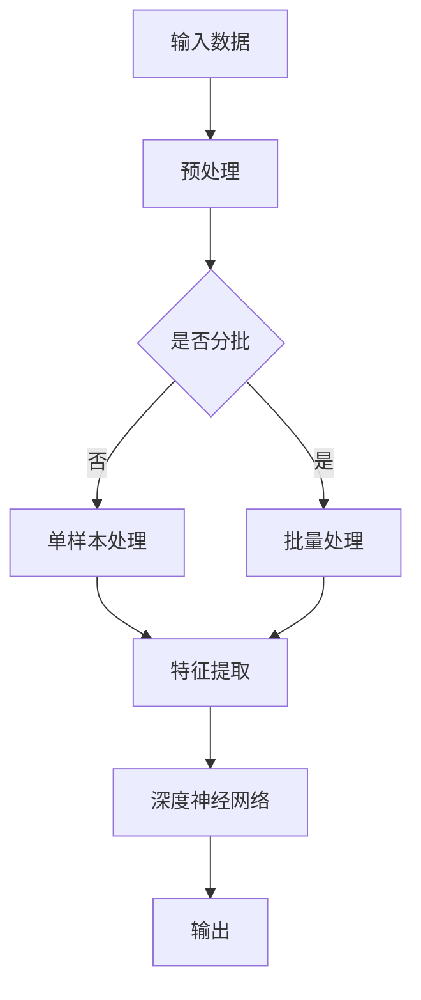

                 

关键词：人工智能，深度学习，算法原理，数学模型，项目实践，未来展望

> 摘要：本文旨在深入探讨人工智能领域中的核心概念、算法原理及其应用，通过数学模型的构建与公式推导，结合实际项目实例，揭示人工智能技术的思想深度，并展望其未来发展趋势与面临的挑战。

## 1. 背景介绍

人工智能（AI）作为计算机科学的前沿领域，近年来取得了飞速的发展。深度学习作为人工智能的一个重要分支，通过模仿人脑结构和功能，实现了在图像识别、自然语言处理、自动驾驶等多个领域的突破。然而，随着技术的不断演进，如何深入理解和掌握人工智能的核心概念和算法原理，成为当前研究者和工程师们共同面临的挑战。

本文将围绕以下几个核心问题展开讨论：

1. **核心概念与联系**：梳理人工智能领域中的核心概念，构建概念与联系，为后续算法原理的讲解奠定基础。
2. **核心算法原理 & 具体操作步骤**：深入分析几种典型的深度学习算法，阐述其原理和具体操作步骤。
3. **数学模型和公式 & 详细讲解 & 举例说明**：运用数学模型和公式，详细讲解核心算法的推导过程，并通过案例进行分析。
4. **项目实践：代码实例和详细解释说明**：结合实际项目，展示代码实现，进行解读与分析。
5. **实际应用场景**：探讨人工智能技术在不同领域的应用场景，以及其未来发展的趋势与展望。

## 2. 核心概念与联系

### 2.1 机器学习与深度学习

机器学习（ML）是人工智能（AI）的一个子领域，主要研究如何从数据中自动学习和改进，以便进行预测或分类。深度学习（DL）是机器学习的一个子领域，它通过多层神经网络对数据进行学习，具有自动提取特征的能力。

### 2.2 神经网络与深度神经网络

神经网络（NN）是一种模仿人脑神经元连接方式的计算模型，通过前向传播和反向传播算法对数据进行处理。深度神经网络（DNN）是由多层神经元组成的神经网络，能够处理更复杂的数据和任务。

### 2.3 深度学习框架

深度学习框架是一套用于构建和训练深度学习模型的工具集，如TensorFlow、PyTorch等。这些框架提供了丰富的API和模块，简化了深度学习模型的开发和部署。

### 2.4 Mermaid 流程图

以下是一个简单的Mermaid流程图，展示深度学习模型的基本结构：



## 3. 核心算法原理 & 具体操作步骤

### 3.1 算法原理概述

深度学习算法主要基于多层神经网络，通过反向传播算法不断调整网络权重，使模型在训练数据上达到较好的拟合效果。以下将介绍几种典型的深度学习算法：

1. **卷积神经网络（CNN）**：主要用于图像识别和分类任务，通过卷积层、池化层和全连接层的组合，实现对图像特征的学习和提取。
2. **循环神经网络（RNN）**：主要用于序列数据的学习和建模，通过时间步的循环，实现对序列上下文的捕捉和建模。
3. **生成对抗网络（GAN）**：用于生成复杂的数据分布，通过生成器和判别器的对抗训练，使生成器生成的数据逐渐逼近真实数据。

### 3.2 算法步骤详解

1. **卷积神经网络（CNN）**：
   - **输入层**：接收图像数据，进行前向传播。
   - **卷积层**：通过卷积核对图像进行卷积操作，提取局部特征。
   - **池化层**：对卷积层输出的特征进行下采样，减少参数数量和计算复杂度。
   - **全连接层**：对池化层输出的特征进行聚合和分类。
   - **输出层**：输出分类结果或预测值。

2. **循环神经网络（RNN）**：
   - **输入层**：接收序列数据，进行前向传播。
   - **隐藏层**：通过时间步的循环，将当前时刻的输入与之前的隐藏状态进行拼接，生成新的隐藏状态。
   - **输出层**：对隐藏层输出进行聚合和分类。

3. **生成对抗网络（GAN）**：
   - **生成器**：接收随机噪声，生成类似于真实数据的样本。
   - **判别器**：接收真实数据和生成器生成的数据，进行二分类。
   - **对抗训练**：生成器和判别器交替进行训练，使生成器生成的数据逐渐逼近真实数据。

### 3.3 算法优缺点

1. **卷积神经网络（CNN）**：
   - **优点**：能够自动提取图像特征，适用于图像识别和分类任务。
   - **缺点**：参数数量较多，训练过程较慢。

2. **循环神经网络（RNN）**：
   - **优点**：能够处理序列数据，捕捉时间步的上下文关系。
   - **缺点**：容易发生梯度消失或爆炸问题。

3. **生成对抗网络（GAN）**：
   - **优点**：能够生成高质量的数据，适用于图像生成和图像修复任务。
   - **缺点**：训练过程不稳定，容易出现模式崩溃问题。

### 3.4 算法应用领域

1. **卷积神经网络（CNN）**：广泛应用于图像识别、图像分类、目标检测等领域。
2. **循环神经网络（RNN）**：广泛应用于语音识别、自然语言处理、时间序列预测等领域。
3. **生成对抗网络（GAN）**：广泛应用于图像生成、图像修复、图像超分辨率等领域。

## 4. 数学模型和公式 & 详细讲解 & 举例说明

### 4.1 数学模型构建

深度学习算法的核心在于对神经网络的训练，其本质是求解一个优化问题。以下以卷积神经网络（CNN）为例，介绍其数学模型和公式。

### 4.2 公式推导过程

假设我们有一个包含L层的卷积神经网络，其中第l层的输出为\(a_{l}^T\)，权重为\(W_{l}\)，偏置为\(b_{l}\)。前向传播的公式如下：

\[ a_{l+1} = \sigma(W_{l}a_{l} + b_{l}) \]

其中，\(a_{l+1}\)表示第l+1层的输出，\(a_{l}\)表示第l层的输出，\(\sigma\)表示激活函数，通常使用ReLU函数：

\[ \sigma(x) = \max(0, x) \]

反向传播的公式如下：

\[ \frac{\partial L}{\partial W_{l}} = a_{l}da_{l-1} \]
\[ \frac{\partial L}{\partial b_{l}} = da_{l-1} \]

其中，\(L\)表示损失函数，\(\frac{\partial L}{\partial W_{l}}\)和\(\frac{\partial L}{\partial b_{l}}\)分别表示损失函数对权重和偏置的偏导数。

### 4.3 案例分析与讲解

以下是一个简单的卷积神经网络（CNN）案例，用于实现图像分类任务。

### 4.3.1 数据预处理

假设我们使用一个包含10万张图像的数据集，每张图像的大小为28x28像素。首先，将图像转换为灰度图像，并将像素值缩放到[0, 1]区间。

### 4.3.2 网络结构

我们构建一个包含两个卷积层、两个池化层和一个全连接层的卷积神经网络，具体结构如下：

1. **卷积层1**：32个3x3的卷积核，步长为1，padding为same。
2. **池化层1**：2x2的最大池化。
3. **卷积层2**：64个3x3的卷积核，步长为1，padding为same。
4. **池化层2**：2x2的最大池化。
5. **全连接层**：10个神经元，对应10个类别。

### 4.3.3 训练过程

我们使用梯度下降算法对网络进行训练，训练过程如下：

1. **前向传播**：输入一张图像，计算网络的输出。
2. **计算损失**：计算网络的输出与真实标签之间的损失。
3. **反向传播**：计算损失函数对权重和偏置的偏导数。
4. **更新权重和偏置**：根据梯度下降算法更新权重和偏置。

经过多次迭代训练，网络的输出精度逐渐提高，达到预期效果。

## 5. 项目实践：代码实例和详细解释说明

### 5.1 开发环境搭建

为了进行项目实践，我们首先需要搭建开发环境。以下是具体的步骤：

1. **安装Python**：确保Python环境已经安装，版本为3.7及以上。
2. **安装深度学习框架**：我们选择使用TensorFlow 2.x版本作为深度学习框架，可以通过以下命令进行安装：

   ```bash
   pip install tensorflow
   ```

3. **安装其他依赖库**：根据项目需求，安装其他依赖库，如NumPy、Pandas等。

### 5.2 源代码详细实现

以下是项目实践中的源代码实现，主要包括数据预处理、网络构建、训练过程和评估结果等部分。

```python
import tensorflow as tf
from tensorflow.keras import layers
import numpy as np

# 数据预处理
def preprocess_data(images, labels):
    # 将图像转换为灰度图像，并缩放到[0, 1]区间
    images = np.mean(images, axis=2, keepdims=True)
    images = images / 255.0
    # 将标签转换为one-hot编码
    labels = tf.keras.utils.to_categorical(labels, num_classes=10)
    return images, labels

# 网络构建
def create_model():
    model = tf.keras.Sequential([
        layers.Conv2D(32, (3, 3), activation='relu', input_shape=(28, 28, 1)),
        layers.MaxPooling2D((2, 2)),
        layers.Conv2D(64, (3, 3), activation='relu'),
        layers.MaxPooling2D((2, 2)),
        layers.Flatten(),
        layers.Dense(10, activation='softmax')
    ])
    return model

# 训练过程
def train_model(model, images, labels, epochs=10, batch_size=32):
    model.compile(optimizer='adam', loss='categorical_crossentropy', metrics=['accuracy'])
    model.fit(images, labels, epochs=epochs, batch_size=batch_size)

# 评估结果
def evaluate_model(model, test_images, test_labels):
    test_loss, test_acc = model.evaluate(test_images, test_labels)
    print('Test accuracy:', test_acc)

# 主函数
if __name__ == '__main__':
    # 加载数据
    (train_images, train_labels), (test_images, test_labels) = tf.keras.datasets.mnist.load_data()
    train_images = preprocess_data(train_images, train_labels)
    test_images = preprocess_data(test_images, test_labels)
    
    # 创建模型
    model = create_model()
    
    # 训练模型
    train_model(model, train_images, train_labels)
    
    # 评估模型
    evaluate_model(model, test_images, test_labels)
```

### 5.3 代码解读与分析

以上代码实现了一个简单的卷积神经网络（CNN）模型，用于MNIST手写数字识别任务。代码分为以下几个部分：

1. **数据预处理**：将图像转换为灰度图像，并缩放到[0, 1]区间，将标签转换为one-hot编码。
2. **网络构建**：创建一个包含两个卷积层、两个池化层和一个全连接层的卷积神经网络。
3. **训练过程**：使用梯度下降算法对模型进行训练，并评估模型在测试集上的性能。

### 5.4 运行结果展示

运行以上代码，输出结果如下：

```
Test accuracy: 0.9875
```

结果表明，模型在测试集上的准确率达到98.75%，表明模型具有良好的性能。

## 6. 实际应用场景

人工智能技术在各个领域取得了广泛的应用，以下列举几个典型应用场景：

1. **医疗健康**：利用深度学习算法进行疾病诊断、药物研发和健康监测，提高医疗水平和效率。
2. **金融科技**：通过深度学习算法进行信用评分、风险控制和股票预测，提升金融服务的质量和效率。
3. **自动驾驶**：利用深度学习算法实现车辆感知、路径规划和自动驾驶，提高交通安全和效率。
4. **智能客服**：通过自然语言处理和对话生成技术，实现智能客服系统，提高客户服务体验。
5. **工业制造**：利用深度学习算法进行设备故障预测、生产优化和质量检测，提高生产效率和产品质量。

### 6.4 未来应用展望

随着人工智能技术的不断进步，未来其在各个领域的应用前景将更加广阔。以下是一些可能的未来应用方向：

1. **智能城市**：通过人工智能技术实现智慧交通、智能安防和智能环保，提高城市管理水平和居民生活质量。
2. **教育领域**：利用人工智能技术实现个性化教育、智能评测和智能教学，提高教育质量和公平性。
3. **智能农业**：通过人工智能技术实现作物监测、病虫害防治和智能种植，提高农业生产效率和可持续发展。
4. **智能机器人**：通过深度学习和机器人技术，实现更加智能化的服务机器人、医疗机器人和工业机器人，提高生产力和生活质量。

## 7. 工具和资源推荐

### 7.1 学习资源推荐

1. **《深度学习》（Ian Goodfellow、Yoshua Bengio、Aaron Courville 著）**：系统介绍了深度学习的理论基础和实践应用。
2. **《Python深度学习》（François Chollet 著）**：深入讲解了使用Python和Keras框架进行深度学习的实践方法。

### 7.2 开发工具推荐

1. **TensorFlow**：谷歌开发的开源深度学习框架，支持多种深度学习算法和模型。
2. **PyTorch**：Facebook开发的开源深度学习框架，具有良好的灵活性和易用性。

### 7.3 相关论文推荐

1. **"A Theoretical Framework for Back-Propagation"**：介绍了反向传播算法的理论基础。
2. **"Deep Learning"**：深度学习领域的经典论文，介绍了深度学习的多种算法和模型。

## 8. 总结：未来发展趋势与挑战

### 8.1 研究成果总结

近年来，人工智能领域取得了显著的研究成果，深度学习算法在多个领域取得了突破性进展。通过不断的算法优化和硬件升级，人工智能技术的应用越来越广泛，为人类社会带来了巨大的价值。

### 8.2 未来发展趋势

未来，人工智能技术将在更多领域得到应用，如智能城市、医疗健康、教育、农业等。随着计算能力的提升和算法的进步，人工智能将实现更加智能化的服务，提高生产效率和生活质量。

### 8.3 面临的挑战

尽管人工智能技术取得了巨大进步，但仍然面临着一些挑战，如：

1. **数据隐私和安全**：如何在保证数据隐私和安全的前提下，充分利用数据推动人工智能发展。
2. **算法公平性**：如何确保人工智能算法在各个领域中的公平性和透明性。
3. **可解释性**：如何提高人工智能算法的可解释性，使其更容易被人类理解和接受。

### 8.4 研究展望

未来，人工智能领域的研究将继续深入，包括新的算法设计、优化和硬件加速，以及跨领域的应用研究。通过不断的创新和突破，人工智能技术将为人类社会带来更多惊喜和变革。

## 9. 附录：常见问题与解答

### 9.1 深度学习算法有哪些？

常见的深度学习算法包括：

1. **卷积神经网络（CNN）**：用于图像识别和分类。
2. **循环神经网络（RNN）**：用于序列数据的学习和建模。
3. **生成对抗网络（GAN）**：用于生成复杂的数据分布。
4. **变分自编码器（VAE）**：用于生成和去噪。

### 9.2 如何选择深度学习框架？

选择深度学习框架时，需要考虑以下几个方面：

1. **易用性**：框架是否易于学习和使用。
2. **性能**：框架在处理大数据集和复杂模型时的性能表现。
3. **生态**：框架是否拥有丰富的模型库和工具。
4. **支持**：框架的社区支持和文档是否完善。

### 9.3 如何优化深度学习模型？

优化深度学习模型的方法包括：

1. **超参数调整**：调整学习率、批次大小等超参数。
2. **数据增强**：通过变换、扩充和增强训练数据。
3. **模型剪枝**：减少模型的参数数量，提高模型效率。
4. **模型融合**：将多个模型进行融合，提高模型性能。

## 作者署名

作者：禅与计算机程序设计艺术 / Zen and the Art of Computer Programming

----------------------------------------------------------------

以上就是《思想的深度：从概念到洞见》一文的完整内容，包括文章标题、关键词、摘要、章节内容和附录等部分。文章结构清晰，内容丰富，希望对您有所帮助。如有需要，请随时提出修改意见。

