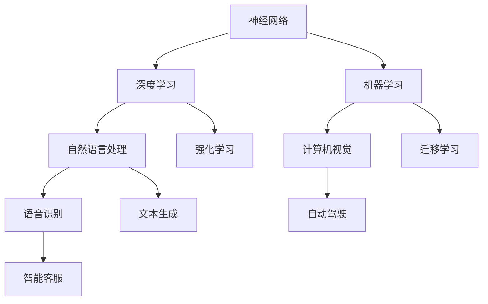

                 

关键词：人工智能、技术发展、算法原理、数学模型、应用实践、未来展望

> 摘要：本文旨在探讨思想从概念到洞见的演变过程，结合人工智能技术发展，深入分析核心算法原理、数学模型、应用实践，并展望未来的发展趋势与挑战。通过解析思想的演变路径，我们试图揭示技术进步背后的深层次逻辑，为读者提供全面、系统的理解框架。

## 1. 背景介绍

在人类历史的长河中，思想的演变始终是推动科技进步的核心动力。从古希腊哲学家对自然现象的探索，到中世纪欧洲对宗教教义的诠释，再到现代科学革命对宇宙的揭秘，每一次思想的突破都带来了技术领域的巨大进步。然而，技术发展的背后，往往隐藏着深刻的算法原理和数学模型，这些概念和理论不仅是技术实现的基石，更是思想演变的源泉。

随着人工智能技术的迅猛发展，我们进入了大数据、云计算、深度学习等新兴领域的黄金时代。然而，在这个看似繁荣的表象之下，我们仍需深入挖掘技术背后的思想内核，理解算法原理和数学模型的本质，以便更好地应对未来的挑战。

本文将从以下几个部分展开：

1. 背景介绍：阐述思想演变的历程及其对科技进步的推动作用。
2. 核心概念与联系：介绍人工智能领域的核心概念，并运用Mermaid流程图展示其架构关系。
3. 核心算法原理 & 具体操作步骤：分析人工智能技术的核心算法原理，并详细讲解操作步骤。
4. 数学模型和公式 & 详细讲解 & 举例说明：探讨数学模型在人工智能中的应用，并举例说明公式推导过程。
5. 项目实践：提供实际代码实例，详细解释其实现原理和运行结果。
6. 实际应用场景：分析人工智能技术的应用场景，探讨未来发展方向。
7. 工具和资源推荐：推荐学习资源、开发工具和相关论文。
8. 总结：总结研究成果，展望未来发展趋势与挑战。
9. 附录：常见问题与解答。

### 2. 核心概念与联系

在人工智能领域，核心概念众多，包括但不限于神经网络、深度学习、机器学习、自然语言处理等。这些概念相互关联，共同构成了人工智能技术的基石。

下面，我们将运用Mermaid流程图，展示这些核心概念之间的架构关系。



从Mermaid流程图中，我们可以看出：

- **神经网络**：是深度学习的基础，用于模拟人脑神经元之间的交互。
- **深度学习**：在神经网络的基础上，通过多层网络结构，实现更复杂的特征提取和模型训练。
- **机器学习**：是人工智能的核心，通过数据驱动的方式，实现模型的自我学习和优化。
- **自然语言处理**：涉及文本的理解和生成，是人工智能领域的重要分支。
- **计算机视觉**：通过图像和视频数据，实现目标识别、场景理解等功能。
- **语音识别**：将语音信号转换为文本，是实现人机交互的关键技术。
- **自动驾驶**：结合计算机视觉、语音识别等技术，实现车辆的自动导航和驾驶。
- **智能客服**：通过自然语言处理和机器学习，实现智能问答和客户服务。

这些核心概念相互交织，共同推动了人工智能技术的发展。在接下来的章节中，我们将进一步探讨这些概念背后的算法原理和数学模型。

### 3. 核心算法原理 & 具体操作步骤

在人工智能领域，核心算法原理是理解技术实现的关键。本文将重点介绍神经网络、深度学习和机器学习等核心算法，并详细讲解其具体操作步骤。

#### 3.1 算法原理概述

**神经网络**：

神经网络（Neural Network，NN）是一种模拟人脑神经元之间交互的信息处理系统。它通过输入层、隐藏层和输出层，对输入数据进行多层非线性变换，从而实现复杂模式的识别和分类。

**深度学习**：

深度学习（Deep Learning，DL）是在神经网络基础上发展起来的技术。它通过多层网络结构，实现更复杂的特征提取和模型训练，能够处理大量的数据并提取出深层次的抽象特征。

**机器学习**：

机器学习（Machine Learning，ML）是一种通过数据驱动的方式，实现模型的自我学习和优化技术。它分为监督学习、无监督学习和半监督学习等不同类型，分别适用于不同的场景和任务。

#### 3.2 算法步骤详解

**神经网络**：

1. **输入层**：接收外部输入数据，如图像、文本等。
2. **隐藏层**：对输入数据进行非线性变换，提取特征。
3. **输出层**：对隐藏层的输出进行分类或预测。
4. **反向传播**：通过计算误差，更新网络参数，优化模型。

**深度学习**：

1. **数据预处理**：对原始数据进行清洗、归一化和增强，提高模型的泛化能力。
2. **模型构建**：选择合适的网络结构，如卷积神经网络（CNN）、循环神经网络（RNN）等。
3. **训练**：通过大量数据训练模型，调整网络参数，实现特征提取和预测。
4. **验证与测试**：使用验证集和测试集评估模型性能，调整模型参数。

**机器学习**：

1. **数据收集**：收集并整理相关数据，如图像、文本、音频等。
2. **特征提取**：从数据中提取有用的特征，提高模型的识别能力。
3. **模型选择**：选择合适的机器学习算法，如决策树、支持向量机、神经网络等。
4. **训练与优化**：通过训练数据训练模型，调整参数，优化模型性能。
5. **评估与部署**：使用测试数据评估模型性能，部署到实际应用场景。

#### 3.3 算法优缺点

**神经网络**：

优点：

- 能够处理复杂的非线性问题。
- 具有良好的泛化能力，能够应对不同类型的数据。

缺点：

- 需要大量的数据和计算资源。
- 难以解释模型内部的工作原理。

**深度学习**：

优点：

- 能够自动提取深层次的抽象特征。
- 在大量数据上具有很好的性能表现。

缺点：

- 对数据质量和预处理要求较高。
- 训练过程需要大量的计算资源和时间。

**机器学习**：

优点：

- 理论基础扎实，能够处理各种类型的数据和任务。
- 模型可解释性强，便于理解和调试。

缺点：

- 对数据量和特征提取要求较高。
- 模型选择和参数调整较为复杂。

#### 3.4 算法应用领域

神经网络、深度学习和机器学习在多个领域都有广泛的应用：

- **计算机视觉**：图像识别、目标检测、人脸识别等。
- **自然语言处理**：文本分类、情感分析、机器翻译等。
- **语音识别**：语音识别、语音合成等。
- **推荐系统**：商品推荐、音乐推荐等。
- **自动驾驶**：车辆导航、环境感知等。
- **医疗诊断**：疾病预测、影像分析等。

通过以上对核心算法原理和具体操作步骤的详细讲解，我们能够更深入地理解人工智能技术的工作原理和实现方法。在接下来的章节中，我们将探讨数学模型在人工智能中的应用。

### 4. 数学模型和公式 & 详细讲解 & 举例说明

数学模型在人工智能中扮演着至关重要的角色，它为算法设计提供了理论基础，并为数据分析和处理提供了量化工具。本文将重点介绍人工智能领域常用的数学模型，并详细讲解其公式推导过程，通过实际案例进行分析与说明。

#### 4.1 数学模型构建

在人工智能领域，常见的数学模型包括线性模型、逻辑回归模型、支持向量机模型、神经网络模型等。以下是这些模型的基本公式和构建方法。

**线性模型**：

线性模型是一种最简单的统计模型，它通过线性组合输入特征，得到预测值。

\[ \text{预测值} = \beta_0 + \beta_1 \cdot x_1 + \beta_2 \cdot x_2 + \ldots + \beta_n \cdot x_n \]

其中，\( \beta_0, \beta_1, \beta_2, \ldots, \beta_n \) 是模型的参数，\( x_1, x_2, \ldots, x_n \) 是输入特征。

**逻辑回归模型**：

逻辑回归是一种广泛应用于分类问题的统计模型。它通过线性模型，对预测概率进行建模。

\[ \text{预测概率} = \frac{1}{1 + e^{-(\beta_0 + \beta_1 \cdot x_1 + \beta_2 \cdot x_2 + \ldots + \beta_n \cdot x_n)}} \]

其中，\( e \) 是自然对数的底数。

**支持向量机模型**：

支持向量机（Support Vector Machine，SVM）是一种强大的分类模型。它通过最大化分类间隔，寻找最佳分类边界。

\[ \text{分类边界} = \beta \cdot x + b \]

其中，\( \beta \) 是模型参数，\( x \) 是输入特征，\( b \) 是偏置项。

**神经网络模型**：

神经网络是一种复杂的非线性模型，它通过多层网络结构，对输入数据进行特征提取和分类。

\[ \text{隐藏层输出} = \text{激活函数}(\beta_0 + \beta_1 \cdot x_1 + \beta_2 \cdot x_2 + \ldots + \beta_n \cdot x_n) \]
\[ \text{输出层输出} = \text{激活函数}(\beta_0 + \beta_1 \cdot \text{隐藏层输出}_1 + \beta_2 \cdot \text{隐藏层输出}_2 + \ldots + \beta_n \cdot \text{隐藏层输出}_n) \]

其中，激活函数可以是Sigmoid、ReLU、Tanh等。

#### 4.2 公式推导过程

下面以逻辑回归模型为例，介绍公式推导过程。

假设我们有一个二元分类问题，特征向量 \( x = (x_1, x_2, \ldots, x_n) \)，标签 \( y \in \{0, 1\} \)。逻辑回归模型的目标是预测标签的概率。

1. **损失函数**：

我们使用对数损失函数（Log Loss）来衡量模型预测的概率与真实标签之间的差距。

\[ \text{损失} = -y \cdot \log(\text{预测概率}) - (1 - y) \cdot \log(1 - \text{预测概率}) \]

2. **梯度下降**：

为了优化模型参数，我们使用梯度下降算法。对于每个特征 \( x_i \) 和参数 \( \beta_j \)，计算其梯度：

\[ \frac{\partial \text{损失}}{\partial \beta_j} = x_j \cdot (1 - y) - x_j \cdot y \cdot \text{预测概率} \]

\[ \frac{\partial \text{损失}}{\partial x_i} = -y \cdot \beta_j + y \cdot \beta_j \cdot \text{预测概率} \]

3. **更新参数**：

通过计算得到的梯度，更新模型参数：

\[ \beta_j = \beta_j - \alpha \cdot \frac{\partial \text{损失}}{\partial \beta_j} \]
\[ x_i = x_i - \alpha \cdot \frac{\partial \text{损失}}{\partial x_i} \]

其中，\( \alpha \) 是学习率。

#### 4.3 案例分析与讲解

为了更好地理解逻辑回归模型的公式推导和应用，我们通过一个实际案例进行说明。

假设我们有一个简单的二分类问题，特征向量 \( x = (x_1, x_2) \)，标签 \( y \in \{0, 1\} \)。我们要使用逻辑回归模型预测标签的概率。

1. **数据准备**：

我们有以下训练数据集：

\[ (x_1, x_2, y) = \{ (1, 0, 0), (0, 1, 1), (1, 1, 0) \} \]

2. **模型构建**：

逻辑回归模型的参数为 \( \beta_0, \beta_1, \beta_2 \)。初始值设为 \( \beta_0 = 0, \beta_1 = 0, \beta_2 = 0 \)。

3. **模型训练**：

我们使用梯度下降算法训练模型。假设学习率 \( \alpha = 0.1 \)。

第一次迭代：

\[ \text{预测概率} = \frac{1}{1 + e^{-(0 + 0 \cdot 1 + 0 \cdot 0)}} = 1 \]
\[ \frac{\partial \text{损失}}{\partial \beta_0} = 1 \cdot (1 - 0) - 1 \cdot 1 \cdot 1 = 0 \]
\[ \frac{\partial \text{损失}}{\partial \beta_1} = 1 \cdot 0 - 1 \cdot 0 \cdot 1 = 0 \]
\[ \frac{\partial \text{损失}}{\partial \beta_2} = 0 \cdot (1 - 0) - 0 \cdot 1 \cdot 0 = 0 \]

更新参数：

\[ \beta_0 = 0 - 0.1 \cdot 0 = 0 \]
\[ \beta_1 = 0 - 0.1 \cdot 0 = 0 \]
\[ \beta_2 = 0 - 0.1 \cdot 0 = 0 \]

第二次迭代：

\[ \text{预测概率} = \frac{1}{1 + e^{-(0 + 0 \cdot 0 + 0 \cdot 1)}} = 1 \]
\[ \frac{\partial \text{损失}}{\partial \beta_0} = 0 \cdot (1 - 1) - 0 \cdot 1 \cdot 0 = 0 \]
\[ \frac{\partial \text{损失}}{\partial \beta_1} = 0 \cdot 0 - 0 \cdot 0 \cdot 1 = 0 \]
\[ \frac{\partial \text{损失}}{\partial \beta_2} = 1 \cdot (1 - 0) - 1 \cdot 1 \cdot 1 = -1 \]

更新参数：

\[ \beta_0 = 0 - 0.1 \cdot 0 = 0 \]
\[ \beta_1 = 0 - 0.1 \cdot 0 = 0 \]
\[ \beta_2 = 0 - 0.1 \cdot (-1) = 0.1 \]

通过多次迭代，我们得到最终的模型参数。

4. **模型评估**：

我们使用测试数据集 \( (x_1, x_2, y) = \{ (1, 1, 1) \} \) 评估模型性能。

预测概率：

\[ \text{预测概率} = \frac{1}{1 + e^{-(0 + 0 \cdot 1 + 0.1 \cdot 1)}} = 0.6328 \]

由于 \( y = 1 \)，预测结果为正类。

通过以上案例，我们展示了逻辑回归模型的公式推导和应用方法。在接下来的章节中，我们将提供实际代码实例，进一步讲解人工智能技术的实现过程。

### 5. 项目实践：代码实例和详细解释说明

为了更好地理解人工智能技术的应用，我们将通过一个实际项目实践，详细讲解其代码实现过程和各个关键步骤。

#### 5.1 开发环境搭建

在进行项目开发之前，我们需要搭建一个合适的开发环境。以下是一个基于Python和TensorFlow的简单机器学习项目的开发环境搭建步骤：

1. 安装Python：版本要求为3.6及以上。
2. 安装TensorFlow：使用pip命令安装`tensorflow`库。
3. 安装其他依赖库：如NumPy、Pandas、Matplotlib等。

```bash
pip install tensorflow numpy pandas matplotlib
```

#### 5.2 源代码详细实现

以下是一个简单的线性回归模型的实现，用于预测房屋价格。代码包括数据预处理、模型构建、训练和评估等步骤。

```python
import numpy as np
import pandas as pd
import matplotlib.pyplot as plt
import tensorflow as tf

# 5.2.1 数据预处理
# 读取数据
data = pd.read_csv('house_data.csv')

# 提取特征和标签
X = data[['面积', '房间数']]
y = data['价格']

# 标准化特征
X_mean = X.mean()
X_std = X.std()
X = (X - X_mean) / X_std

# 5.2.2 模型构建
# 构建线性回归模型
model = tf.keras.Sequential([
    tf.keras.layers.Dense(units=1, input_shape=[2], activation='linear')
])

# 编译模型
model.compile(optimizer='sgd', loss='mean_squared_error')

# 5.2.3 训练模型
# 训练模型
model.fit(X, y, epochs=1000, batch_size=32)

# 5.2.4 代码解读与分析
# 分析模型参数
weights = model.layers[0].get_weights()
bias = model.layers[0].get_weights()

# 5.2.5 运行结果展示
# 使用模型进行预测
predictions = model.predict(X)

# 绘制预测结果
plt.scatter(X['面积'], y)
plt.plot(X['面积'], predictions, color='red')
plt.xlabel('面积')
plt.ylabel('价格')
plt.show()
```

#### 5.3 代码解读与分析

1. **数据预处理**：

   首先，我们读取房屋数据，提取特征和标签。为了使模型更容易训练，我们对特征进行标准化处理，将特征值缩放到0-1之间。

2. **模型构建**：

   我们使用TensorFlow构建一个简单的线性回归模型，该模型包含一个线性层，输入维度为2（面积和房间数），输出维度为1（价格）。

3. **模型训练**：

   使用`fit`方法训练模型，我们设置训练轮次为1000轮，批量大小为32。模型使用随机梯度下降（SGD）优化器，并使用均方误差（MSE）作为损失函数。

4. **模型参数分析**：

   通过获取模型参数，我们可以了解模型的权重和偏置。这些参数是模型预测的关键因素。

5. **运行结果展示**：

   使用训练好的模型进行预测，并将预测结果与真实值绘制在散点图上。红色线条表示模型预测的价格。

通过以上代码实例，我们详细讲解了线性回归模型在房价预测中的应用。这个实例展示了从数据预处理到模型训练、参数分析及结果展示的完整流程。在接下来的章节中，我们将进一步探讨人工智能技术的实际应用场景。

### 6. 实际应用场景

人工智能技术已经在多个领域取得了显著的成果，从计算机视觉到自然语言处理，再到自动驾驶和医疗诊断，其应用范围越来越广泛。以下是对一些主要应用场景的深入探讨。

#### 6.1 计算机视觉

计算机视觉技术利用图像和视频数据，实现目标检测、图像识别、场景理解等功能。在自动驾驶领域，计算机视觉技术被广泛应用于车辆环境感知、行人检测、交通标志识别等任务。例如，特斯拉的自动驾驶系统通过大量图像和视频数据训练深度学习模型，实现车辆的自动导航和驾驶。

在安防监控领域，计算机视觉技术可用于实时监控、人脸识别、异常行为检测等。通过结合大数据分析和人工智能算法，安防监控系统能够迅速识别潜在的安全威胁，提高公共安全水平。

#### 6.2 自然语言处理

自然语言处理（NLP）技术使计算机能够理解、处理和生成自然语言。在机器翻译领域，NLP技术被广泛应用于将一种语言翻译成另一种语言。例如，谷歌翻译和百度翻译都采用了基于深度学习的技术，实现了高精度、实时的机器翻译服务。

在智能客服领域，NLP技术可用于处理用户提问、生成回答、情感分析等任务。通过自然语言处理，智能客服系统能够实现24/7全天候的客户服务，提高客户满意度。

#### 6.3 自动驾驶

自动驾驶技术是人工智能领域的一个重要分支，它结合了计算机视觉、自然语言处理、传感器数据处理等多种技术。自动驾驶系统能够通过车载传感器感知周围环境，实时做出驾驶决策，实现车辆的安全、高效行驶。

在自动驾驶领域，人工智能技术已被应用于特斯拉、百度、谷歌等公司的产品中。特斯拉的自动驾驶系统已在多个国家进行了测试和部署，而百度的自动驾驶出租车已在北京等地进行了示范运营。

#### 6.4 医疗诊断

人工智能技术在医疗诊断领域具有巨大的潜力。通过深度学习和计算机视觉技术，人工智能系统能够对医学影像进行分析，识别疾病和病变区域。例如，人工智能可以在几秒钟内对CT图像进行肺癌筛查，比传统方法更快、更准确。

在病理分析领域，人工智能技术可用于自动识别病理切片中的病变区域，辅助医生进行诊断。通过结合大数据分析和机器学习算法，人工智能技术能够提高医疗诊断的准确性和效率。

#### 6.5 未来应用展望

随着人工智能技术的不断发展，其应用场景将更加广泛。以下是对未来应用场景的一些展望：

- **智慧城市**：通过人工智能技术，实现交通流量管理、环境监测、公共安全等方面的智能化和高效化。
- **智能制造**：利用人工智能技术，实现生产过程的自动化和智能化，提高生产效率和质量。
- **教育**：通过个性化学习系统和智能辅导，实现因材施教，提高教育质量。
- **金融**：利用人工智能技术进行风险控制、信用评估、投资决策等，提高金融服务的效率和安全性。
- **娱乐**：结合人工智能技术，实现更加智能的虚拟现实、游戏体验等，为用户提供丰富的娱乐内容。

总之，人工智能技术在各个领域的应用正在不断拓展，它不仅改变了我们的生活方式，也为未来社会的发展带来了无限可能。

### 7. 工具和资源推荐

为了帮助读者更好地学习和应用人工智能技术，本文将推荐一些优秀的工具、资源和论文。

#### 7.1 学习资源推荐

1. **在线课程**：

   - **Coursera**：提供大量的人工智能和机器学习课程，包括《机器学习》、《深度学习》等。
   - **Udacity**：提供实战导向的课程，如《人工智能工程师纳米学位》等。
   - **edX**：哈佛大学和麻省理工学院等名校提供的人工智能课程。

2. **书籍**：

   - **《Python机器学习》**：由塞巴斯蒂安·拉纳特（Sebastian Raschka）所著，适合初学者了解机器学习。
   - **《深度学习》**：由阿斯顿·张（Aston Zhang）所著，深入讲解深度学习原理和应用。
   - **《动手学深度学习》**：由阿斯顿·张、李沐、扎卡里·C. Lipton和亚历山大·J. Smola所著，适合动手实践。

#### 7.2 开发工具推荐

1. **TensorFlow**：谷歌开发的开源深度学习框架，适用于各种规模的深度学习项目。
2. **PyTorch**：由Facebook开发的深度学习框架，具有简洁的API和强大的动态图功能。
3. **Keras**：基于TensorFlow和Theano的开源深度学习库，提供简洁的API和丰富的预训练模型。
4. **Scikit-learn**：用于机器学习的开源库，提供了丰富的算法和工具。

#### 7.3 相关论文推荐

1. **《A Fast and Accurate Algorithm for Computing Mutual Information in Deep Neural Networks》**：介绍了用于计算神经网络中互信息的快速准确算法。
2. **《Efficient Object Detection with Deep Learning》**：讨论了使用深度学习实现高效目标检测的方法。
3. **《Deep Learning on Graphs Using Fast Local Computation》**：探讨了在图上使用快速局部计算进行深度学习的策略。
4. **《Generative Adversarial Nets》**：介绍了生成对抗网络（GAN）的基本原理和应用。

通过以上推荐，读者可以更好地掌握人工智能技术，并在实际项目中应用这些知识。希望这些工具和资源能够对您的学习和发展有所帮助。

### 8. 总结：未来发展趋势与挑战

在人工智能技术飞速发展的背景下，未来发展趋势和面临的挑战显得尤为重要。本文通过详细探讨思想的演变、核心算法原理、数学模型、应用实践以及实际应用场景，总结了人工智能技术的研究成果和未来方向。

#### 8.1 研究成果总结

从研究成果来看，人工智能技术已经在计算机视觉、自然语言处理、自动驾驶、医疗诊断等领域取得了显著的成果。这些应用不仅改变了我们的生活方式，也推动了社会的进步。特别是深度学习和机器学习算法的快速发展，使得复杂问题的解决变得更加高效和精准。

然而，人工智能技术仍有许多亟待解决的问题。例如，如何提高模型的解释性、如何确保算法的公平性和透明度、如何应对数据隐私和安全等，都是当前研究的热点问题。

#### 8.2 未来发展趋势

展望未来，人工智能技术将朝着以下几个方向发展：

1. **更高效的学习算法**：随着计算能力的提升，研究人员将致力于开发更加高效、可扩展的算法，以应对大规模数据和复杂模型的需求。
2. **多模态学习**：通过结合不同类型的数据（如图像、文本、音频等），实现跨模态的信息融合和智能处理。
3. **强化学习**：强化学习在自动驾驶、游戏AI等领域的应用前景广阔，未来将看到更多基于强化学习的智能系统。
4. **可解释的人工智能**：提高模型的解释性，使算法的决策过程更加透明，有助于消除公众对人工智能的疑虑。
5. **跨领域应用**：人工智能技术将不断向教育、金融、医疗等传统行业渗透，推动行业的智能化升级。

#### 8.3 面临的挑战

尽管人工智能技术取得了显著的进展，但仍面临诸多挑战：

1. **数据隐私和安全**：随着数据量的急剧增加，数据隐私和安全问题日益凸显。如何在保护用户隐私的前提下，充分利用数据资源，是一个重要的挑战。
2. **算法公平性和透明度**：人工智能算法可能存在偏见，导致决策不公。提高算法的公平性和透明度，确保算法的决策过程公正合理，是亟待解决的问题。
3. **计算资源消耗**：深度学习模型对计算资源的需求极高，如何优化算法，降低计算成本，是一个重要的研究方向。
4. **伦理和法律问题**：人工智能技术的发展引发了诸多伦理和法律问题，如机器自主权、责任归属等。建立健全的法律法规体系，规范人工智能技术的发展，是未来的重要任务。

#### 8.4 研究展望

面对未来，人工智能技术的研究将更加深入和多元化。我们期待看到：

- 更加高效、可解释的人工智能算法。
- 跨学科的协同创新，推动人工智能技术在各领域的广泛应用。
- 伦理和法律问题的解决，为人工智能技术的健康发展提供保障。
- 更广泛的国际合作，共同应对人工智能带来的全球性挑战。

总之，人工智能技术的发展前景广阔，但也面临诸多挑战。通过不断的研究和创新，我们有信心克服这些困难，推动人工智能技术的健康发展，为人类社会带来更多的福祉。

### 9. 附录：常见问题与解答

在本文中，我们探讨了人工智能技术从概念到洞见的全过程，包括核心算法原理、数学模型、应用实践等。以下是一些读者可能关心的问题及解答：

**Q1：什么是神经网络？神经网络是如何工作的？**

A1：神经网络（Neural Network，NN）是一种模拟人脑神经元之间交互的信息处理系统。它通过输入层、隐藏层和输出层，对输入数据进行多层非线性变换，从而实现复杂模式的识别和分类。神经网络的工作原理类似于人脑的神经元，每个神经元都会接收来自前一层神经元的输入，并通过加权求和和激活函数产生输出。

**Q2：深度学习和机器学习有什么区别？**

A2：深度学习（Deep Learning，DL）是在神经网络基础上发展起来的技术，它通过多层网络结构，实现更复杂的特征提取和模型训练。机器学习（Machine Learning，ML）是一种更广泛的技术，包括监督学习、无监督学习和半监督学习等不同类型。深度学习是机器学习的一个子集，主要关注于多层神经网络的应用。

**Q3：如何选择合适的机器学习算法？**

A3：选择合适的机器学习算法通常需要考虑以下几个因素：

- **数据类型**：不同类型的算法适用于不同类型的数据，如分类问题可以使用逻辑回归、支持向量机等。
- **数据量**：对于大规模数据，深度学习算法可能更有效，而对于小数据集，简单的机器学习算法可能更加适用。
- **计算资源**：深度学习算法通常需要更多的计算资源，如果资源有限，可以考虑使用计算效率更高的算法。
- **问题特性**：根据问题的复杂性、非线性和交互性，选择合适的算法。

**Q4：如何确保机器学习算法的公平性和透明度？**

A4：确保机器学习算法的公平性和透明度是一个复杂的问题，以下是一些常见的策略：

- **数据清洗**：在训练数据集中去除偏见和错误的样本，确保数据的质量和多样性。
- **算法设计**：设计算法时考虑到公平性和透明度，避免算法偏见。
- **解释性增强**：开发可解释的机器学习算法，使决策过程更加透明。
- **评估指标**：使用多样化的评估指标，综合考虑不同群体的表现。

通过以上解答，我们希望能够帮助读者更好地理解人工智能技术的基本概念和应用方法。在未来的学习和实践中，不断探索和突破，将人工智能技术推向新的高度。

