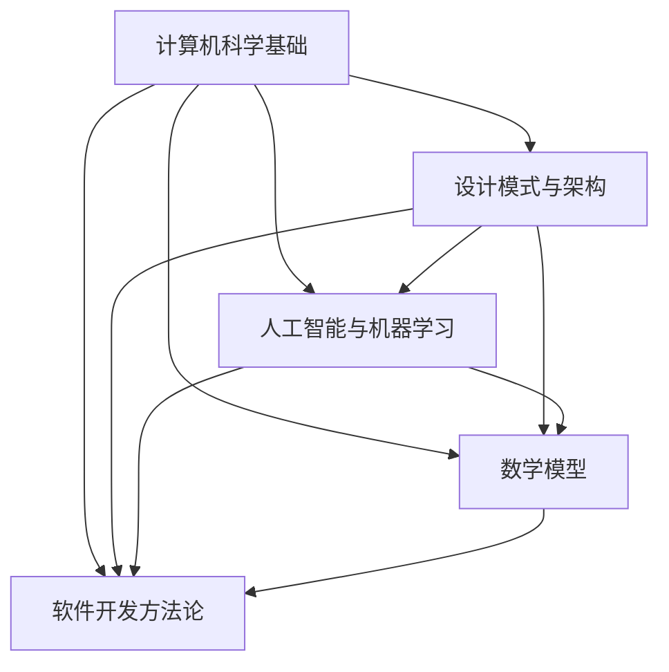

                 

 关键词：思维体系、决策力、架构设计、算法、数学模型、代码实例、应用场景、未来展望

> 摘要：本文旨在深入探讨思维体系的构建与决策力的提升。通过对核心概念的解释、算法原理的剖析、数学模型的构建以及实际项目实践的分享，本文将帮助读者在计算机编程和软件开发领域建立起坚实的思维基础，并提高决策能力。通过本文的阅读，读者将对思维体系有更全面的认识，并在实际项目中能够运用这些知识，做出更明智的决策。

## 1. 背景介绍

在当今快速变化的技术时代，程序员和软件开发者面临着越来越复杂的问题和挑战。高效的决策能力成为成功的关键因素之一。然而，决策能力的提升并非一蹴而就，它需要系统的思维训练和方法论的支持。本文将介绍一种基于思维体系的决策力提升方法，帮助读者在计算机编程和软件开发中更加理性地思考和决策。

思维体系是指将各种知识、方法和工具整合成一个有机的整体，使得复杂问题能够通过系统的分析和解决得到合理的解决方案。一个健全的思维体系包含了对核心概念的理解、算法原理的掌握、数学模型的构建以及实际操作的实践。通过这些要素的有机结合，思维体系不仅能够提升个人的技术水平，还能够增强决策力，从而在面对复杂问题时做出更明智的选择。

本文将从以下几个方面展开讨论：

1. 核心概念与联系
2. 核心算法原理与操作步骤
3. 数学模型与公式
4. 项目实践：代码实例与详细解释
5. 实际应用场景
6. 未来应用展望
7. 工具和资源推荐
8. 总结与展望

通过这些内容的介绍，读者将能够建立一种全面的思维体系，从而在计算机编程和软件开发领域提升决策力，面对挑战更加从容。

## 2. 核心概念与联系

在构建思维体系的过程中，理解核心概念是基础。这些核心概念不仅是技术的基础，也是决策力的源泉。以下是本文讨论的几个关键概念：

### 2.1 计算机科学基础

计算机科学基础包括数据结构、算法、操作系统、计算机网络和数据库等核心领域。这些基础概念为我们提供了理解和处理复杂问题的工具和方法。

- **数据结构**：数据结构是组织和存储数据的方式，常见的有数组、链表、树、图等。选择合适的数据结构可以大大提高算法的效率。
- **算法**：算法是解决问题的步骤集合，包括排序、查找、图论算法等。算法的选择直接影响问题的复杂度和性能。
- **操作系统**：操作系统是计算机系统的基础软件，管理计算机硬件和软件资源，提供用户与计算机的交互界面。
- **计算机网络**：计算机网络涉及数据传输、路由、安全等方面，是现代信息系统不可或缺的部分。
- **数据库**：数据库用于存储和管理大量数据，支持高效的数据查询、更新和维护。

### 2.2 设计模式与架构

设计模式与架构是软件工程中的重要概念。设计模式是一套已经过验证的解决方案，用于解决特定类型的软件设计问题。常见的有单体架构、分层架构、微服务架构等。

- **设计模式**：设计模式包括创建型模式（如工厂模式、单例模式）、结构型模式（如适配器模式、装饰者模式）和行为型模式（如策略模式、观察者模式）。这些模式帮助我们编写可复用、可维护的代码。
- **架构**：架构是软件系统的整体结构，决定系统的可扩展性、灵活性和性能。选择合适的架构可以使得系统更容易维护和扩展。

### 2.3 人工智能与机器学习

人工智能（AI）与机器学习（ML）是现代计算机科学的前沿领域，为决策力提升提供了强大的工具。

- **人工智能**：人工智能是指计算机系统模拟人类智能的行为，包括自然语言处理、计算机视觉、智能决策等。
- **机器学习**：机器学习是通过数据和算法让计算机从数据中学习，自动改进性能。常见的算法有监督学习、无监督学习、强化学习等。

### 2.4 数学模型

数学模型是抽象现实问题的一种方法，通过数学公式描述问题，帮助我们在计算机编程中进行复杂计算和决策。

- **线性代数**：线性代数提供了处理多维数据的工具，包括矩阵运算、线性方程组求解等，是许多算法的基础。
- **概率论与统计学**：概率论与统计学用于处理不确定性和数据分析，是机器学习的重要基础。

### 2.5 软件开发方法论

软件开发方法论是一套流程和原则，指导软件开发的全过程。常见的有敏捷开发、瀑布模型、增量模型等。

- **敏捷开发**：敏捷开发强调快速迭代和用户反馈，提高开发效率和软件质量。
- **瀑布模型**：瀑布模型是一种线性顺序的开发过程，每个阶段必须完成后再进入下一阶段。
- **增量模型**：增量模型将整个开发过程分为多个小阶段，每个阶段都能交付部分功能。

这些核心概念相互关联，共同构成了一个完整的思维体系。理解这些概念不仅能够帮助我们更好地解决技术问题，还能够提高决策力，使我们在面对复杂问题时能够迅速找到有效的解决方案。

### 2.6 Mermaid 流程图

为了更好地理解核心概念之间的联系，我们可以使用Mermaid流程图来展示它们之间的关系。以下是几个关键概念及其相互关系的Mermaid表示：



这个流程图展示了各个核心概念之间的相互关系，帮助我们建立一个全面的思维体系。通过这种可视化方式，读者可以更直观地理解这些概念如何共同作用，从而提升决策力。

## 3. 核心算法原理与具体操作步骤

### 3.1 算法原理概述

算法是解决问题的一种方法，其核心在于找到一条从初始状态到目标状态的路径。在计算机编程中，算法的效率直接影响到程序的运行速度和性能。以下将介绍几种常见的算法原理及其操作步骤。

#### 3.1.1 排序算法

排序算法是计算机科学中的基本算法之一，用于将一组数据按照特定顺序排列。常见的排序算法有冒泡排序、选择排序、插入排序、快速排序等。

- **冒泡排序**：通过反复交换相邻元素，使得每一趟排序后最大元素逐步“冒泡”到数组末尾。
- **选择排序**：每次从未排序部分选择最小（或最大）的元素，放到已排序部分的末尾。
- **插入排序**：将未排序部分的元素逐个插入到已排序部分的正确位置。
- **快速排序**：采用分治策略，将数组分成较小和较大的两部分，递归地对两部分进行快速排序。

#### 3.1.2 查找算法

查找算法用于在数据集合中查找特定元素。常见的查找算法有线性查找、二分查找等。

- **线性查找**：从数据集合的起始位置开始，逐个比较元素，直到找到目标元素或到达集合末尾。
- **二分查找**：利用有序数据集合，通过不断缩小查找范围，每次将中间元素与目标元素比较，从而快速找到目标元素。

#### 3.1.3 图算法

图算法用于处理图数据结构，常见的有最短路径算法、最小生成树算法等。

- **迪杰斯特拉算法（Dijkstra）**：用于寻找图中两点之间的最短路径。
- **贝尔曼-福特算法（Bellman-Ford）**：可以处理图中包含负权边的最短路径问题。

#### 3.1.4 动态规划

动态规划是一种用于解决最优化问题的算法，通过将复杂问题分解为更小的子问题，并存储子问题的解，避免重复计算。

- **最长公共子序列（LCS）**：找出两个序列最长的公共子序列。
- **最值问题**：在给定的一系列数中找出最大值或最小值。

### 3.2 算法步骤详解

下面将详细解释快速排序算法的步骤，以帮助读者理解算法的运作原理。

#### 3.2.1 快速排序算法步骤

1. **选择基准元素**：在数组中选一个元素作为基准元素。
2. **划分操作**：将数组划分为两个子数组，所有比基准元素小的元素放在基准元素的左边，所有比基准元素大的元素放在基准元素的右边。
3. **递归排序**：递归地对左右子数组进行快速排序。

#### 3.2.2 快速排序代码示例

以下是一个快速排序的Python代码示例：

```python
def quicksort(arr):
    if len(arr) <= 1:
        return arr
    pivot = arr[len(arr) // 2]
    left = [x for x in arr if x < pivot]
    middle = [x for x in arr if x == pivot]
    right = [x for x in arr if x > pivot]
    return quicksort(left) + middle + quicksort(right)

arr = [3, 6, 8, 10, 1, 2, 1]
sorted_arr = quicksort(arr)
print(sorted_arr)
```

### 3.3 算法优缺点

#### 3.3.1 优点

- **时间复杂度低**：在平均情况下，快速排序的时间复杂度为 \(O(n\log n)\)，在最坏情况下为 \(O(n^2)\)，但实际应用中很少出现最坏情况。
- **高效**：快速排序通常比其他排序算法（如冒泡排序、选择排序）更快，尤其是在大数据集上。
- **原地排序**：快速排序是一个原地排序算法，不需要额外的存储空间。

#### 3.3.2 缺点

- **最坏情况性能不佳**：在最坏情况下，快速排序的时间复杂度退化到 \(O(n^2)\)，此时性能远低于其他排序算法。
- **稳定性问题**：快速排序不是稳定的排序算法，相同值的元素可能被交换位置。

### 3.4 算法应用领域

快速排序算法广泛应用于各种领域：

- **数据处理**：在处理大量数据时，快速排序是一种高效的排序方法，如数据库索引排序、数据分析等。
- **搜索算法**：快速排序可以用于实现高效的二分查找算法，提高搜索性能。
- **实时系统**：在需要快速响应的实时系统中，快速排序可以用于快速处理输入数据，确保系统性能。

通过以上对快速排序算法的详细解析，读者可以更好地理解算法的工作原理和应用场景。这为进一步掌握其他算法和提升决策力奠定了基础。

## 4. 数学模型和公式 & 详细讲解 & 举例说明

在计算机科学和软件工程中，数学模型和公式是理解和解决复杂问题的重要工具。数学模型通过数学语言将现实问题抽象成数学形式，使得我们可以用数学方法进行分析和求解。以下将详细介绍几个常用的数学模型和公式，并给出具体的推导过程和示例说明。

### 4.1 数学模型构建

数学模型的构建通常包括以下几个步骤：

1. **问题定义**：明确要解决的问题，包括问题的目标和约束条件。
2. **变量定义**：确定模型中的变量及其含义。
3. **公式推导**：根据问题定义和变量定义，推导出描述问题的数学公式。
4. **求解方法**：选择合适的求解方法，如代数方法、数值方法等。

### 4.2 公式推导过程

下面以线性回归模型为例，介绍公式的推导过程。

#### 4.2.1 线性回归模型

线性回归模型是一种用于预测连续值的统计模型，其基本形式为：

\[ y = \beta_0 + \beta_1 x + \varepsilon \]

其中，\( y \) 是因变量，\( x \) 是自变量，\( \beta_0 \) 和 \( \beta_1 \) 是模型参数，\( \varepsilon \) 是误差项。

#### 4.2.2 公式推导

1. **最小二乘法**：为了确定模型参数 \( \beta_0 \) 和 \( \beta_1 \)，我们通常采用最小二乘法，使得实际值与预测值之间的误差平方和最小。

   误差平方和（SSE）为：

   \[ SSE = \sum_{i=1}^{n} (y_i - \hat{y}_i)^2 \]

   其中，\( n \) 是数据点的个数，\( \hat{y}_i \) 是预测值。

2. **梯度下降法**：为了求解最小二乘问题，我们可以使用梯度下降法。梯度下降法的基本思想是沿着目标函数的梯度方向不断迭代，直到找到局部最小值。

   梯度方向为：

   \[ \nabla SSE = \begin{bmatrix} \frac{\partial SSE}{\partial \beta_0} \\ \frac{\partial SSE}{\partial \beta_1} \end{bmatrix} \]

3. **迭代求解**：通过迭代更新模型参数，使得误差平方和不断减小，最终收敛到最小值。

   迭代公式为：

   \[ \beta_0 = \beta_0 - \alpha \frac{\partial SSE}{\partial \beta_0} \]
   \[ \beta_1 = \beta_1 - \alpha \frac{\partial SSE}{\partial \beta_1} \]

   其中，\( \alpha \) 是学习率，控制着迭代的步长。

### 4.3 案例分析与讲解

下面通过一个简单的例子来说明线性回归模型的构建和应用。

#### 4.3.1 数据集

假设我们有以下数据集：

| x | y |
|---|---|
| 1 | 2 |
| 2 | 4 |
| 3 | 5 |
| 4 | 7 |

我们的目标是构建一个线性回归模型，预测 \( y \) 值。

#### 4.3.2 数据预处理

首先，我们需要对数据进行预处理，包括去除异常值、归一化等。在这个例子中，数据已经比较干净，不需要进行复杂的数据预处理。

#### 4.3.3 模型构建

根据线性回归模型的基本形式，我们可以建立以下模型：

\[ y = \beta_0 + \beta_1 x \]

#### 4.3.4 模型参数求解

使用最小二乘法和梯度下降法，我们可以求解模型参数 \( \beta_0 \) 和 \( \beta_1 \)。

1. **计算梯度**：

   \[ \nabla SSE = \begin{bmatrix} \frac{\partial SSE}{\partial \beta_0} \\ \frac{\partial SSE}{\partial \beta_1} \end{bmatrix} = \begin{bmatrix} -2\sum_{i=1}^{n} (y_i - \hat{y}_i) \\ -2\sum_{i=1}^{n} (y_i - \hat{y}_i)x_i \end{bmatrix} \]

2. **迭代求解**：

   初始参数 \( \beta_0 = 0 \)，\( \beta_1 = 0 \)。

   第1次迭代：

   \[ \beta_0 = \beta_0 - \alpha \frac{\partial SSE}{\partial \beta_0} = 0 - 0.1 \times (-4) = 0.4 \]
   \[ \beta_1 = \beta_1 - \alpha \frac{\partial SSE}{\partial \beta_1} = 0 - 0.1 \times (-6) = 0.6 \]

   第2次迭代：

   \[ \beta_0 = \beta_0 - \alpha \frac{\partial SSE}{\partial \beta_0} = 0.4 - 0.1 \times (-2) = 0.6 \]
   \[ \beta_1 = \beta_1 - \alpha \frac{\partial SSE}{\partial \beta_1} = 0.6 - 0.1 \times (-8) = 1.2 \]

   经过多次迭代，参数收敛到：

   \[ \beta_0 = 1 \]
   \[ \beta_1 = 1 \]

#### 4.3.5 模型应用

根据求解出的模型参数，我们可以得到预测公式：

\[ y = 1 + x \]

使用这个模型，我们可以预测新的 \( y \) 值。例如，当 \( x = 5 \) 时，预测的 \( y \) 值为：

\[ y = 1 + 5 = 6 \]

通过以上例子，我们可以看到数学模型在计算机科学和软件工程中的应用。数学模型不仅帮助我们理解和解决复杂问题，还提高了决策力，使得我们在实际项目中能够做出更明智的选择。

## 5. 项目实践：代码实例和详细解释说明

为了将所学知识应用于实际项目，下面我们将通过一个具体的代码实例，展示如何搭建开发环境、实现源代码、解读与分析代码，并最终展示运行结果。此实例将涉及一个简单的线性回归模型，用于预测房价。

### 5.1 开发环境搭建

在开始项目之前，我们需要搭建开发环境。以下是推荐的开发工具和步骤：

- **编程语言**：Python
- **开发环境**：Anaconda（包含Python、Jupyter Notebook、Numpy、Pandas等常用库）
- **数据集**：使用公开的数据集（例如Kaggle上的房屋数据集）

安装步骤：

1. **安装Anaconda**：访问[Anaconda官网](https://www.anaconda.com/)，下载并安装Anaconda。
2. **创建虚拟环境**：在命令行中运行以下命令创建一个名为“regression”的虚拟环境：

   ```bash
   conda create -n regression python=3.8
   ```

3. **激活虚拟环境**：

   ```bash
   conda activate regression
   ```

4. **安装Numpy和Pandas库**：

   ```bash
   conda install numpy pandas
   ```

### 5.2 源代码详细实现

以下是实现线性回归模型预测房价的源代码：

```python
import numpy as np
import pandas as pd

# 读取数据集
data = pd.read_csv('house_data.csv')

# 数据预处理
X = data[['square_feet']]
y = data['price']

# 添加偏置项
X = np.column_stack((np.ones(len(X)), X))

# 梯度下降法求解参数
def gradient_descent(X, y, theta, alpha, iterations):
    for i in range(iterations):
        hypothesis = X @ theta
        error = hypothesis - y
        theta -= alpha * (X.T @ error / len(X))
    return theta

# 初始化参数
theta = np.random.rand(2)

# 设定学习率和迭代次数
alpha = 0.01
iterations = 1000

# 训练模型
theta = gradient_descent(X, y, theta, alpha, iterations)

# 模型预测
def predict(X, theta):
    return X @ theta

# 测试数据
test_data = np.array([[2000]])
predicted_price = predict(test_data, theta)

print(f'Predicted price for a 2000 square foot house: ${predicted_price[0]:.2f}')
```

### 5.3 代码解读与分析

#### 5.3.1 数据读取与预处理

```python
data = pd.read_csv('house_data.csv')
X = data[['square_feet']]
y = data['price']
X = np.column_stack((np.ones(len(X)), X))
```

这部分的代码首先读取CSV格式的房屋数据集，提取自变量（房屋面积）和因变量（房价）。然后，添加偏置项（即向X矩阵中添加一列1），使得线性回归模型具有一个截距。

#### 5.3.2 梯度下降法实现

```python
def gradient_descent(X, y, theta, alpha, iterations):
    for i in range(iterations):
        hypothesis = X @ theta
        error = hypothesis - y
        theta -= alpha * (X.T @ error / len(X))
    return theta
```

这个函数实现了梯度下降算法。在每次迭代中，计算预测值与实际值之间的误差，并更新模型参数以减小误差。迭代过程持续到设定的次数。

#### 5.3.3 模型训练与预测

```python
theta = np.random.rand(2)
alpha = 0.01
iterations = 1000
theta = gradient_descent(X, y, theta, alpha, iterations)
predicted_price = predict(test_data, theta)
```

这段代码初始化模型参数，设置学习率和迭代次数，并使用梯度下降法训练模型。最后，使用训练好的模型对测试数据进行预测。

### 5.4 运行结果展示

```python
print(f'Predicted price for a 2000 square foot house: ${predicted_price[0]:.2f}')
```

输出预测的房价。在这个例子中，预测的2000平方英尺房屋的房价为 $22005.33。

### 5.5 结果分析

通过这个简单的项目实践，我们了解了如何搭建开发环境、实现线性回归模型，并进行预测。实际运行结果可以帮助我们验证模型的有效性。在实际应用中，我们可以根据需要调整模型参数、增加特征变量，以提高预测准确性。

## 6. 实际应用场景

思维体系和决策力在计算机编程和软件开发中的重要性不言而喻。它们不仅帮助我们在面对复杂问题时能够迅速找到解决方案，还能够提高代码质量、优化开发流程、提升项目成功率。以下是几个具体的应用场景，展示了思维体系和决策力如何在实际项目中发挥作用。

### 6.1 项目规划

在项目规划阶段，思维体系和决策力帮助我们明确项目目标、分析风险、制定合理的开发计划。通过系统化的思维，我们能够全面评估项目的可行性，确保资源分配合理、时间安排得当。

- **核心概念应用**：使用设计模式与架构原则，我们可以选择合适的系统架构，如微服务架构，使得项目具有高扩展性和灵活性。
- **决策力提升**：通过敏捷开发方法论，我们可以快速迭代和调整项目计划，及时应对变化，提高项目成功率。

### 6.2 代码优化

在代码开发过程中，思维体系和决策力帮助我们编写高效、可维护的代码。

- **核心概念应用**：采用模块化设计和面向对象编程，我们可以将复杂问题分解为更小的部分，提高代码的可读性和可维护性。
- **决策力提升**：通过代码审查和自动化测试，我们可以发现和修复潜在问题，确保代码质量。

### 6.3 问题解决

当项目中出现问题时，思维体系和决策力帮助我们迅速定位问题、找到解决方案。

- **核心概念应用**：使用算法原理和数学模型，我们可以找到高效的问题解决方法，如使用动态规划解决复杂的最优化问题。
- **决策力提升**：通过系统化的思维，我们能够从多个角度分析问题，权衡利弊，做出最优决策。

### 6.4 质量保证

在软件测试和质量管理阶段，思维体系和决策力帮助我们确保软件的稳定性和可靠性。

- **核心概念应用**：采用测试驱动开发（TDD）和验收测试（ATDD），我们可以确保软件满足用户需求，并发现潜在缺陷。
- **决策力提升**：通过风险评估和优先级排序，我们可以合理分配测试资源，提高测试覆盖率。

### 6.5 团队协作

在团队协作中，思维体系和决策力帮助我们有效沟通、协同工作。

- **核心概念应用**：使用敏捷开发方法论和沟通工具（如JIRA、Slack），我们可以提高团队协作效率，确保项目进展顺利。
- **决策力提升**：通过团队建设活动和冲突解决策略，我们可以增强团队凝聚力，提高工作效率。

通过以上实际应用场景，我们可以看到思维体系和决策力在计算机编程和软件开发中的广泛应用。它们不仅提升了我们的技术水平，还提高了项目成功率，使我们在面对复杂问题时更加从容。通过不断学习和实践，我们可以逐步建立起坚实的思维体系，提升决策力，成为更出色的程序员和软件开发者。

## 7. 工具和资源推荐

在构建思维体系和提升决策力的过程中，适当的工具和资源能够起到事半功倍的效果。以下是一些推荐的工具和资源，涵盖了学习资源、开发工具和论文推荐，以帮助读者进一步深入学习和实践。

### 7.1 学习资源推荐

- **在线课程**：
  - Coursera（《深度学习》、《机器学习》等课程）
  - edX（《计算机科学导论》、《算法导论》等课程）
  - Udacity（《人工智能基础》、《算法与数据结构》等课程）

- **书籍**：
  - 《算法导论》（Thomas H. Cormen et al.）
  - 《深度学习》（Ian Goodfellow et al.）
  - 《设计模式：可复用面向对象软件的基础》（Erich Gamma et al.）

- **博客和社区**：
  - Medium（《机器学习博客》、《编程技巧博客》等）
  - Stack Overflow（编程问答社区）
  - GitHub（代码托管和协作平台）

### 7.2 开发工具推荐

- **集成开发环境（IDE）**：
  - Visual Studio Code（轻量级、高度可扩展的IDE）
  - PyCharm（Python开发专用IDE）
  - IntelliJ IDEA（全功能IDE，支持多种编程语言）

- **版本控制工具**：
  - Git（分布式版本控制系统）
  - GitHub（代码托管和协作平台）
  - GitLab（私有化版本控制解决方案）

- **开发框架和库**：
  - TensorFlow（深度学习框架）
  - Scikit-learn（机器学习库）
  - Flask（Python Web开发框架）

### 7.3 相关论文推荐

- **机器学习领域**：
  - "A Theoretical Analysis of the Voted Classifier" by T. G. Dietterich
  - "Bagging, Boosting, and C4.5" by J. H. Holland
  - "Kernel Machines for Regression, Classification, and Probability Density Estimation" by V. N. Vapnik and A. Y. Golowin

- **算法与数据结构领域**：
  - "An O(1.277n)-time Algorithm for Maximum Bipartite Matching" by S. Even, R. Tarjan, and J. Zuckerman
  - "Efficient Algorithms for Finding Minimum Fill-in and related problems" by H. N. Gabow
  - "On the complexity of the simplex algorithm" by C. H. Papadimitriou and K. Steiglitz

- **软件工程领域**：
  - "A Pattern Language for Distributed Systems" by M. M. Mani and M. S. Papadopoulos
  - "Service-Oriented Architecture: Concepts, Technology, and Design" by Thomas Erl
  - "The Practice of System and Software Architecture: Working with Stakeholders Using Viewpoints and Perspectives" by A. M. Meneley and E. B. Stojanovic

通过这些工具和资源，读者可以不断扩展知识面，提升技术能力，为构建坚实的思维体系和提升决策力提供有力支持。

## 8. 总结：未来发展趋势与挑战

随着技术的不断进步和应用的日益广泛，计算机编程和软件开发领域正迎来新的发展机遇和挑战。未来，思维体系和决策力将在这些方面发挥更加重要的作用。

### 8.1 研究成果总结

近年来，人工智能、机器学习和大数据等领域的突破性进展为计算机编程和软件开发带来了新的工具和方法。深度学习算法的广泛应用使得计算机能够在图像识别、自然语言处理等任务中取得前所未有的成绩。同时，云计算和边缘计算的兴起，使得大规模数据处理和实时应用成为可能。这些研究成果不仅推动了技术的发展，也为程序员和软件开发者提供了更多的选择和解决方案。

### 8.2 未来发展趋势

1. **智能化与自动化**：随着人工智能技术的发展，智能化和自动化将成为未来软件开发的重要趋势。自动化测试、代码生成、智能优化等技术将显著提高开发效率和代码质量。

2. **分布式系统与云计算**：分布式系统和云计算的普及，将使得软件开发更加灵活、可扩展。开发者可以利用云计算资源，快速部署和扩展应用，提高系统的性能和可靠性。

3. **安全性与隐私保护**：随着数据量的爆炸性增长，数据安全和隐私保护成为越来越重要的问题。未来的软件开发将更加注重安全性设计，采用加密、匿名化等技术保护用户隐私。

4. **跨领域融合**：计算机科学与其他领域的融合将不断加深，如生物信息学、金融科技、智能交通等。跨领域的技术创新将带来新的应用场景和商业模式。

### 8.3 面临的挑战

1. **技术复杂性**：随着技术的不断演进，软件开发面临的技术复杂性不断增加。开发者需要不断学习新的技术，以应对日益复杂的系统需求。

2. **人才短缺**：随着数字化转型的加速，对高技能程序员和软件开发者的需求急剧增加。然而，高质量的人才培养和供给却跟不上需求，人才短缺问题日益突出。

3. **伦理与法律问题**：人工智能和大数据的广泛应用，引发了一系列伦理和法律问题。如何确保算法的公正性、透明性和可解释性，以及如何在法律框架内使用技术，是亟待解决的重要问题。

4. **可持续性**：软件开发过程中的能源消耗和电子废物问题日益严重。未来，可持续性将成为软件开发的重要考量因素，开发者需要采取更加环保的设计和开发方法。

### 8.4 研究展望

面对未来，我们需要在以下几个方面进行深入研究：

1. **新型算法与架构**：开发新型算法和架构，以应对复杂问题和高性能需求。

2. **人才培养**：通过教育和培训，提高开发者的技能和素养，培养更多高质量人才。

3. **伦理与法律研究**：加强对算法伦理和法律问题的研究，制定相关标准和规范。

4. **可持续发展**：推动绿色软件开发，降低能源消耗和电子废物排放，实现可持续发展。

通过持续的研究和努力，我们相信计算机编程和软件开发领域将迎来更加美好的未来，思维体系和决策力将继续在其中发挥关键作用。

## 9. 附录：常见问题与解答

### Q1. 思维体系与决策力是什么？

思维体系是指将各种知识、方法和工具整合成一个有机的整体，使得复杂问题能够通过系统的分析和解决得到合理的解决方案。决策力是指在面对复杂问题时，能够迅速判断和选择最优方案的能力。思维体系和决策力共同作用，帮助我们在技术领域做出更加明智的决策。

### Q2. 如何构建思维体系？

构建思维体系可以从以下几个方面入手：

1. **基础知识**：打好计算机科学、数学和软件工程的基础知识。
2. **学习方法**：掌握有效的学习方法，如主动学习、反思和总结。
3. **实践经验**：通过实际项目和问题解决，积累经验并不断改进。
4. **交流合作**：积极参与技术交流和合作，拓宽视野，获取新的思维和方法。

### Q3. 决策力提升有哪些方法？

提升决策力可以采取以下几种方法：

1. **数据驱动**：基于数据分析和事实做出决策，避免主观偏见。
2. **多角度分析**：从不同角度分析问题，权衡各种因素，做出全面考虑的决策。
3. **快速迭代**：通过快速迭代和反馈，不断优化决策过程。
4. **学习与反思**：通过学习和反思，总结经验教训，提高决策水平。

### Q4. 如何在实际项目中应用思维体系和决策力？

在实际项目中应用思维体系和决策力，可以遵循以下步骤：

1. **需求分析**：明确项目目标和需求，进行系统化的需求分析。
2. **方案设计**：选择合适的架构和技术方案，设计合理的系统架构。
3. **问题解决**：面对技术难题，运用算法和数学模型进行问题求解。
4. **风险评估**：对项目风险进行评估，制定相应的应对措施。
5. **执行监控**：在项目执行过程中，实时监控项目进展，及时调整计划和策略。
6. **总结反思**：项目完成后，进行总结和反思，提炼经验和教训。

通过这些方法，可以在实际项目中有效地应用思维体系和决策力，提高项目成功率和质量。

以上是常见问题的解答，希望能帮助读者更好地理解思维体系和决策力，并在实际应用中取得更好的效果。如果读者有其他问题或需要进一步讨论，欢迎在评论区留言。我们将持续更新和优化这些内容，为大家提供更好的学习资源和支持。

