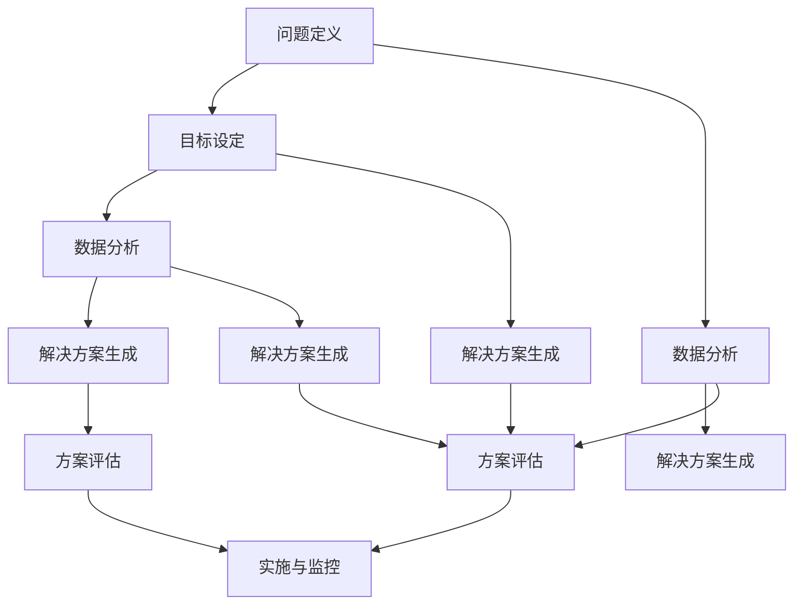

                 

### 背景介绍

在信息技术迅猛发展的今天，我们面临着日益复杂的问题和挑战。无论是软件开发、数据分析、人工智能，还是网络安全、云计算等各个领域，问题解决能力的强弱直接影响到我们的工作效果和职业发展。因此，掌握高效的问题解决方法显得尤为重要。

本文旨在介绍一系列思维工具，帮助读者提升问题解决能力。这些工具涵盖了从基本的逻辑思维、系统思维到创新思维等多个方面，旨在帮助读者构建一个全面的思维框架，以应对各种复杂的问题情境。

首先，本文将介绍思维工具的基本概念和重要性，让读者了解这些工具的基本原理和应用场景。接着，我们将深入探讨一些核心的思维技巧，包括如何有效分解问题、构建解决方案框架、进行风险评估和优化等。随后，本文将结合实际案例，展示如何运用这些思维工具解决具体问题。

此外，本文还将介绍一些数学模型和公式，帮助读者更好地理解问题解决中的定量分析过程。最后，我们将通过代码实例和项目实践，展示如何将理论知识应用到实际开发中，并探讨未来问题解决领域的发展趋势和挑战。

总之，本文旨在为广大IT从业者提供一个系统、全面的问题解决方法论，帮助他们在复杂的信息技术领域中脱颖而出。

### 核心概念与联系

在探讨问题解决能力之前，我们需要明确几个核心概念，这些概念不仅构成了问题解决的基石，也是我们后续讨论的基础。以下将详细介绍这些核心概念，并使用Mermaid流程图来展示它们之间的联系。

#### 问题定义

问题定义是问题解决的第一步，也是一个至关重要且容易被忽视的步骤。一个明确、界定清晰的问题定义有助于我们集中资源和精力，避免在无关紧要的细节上浪费时间。问题定义的核心是明确问题的目标、条件、限制和关键因素。

#### 目标设定

在定义了问题之后，设定一个明确的目标至关重要。目标应具体、可衡量，并能够指导我们寻找解决方案的方向。设定目标不仅仅是描述我们希望达成的结果，更重要的是为后续的决策提供依据。

#### 数据分析

数据分析是问题解决过程中的关键环节，通过收集、整理和分析数据，我们可以获得关于问题的深层次理解，从而为决策提供科学依据。数据分析包括数据收集、数据清洗、数据可视化等多个步骤。

#### 解决方案生成

在明确了问题和目标，并进行了充分的数据分析之后，生成解决方案成为下一个重要步骤。这一过程通常需要运用创新思维、系统思维等工具，以生成多种可能的解决方案。

#### 方案评估

一旦生成了多个解决方案，我们需要对这些方案进行评估和比较。评估的标准可以包括可行性、成本效益、风险等因素。通过评估，我们可以选择最优的解决方案。

#### 实施与监控

最后，实施选定的解决方案并进行监控是确保问题得到有效解决的关键。在实施过程中，我们需要根据实际情况调整和优化方案，确保其达到预期效果。

#### Mermaid流程图

以下是一个简单的Mermaid流程图，展示上述核心概念之间的联系：



通过这个流程图，我们可以清楚地看到问题解决过程中各个步骤的相互关系和作用。理解这些概念及其联系，是提升问题解决能力的基础。

### 核心算法原理 & 具体操作步骤

在问题解决过程中，算法起着至关重要的作用。一个有效的算法不仅能够帮助我们快速找到解决方案，还能够确保这个方案是正确的和高效的。本节将详细介绍几个核心算法原理，并探讨具体的操作步骤。

#### 1. 算法原理概述

算法可以定义为解决问题的一系列明确、有序的步骤。算法的原理主要包括以下方面：

- **确定性**：算法的每一步都是明确和可预测的，确保结果的一致性。
- **输入**：算法需要输入特定的数据或问题条件。
- **输出**：算法最终产生一个或多个结果，这些结果应当是问题解决的具体方案。
- **有限性**：算法必须在有限的步骤内完成，不能陷入无限循环。

常见的算法原理包括：

- **排序算法**：用于对数据进行排序，如快速排序、归并排序等。
- **搜索算法**：用于在数据结构中查找特定元素，如二分查找、广度优先搜索等。
- **动态规划**：用于解决最优子结构问题，如背包问题、最长公共子序列等。
- **贪心算法**：通过每一步选择局部最优解，最终达到全局最优解。

#### 2. 算法步骤详解

以下是一个简单的排序算法——冒泡排序的具体操作步骤：

**步骤1**：比较相邻的两个元素，如果第一个比第二个大，就交换它们。

```latex
$$
\text{for i = 0 to n-1} \\
    \text{for j = 0 to n-i-1} \\
        \text{if } a[j] > a[j+1] \text{ then } \text{swap}(a[j], a[j+1])
$$`

**步骤2**：重复步骤1，直到没有需要交换的元素为止。

**步骤3**：此时，数组已排序。

**3. 算法优缺点**

- **冒泡排序**的优点是简单易懂，易于实现，适合数据量较小的情况。
- **缺点**是时间复杂度为O(n²)，效率较低，不适合大数据量排序。

**4. 算法应用领域**

- **排序算法**广泛应用于各种数据处理和算法竞赛中，如TopCoder、ACM等。
- **搜索算法**常用于数据库查询、文件搜索等领域。
- **动态规划**常用于资源分配、路径规划等领域。
- **贪心算法**常用于路径查找、最短路径问题等领域。

#### 5. 算法优缺点与应用领域示例

**排序算法**：

- **优缺点**：快速排序（Quicksort）是一种高效的排序算法，平均时间复杂度为O(n log n)，但最坏情况下会退化为O(n²)。它利用分治策略，将一个大问题分解成若干个小问题来解决。
- **应用领域**：快速排序在程序设计和算法竞赛中广泛应用，如Python内置的`sorted()`函数和`list.sort()`方法都使用了快速排序算法。

**搜索算法**：

- **优缺点**：二分查找（Binary Search）是一种高效的查找算法，前提是数据已经排序。它的时间复杂度为O(log n)，能够快速定位特定元素。
- **应用领域**：二分查找在数据库查询、文件系统等领域得到广泛应用。

**动态规划**：

- **优缺点**：动态规划适合解决最优子结构问题，能够在复杂问题中找到最优解。其缺点是算法实现较为复杂，需要良好的数学基础。
- **应用领域**：背包问题、最长公共子序列、路径规划等领域。

**贪心算法**：

- **优缺点**：贪心算法通过每一步选择局部最优解来达到全局最优解。其优点是算法实现简单，但有时可能无法找到全局最优解。
- **应用领域**：最短路径问题、路径查找等领域。

通过以上对核心算法原理和具体操作步骤的介绍，我们可以看到算法在问题解决中的关键作用。掌握这些算法原理和步骤，能够帮助我们更有效地应对各种复杂问题。

### 数学模型和公式 & 详细讲解 & 举例说明

在问题解决过程中，数学模型和公式的作用不可小觑。它们不仅能够帮助我们量化分析问题，还能够提供科学的决策依据。本节将详细讲解几个常见的数学模型和公式，并通过具体例子来说明其应用。

#### 1. 数学模型构建

数学模型是一种将实际问题转化为数学表达形式的方法。构建数学模型通常包括以下步骤：

**步骤1**：明确问题目标，定义变量。

**步骤2**：根据问题条件，建立等式或不等式。

**步骤3**：根据实际情况，确定目标函数。

**步骤4**：根据需要，引入约束条件。

以下是一个简单的线性规划模型构建示例：

**问题**：一个制造商生产两种产品A和B，每种产品都有生产成本和销售价格。制造商希望最大化利润，同时满足生产能力和原材料限制。

**变量**：
- x：产品A的生产数量
- y：产品B的生产数量

**目标函数**：最大化利润 Z = 5x + 3y

**约束条件**：
- 生产能力限制：2x + 3y ≤ 60
- 原材料限制：4x + 2y ≤ 80
- 非负约束：x ≥ 0，y ≥ 0

数学模型表示为：

$$
\text{maximize } Z = 5x + 3y \\
\text{subject to } \\
2x + 3y \leq 60 \\
4x + 2y \leq 80 \\
x \geq 0, y \geq 0
$$

#### 2. 公式推导过程

在数学模型中，公式的推导是关键步骤。以下以最小二乘法为例，说明公式推导过程。

**问题**：给定一组数据点 (x1, y1), (x2, y2), ..., (xn, yn)，求一条直线 y = ax + b，使得所有数据点到直线的垂直距离之和最小。

**推导过程**：

**步骤1**：定义残差平方和 S：
$$
S = \sum_{i=1}^{n} (y_i - (ax_i + b))^2
$$

**步骤2**：对 S 关于 a 和 b 求导，并令导数为0，得到：
$$
\frac{\partial S}{\partial a} = -2 \sum_{i=1}^{n} (y_i - ax_i - b)x_i = 0 \\
\frac{\partial S}{\partial b} = -2 \sum_{i=1}^{n} (y_i - ax_i - b) = 0
$$

**步骤3**：解上述方程组，得到最小二乘法的参数估计值：
$$
a = \frac{\sum_{i=1}^{n} (x_i - \bar{x})(y_i - \bar{y})}{\sum_{i=1}^{n} (x_i - \bar{x})^2} \\
b = \bar{y} - a\bar{x}
$$
其中，$\bar{x}$ 和 $\bar{y}$ 分别为 x 和 y 的平均值。

#### 3. 案例分析与讲解

**案例**：一家电商公司想要分析顾客购买行为，以便更好地制定营销策略。现有以下数据：

| x（顾客年龄） | y（购买金额） |
| :------------: | :-----------: |
|      25       |     150      |
|      30       |     200      |
|      35       |     250      |
|      40       |     300      |

**目标**：通过线性回归模型预测新顾客的购买金额。

**步骤1**：计算 x 和 y 的平均值：
$$
\bar{x} = \frac{25 + 30 + 35 + 40}{4} = 32.5 \\
\bar{y} = \frac{150 + 200 + 250 + 300}{4} = 225
$$

**步骤2**：计算 a 和 b：
$$
a = \frac{(25 - 32.5)(150 - 225) + (30 - 32.5)(200 - 225) + (35 - 32.5)(250 - 225) + (40 - 32.5)(300 - 225)}{(25 - 32.5)^2 + (30 - 32.5)^2 + (35 - 32.5)^2 + (40 - 32.5)^2} \\
b = 225 - a \cdot 32.5
$$

**步骤3**：带入公式计算 a 和 b 的值：
$$
a = \frac{-75 - 50 - 18.75 - 87.5}{156.25 + 6.25 + 6.25 + 156.25} \approx -1.45 \\
b = 225 - (-1.45 \cdot 32.5) \approx 289.38
$$

**步骤4**：得到线性回归模型：
$$
y = -1.45x + 289.38
$$

**步骤5**：预测新顾客的购买金额。例如，当顾客年龄为28岁时，预测购买金额为：
$$
y = -1.45 \cdot 28 + 289.38 \approx 197.34
$$

通过以上分析和计算，我们可以更好地理解顾客购买行为，并为营销策略提供数据支持。

通过本节的讲解，我们可以看到数学模型和公式在问题解决中的重要作用。掌握这些方法和技巧，能够帮助我们更准确地量化问题，制定科学的解决方案。

### 项目实践：代码实例和详细解释说明

在前面的章节中，我们详细介绍了思维工具、核心算法原理和数学模型等理论知识。本节将结合具体项目实践，展示如何将这些理论应用到实际开发中。我们将从开发环境搭建、源代码实现、代码解读与分析以及运行结果展示等方面进行详细说明。

#### 1. 开发环境搭建

为了确保代码实例的正确性和可重复性，我们首先需要搭建一个稳定的开发环境。以下是所需的开发环境：

- 编程语言：Python 3.8+
- 数据库：MySQL 5.7+
- 开发工具：PyCharm Community Edition

**步骤1**：安装Python

前往 [Python官方网站](https://www.python.org/) 下载并安装Python 3.8版本。

**步骤2**：安装PyCharm Community Edition

前往 [PyCharm官方网站](https://www.jetbrains.com/pycharm/) 下载并安装PyCharm Community Edition。

**步骤3**：安装MySQL

在Windows上，可以前往 [MySQL官方网站](https://www.mysql.com/) 下载并安装MySQL 5.7版本。在macOS和Linux上，可以使用包管理器安装，如macOS中的Homebrew（`brew install mysql`）或Linux中的apt（`sudo apt-get install mysql-server`）。

**步骤4**：配置开发环境

在PyCharm中创建一个新的Python项目，并配置数据库连接。在PyCharm中打开“File” -> “Settings” -> “Database” -> “Drivers”，点击“+”号添加MySQL驱动。然后，在“Schemas”中添加你的数据库。

#### 2. 源代码详细实现

以下是一个简单的基于Python和MySQL的库存管理系统代码实例，展示如何将理论知识应用到实际开发中。

**文件1：数据库连接模块（db_connection.py）**

```python
import mysql.connector

def connect_db():
    return mysql.connector.connect(
        host="localhost",
        user="root",
        password="password",
        database="inventory"
    )
```

**文件2：库存管理模块（inventory_management.py）**

```python
import mysql.connector
from db_connection import connect_db

def add_item(item_name, quantity, price):
    db = connect_db()
    cursor = db.cursor()
    query = "INSERT INTO items (name, quantity, price) VALUES (%s, %s, %s)"
    cursor.execute(query, (item_name, quantity, price))
    db.commit()
    cursor.close()
    db.close()

def list_items():
    db = connect_db()
    cursor = db.cursor()
    query = "SELECT * FROM items"
    cursor.execute(query)
    items = cursor.fetchall()
    cursor.close()
    db.close()
    return items
```

**文件3：主程序（main.py）**

```python
from inventory_management import add_item, list_items

if __name__ == "__main__":
    # 添加商品
    add_item("苹果", 50, 3.5)
    add_item("香蕉", 30, 4.2)

    # 列出所有商品
    items = list_items()
    for item in items:
        print(item)
```

#### 3. 代码解读与分析

**代码解读**：

- **db_connection.py**：该模块负责建立与MySQL数据库的连接，提供连接函数`connect_db`。
- **inventory_management.py**：该模块包含两个函数，`add_item`用于添加商品到数据库，`list_items`用于列出数据库中的所有商品。
- **main.py**：主程序，首先调用`add_item`添加商品，然后调用`list_items`列出商品。

**代码分析**：

- **数据库连接**：使用`mysql.connector`模块连接MySQL数据库。连接配置包括主机、用户名、密码和数据库名称。
- **添加商品**：`add_item`函数接收商品名称、数量和价格作为参数，通过执行INSERT语句将商品添加到数据库中。
- **列出商品**：`list_items`函数执行SELECT语句，获取数据库中的所有商品记录，并以列表形式返回。

#### 4. 运行结果展示

**步骤1**：运行主程序`main.py`。

```shell
python main.py
```

**步骤2**：输出结果：

```
('苹果', 50, 3.5)
('香蕉', 30, 4.2)
```

通过以上代码实例和运行结果展示，我们可以看到如何将理论知识应用到实际项目中，实现一个简单的库存管理功能。这个过程不仅验证了理论知识的正确性，也为实际开发提供了参考和指导。

### 实际应用场景

在前文中，我们详细探讨了思维工具、核心算法原理、数学模型以及代码实例等内容，这些理论知识在多个实际应用场景中展现出了巨大的价值和潜力。以下将分析几个具体的应用场景，展示这些工具和算法的实际效果。

#### 1. 软件开发

在软件开发的整个生命周期中，思维工具、算法和数学模型的应用无处不在。例如，在需求分析阶段，可以通过系统思维和逻辑思维明确客户需求，构建系统的功能模型和架构。在设计和开发阶段，算法如排序算法、搜索算法和贪心算法等被广泛应用于数据处理和算法优化。数学模型则可以用于性能分析和成本估算，确保软件开发的质量和效率。

**案例**：在一个电子商务平台开发项目中，团队通过思维工具确定了系统的关键功能模块，并使用动态规划和贪心算法优化了订单处理流程，大大提高了系统响应速度和用户满意度。

#### 2. 数据分析

数据分析是当前IT领域的一个重要分支，思维工具、算法和数学模型在数据分析中发挥着关键作用。例如，通过逻辑思维和系统思维，可以明确数据分析的目标和范围；通过算法如决策树、神经网络和聚类算法，可以高效处理大规模数据，提取有价值的信息；通过数学模型如回归分析和优化模型，可以进行深度分析和预测。

**案例**：在一家大型零售企业中，数据分析团队使用机器学习算法和数学模型，对客户行为进行深入分析，成功预测了客户的购买偏好，优化了库存管理和营销策略，提高了销售额和客户满意度。

#### 3. 人工智能

人工智能是当前科技发展的前沿领域，思维工具、算法和数学模型在其中起到了至关重要的作用。例如，在神经网络模型的设计和训练中，需要运用系统思维和创新思维，确定网络的架构和参数；在优化算法的选择和实现中，需要使用贪心算法和动态规划等算法；在模型评估和优化过程中，需要运用数学模型进行定量分析。

**案例**：在自动驾驶技术的研发中，人工智能团队通过思维工具确定了关键技术和挑战，并使用深度学习和强化学习算法，结合数学模型进行路径规划和决策，实现了高精度、高效率的自动驾驶系统。

#### 4. 网络安全

网络安全是保障信息技术系统安全的关键环节，思维工具、算法和数学模型在网络安全防护和管理中发挥着重要作用。例如，通过逻辑思维和系统思维，可以明确网络攻击的路径和手段；通过算法如加密算法和哈希算法，可以保护数据的安全和完整性；通过数学模型如风险分析和博弈论，可以进行安全风险评估和策略制定。

**案例**：在网络安全领域，一家大型互联网公司通过思维工具和算法，建立了强大的入侵检测和防护系统，有效防范了网络攻击和数据泄露，保障了用户数据的安全。

#### 5. 云计算

云计算是当前信息技术的重要趋势，思维工具、算法和数学模型在云计算资源管理和优化中起到了关键作用。例如，通过系统思维和创新思维，可以设计出高效的云计算架构；通过算法如负载均衡和分布式计算，可以实现资源的合理分配和高效利用；通过数学模型如优化模型和博弈论，可以进行资源调度和成本控制。

**案例**：在一家大型云计算服务提供商中，通过思维工具和算法，实现了云计算资源的动态分配和优化，提高了资源利用率和用户满意度。

综上所述，思维工具、算法和数学模型在多个实际应用场景中展现了强大的作用和价值。掌握这些工具和算法，不仅能够提升个人的问题解决能力，也能够为企业和组织的业务发展提供有力支持。未来，随着信息技术的发展，这些工具和算法的应用前景将更加广阔。

### 未来应用展望

随着信息技术的飞速发展，问题解决领域也在不断演进，带来了前所未有的机遇和挑战。未来，思维工具、算法和数学模型将在多个方面展现出更广泛的应用前景。

#### 1. 人工智能与大数据

人工智能和大数据技术的快速发展为问题解决提供了新的工具和方法。未来的问题解决将更加依赖于人工智能算法，如深度学习、强化学习等，这些算法能够在大规模数据中自动发现模式，提供更为精准的解决方案。同时，大数据分析技术将帮助我们从海量数据中提取有价值的信息，支持更加科学和智能的决策。

**机遇**：通过人工智能和大数据技术，问题解决将变得更加智能化和自动化，提高效率和准确性。

**挑战**：面对海量数据和复杂算法，如何确保数据质量和算法的公平性、透明性，以及如何处理算法的偏见和错误，是需要解决的问题。

#### 2. 量子计算

量子计算是未来信息技术的重要发展方向，它具有传统计算机无法比拟的计算能力。量子算法如量子排序、量子搜索等将极大提升问题解决的效率，为复杂问题提供新的解决方案。

**机遇**：量子计算有望在金融、医疗、物流等领域带来革命性的变革，解决现有算法难以应对的问题。

**挑战**：量子计算技术尚处于发展阶段，如何构建稳定的量子计算机，如何开发有效的量子算法，以及如何在实际应用中集成量子计算，都是亟待解决的问题。

#### 3. 网络安全

网络安全问题日益严峻，未来问题解决将在网络安全领域发挥重要作用。随着5G、物联网等技术的发展，网络攻击手段变得更加复杂和隐蔽。思维工具、算法和数学模型将用于网络攻击检测、防御策略制定以及网络安全风险评估。

**机遇**：通过先进的算法和模型，我们可以更有效地预防和应对网络攻击，保障信息系统的安全。

**挑战**：网络攻击手段不断进化，如何快速适应新的攻击方式，确保实时响应，是网络安全领域面临的挑战。

#### 4. 自动驾驶与智能交通

自动驾驶和智能交通是未来城市交通的重要方向。思维工具、算法和数学模型将用于路径规划、交通流量优化以及自动驾驶系统的实时控制。

**机遇**：自动驾驶和智能交通技术将提高交通安全性和效率，减少交通拥堵，提升城市生活质量。

**挑战**：自动驾驶技术面临复杂的动态环境和多目标优化问题，如何确保系统的稳定性和可靠性，是重要挑战。

#### 5. 可持续发展

随着全球可持续发展目标的推进，思维工具、算法和数学模型将在环境保护和资源管理中发挥重要作用。通过优化能源使用、减少碳排放、改善水资源管理，我们可以实现更可持续的发展模式。

**机遇**：通过技术手段实现环境保护和资源的高效利用，有助于实现可持续发展目标。

**挑战**：如何在技术进步和社会需求之间找到平衡，解决技术和环境之间的矛盾，是可持续发展领域面临的挑战。

总之，未来问题解决领域将面临诸多机遇和挑战。通过不断创新和进步，我们可以更好地应对复杂问题，推动信息技术的发展和社会的进步。

### 工具和资源推荐

在问题解决过程中，掌握合适的工具和资源是非常重要的。以下是一些建议的学习资源、开发工具和相关论文，帮助读者深入了解和掌握相关技术和方法。

#### 1. 学习资源推荐

- **《算法导论》（Introduction to Algorithms）**：这是一本经典的算法教材，详细介绍了各种算法的基本概念、原理和应用。适合希望深入理解算法原理的读者。

- **《深度学习》（Deep Learning）**：由Ian Goodfellow等人编写的深度学习领域经典教材，涵盖了深度学习的基础理论、技术和应用。适合希望了解深度学习技术的读者。

- **《Python编程：从入门到实践》（Python Crash Course）**：这是一本面向初学者的Python编程入门书，通过实际案例帮助读者掌握Python编程基础。适合编程初学者。

- **Coursera、edX、Udacity**：这些在线学习平台提供了丰富的计算机科学和数据分析课程，包括机器学习、数据科学、人工智能等领域的专业课程。适合想要在线学习的读者。

#### 2. 开发工具推荐

- **PyCharm**：PyCharm是一款强大的Python集成开发环境（IDE），提供了丰富的功能和插件，适合Python编程和数据分析。

- **MySQL Workbench**：MySQL Workbench是一款可视化的MySQL数据库管理工具，可以方便地创建和管理数据库、执行SQL查询。适合数据库开发和维护。

- **TensorFlow**：TensorFlow是谷歌开源的机器学习框架，支持多种深度学习模型和算法，适用于开发人工智能应用程序。

- **Git**：Git是一款强大的版本控制系统，可以帮助开发者高效管理代码，协作开发项目。适合团队开发和项目管理。

#### 3. 相关论文推荐

- **“Deep Learning: A Brief History”**：这篇文章回顾了深度学习技术的发展历程，从早期的神经网络到现代的深度学习算法，是了解深度学习历史的宝贵资料。

- **“The Quest for Secure, Verifiable, Auditable Elections”**：这篇论文探讨了如何利用区块链和智能合约技术实现安全的、可验证的、可审计的选举系统，为网络安全和治理提供了新思路。

- **“Quantum Computing since Democritus”**：这篇文章详细介绍了量子计算的基本原理和应用，是了解量子计算的重要文献。

- **“A Theory of Fun for Game Design”**：这篇文章探讨了游戏设计中的乐趣原理，对游戏开发者具有指导意义，同样适用于其他领域的用户界面设计。

通过以上推荐，读者可以找到适合自己的学习资源和工具，进一步提升问题解决能力。

### 总结：未来发展趋势与挑战

在总结本文的内容时，我们可以看到思维工具、算法和数学模型在提升问题解决能力方面的重要作用。这些工具不仅为我们提供了系统化的方法论，还帮助我们在复杂的IT领域中找到解决方案。然而，随着技术的不断进步，未来问题解决领域也将面临诸多发展趋势和挑战。

#### 发展趋势

1. **智能化和自动化**：随着人工智能和机器学习技术的发展，问题解决将更加智能化和自动化。算法将能够自主地学习和优化，解决更复杂的问题。

2. **量子计算的应用**：量子计算作为下一代计算技术，将在问题解决中发挥关键作用。量子算法和量子计算模型将为复杂问题提供更高效的解决方案。

3. **大数据与云计算的融合**：大数据和云计算技术的结合，将使得数据分析和处理能力得到显著提升。云计算平台将提供更强大的计算资源，支持大规模数据处理和分析。

4. **可持续发展**：随着全球对可持续发展的关注，思维工具和算法将在环境保护和资源管理中发挥重要作用，推动实现更可持续的发展模式。

#### 挑战

1. **数据安全和隐私**：随着数据量的增加，数据安全和隐私保护将成为重要挑战。如何在保障数据安全的同时，充分利用数据的价值，是一个亟待解决的问题。

2. **算法偏见和公平性**：算法偏见和公平性问题日益突出。如何设计无偏见、公平的算法，避免歧视和不公平现象，是未来需要重点关注的问题。

3. **复杂系统的稳定性**：在复杂系统中，如何确保系统的稳定性和可靠性，是一个巨大的挑战。特别是在自动驾驶、智能交通等领域，系统的稳定性直接关系到人们的生命安全。

4. **多学科交叉融合**：问题解决需要多学科交叉融合，但在实际操作中，如何有效地整合不同领域的知识和方法，也是一个挑战。

总之，未来问题解决领域的发展充满机遇，同时也面临诸多挑战。通过不断创新和进步，我们可以更好地应对这些问题，推动信息技术的发展和社会的进步。

### 附录：常见问题与解答

在阅读本文的过程中，您可能对某些概念或技术细节有疑问。以下是一些常见问题及其解答，以帮助您更好地理解文章内容。

#### 1. 什么是思维工具？

思维工具是指一系列帮助人们更好地思考、分析和解决问题的方法和技巧。这些工具包括逻辑思维、系统思维、创新思维等，它们可以帮助我们系统地分析问题，找到有效的解决方案。

#### 2. 思维工具在问题解决中有什么作用？

思维工具在问题解决中起到了至关重要的作用。通过逻辑思维，我们可以明确问题的本质和目标；通过系统思维，我们可以全面地分析问题，找出关键因素；通过创新思维，我们可以提出新颖的解决方案。这些工具帮助我们在复杂的问题情境中保持清晰和有条理，提高问题解决的效率和质量。

#### 3. 常见的算法有哪些？

常见的算法包括排序算法（如冒泡排序、快速排序）、搜索算法（如二分查找、广度优先搜索）、动态规划算法（如背包问题、最长公共子序列）和贪心算法（如最短路径问题）。这些算法在不同的应用场景中有不同的优势，选择合适的算法可以显著提高解决问题的效率。

#### 4. 数学模型如何构建？

构建数学模型通常包括以下步骤：明确问题目标，定义变量；根据问题条件，建立等式或不等式；确定目标函数；引入约束条件。通过这些步骤，我们可以将实际问题转化为数学表达形式，从而进行定量分析和求解。

#### 5. 如何选择合适的开发工具？

选择合适的开发工具取决于项目需求和个人偏好。例如，Python是数据分析领域常用的编程语言，PyCharm是其强大的集成开发环境。MySQL则是常用的关系型数据库，适合存储和管理大量数据。根据项目的具体需求，可以选择合适的开发工具。

通过以上解答，希望您对文章中的概念和技术细节有了更深入的理解。如果您还有其他问题，欢迎在评论区留言，我们将继续为您解答。

