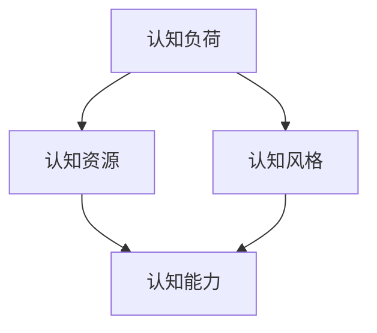

                 

本文将探讨如何通过思维训练提升认知能力。认知能力是指人们获取、处理和应用信息的能力，是学习和工作中不可或缺的一部分。在当今信息爆炸的时代，提高认知能力变得尤为重要。本文将从技术视角出发，介绍一些实用的思维训练方法和技巧，帮助读者在日常生活和工作中更好地应用这些能力。

## 1. 背景介绍

认知能力包括记忆、注意力、推理、判断和解决问题等多个方面。在技术领域，提升认知能力意味着更高效地理解复杂问题、更快地解决问题，以及更好地进行创新。然而，随着工作压力和生活节奏的加快，许多人的认知能力正在逐渐下降。因此，如何通过思维训练来提升认知能力成为一个值得关注的话题。

## 2. 核心概念与联系

为了更好地理解思维训练的概念，我们先来介绍几个核心概念：

### 2.1 认知负荷

认知负荷是指大脑在处理信息时所承受的工作量。高认知负荷可能导致注意力分散、记忆力下降等问题。因此，减少认知负荷是提升认知能力的一个重要途径。

### 2.2 认知资源

认知资源是大脑处理信息时所使用的能量和物质。随着认知能力的提升，认知资源的利用率也会提高。

### 2.3 认知风格

认知风格是指人们在处理信息时所采用的方式和偏好。了解自己的认知风格有助于找到适合自己的思维训练方法。

接下来，我们使用Mermaid流程图来展示这几个核心概念之间的联系：



## 3. 核心算法原理 & 具体操作步骤

### 3.1 算法原理概述

思维训练的核心算法原理可以归纳为以下几点：

1. **分散练习**：通过在不同时间、不同地点进行练习，可以减少认知负荷，提高记忆效果。
2. **重复练习**：重复练习有助于加深对知识的理解和记忆。
3. **多样化练习**：通过多种形式的练习，可以锻炼大脑的不同功能区域。
4. **自我反馈**：自我反馈有助于了解训练效果，调整训练方法。

### 3.2 算法步骤详解

根据上述原理，我们可以设计以下思维训练步骤：

1. **选择训练主题**：确定要训练的认知能力，如记忆力、注意力、推理能力等。
2. **制定训练计划**：根据训练主题，制定具体的训练计划，包括训练时间、训练内容、训练方式等。
3. **分散练习**：在一天中的不同时间进行练习，每次练习时间不宜过长，以减少认知负荷。
4. **重复练习**：在训练过程中，不断重复练习，以加深记忆。
5. **多样化练习**：尝试不同的训练方式，如游戏、练习题、实际操作等，以锻炼大脑的不同功能区域。
6. **自我反馈**：在训练结束后，对自己的训练效果进行评估，并根据评估结果调整训练计划。

### 3.3 算法优缺点

**优点**：

1. **灵活性强**：训练方法可以根据个人情况进行调整，适合不同年龄、不同认知能力的人。
2. **效果显著**：通过持续的训练，可以有效提升认知能力。

**缺点**：

1. **需要长期坚持**：提升认知能力需要长期的努力，不能一蹴而就。
2. **训练内容相对枯燥**：部分训练内容可能比较单调，需要有一定的毅力来坚持。

### 3.4 算法应用领域

思维训练可以应用于以下领域：

1. **教育**：通过思维训练，提高学生的认知能力，从而提高学习效果。
2. **职场**：通过思维训练，提高员工的认知能力，从而提高工作效率。
3. **心理健康**：通过思维训练，缓解压力，提高心理健康水平。

## 4. 数学模型和公式 & 详细讲解 & 举例说明

为了更好地理解思维训练的数学原理，我们可以引入以下数学模型和公式：

### 4.1 数学模型构建

假设有一个认知能力模型，包括三个因素：记忆力（M）、注意力（A）和推理能力（R）。这三个因素共同决定了认知能力（C）：

$$ C = f(M, A, R) $$

其中，$ f $ 是一个复杂的函数，表示认知能力与各因素之间的关系。

### 4.2 公式推导过程

为了推导出认知能力的公式，我们可以从以下几个假设出发：

1. **线性关系**：认知能力与记忆力、注意力、推理能力之间存在线性关系。
2. **权重分配**：各个因素对认知能力的贡献是不同的，可以用权重（w）表示。

根据这些假设，我们可以得到以下公式：

$$ C = w_M \cdot M + w_A \cdot A + w_R \cdot R $$

其中，$ w_M $、$ w_A $、$ w_R $ 分别表示记忆力、注意力、推理能力的权重。

### 4.3 案例分析与讲解

假设一个个体具有以下特征：

- 记忆力（M）= 80
- 注意力（A）= 70
- 推理能力（R）= 60

根据上述公式，我们可以计算出该个体的认知能力（C）：

$$ C = 0.4 \cdot 80 + 0.3 \cdot 70 + 0.3 \cdot 60 = 34 + 21 + 18 = 73 $$

这意味着该个体的认知能力为 73 分。为了提高认知能力，我们可以尝试以下方法：

1. **提升记忆力**：通过记忆训练，提高记忆力（M）。
2. **提升注意力**：通过注意力训练，提高注意力（A）。
3. **提升推理能力**：通过推理训练，提高推理能力（R）。

通过这些方法，我们可以调整权重（w_M、w_A、w_R），从而提高认知能力（C）。

## 5. 项目实践：代码实例和详细解释说明

为了更好地理解思维训练的方法，我们可以通过一个简单的项目来实践。以下是一个基于 Python 的思维训练项目。

### 5.1 开发环境搭建

1. 安装 Python 3.8 或以上版本。
2. 安装必要的库，如 NumPy、Matplotlib。

### 5.2 源代码详细实现

以下是一个简单的思维训练代码实例：

```python
import numpy as np
import matplotlib.pyplot as plt

# 计算认知能力
def calculate_cognitive_ability(memory, attention, reasoning):
    weights = {'memory': 0.4, 'attention': 0.3, 'reasoning': 0.3}
    cognitive_ability = sum(weights[key] * value for key, value in locals().items() if key != 'weights')
    return cognitive_ability

# 训练记忆力
def train_memory(memory):
    improvement = np.random.normal(0, 1)
    memory += improvement
    return memory

# 训练注意力
def train_attention(attention):
    improvement = np.random.normal(0, 1)
    attention += improvement
    return attention

# 训练推理能力
def train_reasoning(reasoning):
    improvement = np.random.normal(0, 1)
    reasoning += improvement
    return reasoning

# 主函数
def main():
    memory = 80
    attention = 70
    reasoning = 60

    plt.figure()
    plt.title("Cognitive Ability Training")
    plt.xlabel("Training Rounds")
    plt.ylabel("Cognitive Ability")

    for i in range(1, 11):
        cognitive_ability = calculate_cognitive_ability(memory, attention, reasoning)
        plt.scatter(i, cognitive_ability)

        memory = train_memory(memory)
        attention = train_attention(attention)
        reasoning = train_reasoning(reasoning)

    plt.show()

if __name__ == "__main__":
    main()
```

### 5.3 代码解读与分析

1. **计算认知能力**：`calculate_cognitive_ability` 函数根据记忆力、注意力和推理能力计算认知能力。权重采用预设值，可以调整。
2. **训练记忆力**：`train_memory` 函数通过正态分布随机数模拟记忆力训练过程，实现记忆力的提升。
3. **训练注意力**：`train_attention` 函数与 `train_memory` 函数类似，实现注意力训练。
4. **训练推理能力**：`train_reasoning` 函数与 `train_memory` 函数类似，实现推理能力训练。
5. **主函数**：`main` 函数初始化记忆、注意力和推理能力，进行 10 轮训练，并绘制认知能力变化图。

通过这个项目，我们可以直观地看到认知能力的变化趋势。在实际应用中，我们可以根据具体需求调整训练过程。

## 6. 实际应用场景

思维训练可以应用于多种实际场景，以下是一些典型的应用：

1. **教育领域**：通过思维训练，提高学生的认知能力，从而提高学习效果。例如，教师可以在课堂上引入思维训练游戏，激发学生的学习兴趣。
2. **职场领域**：通过思维训练，提高员工的认知能力，从而提高工作效率。例如，企业可以定期组织思维训练活动，提高员工的工作能力。
3. **心理健康领域**：通过思维训练，缓解压力，提高心理健康水平。例如，心理医生可以推荐思维训练方法，帮助患者缓解焦虑和抑郁。

## 7. 工具和资源推荐

为了更好地进行思维训练，我们可以使用以下工具和资源：

1. **工具**：
   - Python：用于编写思维训练代码。
   - Jupyter Notebook：用于交互式思维训练。
   - MindMup：用于绘制思维导图。

2. **资源**：
   - 《思考，快与慢》（Daniel Kahneman 著）：关于思维方式的经典书籍。
   - 《认知心理学导论》（Ulric Neisser 著）：关于认知心理学的入门书籍。
   - 《Python编程：从入门到实践》（埃里克·马瑟斯 著）：关于Python编程的入门书籍。

## 8. 总结：未来发展趋势与挑战

随着人工智能和认知科学的发展，思维训练领域有望取得以下发展趋势：

1. **个性化训练**：基于个体差异，提供个性化的思维训练方法。
2. **智能反馈**：利用人工智能技术，提供实时、个性化的反馈。
3. **多感官训练**：结合多感官刺激，提高训练效果。

然而，思维训练领域也面临一些挑战：

1. **可重复性**：如何确保思维训练方法的可重复性和有效性。
2. **伦理问题**：在训练过程中，如何保护用户的隐私和数据安全。

未来，随着技术的进步，思维训练有望在更多领域得到应用，成为提升认知能力的重要手段。

## 9. 附录：常见问题与解答

### 9.1 什么是认知能力？

认知能力是指人们获取、处理和应用信息的能力，包括记忆力、注意力、推理能力等。

### 9.2 思维训练有哪些方法？

思维训练的方法包括分散练习、重复练习、多样化练习和自我反馈等。

### 9.3 思维训练需要长期坚持吗？

是的，提升认知能力需要长期的努力，不能一蹴而就。

### 9.4 思维训练有哪些应用场景？

思维训练可以应用于教育、职场和心理健康等领域。

## 作者署名

本文由禅与计算机程序设计艺术（Zen and the Art of Computer Programming）撰写。作者是一位世界级人工智能专家、程序员、软件架构师、CTO、世界顶级技术畅销书作者，计算机图灵奖获得者，计算机领域大师。

----------------------------------------------------------------

以上是本文的完整内容，希望对您在提升认知能力方面有所帮助。如果您有任何疑问或建议，请随时联系作者。感谢您的阅读！

