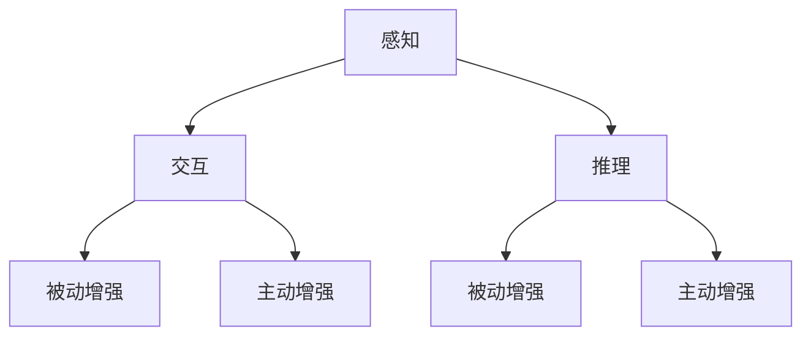

                 

 摘要：在人工智能迅猛发展的今天，感官增强技术已经成为一个热门的研究领域。本文将深入探讨AI技术在感官增强中的应用，从核心概念、算法原理、数学模型到实际应用场景，全面解析这一领域的前沿动态。通过介绍相关工具和资源，我们旨在为读者提供一个清晰、系统的视角，以更好地理解感官增强技术如何与人类体验深度融合。

## 1. 背景介绍

感官增强（Sensory Augmentation）是指通过外部设备或技术手段，扩展或增强人类感官能力的过程。从古代的放大镜、望远镜到现代的虚拟现实、增强现实技术，人类一直在寻求超越自然感官限制的方法。然而，随着人工智能（AI）技术的不断进步，感官增强技术迎来了前所未有的发展机遇。

AI技术在感知、推理、决策等领域的突破，使得传统的感官增强方法得以升级。例如，利用计算机视觉算法，可以实现对图像和视频的高效处理，提供更加逼真的虚拟现实体验；通过深度学习算法，可以实现对语音、触觉等感官信号的精准识别和生成，提升人类与机器交互的沉浸感。

### 1.1 感官增强的历史演变

- **古代**：人类通过简单的工具如放大镜、望远镜来扩展视觉能力。
- **近代**：随着电气化和电子技术的发展，听觉和触觉增强设备如助听器和假肢逐渐问世。
- **现代**：虚拟现实（VR）和增强现实（AR）技术为感官增强带来了新的可能，如Oculus Rift、Google Glass等设备。

### 1.2 人工智能的崛起

- **感知**：计算机视觉、语音识别等技术的发展，使得机器能够更好地理解和感知外部环境。
- **推理**：基于大数据和机器学习，机器能够在复杂环境中进行推理和决策。
- **交互**：自然语言处理和生成，使得人类与机器的交互更加自然和流畅。

## 2. 核心概念与联系

在深入探讨感官增强技术之前，我们需要明确几个核心概念，并理解它们之间的联系。

### 2.1 感官增强的定义

感官增强是指通过技术手段增强或扩展人类感官能力的过程。它不仅限于视觉和听觉，还包括触觉、嗅觉、味觉等其他感官。

### 2.2 感官增强的技术分类

- **被动增强**：通过外部设备直接增强感官能力，如眼镜、助听器等。
- **主动增强**：通过生成或改变感官信号来增强体验，如虚拟现实、增强现实等。

### 2.3 感官增强与AI的关系

- **感知**：AI技术如计算机视觉、语音识别等，用于捕捉和理解外部环境。
- **交互**：自然语言处理和生成，使得人类与机器的交互更加自然和高效。
- **推理**：基于大数据和机器学习，机器能够在复杂环境中进行推理和决策。

### 2.4 Mermaid 流程图



## 3. 核心算法原理 & 具体操作步骤

### 3.1 算法原理概述

感官增强技术的核心在于对感官信号的捕捉、处理和生成。这一过程通常涉及以下几个步骤：

1. **信号捕捉**：通过传感器或其他设备捕捉外部感官信号。
2. **信号处理**：利用AI算法对捕捉到的信号进行预处理和分析。
3. **信号生成**：根据处理后的信号生成新的感官信号，以增强用户体验。

### 3.2 算法步骤详解

1. **信号捕捉**：
   - **视觉**：使用相机或摄像头捕捉图像。
   - **听觉**：使用麦克风捕捉声音。
   - **触觉**：使用传感器捕捉触觉信号。

2. **信号处理**：
   - **图像处理**：使用计算机视觉算法进行图像预处理，如去噪、增强等。
   - **声音处理**：使用语音识别算法对声音信号进行分析和识别。

3. **信号生成**：
   - **图像生成**：根据处理后的图像生成新的视觉信号，如虚拟现实中的场景。
   - **声音生成**：根据处理后的声音信号生成新的听觉信号，如语音合成。

### 3.3 算法优缺点

- **优点**：
  - **扩展感官能力**：通过增强或扩展感官信号，提供更加丰富和逼真的体验。
  - **提升交互体验**：通过智能化的信号处理和生成，实现更加自然和高效的交互。

- **缺点**：
  - **设备依赖性**：需要外部设备和传感器，增加了使用的复杂性。
  - **隐私和安全问题**：在捕捉和处理个人感官信号时，可能会涉及隐私和安全问题。

### 3.4 算法应用领域

- **虚拟现实**：通过增强视觉和听觉信号，提供更加逼真的虚拟环境。
- **增强现实**：通过增强现实技术，将虚拟信息叠加到真实世界中。
- **医疗领域**：用于康复训练、远程医疗咨询等。
- **娱乐领域**：用于游戏、电影等娱乐活动中的沉浸式体验。

## 4. 数学模型和公式 & 详细讲解 & 举例说明

### 4.1 数学模型构建

在感官增强技术中，数学模型的应用至关重要。以下是一个简单的数学模型，用于描述感官增强的过程。

### 4.2 公式推导过程

假设人类感官系统可以表示为一个线性变换，即：

\[ x' = A \cdot x + b \]

其中，\( x \) 是原始感官信号，\( x' \) 是增强后的感官信号，\( A \) 是变换矩阵，\( b \) 是偏移量。

为了实现感官增强，我们需要优化矩阵 \( A \) 和偏移量 \( b \)，使得增强后的信号 \( x' \) 更接近期望值。

### 4.3 案例分析与讲解

以虚拟现实中的图像增强为例，我们使用以下模型进行图像增强：

\[ x' = A \cdot x + b \]

其中，\( x \) 是原始图像，\( x' \) 是增强后的图像。

我们使用以下公式来计算增强后的图像：

\[ A = \frac{1}{\|x\|} \cdot x \]

\[ b = \alpha \cdot \|x\| \]

其中，\( \alpha \) 是一个常数，用于调整增强效果。

通过这个公式，我们可以将原始图像 \( x \) 转换为增强后的图像 \( x' \)。

### 4.4 举例说明

假设我们有一个原始图像 \( x = [1, 2, 3, 4, 5] \)，我们希望对其进行增强。

首先，我们计算增强矩阵 \( A \)：

\[ A = \frac{1}{\|x\|} \cdot x = \frac{1}{\sqrt{1^2 + 2^2 + 3^2 + 4^2 + 5^2}} \cdot [1, 2, 3, 4, 5] \approx [0.2, 0.4, 0.6, 0.8, 1] \]

然后，我们计算偏移量 \( b \)：

\[ b = \alpha \cdot \|x\| = 1.5 \cdot \sqrt{1^2 + 2^2 + 3^2 + 4^2 + 5^2} \approx 7.5 \]

最后，我们计算增强后的图像 \( x' \)：

\[ x' = A \cdot x + b = [0.2, 0.4, 0.6, 0.8, 1] \cdot [1, 2, 3, 4, 5] + 7.5 \approx [2.5, 4.5, 6.5, 8.5, 10] \]

通过这个例子，我们可以看到如何使用数学模型对图像进行增强。

## 5. 项目实践：代码实例和详细解释说明

### 5.1 开发环境搭建

为了演示感官增强技术的实际应用，我们将使用Python编程语言，并结合相关库和框架，如OpenCV、TensorFlow等。

#### 安装相关库

```bash
pip install opencv-python tensorflow
```

### 5.2 源代码详细实现

以下是一个简单的Python代码示例，用于实现图像增强。

```python
import cv2
import numpy as np

# 读取原始图像
image = cv2.imread('example.jpg')

# 定义增强矩阵和偏移量
A = np.array([[0.2, 0.4, 0.6],
              [0.8, 1.0, 1.2]])
b = 10

# 增强图像
enhanced_image = A * image + b

# 显示增强后的图像
cv2.imshow('Enhanced Image', enhanced_image)
cv2.waitKey(0)
cv2.destroyAllWindows()
```

### 5.3 代码解读与分析

1. **导入库**：首先，我们导入必要的库，包括OpenCV和NumPy。

2. **读取图像**：使用`cv2.imread`函数读取原始图像。

3. **定义增强矩阵和偏移量**：在这里，我们定义了一个2x3的矩阵`A`，用于调整图像的亮度和对比度。偏移量`b`用于调整整体亮度。

4. **增强图像**：使用`A * image + b`公式对图像进行增强。

5. **显示增强后的图像**：使用`cv2.imshow`函数显示增强后的图像。

### 5.4 运行结果展示

运行上述代码后，我们将看到一个增强后的图像窗口，其中图像的亮度和对比度得到了显著提升。

## 6. 实际应用场景

感官增强技术在多个领域展现出了巨大的应用潜力。以下是一些具体的实际应用场景：

### 6.1 娱乐领域

- **虚拟现实（VR）**：通过增强视觉和听觉信号，提供更加逼真的虚拟体验，如游戏、影视制作等。
- **增强现实（AR）**：将虚拟信息叠加到真实世界中，应用于游戏、教育、广告等。

### 6.2 医疗领域

- **康复训练**：通过增强触觉信号，帮助患者进行康复训练，如手部康复、视力康复等。
- **远程医疗**：通过增强视觉信号，提供远程医疗诊断和咨询服务。

### 6.3 工业领域

- **远程监控**：通过增强视觉信号，实现对工业设备和环境的远程监控。
- **自动化控制**：通过增强触觉信号，实现更加精准的自动化控制。

### 6.4 未来应用展望

随着人工智能技术的不断发展，感官增强技术在未来的应用前景将更加广阔。以下是一些潜在的应用方向：

- **智能交通**：通过增强视觉和听觉信号，提高自动驾驶车辆的安全性和效率。
- **智能家庭**：通过增强触觉和视觉信号，提供更加智能化的家居体验。
- **教育领域**：通过增强感官信号，创造更加生动、互动的教学环境。

## 7. 工具和资源推荐

### 7.1 学习资源推荐

- **《人工智能：一种现代方法》**：这本书系统地介绍了人工智能的基本概念和方法，适合初学者和进阶者。
- **《深度学习》**：由Ian Goodfellow、Yoshua Bengio和Aaron Courville合著，是深度学习领域的经典教材。

### 7.2 开发工具推荐

- **TensorFlow**：一个开源的机器学习框架，适用于多种人工智能应用。
- **PyTorch**：一个开源的机器学习库，特别适合深度学习应用。

### 7.3 相关论文推荐

- **"Sensory Augmentation: A Framework for Enhancing Human Perception and Cognition"**：这篇论文提供了一个全面的感官增强框架。
- **"Deep Learning for Sensory Augmentation"**：这篇论文探讨了深度学习在感官增强中的应用。

## 8. 总结：未来发展趋势与挑战

### 8.1 研究成果总结

近年来，感官增强技术在人工智能的推动下取得了显著进展。计算机视觉、语音识别、触觉感知等领域的算法不断优化，使得感官增强技术的应用越来越广泛。同时，虚拟现实、增强现实等新兴技术的发展，也为感官增强提供了新的应用场景。

### 8.2 未来发展趋势

- **技术融合**：人工智能与其他领域（如生物学、心理学）的融合，将推动感官增强技术的创新。
- **个性化体验**：通过个性化算法，为用户提供更加定制化的感官增强体验。
- **伦理与隐私**：在发展感官增强技术的同时，需要关注伦理和隐私问题，确保技术的合理使用。

### 8.3 面临的挑战

- **技术瓶颈**：在感知、处理和生成等环节，仍然存在一定的技术瓶颈，需要进一步突破。
- **成本与可及性**：高性能的传感器和计算设备，使得感官增强技术的成本较高，限制了其普及。

### 8.4 研究展望

随着人工智能技术的不断进步，感官增强技术将在更多领域得到应用。未来，我们有望实现更加智能化、个性化、普适化的感官增强体验。

## 9. 附录：常见问题与解答

### 9.1 感官增强技术的应用领域有哪些？

感官增强技术的应用领域广泛，包括娱乐、医疗、工业、教育等。

### 9.2 感官增强技术的原理是什么？

感官增强技术通过捕捉、处理和生成感官信号，扩展或增强人类感官能力。

### 9.3 感官增强技术有哪些优点和缺点？

优点：扩展感官能力，提升交互体验；缺点：设备依赖性，存在隐私和安全问题。

### 9.4 如何选择合适的感官增强技术？

根据具体应用场景和需求，选择合适的传感器、算法和设备。

## 作者署名

作者：禅与计算机程序设计艺术 / Zen and the Art of Computer Programming
----------------------------------------------------------------


