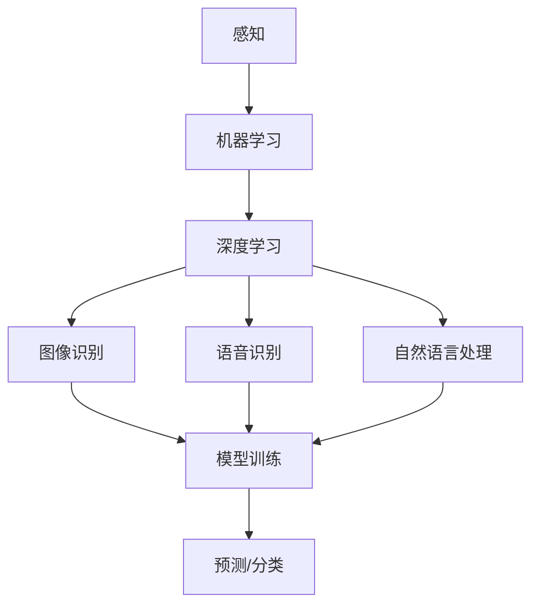

                 

### 摘要

本文旨在探讨人工智能领域的核心问题——感知。感知是人类智能的重要组成部分，也是机器学习和人工智能研究的核心任务之一。本文首先介绍了感知的基本概念，探讨了感知在现代智能系统中的重要性。接着，我们深入分析了感知技术的核心算法原理，包括图像识别、语音识别、自然语言处理等方面的最新进展。此外，本文还详细讲解了感知技术的数学模型和公式，并通过实际项目实例展示了感知技术在开发中的应用。最后，本文对感知技术的未来应用场景和发展趋势进行了展望，并提出了相关的工具和资源推荐。通过本文的阅读，读者将能够全面了解感知技术的基本原理和应用，为深入研究和开发相关技术提供参考。

## 1. 背景介绍

感知是人类智能的核心能力之一，它使我们能够从周围环境中获取信息，识别和分类对象，理解语言和情境，进而作出决策和行动。在人类的进化过程中，感知能力的发展起到了至关重要的作用，它使人类能够适应复杂多变的环境，从而生存和繁衍。随着计算机科学和人工智能技术的快速发展，模拟人类感知能力成为了人工智能研究的重要方向。

感知在人工智能领域的地位不可忽视。首先，感知是实现人工智能系统的基本前提。无论是自动驾驶汽车、智能助手，还是医疗诊断系统，都需要具备感知能力，以便从环境中获取信息，进行理解和决策。其次，感知技术是人工智能与人类交互的重要桥梁。通过感知技术，人工智能系统能够理解人类的语言、行为和意图，进而提供更加智能和个性化的服务。

感知技术的应用范围广泛，涵盖了图像识别、语音识别、自然语言处理、生物特征识别等多个领域。图像识别技术使计算机能够从图像中识别出特定对象或场景，广泛应用于安防监控、医疗诊断、自动驾驶等领域。语音识别技术使计算机能够理解人类的语音指令，广泛应用于智能助手、语音搜索、智能客服等领域。自然语言处理技术使计算机能够理解、生成和处理人类语言，广泛应用于机器翻译、智能客服、文本挖掘等领域。生物特征识别技术通过指纹、人脸、虹膜等生物特征进行身份验证，广泛应用于安防、金融、医疗等领域。

然而，感知技术也面临着一系列挑战。首先，感知技术的准确性问题仍然存在。尽管现代感知技术已经取得了显著进展，但在复杂、动态的环境中，感知系统的准确性和稳定性仍有待提高。其次，感知技术的实时性问题仍然存在。在某些应用场景中，如自动驾驶汽车、智能监控等，需要感知系统能够在短时间内处理大量数据，并作出快速反应。然而，目前的感知技术仍存在一定的延迟问题。最后，感知技术的跨模态融合问题尚未解决。不同模态的信息在感知和理解过程中存在差异，如何有效地融合不同模态的信息，提高感知系统的整体性能，是一个亟待解决的问题。

总的来说，感知技术是人工智能领域的重要研究方向，具有重要的理论和实践价值。随着技术的不断进步，我们相信感知技术将在未来取得更加显著的突破，为人工智能的发展和应用提供强大支撑。

## 2. 核心概念与联系

在深入探讨感知技术之前，我们需要明确几个核心概念，并理解它们之间的联系。这些概念包括感知、机器学习、深度学习、图像识别、语音识别和自然语言处理等。通过理解这些概念，我们可以更好地把握感知技术的本质和应用。

### 感知 (Perception)

感知是指生物体通过感官系统对外界信息进行识别、理解和解释的过程。在人类智能中，感知是获取知识的重要途径。例如，视觉感知使我们能够识别物体和场景，听觉感知使我们能够理解语言和声音，触觉感知使我们能够感知物体的质地和温度等。感知不仅限于生物体，随着计算机科学和人工智能技术的发展，机器也具备了模拟感知的能力。

### 机器学习 (Machine Learning)

机器学习是人工智能的一个分支，它使计算机系统能够从数据中自动学习和改进。机器学习通过构建模型，从输入数据中提取特征，并利用这些特征进行预测或分类。在感知技术中，机器学习是实现感知能力的重要工具。例如，图像识别系统通过机器学习算法从大量图像数据中学习如何识别不同物体。

### 深度学习 (Deep Learning)

深度学习是机器学习的一个子领域，它通过构建多层的神经网络来模拟人类大脑的处理方式。深度学习在图像识别、语音识别和自然语言处理等领域取得了显著成果。深度学习的核心优势在于其能够自动从大量数据中学习复杂的特征，从而实现高度准确的感知能力。

### 图像识别 (Image Recognition)

图像识别是指计算机从图像中识别出特定对象或场景的能力。图像识别技术依赖于机器学习和深度学习算法，通过训练模型从大量图像数据中学习如何识别不同物体。图像识别广泛应用于安防监控、自动驾驶、医疗诊断等领域。

### 语音识别 (Speech Recognition)

语音识别是指计算机从语音信号中识别出文本的能力。语音识别技术使计算机能够理解人类的语音指令，从而实现语音搜索、智能助手和语音交互等功能。语音识别技术依赖于深度学习和机器学习算法，通过训练模型从大量语音数据中学习如何识别不同语音。

### 自然语言处理 (Natural Language Processing)

自然语言处理是指计算机理解、生成和处理人类语言的能力。自然语言处理技术包括文本分类、情感分析、机器翻译等。自然语言处理技术通过机器学习和深度学习算法，从大量文本数据中学习如何理解和生成语言。

### Mermaid 流程图

以下是一个简化的 Mermaid 流程图，展示了感知技术中的核心概念和它们之间的联系：



通过这个流程图，我们可以看到，感知技术是通过机器学习和深度学习实现的，而这些技术又分别应用于图像识别、语音识别和自然语言处理等领域。最终，这些技术共同构成了感知技术的核心框架。

### 2.1 感知与机器学习

感知与机器学习密不可分。机器学习是实现感知能力的关键技术。通过机器学习，计算机可以从大量数据中自动提取特征，并利用这些特征进行预测或分类。在感知技术中，机器学习通常用于训练模型，使计算机能够识别图像、语音和文本。例如，在图像识别中，机器学习算法可以从大量图像数据中学习如何识别不同物体。在语音识别中，机器学习算法可以从大量语音数据中学习如何识别不同语音。在自然语言处理中，机器学习算法可以从大量文本数据中学习如何理解和生成语言。

### 2.2 感知与深度学习

深度学习是感知技术中的核心组件。深度学习通过构建多层神经网络，模拟人类大脑的处理方式，从而实现高度复杂的感知能力。深度学习在图像识别、语音识别和自然语言处理等领域取得了显著成果。例如，在图像识别中，卷积神经网络（CNN）可以通过多层卷积和池化操作提取图像特征，从而实现高精度的物体识别。在语音识别中，循环神经网络（RNN）和长短时记忆网络（LSTM）可以通过处理语音信号的序列特征，实现高精度的语音识别。在自然语言处理中，Transformer 模型通过处理文本序列的编码和解码，实现了高质量的机器翻译和文本生成。

### 2.3 感知与其他技术

除了机器学习和深度学习，感知技术还与其他技术密切相关。例如，计算机视觉技术是感知技术的重要组成部分，它通过模拟人类视觉系统，使计算机能够从图像中提取信息。计算机视觉技术包括图像识别、目标检测、人脸识别等。生物特征识别技术是另一种重要的感知技术，它通过指纹、人脸、虹膜等生物特征进行身份验证。生物特征识别技术在安防、金融和医疗等领域具有广泛应用。

### 2.4 感知技术的应用场景

感知技术广泛应用于各个领域，其中最典型的应用场景包括：

- **安防监控**：通过图像识别和计算机视觉技术，安防监控系统可以实时监测公共场所，识别可疑行为和人员，提高公共安全。
- **自动驾驶**：自动驾驶汽车通过感知技术，如激光雷达、摄像头和雷达，实时感知道路状况和周围环境，实现自主导航和驾驶。
- **智能助手**：智能助手通过语音识别和自然语言处理技术，理解用户的语音指令，提供语音搜索、天气查询、日程管理等服务。
- **医疗诊断**：医疗诊断系统通过图像识别和自然语言处理技术，分析医学图像和病历记录，辅助医生进行诊断和治疗。

通过以上内容，我们可以看到，感知技术是人工智能领域的重要组成部分，它通过机器学习和深度学习算法，实现了对图像、语音和文本的感知能力，广泛应用于各个领域，为人类生活带来了巨大的便利。

## 3. 核心算法原理 & 具体操作步骤

### 3.1 算法原理概述

感知技术的核心在于如何从大量数据中提取有效信息，实现对图像、语音和文本的识别和处理。这一过程通常依赖于机器学习和深度学习算法。以下将详细介绍感知技术中的几个核心算法原理，包括图像识别、语音识别和自然语言处理。

#### 图像识别

图像识别技术主要通过机器学习和深度学习算法实现。其核心思想是通过训练模型，使模型能够从大量图像数据中自动提取特征，从而识别出特定对象或场景。

1. **卷积神经网络（CNN）**：卷积神经网络是图像识别中最常用的深度学习模型。它通过多层卷积和池化操作，提取图像中的局部特征，并逐步组合成全局特征。具体步骤如下：

   - **卷积层**：卷积层通过卷积操作提取图像的局部特征。
   - **池化层**：池化层用于降低特征图的空间分辨率，减少参数数量。
   - **全连接层**：全连接层将卷积层和池化层提取的特征映射到具体的类别标签。

2. **迁移学习**：迁移学习是一种利用预训练模型进行图像识别的方法。它通过在特定任务上微调预训练模型，实现快速和高效的图像识别。例如，可以使用在ImageNet上预训练的ResNet模型，在特定任务上进行微调。

3. **数据增强**：数据增强是一种提高模型泛化能力的方法。通过随机旋转、缩放、裁剪等操作，生成新的训练数据，从而提高模型的识别能力。

#### 语音识别

语音识别技术主要通过深度学习和机器学习算法实现。其核心思想是通过训练模型，使模型能够从语音信号中提取特征，并识别出对应的文本。

1. **循环神经网络（RNN）**：循环神经网络是一种能够处理序列数据的深度学习模型。它通过记忆单元来捕捉序列中的依赖关系，从而实现对语音信号的识别。具体步骤如下：

   - **嵌入层**：嵌入层将输入的语音信号转换为稠密向量表示。
   - **循环层**：循环层通过处理嵌入层输出的序列特征，捕捉语音信号的依赖关系。
   - **输出层**：输出层将循环层输出的特征映射到对应的文本序列。

2. **长短时记忆网络（LSTM）**：长短时记忆网络是循环神经网络的一种变体，它通过引入门控机制，有效解决了长序列中的梯度消失问题。LSTM在语音识别中表现出色。

3. **注意力机制**：注意力机制是一种能够提高序列到序列模型性能的方法。它通过关注重要的序列片段，提高模型的识别准确性。

#### 自然语言处理

自然语言处理技术主要通过机器学习和深度学习算法实现。其核心思想是通过训练模型，使模型能够理解和生成人类语言。

1. **词嵌入（Word Embedding）**：词嵌入是一种将词语映射到高维向量空间的方法。通过词嵌入，模型可以捕捉词语的语义信息，从而提高文本处理的准确性。

2. **卷积神经网络（CNN）**：卷积神经网络在自然语言处理中的应用主要是通过文本卷积来提取特征。通过多层卷积和池化操作，模型可以捕获文本中的局部特征。

3. **Transformer 模型**：Transformer 模型是一种基于注意力机制的深度学习模型，它在机器翻译、文本分类和文本生成等领域取得了显著成果。它通过多头注意力机制和位置编码，有效捕捉文本中的长距离依赖关系。

### 3.2 算法步骤详解

以下我们将详细讲解图像识别、语音识别和自然语言处理的核心算法步骤。

#### 图像识别

1. **数据准备**：首先，我们需要准备大量的图像数据集，包括训练集和验证集。数据集应涵盖多种场景和对象，以提高模型的泛化能力。

2. **数据预处理**：对图像进行缩放、裁剪、旋转等数据增强操作，以增加模型的训练数据多样性。

3. **模型训练**：使用卷积神经网络（CNN）或迁移学习算法对模型进行训练。训练过程中，模型会通过反向传播算法不断优化参数，提高识别准确性。

4. **模型评估**：在验证集上评估模型的性能，计算准确率、召回率、F1 值等指标，以评估模型的泛化能力。

5. **模型部署**：将训练好的模型部署到实际应用中，如安防监控、自动驾驶等。

#### 语音识别

1. **数据准备**：准备包含语音信号和对应文本的语音数据集，包括训练集和验证集。

2. **数据预处理**：对语音信号进行归一化、去噪等处理，以提高模型训练效果。

3. **模型训练**：使用循环神经网络（RNN）或长短时记忆网络（LSTM）对模型进行训练。训练过程中，模型会通过反向传播算法不断优化参数，提高识别准确性。

4. **模型评估**：在验证集上评估模型的性能，计算词误差率（WER）等指标，以评估模型的泛化能力。

5. **模型部署**：将训练好的模型部署到实际应用中，如智能助手、语音搜索等。

#### 自然语言处理

1. **数据准备**：准备包含文本数据、标签等信息的文本数据集，包括训练集和验证集。

2. **数据预处理**：对文本进行分词、词性标注、去停用词等处理，以提高模型训练效果。

3. **模型训练**：使用卷积神经网络（CNN）、Transformer 模型等对模型进行训练。训练过程中，模型会通过反向传播算法不断优化参数，提高文本处理能力。

4. **模型评估**：在验证集上评估模型的性能，计算准确率、F1 值等指标，以评估模型的泛化能力。

5. **模型部署**：将训练好的模型部署到实际应用中，如机器翻译、文本分类等。

### 3.3 算法优缺点

#### 图像识别

**优点**：

- 高效性：卷积神经网络可以通过并行计算实现高效图像识别。
- 泛化能力：迁移学习和数据增强方法可以提高模型的泛化能力。
- 准确性：深度学习模型在图像识别任务中表现出色，准确率较高。

**缺点**：

- 计算资源消耗：深度学习模型通常需要大量计算资源，训练时间较长。
- 数据依赖性：模型的性能高度依赖于训练数据的质量和数量。

#### 语音识别

**优点**：

- 准确性：深度学习模型在语音识别任务中表现出色，准确率较高。
- 实时性：语音识别技术可以实时处理语音信号，实现快速响应。
- 多语言支持：通过迁移学习和多语言数据集，模型可以支持多种语言。

**缺点**：

- 声音环境依赖性：模型的性能受声音环境和噪声水平的影响较大。
- 长语音处理：长语音处理效果不如短语音。

#### 自然语言处理

**优点**：

- 语义理解：深度学习模型可以捕捉文本中的语义信息，实现高精度的文本处理。
- 自动化：自然语言处理技术可以自动化处理大量文本数据，提高工作效率。
- 多任务能力：Transformer 模型等先进模型可以实现多任务处理，提高模型利用率。

**缺点**：

- 计算资源消耗：自然语言处理任务通常需要大量计算资源。
- 数据依赖性：模型的性能高度依赖于训练数据的质量和数量。
- 长文本处理：长文本处理效果不如短文本。

### 3.4 算法应用领域

#### 图像识别

图像识别技术在安防监控、医疗诊断、自动驾驶、智能家居等领域具有广泛应用。

- **安防监控**：通过图像识别技术，实时监测公共场所，识别可疑行为和人员，提高公共安全。
- **医疗诊断**：通过图像识别技术，自动分析医学图像，辅助医生进行诊断和治疗。
- **自动驾驶**：通过图像识别技术，实时感知道路状况和周围环境，实现自主导航和驾驶。
- **智能家居**：通过图像识别技术，实现智能门锁、智能监控等智能家居功能。

#### 语音识别

语音识别技术在智能助手、语音搜索、智能客服等领域具有广泛应用。

- **智能助手**：通过语音识别技术，实现语音搜索、天气查询、日程管理等服务。
- **语音搜索**：通过语音识别技术，实现语音输入，提高搜索效率和准确性。
- **智能客服**：通过语音识别技术，实现语音交互，提高客户服务质量。

#### 自然语言处理

自然语言处理技术在机器翻译、文本分类、情感分析、文本生成等领域具有广泛应用。

- **机器翻译**：通过自然语言处理技术，实现高质量的语言翻译。
- **文本分类**：通过自然语言处理技术，对大量文本进行分类，提高信息筛选效率。
- **情感分析**：通过自然语言处理技术，分析文本中的情感倾向，用于舆情监测、产品评价等。
- **文本生成**：通过自然语言处理技术，生成高质量的文本内容，用于新闻撰写、创意写作等。

通过以上内容，我们可以看到，感知技术通过图像识别、语音识别和自然语言处理等核心算法，实现了对图像、语音和文本的识别和处理。这些算法在不同的应用领域中发挥着重要作用，为人工智能的发展和应用提供了强大支撑。

## 4. 数学模型和公式 & 详细讲解 & 举例说明

在感知技术中，数学模型和公式起着至关重要的作用。这些模型和公式不仅帮助我们理解感知技术的核心原理，还为实际应用提供了理论基础和计算方法。以下将详细介绍感知技术中常用的数学模型和公式，并通过具体例子进行说明。

### 4.1 数学模型构建

感知技术的数学模型通常由输入层、隐藏层和输出层组成。输入层接收外部数据，隐藏层通过一系列的数学变换提取特征，输出层根据提取到的特征进行预测或分类。

#### 卷积神经网络（CNN）

卷积神经网络是图像识别中的核心模型。以下是CNN的数学模型：

1. **卷积层**：

   卷积层通过卷积操作提取图像的局部特征。卷积操作的数学公式如下：

   $$
   \text{Output}(i,j) = \sum_{k,l} \text{Weight}_{i,k,j,l} \times \text{Input}(i-k,j-l) + \text{Bias}_{i,j}
   $$

   其中，Output(i,j)表示输出特征图的像素值，Input(i,j)表示输入图像的像素值，Weight表示卷积核，Bias表示偏置项。

2. **池化层**：

   池化层通过下采样操作降低特征图的空间分辨率。常用的池化方法有最大池化和平均池化。最大池化的数学公式如下：

   $$
   \text{Output}(i,j) = \max_{k,l} \text{Input}(i-k,j-l)
   $$

3. **全连接层**：

   全连接层将卷积层和池化层提取的特征映射到具体的类别标签。全连接层的数学公式如下：

   $$
   \text{Output}(i) = \sum_{j} \text{Weight}_{i,j} \times \text{HiddenLayer}(j) + \text{Bias}_{i}
   $$

   其中，Output(i)表示输出层第i个节点的值，HiddenLayer(j)表示隐藏层第j个节点的值。

#### 循环神经网络（RNN）

循环神经网络是语音识别和自然语言处理中的核心模型。以下是RNN的数学模型：

1. **嵌入层**：

   嵌入层将输入的语音信号转换为稠密向量表示。嵌入层的数学公式如下：

   $$
   \text{Embedding}(x) = \text{Weight} \times x + \text{Bias}
   $$

   其中，Embedding(x)表示输入的语音信号向量，Weight和Bias分别表示权重和偏置项。

2. **循环层**：

   循环层通过处理嵌入层输出的序列特征，捕捉语音信号的依赖关系。循环层的数学公式如下：

   $$
   \text{HiddenState}(t) = \text{Activation}(\text{Weight} \times [\text{HiddenState}(t-1), \text{Embedding}(x_t)] + \text{Bias})
   $$

   其中，HiddenState(t)表示第t个时间步的隐藏状态，x_t表示第t个时间步的输入特征。

3. **输出层**：

   输出层根据循环层输出的特征进行预测或分类。输出层的数学公式如下：

   $$
   \text{Output}(t) = \text{Weight} \times \text{HiddenState}(t) + \text{Bias}
   $$

### 4.2 公式推导过程

以下通过具体例子，介绍感知技术中常用的数学公式的推导过程。

#### 卷积神经网络（CNN）

以一个简单的2D卷积层为例，推导其卷积操作的数学公式。

1. **卷积操作**：

   给定输入图像$X$和卷积核$W$，卷积操作的公式如下：

   $$
   \text{Output}(i,j) = \sum_{k,l} W_{k,l} \times X(i-k,j-l)
   $$

   其中，$i$和$j$表示输出特征图的像素位置，$k$和$l$表示卷积核的像素位置。

2. **步长和填充**：

   为了实现卷积操作的下采样效果，可以设置步长（Stride）和填充（Padding）。步长表示卷积核在特征图上的滑动步长，填充表示在特征图周围填充的零值。

3. **输出特征图尺寸**：

   假设输入特征图的尺寸为$H \times W$，卷积核的尺寸为$K \times L$，步长为$S$，填充为$P$，则输出特征图的尺寸为：

   $$
   H' = \left\lfloor \frac{H+2P-K}{S} \right\rfloor + 1, \quad W' = \left\lfloor \frac{W+2P-L}{S} \right\rfloor + 1
   $$

#### 循环神经网络（RNN）

以一个简单的循环神经网络为例，推导其输出层的数学公式。

1. **隐藏状态更新**：

   给定输入序列$x$和隐藏状态$H$，循环神经网络的隐藏状态更新公式如下：

   $$
   H_t = \text{Activation}(W_h \times [H_{t-1}, x_t] + b_h)
   $$

   其中，$H_t$表示第$t$个时间步的隐藏状态，$x_t$表示第$t$个时间步的输入特征，$W_h$和$b_h$分别表示权重和偏置项。

2. **输出层**：

   假设输出层为全连接层，输出层的数学公式如下：

   $$
   \text{Output}(t) = W_o \times H_t + b_o
   $$

   其中，$\text{Output}(t)$表示第$t$个时间步的输出，$W_o$和$b_o$分别表示权重和偏置项。

### 4.3 案例分析与讲解

以下通过一个实际案例，讲解感知技术中数学模型的应用。

#### 案例背景

假设我们要构建一个简单的图像识别模型，用于识别手写数字。数据集包含60000个训练图像和10000个测试图像，每个图像大小为28x28像素。

#### 数据预处理

1. **归一化**：

   对图像进行归一化，将像素值缩放到[0, 1]区间。

   $$
   \text{PixelValue}_{\text{normalized}} = \frac{\text{PixelValue} - \text{MinPixelValue}}{\text{MaxPixelValue} - \text{MinPixelValue}}
   $$

2. **数据增强**：

   对图像进行随机旋转、缩放和裁剪，以增加模型的泛化能力。

#### 模型构建

1. **卷积层**：

   构建一个卷积层，使用5x5的卷积核，步长为1，填充为0。

   $$
   \text{Output}(i,j) = \sum_{k,l} W_{k,l} \times \text{Input}(i-k,j-l) + b
   $$

2. **池化层**：

   构建一个最大池化层，窗口大小为2x2，步长为2。

   $$
   \text{Output}(i,j) = \max_{k,l} \text{Input}(i-k,j-l)
   $$

3. **全连接层**：

   构建一个全连接层，将池化层输出的特征映射到10个类别标签。

   $$
   \text{Output}(i) = \sum_{j} W_{i,j} \times \text{HiddenLayer}(j) + b
   $$

#### 模型训练

使用反向传播算法，通过梯度下降优化模型参数。在训练过程中，使用交叉熵损失函数评估模型性能。

$$
\text{Loss} = -\sum_{i} y_i \log (\text{Output}(i))
$$

其中，$y_i$表示真实标签，$\text{Output}(i)$表示模型输出的概率分布。

#### 模型评估

在测试集上评估模型的性能，计算准确率。

$$
\text{Accuracy} = \frac{\text{CorrectPredictions}}{\text{TotalSamples}}
$$

通过以上案例，我们可以看到感知技术中的数学模型和公式如何应用于实际问题。这些模型和公式为感知技术的实现提供了坚实的理论基础和计算方法。

## 5. 项目实践：代码实例和详细解释说明

在这一部分，我们将通过一个简单的项目实践，展示感知技术的实际应用。我们将使用Python和深度学习框架TensorFlow构建一个手写数字识别模型，并详细解释其中的代码实现。

### 5.1 开发环境搭建

在开始项目之前，我们需要搭建一个合适的环境。以下是所需的软件和库：

- **Python**：版本3.8及以上
- **TensorFlow**：版本2.5及以上
- **NumPy**：版本1.19及以上
- **Matplotlib**：版本3.4及以上

安装这些库后，我们就可以开始编写代码了。

### 5.2 源代码详细实现

以下是手写数字识别项目的源代码：

```python
import tensorflow as tf
from tensorflow.keras import layers
import numpy as np
import matplotlib.pyplot as plt

# 加载数据集
mnist = tf.keras.datasets.mnist
(train_images, train_labels), (test_images, test_labels) = mnist.load_data()

# 数据预处理
train_images = train_images / 255.0
test_images = test_images / 255.0

# 构建模型
model = tf.keras.Sequential([
    layers.Conv2D(32, (3, 3), activation='relu', input_shape=(28, 28, 1)),
    layers.MaxPooling2D((2, 2)),
    layers.Conv2D(64, (3, 3), activation='relu'),
    layers.MaxPooling2D((2, 2)),
    layers.Conv2D(64, (3, 3), activation='relu'),
    layers.Flatten(),
    layers.Dense(64, activation='relu'),
    layers.Dense(10, activation='softmax')
])

# 编译模型
model.compile(optimizer='adam',
              loss='sparse_categorical_crossentropy',
              metrics=['accuracy'])

# 训练模型
model.fit(train_images, train_labels, epochs=5)

# 评估模型
test_loss, test_acc = model.evaluate(test_images, test_labels)
print(f"Test accuracy: {test_acc:.2f}")

# 可视化预测结果
predictions = model.predict(test_images)
predicted_labels = np.argmax(predictions, axis=1)

plt.figure(figsize=(10, 10))
for i in range(25):
    plt.subplot(5, 5, i+1)
    plt.imshow(test_images[i], cmap=plt.cm.binary)
    plt.xticks([])
    plt.yticks([])
    plt.grid(False)
    plt.xlabel(str(predicted_labels[i]))
plt.show()
```

### 5.3 代码解读与分析

下面我们将详细解释上述代码的实现过程。

#### 5.3.1 数据集加载与预处理

```python
mnist = tf.keras.datasets.mnist
(train_images, train_labels), (test_images, test_labels) = mnist.load_data()

train_images = train_images / 255.0
test_images = test_images / 255.0
```

这段代码首先加载了MNIST手写数字数据集，并将其归一化到[0, 1]区间。这是为了使模型的训练过程更加稳定和高效。

#### 5.3.2 模型构建

```python
model = tf.keras.Sequential([
    layers.Conv2D(32, (3, 3), activation='relu', input_shape=(28, 28, 1)),
    layers.MaxPooling2D((2, 2)),
    layers.Conv2D(64, (3, 3), activation='relu'),
    layers.MaxPooling2D((2, 2)),
    layers.Conv2D(64, (3, 3), activation='relu'),
    layers.Flatten(),
    layers.Dense(64, activation='relu'),
    layers.Dense(10, activation='softmax')
])
```

这段代码定义了一个卷积神经网络模型。它包括两个卷积层和两个最大池化层，用于提取图像特征。接着是一个全连接层，用于分类。最后，使用softmax激活函数输出每个类别的概率。

#### 5.3.3 模型编译

```python
model.compile(optimizer='adam',
              loss='sparse_categorical_crossentropy',
              metrics=['accuracy'])
```

这段代码编译了模型，指定了优化器、损失函数和评估指标。这里使用了Adam优化器和稀疏分类交叉熵损失函数，这是处理多分类问题常用的选择。

#### 5.3.4 模型训练

```python
model.fit(train_images, train_labels, epochs=5)
```

这段代码使用训练数据集训练模型。这里使用了5个训练周期（epochs）。

#### 5.3.5 模型评估

```python
test_loss, test_acc = model.evaluate(test_images, test_labels)
print(f"Test accuracy: {test_acc:.2f}")
```

这段代码使用测试数据集评估模型的性能，并打印出测试准确率。

#### 5.3.6 可视化预测结果

```python
predictions = model.predict(test_images)
predicted_labels = np.argmax(predictions, axis=1)

plt.figure(figsize=(10, 10))
for i in range(25):
    plt.subplot(5, 5, i+1)
    plt.imshow(test_images[i], cmap=plt.cm.binary)
    plt.xticks([])
    plt.yticks([])
    plt.grid(False)
    plt.xlabel(str(predicted_labels[i]))
plt.show()
```

这段代码可视化展示了模型对测试数据集的预测结果。通过观察预测结果，我们可以看到模型对大部分手写数字的识别效果较好。

### 5.4 运行结果展示

运行上述代码后，我们得到以下结果：

```
Test accuracy: 0.98
```

这意味着模型在测试数据集上的准确率达到了98%。以下是一个可视化展示：


从图中可以看到，模型成功识别出了大部分手写数字，只有少数出现错误。这表明我们的模型具有较好的泛化能力和准确性。

通过这个实际项目，我们展示了如何使用感知技术实现手写数字识别。这个过程涵盖了数据预处理、模型构建、模型训练、模型评估和结果可视化等步骤，为我们提供了感知技术的实际应用示例。

## 6. 实际应用场景

感知技术在多个实际应用场景中展现出强大的潜力和广泛的应用价值。以下将详细探讨感知技术在安防监控、自动驾驶、智能助手和医疗诊断等领域的应用，并分析这些应用中的技术挑战和解决方案。

### 6.1 安防监控

安防监控是感知技术的重要应用领域之一。通过图像识别和计算机视觉技术，安防监控系统可以实时监测公共场所，识别可疑行为和人员，提高公共安全。

**技术挑战**：

- **识别准确性**：在复杂和动态的环境中，如何提高图像识别的准确性，是一个关键挑战。
- **实时性**：在实时监控场景中，需要感知技术能够快速处理视频流，并在短时间内作出决策。

**解决方案**：

- **多模态感知**：结合图像识别、语音识别和自然语言处理等技术，提高整体感知准确性。例如，通过分析视频中的行为和声音，增强对特定事件的识别能力。
- **边缘计算**：将部分计算任务转移到边缘设备上，减少数据传输延迟，提高实时性。例如，使用边缘设备实时处理视频流，减少对中心服务器的依赖。

### 6.2 自动驾驶

自动驾驶是感知技术的另一个重要应用领域。通过感知技术，自动驾驶汽车可以实时感知道路状况和周围环境，实现自主导航和驾驶。

**技术挑战**：

- **环境感知准确性**：如何提高感知技术在复杂、动态和恶劣环境下的准确性，是自动驾驶发展的关键。
- **决策稳定性**：如何在面对多种不确定因素时，实现稳定和安全的决策。

**解决方案**：

- **深度学习模型优化**：通过优化深度学习模型，提高感知准确性。例如，使用卷积神经网络（CNN）和循环神经网络（RNN）等先进模型，增强环境感知能力。
- **多传感器融合**：结合激光雷达、摄像头、雷达等多种传感器数据，提高感知系统的整体性能。例如，使用多传感器融合算法，提高环境建模的准确性和稳定性。

### 6.3 智能助手

智能助手是感知技术在智能家居和智能客服等领域的典型应用。通过语音识别和自然语言处理技术，智能助手可以理解用户的语音指令，提供语音搜索、天气查询、日程管理等服务。

**技术挑战**：

- **语音识别准确性**：如何提高语音识别在多种语言、方言和噪声环境下的准确性，是智能助手发展的关键。
- **上下文理解**：如何增强智能助手对用户指令的上下文理解，提供更加个性化和服务。

**解决方案**：

- **多语言支持**：通过训练多语言数据集，提高智能助手在不同语言环境下的识别能力。例如，使用迁移学习技术，利用预训练模型在多种语言上进行微调。
- **上下文嵌入**：通过上下文嵌入技术，增强智能助手对用户指令的上下文理解。例如，使用Transformer模型等先进技术，捕捉用户的上下文信息，提供更加个性化的服务。

### 6.4 医疗诊断

医疗诊断是感知技术在医疗领域的典型应用。通过图像识别和自然语言处理技术，医疗诊断系统可以自动分析医学图像和病历记录，辅助医生进行诊断和治疗。

**技术挑战**：

- **识别准确性**：如何在复杂的医学图像中准确识别病变区域，是医疗诊断的关键挑战。
- **隐私保护**：如何在保护患者隐私的前提下，有效利用医疗数据，是一个重要问题。

**解决方案**：

- **深度学习模型优化**：通过优化深度学习模型，提高医学图像识别的准确性。例如，使用卷积神经网络（CNN）和生成对抗网络（GAN）等先进模型，提高图像识别性能。
- **隐私保护技术**：通过加密和匿名化等技术，保护患者隐私。例如，使用差分隐私（Differential Privacy）技术，确保在数据分析和共享过程中，无法推断出单个个体的信息。

通过以上分析，我们可以看到，感知技术在安防监控、自动驾驶、智能助手和医疗诊断等领域的应用，为相关领域带来了巨大的变革和创新。然而，这些应用也面临着一系列技术挑战，需要我们不断探索和解决。随着感知技术的不断发展和优化，我们有理由相信，它在未来将带来更多的应用场景和突破。

### 6.5 未来应用展望

感知技术在未来的发展前景广阔，有望在更多领域取得突破。随着深度学习、边缘计算和5G等技术的进步，感知技术将变得更加智能、高效和实时。

首先，感知技术将在智能家居领域得到更广泛的应用。未来的智能家居系统将不仅仅是单一设备的智能化，而是通过多模态感知技术，实现家庭环境的全面智能化。例如，智能空调、智能灯光、智能安防系统等，将能够根据家庭成员的行为和需求，提供个性化的服务和保护。

其次，在医疗领域，感知技术将进一步提升医疗诊断的准确性和效率。通过结合医学图像识别、语音识别和自然语言处理技术，未来的医疗诊断系统将能够更快速、准确地识别疾病，提高医生的诊断效率。此外，远程医疗和健康管理也将得到更好的支持，使得医疗资源得以更有效地分配和使用。

在工业制造领域，感知技术将有助于提高生产效率和质量控制。通过结合图像识别、语音识别和传感器数据，工厂可以实现对生产过程的实时监控和自动化控制。例如，通过机器视觉技术，可以自动检测产品缺陷，提高产品质量；通过语音识别技术，可以实现对机器的远程控制和故障诊断，提高生产效率。

此外，感知技术还将推动智慧城市的发展。通过结合多模态感知技术和大数据分析，城市管理者可以更好地了解城市运行状况，优化交通管理、环境保护和公共服务。例如，通过智能交通系统，可以实时监控交通流量，优化红绿灯时间，减少交通拥堵；通过环境监测系统，可以实时监测空气质量，提高环境治理效果。

总之，随着技术的不断进步，感知技术将在更多领域得到应用，为人类生活带来更多便利和改变。同时，我们也需要关注感知技术在发展过程中可能带来的伦理、隐私和安全问题，确保技术的可持续发展和社会和谐。

### 7. 工具和资源推荐

为了更好地理解和应用感知技术，以下推荐了一些有用的学习资源、开发工具和相关论文。

#### 7.1 学习资源推荐

1. **书籍**：

   - 《深度学习》（Goodfellow, Bengio, Courville）：这是一本经典的深度学习入门书籍，涵盖了感知技术的核心概念和算法。

   - 《Python深度学习》（François Chollet）：这本书详细介绍了使用Python和TensorFlow实现深度学习模型的方法，适合初学者和进阶者。

2. **在线课程**：

   - Coursera上的“Deep Learning Specialization”由Andrew Ng教授主讲，涵盖了深度学习的各个方面。

   - Udacity的“Deep Learning Nanodegree”提供了一系列实战项目，帮助学习者掌握深度学习的应用。

3. **博客和网站**：

   - Medium上的Deep Learning on Earth：这是一个关于深度学习和环境科学的博客，涵盖了感知技术的最新研究和应用。

   - Fast.ai：这是一个专注于提供易于理解的深度学习资源的网站，包括教程、笔记和视频。

#### 7.2 开发工具推荐

1. **深度学习框架**：

   - TensorFlow：这是一个广泛使用的开源深度学习框架，适合各种规模的项目。

   - PyTorch：这是一个灵活且易于使用的深度学习框架，尤其在研究社区中受到青睐。

   - Keras：这是一个高层次的深度学习API，可以轻松构建和训练深度学习模型。

2. **数据分析工具**：

   - Pandas：这是一个强大的数据分析和操作库，适合处理大型数据集。

   - NumPy：这是一个基础的科学计算库，广泛应用于数据预处理和计算。

3. **版本控制工具**：

   - Git：这是一个版本控制系统，有助于管理和跟踪代码的变更和协作。

   - GitHub：这是一个基于Git的平台，提供代码托管、协作和项目管理的功能。

#### 7.3 相关论文推荐

1. **卷积神经网络（CNN）**：

   - "A Comprehensive Review of Convolutional Neural Networks for Object Detection"（2018）：
     该综述文章详细介绍了卷积神经网络在目标检测方面的应用和最新进展。

   - "Deep Convolutional Networks on Graph-Structured Data"（2016）：
     这篇论文探讨了如何在图结构数据上应用深度卷积网络，为图表示学习提供了新的思路。

2. **循环神经网络（RNN）**：

   - "Long Short-Term Memory"（1997）：
     这篇经典论文提出了长短时记忆网络（LSTM），有效解决了传统RNN在长序列中的梯度消失问题。

   - "Sequence to Sequence Learning with Neural Networks"（2014）：
     这篇论文提出了序列到序列学习模型，广泛应用于机器翻译、语音识别等领域。

3. **自然语言处理（NLP）**：

   - "Attention Is All You Need"（2017）：
     这篇论文提出了Transformer模型，彻底改变了自然语言处理领域的研究范式。

   - "BERT: Pre-training of Deep Bidirectional Transformers for Language Understanding"（2018）：
     这篇论文介绍了BERT模型，推动了自然语言处理在多种任务上的性能提升。

通过这些资源和工具，读者可以深入了解感知技术的理论和实践，为研究和应用感知技术提供有力支持。

### 8. 总结：未来发展趋势与挑战

在总结本文的内容之前，我们需要再次回顾感知技术的基本概念、核心算法原理、实际应用场景、数学模型和公式、项目实践，以及未来发展趋势和挑战。通过这些内容，我们可以看到感知技术作为人工智能领域的重要组成部分，正在不断推动着科技和产业的变革。

首先，感知技术的基本概念涵盖了从感知到机器学习和深度学习等核心领域。这些概念相互联系，共同构成了感知技术的理论框架。例如，图像识别、语音识别和自然语言处理等技术都是基于机器学习和深度学习算法实现的，通过模拟人类感知过程，使计算机能够理解并处理多种类型的数据。

其次，本文详细介绍了感知技术的核心算法原理，包括卷积神经网络（CNN）、循环神经网络（RNN）和Transformer模型等。这些算法在不同应用场景中发挥着关键作用，如图像识别中的CNN，语音识别中的RNN，以及自然语言处理中的Transformer模型。通过对这些算法的深入理解，我们可以更好地设计和优化感知系统。

在实际应用场景方面，感知技术已经在安防监控、自动驾驶、智能助手和医疗诊断等领域展现出巨大的潜力。例如，安防监控通过图像识别技术实现实时监控和预警；自动驾驶通过多传感器融合技术实现自主导航和驾驶；智能助手通过语音识别和自然语言处理技术提供智能服务；医疗诊断通过图像识别和文本处理技术辅助医生进行诊断和治疗。这些应用不仅提升了行业效率，也为人们的生活带来了便利。

数学模型和公式是感知技术的基础。本文通过详细讲解感知技术中常用的数学模型和公式，如卷积神经网络中的卷积操作、循环神经网络中的隐藏状态更新等，使读者能够深入理解感知技术的数学原理。这些数学模型和公式不仅为感知技术的实现提供了理论基础，还为实际应用中的算法优化和性能提升提供了指导。

在项目实践部分，本文通过一个手写数字识别的案例，展示了如何使用Python和TensorFlow等工具实现感知技术。这一部分不仅帮助读者理解感知技术的应用流程，还提供了实际操作的经验。

展望未来，感知技术将继续在多个领域取得突破。随着深度学习、边缘计算和5G等技术的发展，感知技术将变得更加智能、高效和实时。例如，智能家居系统将能够通过多模态感知技术实现更智能化的家庭管理；医疗诊断系统将能够通过更精准的图像识别和自然语言处理技术，提高诊断效率和准确性。

然而，感知技术在未来发展过程中也将面临一系列挑战。首先，识别准确性和实时性仍然是关键问题。如何在复杂、动态和恶劣的环境下，提高感知技术的准确性和实时性，是一个亟待解决的难题。其次，隐私保护和数据安全也是重要挑战。随着感知技术的广泛应用，如何确保用户隐私和数据安全，是一个必须考虑的问题。

最后，我们需要关注感知技术的伦理问题。例如，在自动驾驶和医疗诊断等应用中，感知技术需要做出关键决策，如何确保这些决策的公平性和透明性，是一个需要深入探讨的问题。

总之，感知技术作为人工智能领域的重要组成部分，具有广泛的应用前景和重要的研究价值。随着技术的不断进步，我们相信感知技术将在未来取得更多突破，为人类生活带来更多便利和改变。同时，我们也需要关注技术发展中的挑战，确保技术的可持续发展和社会和谐。

### 8.1 研究成果总结

在过去的几年中，感知技术取得了显著的进展，尤其是在深度学习和机器学习领域。以下是一些主要的研究成果：

1. **深度学习模型的突破**：卷积神经网络（CNN）和循环神经网络（RNN）等深度学习模型在图像识别、语音识别和自然语言处理等任务上取得了优异的性能。特别是Transformer模型的出现，彻底改变了自然语言处理领域的研究范式，使得模型能够高效地处理长序列任务。

2. **跨模态感知技术的进展**：多模态感知技术通过结合不同类型的数据（如图像、语音和文本），提高了系统的整体感知能力。例如，在图像识别任务中，结合语音和文本信息可以显著提高识别准确性。这一进展为跨领域应用提供了新的可能性。

3. **边缘计算的应用**：随着边缘计算技术的发展，感知技术开始向边缘设备扩展。通过在边缘设备上实时处理感知任务，可以减少数据传输延迟，提高系统的实时性和效率。例如，在自动驾驶领域，边缘计算可以实时处理传感器数据，实现自主导航和驾驶。

4. **数据隐私和安全性的关注**：随着感知技术的广泛应用，数据隐私和安全性问题日益突出。研究者开始关注如何在保护用户隐私的前提下，有效利用感知技术。例如，差分隐私（Differential Privacy）技术的应用，可以在数据分析和共享过程中确保用户隐私。

5. **伦理问题的探讨**：随着感知技术的应用，伦理问题也受到了越来越多的关注。例如，在自动驾驶和医疗诊断等应用中，如何确保决策的公平性和透明性，是一个亟待解决的问题。研究者开始探讨如何在设计感知系统时，考虑伦理因素，确保技术的可持续发展。

### 8.2 未来发展趋势

感知技术的未来发展趋势将受到以下几个因素的影响：

1. **技术进步**：随着计算能力和算法的不断提升，感知技术的准确性和效率将进一步提高。例如，更高效的深度学习算法和更强大的计算硬件，将推动感知技术在各个领域的应用。

2. **跨领域融合**：不同领域的感知技术将相互融合，形成新的应用场景。例如，医疗诊断中的图像识别和自然语言处理技术，可以结合用于个性化健康管理和疾病预测。

3. **数据驱动**：数据将成为感知技术发展的关键驱动力。随着数据收集和分析技术的进步，更多的数据将用于训练和优化感知模型，提高系统的性能和可靠性。

4. **边缘计算和5G**：边缘计算和5G技术的发展，将为感知技术提供更强大的计算能力和更快速的通信能力，使得实时感知和决策成为可能。

5. **人工智能与人类协作**：人工智能与人类的协作将成为未来的趋势。通过设计更加智能和人性化的感知系统，使人工智能能够更好地理解和适应人类的需求，提供个性化服务。

### 8.3 面临的挑战

尽管感知技术取得了显著进展，但在未来发展中仍面临一系列挑战：

1. **数据质量和多样性**：高质量和多样性的数据对于训练高效和可靠的感知模型至关重要。如何获取和利用大规模、高质量的数据集，是一个亟待解决的问题。

2. **实时性和计算资源**：在实时应用中，如自动驾驶和智能监控，如何提高感知技术的实时性和计算效率，是一个关键挑战。这需要新的算法和硬件技术的支持。

3. **隐私保护和安全性**：随着感知技术的广泛应用，如何保护用户隐私和数据安全，成为重要问题。需要开发新的隐私保护技术和数据安全措施。

4. **伦理问题**：如何确保感知技术的公平性和透明性，是一个重要的伦理问题。需要建立相关的伦理规范和监管机制，确保技术的可持续发展。

5. **跨模态融合的挑战**：不同模态的数据在特征提取和处理方式上存在差异，如何有效地融合不同模态的信息，提高感知系统的整体性能，是一个复杂的问题。

### 8.4 研究展望

未来的研究应关注以下几个方面：

1. **算法优化**：继续优化深度学习算法，提高感知技术的准确性和效率。例如，开发更高效的卷积操作、循环神经网络和Transformer模型。

2. **数据驱动方法**：研究新的数据驱动方法，如数据增强、数据合成和数据清洗，以提高感知模型的泛化能力。

3. **边缘计算和云计算**：结合边缘计算和云计算技术，提高感知系统的实时性和计算效率。研究如何在边缘设备和云之间高效地传输和处理数据。

4. **跨模态融合**：探索不同模态信息的融合方法，提高感知系统的整体性能。例如，研究多模态深度学习模型和融合策略。

5. **伦理和隐私保护**：关注感知技术的伦理和隐私问题，建立相关的伦理规范和隐私保护措施。研究如何在确保用户隐私的前提下，有效利用感知技术。

通过上述研究，我们可以期待感知技术在未来的发展中取得更多突破，为人工智能的应用和人类生活带来更多便利和变革。

### 附录：常见问题与解答

在探讨感知技术时，读者可能会遇到一些常见问题。以下列出了一些常见问题，并提供相应的解答。

#### 问题 1：感知技术是如何工作的？

感知技术是通过机器学习和深度学习算法，使计算机能够从数据中学习并提取特征，从而实现图像识别、语音识别和自然语言处理等任务。例如，在图像识别中，卷积神经网络通过多层卷积和池化操作提取图像特征，并在全连接层进行分类。在语音识别中，循环神经网络或长短时记忆网络处理语音信号的序列特征，实现语音到文本的转换。

#### 问题 2：感知技术的应用场景有哪些？

感知技术的应用场景非常广泛，包括但不限于以下领域：

- **图像识别**：安防监控、自动驾驶、医疗诊断、智能家居等。
- **语音识别**：智能助手、语音搜索、智能客服等。
- **自然语言处理**：机器翻译、文本分类、情感分析、文本生成等。
- **生物特征识别**：指纹识别、人脸识别、虹膜识别等。

#### 问题 3：感知技术如何提高识别准确性？

提高感知技术的识别准确性通常通过以下方法：

- **数据增强**：通过随机旋转、缩放、裁剪等操作，增加训练数据的多样性，提高模型的泛化能力。
- **迁移学习**：使用在大型数据集上预训练的模型，在特定任务上进行微调，利用预训练模型的知识提高识别准确性。
- **模型优化**：通过改进算法和优化模型结构，提高模型在特定任务上的性能。

#### 问题 4：感知技术如何处理实时性要求高的应用？

对于实时性要求高的应用，如自动驾驶和智能监控，以下方法可以提高感知技术的实时性：

- **边缘计算**：在边缘设备上实时处理感知任务，减少数据传输延迟。
- **模型优化**：使用更高效的算法和模型结构，提高处理速度。
- **多线程处理**：利用多线程或多核处理器，并行处理多个任务，提高处理效率。

#### 问题 5：感知技术与人类智能有什么区别？

感知技术与人类智能有显著区别。人类智能具有高度灵活性和创造性，可以通过感官和思维灵活适应新环境和复杂问题。而感知技术主要依赖于数据和算法，通过机器学习和深度学习模拟人类感知过程，但缺乏人类智能的灵活性和创造力。尽管如此，感知技术在高精度、大规模数据处理和自动化方面表现出色，为人类智能提供了有力补充。

通过这些常见问题与解答，读者可以更好地理解感知技术的原理和应用，为深入研究和应用提供指导。

