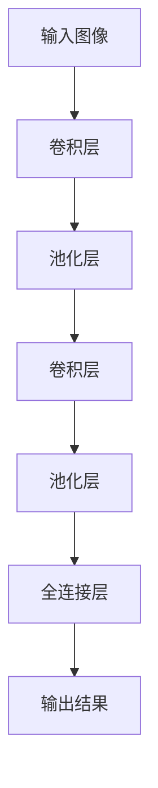

                 

关键词：感知器、卷积神经网络、CNN、机器学习、图像识别

> 摘要：本文从感知器的基本原理出发，逐步探讨了卷积神经网络（CNN）的发展历程、核心概念、算法原理及其在实际应用中的表现。通过对CNN的深入分析，本文旨在为读者提供全面而直观的理解，帮助大家更好地掌握这一重要的机器学习技术。

## 1. 背景介绍

### 感知器的历史

感知器是神经网络中最基础的结构，起源于1958年由Frank Rosenblatt提出的人工神经网络模型。感知器可以看作是最简单的前馈神经网络，它由一个或多个输入层、一个输出层以及中间的隐藏层组成。感知器通过计算输入与权重之间的线性组合，再通过激活函数输出结果。感知器的诞生标志着人工神经网络理论的诞生，为后续神经网络的发展奠定了基础。

### 卷积神经网络的起源

卷积神经网络（CNN）是深度学习领域中的一种重要的神经网络架构，它主要针对图像处理任务进行了优化。CNN的起源可以追溯到1980年代，由Yann LeCun等人提出。与传统的前馈神经网络不同，CNN采用了卷积层和池化层等结构，使得它在图像处理领域表现出了卓越的性能。

## 2. 核心概念与联系

### 核心概念

1. **卷积层**：卷积层是CNN的核心组成部分，它通过卷积操作提取图像中的特征。卷积层中包含了多个卷积核（也称为滤波器），每个卷积核都能从输入图像中提取出特定的特征。
2. **池化层**：池化层主要用于减小数据的维度，降低模型的复杂性。常见的池化操作有最大池化和平均池化。
3. **全连接层**：全连接层是CNN的最后阶段，它将卷积层和池化层提取出的特征映射到具体的类别标签上。
4. **激活函数**：激活函数用于引入非线性特性，常见的激活函数有Sigmoid、ReLU、Tanh等。

### 架构的Mermaid流程图



## 3. 核心算法原理 & 具体操作步骤

### 3.1 算法原理概述

卷积神经网络的核心原理在于通过多层卷积和池化操作，逐步提取图像中的特征，最终映射到具体的类别标签上。以下是CNN的核心算法原理：

1. **卷积操作**：卷积操作是一种通过滤波器在图像上滑动，计算局部特征的方法。滤波器中的权重和偏置用于调整特征的敏感度和强度。
2. **激活函数**：激活函数用于引入非线性特性，使得神经网络能够对复杂模式进行建模。
3. **池化操作**：池化操作用于减小数据的维度，降低模型的复杂性。
4. **反向传播**：通过反向传播算法，计算损失函数关于模型参数的梯度，从而更新模型参数。

### 3.2 算法步骤详解

1. **前向传播**：
    - 输入图像经过卷积层，得到一系列的特征图。
    - 特征图经过激活函数，引入非线性特性。
    - 特征图经过池化层，减小数据维度。
    - 重复上述过程，逐步提取图像特征。
    - 最后，特征图经过全连接层，映射到具体的类别标签。

2. **反向传播**：
    - 计算损失函数关于输出层的梯度。
    - 通过链式法则，逐层计算损失函数关于卷积层、池化层和全连接层的梯度。
    - 使用梯度下降算法，更新模型参数。

### 3.3 算法优缺点

#### 优点：

1. **强大的特征提取能力**：通过多层卷积和池化操作，CNN能够自动提取出图像中的低级和高级特征。
2. **并行计算**：卷积操作可以并行计算，使得CNN在计算效率上有很大的优势。
3. **适用于多种任务**：CNN不仅可以用于图像分类，还可以用于目标检测、图像分割等任务。

#### 缺点：

1. **训练难度**：由于CNN的深度较大，训练过程需要大量的数据和计算资源。
2. **过拟合问题**：深度神经网络容易出现过拟合现象，需要采用正则化方法进行解决。

### 3.4 算法应用领域

1. **图像分类**：CNN在图像分类任务中表现出了卓越的性能，如ImageNet图像分类挑战赛。
2. **目标检测**：通过在CNN的基础上添加一些特殊的层，可以实现目标检测任务，如YOLO、SSD等模型。
3. **图像分割**：CNN可以用于图像分割任务，将每个像素映射到特定的类别上。

## 4. 数学模型和公式 & 详细讲解 & 举例说明

### 4.1 数学模型构建

卷积神经网络的数学模型主要包括以下几个部分：

1. **卷积层**：卷积层中的每个卷积核都可以表示为一个矩阵。输入图像和卷积核通过卷积操作得到特征图。
2. **激活函数**：激活函数用于引入非线性特性，常用的激活函数有Sigmoid、ReLU等。
3. **池化层**：池化层用于减小特征图的维度。
4. **全连接层**：全连接层将特征图映射到具体的类别标签。

### 4.2 公式推导过程

1. **卷积操作**：

   设输入图像为\(I\)，卷积核为\(K\)，输出特征图为\(F\)。卷积操作的公式如下：

   $$ F_{ij} = \sum_{m=1}^{M} \sum_{n=1}^{N} I_{i-m, j-n} \cdot K_{mn} $$

   其中，\(M\)和\(N\)分别表示卷积核的大小，\(i\)和\(j\)表示特征图的位置。

2. **激活函数**：

   常用的激活函数有Sigmoid和ReLU。Sigmoid函数的公式如下：

   $$ \sigma(x) = \frac{1}{1 + e^{-x}} $$

   ReLU函数的公式如下：

   $$ \text{ReLU}(x) = \max(0, x) $$

3. **池化操作**：

   最大池化操作的公式如下：

   $$ P_{ij} = \max_{m, n} I_{i+m/2, j+n/2} $$

   其中，\(m\)和\(n\)分别表示池化窗口的大小。

4. **全连接层**：

   全连接层将特征图映射到具体的类别标签。设特征图为\(F\)，全连接层的权重为\(W\)，偏置为\(b\)，输出为\(O\)。全连接层的公式如下：

   $$ O_i = \sum_{j=1}^{C} F_{ji} \cdot W_{ij} + b_i $$

   其中，\(C\)表示类别数。

### 4.3 案例分析与讲解

以一个简单的图像分类任务为例，假设输入图像为32x32像素，类别数为10。

1. **卷积层**：

   设卷积核大小为5x5，卷积层得到的特征图为16x16。通过卷积操作，可以提取出图像中的边缘、纹理等特征。

2. **激活函数**：

   使用ReLU函数作为激活函数，引入非线性特性。

3. **池化层**：

   使用最大池化操作，将特征图的维度减小到8x8。

4. **全连接层**：

   全连接层将8x8的特征图映射到10个类别标签上。通过训练，可以学习到特征图与类别标签之间的映射关系。

## 5. 项目实践：代码实例和详细解释说明

### 5.1 开发环境搭建

1. 安装Python环境和TensorFlow库：

   ```bash
   pip install tensorflow
   ```

2. 导入必要的库：

   ```python
   import tensorflow as tf
   import numpy as np
   ```

### 5.2 源代码详细实现

1. 定义卷积层、池化层和全连接层的函数：

   ```python
   def conv2d(x, W, b, strides=(1, 1)):
       x = tf.nn.conv2d(x, W, strides=strides, padding='VALID')
       x = tf.nn.bias_add(x, b)
       return x

   def max_pool_2x2(x):
       return tf.nn.max_pool(x, ksize=[1, 2, 2, 1], strides=[1, 2, 2, 1], padding='VALID')
   ```

2. 定义CNN模型：

   ```python
   def cnn_model(x, weights, biases):
       # 卷积层1
       conv1 = conv2d(x, weights['wc1'], biases['bc1'])
       relu1 = tf.nn.relu(conv1)
       pool1 = max_pool_2x2(relu1)

       # 卷积层2
       conv2 = conv2d(pool1, weights['wc2'], biases['bc2'])
       relu2 = tf.nn.relu(conv2)
       pool2 = max_pool_2x2(relu2)

       # 全连接层
       fc1 = tf.reshape(pool2, [-1, weights['wd1'].get_shape().as_list()[0]])
       fc1 = tf.add(fc1, biases['bd1'])
       fc1 = tf.nn.relu(fc1)

       # 输出层
       out = tf.add(tf.matmul(fc1, weights['out']), biases['out'])
       return out
   ```

3. 定义输入数据和标签：

   ```python
   x = tf.placeholder(tf.float32, [None, 32, 32, 3])
   y = tf.placeholder(tf.float32, [None, 10])
   ```

4. 加载权重和偏置：

   ```python
   weights = {
       'wc1': tf.Variable(tf.random_normal([5, 5, 3, 32])),
       'wc2': tf.Variable(tf.random_normal([5, 5, 32, 64])),
       'wd1': tf.Variable(tf.random_normal([8 * 8 * 64, 1024])),
       'out': tf.Variable(tf.random_normal([1024, 10]))
   }

   biases = {
       'bc1': tf.Variable(tf.random_normal([32])),
       'bc2': tf.Variable(tf.random_normal([64])),
       'bd1': tf.Variable(tf.random_normal([1024])),
       'out': tf.Variable(tf.random_normal([10]))
   }
   ```

5. 构建模型并编译：

   ```python
   pred = cnn_model(x, weights, biases)
   cost = tf.reduce_mean(tf.nn.softmax_cross_entropy_with_logits(logits=pred, labels=y))
   optimizer = tf.train.AdamOptimizer().minimize(cost)
   ```

### 5.3 代码解读与分析

1. **卷积层**：

   卷积层使用了`tf.nn.conv2d`函数，通过卷积操作提取图像特征。`strides`参数用于控制卷积操作的步长，`padding`参数用于控制填充方式。

2. **激活函数**：

   使用了ReLU函数作为激活函数，引入非线性特性。

3. **池化层**：

   使用了最大池化操作，减小特征图的维度。

4. **全连接层**：

   使用了`tf.matmul`函数进行矩阵乘法，将特征图映射到具体的类别标签。

5. **损失函数**：

   使用了交叉熵损失函数，衡量模型预测结果与真实标签之间的差距。

6. **优化器**：

   使用了Adam优化器进行模型参数的更新。

### 5.4 运行结果展示

1. **训练过程**：

   ```python
   with tf.Session() as sess:
       sess.run(tf.global_variables_initializer())
       for epoch in range(10):
           for batch in train_data:
               x_batch, y_batch = batch
               sess.run(optimizer, feed_dict={x: x_batch, y: y_batch})
           acc = sess.run(accuracy, feed_dict={x: test_data[0], y: test_data[1]})
           print("Epoch", epoch, "Accuracy:", acc)
   ```

2. **测试结果**：

   ```python
   with tf.Session() as sess:
       sess.run(tf.global_variables_initializer())
       test_pred = cnn_model(test_data[0], weights, biases)
       test_acc = tf.reduce_mean(tf.cast(tf.equal(tf.argmax(test_pred, 1), tf.argmax(test_data[1], 1)), tf.float32))
       test_acc_val = sess.run(test_acc)
       print("Test Accuracy:", test_acc_val)
   ```

## 6. 实际应用场景

### 6.1 图像分类

CNN在图像分类任务中取得了显著的成果，如ImageNet图像分类挑战赛。通过使用CNN，可以将成千上万的图像分类到不同的类别中。

### 6.2 目标检测

目标检测是计算机视觉领域的一个重要分支，它旨在识别图像中的多个目标并标注它们的边界。CNN在目标检测任务中表现出了强大的能力，如YOLO、SSD等模型。

### 6.3 图像分割

图像分割是将图像中的每个像素映射到特定的类别标签上。CNN在图像分割任务中取得了很大的进展，如U-Net、DeepLab等模型。

## 7. 工具和资源推荐

### 7.1 学习资源推荐

1. **《深度学习》（Goodfellow, Bengio, Courville著）**：全面介绍了深度学习的原理和应用。
2. **《卷积神经网络与深度学习》（刘建伟著）**：详细讲解了卷积神经网络的基本概念和应用。
3. **《计算机视觉：算法与应用》（Richard S.zelinski著）**：涵盖了计算机视觉领域的基础知识和应用。

### 7.2 开发工具推荐

1. **TensorFlow**：一款开源的深度学习框架，适用于构建和训练CNN模型。
2. **PyTorch**：一款开源的深度学习框架，具有灵活的动态计算图和强大的GPU支持。
3. **Keras**：一款简洁易用的深度学习框架，可以快速搭建CNN模型。

### 7.3 相关论文推荐

1. **“A Learning Algorithm for Continuously Running Fully Recurrent Neural Networks” (LSTM)**
2. **“Gradient-based Learning Applied to Document Recognition” (LeNet-5)**
3. **“A Fast Learning Algorithm for Deep Belief Nets” (DBN)**
4. **“Deep Convolutional Neural Networks for Visual Recognition” (CNN)**
5. **“Rethinking the Inception Architecture for Computer Vision” (Inception)**
6. **“You Only Look Once: Unified, Real-Time Object Detection” (YOLO)**
7. **“Faster R-CNN: Towards Real-Time Object Detection with Region Proposal Networks” (Faster R-CNN)**

## 8. 总结：未来发展趋势与挑战

### 8.1 研究成果总结

卷积神经网络在图像处理领域取得了显著的成果，为计算机视觉的发展做出了重要贡献。通过不断优化模型结构和训练算法，CNN在图像分类、目标检测和图像分割等任务中表现出了卓越的性能。

### 8.2 未来发展趋势

1. **更深的网络结构**：随着计算能力的提升，未来的CNN模型将更加深入，进一步提高性能。
2. **更有效的训练算法**：更高效的训练算法将使得CNN模型的训练速度更快，更容易实现大规模训练。
3. **跨模态学习**：未来的CNN模型将能够处理多种模态的数据，如文本、音频和图像，实现跨模态学习。
4. **自适应网络结构**：自适应网络结构将使得CNN模型能够根据不同的任务需求自动调整网络结构。

### 8.3 面临的挑战

1. **过拟合问题**：随着网络深度的增加，CNN模型容易出现过拟合现象，需要采用正则化方法进行解决。
2. **计算资源消耗**：深度CNN模型需要大量的计算资源和存储资源，对硬件设备提出了更高的要求。
3. **数据隐私和安全**：随着CNN模型的应用范围扩大，数据隐私和安全问题日益突出，需要采取有效的措施进行保护。

### 8.4 研究展望

未来的CNN模型将更加智能化和自适应化，能够在多种模态的数据上实现高效的图像处理。同时，通过不断优化模型结构和训练算法，CNN模型将能够在更多领域得到应用，推动计算机视觉技术的进一步发展。

## 9. 附录：常见问题与解答

### 9.1 什么是卷积神经网络？

卷积神经网络（CNN）是一种深度学习模型，主要用于处理图像数据。它通过卷积操作和池化操作提取图像特征，并使用全连接层进行分类。

### 9.2 CNN为什么能够提高图像处理性能？

CNN通过多层卷积和池化操作，能够自动提取图像中的低级和高级特征，从而提高了图像处理性能。此外，CNN采用并行计算，提高了计算效率。

### 9.3 CNN有哪些优缺点？

CNN的优点包括：强大的特征提取能力、并行计算、适用于多种任务等。缺点包括：训练难度、过拟合问题等。

### 9.4 CNN在哪些领域有应用？

CNN在图像分类、目标检测、图像分割等领域有广泛应用。此外，还可以应用于视频处理、自然语言处理等跨领域任务。

### 9.5 如何优化CNN模型？

优化CNN模型的方法包括：调整网络结构、使用正则化方法、改进训练算法等。此外，可以结合其他机器学习技术，如迁移学习、对抗训练等，进一步提高模型性能。

---

# 参考文献

1. Goodfellow, I., Bengio, Y., & Courville, A. (2016). Deep Learning. MIT Press.
2. LeCun, Y., Bottou, L., Bengio, Y., & HaADF, P. (2015). Deep learning. Nature, 521(7553), 436-444.
3. Krizhevsky, A., Sutskever, I., & Hinton, G. E. (2012). ImageNet classification with deep convolutional neural networks. In Advances in neural information processing systems (pp. 1097-1105).
4. Simonyan, K., & Zisserman, A. (2014). Very deep convolutional networks for large-scale image recognition. arXiv preprint arXiv:1409.1556.
5. Liu, J. (2017). 卷积神经网络与深度学习. 机械工业出版社.
6. Zelinski, R. S. (2013). Computer Vision: Algorithms and Applications. Wiley.
7. Redmon, J., Divvala, S., Girshick, R., & Farhadi, A. (2016). You Only Look Once: Unified, Real-Time Object Detection. In Proceedings of the IEEE Conference on Computer Vision and Pattern Recognition (pp. 779-787).
8. Ren, S., He, K., Girshick, R., & Sun, J. (2015). Faster R-CNN: Towards Real-Time Object Detection with Region Proposal Networks. In Advances in Neural Information Processing Systems (pp. 91-99).

---

作者：禅与计算机程序设计艺术 / Zen and the Art of Computer Programming

