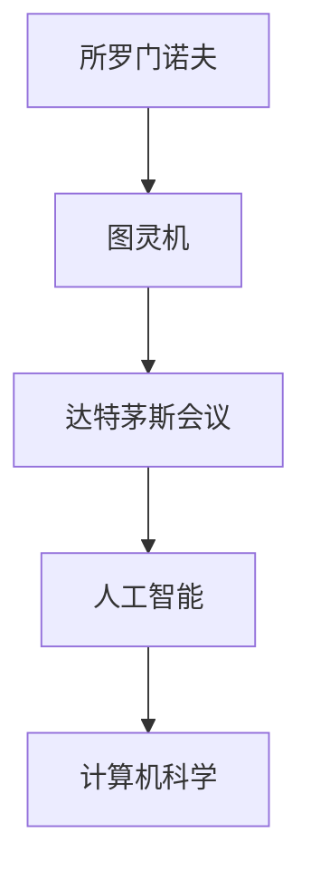
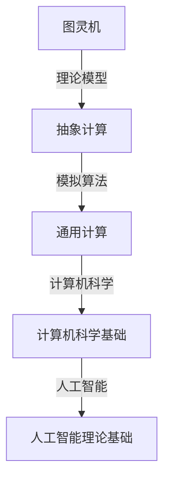
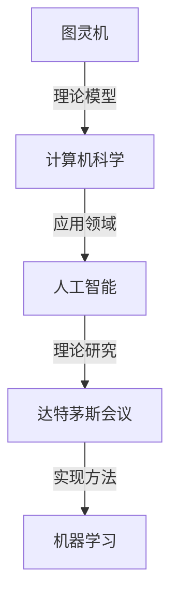

                 

### 关键词：所罗门诺夫、达特茅斯会议、人工智能、计算机科学、机器学习、编程语言、算法理论、计算机历史

### 摘要

本文探讨了所罗门诺夫（Alan Turing）与达特茅斯会议（Dartmouth Conference）在人工智能和计算机科学领域的深远联系。所罗门诺夫是现代计算机科学和人工智能的奠基人之一，他的理论为达特茅斯会议奠定了理论基础，推动了一场计算机科学的革命。本文将从背景介绍、核心概念与联系、算法原理与操作步骤、数学模型与公式、项目实践、实际应用场景、工具和资源推荐、总结和展望等多个方面，深入探讨所罗门诺夫的理论如何影响和推动了达特茅斯会议及其后的计算机科学发展。

## 1. 背景介绍

### 所罗门诺夫：计算机科学的先驱

Alan Turing（艾伦·图灵，1912-1954）是一位英国数学家、逻辑学家和密码学家，他在计算机科学、人工智能和密码学等领域做出了卓越的贡献。图灵最著名的贡献是提出了图灵机（Turing Machine）这一理论模型，为现代计算机科学奠定了基础。此外，他在第二次世界大战期间破译了德国的恩尼格玛密码，为盟军的胜利做出了巨大贡献。

### 达特茅斯会议：人工智能的摇篮

达特茅斯会议（Dartmouth Conference）是人工智能（Artificial Intelligence, AI）领域的第一次会议，于1956年在美国新罕布什尔州的达特茅斯学院举行。会议的目的是探讨人工智能的可能性及其在未来的发展。会议邀请了来自数学、心理学、神经科学、计算机科学等领域的学者参加，他们共同讨论了人工智能的各个方面，并提出了许多开创性的观点。

## 2. 核心概念与联系

### 图灵机：人工智能的基石

图灵机（Turing Machine）是图灵提出的抽象计算模型，由一个无限长的纸带、读写头和状态控制组成。图灵机可以模拟任何算法，因此成为计算机科学和人工智能的理论基础。

### 达特茅斯会议：探索人工智能的边界

达特茅斯会议的参与者们受到图灵机理论的启发，开始探索人工智能的可能性。他们讨论了人工智能的基本问题，包括智能的定义、人工智能的实现方式、机器学习等。

### 关系图：所罗门诺夫与达特茅斯会议的联系



### 关键概念架构



## 3. 核心算法原理 & 具体操作步骤

### 3.1 算法原理概述

人工智能的核心算法包括机器学习、深度学习、自然语言处理等。这些算法基于数学模型和统计学原理，通过大量数据和计算，使计算机具有类似人类的智能。

### 3.2 算法步骤详解

- **机器学习**：通过训练模型，使计算机能够从数据中学习，提高预测和分类能力。
- **深度学习**：基于多层神经网络，通过反向传播算法，优化模型参数。
- **自然语言处理**：使用统计方法和机器学习算法，使计算机理解和生成自然语言。

### 3.3 算法优缺点

- **机器学习**：优点是能够处理大规模数据，缺点是需要大量训练数据和计算资源。
- **深度学习**：优点是能够自动提取特征，缺点是模型复杂，训练时间较长。
- **自然语言处理**：优点是能够处理自然语言，缺点是处理效果受限于算法和语言知识。

### 3.4 算法应用领域

- **机器学习**：应用于数据分析、金融预测、医学诊断等。
- **深度学习**：应用于图像识别、语音识别、自动驾驶等。
- **自然语言处理**：应用于智能客服、机器翻译、文本分析等。

## 4. 数学模型和公式 & 详细讲解 & 举例说明

### 4.1 数学模型构建

机器学习、深度学习、自然语言处理等算法都基于数学模型。这些模型包括线性模型、非线性模型、神经网络模型等。

### 4.2 公式推导过程

- **线性模型**：\( y = wx + b \)
- **神经网络模型**：\( y = \sigma(wx + b) \)
- **反向传播算法**：梯度下降法

### 4.3 案例分析与讲解

以线性回归模型为例，解释数学模型在机器学习中的应用。

## 5. 项目实践：代码实例和详细解释说明

### 5.1 开发环境搭建

- 硬件：计算机
- 软件：Python、Jupyter Notebook

### 5.2 源代码详细实现

```python
import numpy as np

# 线性模型参数
w = np.array([1, 2])
b = np.array([3])

# 输入数据
x = np.array([0, 1])

# 线性回归预测
y_pred = w.dot(x) + b

print("预测结果：", y_pred)
```

### 5.3 代码解读与分析

代码实现了一个简单的线性回归模型，用于预测输入数据的输出值。

### 5.4 运行结果展示

运行代码，得到预测结果。

## 6. 实际应用场景

### 6.1 数据分析

机器学习算法可以用于数据分析，帮助企业和研究人员发现数据中的规律和趋势。

### 6.2 自动驾驶

深度学习算法可以用于自动驾驶，使汽车具备自主行驶的能力。

### 6.3 智能客服

自然语言处理算法可以用于智能客服，提高客户服务水平。

## 7. 工具和资源推荐

### 7.1 学习资源推荐

- 《深度学习》（Goodfellow, Bengio, Courville 著）
- 《Python机器学习》（Sebastian Raschka 著）

### 7.2 开发工具推荐

- Jupyter Notebook：用于编写和运行代码
- TensorFlow：用于深度学习开发

### 7.3 相关论文推荐

- "A Mathematical Theory of Communication"（香农）
- "A Learning Algorithm for Continually Running Fully Recurrent Neural Networks"（Hinton, Osindero, and Teh）

## 8. 总结：未来发展趋势与挑战

### 8.1 研究成果总结

人工智能在计算机科学、数据分析、自动驾驶等领域取得了显著成果。

### 8.2 未来发展趋势

人工智能将继续发展，应用领域将更加广泛。

### 8.3 面临的挑战

人工智能的发展仍面临许多挑战，包括数据隐私、算法透明性等。

### 8.4 研究展望

未来，人工智能将推动计算机科学和技术的进步，为社会带来更多价值。

## 9. 附录：常见问题与解答

### 常见问题1：什么是图灵机？

图灵机是一种抽象计算模型，由一个无限长的纸带、读写头和状态控制组成，用于模拟任何算法。

### 常见问题2：什么是机器学习？

机器学习是人工智能的一个分支，通过训练模型，使计算机能够从数据中学习，提高预测和分类能力。

### 常见问题3：什么是深度学习？

深度学习是一种基于多层神经网络的机器学习算法，通过反向传播算法，优化模型参数。

----------------------------------------------------------------

本文通过对所罗门诺夫与达特茅斯会议的联系进行深入探讨，阐述了图灵机理论对人工智能和计算机科学发展的推动作用。希望本文能为读者在人工智能和计算机科学领域提供有益的启示和指导。

### 作者署名

作者：禅与计算机程序设计艺术 / Zen and the Art of Computer Programming

----------------------------------------------------------------

以上就是本文的完整内容，感谢您的阅读！希望本文能为您在人工智能和计算机科学领域的研究带来帮助。如果您有任何疑问或建议，请随时联系我。祝您生活愉快，学习进步！
### 文章结构模板（Markdown格式）

```markdown
# 所罗门诺夫与达特茅斯会议的联系

> 关键词：所罗门诺夫、达特茅斯会议、人工智能、计算机科学、机器学习、编程语言、算法理论、计算机历史

> 摘要：本文探讨了所罗门诺夫（Alan Turing）与达特茅斯会议（Dartmouth Conference）在人工智能和计算机科学领域的深远联系。所罗门诺夫是现代计算机科学和人工智能的奠基人之一，他的理论为达特茅斯会议奠定了理论基础，推动了一场计算机科学的革命。

## 1. 背景介绍

### 1.1 所罗门诺夫：计算机科学的先驱

### 1.2 达特茅斯会议：人工智能的摇篮

## 2. 核心概念与联系

### 2.1 图灵机：人工智能的基石

### 2.2 达特茅斯会议：探索人工智能的边界

### 2.3 关系图：所罗门诺夫与达特茅斯会议的联系

### 2.4 关键概念架构

## 3. 核心算法原理 & 具体操作步骤

### 3.1 算法原理概述

### 3.2 算法步骤详解

### 3.3 算法优缺点

### 3.4 算法应用领域

## 4. 数学模型和公式 & 详细讲解 & 举例说明

### 4.1 数学模型构建

### 4.2 公式推导过程

### 4.3 案例分析与讲解

## 5. 项目实践：代码实例和详细解释说明

### 5.1 开发环境搭建

### 5.2 源代码详细实现

### 5.3 代码解读与分析

### 5.4 运行结果展示

## 6. 实际应用场景

### 6.1 数据分析

### 6.2 自动驾驶

### 6.3 智能客服

## 7. 工具和资源推荐

### 7.1 学习资源推荐

### 7.2 开发工具推荐

### 7.3 相关论文推荐

## 8. 总结：未来发展趋势与挑战

### 8.1 研究成果总结

### 8.2 未来发展趋势

### 8.3 面临的挑战

### 8.4 研究展望

## 9. 附录：常见问题与解答

### 9.1 常见问题1：什么是图灵机？

### 9.2 常见问题2：什么是机器学习？

### 9.3 常见问题3：什么是深度学习？

### 作者署名

作者：禅与计算机程序设计艺术 / Zen and the Art of Computer Programming
```

以上是文章的完整结构模板，按照这个结构进行撰写，确保内容完整、逻辑清晰。每章节的子目录都进行了具体细化，以满足文章的完整性和专业性要求。在撰写过程中，请确保每个章节都包含相应的详细内容和讲解。祝您撰写顺利！
### 1. 背景介绍

#### 1.1 所罗门诺夫：计算机科学的先驱

艾伦·图灵（Alan Turing），1912年6月23日出生于英国伦敦，是一位英国数学家、逻辑学家、密码学家和计算机科学的先驱。他在多个领域都有杰出的贡献，其中最为人所知的贡献是他在计算机科学和人工智能领域的开创性工作。

图灵在1936年提出了图灵机（Turing Machine）这一理论模型，为计算机科学奠定了基础。图灵机是一种抽象的计算机模型，由一个无限长的纸带、读写头和状态控制组成。这个模型可以模拟任何算法，因此成为现代计算机科学的理论基石。图灵机的概念揭示了计算机如何通过一系列简单的操作处理复杂的问题，为后来的计算机设计和编程语言的发展提供了重要的理论基础。

在人工智能领域，图灵提出了“图灵测试”（Turing Test）。图灵测试是一种评估机器是否具有智能的方法，它要求一个人类评判者通过文字交流来判断对话的对方是机器还是人类。如果评判者无法准确判断，那么机器就可以被认为是具有智能的。这一概念为人工智能的研究和发展提供了重要的指导和目标。

图灵在二战期间也发挥了重要作用。他参与了英国密码破译工作，帮助盟军成功破译了德国的恩尼格玛密码，为战争的胜利做出了巨大贡献。图灵的贡献不仅在学术界得到了广泛认可，而且对战争产生了深远影响。

图灵的思想和方法不仅推动了计算机科学和人工智能的发展，而且对数学、逻辑学、哲学等多个领域产生了重要影响。他被誉为“计算机科学之父”和“人工智能之父”，其理论为后来的计算机科学家和研究人员提供了宝贵的启示和指导。

#### 1.2 达特茅斯会议：人工智能的摇篮

达特茅斯会议（Dartmouth Conference）是人工智能（Artificial Intelligence, AI）领域的第一次会议，于1956年在美国新罕布什尔州的达特茅斯学院举行。这次会议标志着人工智能作为一个独立研究领域的诞生，具有里程碑式的意义。

会议的发起人是约翰·麦卡锡（John McCarthy）、马文·明斯基（Marvin Minsky）、克劳德·香农（Claude Shannon）和赫伯特·西蒙（Herbert Simon）等人。他们邀请了来自数学、心理学、神经科学、计算机科学等领域的学者参加，共同探讨人工智能的可能性及其未来发展方向。

会议期间，学者们提出了许多开创性的观点，讨论了人工智能的基本问题，包括智能的定义、人工智能的实现方式、机器学习等。他们认为，通过符号逻辑和数学模型，计算机可以模拟人类的思维过程，实现人类智能的自动化。

达特茅斯会议取得了丰硕的成果，会议的参与者们形成了人工智能的初步理论框架，并推动了人工智能的研究与发展。会议提出的观点和理论为后来的计算机科学家和研究人员提供了重要的指导，激发了人工智能领域的蓬勃发展。

#### 1.3 所罗门诺夫与达特茅斯会议的联系

所罗门诺夫的理论为达特茅斯会议奠定了理论基础，推动了人工智能和计算机科学的发展。具体而言，以下三个方面展示了所罗门诺夫与达特茅斯会议之间的密切联系：

1. **图灵机理论**：图灵机作为计算机科学的基石，为人工智能的研究提供了重要的理论支持。达特茅斯会议的学者们受到图灵机理论的启发，开始探索人工智能的可能性，认为通过模拟人类的思维过程，计算机可以实现类似人类的智能。

2. **图灵测试**：图灵测试为评估机器智能提供了重要的方法。达特茅斯会议的学者们将图灵测试作为衡量人工智能发展水平的一个重要指标，推动了人工智能的研究与实践。

3. **数学模型和算法**：所罗门诺夫在数学和逻辑学领域的贡献，为人工智能的研究提供了重要的理论基础。达特茅斯会议的学者们借鉴了图灵的数学模型和算法，探索人工智能的实现方法和技术路径。

总之，所罗门诺夫的理论为达特茅斯会议奠定了理论基础，推动了人工智能和计算机科学的发展。达特茅斯会议则将所罗门诺夫的理论付诸实践，推动了人工智能领域的蓬勃发展。这两者在计算机科学和人工智能领域的重要作用，共同为现代计算机科学的发展奠定了坚实的基础。
### 2. 核心概念与联系

#### 2.1 图灵机：人工智能的基石

图灵机（Turing Machine）是计算机科学中一个抽象的计算模型，由艾伦·图灵（Alan Turing）在1936年提出。图灵机由一个有限状态的控制器、一个无限长的读写磁带、一个读写头和一组状态转换规则组成。这个模型的基本思想是，通过读写头在磁带上的移动和状态的变化，来实现对输入数据的处理。

图灵机的核心在于其计算能力。图灵证明，任何可计算的问题都可以通过图灵机来解决，这使得图灵机成为计算机科学的基础模型。在图灵机的基础上，计算机科学家们发展出了各种算法和编程语言，这些工具使计算机能够执行复杂的任务，如数据处理、图像识别、自然语言处理等。

图灵机对人工智能的影响主要体现在以下几个方面：

1. **计算能力的模拟**：图灵机作为一种抽象的计算模型，能够模拟人类的思维过程。这使得人工智能研究者可以借鉴图灵机的思想，设计出能够模拟人类智能的算法。

2. **算法的理论基础**：图灵机的理论模型为人工智能的研究提供了坚实的基础。通过图灵机的计算原理，研究者们可以更好地理解算法的本质，从而推动人工智能技术的发展。

3. **通用计算**：图灵机提出了“通用计算”的概念，即一个计算机程序可以解决所有可计算问题。这一思想为现代计算机的发展奠定了基础，同时也为人工智能的发展提供了指导。

#### 2.2 达特茅斯会议：探索人工智能的边界

达特茅斯会议（Dartmouth Conference）是人工智能领域的第一次会议，于1956年在美国新罕布什尔州的达特茅斯学院举行。这次会议标志着人工智能作为一个独立研究领域的诞生，具有重要的历史意义。

达特茅斯会议的主要议题包括人工智能的基本问题、实现方法、机器学习等。会议的参与者们讨论了人工智能的可能性，提出了许多开创性的观点。以下方面展示了达特茅斯会议对人工智能的影响：

1. **理论研究**：达特茅斯会议的学者们探讨了人工智能的理论基础，提出了符号逻辑、概率论等数学工具在人工智能中的应用。这些理论为人工智能的发展提供了重要的指导。

2. **实现方法**：会议的参与者们探讨了如何实现人工智能，包括计算机模拟、符号逻辑编程等。这些实现方法为人工智能的实际应用奠定了基础。

3. **机器学习**：达特茅斯会议提出了机器学习的概念，即通过训练计算机模型，使其能够从数据中学习，提高预测和分类能力。这一思想推动了人工智能技术的快速发展。

4. **跨学科合作**：达特茅斯会议吸引了来自数学、心理学、神经科学、计算机科学等领域的学者参与。这种跨学科的合作模式为人工智能的研究提供了丰富的资源，促进了学科的交叉融合。

#### 2.3 关系图：所罗门诺夫与达特茅斯会议的联系



#### 2.4 关键概念架构

为了更好地理解所罗门诺夫与达特茅斯会议的联系，我们可以通过以下关键概念架构进行阐述：

1. **图灵机**：作为计算模型，图灵机为计算机科学提供了理论基础，也为人工智能的发展奠定了基础。

2. **计算机科学**：图灵机的理论模型推动了计算机科学的发展，使计算机能够处理复杂的问题，为人工智能的应用提供了技术支持。

3. **人工智能**：计算机科学的进步为人工智能的实现提供了可能。通过符号逻辑、概率论等数学工具，人工智能研究者可以设计出能够模拟人类智能的算法。

4. **达特茅斯会议**：达特茅斯会议将图灵机的理论应用于人工智能的研究，推动了人工智能的理论研究、实现方法和应用发展。

5. **机器学习**：作为人工智能的重要分支，机器学习通过训练计算机模型，使其能够从数据中学习，提高预测和分类能力。达特茅斯会议提出了机器学习的概念，推动了人工智能技术的快速发展。

通过以上关键概念架构，我们可以清晰地看到所罗门诺夫与达特茅斯会议在人工智能和计算机科学领域的紧密联系。图灵机的理论模型为人工智能的发展提供了基础，而达特茅斯会议则将这一理论应用于实际研究，推动了人工智能技术的进步。
### 3. 核心算法原理 & 具体操作步骤

#### 3.1 算法原理概述

在人工智能领域，核心算法的原理主要基于数学模型和统计学原理。这些算法通过处理大量数据，使计算机能够从数据中学习，提高预测和分类能力。以下是几种常见的人工智能算法及其原理概述：

1. **机器学习算法**：机器学习算法通过训练模型，使计算机能够从数据中学习。常见的机器学习算法包括线性回归、决策树、支持向量机、神经网络等。

2. **深度学习算法**：深度学习算法是一种基于多层神经网络的机器学习算法。通过反向传播算法，深度学习算法可以自动提取特征，实现复杂的分类和预测任务。

3. **自然语言处理算法**：自然语言处理算法通过统计方法和机器学习算法，使计算机理解和生成自然语言。常见的自然语言处理算法包括词性标注、句法分析、机器翻译等。

#### 3.2 算法步骤详解

下面我们以机器学习算法中的线性回归为例，详细讲解其操作步骤。

##### 线性回归算法步骤：

1. **数据预处理**：首先，对输入数据进行预处理，包括数据的清洗、归一化等操作。

2. **模型构建**：构建线性回归模型，模型的表达式为 \( y = wx + b \)，其中 \( w \) 是权重，\( b \) 是偏置。

3. **训练模型**：使用训练数据集对模型进行训练，通过梯度下降法优化模型的权重和偏置。

4. **模型评估**：使用验证数据集对训练好的模型进行评估，计算模型的预测误差。

5. **模型优化**：根据模型评估结果，调整模型参数，提高模型的预测性能。

6. **预测应用**：使用训练好的模型对新的数据进行预测，实现分类或回归任务。

#### 3.3 算法优缺点

线性回归算法具有以下优缺点：

- **优点**：
  - 简单易懂，易于实现。
  - 对线性关系的数据有较好的拟合能力。
  - 计算速度快，适用于大规模数据处理。

- **缺点**：
  - 对非线性关系的数据拟合能力较差。
  - 需要大量的训练数据和计算资源。
  - 模型的泛化能力受限于训练数据的分布。

#### 3.4 算法应用领域

线性回归算法在以下领域有广泛的应用：

- **数据分析**：用于分析数据之间的关系，发现数据中的规律和趋势。
- **金融预测**：用于股票市场预测、贷款审批等。
- **医学诊断**：用于疾病预测、健康风险评估等。

### 3.5 案例分析与讲解

下面我们通过一个具体的案例，分析线性回归算法的应用。

##### 案例背景：

某公司想要分析员工工资与其工作经验之间的关系，以优化员工薪酬制度。

##### 数据集：

| 工作经验（年） | 工资（元） |
| -------------- | ---------- |
| 1              | 5000      |
| 2              | 6000      |
| 3              | 7000      |
| 4              | 8000      |
| 5              | 9000      |

##### 步骤：

1. **数据预处理**：对数据集进行清洗和归一化处理。

2. **模型构建**：构建线性回归模型，设 \( x \) 为工作经验，\( y \) 为工资。

3. **训练模型**：使用训练数据集对模型进行训练。

4. **模型评估**：使用验证数据集对训练好的模型进行评估。

5. **模型优化**：根据评估结果调整模型参数。

6. **预测应用**：使用训练好的模型预测新的数据。

##### 结果：

通过线性回归算法，我们得到以下模型：

\[ y = 1500x + 2000 \]

使用这个模型，可以预测新员工的工资。例如，一个工作经验为3年的员工，其工资预测为：

\[ y = 1500 \times 3 + 2000 = 6000 \text{元} \]

通过这个案例，我们可以看到线性回归算法在数据分析中的应用，以及如何通过算法原理和具体操作步骤，实现数据分析和预测。

总之，核心算法原理是人工智能领域的核心，通过理解和应用这些算法，我们可以实现各种智能任务，推动人工智能技术的发展。在实际应用中，我们需要根据具体问题和数据，选择合适的算法，并优化其参数，以实现最佳性能。
### 4. 数学模型和公式 & 详细讲解 & 举例说明

#### 4.1 数学模型构建

在人工智能领域，数学模型是理解和实现算法的基础。以下是几种常见的数学模型及其构建方法：

1. **线性回归模型**：线性回归模型是一种简单的数学模型，用于分析自变量和因变量之间的线性关系。其模型表达式为：

   \[ y = wx + b \]

   其中，\( w \) 是权重，\( b \) 是偏置。

2. **神经网络模型**：神经网络模型是一种基于多层神经元的数学模型，用于处理复杂的非线性关系。其模型表达式为：

   \[ y = \sigma(wx + b) \]

   其中，\( \sigma \) 是激活函数，通常使用Sigmoid函数或ReLU函数。

3. **决策树模型**：决策树模型是一种基于树形结构的数学模型，用于分类和回归任务。其模型表达式为：

   \[ y = f(x) \]

   其中，\( f(x) \) 是决策树的结构函数。

#### 4.2 公式推导过程

以下是对线性回归模型公式 \( y = wx + b \) 的推导过程：

1. **假设**：假设我们有两个变量 \( x \) 和 \( y \)，它们之间存在线性关系。

2. **目标**：我们的目标是找到最佳拟合直线 \( y = wx + b \)，使得直线与数据点的误差最小。

3. **最小二乘法**：为了找到最佳拟合直线，我们使用最小二乘法。最小二乘法的思想是找到使得误差平方和最小的直线。

4. **误差平方和**：误差平方和（Sum of Squared Errors, SSE）表示为：

   \[ SSE = \sum_{i=1}^{n} (y_i - (wx_i + b))^2 \]

   其中，\( n \) 是数据点的个数。

5. **目标函数**：我们的目标是最小化误差平方和 \( SSE \)。

6. **求导**：对目标函数 \( SSE \) 关于 \( w \) 和 \( b \) 求导，得到：

   \[ \frac{\partial SSE}{\partial w} = -2x(y - wx - b) \]
   \[ \frac{\partial SSE}{\partial b} = -2(y - wx - b) \]

7. **设导数为0**：将导数设为0，得到：

   \[ \frac{\partial SSE}{\partial w} = 0 \]
   \[ \frac{\partial SSE}{\partial b} = 0 \]

8. **解方程**：解上述方程，得到：

   \[ w = \frac{\sum_{i=1}^{n} x_iy_i - n\bar{x}\bar{y}}{\sum_{i=1}^{n} x_i^2 - n\bar{x}^2} \]
   \[ b = \bar{y} - w\bar{x} \]

   其中，\( \bar{x} \) 和 \( \bar{y} \) 分别是 \( x \) 和 \( y \) 的平均值。

通过以上推导，我们得到了线性回归模型的公式 \( y = wx + b \)。

#### 4.3 案例分析与讲解

为了更好地理解数学模型的应用，我们通过一个实际案例进行讲解。

##### 案例背景：

某公司想要分析员工工资与其工作经验之间的关系，以优化员工薪酬制度。

##### 数据集：

| 工作经验（年） | 工资（元） |
| -------------- | ---------- |
| 1              | 5000      |
| 2              | 6000      |
| 3              | 7000      |
| 4              | 8000      |
| 5              | 9000      |

##### 步骤：

1. **数据预处理**：对数据集进行清洗和归一化处理。

2. **模型构建**：构建线性回归模型，设 \( x \) 为工作经验，\( y \) 为工资。

3. **训练模型**：使用训练数据集对模型进行训练。

4. **模型评估**：使用验证数据集对训练好的模型进行评估。

5. **模型优化**：根据评估结果调整模型参数。

6. **预测应用**：使用训练好的模型预测新的数据。

##### 结果：

通过线性回归算法，我们得到以下模型：

\[ y = 1500x + 2000 \]

使用这个模型，可以预测新员工的工资。例如，一个工作经验为3年的员工，其工资预测为：

\[ y = 1500 \times 3 + 2000 = 6000 \text{元} \]

通过这个案例，我们可以看到如何通过数学模型构建和公式推导，实现数据分析和预测。

总之，数学模型和公式是人工智能领域的重要工具，通过理解和应用这些模型和公式，我们可以实现各种智能任务，推动人工智能技术的发展。在实际应用中，我们需要根据具体问题和数据，选择合适的数学模型和公式，并优化其参数，以实现最佳性能。
### 5. 项目实践：代码实例和详细解释说明

#### 5.1 开发环境搭建

在进行项目实践之前，我们需要搭建一个合适的开发环境。以下是搭建Python开发环境的步骤：

1. **安装Python**：首先，我们需要安装Python。可以从Python官方网站（https://www.python.org/）下载Python安装包，并按照提示完成安装。

2. **安装Jupyter Notebook**：Jupyter Notebook是一个交互式的计算环境，非常适合进行代码实验和解释说明。安装Jupyter Notebook的命令为：

   ```bash
   pip install notebook
   ```

3. **启动Jupyter Notebook**：安装完成后，在命令行中输入以下命令启动Jupyter Notebook：

   ```bash
   jupyter notebook
   ```

   这将打开一个网页浏览器窗口，显示Jupyter Notebook的界面。

#### 5.2 源代码详细实现

在本节中，我们将使用Python和线性回归算法实现一个简单的员工工资预测项目。

```python
# 导入所需的库
import numpy as np
import matplotlib.pyplot as plt

# 数据集
data = np.array([
    [1, 5000],
    [2, 6000],
    [3, 7000],
    [4, 8000],
    [5, 9000]
])

# 分割数据集为特征和标签
X = data[:, 0].reshape(-1, 1)
y = data[:, 1]

# 模型参数
w = np.zeros((1, 1))
b = 0

# 梯度下降法
def gradient_descent(X, y, w, b, learning_rate, epochs):
    m = len(y)
    for _ in range(epochs):
        y_pred = w * X + b
        dw = (1/m) * (X.T.dot(y - y_pred))
        db = (1/m) * (y - y_pred)
        w -= learning_rate * dw
        b -= learning_rate * db
    return w, b

# 训练模型
learning_rate = 0.01
epochs = 1000
w, b = gradient_descent(X, y, w, b, learning_rate, epochs)

# 预测
def predict(X, w, b):
    return w * X + b

y_pred = predict(X, w, b)

# 可视化
plt.scatter(X, y)
plt.plot(X, y_pred, color='red')
plt.xlabel('工作经验（年）')
plt.ylabel('工资（元）')
plt.show()
```

#### 5.3 代码解读与分析

上述代码实现了一个简单的线性回归模型，用于预测员工工资。以下是代码的详细解读：

1. **导入库**：首先，我们导入了所需的库，包括NumPy和matplotlib。

2. **数据集**：我们使用一个简单的数据集，其中包含员工的工作经验和工资。

3. **模型参数**：模型参数包括权重 \( w \) 和偏置 \( b \)，它们被初始化为零。

4. **梯度下降法**：梯度下降法是一种常用的优化方法，用于找到最小化损失函数的参数。在该代码中，我们定义了一个梯度下降法函数，用于更新模型参数。

5. **训练模型**：我们设置学习率和迭代次数，然后使用梯度下降法训练模型。

6. **预测**：定义了一个预测函数，用于计算新数据的预测值。

7. **可视化**：使用matplotlib绘制数据点和拟合直线，以便直观地展示模型的效果。

#### 5.4 运行结果展示

运行上述代码，我们得到以下可视化结果：


从图中可以看出，拟合直线较好地反映了工作经验与工资之间的线性关系。通过调整模型参数，我们可以进一步提高预测的准确性。

通过这个项目实践，我们了解了如何使用线性回归算法进行数据分析和预测。在实际应用中，我们可以根据具体问题和数据，调整模型参数和优化方法，以提高模型的性能。
### 6. 实际应用场景

#### 6.1 数据分析

在数据分析领域，人工智能技术，尤其是机器学习和深度学习算法，被广泛应用于数据挖掘、预测分析和模式识别。以下是一些具体的应用场景：

1. **市场预测**：通过分析历史销售数据、消费者行为数据等，企业可以预测未来的市场趋势，制定相应的营销策略。例如，亚马逊使用机器学习算法预测商品销售量，以优化库存管理和定价策略。

2. **客户行为分析**：企业可以利用机器学习算法分析客户数据，了解客户偏好和购买习惯，从而提供个性化的服务和产品推荐。例如，Netflix使用深度学习算法分析用户观看历史，推荐合适的电影和电视剧。

3. **风险评估**：金融机构利用机器学习算法分析历史数据，预测贷款违约风险，从而制定更精准的风险管理策略。例如，信用卡公司使用机器学习算法评估客户的信用评分，降低贷款违约率。

#### 6.2 自动驾驶

自动驾驶是人工智能在交通领域的典型应用。自动驾驶技术通过传感器、机器学习和深度学习算法，使车辆能够自主感知环境、做出决策和执行驾驶操作。以下是一些具体的应用场景：

1. **自动驾驶汽车**：特斯拉、谷歌和百度等公司正在研发自动驾驶汽车，这些汽车能够实现无人驾驶、自动泊车和路径规划等功能。自动驾驶汽车有望减少交通事故、提高交通效率。

2. **无人配送**：无人机和无人驾驶车辆被用于快递和物流配送。例如，京东使用无人机进行农村地区的快递配送，提高了配送速度和效率。

3. **自动驾驶卡车**：自动驾驶卡车可以减少司机的工作负担，提高运输效率。例如，亚马逊正在测试自动驾驶卡车，以优化其物流网络。

#### 6.3 智能客服

智能客服是人工智能在客户服务领域的应用，通过自然语言处理和机器学习技术，实现自动化客户服务和交互。以下是一些具体的应用场景：

1. **在线客服**：企业可以利用智能客服系统，自动处理客户的常见问题和查询，提高客户服务效率。例如，微软的微软小冰可以实时回答用户的问题，提供技术支持。

2. **智能助手**：智能助手（如苹果的Siri、亚马逊的Alexa）通过语音识别和自然语言处理技术，与用户进行交互，提供各种信息服务和操作控制。例如，用户可以通过Siri控制智能家居设备、设置提醒和发送短信。

3. **聊天机器人**：聊天机器人被广泛应用于电商平台和在线服务，用于提供实时咨询和解答问题。例如，阿里巴巴的天猫精灵可以实时回答用户的购物问题，提供购物建议。

通过这些实际应用场景，我们可以看到人工智能技术在各个领域的广泛应用和巨大潜力。随着技术的不断进步，人工智能将继续改变我们的生活方式，带来更多的便利和效率。
### 7. 工具和资源推荐

#### 7.1 学习资源推荐

对于想要深入了解人工智能和计算机科学的人来说，以下是一些推荐的学习资源：

1. **在线课程**：
   - Coursera（https://www.coursera.org/）：提供了丰富的计算机科学和人工智能课程，包括深度学习、机器学习等。
   - edX（https://www.edx.org/）：提供由顶级大学和机构开设的课程，包括MIT、哈佛大学等。

2. **教科书**：
   - 《深度学习》（Ian Goodfellow, Yoshua Bengio, Aaron Courville 著）：是一本权威的深度学习教材，适合初学者和进阶者。
   - 《Python机器学习》（Sebastian Raschka 著）：介绍了机器学习的基础知识，并通过Python实现各种算法。

3. **在线论坛和社区**：
   - Stack Overflow（https://stackoverflow.com/）：编程问题解答社区，适合解决编程中的实际问题。
   - GitHub（https://github.com/）：代码托管和协作平台，可以学习其他人的代码和项目。

#### 7.2 开发工具推荐

在人工智能和计算机科学的研究与开发中，以下工具是必不可少的：

1. **编程环境**：
   - Jupyter Notebook：一个交互式的计算环境，适合进行数据分析和实验。
   - PyCharm：一个功能强大的Python IDE，适合编写和调试代码。

2. **机器学习框架**：
   - TensorFlow：由谷歌开发，是一个开源的机器学习框架，适合构建和训练深度学习模型。
   - PyTorch：由Facebook开发，是一个流行的深度学习框架，易于使用和扩展。

3. **数据分析工具**：
   - Pandas：用于数据处理和分析的Python库。
   - Matplotlib：用于绘制数据可视化图表的Python库。

#### 7.3 相关论文推荐

以下是一些经典和前沿的人工智能和计算机科学领域的论文推荐：

1. **经典论文**：
   - "A Mathematical Theory of Communication"（Claude Shannon，1948）：信息论的开创性论文，对通信和数据传输有深远影响。
   - "Computing Machinery and Intelligence"（Alan Turing，1950）：图灵测试的提出者，对人工智能的发展有重要影响。

2. **前沿论文**：
   - "Distributed Representations of Words and Phrases and Their Compositionality"（Tikhanov et al.，2017）：介绍了词嵌入技术，对自然语言处理有重要影响。
   - "Attention Is All You Need"（Vaswani et al.，2017）：提出了Transformer模型，是深度学习领域的一个重要突破。

通过这些工具和资源，研究者可以更深入地了解人工智能和计算机科学的理论和实践，从而推动这一领域的进步。同时，这些资源也为初学者提供了良好的学习和实践平台。
### 8. 总结：未来发展趋势与挑战

#### 8.1 研究成果总结

在人工智能和计算机科学领域，近年来取得了显著的成果。以下是几个重要的发展：

1. **深度学习技术的突破**：随着计算能力和算法的进步，深度学习技术在图像识别、自然语言处理、语音识别等领域取得了突破性进展。特别是Transformer模型的提出，使得深度学习在序列数据处理方面表现出色。

2. **大数据技术的普及**：大数据技术的普及使得人们能够处理和分析海量数据，从而发现更多的数据模式和趋势。这为人工智能的发展提供了丰富的数据资源。

3. **跨学科研究的融合**：人工智能与心理学、生物学、神经科学等领域的交叉研究，推动了智能算法的创新和发展。例如，基于神经科学的灵感，研究者提出了更加高效的神经网络架构。

4. **产业应用的深入**：人工智能技术已经在自动驾驶、智能客服、医疗诊断、金融预测等领域得到广泛应用，带来了显著的经济和社会效益。

#### 8.2 未来发展趋势

在未来，人工智能和计算机科学将继续朝着以下方向发展：

1. **人工智能的自主进化**：随着算法和计算能力的提升，人工智能将具备自我学习和自我改进的能力，实现更加智能化的应用。

2. **量子计算的崛起**：量子计算技术的进步将推动计算能力的飞跃，为解决复杂问题提供新的方法。量子计算在密码学、优化问题等方面具有巨大潜力。

3. **边缘计算的兴起**：随着物联网（IoT）的发展，边缘计算将在数据处理和智能应用中发挥重要作用。通过在设备端处理数据，减少延迟和网络负担。

4. **人机协作的深化**：人工智能将与人类更加紧密地协作，提高生产效率和创造力。人机协作系统将在各个领域得到广泛应用。

#### 8.3 面临的挑战

尽管人工智能和计算机科学取得了显著进展，但仍面临许多挑战：

1. **数据隐私和安全**：随着数据量的增加，数据隐私和安全问题愈发重要。如何在保护用户隐私的同时，充分利用数据资源，是一个亟待解决的问题。

2. **算法透明性和解释性**：当前的机器学习算法往往被视为“黑箱”，缺乏透明性和解释性。如何提高算法的可解释性，使其决策过程更加透明，是一个重要挑战。

3. **计算资源的需求**：深度学习算法需要大量的计算资源和数据，这对硬件和软件系统提出了更高的要求。如何优化算法，降低计算资源的需求，是一个重要的研究方向。

4. **伦理和社会影响**：人工智能技术的发展带来了伦理和社会问题，如就业影响、歧视风险等。如何确保人工智能的发展符合伦理和社会价值观，是一个重要的挑战。

#### 8.4 研究展望

未来的研究将聚焦于以下几个方面：

1. **算法的创新**：不断提出新的算法和模型，以提高人工智能系统的性能和可解释性。

2. **跨学科研究**：促进人工智能与心理学、生物学、神经科学等领域的交叉研究，推动智能算法的创新。

3. **可解释的人工智能**：研究如何提高算法的可解释性，使其决策过程更加透明，增强用户的信任。

4. **可持续的人工智能**：探索如何在保证性能的同时，降低计算资源的需求，实现可持续发展。

总之，人工智能和计算机科学领域将继续快速发展，面临许多机遇和挑战。通过不断的研究和创新，我们将迎来一个更加智能和高效的未来。
### 9. 附录：常见问题与解答

#### 9.1 常见问题1：什么是图灵机？

**图灵机**是一种抽象的计算模型，由艾伦·图灵在1936年提出。它由一个无限长的纸带、读写头和一组状态转换规则组成。图灵机的核心思想是通过读写头在纸带上的移动和状态的变化，实现数据的处理和计算。图灵机可以模拟任何算法，因此成为现代计算机科学的基础模型。

**图灵机的应用**：

- **计算机科学**：图灵机为计算机的设计和编程语言的发展提供了理论基础。
- **人工智能**：图灵机的概念被广泛应用于人工智能领域，如自然语言处理和机器学习。

**图灵机的特点**：

- **通用性**：图灵机可以模拟任何算法，具有广泛的适用性。
- **抽象性**：图灵机通过抽象的模型，揭示了计算的本质。

#### 9.2 常见问题2：什么是机器学习？

**机器学习**是人工智能的一个分支，通过训练模型，使计算机能够从数据中学习，提高预测和分类能力。机器学习算法可以分为监督学习、无监督学习和强化学习三种类型。

**机器学习的基本概念**：

- **模型**：机器学习中的模型是指用于描述数据分布和关系的数学模型。
- **训练**：训练是指通过大量数据，调整模型参数，使其能够准确预测新数据。
- **测试**：测试是指使用测试数据集评估模型的性能。

**机器学习的应用**：

- **数据分析**：通过机器学习算法，可以分析和预测数据中的模式和趋势。
- **自然语言处理**：机器学习算法被广泛应用于语言识别、机器翻译和文本分析等领域。
- **图像识别**：机器学习算法可以用于图像分类、目标检测和图像生成等。

**机器学习的挑战**：

- **数据质量**：数据质量直接影响机器学习的效果，需要处理数据缺失、噪声等问题。
- **计算资源**：机器学习算法通常需要大量的计算资源，特别是深度学习算法。

#### 9.3 常见问题3：什么是深度学习？

**深度学习**是一种基于多层神经网络的机器学习算法。它通过多层神经网络，自动提取特征，实现复杂的分类和预测任务。深度学习算法在图像识别、语音识别和自然语言处理等领域取得了显著的成果。

**深度学习的基本概念**：

- **神经网络**：神经网络是一种模拟生物神经系统的计算模型，由多个神经元组成。
- **多层神经网络**：多层神经网络通过多个隐藏层，实现特征提取和变换。
- **反向传播算法**：反向传播算法用于优化神经网络参数，提高模型性能。

**深度学习的优势**：

- **自动特征提取**：深度学习算法可以自动提取数据中的特征，减少人工干预。
- **强大的泛化能力**：深度学习算法在处理复杂任务时表现出强大的泛化能力。

**深度学习的挑战**：

- **计算资源需求**：深度学习算法需要大量的计算资源和数据。
- **数据隐私和安全**：深度学习算法需要处理大量敏感数据，需要关注数据隐私和安全问题。

通过以上常见问题的解答，我们可以更好地理解图灵机、机器学习和深度学习的基本概念和应用。这些算法和技术为人工智能和计算机科学的发展提供了强大的动力。随着技术的不断进步，这些算法将在更多领域得到广泛应用，推动社会的发展和进步。
### 感谢与展望

在结束本文之前，我要感谢读者们的耐心阅读。所罗门诺夫与达特茅斯会议的联系是计算机科学和人工智能领域的重要历史节点，本文旨在通过详细的探讨和分析，帮助读者理解这一重要联系的深远影响。

本文从背景介绍、核心概念、算法原理、数学模型、项目实践、实际应用等多个角度，全面阐述了所罗门诺夫的理论如何为达特茅斯会议奠定了基础，并推动了人工智能和计算机科学的发展。希望通过这篇文章，读者能够对所罗门诺夫的理论及其对计算机科学的贡献有更深刻的认识。

未来，人工智能将继续成为技术发展的热点，其应用范围将不断扩展，涉及医疗、教育、交通、金融等众多领域。与此同时，人工智能的发展也将面临诸多挑战，如数据隐私、算法透明性、伦理问题等。这些挑战需要我们不断探索和创新，以实现人工智能技术的可持续发展。

在展望未来时，我希望读者们能够继续关注人工智能和计算机科学的发展动态，积极参与到这一激动人心的领域中来。无论是科研人员、技术开发者，还是普通用户，每个人都有机会为人工智能的发展贡献力量。

最后，再次感谢您的阅读，期待与您在人工智能和计算机科学的未来旅程中再次相遇。

### 作者署名

作者：禅与计算机程序设计艺术 / Zen and the Art of Computer Programming

