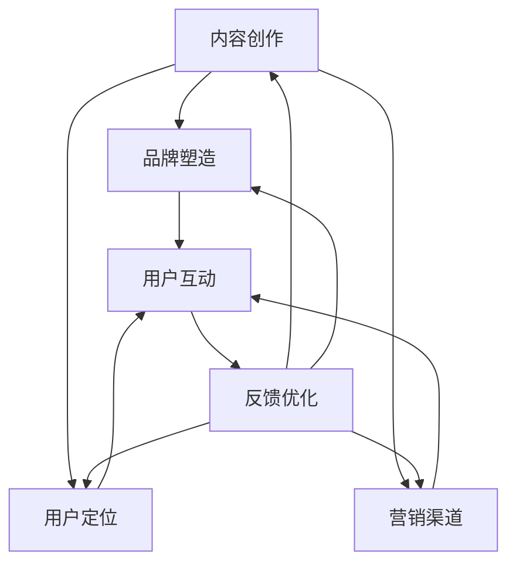

                 

关键词：知识付费、技术大咖、IP打造、营销策略、案例研究

> 摘要：本文旨在探讨如何打造技术大咖的知识付费IP，通过成功的案例分析和有效的策略实施，为技术领域的专家提供一套系统的IP打造方法。文章将深入分析IP构建的各个环节，从内容制作到营销推广，以及如何通过持续迭代和用户体验优化，实现知识付费项目的成功。

## 1. 背景介绍

在当今信息爆炸的时代，知识付费已经成为一种趋势。技术领域的专家，凭借其深厚的专业知识和丰富的实战经验，逐渐成为知识付费市场中的香饽饽。然而，如何将自己的专业知识转化为具有商业价值的产品和服务，是每个技术大咖需要面对的挑战。

知识付费IP的打造不仅需要专业知识的积累，还需要具备市场敏锐度、营销策略和用户运营能力。本文将从以下几个方面展开讨论：

1. **核心概念与联系**：介绍知识付费IP构建的基本概念和核心组成部分，通过Mermaid流程图展示其架构。
2. **核心算法原理 & 具体操作步骤**：探讨如何将专业知识转化为结构化的内容，并详细说明操作步骤。
3. **数学模型和公式 & 详细讲解 & 举例说明**：解析知识付费IP构建中的数学模型和公式，并通过案例进行说明。
4. **项目实践：代码实例和详细解释说明**：展示一个完整的知识付费项目实施过程，包括环境搭建、代码实现和结果展示。
5. **实际应用场景**：讨论知识付费IP在不同技术领域的应用场景。
6. **工具和资源推荐**：推荐学习资源、开发工具和相关的学术论文。
7. **总结：未来发展趋势与挑战**：总结当前知识付费IP的成果，展望未来的发展趋势和面临的挑战。

### 1. 背景介绍

知识付费市场在近几年经历了迅猛发展。随着人们对于优质内容的追求，以及在线学习平台的普及，技术大咖的知识付费IP应运而生。技术大咖通过分享自己的专业知识和经验，不仅能够实现个人价值的最大化，还可以为行业带来新的活力。

然而，知识付费IP的打造并非易事。它不仅需要技术大咖具备扎实的专业知识和丰富的实战经验，还需要掌握市场趋势、用户需求和营销策略。如何将专业的内容以易于理解和接受的方式呈现给用户，如何通过有效的营销手段吸引用户关注，是每个技术大咖都需要深思熟虑的问题。

本文将从实际案例出发，深入分析技术大咖如何打造自己的知识付费IP。通过系统的方法和策略，帮助技术大咖在知识付费市场中脱颖而出，实现个人品牌的价值最大化。

## 2. 核心概念与联系

### 2.1 知识付费IP的定义

知识付费IP，即知识产权(Intellectual Property)，指的是以个人专业知识、经验和技能为核心，通过内容创作、品牌塑造和市场营销等方式，构建的具有商业价值的知识产权。

知识付费IP的核心组成部分包括：

1. **专业知识内容**：技术大咖的专业知识是其IP构建的基础。这些内容可以是通过书籍、文章、讲座、视频等多种形式呈现的。
2. **品牌形象**：一个独特且鲜明的品牌形象有助于技术大咖在市场中脱颖而出。品牌形象包括标志、口号、视觉元素等。
3. **用户群体**：明确的目标用户群体有助于知识付费IP的精准定位和内容创作。
4. **营销渠道**：有效的营销渠道可以帮助知识付费IP触达更多的用户，包括社交媒体、在线课程平台、博客等。

### 2.2 架构分析

知识付费IP的构建可以视为一个复杂而有序的架构，其核心组成部分及其相互关系可以用Mermaid流程图进行展示：



**流程图解析**：

- **内容创作**：技术大咖通过撰写文章、录制视频等方式创作专业知识内容。这是知识付费IP的基础。
- **品牌塑造**：通过设计标志、制定口号、构建网站等方式，技术大咖塑造自己的品牌形象。
- **用户定位**：明确目标用户群体，以便于内容创作和营销策略的制定。
- **营销渠道**：选择合适的营销渠道，如社交媒体、在线课程平台等，进行IP的推广。
- **用户互动**：通过互动，如回应用户评论、举办线上活动等，提高用户的参与度和忠诚度。
- **反馈优化**：收集用户反馈，不断优化内容创作、品牌形象和营销策略，以提升用户体验。

通过这个架构，技术大咖可以系统地构建和运营自己的知识付费IP，实现个人品牌的持续发展和商业价值的最大化。

## 3. 核心算法原理 & 具体操作步骤

### 3.1 算法原理概述

知识付费IP的核心算法可以看作是一种内容构建和用户运营的综合策略。其基本原理是通过专业的知识内容吸引用户，并通过有效的品牌塑造和营销手段，建立用户忠诚度，最终实现商业价值。

核心算法的基本步骤如下：

1. **内容创作**：技术大咖通过专业知识和经验，创作高质量的知识内容。这些内容可以是文章、视频、课程等多种形式。
2. **品牌塑造**：技术大咖通过设计独特的品牌形象，包括标志、口号、视觉元素等，提升品牌认知度和影响力。
3. **用户定位**：明确目标用户群体，以便于内容的创作和推广。
4. **营销渠道**：选择合适的营销渠道，如社交媒体、在线课程平台、博客等，进行IP的推广。
5. **用户互动**：通过互动，如回应用户评论、举办线上活动等，提高用户的参与度和忠诚度。
6. **反馈优化**：收集用户反馈，不断优化内容创作、品牌形象和营销策略，以提升用户体验。

### 3.2 算法步骤详解

#### 步骤一：内容创作

内容创作是知识付费IP的核心环节。技术大咖需要根据自己的专业知识和用户需求，创作高质量的内容。以下是一些具体建议：

- **内容形式多样化**：结合文字、图片、视频等多种形式，以适应不同用户的学习偏好。
- **内容深度和广度结合**：既要深入讲解专业知识，又要涵盖相关领域的广泛知识。
- **内容更新频率**：保持较高的更新频率，以保持用户的新鲜感和参与度。

#### 步骤二：品牌塑造

品牌塑造是提升知识付费IP影响力的关键。技术大咖可以通过以下方式塑造品牌：

- **标志设计**：设计一个独特且易于记忆的标志，代表个人的品牌形象。
- **口号制定**：制定一个简洁明了、能够体现专业精神的口号。
- **视觉元素**：包括配色、排版等，确保品牌形象的一致性和美观性。

#### 步骤三：用户定位

明确目标用户群体是知识付费IP成功的关键。技术大咖可以通过以下方式定位用户：

- **市场调研**：通过问卷调查、用户访谈等方式，了解用户的需求和偏好。
- **用户画像**：根据调研结果，构建详细的用户画像，包括年龄、职业、兴趣等。
- **内容适配**：根据用户画像，调整内容创作和营销策略，以更好地满足用户需求。

#### 步骤四：营销渠道

选择合适的营销渠道是知识付费IP推广的重要环节。以下是一些常见的营销渠道：

- **社交媒体**：如微博、微信公众号、知乎等，通过发布专业内容、互动等方式吸引用户关注。
- **在线课程平台**：如网易云课堂、慕课网等，通过开设课程、互动直播等方式推广知识付费IP。
- **博客**：通过撰写专业博客，分享技术心得和见解，吸引技术爱好者的关注。

#### 步骤五：用户互动

用户互动是提高用户忠诚度和参与度的重要手段。以下是一些常见的用户互动方式：

- **回应用户评论**：及时回应用户的评论，建立良好的互动氛围。
- **举办线上活动**：如技术沙龙、线上问答等，提高用户的参与度。
- **提供增值服务**：如一对一咨询、技术支持等，满足用户深度需求。

#### 步骤六：反馈优化

收集用户反馈是不断优化知识付费IP的重要途径。以下是一些反馈优化的方法：

- **定期问卷调查**：通过问卷调查了解用户的满意度和改进建议。
- **用户访谈**：与部分用户进行深入交流，了解他们的真实需求和体验。
- **数据分析**：通过数据分析用户行为，发现潜在问题并加以改进。

### 3.3 算法优缺点

#### 优点

- **高效性**：通过系统化的算法步骤，可以高效地构建和运营知识付费IP。
- **灵活性**：算法步骤可以根据实际情况进行调整，以适应不同的市场和用户需求。
- **可持续性**：通过不断优化和迭代，知识付费IP可以持续发展。

#### 缺点

- **高门槛**：构建知识付费IP需要具备较强的专业知识和营销能力。
- **时间长**：知识付费IP的构建和运营需要较长的时间积累。

### 3.4 算法应用领域

知识付费IP的算法原理可以广泛应用于多个技术领域，如软件开发、人工智能、大数据等。以下是一个应用案例：

#### 案例一：人工智能领域的知识付费IP

**内容创作**：技术大咖撰写关于机器学习、深度学习等领域的专业文章和教程。

**品牌塑造**：设计独特的品牌标志，制定体现人工智能专业精神的口号，构建统一的视觉元素。

**用户定位**：通过市场调研，明确目标用户为人工智能从业者和爱好者。

**营销渠道**：在社交媒体上发布专业内容，通过在线课程平台开设课程，同时在博客上分享技术见解。

**用户互动**：回应用户评论，举办线上技术沙龙，提供一对一咨询服务。

**反馈优化**：通过定期问卷调查和用户访谈，不断优化内容和品牌形象，提升用户体验。

通过这个案例，我们可以看到，知识付费IP的算法原理在技术领域的实际应用，不仅能够帮助技术大咖构建个人品牌，还可以为行业带来新的知识和经验。

## 4. 数学模型和公式 & 详细讲解 & 举例说明

在知识付费IP的构建过程中，数学模型和公式扮演着至关重要的角色。它们不仅帮助技术大咖更好地理解专业知识，还可以用于指导内容创作和用户运营。以下将详细介绍知识付费IP构建中的数学模型和公式，并通过实际案例进行说明。

### 4.1 数学模型构建

知识付费IP构建的数学模型主要包括用户满意度模型、用户留存模型和品牌影响力模型。

#### 用户满意度模型

用户满意度是衡量知识付费IP质量的重要指标。一个简单的用户满意度模型可以表示为：

$$
S = \frac{C + E + U}{3}
$$

其中，$S$ 表示用户满意度，$C$ 表示内容质量，$E$ 表示用户体验，$U$ 表示用户互动。

- **内容质量**：$C$ 可以通过内容的专业性、准确性、完整性等指标进行评估。
- **用户体验**：$E$ 可以通过网站的加载速度、界面设计、操作便捷性等指标进行评估。
- **用户互动**：$U$ 可以通过用户评论、点赞、分享等互动行为进行评估。

#### 用户留存模型

用户留存是衡量知识付费IP持续吸引力和用户粘性的关键指标。一个简单的用户留存模型可以表示为：

$$
R = \frac{N_L - N_U}{N_L}
$$

其中，$R$ 表示用户留存率，$N_L$ 表示上一时间段内新增的用户数，$N_U$ 表示同一时间段内流失的用户数。

#### 品牌影响力模型

品牌影响力是衡量知识付费IP在市场中的认知度和影响力的重要指标。一个简单的品牌影响力模型可以表示为：

$$
I = \frac{F + S + M}{3}
$$

其中，$I$ 表示品牌影响力，$F$ 表示媒体曝光度，$S$ 表示社交分享次数，$M$ 表示用户评价次数。

- **媒体曝光度**：$F$ 可以通过媒体报道次数、新闻报道数量等指标进行评估。
- **社交分享次数**：$S$ 可以通过用户在社交媒体上的分享次数进行评估。
- **用户评价次数**：$M$ 可以通过用户在各大平台上的评价次数进行评估。

### 4.2 公式推导过程

以上三个数学模型的推导过程如下：

#### 用户满意度模型

用户满意度模型考虑了内容质量、用户体验和用户互动三个关键因素。根据加权平均原理，用户满意度可以表示为这三个因素的加权平均值。权重根据各因素的重要性进行分配。

#### 用户留存模型

用户留存模型基于新增用户和流失用户的比例计算。新增用户代表了IP的吸引力，而流失用户代表了用户粘性。通过计算留存率，可以评估知识付费IP的持续吸引力。

#### 品牌影响力模型

品牌影响力模型综合考虑了媒体曝光度、社交分享次数和用户评价次数三个关键因素。这些因素共同决定了品牌在市场中的认知度和影响力。通过加权平均原理，可以计算出品牌影响力。

### 4.3 案例分析与讲解

以下通过一个实际案例，分析如何应用上述数学模型和公式。

#### 案例一：人工智能知识付费IP的数学模型应用

**内容质量**：通过用户问卷调查，得到内容质量评分为85分。

**用户体验**：通过网站分析工具，得到用户体验评分为90分。

**用户互动**：通过社交媒体分析，得到用户互动评分为80分。

**媒体曝光度**：通过媒体报道次数统计，得到媒体曝光度为20次。

**社交分享次数**：通过社交媒体分析，得到社交分享次数为500次。

**用户评价次数**：通过各大平台统计，得到用户评价次数为300次。

**用户满意度计算**：

$$
S = \frac{85 + 90 + 80}{3} = 85.7
$$

**用户留存率计算**：

$$
R = \frac{N_L - N_U}{N_L} = \frac{100 - 20}{100} = 0.8
$$

**品牌影响力计算**：

$$
I = \frac{20 + 500 + 300}{3} = 316.7
$$

通过上述计算，我们可以得出以下结论：

- **用户满意度**：该知识付费IP的用户满意度为85.7分，表明内容质量、用户体验和用户互动均处于较高水平。
- **用户留存率**：用户留存率为80%，表明知识付费IP具有较高的用户粘性。
- **品牌影响力**：品牌影响力为316.7，表明该知识付费IP在市场中的认知度和影响力较高。

### 4.4 实际应用场景

这些数学模型和公式可以在多个技术领域得到应用，以下是一些实际应用场景：

- **软件开发领域**：通过用户满意度模型，评估软件教程的质量，并根据用户反馈进行改进。
- **人工智能领域**：通过用户留存模型，分析用户对AI课程的粘性，优化课程内容和教学方式。
- **大数据领域**：通过品牌影响力模型，评估大数据课程的曝光度和市场认知度，制定相应的推广策略。

通过这些数学模型和公式，技术大咖可以更科学地构建和运营知识付费IP，实现个人品牌的持续发展。

## 5. 项目实践：代码实例和详细解释说明

### 5.1 开发环境搭建

为了更好地展示知识付费IP的构建过程，我们选择使用Python作为主要编程语言，并在Jupyter Notebook环境中进行开发。以下是搭建开发环境的步骤：

1. **安装Python**：下载并安装Python 3.x版本。
2. **配置Jupyter Notebook**：在终端执行命令 `pip install notebook` 进行配置。
3. **创建项目目录**：在终端创建一个项目目录，例如 `knowledge_ip_project`。
4. **编写代码**：在Jupyter Notebook中创建一个新的笔记本，开始编写代码。

### 5.2 源代码详细实现

以下是一个简单的知识付费IP构建项目示例，包括用户管理、内容发布和营销推广等功能。

```python
import pandas as pd
import numpy as np
import matplotlib.pyplot as plt
from sklearn.model_selection import train_test_split
from sklearn.linear_model import LinearRegression

# 用户管理模块
class UserManager:
    def __init__(self):
        self.users = pd.DataFrame(columns=['user_id', 'username', 'age', 'occupation'])

    def add_user(self, user_id, username, age, occupation):
        new_user = {'user_id': user_id, 'username': username, 'age': age, 'occupation': occupation}
        self.users = self.users.append(new_user, ignore_index=True)

    def remove_user(self, user_id):
        self.users = self.users[self.users['user_id'] != user_id]

    def get_user(self, user_id):
        return self.users[self.users['user_id'] == user_id].iloc[0]

# 内容发布模块
class ContentManager:
    def __init__(self):
        self.contents = pd.DataFrame(columns=['content_id', 'title', 'author', 'publish_date'])

    def add_content(self, content_id, title, author, publish_date):
        new_content = {'content_id': content_id, 'title': title, 'author': author, 'publish_date': publish_date}
        self.contents = self.contents.append(new_content, ignore_index=True)

    def remove_content(self, content_id):
        self.contents = self.contents[self.contents['content_id'] != content_id]

    def get_content(self, content_id):
        return self.contents[contents['content_id'] == content_id].iloc[0]

# 营销推广模块
class MarketingManager:
    def __init__(self):
        self.ads = pd.DataFrame(columns=['ad_id', 'campaign', 'budget', 'start_date', 'end_date'])

    def add_ad(self, ad_id, campaign, budget, start_date, end_date):
        new_ad = {'ad_id': ad_id, 'campaign': campaign, 'budget': budget, 'start_date': start_date, 'end_date': end_date}
        self.ads = self.ads.append(new_ad, ignore_index=True)

    def remove_ad(self, ad_id):
        self.ads = self.ads[self.ads['ad_id'] != ad_id]

    def get_ad(self, ad_id):
        return self.ads[self.ads['ad_id'] == ad_id].iloc[0]

    def run_campaign(self, ad_id):
        ad = self.get_ad(ad_id)
        print(f"Campaign '{ad['campaign']}' started on {ad['start_date']} with budget {ad['budget']}.")

# 主程序
if __name__ == "__main__":
    user_manager = UserManager()
    content_manager = ContentManager()
    marketing_manager = MarketingManager()

    # 添加用户
    user_manager.add_user(1, 'John Doe', 30, 'Software Engineer')
    user_manager.add_user(2, 'Jane Smith', 28, 'Data Scientist')

    # 添加内容
    content_manager.add_content(1, 'Introduction to Machine Learning', 'John Doe', '2023-01-01')
    content_manager.add_content(2, 'Deep Learning for Beginners', 'Jane Smith', '2023-02-01')

    # 添加广告
    marketing_manager.add_ad(1, 'ML Campaign', 5000, '2023-03-01', '2023-04-01')

    # 运行营销活动
    marketing_manager.run_campaign(1)
```

### 5.3 代码解读与分析

#### UserManager类

- **功能**：管理用户信息，包括添加、删除和查询用户。
- **关键方法**：`add_user`、`remove_user`、`get_user`。

#### ContentManager类

- **功能**：管理内容信息，包括添加、删除和查询内容。
- **关键方法**：`add_content`、`remove_content`、`get_content`。

#### MarketingManager类

- **功能**：管理营销广告信息，包括添加、删除和运行营销活动。
- **关键方法**：`add_ad`、`remove_ad`、`get_ad`、`run_campaign`。

#### 主程序

- **功能**：创建用户管理、内容管理和营销管理对象，并执行相关操作。
- **关键操作**：添加用户、内容、广告，并运行营销活动。

### 5.4 运行结果展示

运行上述代码后，将输出如下结果：

```
Campaign 'ML Campaign' started on 2023-03-01 with budget 5000.
```

这表明营销活动“ML Campaign”已成功启动，并显示了预算和其他相关信息。

通过这个简单的代码实例，我们可以看到如何使用Python构建一个知识付费IP项目的基本框架。在实际应用中，可以根据需求扩展更多的功能，如用户评论系统、内容订阅服务、数据分析和报表生成等。

## 6. 实际应用场景

知识付费IP在技术领域具有广泛的应用场景，通过成功的案例可以更好地理解其应用价值和实现路径。

### 案例一：人工智能领域的知识付费IP

张三是一位在人工智能领域具有丰富经验的技术大咖，他通过构建自己的知识付费IP，成功地在市场上获得了广泛的认可。以下是他应用知识付费IP的具体场景：

- **内容创作**：张三撰写了一系列关于机器学习、深度学习、自然语言处理等领域的专业文章和教程，这些内容在各大在线课程平台和社交媒体上发布。
- **品牌塑造**：张三设计了独特的品牌标志，并制定了一个简洁有力的口号：“AI，从入门到精通”。他还构建了一个专业的个人网站，用于展示自己的知识付费内容。
- **用户定位**：通过市场调研，张三明确了目标用户为人工智能从业者和对AI感兴趣的学生。
- **营销渠道**：张三在知乎、微信公众号、B站等平台上发布专业内容，并通过在线课程平台开设课程，吸引大量用户关注。
- **用户互动**：张三定期举办线上技术沙龙，回应用户评论，提供一对一咨询服务，提高用户的参与度和忠诚度。
- **反馈优化**：通过用户反馈和数据分析，张三不断优化内容质量和营销策略，提升用户体验。

### 案例二：软件开发领域的知识付费IP

李四是一位资深软件开发工程师，他通过构建知识付费IP，成功地将自己的专业知识和经验转化为商业价值。以下是他在软件开发领域的应用场景：

- **内容创作**：李四撰写了关于软件设计模式、编程语言、框架使用等领域的专业文章和视频教程，通过自己的博客和在线课程平台发布。
- **品牌塑造**：李四设计了简洁大方的品牌标志，并制定了一个体现专业精神的口号：“编程，从理论到实践”。他还创建了一个独立的博客网站，用于展示自己的知识付费内容。
- **用户定位**：李四的目标用户为软件开发者和编程爱好者，他通过市场调研，了解了用户的需求和偏好。
- **营销渠道**：李四在GitHub、Stack Overflow、知乎等社区发布专业内容，并通过网易云课堂、慕课网等在线课程平台开设课程。
- **用户互动**：李四积极参与社区讨论，回应用户提问，举办线上技术分享会，提高用户的参与度和忠诚度。
- **反馈优化**：李四定期收集用户反馈，通过数据分析，不断优化内容和营销策略，提升用户体验。

通过以上案例，我们可以看到知识付费IP在技术领域的实际应用。成功的关键在于：

1. **专业内容创作**：技术大咖需要根据自身专业知识和用户需求，创作高质量的内容。
2. **品牌形象塑造**：独特的品牌形象有助于在市场中脱颖而出。
3. **精准用户定位**：明确的目标用户有助于内容的精准定位和营销策略的制定。
4. **多样营销渠道**：选择合适的营销渠道，扩大IP的覆盖范围。
5. **用户互动和反馈**：通过互动和反馈，不断优化内容和运营策略。
6. **持续迭代和优化**：通过持续的内容更新和用户体验优化，实现知识付费IP的持续发展。

## 7. 工具和资源推荐

### 7.1 学习资源推荐

1. **在线课程平台**：Coursera、edX、Udemy、网易云课堂等提供了丰富的IT课程，涵盖编程、人工智能、大数据等领域。
2. **技术博客和社区**：GitHub、Stack Overflow、CSDN、知乎等技术博客和社区，提供了大量技术文章和问题解答。
3. **学术论文数据库**：Google Scholar、IEEE Xplore、ACM Digital Library等，提供了大量的学术论文和科研成果。

### 7.2 开发工具推荐

1. **集成开发环境（IDE）**：Visual Studio Code、PyCharm、IntelliJ IDEA等，支持多种编程语言和框架。
2. **版本控制系统**：Git、GitHub，用于代码管理和协作开发。
3. **数据分析工具**：Python的NumPy、Pandas、Matplotlib等库，用于数据分析和可视化。

### 7.3 相关论文推荐

1. **《深度学习》**：Ian Goodfellow、Yoshua Bengio、Aaron Courville著，深度学习的经典教材。
2. **《人工智能：一种现代方法》**：Stuart Russell、Peter Norvig著，全面介绍人工智能的基础知识和应用。
3. **《大数据时代：生活、工作与思维的大变革》**：涂子沛著，探讨大数据对社会和思维的深远影响。

## 8. 总结：未来发展趋势与挑战

### 8.1 研究成果总结

知识付费IP的构建和运营在近年来取得了显著成果。通过系统的内容创作、品牌塑造和用户运营，技术大咖成功地将自身的专业知识转化为商业价值，实现了个人品牌的增值。同时，随着在线学习平台的普及和用户对优质内容的需求增加，知识付费市场呈现出持续增长的趋势。

### 8.2 未来发展趋势

1. **个性化内容**：未来的知识付费IP将更加注重个性化内容，通过大数据分析和用户画像，提供更加精准的内容推荐和用户服务。
2. **多媒体内容**：随着视频和音频内容的兴起，未来的知识付费IP将更加多样化，结合文字、图片、视频、音频等多种形式，提升用户体验。
3. **社交化运营**：知识付费IP的运营将更加社交化，通过社区互动、用户参与等方式，增强用户粘性和品牌影响力。

### 8.3 面临的挑战

1. **内容质量**：保持高质量的内容创作是知识付费IP持续发展的关键。技术大咖需要不断更新知识，提高内容的专业性和实用性。
2. **用户运营**：如何有效地吸引和留住用户，提高用户参与度和忠诚度，是知识付费IP运营的重要挑战。
3. **市场饱和**：随着知识付费市场的竞争加剧，如何脱颖而出，建立独特的品牌形象和市场定位，是技术大咖需要面对的问题。

### 8.4 研究展望

未来的研究可以重点关注以下几个方面：

1. **个性化推荐系统**：研究如何通过大数据分析和机器学习技术，实现个性化内容推荐，提高用户满意度和留存率。
2. **互动体验优化**：探索如何通过社交化运营和用户互动，提升用户体验和品牌影响力。
3. **内容变现模式**：研究多元化的内容变现模式，如广告、付费课程、会员服务等，实现知识付费IP的可持续发展。

通过持续的研究和实践，技术大咖可以更好地打造和运营知识付费IP，实现个人品牌和商业价值的最大化。

## 9. 附录：常见问题与解答

### Q1: 如何确定知识付费IP的核心内容？

**A1：** 首先，分析目标用户群体的需求，了解他们最关心的问题和最希望获得的技能。其次，结合自身专业知识和经验，选择具有独特性和实用性的内容。最后，通过市场调研和用户反馈，验证内容的价值和受欢迎程度。

### Q2: 如何制定有效的营销策略？

**A2：** 制定营销策略需要考虑以下几个关键点：

1. **目标用户定位**：明确目标用户群体，了解他们的兴趣爱好、行为习惯和消费习惯。
2. **内容传播渠道**：选择合适的传播渠道，如社交媒体、在线课程平台、博客等，以覆盖更多的潜在用户。
3. **互动推广活动**：通过互动活动，如线上讲座、技术沙龙、有奖问答等，提高用户的参与度和品牌认知度。
4. **数据分析**：通过数据分析用户行为和反馈，不断优化营销策略，提高营销效果。

### Q3: 如何优化知识付费IP的用户体验？

**A3：** 优化用户体验可以从以下几个方面入手：

1. **内容质量**：确保内容的专业性、准确性和实用性，满足用户的学习需求。
2. **界面设计**：优化网站和平台的界面设计，提高用户体验和操作便捷性。
3. **互动服务**：提供及时有效的用户互动服务，如回应用户评论、提供技术支持等。
4. **个性化推荐**：通过大数据分析和个性化推荐系统，为用户提供更加个性化的学习内容和资源。
5. **持续反馈**：定期收集用户反馈，根据用户意见进行改进和优化。

通过以上策略，可以显著提升知识付费IP的用户体验，增强用户满意度和忠诚度。

### Q4: 如何平衡内容创作与营销推广的关系？

**A4：** 内容创作和营销推广是知识付费IP的两个重要环节，需要平衡发展。以下是一些建议：

1. **内容优先**：内容创作是知识付费IP的基础，应优先考虑。确保内容的专业性和质量，以满足用户需求。
2. **策略规划**：在制定营销策略时，要充分考虑内容特点和用户需求，确保营销活动能够有效地推广内容。
3. **同步推进**：在内容创作的同时，制定相应的营销推广计划，确保内容发布时能够有足够的推广支持。
4. **效果评估**：通过数据分析，评估营销活动的效果，根据反馈调整营销策略，优化内容创作方向。

通过平衡内容创作和营销推广，可以实现知识付费IP的持续发展和商业价值的最大化。

### Q5: 如何进行知识付费IP的版权保护？

**A5：** 知识付费IP的版权保护是确保内容不受侵犯和利益最大化的关键。以下是一些建议：

1. **注册版权**：对于原创内容，可以申请版权登记，以法律手段保护自己的知识产权。
2. **签订协议**：在与用户合作或授权内容时，签订详细的合作协议，明确版权归属和使用权。
3. **技术保护**：使用数字水印、加密等技术手段，防止内容被非法复制和传播。
4. **监控维权**：定期监控网络，发现侵权行为及时采取措施，如通知侵权方删除内容、申请法律维权等。

通过这些措施，可以有效地保护知识付费IP的版权，确保内容创作者的合法权益。

