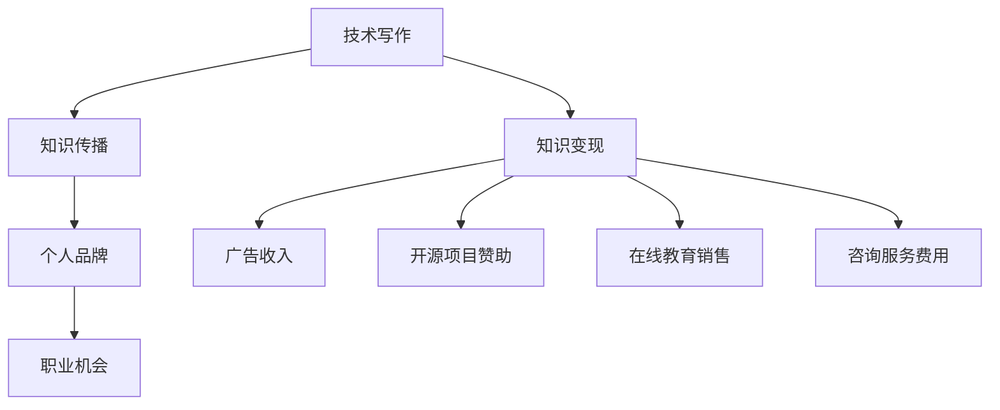

                 

关键词：技术写作、额外收入、博客文章、开源项目、知识变现、在线教育

> 摘要：技术写作已成为IT专业人士实现额外收入的重要途径。本文将探讨技术写作的多个方面，包括如何创建引人入胜的博客文章、构建开源项目、参与在线教育平台，以及通过这些方式实现知识变现的策略和技巧。

## 1. 背景介绍

在数字化时代，信息传播的速度和广度前所未有。技术写作作为一种信息传递和知识分享的方式，正日益受到重视。IT专业人士通过撰写技术文章、参与开源项目、开设在线课程，不仅能传播知识，还能实现个人品牌的建立和额外的收入来源。本文将深入探讨技术写作如何成为IT专业人士的额外收入来源，并分享一些实用的技巧和策略。

### 1.1 技术写作的重要性

技术写作对于IT专业人士而言，不仅仅是一种职业需求，更是一种展示专业能力和影响力的途径。通过写作，专业人士可以：

- **传播知识**：分享专业知识，帮助他人解决问题。
- **建立个人品牌**：展示专业能力，赢得更多的职业机会。
- **提升影响力**：通过优秀的写作，获得更多关注，成为行业内的意见领袖。

### 1.2 知识变现的概念

知识变现是指将个人的知识、技能或经验转化为货币或资源的活动。在技术领域，知识变现可以通过以下方式实现：

- **撰写技术博客**：通过撰写高质量的博客文章，吸引读者并实现广告收入。
- **开源项目**：通过开源项目吸引赞助和支持。
- **在线教育**：开设在线课程，通过课程销售实现收入。
- **咨询服务**：提供专业的咨询服务，为企业或个人解决技术问题。

## 2. 核心概念与联系

为了更好地理解技术写作如何成为额外收入的来源，我们需要从核心概念和联系入手。以下是一个简化的Mermaid流程图，展示了技术写作、知识变现和额外收入之间的关系。



### 2.1 技术写作

技术写作是知识变现的基础。通过写作，IT专业人士可以将自己的专业知识分享给他人，从而建立个人品牌。具体来说，技术写作包括以下几个方面：

- **博客文章**：撰写关于技术领域的博客文章，分享经验和见解。
- **技术文档**：为开源项目或企业编写详细的技术文档。
- **技术书籍**：撰写技术书籍，分享深入的技术知识和实践经验。

### 2.2 知识变现

知识变现是将技术写作转化为实际收入的过程。通过以下几种方式，IT专业人士可以实现知识变现：

- **广告收入**：在博客文章中嵌入广告，通过点击或展示次数获得收入。
- **开源项目赞助**：通过开源项目吸引赞助和支持，获得资金回报。
- **在线教育销售**：开设在线课程，通过课程销售实现收入。
- **咨询服务**：提供专业的咨询服务，为企业或个人解决技术问题。

### 2.3 额外收入

技术写作和知识变现最终目标是实现额外的收入。通过持续的技术写作和知识变现，IT专业人士可以获得以下收益：

- **持续收入**：通过广告收入、课程销售和咨询服务，实现持续的收入来源。
- **职业机会**：通过个人品牌的建立，获得更多的职业机会。
- **影响力**：成为行业内的意见领袖，提升个人影响力和知名度。

## 3. 核心算法原理 & 具体操作步骤

### 3.1 算法原理概述

技术写作的核心算法可以概括为以下步骤：

1. **选题与规划**：选择合适的技术主题，进行详细规划和准备。
2. **内容创作**：撰写高质量的技术文章，确保内容的实用性和专业性。
3. **发布与推广**：将文章发布到适当的平台，并采取有效的推广策略。
4. **反馈与改进**：根据读者反馈，不断改进和优化文章内容。

### 3.2 算法步骤详解

#### 3.2.1 选题与规划

选题是技术写作的第一步，直接关系到文章的吸引力和影响力。以下是一些选题和规划的建议：

- **关注热点**：关注当前技术领域的热点话题，选择具有广泛受众的主题。
- **深度分析**：选择具有深度和广度的主题，提供独特的见解和分析。
- **受众需求**：了解目标受众的需求，选择他们感兴趣的主题。

#### 3.2.2 内容创作

内容创作是技术写作的核心，以下是一些建议：

- **结构清晰**：确保文章结构清晰，逻辑连贯，便于读者阅读和理解。
- **实用性强**：提供实用的技术方法和技巧，帮助读者解决实际问题。
- **语言简洁**：使用简洁明了的语言，避免过多的专业术语和复杂的句子。

#### 3.2.3 发布与推广

发布与推广是技术写作的重要环节，以下是一些建议：

- **选择平台**：选择适合的发布平台，如博客、技术社区、专业媒体等。
- **社交媒体**：利用社交媒体平台，如微博、微信、LinkedIn等，进行文章推广。
- **合作伙伴**：与相关领域的专家和媒体建立合作关系，扩大文章的影响力。

#### 3.2.4 反馈与改进

反馈与改进是持续提升写作质量的关键，以下是一些建议：

- **读者互动**：积极与读者互动，回答他们的疑问，收集反馈。
- **数据分析**：通过数据分析，了解文章的受欢迎程度和读者偏好。
- **内容更新**：根据读者反馈和数据分析，不断更新和改进文章内容。

### 3.3 算法优缺点

#### 优点：

- **灵活性强**：技术写作可以根据需求灵活调整，适用于不同场景和目的。
- **成本低廉**：相对于其他知识传播方式，技术写作的成本较低，适合个人和小团队操作。
- **传播速度快**：互联网使得技术写作的传播速度极快，可以迅速获得广泛关注。

#### 缺点：

- **质量要求高**：技术写作需要具备较高的专业知识和写作技巧，否则难以吸引读者。
- **竞争激烈**：随着越来越多的人加入技术写作领域，竞争日益激烈，需要不断提升自身能力。

### 3.4 算法应用领域

技术写作可以应用于多个领域，以下是一些典型应用：

- **技术博客**：个人或团队的技术博客，分享技术见解和实践经验。
- **在线教育**：课程教材和教学资源，帮助学生理解和掌握技术知识。
- **技术社区**：技术论坛和讨论区，为开发者提供交流和学习平台。
- **企业内部培训**：企业内部的技术培训资料，提升员工的专业能力。

## 4. 数学模型和公式 & 详细讲解 & 举例说明

技术写作中的数学模型和公式是表达复杂概念和技术细节的重要工具。以下是一个简单的数学模型示例，用于描述技术写作的吸引力（假设读者数量与文章质量成正比，与广告收入成正比）。

### 4.1 数学模型构建

假设文章的吸引力 \( A \) 与文章质量 \( Q \)、读者数量 \( N \) 和广告收入 \( R \) 之间存在以下关系：

\[ A = f(Q, N, R) \]

其中，\( f \) 是一个复合函数，可以通过以下公式表示：

\[ f(Q, N, R) = Q \times \ln(N) + R \]

### 4.2 公式推导过程

公式的推导基于以下假设：

- 文章质量 \( Q \) 越高，吸引力 \( A \) 越大。
- 读者数量 \( N \) 越多，吸引力 \( A \) 越大。
- 广告收入 \( R \) 越高，吸引力 \( A \) 越大。

我们可以使用对数函数来表示读者数量和广告收入对吸引力的非线性影响。因此，公式可以表示为：

\[ A = Q \times \ln(N) + R \]

### 4.3 案例分析与讲解

假设一篇技术文章的质量 \( Q \) 为 90，读者数量 \( N \) 为 1000，广告收入 \( R \) 为 5000。我们可以使用上述公式计算文章的吸引力 \( A \)：

\[ A = 90 \times \ln(1000) + 5000 \]

计算结果为：

\[ A = 90 \times 6.908 + 5000 \]
\[ A = 621.72 + 5000 \]
\[ A = 5621.72 \]

这意味着该篇文章的吸引力为 5621.72。根据吸引力，我们可以估算文章的广告收入潜力。假设每千次展示的广告收入为 5 元，则文章的广告收入潜力为：

\[ R = A \times 5 = 5621.72 \times 5 = 2810.86 \]

### 4.4 模型应用示例

#### 示例 1：提高文章质量

如果我们将文章质量提高 10%，即 \( Q \) 从 90 提高到 99，则新的吸引力 \( A' \) 为：

\[ A' = 99 \times \ln(1000) + 5000 \]
\[ A' = 99 \times 6.908 + 5000 \]
\[ A' = 682.92 + 5000 \]
\[ A' = 5682.92 \]

新的吸引力 \( A' \) 为 5682.92，比原来的吸引力增加了约 57.7%。

#### 示例 2：增加读者数量

如果我们将读者数量增加 10%，即 \( N \) 从 1000 增加到 1100，则新的吸引力 \( A'' \) 为：

\[ A'' = 90 \times \ln(1100) + 5000 \]
\[ A'' = 90 \times 6.952 + 5000 \]
\[ A'' = 626.48 + 5000 \]
\[ A'' = 5626.48 \]

新的吸引力 \( A'' \) 为 5626.48，比原来的吸引力增加了约 0.3%。

#### 示例 3：增加广告收入

如果我们将广告收入增加 10%，即 \( R \) 从 5000 增加到 5500，则新的吸引力 \( A''' \) 为：

\[ A''' = 90 \times \ln(1000) + 5500 \]
\[ A''' = 90 \times 6.908 + 5500 \]
\[ A''' = 621.72 + 5500 \]
\[ A''' = 5621.72 \]

新的吸引力 \( A''' \) 与原来的吸引力 \( A \) 相同，这表明广告收入对吸引力的直接影响较小。

### 4.5 模型的局限性和改进方向

虽然上述模型可以提供一个简单的吸引力评估方法，但它仍然存在一些局限性：

- **模型参数的不确定性**：公式中的参数（如质量、读者数量、广告收入）难以准确测量和量化。
- **非线性关系的简化**：模型假设了质量、读者数量和广告收入与吸引力之间的线性关系，这可能不完全准确。
- **其他因素的忽略**：模型没有考虑到其他可能影响吸引力的因素，如文章的可读性、作者的影响力等。

为了改进这个模型，可以考虑以下方向：

- **引入更多变量**：将其他影响吸引力的因素纳入模型，如文章的可读性、作者的知名度等。
- **使用机器学习算法**：利用大数据和机器学习算法，建立更复杂和精确的预测模型。
- **实证研究**：进行实证研究，收集真实数据，验证和改进模型的准确性。

## 5. 项目实践：代码实例和详细解释说明

### 5.1 开发环境搭建

为了展示技术写作中的代码实例，我们将使用Python语言，并在本地计算机上搭建一个简单的博客系统。以下是搭建开发环境所需的步骤：

1. **安装Python**：从Python官方网站下载并安装Python 3.x版本。
2. **安装集成开发环境（IDE）**：如PyCharm或Visual Studio Code，以便编写和调试代码。
3. **安装必要的库**：使用pip安装以下Python库：Flask（用于创建Web应用）、SQLite（用于数据库管理）和Markdown（用于Markdown文本解析）。

```shell
pip install Flask
pip install Flask-SQLAlchemy
pip install markdown
```

### 5.2 源代码详细实现

以下是实现一个简单博客系统的源代码。该系统包含文章管理、发表和查看功能。

```python
# app.py

from flask import Flask, render_template, request, redirect, url_for
from flask_sqlalchemy import SQLAlchemy

app = Flask(__name__)
app.config['SQLALCHEMY_DATABASE_URI'] = 'sqlite:///blog.db'
db = SQLAlchemy(app)

class Article(db.Model):
    id = db.Column(db.Integer, primary_key=True)
    title = db.Column(db.String(100))
    content = db.Column(db.Text)

@app.route('/')
def index():
    articles = Article.query.all()
    return render_template('index.html', articles=articles)

@app.route('/create', methods=['GET', 'POST'])
def create():
    if request.method == 'POST':
        title = request.form['title']
        content = request.form['content']
        new_article = Article(title=title, content=content)
        db.session.add(new_article)
        db.session.commit()
        return redirect(url_for('index'))
    return render_template('create.html')

@app.route('/article/<int:article_id>')
def article(article_id):
    article = Article.query.get_or_404(article_id)
    return render_template('article.html', article=article)

if __name__ == '__main__':
    db.create_all()
    app.run(debug=True)
```

### 5.3 代码解读与分析

#### 数据库模型

在上述代码中，我们首先定义了一个名为 `Article` 的数据库模型，它包含 `id`、`title` 和 `content` 三个字段，分别用于存储文章的ID、标题和内容。

```python
class Article(db.Model):
    id = db.Column(db.Integer, primary_key=True)
    title = db.Column(db.String(100))
    content = db.Column(db.Text)
```

#### 路由和视图函数

- **首页 (`/`)**：列出所有文章。
- **创建文章页面 (`/create`)**：处理新文章的创建。
- **文章详情页面 (`/article/<int:article_id>`)**：显示特定文章的详情。

```python
@app.route('/')
def index():
    articles = Article.query.all()
    return render_template('index.html', articles=articles)

@app.route('/create', methods=['GET', 'POST'])
def create():
    if request.method == 'POST':
        title = request.form['title']
        content = request.form['content']
        new_article = Article(title=title, content=content)
        db.session.add(new_article)
        db.session.commit()
        return redirect(url_for('index'))
    return render_template('create.html')

@app.route('/article/<int:article_id>')
def article(article_id):
    article = Article.query.get_or_404(article_id)
    return render_template('article.html', article=article)
```

#### 模板

模板文件 `index.html`、`create.html` 和 `article.html` 分别用于展示首页、创建文章页面和文章详情页面。以下是 `index.html` 的示例代码：

```html
<!-- index.html -->
<!DOCTYPE html>
<html lang="en">
<head>
    <meta charset="UTF-8">
    <title>技术博客</title>
</head>
<body>
    <h1>技术博客</h1>
    <ul>
        
            <li>
                <a href="{{ url_for('article', article_id=article.id) }}">{{ article.title }}</a>
            </li>
        
    </ul>
    <a href="{{ url_for('create') }}">创建文章</a>
</body>
</html>
```

### 5.4 运行结果展示

运行上述代码后，我们可以在浏览器中访问本地服务器，查看博客系统的运行效果：

- **首页**：显示所有已发布的文章列表。
- **创建文章页面**：允许用户输入文章标题和内容，创建新的文章。
- **文章详情页面**：显示特定文章的标题和内容。


## 6. 实际应用场景

技术写作在实际应用场景中具有广泛的用途，以下是几个典型的应用场景：

### 6.1 技术文档编写

技术文档是软件开发中不可或缺的一部分。通过撰写详细的技术文档，开发者可以清晰地传达项目的技术细节、架构设计和实现方法，从而帮助团队成员更好地理解项目，提高协作效率。

### 6.2 博客文章创作

博客文章是知识传播和品牌建设的重要工具。通过撰写高质量的博客文章，开发者可以分享技术见解、解决实际问题，吸引更多的读者和粉丝，建立个人品牌。

### 6.3 在线教育平台

在线教育平台为开发者提供了一个展示专业知识和技能的平台。通过开设在线课程，开发者可以传授知识、培养人才，同时实现知识变现。

### 6.4 咨询服务

提供咨询服务是开发者实现额外收入的重要途径。通过利用专业知识和经验，开发者可以为企业或个人解决技术问题，提供专业的咨询服务。

### 6.5 开源项目参与

参与开源项目不仅可以提升开发技能，还可以增加个人曝光度。通过贡献代码和文档，开发者可以吸引更多的关注，获得更多的合作机会。

## 7. 未来应用展望

随着技术的不断进步和互联网的普及，技术写作的应用前景将更加广阔。以下是对未来技术写作应用的一些展望：

### 7.1 人工智能写作辅助

人工智能技术将在未来为技术写作提供强大的辅助。通过使用自然语言处理和机器学习技术，开发者可以自动生成文档、分析代码，提高写作效率和质量。

### 7.2 多媒体写作

未来的技术写作将不仅仅局限于文字，还将结合图片、视频、音频等多媒体元素，提供更加丰富和生动的学习体验。

### 7.3 智能推荐系统

通过大数据和机器学习技术，智能推荐系统可以更好地理解读者的需求和兴趣，为开发者提供个性化的内容推荐，提高内容的传播效果。

### 7.4 知识图谱构建

构建知识图谱可以帮助开发者更清晰地理解技术领域的知识结构和关系，从而为技术写作提供更加深入和系统的内容。

## 8. 工具和资源推荐

### 8.1 学习资源推荐

- **《深入理解计算机系统》（CSAPP）**：一本经典的计算机科学教材，涵盖操作系统、计算机体系结构等核心内容。
- **《算法导论》（Introduction to Algorithms）**：介绍算法设计和分析的经典教材，适合所有层次的学习者。
- **《Effective Python》**：介绍Python编程的最佳实践，适合希望提高Python编程能力的开发者。

### 8.2 开发工具推荐

- **Visual Studio Code**：一款轻量级的跨平台IDE，适合编写Python代码。
- **Jupyter Notebook**：一款交互式的Web应用，适合编写和分享Python代码和Markdown文档。
- **Git**：版本控制系统，用于管理代码版本和协作开发。

### 8.3 相关论文推荐

- **《深度强化学习》（Deep Reinforcement Learning）**：介绍深度强化学习算法的理论和应用。
- **《强化学习在计算机系统中的应用》（Applications of Reinforcement Learning in Computer Systems）**：探讨强化学习在计算机系统优化中的应用。
- **《面向服务架构：基于Web的企业应用开发》（Service-Oriented Architecture: Service-Oriented Development with XML, SOAP, and WSDL）**：介绍面向服务架构（SOA）的设计原则和实现方法。

## 9. 总结：未来发展趋势与挑战

技术写作作为一种知识传播和知识变现的方式，在未来将继续发挥重要作用。随着人工智能、大数据和互联网技术的不断发展，技术写作将面临新的机遇和挑战。

### 9.1 发展趋势

- **内容多样化**：技术写作将不再局限于文字，将结合图片、视频、音频等多媒体元素，提供更加丰富的学习体验。
- **智能化写作辅助**：人工智能技术将为技术写作提供强大的辅助，提高写作效率和质量。
- **个性化推荐**：智能推荐系统将更好地理解读者的需求和兴趣，提高内容的传播效果。
- **知识图谱构建**：知识图谱将帮助开发者更清晰地理解技术领域的知识结构和关系。

### 9.2 面临的挑战

- **内容质量**：随着技术写作的普及，内容质量将面临更大的挑战。开发者需要不断提升自身专业能力和写作技巧，提供高质量的内容。
- **知识产权**：技术写作中的知识产权保护将成为一个重要问题。开发者需要遵守相关法律法规，保护自己的知识产权。
- **竞争加剧**：随着越来越多的人加入技术写作领域，竞争将日益激烈。开发者需要不断提升自身竞争力，才能在市场中脱颖而出。

### 9.3 研究展望

未来的技术写作研究可以关注以下几个方面：

- **写作工具开发**：开发更加智能、高效的写作工具，帮助开发者提高写作效率和质量。
- **知识图谱构建**：构建技术领域的知识图谱，提供更加深入和系统的内容。
- **人工智能写作辅助**：研究如何更好地利用人工智能技术辅助技术写作，提高内容的创新性和实用性。
- **知识产权保护**：探索有效的知识产权保护策略，保护开发者的合法权益。

## 附录：常见问题与解答

### 9.4.1 问题 1：如何选择技术写作的主题？

**解答**：选择技术写作的主题时，可以考虑以下几个方面：

- **受众需求**：选择受众感兴趣和需要解决的主题。
- **个人兴趣**：选择自己熟悉和感兴趣的主题。
- **热点话题**：关注当前技术领域的热点话题，选择具有时效性的主题。

### 9.4.2 问题 2：如何提高技术写作的质量？

**解答**：提高技术写作的质量可以从以下几个方面入手：

- **结构清晰**：确保文章结构清晰，逻辑连贯。
- **内容实用**：提供实用的技术方法和技巧，解决实际问题。
- **语言简洁**：使用简洁明了的语言，避免过多的专业术语和复杂的句子。
- **反馈与改进**：根据读者反馈，不断改进和优化文章内容。

### 9.4.3 问题 3：如何通过技术写作实现知识变现？

**解答**：通过以下几种方式可以实现知识变现：

- **撰写技术博客**：通过撰写高质量的博客文章，吸引读者并实现广告收入。
- **开源项目**：通过开源项目吸引赞助和支持。
- **在线教育**：开设在线课程，通过课程销售实现收入。
- **咨询服务**：提供专业的咨询服务，为企业或个人解决技术问题。

### 9.4.4 问题 4：如何保护技术写作的知识产权？

**解答**：保护技术写作的知识产权可以从以下几个方面入手：

- **版权登记**：将作品进行版权登记，确保作品的合法权益。
- **签订合同**：与使用作品的企业或个人签订合同，明确权利和义务。
- **维权意识**：提高维权意识，及时发现并处理侵权行为。

### 9.4.5 问题 5：技术写作如何与开源项目相结合？

**解答**：技术写作与开源项目相结合的方式有以下几种：

- **文档编写**：为开源项目编写详细的文档，帮助开发者更好地理解和使用项目。
- **博客文章**：撰写关于开源项目的博客文章，分享项目的技术细节和经验。
- **技术交流**：参与开源项目的技术交流，贡献代码和想法。
- **课程开发**：以开源项目为基础，开发相关的在线课程，实现知识变现。

### 9.4.6 问题 6：如何管理技术写作的时间与精力？

**解答**：管理技术写作的时间与精力可以从以下几个方面入手：

- **时间规划**：制定合理的时间规划，确保有足够的时间进行技术写作。
- **优先级排序**：根据重要性和紧急性，对写作任务进行优先级排序。
- **集中精力**：在写作过程中，尽量减少干扰，集中精力完成写作。
- **反馈与调整**：根据读者反馈，不断调整和优化写作内容和策略。

### 9.4.7 问题 7：技术写作的未来发展趋势如何？

**解答**：技术写作的未来发展趋势包括：

- **内容多样化**：技术写作将结合图片、视频、音频等多媒体元素，提供更加丰富的学习体验。
- **智能化写作辅助**：人工智能技术将为技术写作提供强大的辅助，提高写作效率和质量。
- **知识图谱构建**：构建技术领域的知识图谱，提供更加深入和系统的内容。
- **个性化推荐**：智能推荐系统将更好地理解读者的需求和兴趣，提高内容的传播效果。

