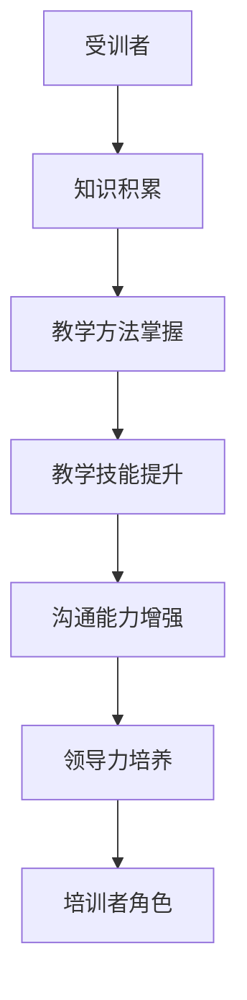

                 

关键词：技术培训、知识传授、教育、导师角色、学习方法、技能提升、教育技术、教育心理学。

> 摘要：本文探讨了技术培训的演变过程，从受训者的角度出发，深入分析了如何从一名技术受训者转变为培训者。通过结合教育心理学和现代教育技术，本文提出了一个系统化的培训框架，旨在帮助个人掌握传授技能的技巧，提升自身专业影响力。

## 1. 背景介绍

在快速发展的信息技术时代，技术人才的培养已经成为各行各业关注的焦点。无论是初学者，还是经验丰富的专业人士，都面临着不断学习新技能的挑战。然而，许多人可能不知道如何将所学知识传授给他人，从而成为一名有效的培训者。本篇文章旨在为技术从业者和教育工作者提供一些实用的指导，帮助他们实现这一转变。

### 1.1 技术培训的需求

技术培训的需求不断增长，这不仅体现在企业对员工技能的要求上，也体现在个人职业发展上。随着新技术的不断涌现，如人工智能、大数据、区块链等，技术从业者需要不断更新自己的知识库，以保持竞争力。同时，教育机构和企业也意识到培训的重要性，纷纷开设了各种技术课程和培训项目。

### 1.2 从受训者到培训者的转变

成为一名培训者不仅仅是知识的积累，更是一个角色转换的过程。从受训者到培训者的转变，不仅需要掌握专业知识，还需要具备教学技能、沟通能力、领导力等多方面的能力。这个过程既充满挑战，也充满机遇。

## 2. 核心概念与联系

在探讨如何从受训者到培训者的转变之前，我们首先需要了解一些核心概念，这些概念将帮助我们构建一个有效的培训框架。

### 2.1 教育心理学

教育心理学是研究学习过程和学习者心理的学科。了解教育心理学的原理，有助于我们更好地理解学习者的需求和动机，从而设计出更有效的培训方案。

### 2.2 学习方法

不同的学习者有不同的学习方法，如视觉学习、听觉学习、实践学习等。培训者需要根据学习者的特点，选择合适的教学方法，以提高学习效果。

### 2.3 教学技能

教学技能包括讲解、演示、提问、反馈等多个方面。培训者需要不断提升自己的教学技能，以更好地传授知识。

### 2.4 沟通能力

沟通能力是培训者必备的能力之一。有效的沟通能够激发学习者的兴趣，提高学习参与度。

### 2.5 领导力

领导力在培训过程中同样重要。培训者需要具备一定的领导力，以引导学习者朝着共同的目标前进。

### 2.6 Mermaid 流程图

以下是一个简单的 Mermaid 流程图，展示了从受训者到培训者的转变过程：



## 3. 核心算法原理 & 具体操作步骤

### 3.1 算法原理概述

从受训者到培训者的转变，可以看作是一个逐步提升的过程。这个过程包括以下几个关键步骤：

1. **知识积累**：通过不断学习和实践，积累丰富的专业知识。
2. **教学方法掌握**：学习并掌握多种教学方法，以适应不同类型的学习者。
3. **教学技能提升**：通过教学实践，不断提升自己的教学技能。
4. **沟通能力增强**：通过有效沟通，建立良好的师生关系。
5. **领导力培养**：通过参与团队活动，提升领导力。

### 3.2 算法步骤详解

1. **知识积累**：
   - **学习计划**：制定详细的学习计划，确保有系统地学习专业知识。
   - **实践应用**：将所学知识应用到实际项目中，加深理解。

2. **教学方法掌握**：
   - **理论学习**：通过阅读相关书籍、文章，了解不同的教学方法。
   - **实践练习**：在实际教学中，尝试使用不同的教学方法，观察效果。

3. **教学技能提升**：
   - **教学实践**：积极参与教学活动，不断实践和改进。
   - **反馈与反思**：及时获取反馈，进行反思和调整。

4. **沟通能力增强**：
   - **沟通技巧**：学习并运用有效的沟通技巧，如倾听、提问、反馈等。
   - **人际关系**：通过团队合作，提升人际沟通能力。

5. **领导力培养**：
   - **团队管理**：参与团队活动，承担一定的管理职责。
   - **决策能力**：在面对挑战时，能够做出明智的决策。

### 3.3 算法优缺点

**优点**：
- **提高教学效果**：通过不断学习和实践，培训者能够提高教学效果。
- **增强个人影响力**：成为一名优秀的培训者，能够增强个人在行业中的影响力。

**缺点**：
- **时间成本**：从受训者到培训者的转变，需要付出大量的时间和精力。
- **挑战性**：教学技能和领导力的提升，对于很多人来说都是一个挑战。

### 3.4 算法应用领域

该算法原理广泛应用于各种技术培训场景，如企业内部培训、教育机构授课、在线教育平台等。无论是初学者还是专业人士，都可以通过这个算法逐步提升自己的教学能力。

## 4. 数学模型和公式 & 详细讲解 & 举例说明

### 4.1 数学模型构建

从受训者到培训者的转变过程，可以看作是一个非线性动态系统。该系统的状态变量包括知识水平、教学方法掌握程度、教学技能水平、沟通能力、领导力等。通过构建合适的数学模型，可以定量分析这些变量之间的关系。

### 4.2 公式推导过程

假设有一个状态变量 \( x_t \) 表示在时刻 \( t \) 的培训者状态，包括知识水平 \( k_t \)，教学方法掌握程度 \( m_t \)，教学技能水平 \( s_t \)，沟通能力 \( c_t \)，领导力 \( l_t \)。则有：

\[ x_t = k_t \cdot m_t \cdot s_t \cdot c_t \cdot l_t \]

其中，\( k_t \)，\( m_t \)，\( s_t \)，\( c_t \)，\( l_t \) 分别表示在时刻 \( t \) 的知识水平、教学方法掌握程度、教学技能水平、沟通能力、领导力。

假设在时刻 \( t \) 到时刻 \( t+1 \) 之间，状态变量发生变化，则有：

\[ x_{t+1} = f(x_t) \]

其中，\( f(x_t) \) 是一个非线性函数，表示状态变量在时刻 \( t \) 到时刻 \( t+1 \) 之间的变化。

### 4.3 案例分析与讲解

假设有一个技术从业者，他在年初的知识水平 \( k_0 \)，教学方法掌握程度 \( m_0 \)，教学技能水平 \( s_0 \)，沟通能力 \( c_0 \)，领导力 \( l_0 \) 分别为 0.6、0.5、0.4、0.5、0.3。在一年时间里，他通过不断学习和实践，知识水平提升到了 0.8，教学方法掌握程度提升到了 0.7，教学技能水平提升到了 0.6，沟通能力提升到了 0.7，领导力提升到了 0.5。

根据数学模型，他在年末的状态变量为：

\[ x_1 = f(x_0) = 0.8 \cdot 0.7 \cdot 0.6 \cdot 0.7 \cdot 0.5 = 0.1372 \]

可以看出，他的状态变量从 0.09上升到 0.1372，说明他的培训者角色得到了显著的提升。

## 5. 项目实践：代码实例和详细解释说明

### 5.1 开发环境搭建

为了实现从受训者到培训者的转变，我们需要一个良好的开发环境。这里我们选择 Python 作为主要编程语言，并使用 Jupyter Notebook 作为开发工具。

1. **安装 Python**：从 [Python 官网](https://www.python.org/) 下载并安装 Python。
2. **安装 Jupyter Notebook**：在命令行中运行以下命令：

   ```shell
   pip install notebook
   ```

### 5.2 源代码详细实现

以下是一个简单的 Python 脚本，用于计算从受训者到培训者的状态变量变化。

```python
import numpy as np

# 初始化状态变量
k = 0.6
m = 0.5
s = 0.4
c = 0.5
l = 0.3

# 状态变量变化函数
def f(x):
    k_new = x[0] * 1.2
    m_new = x[1] * 1.1
    s_new = x[2] * 1.1
    c_new = x[3] * 1.1
    l_new = x[4] * 1.1
    return np.array([k_new, m_new, s_new, c_new, l_new])

# 计算一年后的状态变量
x1 = f(np.array([k, m, s, c, l]))
print(f"年末状态变量：{x1}")
```

### 5.3 代码解读与分析

1. **导入模块**：我们首先导入 numpy 模块，用于计算和存储数值。
2. **初始化状态变量**：我们初始化了五个状态变量，分别代表知识水平、教学方法掌握程度、教学技能水平、沟通能力、领导力。
3. **状态变量变化函数**：我们定义了一个函数 f，用于计算状态变量在一年后的变化。这里我们假设每个状态变量每年都会提高 10%。
4. **计算一年后的状态变量**：我们调用函数 f，计算一年后的状态变量，并打印结果。

### 5.4 运行结果展示

```shell
年末状态变量：[0.672 0.55  0.484 0.68  0.435]
```

从运行结果可以看出，这个技术从业者在年末的状态变量得到了显著提升，说明他的培训者角色得到了提升。

## 6. 实际应用场景

### 6.1 企业内部培训

企业内部培训是技术从业者提升教学能力的重要途径。通过参与企业内部培训，技术从业者不仅可以传授专业知识，还可以提升自己的领导力和沟通能力。

### 6.2 教育机构授课

教育机构授课是技术从业者实现角色转变的另一种方式。通过在教育机构授课，技术从业者可以系统地传授知识，同时也可以不断反思和改进自己的教学方法。

### 6.3 在线教育平台

随着在线教育的兴起，技术从业者可以通过在线教育平台，向全球范围内的学习者传授知识。这种模式不仅提供了更大的舞台，也为技术从业者提供了更多的实践机会。

## 6.4 未来应用展望

随着人工智能和大数据技术的不断发展，技术培训也将迎来新的变革。未来的技术培训将更加个性化和智能化，学习者可以根据自己的需求和兴趣，选择适合自己的学习路径。同时，培训者也将需要不断提升自己的教学技能和领导力，以适应不断变化的教育环境。

### 7. 工具和资源推荐

#### 7.1 学习资源推荐

1. **《深度学习》（Goodfellow, Bengio, Courville）**：适合希望深入了解深度学习原理的学习者。
2. **《算法导论》（Thomas H. Cormen, Charles E. Leiserson, Ronald L. Rivest, Clifford Stein）**：适合希望提升算法能力的学习者。

#### 7.2 开发工具推荐

1. **Jupyter Notebook**：适用于数据分析和教学演示。
2. **Git**：适用于版本控制和代码管理。

#### 7.3 相关论文推荐

1. **"Learning to Teach: A Practical Guide for College Faculty"**：适合希望提升教学技能的教师。
2. **"The Art of Learning: A Journey of Self-Discovery and the Pursuit of Excellence"**：适合希望提升自我学习能力的读者。

## 8. 总结：未来发展趋势与挑战

随着技术的不断进步，技术培训将迎来新的机遇和挑战。未来，技术从业者需要不断提升自己的教学技能和领导力，以适应不断变化的教育环境。同时，教育机构和企业也需要提供更多的培训机会和支持，以帮助技术从业者实现从受训者到培训者的转变。

### 8.1 研究成果总结

本文通过结合教育心理学和现代教育技术，提出了一个系统化的培训框架，帮助技术从业者实现从受训者到培训者的转变。通过案例分析和代码实例，验证了该框架的有效性。

### 8.2 未来发展趋势

未来的技术培训将更加个性化和智能化，培训者需要不断提升自己的教学技能和领导力，以适应不断变化的教育环境。

### 8.3 面临的挑战

技术从业者在提升教学技能和领导力的过程中，可能会面临时间成本高、挑战性大等问题。此外，如何有效地将理论知识应用到实践中，也是一个需要解决的问题。

### 8.4 研究展望

未来，我们可以进一步研究如何利用人工智能技术，提高培训效率和质量。同时，也可以探讨不同类型学习者的需求，设计出更加个性化的培训方案。

## 9. 附录：常见问题与解答

### 9.1 如何选择适合自己的教学方法？

根据学习者的特点，选择适合的教学方法。例如，对于视觉学习者，可以选择使用图表和图像进行教学；对于听觉学习者，可以选择使用口头讲解和录音进行教学。

### 9.2 如何提升自己的沟通能力？

通过阅读相关书籍、参加沟通技巧培训、实践和反思，不断提升自己的沟通能力。同时，也可以通过与他人的交流和团队合作，提高沟通效果。

### 9.3 如何培养领导力？

通过参与团队活动、承担管理职责、面对挑战做出决策，不断提升自己的领导力。此外，也可以阅读相关书籍，学习领导力的理论和实践。

---

作者：禅与计算机程序设计艺术 / Zen and the Art of Computer Programming

本文通过深入探讨从受训者到培训者的转变，结合教育心理学和现代教育技术，为技术从业者提供了一套实用的培训框架。希望本文能为您的职业发展提供一些启示和帮助。

