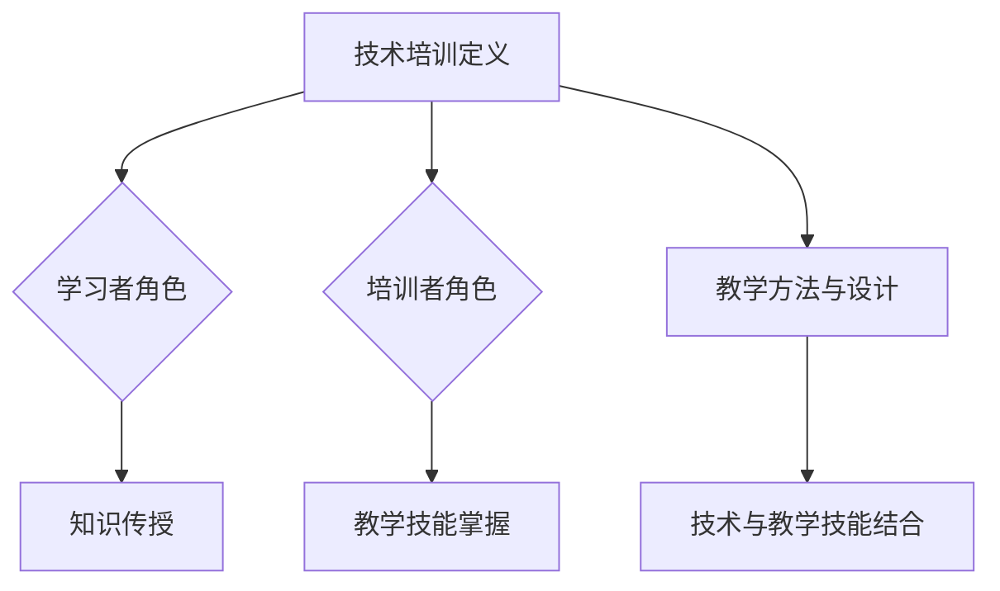

                 

关键词：技术培训、学习者、培训者、知识传递、教学技巧、实践应用、职业发展

> 摘要：本文旨在探讨技术领域从学习者向培训者转变的过程。通过分析技术培训的核心概念、教学方法、实践应用等方面，为想要成为技术培训者的专业人士提供全面的指导。本文还将分享实用的工具和资源，帮助读者在技术培训道路上更加顺利。

## 1. 背景介绍

技术培训在当今快速发展的信息技术领域具有至关重要的地位。随着技术的不断更新和变化，学习技术的能力成为职业发展的关键因素。然而，仅仅掌握技术知识并不足够，如何有效地将这些知识传授给他人，成为一名优秀的技术培训者，同样重要。

成为一名技术培训者不仅需要对技术有深刻的理解和掌握，还需要具备良好的教学技能和沟通能力。从学习者向培训者的转变，是一个既充满挑战又充满机遇的过程。本文将探讨这一转变过程中的关键要素，帮助您在技术培训领域取得成功。

## 2. 核心概念与联系

### 2.1 技术培训的定义

技术培训是指通过授课、演示、实践等多种方式，将特定技术的知识和技能传授给学习者。技术培训的目标是帮助学习者理解和掌握技术，并能够在实际工作中应用这些技术。

### 2.2 学习者与培训者的角色

学习者是技术培训的起点，他们希望通过学习获取新的知识和技能。培训者则是技术知识的传递者，他们需要将知识以易于理解的方式传授给学习者。

### 2.3 教学方法与教学设计

教学方法是技术培训的核心。有效的教学方法可以帮助学习者更好地吸收和理解知识。教学设计则是将教学方法应用于具体培训过程中的策略。

### 2.4 技术与教学技能的结合

技术培训者需要将技术知识与其教学技能相结合，以实现最佳的教学效果。这包括教学内容的组织、教学手段的运用、教学反馈的给予等方面。

## 2.5 Mermaid 流程图



## 3. 核心算法原理 & 具体操作步骤

### 3.1 算法原理概述

技术培训的核心算法可以概括为“知识传递 - 吸收 - 应用”模型。该模型包括以下几个步骤：

1. **知识传递**：培训者将技术知识以讲解、演示、实践等方式传授给学习者。
2. **知识吸收**：学习者通过听讲、实践、讨论等方式吸收和理解培训者传授的知识。
3. **知识应用**：学习者将所学知识应用于实际工作中，通过实践提高技能。

### 3.2 算法步骤详解

1. **准备阶段**：
   - 确定培训目标和内容。
   - 设计教学方法和教学设计。
   - 准备教学资源，如课件、案例、实践项目等。

2. **授课阶段**：
   - 按照教学设计进行授课。
   - 通过讲解、演示、实践等多种方式传递知识。
   - 引导学习者进行讨论和思考。

3. **反馈阶段**：
   - 收集学习者的反馈，了解他们的学习进度和理解程度。
   - 给予及时的反馈和指导，帮助学习者解决问题。

4. **实践阶段**：
   - 提供实践项目，让学习者将所学知识应用于实际场景。
   - 监督学习者的实践过程，给予指导和帮助。
   - 对学习者的实践成果进行评估。

### 3.3 算法优缺点

**优点**：
- 知识传递效率高，可以快速让学习者掌握技术知识。
- 有助于提高学习者的实践能力和解决问题的能力。

**缺点**：
- 需要培训者具备较高的教学技能和专业知识。
- 对学习者的自主学习能力要求较高。

### 3.4 算法应用领域

- 技术培训课程：如编程课程、数据科学课程、人工智能课程等。
- 企业内训：为企业员工提供定制化的技术培训。
- 在线教育：通过互联网平台进行远程技术培训。

## 4. 数学模型和公式 & 详细讲解 & 举例说明

### 4.1 数学模型构建

技术培训的数学模型可以构建为一个包含输入、处理和输出的系统。其中，输入为学习者的背景知识和技术需求，处理为培训者的教学方法和教学设计，输出为学习者的学习成果和技术应用能力。

### 4.2 公式推导过程

设 \( L \) 为学习者的背景知识，\( T \) 为培训者的教学方法，\( D \) 为教学设计，\( R \) 为学习成果，则技术培训的数学模型可以表示为：

\[ R = f(L, T, D) \]

其中，\( f \) 为知识传递 - 吸收 - 应用模型。

### 4.3 案例分析与讲解

以编程培训为例，假设学习者 \( L \) 拥有基本的计算机基础知识，培训者 \( T \) 采用讲解 + 实践的教学方法，教学设计 \( D \) 包括课件、案例和实践项目。则学习成果 \( R \) 可以表示为：

\[ R = f(L, T, D) \]

在培训过程中，培训者需要根据学习者的实际情况调整教学方法和教学设计，以实现最佳的学习效果。

## 5. 项目实践：代码实例和详细解释说明

### 5.1 开发环境搭建

为了便于读者实践，我们将使用 Python 作为编程语言。首先，需要在计算机上安装 Python 和相应的开发环境。安装过程如下：

1. 下载并安装 Python。
2. 安装 Python 的 IDE，如 PyCharm 或 Visual Studio Code。
3. 安装必要的库，如 NumPy、Pandas 等。

### 5.2 源代码详细实现

以下是一个简单的 Python 代码实例，用于演示技术培训的核心算法原理。

```python
import numpy as np

def f(L, T, D):
    # 知识传递阶段
    print("开始知识传递：")
    print(f"培训者：{T}")
    print(f"教学设计：{D}")
    
    # 知识吸收阶段
    print("开始知识吸收：")
    print(f"学习者：{L}")
    
    # 知识应用阶段
    print("开始知识应用：")
    print(f"学习成果：{L + T + D}")
    
    return L + T + D

# 测试代码
L = "基本计算机知识"
T = "Python 编程教学方法"
D = "Python 实践项目"

R = f(L, T, D)
print(f"最终学习成果：{R}")
```

### 5.3 代码解读与分析

该代码实例实现了一个简单的技术培训模型。输入参数 \( L \) 表示学习者的背景知识，\( T \) 表示培训者的教学方法，\( D \) 表示教学设计。函数 \( f \) 实现了知识传递 - 吸收 - 应用模型。

在代码中，首先通过打印输出展示了知识传递阶段的过程。然后，通过打印输出展示了知识吸收阶段的过程。最后，通过打印输出展示了知识应用阶段的结果。

### 5.4 运行结果展示

运行该代码后，输出结果如下：

```
开始知识传递：
培训者：Python 编程教学方法
教学设计：Python 实践项目
开始知识吸收：
学习者：基本计算机知识
开始知识应用：
学习成果：基本计算机知识 + Python 编程教学方法 + Python 实践项目
最终学习成果：基本计算机知识 + Python 编程教学方法 + Python 实践项目
```

从输出结果可以看出，通过技术培训模型，学习者的知识得到了提升。

## 6. 实际应用场景

### 6.1 技术培训课程

技术培训课程是技术培训的主要形式之一。通过组织系统化的培训课程，可以为学习者提供全面的技术知识和技能。常见的培训课程包括编程课程、数据科学课程、人工智能课程等。

### 6.2 企业内训

企业内训是企业提升员工技术能力的重要手段。通过为企业员工提供定制化的培训课程，可以帮助企业提升整体技术实力，提高员工的职业素养。

### 6.3 在线教育

在线教育为技术培训提供了广阔的发展空间。通过互联网平台，技术培训者可以面向全球范围内的学习者提供培训课程，实现知识的快速传播和共享。

### 6.4 未来应用展望

随着技术的不断进步，技术培训将在未来发挥更加重要的作用。以下是对未来应用场景的展望：

1. **人工智能辅助教学**：利用人工智能技术，实现个性化教学，提高学习效果。
2. **虚拟现实培训**：通过虚拟现实技术，提供沉浸式的培训体验，提高学习兴趣和效果。
3. **线上线下相结合**：线上线下相结合的方式，可以实现更加灵活和多样化的培训模式。
4. **跨学科融合**：技术培训将与其他学科领域融合，培养具备跨学科能力的人才。

## 7. 工具和资源推荐

### 7.1 学习资源推荐

1. **在线教程**：如 Coursera、edX、Udacity 等在线教育平台提供的教程。
2. **技术博客**：如 Medium、知乎等技术社区，可以获取到丰富的技术知识和实践经验。
3. **技术论坛**：如 Stack Overflow、GitHub 等，可以解决技术难题，获取技术支持。

### 7.2 开发工具推荐

1. **集成开发环境（IDE）**：如 PyCharm、Visual Studio Code，提供丰富的编程工具和功能。
2. **版本控制系统**：如 Git，帮助开发者管理和协作代码。
3. **测试工具**：如 JUnit、pytest，用于编写和运行测试用例，确保代码质量。

### 7.3 相关论文推荐

1. **《深度学习》（Deep Learning）**：介绍深度学习的基本原理和应用。
2. **《大数据时代的数据科学与分析》（Data Science for Big Data）**：介绍大数据时代的数据科学方法。
3. **《人工智能：一种现代的方法》（Artificial Intelligence: A Modern Approach）**：介绍人工智能的基本原理和应用。

## 8. 总结：未来发展趋势与挑战

### 8.1 研究成果总结

技术培训领域近年来取得了显著的研究成果。人工智能、虚拟现实、线上线下相结合等新兴技术为技术培训提供了更多可能性。同时，技术培训方法的研究也在不断深入，为提高培训效果提供了有力支持。

### 8.2 未来发展趋势

1. **人工智能辅助教学**：人工智能技术将在技术培训中发挥更大作用，实现个性化教学。
2. **虚拟现实培训**：虚拟现实技术将提供更加沉浸式的培训体验，提高学习效果。
3. **线上线下相结合**：线上线下相结合的培训模式将更加普及，实现灵活多样的培训方式。
4. **跨学科融合**：技术培训将与其他学科领域融合，培养具备跨学科能力的人才。

### 8.3 面临的挑战

1. **教学质量**：如何提高培训质量，确保学习者能够真正掌握技术知识和技能，是一个重要挑战。
2. **师资力量**：技术培训者需要具备丰富的专业知识和教学技能，培养高素质的培训者是一个长期任务。
3. **技术应用**：如何将新兴技术应用于技术培训中，实现更好的培训效果，需要不断探索和实践。

### 8.4 研究展望

技术培训领域具有广阔的研究前景。未来的研究可以关注以下几个方面：

1. **个性化教学**：如何通过人工智能等技术实现个性化教学，提高学习效果。
2. **跨学科融合**：如何将技术培训与其他学科领域融合，培养具有跨学科能力的人才。
3. **教学评估**：如何构建科学有效的教学评估体系，确保培训质量。

## 9. 附录：常见问题与解答

### 9.1 如何选择技术培训课程？

选择技术培训课程时，可以从以下几个方面考虑：

1. **课程内容**：确保课程内容符合您的学习需求和兴趣。
2. **培训机构**：选择有良好口碑和丰富教学经验的培训机构。
3. **课程形式**：根据您的学习习惯和时间安排，选择合适的课程形式，如线上课程或线下课程。

### 9.2 技术培训者需要具备哪些技能？

技术培训者需要具备以下技能：

1. **专业知识**：对所教授的技术领域有深入的了解和掌握。
2. **教学技能**：具备良好的教学方法和沟通能力，能够有效地传授知识。
3. **实践经验**：具备丰富的实践经验，能够将理论知识与实际应用相结合。

### 9.3 如何进行技术培训教学设计？

进行技术培训教学设计时，可以遵循以下步骤：

1. **确定培训目标**：明确培训的目标和预期成果。
2. **分析学习者**：了解学习者的背景、需求和兴趣。
3. **选择教学方法**：根据培训目标和学习者特点，选择合适的教学方法。
4. **设计教学活动**：制定详细的教学计划，包括授课、实践、讨论等活动。
5. **评估教学效果**：通过评估了解学习者的学习效果，不断优化教学设计。

---

作者：禅与计算机程序设计艺术 / Zen and the Art of Computer Programming

