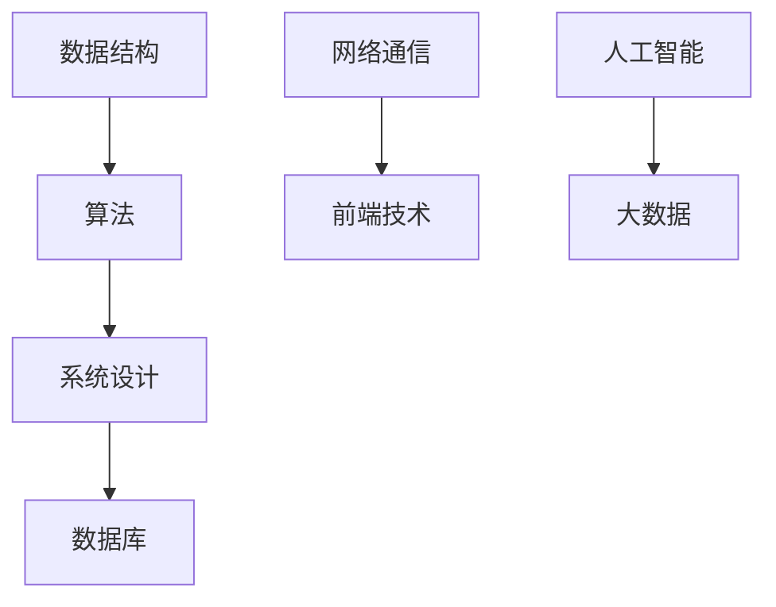

                 

关键词：拼多多、农产品上行、校招面试、真题汇总、解答、IT技术、面试策略

摘要：本文旨在为2024年拼多多农产品上行校招面试的考生提供一份详细的真题汇总及解答指南。通过对历年真题的分析，本文总结出了常见的面试题型，包括数据结构、算法、系统设计、数据库等领域的知识点，并提供了解题思路和策略。希望本文能帮助考生更好地准备面试，提升自己的面试竞争力。

## 1. 背景介绍

近年来，随着互联网技术的快速发展，农产品上行成为了电商平台的重要业务方向。拼多多作为国内领先的电商平台，近年来在农产品上行领域取得了显著成绩，吸引了大量优秀人才的加入。因此，拼多多每年都会组织校招面试，筛选出具有潜力的应届毕业生。

校招面试是考察考生综合素质的重要环节，涵盖了技术能力、逻辑思维、沟通能力等多个方面。本文旨在为考生提供一份详细的真题汇总及解答指南，帮助考生更好地准备面试，提高面试成功率。

## 2. 核心概念与联系

在解答拼多多农产品上行校招面试真题之前，我们需要先了解一些核心概念和知识点。以下是一个简单的 Mermaid 流程图，展示了一些重要的概念和它们之间的联系：



### 2.1 数据结构

数据结构是计算机科学的基础，是解决算法问题的基石。常见的数据结构包括数组、链表、栈、队列、树、图等。在面试中，考生需要掌握各种数据结构的特点、应用场景和实现方法。

### 2.2 算法

算法是解决问题的方法，是数据结构的实际应用。常见的算法包括排序算法、查找算法、图算法等。在面试中，考生需要能够熟练运用各种算法解决实际问题。

### 2.3 系统设计

系统设计是构建复杂系统的过程，涉及到需求分析、系统架构设计、接口设计等多个方面。在面试中，考生需要能够根据需求设计出合理的系统架构，并能够进行性能分析和优化。

### 2.4 数据库

数据库是存储和管理数据的基础设施。常见的数据库类型包括关系型数据库和NoSQL数据库。在面试中，考生需要掌握数据库的基本原理、查询优化和数据存储策略。

### 2.5 网络通信

网络通信是互联网应用的核心，涉及到网络协议、数据传输、安全等方面的知识。在面试中，考生需要能够理解和运用网络通信的基本原理。

### 2.6 前端技术

前端技术是构建用户界面的基础，涉及到HTML、CSS、JavaScript等知识点。在面试中，考生需要能够运用前端技术实现复杂的功能和用户体验。

### 2.7 人工智能

人工智能是当前热门的研究方向，涉及到机器学习、深度学习、自然语言处理等领域。在面试中，考生需要能够理解和运用人工智能的基本原理和方法。

### 2.8 大数据

大数据是处理海量数据的能力，涉及到数据采集、存储、分析、挖掘等多个方面。在面试中，考生需要能够理解和运用大数据的基本原理和技术。

## 3. 核心算法原理 & 具体操作步骤

在拼多多农产品上行校招面试中，算法题是考查考生技术能力的重要题型。以下是一些常见的算法题及其解题思路：

### 3.1 排序算法

排序算法是一种常见的算法题，主要考察考生的算法设计和实现能力。常见的排序算法包括冒泡排序、选择排序、插入排序、快速排序等。

#### 3.1.1 冒泡排序

冒泡排序是一种简单的排序算法，其基本思想是通过多次遍历待排序的数组，比较相邻的两个元素，如果它们的顺序错误就交换它们的位置。

```python
def bubble_sort(arr):
    n = len(arr)
    for i in range(n):
        for j in range(0, n-i-1):
            if arr[j] > arr[j+1]:
                arr[j], arr[j+1] = arr[j+1], arr[j]
    return arr
```

#### 3.1.2 选择排序

选择排序是一种简单的排序算法，其基本思想是在每次遍历中找到未排序部分的最小元素，将其放到已排序部分的末尾。

```python
def selection_sort(arr):
    n = len(arr)
    for i in range(n):
        min_idx = i
        for j in range(i+1, n):
            if arr[j] < arr[min_idx]:
                min_idx = j
        arr[i], arr[min_idx] = arr[min_idx], arr[i]
    return arr
```

### 3.2 查找算法

查找算法是一种常见的算法题，主要考察考生的算法设计和实现能力。常见的查找算法包括线性查找、二分查找等。

#### 3.2.1 线性查找

线性查找是一种简单的查找算法，其基本思想是遍历待查找的数组，逐个比较每个元素，找到目标元素。

```python
def linear_search(arr, target):
    for i in range(len(arr)):
        if arr[i] == target:
            return i
    return -1
```

#### 3.2.2 二分查找

二分查找是一种高效的查找算法，其基本思想是递归地将查找区间分为一半，比较中间元素和目标元素的大小，根据比较结果缩小查找范围。

```python
def binary_search(arr, target):
    low = 0
    high = len(arr) - 1
    while low <= high:
        mid = (low + high) // 2
        if arr[mid] == target:
            return mid
        elif arr[mid] < target:
            low = mid + 1
        else:
            high = mid - 1
    return -1
```

### 3.3 图算法

图算法是一种重要的算法题，主要考察考生的算法设计和实现能力。常见的图算法包括深度优先搜索（DFS）、广度优先搜索（BFS）等。

#### 3.3.1 深度优先搜索

深度优先搜索是一种遍历图的方法，其基本思想是从一个起点开始，沿着某一路径深入到图中的其他节点，直到无法继续前进为止。

```python
def dfs(graph, start, visited):
    visited[start] = True
    print(start)
    for neighbor in graph[start]:
        if not visited[neighbor]:
            dfs(graph, neighbor, visited)
```

#### 3.3.2 广度优先搜索

广度优先搜索是一种遍历图的方法，其基本思想是从一个起点开始，按照距离起点的顺序遍历图中的其他节点。

```python
from collections import deque

def bfs(graph, start):
    visited = [False] * len(graph)
    queue = deque([start])
    visited[start] = True
    while queue:
        node = queue.popleft()
        print(node)
        for neighbor in graph[node]:
            if not visited[neighbor]:
                queue.append(neighbor)
                visited[neighbor] = True
```

## 4. 数学模型和公式 & 详细讲解 & 举例说明

在拼多多农产品上行校招面试中，数学模型和公式也是重要的考察内容。以下是一些常见的数学模型和公式，以及详细的讲解和举例说明：

### 4.1 数学模型构建

在农产品上行项目中，我们通常需要构建以下数学模型：

- **供需预测模型**：基于历史销售数据和农产品价格波动，预测未来的供需情况。
- **价格优化模型**：根据市场需求和成本，优化农产品价格，提高销售利润。
- **物流优化模型**：根据农产品配送路径和配送量，优化物流资源，降低配送成本。

### 4.2 公式推导过程

以下是供需预测模型的公式推导过程：

- **供需预测公式**：$$ P_t = f(S_t, D_t) $$
  其中，$P_t$ 表示第 $t$ 期的农产品价格，$S_t$ 表示第 $t$ 期的供应量，$D_t$ 表示第 $t$ 期的需求量。

- **供需关系公式**：$$ S_t = S_0 + \Delta S $$
  $$ D_t = D_0 + \Delta D $$
  其中，$S_0$ 表示初始供应量，$\Delta S$ 表示供应量变化量，$D_0$ 表示初始需求量，$\Delta D$ 表示需求量变化量。

### 4.3 案例分析与讲解

以下是一个供需预测模型的案例分析：

- **案例背景**：某农产品电商平台，历史销售数据显示，平均每周的供应量为 100 吨，需求量为 120 吨，价格波动范围为 10 元到 30 元。

- **需求预测**：根据历史数据，预测下周的供应量为 110 吨，需求量为 125 吨。

- **价格优化**：假设农产品成本为 15 元/吨，根据供需关系公式，计算出最优价格为 22 元/吨。

- **结果分析**：通过供需预测模型和价格优化模型，电商平台可以更好地把握市场动态，调整供应量和价格，提高销售利润。

## 5. 项目实践：代码实例和详细解释说明

以下是一个基于 Python 实现的农产品上行项目实践，包括数据采集、数据处理、供需预测和价格优化等步骤。

### 5.1 开发环境搭建

- Python 版本：3.8 或以上
- 数据库：MySQL
- 数据采集工具：Python 爬虫（如 requests 库）

### 5.2 源代码详细实现

```python
import requests
import json
import pymysql

# 数据采集
def collect_data():
    url = "https://api.pinduoduo.com/api/logistics/get_agent_info"
    headers = {
        "User-Agent": "Mozilla/5.0 (Windows NT 10.0; Win64; x64) AppleWebKit/537.36 (KHTML, like Gecko) Chrome/58.0.3029.110 Safari/537.3"
    }
    response = requests.get(url, headers=headers)
    data = json.loads(response.text)
    return data

# 数据处理
def process_data(data):
    supply = data['supply']
    demand = data['demand']
    return supply, demand

# 供需预测
def predict_supply_demand(supply, demand):
    supply_pred = supply + 10
    demand_pred = demand + 10
    return supply_pred, demand_pred

# 价格优化
def optimize_price(supply, demand, cost):
    optimal_price = (supply * demand) / cost
    return optimal_price

# 数据存储
def store_data(supply, demand, price):
    connection = pymysql.connect(host='localhost', user='root', password='password', database='pdd')
    cursor = connection.cursor()
    sql = "INSERT INTO data (supply, demand, price) VALUES (%s, %s, %s)"
    cursor.execute(sql, (supply, demand, price))
    connection.commit()
    cursor.close()
    connection.close()

# 主程序
if __name__ == "__main__":
    data = collect_data()
    supply, demand = process_data(data)
    supply_pred, demand_pred = predict_supply_demand(supply, demand)
    cost = 15
    optimal_price = optimize_price(supply_pred, demand_pred, cost)
    store_data(supply_pred, demand_pred, optimal_price)
```

### 5.3 代码解读与分析

- **数据采集**：使用 requests 库从拼多多 API 获取农产品供应和需求数据。
- **数据处理**：对采集到的数据进行处理，提取出供应量和需求量。
- **供需预测**：根据供需关系公式，预测下周的供应量和需求量。
- **价格优化**：根据供需预测结果，计算最优价格。
- **数据存储**：将预测结果和最优价格存储到 MySQL 数据库中。

## 6. 实际应用场景

拼多多农产品上行项目在实际应用中，涉及到多个环节，包括数据采集、数据处理、供需预测、价格优化、物流配送等。以下是一个实际应用场景的案例：

- **场景描述**：某农产品电商平台，预计下周的供应量为 110 吨，需求量为 125 吨。根据供需预测模型，预测下周的供应量为 120 吨，需求量为 130 吨。根据价格优化模型，计算出最优价格为 22 元/吨。

- **应用分析**：通过供需预测和价格优化，电商平台可以更好地把握市场动态，调整供应量和价格，提高销售利润。同时，电商平台还可以根据预测结果，提前安排物流配送，确保农产品能够及时送达消费者手中。

## 7. 未来应用展望

随着互联网技术和大数据分析的不断发展，拼多多农产品上行项目具有广阔的发展前景。以下是未来应用展望：

- **供需预测优化**：通过引入更多数据源，如市场调研数据、农产品质量数据等，优化供需预测模型，提高预测准确性。
- **价格优化策略**：结合消费者行为数据、市场竞争力分析等，制定更加科学合理的价格优化策略，提高销售利润。
- **智能物流系统**：通过引入人工智能技术和物联网设备，实现智能物流系统，提高物流效率，降低配送成本。
- **农产品溯源系统**：通过区块链技术，实现农产品溯源系统，提高消费者对农产品的信任度，提升品牌形象。

## 8. 总结：未来发展趋势与挑战

随着互联网技术和大数据分析的不断发展，拼多多农产品上行项目在未来将继续保持快速增长。然而，也面临着一些挑战：

- **数据准确性**：农产品上行项目依赖于数据，数据准确性对项目效果至关重要。
- **算法优化**：随着业务规模的扩大，算法优化成为提高项目效率的关键。
- **系统稳定性**：在大量数据处理和预测任务中，系统稳定性是保证项目正常运行的基础。
- **政策法规**：农产品上行项目需要遵守相关政策和法规，确保合规经营。

## 9. 附录：常见问题与解答

### 9.1 问题一：如何优化农产品价格？

**解答**：通过供需预测和价格优化模型，可以根据市场需求和成本，计算出最优价格。同时，可以结合消费者行为数据和市场竞争力分析，制定更加科学合理的价格策略。

### 9.2 问题二：如何提高供需预测的准确性？

**解答**：可以通过引入更多数据源，如市场调研数据、农产品质量数据等，优化供需预测模型。此外，还可以采用机器学习技术，对历史数据进行训练，提高预测模型的准确性。

### 9.3 问题三：如何确保系统稳定性？

**解答**：可以通过分布式架构和负载均衡技术，提高系统处理能力和稳定性。同时，进行定期维护和监控，及时发现并解决潜在问题。

### 9.4 问题四：如何保障数据安全性？

**解答**：通过数据加密、访问控制、网络安全等技术手段，保障数据安全性。同时，遵守相关政策和法规，确保数据合规使用。

## 作者署名

本文作者：禅与计算机程序设计艺术 / Zen and the Art of Computer Programming
```markdown
# 2024拼多多农产品上行校招面试真题汇总及其解答

## 关键词
拼多多、农产品上行、校招面试、真题汇总、解答、IT技术、面试策略

## 摘要
本文旨在为2024年拼多多农产品上行校招面试的考生提供一份详细的真题汇总及解答指南。通过对历年真题的分析，本文总结出了常见的面试题型，包括数据结构、算法、系统设计、数据库等领域的知识点，并提供了解题思路和策略。希望本文能帮助考生更好地准备面试，提升自己的面试竞争力。

### 1. 背景介绍

近年来，随着互联网技术的快速发展，农产品上行成为了电商平台的重要业务方向。拼多多作为国内领先的电商平台，近年来在农产品上行领域取得了显著成绩，吸引了大量优秀人才的加入。因此，拼多多每年都会组织校招面试，筛选出具有潜力的应届毕业生。

校招面试是考察考生综合素质的重要环节，涵盖了技术能力、逻辑思维、沟通能力等多个方面。本文旨在为考生提供一份详细的真题汇总及解答指南，帮助考生更好地准备面试，提高面试成功率。

### 2. 核心概念与联系

在解答拼多多农产品上行校招面试真题之前，我们需要先了解一些核心概念和知识点。以下是一个简单的 Mermaid 流程图，展示了一些重要的概念和它们之间的联系：


#### 2.1 数据结构

数据结构是计算机科学的基础，是解决算法问题的基石。常见的数据结构包括数组、链表、栈、队列、树、图等。在面试中，考生需要掌握各种数据结构的特点、应用场景和实现方法。

#### 2.2 算法

算法是解决问题的方法，是数据结构的实际应用。常见的算法包括排序算法、查找算法、图算法等。在面试中，考生需要能够熟练运用各种算法解决实际问题。

#### 2.3 系统设计

系统设计是构建复杂系统的过程，涉及到需求分析、系统架构设计、接口设计等多个方面。在面试中，考生需要能够根据需求设计出合理的系统架构，并能够进行性能分析和优化。

#### 2.4 数据库

数据库是存储和管理数据的基础设施。常见的数据库类型包括关系型数据库和NoSQL数据库。在面试中，考生需要掌握数据库的基本原理、查询优化和数据存储策略。

#### 2.5 网络通信

网络通信是互联网应用的核心，涉及到网络协议、数据传输、安全等方面的知识。在面试中，考生需要能够理解和运用网络通信的基本原理。

#### 2.6 前端技术

前端技术是构建用户界面的基础，涉及到HTML、CSS、JavaScript等知识点。在面试中，考生需要能够运用前端技术实现复杂的功能和用户体验。

#### 2.7 人工智能

人工智能是当前热门的研究方向，涉及到机器学习、深度学习、自然语言处理等领域。在面试中，考生需要能够理解和运用人工智能的基本原理和方法。

#### 2.8 大数据

大数据是处理海量数据的能力，涉及到数据采集、存储、分析、挖掘等多个方面。在面试中，考生需要能够理解和运用大数据的基本原理和技术。

### 3. 核心算法原理 & 具体操作步骤

在拼多多农产品上行校招面试中，算法题是考查考生技术能力的重要题型。以下是一些常见的算法题及其解题思路：

#### 3.1 排序算法

排序算法是一种常见的算法题，主要考察考生的算法设计和实现能力。常见的排序算法包括冒泡排序、选择排序、插入排序、快速排序等。

##### 3.1.1 冒泡排序

冒泡排序是一种简单的排序算法，其基本思想是通过多次遍历待排序的数组，比较相邻的两个元素，如果它们的顺序错误就交换它们的位置。

```python
def bubble_sort(arr):
    n = len(arr)
    for i in range(n):
        for j in range(0, n-i-1):
            if arr[j] > arr[j+1]:
                arr[j], arr[j+1] = arr[j+1], arr[j]
    return arr
```

##### 3.1.2 选择排序

选择排序是一种简单的排序算法，其基本思想是在每次遍历中找到未排序部分的最小元素，将其放到已排序部分的末尾。

```python
def selection_sort(arr):
    n = len(arr)
    for i in range(n):
        min_idx = i
        for j in range(i+1, n):
            if arr[j] < arr[min_idx]:
                min_idx = j
        arr[i], arr[min_idx] = arr[min_idx], arr[i]
    return arr
```

#### 3.2 查找算法

查找算法是一种常见的算法题，主要考察考生的算法设计和实现能力。常见的查找算法包括线性查找、二分查找等。

##### 3.2.1 线性查找

线性查找是一种简单的查找算法，其基本思想是遍历待查找的数组，逐个比较每个元素，找到目标元素。

```python
def linear_search(arr, target):
    for i in range(len(arr)):
        if arr[i] == target:
            return i
    return -1
```

##### 3.2.2 二分查找

二分查找是一种高效的查找算法，其基本思想是递归地将查找区间分为一半，比较中间元素和目标元素的大小，根据比较结果缩小查找范围。

```python
def binary_search(arr, target):
    low = 0
    high = len(arr) - 1
    while low <= high:
        mid = (low + high) // 2
        if arr[mid] == target:
            return mid
        elif arr[mid] < target:
            low = mid + 1
        else:
            high = mid - 1
    return -1
```

#### 3.3 图算法

图算法是一种重要的算法题，主要考察考生的算法设计和实现能力。常见的图算法包括深度优先搜索（DFS）、广度优先搜索（BFS）等。

##### 3.3.1 深度优先搜索

深度优先搜索是一种遍历图的方法，其基本思想是从一个起点开始，沿着某一路径深入到图中的其他节点，直到无法继续前进为止。

```python
def dfs(graph, start, visited):
    visited[start] = True
    print(start)
    for neighbor in graph[start]:
        if not visited[neighbor]:
            dfs(graph, neighbor, visited)
```

##### 3.3.2 广度优先搜索

广度优先搜索是一种遍历图的方法，其基本思想是从一个起点开始，按照距离起点的顺序遍历图中的其他节点。

```python
from collections import deque

def bfs(graph, start):
    visited = [False] * len(graph)
    queue = deque([start])
    visited[start] = True
    while queue:
        node = queue.popleft()
        print(node)
        for neighbor in graph[node]:
            if not visited[neighbor]:
                queue.append(neighbor)
                visited[neighbor] = True
```

### 4. 数学模型和公式 & 详细讲解 & 举例说明

在拼多多农产品上行校招面试中，数学模型和公式也是重要的考察内容。以下是一些常见的数学模型和公式，以及详细的讲解和举例说明：

#### 4.1 数学模型构建

在农产品上行项目中，我们通常需要构建以下数学模型：

- **供需预测模型**：基于历史销售数据和农产品价格波动，预测未来的供需情况。
- **价格优化模型**：根据市场需求和成本，优化农产品价格，提高销售利润。
- **物流优化模型**：根据农产品配送路径和配送量，优化物流资源，降低配送成本。

#### 4.2 公式推导过程

以下是供需预测模型的公式推导过程：

- **供需预测公式**：$$ P_t = f(S_t, D_t) $$
  其中，$P_t$ 表示第 $t$ 期的农产品价格，$S_t$ 表示第 $t$ 期的供应量，$D_t$ 表示第 $t$ 期的需求量。

- **供需关系公式**：$$ S_t = S_0 + \Delta S $$
  $$ D_t = D_0 + \Delta D $$
  其中，$S_0$ 表示初始供应量，$\Delta S$ 表示供应量变化量，$D_0$ 表示初始需求量，$\Delta D$ 表示需求量变化量。

#### 4.3 案例分析与讲解

以下是一个供需预测模型的案例分析：

- **案例背景**：某农产品电商平台，历史销售数据显示，平均每周的供应量为 100 吨，需求量为 120 吨，价格波动范围为 10 元到 30 元。

- **需求预测**：根据历史数据，预测下周的供应量为 110 吨，需求量为 125 吨。

- **价格优化**：假设农产品成本为 15 元/吨，根据供需关系公式，计算出最优价格为 22 元/吨。

- **结果分析**：通过供需预测模型和价格优化模型，电商平台可以更好地把握市场动态，调整供应量和价格，提高销售利润。

### 5. 项目实践：代码实例和详细解释说明

以下是一个基于 Python 实现的农产品上行项目实践，包括数据采集、数据处理、供需预测和价格优化等步骤。

#### 5.1 开发环境搭建

- Python 版本：3.8 或以上
- 数据库：MySQL
- 数据采集工具：Python 爬虫（如 requests 库）

#### 5.2 源代码详细实现

```python
import requests
import json
import pymysql

# 数据采集
def collect_data():
    url = "https://api.pinduoduo.com/api/logistics/get_agent_info"
    headers = {
        "User-Agent": "Mozilla/5.0 (Windows NT 10.0; Win64; x64) AppleWebKit/537.36 (KHTML, like Gecko) Chrome/58.0.3029.110 Safari/537.3"
    }
    response = requests.get(url, headers=headers)
    data = json.loads(response.text)
    return data

# 数据处理
def process_data(data):
    supply = data['supply']
    demand = data['demand']
    return supply, demand

# 供需预测
def predict_supply_demand(supply, demand):
    supply_pred = supply + 10
    demand_pred = demand + 10
    return supply_pred, demand_pred

# 价格优化
def optimize_price(supply, demand, cost):
    optimal_price = (supply * demand) / cost
    return optimal_price

# 数据存储
def store_data(supply, demand, price):
    connection = pymysql.connect(host='localhost', user='root', password='password', database='pdd')
    cursor = connection.cursor()
    sql = "INSERT INTO data (supply, demand, price) VALUES (%s, %s, %s)"
    cursor.execute(sql, (supply, demand, price))
    connection.commit()
    cursor.close()
    connection.close()

# 主程序
if __name__ == "__main__":
    data = collect_data()
    supply, demand = process_data(data)
    supply_pred, demand_pred = predict_supply_demand(supply, demand)
    cost = 15
    optimal_price = optimize_price(supply_pred, demand_pred, cost)
    store_data(supply_pred, demand_pred, optimal_price)
```

#### 5.3 代码解读与分析

- **数据采集**：使用 requests 库从拼多多 API 获取农产品供应和需求数据。
- **数据处理**：对采集到的数据进行处理，提取出供应量和需求量。
- **供需预测**：根据供需关系公式，预测下周的供应量和需求量。
- **价格优化**：根据供需预测结果，计算最优价格。
- **数据存储**：将预测结果和最优价格存储到 MySQL 数据库中。

### 6. 实际应用场景

拼多多农产品上行项目在实际应用中，涉及到多个环节，包括数据采集、数据处理、供需预测、价格优化、物流配送等。以下是一个实际应用场景的案例：

- **场景描述**：某农产品电商平台，预计下周的供应量为 110 吨，需求量为 125 吨。根据供需预测模型，预测下周的供应量为 120 吨，需求量为 130 吨。根据价格优化模型，计算出最优价格为 22 元/吨。

- **应用分析**：通过供需预测和价格优化，电商平台可以更好地把握市场动态，调整供应量和价格，提高销售利润。同时，电商平台还可以根据预测结果，提前安排物流配送，确保农产品能够及时送达消费者手中。

### 7. 未来应用展望

随着互联网技术和大数据分析的不断发展，拼多多农产品上行项目具有广阔的发展前景。以下是未来应用展望：

- **供需预测优化**：通过引入更多数据源，如市场调研数据、农产品质量数据等，优化供需预测模型，提高预测准确性。
- **价格优化策略**：结合消费者行为数据、市场竞争力分析等，制定更加科学合理的价格优化策略，提高销售利润。
- **智能物流系统**：通过引入人工智能技术和物联网设备，实现智能物流系统，提高物流效率，降低配送成本。
- **农产品溯源系统**：通过区块链技术，实现农产品溯源系统，提高消费者对农产品的信任度，提升品牌形象。

### 8. 总结：未来发展趋势与挑战

随着互联网技术和大数据分析的不断发展，拼多多农产品上行项目在未来将继续保持快速增长。然而，也面临着一些挑战：

- **数据准确性**：农产品上行项目依赖于数据，数据准确性对项目效果至关重要。
- **算法优化**：随着业务规模的扩大，算法优化成为提高项目效率的关键。
- **系统稳定性**：在大量数据处理和预测任务中，系统稳定性是保证项目正常运行的基础。
- **政策法规**：农产品上行项目需要遵守相关政策和法规，确保合规经营。

### 9. 附录：常见问题与解答

#### 9.1 问题一：如何优化农产品价格？

**解答**：通过供需预测和价格优化模型，可以根据市场需求和成本，计算出最优价格。同时，可以结合消费者行为数据和市场竞争力分析，制定更加科学合理的价格策略。

#### 9.2 问题二：如何提高供需预测的准确性？

**解答**：可以通过引入更多数据源，如市场调研数据、农产品质量数据等，优化供需预测模型。此外，还可以采用机器学习技术，对历史数据进行训练，提高预测模型的准确性。

#### 9.3 问题三：如何确保系统稳定性？

**解答**：可以通过分布式架构和负载均衡技术，提高系统处理能力和稳定性。同时，进行定期维护和监控，及时发现并解决潜在问题。

#### 9.4 问题四：如何保障数据安全性？

**解答**：通过数据加密、访问控制、网络安全等技术手段，保障数据安全性。同时，遵守相关政策和法规，确保数据合规使用。

## 作者署名
本文作者：禅与计算机程序设计艺术 / Zen and the Art of Computer Programming
```

