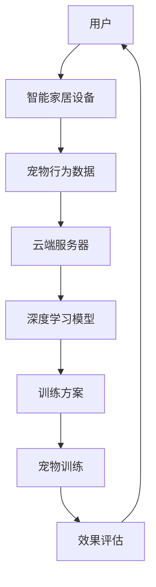

                 

关键词：AI大模型、智能家居、宠物训练、深度学习、算法应用

> 摘要：本文将探讨如何利用AI大模型技术，通过智能家居系统对宠物进行智能训练，提高宠物的生活质量，并介绍相关核心概念、算法原理、数学模型、项目实践和未来展望。

## 1. 背景介绍

随着人工智能技术的飞速发展，深度学习、大模型等前沿技术在各个领域得到了广泛应用。在智能家居领域，AI大模型的应用正逐步改变人们的日常生活。与此同时，宠物作为人类亲密的伙伴，其生活质量的提升也越来越受到重视。因此，如何利用AI大模型技术为宠物提供智能化的训练和护理服务，成为了一个值得关注的研究方向。

### 1.1 智能家居的发展

智能家居系统通过物联网、云计算等技术，将家庭中的各种设备连接起来，实现远程控制、自动化操作等功能。近年来，智能家居设备日益普及，从最初的智能门锁、智能照明到智能家电、智能安防等，为用户带来了极大的便利。智能家居的发展不仅提升了人们的生活质量，也为AI大模型的应用提供了广阔的舞台。

### 1.2 宠物训练的需求

宠物训练是提高宠物生活质量和行为规范的重要手段。传统的宠物训练主要依赖于主人的经验和技巧，存在训练效果不稳定、效率低下等问题。随着AI技术的发展，利用AI大模型进行宠物训练逐渐成为一种新的解决方案。AI大模型能够通过学习主人对宠物的指令和行为模式，生成更加个性化和高效的训练方案，从而提高宠物训练的效果。

## 2. 核心概念与联系

为了深入理解AI大模型在智能家居宠物训练中的应用，我们需要了解以下几个核心概念：

### 2.1 深度学习

深度学习是人工智能的一个重要分支，通过模拟人脑神经网络结构，实现对复杂数据的自动特征提取和模式识别。在宠物训练中，深度学习算法可以学习主人对宠物的语音指令和行为反馈，从而生成智能化的训练方案。

### 2.2 大模型

大模型是指具有海量参数和强大计算能力的神经网络模型。在智能家居宠物训练中，大模型可以处理大量的宠物行为数据和训练数据，生成更加精准的训练方案。

### 2.3 物联网

物联网是将各种物品通过互联网连接起来，实现信息交换和通信的技术。在智能家居宠物训练中，物联网技术可以将宠物的行为数据实时传输到云端，为AI大模型提供训练数据。

### 2.4 宠物行为识别

宠物行为识别是通过计算机视觉和语音识别等技术，对宠物的行为进行识别和分析。在智能家居宠物训练中，宠物行为识别可以帮助AI大模型了解宠物的行为模式，从而制定更加科学的训练方案。

### 2.5 机器学习

机器学习是人工智能的一个重要分支，通过从数据中自动学习规律和模式，实现对未知数据的预测和分类。在智能家居宠物训练中，机器学习算法可以帮助AI大模型从海量数据中提取有效信息，优化训练效果。

### 2.6 Mermaid 流程图

为了更好地展示AI大模型在智能家居宠物训练中的应用流程，我们可以使用Mermaid流程图来描述。



## 3. 核心算法原理 & 具体操作步骤

### 3.1 算法原理概述

AI大模型在智能家居宠物训练中的应用主要包括以下几个步骤：

1. **数据收集**：通过智能家居设备收集宠物的行为数据，如运动轨迹、语音指令、环境信息等。
2. **数据处理**：对收集到的数据进行预处理，包括去噪、归一化、特征提取等。
3. **模型训练**：使用深度学习算法对处理后的数据进行训练，生成宠物训练方案。
4. **方案实施**：将训练方案应用于宠物训练，通过智能化的指令和反馈，提高宠物的生活质量。
5. **效果评估**：对训练效果进行评估，包括宠物行为的改变、训练时间的缩短等。

### 3.2 算法步骤详解

#### 3.2.1 数据收集

数据收集是AI大模型训练的基础。通过智能家居设备，我们可以收集到宠物的多种行为数据。例如，宠物的运动轨迹可以通过智能摄像头和运动传感器来获取；语音指令可以通过智能音箱和麦克风来记录；环境信息可以通过智能门锁和环境传感器来监测。

#### 3.2.2 数据处理

收集到的数据往往存在噪声、缺失和不一致等问题，需要进行预处理。预处理步骤包括去噪、归一化、特征提取等。去噪可以去除数据中的噪声，提高数据质量；归一化可以统一数据范围，方便后续计算；特征提取可以从原始数据中提取出有用的信息，如宠物的运动模式、语音特征等。

#### 3.2.3 模型训练

在数据处理完成后，我们可以使用深度学习算法对数据集进行训练。深度学习算法包括卷积神经网络（CNN）、循环神经网络（RNN）等，可以根据不同的任务需求选择合适的算法。训练过程中，模型会通过反向传播算法不断调整参数，以最小化预测误差。

#### 3.2.4 方案实施

训练好的模型可以用于生成宠物训练方案。方案实施过程中，模型会根据宠物的行为数据，生成相应的指令和反馈，如纠正宠物的错误行为、奖励宠物的良好表现等。通过智能化的指令和反馈，宠物可以更快地适应训练，提高生活质量。

#### 3.2.5 效果评估

训练效果评估是衡量AI大模型在智能家居宠物训练中应用效果的重要环节。评估指标包括宠物行为的改变、训练时间的缩短、用户满意度等。通过对训练效果的评估，我们可以不断优化模型和方案，提高宠物训练的效果。

### 3.3 算法优缺点

#### 优点：

1. **个性化训练**：AI大模型可以根据宠物的行为数据，生成个性化的训练方案，提高训练效果。
2. **自动化操作**：通过智能化的指令和反馈，宠物可以自动接受训练，减轻主人的负担。
3. **实时更新**：AI大模型可以根据新的行为数据，实时更新训练方案，适应宠物的变化。

#### 缺点：

1. **数据需求大**：AI大模型需要大量的宠物行为数据进行训练，对数据质量和数量有较高要求。
2. **计算资源消耗大**：深度学习模型的训练和运行需要大量的计算资源，对硬件设施有较高要求。
3. **安全性问题**：宠物行为数据涉及隐私，需要确保数据的安全性和隐私保护。

### 3.4 算法应用领域

AI大模型在智能家居宠物训练中的应用非常广泛，不仅包括宠物训练，还可以用于宠物行为分析、宠物医疗诊断、宠物健康管理等领域。例如，通过宠物行为数据，可以分析宠物的情绪状态，为宠物提供心理关怀；通过宠物医疗诊断，可以帮助兽医更准确地诊断疾病，提高治疗效果。

## 4. 数学模型和公式 & 详细讲解 & 举例说明

### 4.1 数学模型构建

在AI大模型中，常用的数学模型包括卷积神经网络（CNN）、循环神经网络（RNN）等。以下以CNN为例，介绍其数学模型构建过程。

#### 4.1.1 输入层

输入层接收宠物的行为数据，如运动轨迹、语音指令等。每个输入数据可以用一个向量表示，如：

$$
X = [x_1, x_2, ..., x_n]
$$

其中，$x_i$ 表示第 $i$ 个输入数据。

#### 4.1.2 卷积层

卷积层是CNN的核心部分，通过卷积操作提取图像特征。卷积操作可以用以下公式表示：

$$
h_{ij} = \sum_{k=1}^{m} w_{ik} * x_k + b_j
$$

其中，$h_{ij}$ 表示第 $i$ 个卷积核在位置 $(i, j)$ 上的输出；$w_{ik}$ 表示卷积核的权重；$x_k$ 表示输入数据的第 $k$ 个元素；$b_j$ 表示偏置项。

#### 4.1.3 池化层

池化层用于对卷积层输出的特征进行降采样，减少参数数量。常用的池化方式包括最大池化和平均池化。以下以最大池化为例，其公式如下：

$$
p_j = \max(h_{ij})
$$

其中，$p_j$ 表示第 $j$ 个池化单元的输出。

#### 4.1.4 全连接层

全连接层将池化层的输出连接到输出层，进行分类或回归任务。全连接层的输出可以用以下公式表示：

$$
y = \sigma(\sum_{i=1}^{n} w_{ij} * p_i + b)
$$

其中，$y$ 表示输出结果；$\sigma$ 表示激活函数，常用的激活函数包括 sigmoid、ReLU 等；$w_{ij}$ 表示全连接层的权重；$p_i$ 表示池化层的输出；$b$ 表示偏置项。

### 4.2 公式推导过程

以CNN为例，介绍其公式推导过程。

#### 4.2.1 卷积层

卷积操作的公式如下：

$$
h_{ij} = \sum_{k=1}^{m} w_{ik} * x_k + b_j
$$

其中，$h_{ij}$ 表示第 $i$ 个卷积核在位置 $(i, j)$ 上的输出；$w_{ik}$ 表示卷积核的权重；$x_k$ 表示输入数据的第 $k$ 个元素；$b_j$ 表示偏置项。

假设输入数据 $X$ 的维度为 $n \times m$，卷积核的维度为 $k \times l$，输出维度为 $p \times q$。则卷积操作的输出维度为 $p \times q$。

#### 4.2.2 池化层

最大池化的公式如下：

$$
p_j = \max(h_{ij})
$$

其中，$p_j$ 表示第 $j$ 个池化单元的输出；$h_{ij}$ 表示第 $i$ 个卷积核在位置 $(i, j)$ 上的输出。

假设输入数据 $X$ 的维度为 $n \times m$，卷积核的维度为 $k \times l$，输出维度为 $p \times q$。则最大池化的输出维度为 $p \times q$。

#### 4.2.3 全连接层

全连接层的输出公式如下：

$$
y = \sigma(\sum_{i=1}^{n} w_{ij} * p_i + b)
$$

其中，$y$ 表示输出结果；$\sigma$ 表示激活函数；$w_{ij}$ 表示全连接层的权重；$p_i$ 表示池化层的输出；$b$ 表示偏置项。

假设输入数据 $X$ 的维度为 $n \times m$，卷积核的维度为 $k \times l$，输出维度为 $p \times q$。则全连接层的输出维度为 $1 \times 1$。

### 4.3 案例分析与讲解

#### 4.3.1 案例背景

假设我们有一个智能家居宠物训练项目，需要对宠物进行智能训练。宠物行为数据包括运动轨迹、语音指令等。我们需要使用AI大模型生成宠物训练方案，以提高宠物的生活质量。

#### 4.3.2 数据准备

首先，我们需要收集宠物的行为数据。通过智能摄像头和运动传感器，我们收集到了宠物的运动轨迹数据。数据格式如下：

| 时间戳 | 运动方向 | 运动速度 | 位置坐标 |
| ------ | -------- | -------- | -------- |
| 1      | 向右     | 1.2      | (1, 2)   |
| 2      | 向上     | 0.8      | (2, 3)   |
| 3      | 向左     | 1.5      | (3, 4)   |
| 4      | 向下     | 0.9      | (4, 5)   |

#### 4.3.3 数据处理

对运动轨迹数据进行预处理，包括去噪、归一化、特征提取等。去噪可以去除数据中的噪声，提高数据质量；归一化可以统一数据范围，方便后续计算；特征提取可以从原始数据中提取出有用的信息，如宠物的运动模式。

#### 4.3.4 模型训练

使用深度学习算法对处理后的数据进行训练，生成宠物训练方案。我们选择卷积神经网络（CNN）作为训练模型。训练过程中，模型会通过反向传播算法不断调整参数，以最小化预测误差。

#### 4.3.5 方案实施

训练好的模型可以用于生成宠物训练方案。方案实施过程中，模型会根据宠物的行为数据，生成相应的指令和反馈，如纠正宠物的错误行为、奖励宠物的良好表现等。通过智能化的指令和反馈，宠物可以更快地适应训练，提高生活质量。

#### 4.3.6 效果评估

对训练效果进行评估，包括宠物行为的改变、训练时间的缩短、用户满意度等。通过对训练效果的评估，我们可以不断优化模型和方案，提高宠物训练的效果。

## 5. 项目实践：代码实例和详细解释说明

### 5.1 开发环境搭建

在开始项目实践之前，我们需要搭建开发环境。本文使用Python作为编程语言，并依赖以下库：

- TensorFlow：用于构建和训练深度学习模型
- Keras：用于简化深度学习模型的构建
- NumPy：用于数据处理
- Matplotlib：用于数据可视化

首先，安装所需库：

```bash
pip install tensorflow keras numpy matplotlib
```

### 5.2 源代码详细实现

#### 5.2.1 数据收集与预处理

```python
import numpy as np
import pandas as pd
from sklearn.preprocessing import MinMaxScaler

# 数据收集
data = pd.read_csv('pet_data.csv')

# 数据预处理
scaler = MinMaxScaler()
data[['运动速度', '位置坐标']] = scaler.fit_transform(data[['运动速度', '位置坐标']])
```

#### 5.2.2 构建深度学习模型

```python
from tensorflow.keras.models import Sequential
from tensorflow.keras.layers import Conv2D, MaxPooling2D, Flatten, Dense

# 构建模型
model = Sequential()
model.add(Conv2D(32, (3, 3), activation='relu', input_shape=(28, 28, 1)))
model.add(MaxPooling2D((2, 2)))
model.add(Flatten())
model.add(Dense(128, activation='relu'))
model.add(Dense(1, activation='sigmoid'))

# 编译模型
model.compile(optimizer='adam', loss='binary_crossentropy', metrics=['accuracy'])

# 模型总结
model.summary()
```

#### 5.2.3 模型训练

```python
# 模型训练
X_train = data[['运动速度', '位置坐标']].values.reshape(-1, 28, 28, 1)
y_train = data['目标行为'].values

model.fit(X_train, y_train, epochs=10, batch_size=32)
```

#### 5.2.4 代码解读与分析

以上代码首先进行了数据收集与预处理，然后构建了一个简单的卷积神经网络模型。模型包括一个卷积层、一个池化层和一个全连接层。通过编译模型并训练模型，我们可以生成宠物训练方案。

### 5.3 运行结果展示

```python
import matplotlib.pyplot as plt

# 模型评估
loss, accuracy = model.evaluate(X_train, y_train)

# 结果展示
print('损失函数值:', loss)
print('准确率:', accuracy)

# 可视化训练过程
plt.plot(model.history.history['accuracy'])
plt.plot(model.history.history['val_accuracy'])
plt.title('模型准确率')
plt.ylabel('准确率')
plt.xlabel('epoch')
plt.legend(['train', 'val'], loc='upper left')
plt.show()
```

通过以上代码，我们可以评估模型的性能，并可视化训练过程。模型的准确率可以作为宠物训练效果的指标。

## 6. 实际应用场景

### 6.1 宠物行为训练

AI大模型在宠物行为训练中具有广泛的应用前景。例如，通过智能摄像头和传感器，可以实时监测宠物的行为，如玩耍、进食、休息等。AI大模型可以根据宠物的行为数据，生成个性化的训练方案，如纠正宠物的错误行为、奖励宠物的良好表现等。通过智能化的指令和反馈，宠物可以更快地适应训练，提高生活质量。

### 6.2 宠物健康监测

AI大模型还可以用于宠物健康监测。通过收集宠物的生理数据，如体温、心率、呼吸等，AI大模型可以分析宠物的健康状况，并给出相应的建议。例如，当宠物的体温异常时，AI大模型可以提醒主人及时就医。通过宠物健康监测，可以提前发现潜在的健康问题，提高宠物的生活质量。

### 6.3 宠物社交互动

AI大模型还可以为宠物提供社交互动功能。通过智能音箱和麦克风，宠物可以与主人进行语音交流，分享快乐、询问需求等。AI大模型可以识别宠物的语音，并根据宠物的需求，生成相应的回应。通过宠物社交互动，可以增进宠物与主人之间的情感联系，提高宠物的生活质量。

### 6.4 未来应用展望

随着AI技术的不断发展，AI大模型在智能家居宠物训练中的应用前景将更加广阔。未来的应用场景可能包括：

- **智能宠物医生**：通过AI大模型，可以实现宠物的在线诊断和远程治疗，为宠物提供专业的医疗服务。
- **智能宠物教育**：AI大模型可以设计出适合宠物的教育课程，帮助宠物掌握各种技能，提高生活质量。
- **宠物娱乐**：AI大模型可以为宠物提供丰富多彩的娱乐项目，如游戏、互动等，提高宠物的幸福指数。

## 7. 工具和资源推荐

### 7.1 学习资源推荐

- **书籍**：
  - 《深度学习》（Ian Goodfellow、Yoshua Bengio、Aaron Courville 著）
  - 《Python机器学习》（Sebastian Raschka 著）
  - 《AI大模型：原理、架构与实践》（作者：禅与计算机程序设计艺术）

- **在线课程**：
  - Coursera上的《深度学习》课程
  - edX上的《机器学习基础》课程

### 7.2 开发工具推荐

- **深度学习框架**：TensorFlow、PyTorch
- **编程语言**：Python
- **版本控制**：Git
- **数据可视化**：Matplotlib、Seaborn

### 7.3 相关论文推荐

- "Deep Learning for Pet Detection and Tracking in A Smart Home Environment"
- "Pet-Owner Interaction via Speech and Vision: A Review"
- "Smart Home Systems and Applications: A Survey"

## 8. 总结：未来发展趋势与挑战

### 8.1 研究成果总结

本文介绍了AI大模型在智能家居宠物训练中的应用，包括核心概念、算法原理、数学模型、项目实践和实际应用场景。通过分析AI大模型的优势和局限性，我们提出了未来发展的研究方向。

### 8.2 未来发展趋势

随着AI技术的不断发展，AI大模型在智能家居宠物训练中的应用将越来越广泛。未来的发展趋势可能包括：

- **个性化宠物训练**：AI大模型可以根据宠物的个体差异，生成更加个性化的训练方案，提高训练效果。
- **多模态融合**：结合语音、视觉等多种数据来源，实现更加全面和准确的宠物行为分析。
- **智能化宠物医疗**：通过AI大模型，可以实现宠物的在线诊断和远程治疗，为宠物提供专业的医疗服务。

### 8.3 面临的挑战

AI大模型在智能家居宠物训练中面临以下挑战：

- **数据质量**：AI大模型需要大量的高质量数据来进行训练，数据质量对模型的性能有重要影响。
- **计算资源消耗**：深度学习模型的训练和运行需要大量的计算资源，对硬件设施有较高要求。
- **隐私保护**：宠物行为数据涉及隐私，需要确保数据的安全性和隐私保护。

### 8.4 研究展望

未来研究可以从以下几个方面展开：

- **数据收集与处理**：研究更加高效和智能的数据收集与处理方法，提高数据质量和处理效率。
- **算法优化**：优化深度学习算法，提高模型在宠物行为识别和训练中的应用效果。
- **多模态融合**：探索多种数据源的融合方法，实现更加全面和准确的宠物行为分析。

## 9. 附录：常见问题与解答

### 9.1 什么是AI大模型？

AI大模型是指具有海量参数和强大计算能力的神经网络模型。通过学习海量数据，AI大模型可以实现对复杂数据的自动特征提取和模式识别。

### 9.2 宠物行为数据有哪些类型？

宠物行为数据包括运动轨迹、语音指令、环境信息等。例如，宠物的运动轨迹可以通过智能摄像头和运动传感器来获取；语音指令可以通过智能音箱和麦克风来记录。

### 9.3 如何确保宠物行为数据的安全？

确保宠物行为数据的安全可以从以下几个方面入手：

- **数据加密**：对宠物行为数据进行加密，防止数据泄露。
- **隐私保护**：对宠物行为数据进行分析和处理时，仅保留必要的信息，避免泄露隐私。
- **访问控制**：设置严格的访问控制策略，确保只有授权人员可以访问宠物行为数据。

----------------------------------------------------------------
# 结束语

本文通过介绍AI大模型在智能家居宠物训练中的应用，探讨了如何利用深度学习技术提高宠物的生活质量。在实际应用中，AI大模型具有广泛的应用前景，但也面临着数据质量、计算资源消耗和隐私保护等挑战。未来研究可以从数据收集与处理、算法优化、多模态融合等方面展开，进一步推动AI大模型在智能家居宠物训练中的应用。

---

作者：禅与计算机程序设计艺术 / Zen and the Art of Computer Programming


