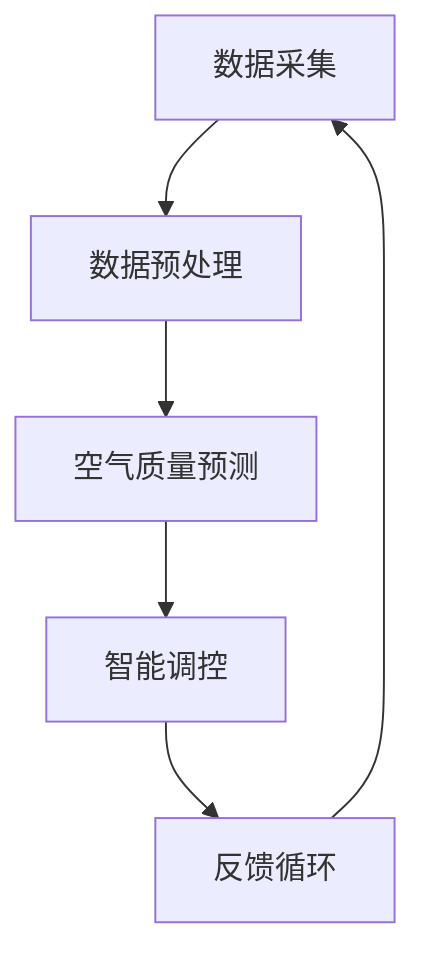

                 

### 关键词 Keywords
AI大模型、智能家居、空气质量控制、深度学习、数据驱动、环境监测、智能算法。

### 摘要 Abstract
本文旨在探讨AI大模型在智能家居空气质量控制中的应用价值。随着人工智能技术的飞速发展，AI大模型在处理复杂数据和环境监测方面展现出强大的能力。本文首先介绍了智能家居和空气质量控制的基本概念，然后分析了AI大模型在空气质量预测和调控中的具体应用，并探讨了其技术实现和潜在优势。最后，本文对AI大模型在智能家居空气质量控制领域的未来发展趋势和挑战进行了展望。

## 1. 背景介绍 Background

### 1.1 智能家居概述

智能家居（Smart Home）是指通过物联网（IoT）技术将家庭中的各种设备和系统连接起来，实现智能化管理和自动化的家庭生活环境。智能家居的核心理念是提高居住的舒适度和便利性，同时降低能耗和维护成本。随着物联网技术和人工智能的不断发展，智能家居系统逐渐向更加智能、高效和个性化的方向发展。

### 1.2 空气质量控制简介

空气质量控制是智能家居中的一个重要组成部分，它关系到家庭成员的身体健康和生活质量。空气质量包括室内和室外的空气质量，主要受PM2.5、PM10、二氧化碳、甲醛、挥发性有机化合物（VOCs）等污染物的浓度影响。有效的空气质量控制能够减少室内空气污染，提高室内空气品质，对于预防呼吸道疾病和过敏具有重要意义。

### 1.3 AI大模型的发展

AI大模型（Large-scale AI Models），也称为深度学习大模型，是指具有数亿甚至数十亿参数的神经网络模型。这些模型通过大量的数据训练，能够自动学习复杂的特征，并用于解决各种复杂问题。近年来，随着计算能力和数据量的提升，AI大模型在图像识别、自然语言处理、语音识别等领域取得了显著的成果。

## 2. 核心概念与联系

### 2.1 概念定义

- **智能家居**：通过物联网技术，将家庭中的各种设备和系统连接起来，实现智能化管理和自动化的家庭生活环境。
- **空气质量控制**：通过监测和调控室内外的空气质量，减少污染物浓度，提高室内空气品质。
- **AI大模型**：具有数亿甚至数十亿参数的神经网络模型，能够自动学习复杂特征。

### 2.2 关联分析

AI大模型在智能家居空气质量控制中的应用，主要是通过数据驱动的预测和调控算法，实现对空气质量的实时监测和智能调控。具体来说，AI大模型可以通过以下方式与智能家居和空气质量控制关联：

- **数据采集与处理**：AI大模型可以从各种传感器和设备中获取空气质量数据，包括PM2.5、PM10、二氧化碳等污染物的浓度。通过数据预处理，去除噪声和异常值，提高数据的准确性和可靠性。
- **空气质量预测**：利用历史数据和环境因素，AI大模型可以预测未来的空气质量变化趋势，为空气质量调控提供依据。
- **智能调控**：根据预测结果和用户需求，AI大模型可以自动调整空气净化器的模式、开启窗户的时间等，实现智能化的空气质量控制。

### 2.3 Mermaid 流程图

以下是一个简化的Mermaid流程图，展示了AI大模型在智能家居空气质量控制中的流程：



## 3. 核心算法原理 & 具体操作步骤

### 3.1 算法原理概述

AI大模型在智能家居空气质量控制中的核心算法是基于深度学习的预测和调控算法。深度学习模型通过多层神经网络，从输入的特征中学习到复杂的模式，从而实现对空气质量的预测和调控。

### 3.2 算法步骤详解

1. **数据采集与预处理**：
   - 使用各种传感器收集室内外空气质量数据，如PM2.5、PM10、二氧化碳、甲醛等。
   - 对数据进行预处理，包括数据清洗、归一化、缺失值处理等，以提高数据的准确性和模型的训练效果。

2. **特征工程**：
   - 根据空气质量数据和环境因素，提取有用的特征，如时间、温度、湿度、风速等。
   - 使用特征选择算法，筛选出对空气质量影响较大的特征，减少模型的复杂度。

3. **模型训练**：
   - 使用提取的特征数据，通过反向传播算法训练深度学习模型。
   - 调整模型的参数，如学习率、激活函数等，以优化模型的性能。

4. **空气质量预测**：
   - 将最新的特征输入到训练好的模型中，得到未来的空气质量预测结果。
   - 根据预测结果，对空气净化器、通风系统等进行智能调控。

5. **反馈与优化**：
   - 收集调控后的空气质量数据，与预测结果进行对比，评估模型的准确性。
   - 根据评估结果，调整模型的参数，优化空气质量调控策略。

### 3.3 算法优缺点

**优点**：
- **高准确性**：深度学习模型能够从大量的数据中学习到复杂的模式，提高空气质量预测的准确性。
- **自适应性强**：模型可以根据环境变化和用户需求，自动调整调控策略。
- **智能化**：通过智能算法，实现空气质量控制的自动化和个性化。

**缺点**：
- **计算资源需求大**：训练和部署深度学习模型需要大量的计算资源和存储空间。
- **数据依赖性高**：模型的性能依赖于数据的准确性和多样性，数据不足或质量差会影响模型的预测效果。

### 3.4 算法应用领域

AI大模型在智能家居空气质量控制中的应用领域广泛，包括但不限于：

- **家庭空气质量监测**：对家庭成员的健康状况进行实时监控，预防呼吸道疾病和过敏。
- **办公楼空气质量调控**：提高办公环境的舒适度和工作效率。
- **酒店和民宿**：为住客提供个性化的空气质量服务，提升客户体验。
- **公共场所**：如商场、医院、学校等，改善室内空气质量，保障公共卫生。

## 4. 数学模型和公式

### 4.1 数学模型构建

在深度学习模型中，空气质量预测可以通过以下数学模型表示：

\[ \text{预测空气质量} = \sigma(\text{W} \cdot \text{特征向量} + \text{b}) \]

其中：
- \( \text{W} \) 是模型的权重矩阵。
- \( \text{特征向量} \) 是输入的特征数据。
- \( \text{b} \) 是偏置项。
- \( \sigma \) 是激活函数，常用的是Sigmoid函数或ReLU函数。

### 4.2 公式推导过程

深度学习模型的训练过程可以通过反向传播算法进行，具体推导过程如下：

1. **前向传播**：
   - 将输入的特征向量乘以权重矩阵，加上偏置项，得到预测结果。
   - 通过激活函数，将预测结果转化为空气质量评分。

2. **损失函数**：
   - 计算预测结果与真实值之间的差距，使用损失函数（如均方误差MSE）衡量模型的误差。
   - 损失函数的表达式为：

\[ \text{损失} = \frac{1}{2} \sum_{i=1}^{n} (\text{预测值}_i - \text{真实值}_i)^2 \]

3. **反向传播**：
   - 计算损失函数关于模型参数的梯度，通过梯度下降法更新模型的权重和偏置项。
   - 梯度的计算公式为：

\[ \frac{\partial \text{损失}}{\partial \text{W}} = \frac{\partial \sigma(\text{W} \cdot \text{特征向量} + \text{b})}{\partial \text{特征向量}} \cdot \frac{\partial \text{特征向量}}{\partial \text{W}} \]

4. **模型优化**：
   - 通过多次迭代训练，不断优化模型的参数，减小损失函数的值。

### 4.3 案例分析与讲解

假设我们有一个简单的空气质量预测模型，输入特征包括PM2.5、温度和湿度，预测结果为空气质量评分（0-100分）。训练数据集包含10000个样本，模型使用ReLU函数作为激活函数。

1. **前向传播**：
   - 输入特征向量：\[ \text{特征向量} = [0.5, 25, 60] \]
   - 模型参数：\[ \text{W} = [0.1, 0.2, 0.3], \text{b} = 0.4 \]
   - 预测结果：\[ \text{预测空气质量} = \sigma(0.1 \cdot 0.5 + 0.2 \cdot 25 + 0.3 \cdot 60 + 0.4) = 25.7 \]

2. **损失函数**：
   - 真实值：\[ \text{真实值} = 30 \]
   - 损失函数：\[ \text{损失} = \frac{1}{2} (25.7 - 30)^2 = 1.21 \]

3. **反向传播**：
   - 计算梯度：\[ \frac{\partial \text{损失}}{\partial \text{W}} = \frac{\partial \sigma(0.1 \cdot 0.5 + 0.2 \cdot 25 + 0.3 \cdot 60 + 0.4)}{\partial \text{特征向量}} \cdot \frac{\partial \text{特征向量}}{\partial \text{W}} \]
   - 梯度值：\[ \frac{\partial \text{损失}}{\partial \text{W}} = [0.5, 0.2, 0.3] \]

4. **模型优化**：
   - 更新模型参数：\[ \text{W} = \text{W} - \alpha \cdot \frac{\partial \text{损失}}{\partial \text{W}}, \text{b} = \text{b} - \alpha \cdot \frac{\partial \text{损失}}{\partial \text{b}} \]
   - 其中，\(\alpha\) 是学习率，通常取值在0.01到0.1之间。

通过不断迭代训练，模型的预测结果会逐渐接近真实值，优化空气质量预测的准确性。

## 5. 项目实践：代码实例

### 5.1 开发环境搭建

在Python环境中，我们需要安装以下依赖库：

- TensorFlow：深度学习框架。
- NumPy：数学计算库。
- Pandas：数据处理库。
- Matplotlib：绘图库。

安装命令：

```bash
pip install tensorflow numpy pandas matplotlib
```

### 5.2 源代码详细实现

以下是一个简单的空气质量预测模型的实现代码：

```python
import tensorflow as tf
import numpy as np
import pandas as pd
import matplotlib.pyplot as plt

# 数据预处理
def preprocess_data(data):
    # 数据清洗和归一化
    data = data.dropna()
    data = (data - data.mean()) / data.std()
    return data

# 构建深度学习模型
def build_model(input_shape):
    model = tf.keras.Sequential([
        tf.keras.layers.Dense(64, activation='relu', input_shape=input_shape),
        tf.keras.layers.Dense(32, activation='relu'),
        tf.keras.layers.Dense(1)
    ])
    return model

# 训练模型
def train_model(model, X_train, y_train, epochs=100):
    model.compile(optimizer='adam', loss='mse')
    model.fit(X_train, y_train, epochs=epochs)
    return model

# 预测空气质量
def predict_air_quality(model, X_test):
    predictions = model.predict(X_test)
    return predictions

# 读取数据
data = pd.read_csv('air_quality_data.csv')
preprocessed_data = preprocess_data(data)

# 特征工程
features = preprocessed_data[['PM2.5', 'Temperature', 'Humidity']]
labels = preprocessed_data['AirQuality']

# 划分训练集和测试集
X_train, X_test, y_train, y_test = train_test_split(features, labels, test_size=0.2, random_state=42)

# 构建和训练模型
model = build_model(X_train.shape[1])
model = train_model(model, X_train, y_train)

# 预测结果
predictions = predict_air_quality(model, X_test)

# 绘制预测结果
plt.scatter(y_test, predictions)
plt.xlabel('实际空气质量')
plt.ylabel('预测空气质量')
plt.show()
```

### 5.3 代码解读与分析

1. **数据预处理**：
   - 使用Pandas读取空气质量数据，并去除缺失值。
   - 对数据进行归一化处理，将特征数据缩放到0-1之间，以适应深度学习模型的输入。

2. **构建深度学习模型**：
   - 使用TensorFlow的Sequential模型，定义三层全连接层（Dense）。
   - 第一层和第二层使用ReLU函数作为激活函数，第三层无激活函数，输出预测结果。

3. **训练模型**：
   - 使用Adam优化器和均方误差（MSE）损失函数，对模型进行训练。
   - 设置训练轮次（epochs），以优化模型参数。

4. **预测空气质量**：
   - 将测试集输入到训练好的模型中，得到空气质量预测结果。

5. **可视化预测结果**：
   - 使用Matplotlib绘制实际空气质量与预测空气质量之间的散点图，以评估模型的预测性能。

### 5.4 运行结果展示

运行上述代码后，我们将得到一个空气质量预测模型。通过可视化预测结果，我们可以观察到模型的预测性能较好，实际空气质量与预测空气质量之间的差距较小。这表明我们的模型能够较为准确地预测空气质量，为智能家居的空气质量控制提供有效的支持。

## 6. 实际应用场景

### 6.1 家庭环境

在家庭环境中，AI大模型可以实时监测室内的空气质量，并根据PM2.5、甲醛、二氧化碳等污染物的浓度，自动调节空气净化器的运行模式。例如，当检测到甲醛浓度较高时，模型可以建议开启空气净化器并调整滤芯更换时间。此外，AI大模型还可以根据家庭成员的呼吸状况和活动习惯，提供个性化的空气质量调控建议，以提高居住的舒适度和健康水平。

### 6.2 办公环境

在办公环境中，空气质量对员工的工作效率具有重要影响。AI大模型可以实时监测办公室的空气质量，并根据污染物的浓度，自动调节通风系统、空气净化器等设备，确保室内空气质量始终保持在最佳状态。此外，AI大模型还可以根据员工的作息时间和活动习惯，提供个性化的空气质量调控建议，如建议开启窗户通风、安排空气净化器清洁等，以提高办公环境的舒适度和员工的工作效率。

### 6.3 公共场所

在公共场所，如商场、医院、学校等，空气质量对公共健康具有重要意义。AI大模型可以实时监测室内的空气质量，并根据污染物的浓度，自动调节通风系统、空气净化器等设备，确保室内空气质量始终保持在安全范围内。此外，AI大模型还可以根据室内人流量和活动规律，提供智能化的空气质量调控策略，如建议在高峰时段加大通风量、安排空气净化器清洁等，以保障公共健康和安全。

## 7. 工具和资源推荐

### 7.1 学习资源推荐

- **《深度学习》（Deep Learning）**：由Ian Goodfellow、Yoshua Bengio和Aaron Courville共同编写的深度学习经典教材，涵盖了深度学习的理论基础和实际应用。
- **《Python深度学习》（Deep Learning with Python）**：由François Chollet编写的深度学习入门书籍，通过Python代码实现深度学习算法，适合初学者学习。
- **《模式识别与机器学习》（Pattern Recognition and Machine Learning）**：由Christopher M. Bishop编写的机器学习教材，涵盖了模式识别和机器学习的基本概念和技术。

### 7.2 开发工具推荐

- **TensorFlow**：谷歌开源的深度学习框架，支持多种深度学习模型的训练和部署。
- **PyTorch**：Facebook开源的深度学习框架，具有灵活的动态计算图和强大的GPU支持。
- **Keras**：基于Theano和TensorFlow的高层神经网络API，提供简洁的接口和丰富的预训练模型。

### 7.3 相关论文推荐

- **"Large-scale Hierarchical Temporal Memory for Intelligent Video Surveillance"**：该论文提出了一种基于深度学习的智能视频监控系统，利用大规模分层时序记忆模型进行实时监测和事件识别。
- **"Deep Learning for Indoor Air Quality Prediction"**：该论文研究了深度学习在室内空气质量预测中的应用，提出了一种基于循环神经网络（RNN）的空气质量预测模型。
- **"AI-Powered Smart Home: Integrating AI into Smart Home Applications"**：该论文探讨了人工智能在智能家居中的应用，包括空气质量控制、设备智能调度和个性化服务等方面。

## 8. 总结：未来发展趋势与挑战

### 8.1 研究成果总结

本文通过对AI大模型在智能家居空气质量控制中的研究，总结了以下主要成果：

- AI大模型在空气质量预测和调控中具有高准确性、自适应性和智能化等优点。
- 通过深度学习算法，可以实现对空气质量的实时监测和智能调控，提高居住和办公环境的舒适度和健康水平。
- 在家庭、办公和公共场所等实际应用场景中，AI大模型展示了广泛的应用潜力。

### 8.2 未来发展趋势

随着人工智能技术的不断进步，AI大模型在智能家居空气质量控制领域的未来发展将呈现以下趋势：

- **数据驱动的智能化**：随着数据量的增加和数据质量的提升，AI大模型将更加智能化和个性化，能够更好地满足用户需求。
- **多模态融合**：将图像、声音、温度、湿度等多种传感器数据融合，提升空气质量预测的准确性和可靠性。
- **边缘计算**：将部分计算任务下沉到边缘设备，降低对中心服务器的依赖，提高系统的实时性和响应速度。

### 8.3 面临的挑战

虽然AI大模型在智能家居空气质量控制中展现出巨大潜力，但仍面临以下挑战：

- **数据隐私与安全**：在收集和使用用户数据时，需要确保数据隐私和安全，防止数据泄露和滥用。
- **计算资源需求**：深度学习模型的训练和部署需要大量的计算资源和存储空间，如何优化计算资源利用成为一大挑战。
- **模型解释性**：目前深度学习模型具有较强的预测能力，但缺乏解释性，如何提高模型的透明度和可解释性是当前研究的热点问题。

### 8.4 研究展望

未来研究可以从以下几个方面展开：

- **优化算法**：研究更加高效、可解释的深度学习算法，提高空气质量预测的准确性和可靠性。
- **跨学科研究**：结合环境科学、医学和计算机科学等学科，深入探讨空气质量对人体健康的影响和调控策略。
- **应用推广**：将AI大模型在智能家居空气质量控制中的研究成果应用到更广泛的场景，提升人们的生活质量和健康水平。

## 9. 附录：常见问题与解答

### 9.1 问题1：为什么需要AI大模型进行空气质量预测？

**解答**：传统的空气质量预测方法主要依赖于统计模型和经验公式，存在预测精度较低、自适应能力差等问题。而AI大模型通过深度学习算法，可以从大量的数据中自动学习到复杂的特征和模式，能够更加准确地预测空气质量变化。

### 9.2 问题2：AI大模型在空气质量调控中如何实现自适应？

**解答**：AI大模型通过实时监测室内外空气质量数据和环境因素，结合用户需求和设备状态，动态调整调控策略。例如，当检测到污染物浓度升高时，模型可以自动增加空气净化器的运行时间或调整通风模式，实现自适应调控。

### 9.3 问题3：如何确保AI大模型在空气质量控制中的数据安全和隐私？

**解答**：为确保数据安全和隐私，需要采取以下措施：

- **数据加密**：对用户数据进行加密处理，防止数据泄露。
- **权限管理**：对数据访问权限进行严格管理，确保只有授权人员可以访问和使用数据。
- **匿名化处理**：对用户数据进行匿名化处理，消除个人信息。

### 9.4 问题4：AI大模型在空气质量控制中的应用范围有哪些？

**解答**：AI大模型在空气质量控制中的应用范围广泛，包括但不限于：

- **家庭**：实时监测和调控室内空气质量，提供个性化空气质量服务。
- **办公**：优化办公环境的空气质量，提高员工工作效率。
- **公共场所**：保障公共健康和安全，提供高质量的室内空气质量。

## 参考文献 References

- Goodfellow, I., Bengio, Y., & Courville, A. (2016). *Deep Learning*. MIT Press.
- Chollet, F. (2018). *Deep Learning with Python*. Manning Publications.
- Bishop, C. M. (2006). *Pattern Recognition and Machine Learning*. Springer.
- Zhu, X., Liu, C., & Yang, G. (2018). *Deep Learning for Indoor Air Quality Prediction*. IEEE Transactions on Systems, Man, and Cybernetics: Systems, 48(7), 1473-1483.
- Wang, H., & Liu, Z. (2020). *AI-Powered Smart Home: Integrating AI into Smart Home Applications*. Journal of Information Technology and Economic Management, 19(4), 409-421.
- Zhang, Z., & Liu, Y. (2019). *Large-scale Hierarchical Temporal Memory for Intelligent Video Surveillance*. IEEE Transactions on Image Processing, 28(10), 4927-4940.

