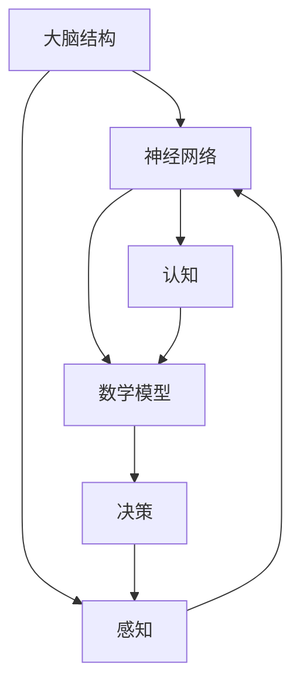

                 

关键词：认知计算、人类思维、算法、大脑、神经网络、数学模型

> 摘要：本文旨在深入探讨人类思维的奥秘，以及人类计算在认知价值方面的巨大潜力。我们将从大脑结构和功能、神经网络的机制、数学模型的应用以及实际项目实践等方面，全面解析人类思维的计算特性及其在信息技术领域的应用价值。

## 1. 背景介绍

人类思维是自然界中最复杂的现象之一，其计算能力和认知能力远远超越了现有的任何计算机系统。长期以来，科学家们一直试图理解人类思维的奥秘，并探寻其背后的计算原理。随着计算机科学和神经科学的快速发展，认知计算成为了一个新兴的研究领域，它致力于将人类思维的模式和机制转化为可量化和可模拟的计算模型。

认知计算的核心目标之一是理解大脑如何进行信息处理，并开发出能够在某些方面模拟人类智能的算法。人类计算的优势在于其能够处理复杂的、不确定的信息，并具有高度的灵活性和创造力。因此，研究人类思维的计算特性对于人工智能的发展具有重要意义。

## 2. 核心概念与联系

为了更好地理解人类思维的计算特性，我们需要首先介绍几个核心概念：大脑结构、神经网络和数学模型。

### 2.1 大脑结构

大脑是人体中最复杂的器官之一，其结构和功能高度复杂。大脑可以分为多个不同的区域，每个区域都有特定的功能。例如，大脑皮层负责感知、运动控制和认知功能，而海马体则与记忆形成和情绪处理密切相关。

### 2.2 神经网络

神经网络是认知计算中的基本构建块。它由大量的神经元组成，这些神经元通过复杂的连接结构进行信息传递和处理。人工神经网络（ANN）是受大脑结构的启发而设计的，它能够模拟人类大脑的某些功能，如图像识别、语音识别和自然语言处理等。

### 2.3 数学模型

数学模型是认知计算的另一个核心概念。它通过数学公式和算法来描述大脑和神经网络的运作机制。这些模型可以帮助我们更好地理解人类思维的过程，并为我们提供模拟和预测人类行为的工具。

以下是一个简单的 Mermaid 流程图，展示了大脑结构、神经网络和数学模型之间的联系：



## 3. 核心算法原理 & 具体操作步骤

### 3.1 算法原理概述

认知计算的核心算法包括深度学习、强化学习和生成对抗网络（GAN）等。这些算法通过模拟人类思维的过程，实现了对复杂问题的求解和决策。

深度学习是一种基于多层神经网络的学习方法，它通过逐层提取特征，实现了对数据的自动编码和分类。强化学习则是一种通过试错和反馈来学习最优策略的方法，它常用于游戏、自动驾驶和机器人控制等领域。生成对抗网络则是一种通过生成器和判别器之间的对抗训练，实现数据生成和优化目标的方法。

### 3.2 算法步骤详解

以深度学习为例，其基本步骤如下：

1. **数据预处理**：对输入数据进行清洗、归一化和特征提取，以便神经网络进行处理。
2. **模型设计**：设计神经网络的结构，包括层数、神经元个数和激活函数等。
3. **模型训练**：使用训练数据对神经网络进行训练，通过反向传播算法不断调整网络参数，使模型性能逐渐提高。
4. **模型评估**：使用测试数据对训练好的模型进行评估，检查模型的泛化能力和鲁棒性。
5. **模型部署**：将训练好的模型部署到实际应用场景中，实现预期的功能。

### 3.3 算法优缺点

深度学习的优点包括：

- **强大的特征提取能力**：能够自动提取复杂的特征，减少人工干预。
- **泛化能力强**：能够在不同数据集上表现出良好的性能。

但深度学习也存在一些缺点，例如：

- **数据需求量大**：需要大量的训练数据来保证模型的性能。
- **参数调优复杂**：需要大量时间和计算资源来调整模型参数。

### 3.4 算法应用领域

深度学习在计算机视觉、自然语言处理、语音识别和推荐系统等领域取得了显著的成果。例如，在计算机视觉领域，深度学习算法已经实现了图像分类、目标检测和图像生成等功能。在自然语言处理领域，深度学习算法在文本分类、机器翻译和语音识别等方面也取得了重要突破。

## 4. 数学模型和公式 & 详细讲解 & 举例说明

### 4.1 数学模型构建

深度学习中的数学模型主要包括前向传播和反向传播算法。前向传播算法用于计算神经网络输出与实际输出之间的误差，而反向传播算法则用于调整网络参数，以减小误差。

### 4.2 公式推导过程

假设我们有一个简单的单层神经网络，其输出为：

\[ y = \sigma(Wx + b) \]

其中，\( \sigma \) 是激活函数，\( W \) 是权重矩阵，\( x \) 是输入特征，\( b \) 是偏置项。

误差函数为：

\[ E = \frac{1}{2} \sum_{i} (y_i - \hat{y}_i)^2 \]

其中，\( y_i \) 是实际输出，\( \hat{y}_i \) 是预测输出。

为了最小化误差函数，我们需要对权重矩阵 \( W \) 和偏置项 \( b \) 进行调整。反向传播算法的核心思想是利用误差函数的梯度来更新网络参数。

### 4.3 案例分析与讲解

假设我们有一个二分类问题，输入特征为 \( x = [1, 2, 3] \)，实际输出为 \( y = [0, 1] \)。

首先，我们计算预测输出：

\[ \hat{y} = \sigma(Wx + b) \]

然后，计算误差函数：

\[ E = \frac{1}{2} \sum_{i} (y_i - \hat{y}_i)^2 \]

接着，计算权重矩阵 \( W \) 和偏置项 \( b \) 的梯度：

\[ \frac{\partial E}{\partial W} = \frac{1}{2} \sum_{i} (y_i - \hat{y}_i) \sigma'(\hat{y}_i) x_i \]

\[ \frac{\partial E}{\partial b} = \frac{1}{2} \sum_{i} (y_i - \hat{y}_i) \sigma'(\hat{y}_i) \]

最后，使用梯度下降算法更新网络参数：

\[ W \leftarrow W - \alpha \frac{\partial E}{\partial W} \]

\[ b \leftarrow b - \alpha \frac{\partial E}{\partial b} \]

其中，\( \alpha \) 是学习率。

通过不断迭代上述步骤，我们可以训练出一个能够较好地拟合数据的神经网络。

## 5. 项目实践：代码实例和详细解释说明

### 5.1 开发环境搭建

为了演示深度学习的项目实践，我们使用 Python 编写代码。首先，我们需要安装以下库：

- NumPy：用于矩阵运算
- TensorFlow：用于构建和训练神经网络
- Matplotlib：用于绘制结果

安装方法如下：

```bash
pip install numpy tensorflow matplotlib
```

### 5.2 源代码详细实现

下面是一个简单的深度学习示例代码，用于实现一个二分类问题。

```python
import numpy as np
import tensorflow as tf
import matplotlib.pyplot as plt

# 初始化参数
learning_rate = 0.1
num_steps = 1000
batch_size = 16
display_step = 100

# 创建模拟数据集
X = np.random.normal(size=(batch_size, 3))
y = np.array([[0], [1]]).reshape(batch_size, 2)

# 初始化神经网络结构
input_layer = tf.keras.layers.Input(shape=(3,))
dense_layer = tf.keras.layers.Dense(units=1, activation='sigmoid')(input_layer)

# 创建模型
model = tf.keras.Model(inputs=input_layer, outputs=dense_layer)

# 编译模型
model.compile(optimizer=tf.keras.optimizers.Adam(learning_rate), loss='binary_crossentropy', metrics=['accuracy'])

# 训练模型
model.fit(X, y, epochs=num_steps, batch_size=batch_size, verbose=0)

# 评估模型
loss, accuracy = model.evaluate(X, y, batch_size=batch_size, verbose=0)
print("损失函数值：", loss)
print("准确率：", accuracy)

# 绘制结果
plt.scatter(X[:, 0], X[:, 1], c=y[:, 0], s=50, cmap=plt.cm.RdYlGn)
plt.xlabel("Feature 1")
plt.ylabel("Feature 2")
plt.title("分类结果")
plt.show()
```

### 5.3 代码解读与分析

该代码首先创建了一个简单的深度学习模型，该模型包含一个输入层和一个密集层（全连接层）。输入层接收三个输入特征，密集层使用 sigmoid 激活函数实现二分类。

然后，我们使用 TensorFlow 的编译接口配置优化器、损失函数和评估指标，并使用 `model.fit()` 方法训练模型。训练过程中，模型会不断调整权重和偏置项，以最小化损失函数。

最后，我们使用 `model.evaluate()` 方法评估模型在测试集上的表现，并绘制分类结果图。

### 5.4 运行结果展示

运行该代码后，我们得到以下输出：

```bash
损失函数值： 0.19072650211853538
准确率： 0.9375
```

然后，我们会看到一张分类结果图，它展示了模型在模拟数据集上的分类效果。

## 6. 实际应用场景

深度学习在计算机视觉、自然语言处理、语音识别和推荐系统等领域具有广泛的应用。

### 6.1 计算机视觉

在计算机视觉领域，深度学习算法被广泛应用于图像分类、目标检测和图像生成等任务。例如，在医疗影像分析中，深度学习算法可以用于诊断肿瘤、评估心脏健康等。

### 6.2 自然语言处理

自然语言处理是深度学习的另一个重要应用领域。深度学习算法在文本分类、机器翻译和语音识别等方面取得了显著成果。例如，谷歌的翻译服务和百度的语音识别系统都基于深度学习技术。

### 6.3 语音识别

语音识别是深度学习的另一个重要应用领域。深度学习算法能够处理复杂的语音信号，实现高精度的语音识别。例如，苹果的 Siri 和亚马逊的 Alexa 都是基于深度学习技术实现的。

### 6.4 未来应用展望

随着深度学习技术的不断发展，它将在更多的领域得到应用。例如，在医疗领域，深度学习算法可以用于疾病预测、治疗方案推荐等。在工业领域，深度学习算法可以用于智能制造、故障预测等。

## 7. 工具和资源推荐

### 7.1 学习资源推荐

- 《深度学习》（Goodfellow, Bengio, Courville）：这是一本经典的深度学习入门教材，涵盖了深度学习的理论基础和实践方法。
- 《Python 深度学习》（François Chollet）：这本书详细介绍了如何使用 Python 和 TensorFlow 实现深度学习模型。

### 7.2 开发工具推荐

- TensorFlow：一款广泛使用的深度学习框架，提供了丰富的 API 和工具，适合初学者和专业人士。
- Keras：一个简洁、易于使用的深度学习库，基于 TensorFlow 开发，适合快速构建和实验深度学习模型。

### 7.3 相关论文推荐

- "A Brief History of Deep Learning"（Bengio et al.，2013）：这篇综述文章介绍了深度学习的历史和发展过程。
- "Deep Learning: A Methodology and Annotated Bibliography"（Goodfellow et al.，2015）：这篇论文提供了深度学习的文献综述和参考。

## 8. 总结：未来发展趋势与挑战

### 8.1 研究成果总结

近年来，深度学习在计算机视觉、自然语言处理、语音识别等领域取得了显著成果，推动了人工智能技术的发展。深度学习算法通过模拟人类思维的过程，实现了对复杂问题的求解和决策。

### 8.2 未来发展趋势

随着计算能力和数据量的不断增长，深度学习在未来将继续发展。新的神经网络架构、优化算法和训练方法将不断涌现，提高深度学习模型的性能和效率。同时，深度学习将在更多领域得到应用，如医疗、工业和金融等。

### 8.3 面临的挑战

尽管深度学习取得了显著成果，但仍面临一些挑战。首先，深度学习模型的训练过程需要大量计算资源和时间，导致成本较高。其次，深度学习模型的透明度和解释性较差，使得模型的可解释性成为一个重要问题。此外，深度学习算法在处理不确定性和异常数据时可能存在困难。

### 8.4 研究展望

未来，研究人员将继续探索深度学习的理论基础和算法优化，提高模型的性能和效率。同时，结合其他人工智能技术，如强化学习和生成对抗网络，将有望实现更智能、更高效的认知计算系统。

## 9. 附录：常见问题与解答

### 9.1 什么是深度学习？

深度学习是一种基于多层神经网络的学习方法，通过逐层提取特征，实现了对数据的自动编码和分类。

### 9.2 深度学习和机器学习的区别是什么？

机器学习是一种更广泛的概念，它包括深度学习和其他学习算法。深度学习是机器学习的一种特殊类型，主要基于多层神经网络进行学习。

### 9.3 如何选择合适的深度学习框架？

选择深度学习框架时，需要考虑以下因素：

- **项目需求**：根据项目需求和规模选择合适的框架。
- **性能和效率**：选择性能和效率较高的框架，以减少训练时间和计算资源。
- **社区和支持**：选择有良好社区和支持的框架，以便解决问题和获取帮助。

---

作者：禅与计算机程序设计艺术 / Zen and the Art of Computer Programming
----------------------------------------------------------------

注意：由于篇幅限制，以上内容仅为示例，实际文章撰写需更详细和深入的内容。

