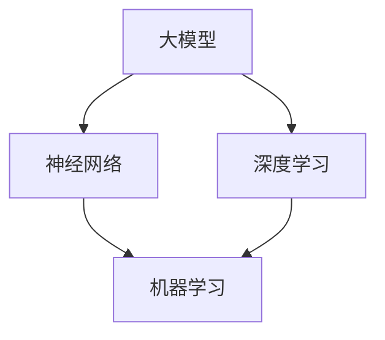

                 

关键词：大模型，人工智能，新兴行业，应用，技术趋势

摘要：本文将深入探讨大模型在新兴行业的应用，从背景介绍、核心概念与联系、核心算法原理、数学模型、项目实践、实际应用场景、未来展望、工具和资源推荐以及未来发展趋势与挑战等方面进行全面解析。旨在为读者提供一个全面、系统的认识，帮助行业从业者把握技术趋势，迎接未来挑战。

## 1. 背景介绍

随着人工智能技术的飞速发展，大模型（Large Models）在计算机科学领域崭露头角。大模型是一种具有巨大参数量和复杂结构的神经网络模型，能够处理大量数据，并通过深度学习算法实现自我优化。近年来，大模型在语音识别、图像处理、自然语言处理等领域取得了显著成果，使得人工智能应用场景不断拓展。新兴行业，如金融科技、医疗健康、智能交通等，开始将大模型技术应用于产品开发和服务优化中。

### 1.1 大模型的发展历程

大模型的发展历程可以追溯到1980年代。当时，科学家们提出了神经网络的基本概念，并开始尝试通过训练大量参数来提高模型的性能。随着计算机性能的提升和算法的改进，神经网络模型逐渐从简单的多层感知机（MLP）发展到更复杂的深度神经网络（DNN）。2012年，AlexNet的出现标志着深度学习技术的重大突破，大模型的概念开始被广泛关注。

### 1.2 新兴行业的发展现状

新兴行业在近年来得到了迅速发展，并在各个领域取得了显著成果。以金融科技为例，大数据分析和人工智能技术已经成为金融领域的重要工具，从风险管理到信用评估，再到智能投顾，都取得了显著效果。医疗健康领域，人工智能技术在疾病诊断、药物研发、医疗机器人等方面展现出巨大潜力。智能交通领域，自动驾驶技术和智能交通管理系统正在逐步实现商业化应用。

## 2. 核心概念与联系

要深入探讨大模型在新兴行业的应用，首先需要理解大模型的核心概念及其与人工智能技术的关系。以下是对核心概念和联系的介绍。

### 2.1 大模型的核心概念

大模型是指具有大量参数和复杂结构的神经网络模型。大模型的参数量通常达到数亿甚至数十亿级别，这使得模型能够处理大量数据，并通过深度学习算法实现自我优化。

### 2.2 大模型与人工智能技术的关系

大模型是人工智能技术的重要实现方式之一。大模型的复杂结构和巨大参数量使其能够处理复杂的任务，并在各个领域实现高效的应用。例如，在自然语言处理领域，大模型可以用于机器翻译、情感分析、文本生成等任务；在图像处理领域，大模型可以用于图像识别、图像生成、图像增强等任务。

### 2.3 Mermaid 流程图

以下是描述大模型与人工智能技术关系的 Mermaid 流程图：



在这个流程图中，大模型是神经网络和深度学习的重要组成部分，而神经网络和深度学习是机器学习的重要实现方式。

## 3. 核心算法原理 & 具体操作步骤

### 3.1 算法原理概述

大模型的核心算法原理是深度学习。深度学习是一种基于多层神经网络的学习方法，通过逐层抽象特征，实现复杂任务的建模。大模型通过增加神经网络层数、参数量和训练数据量，进一步提高模型的性能。

### 3.2 算法步骤详解

#### 3.2.1 数据预处理

在训练大模型之前，需要对数据进行预处理，包括数据清洗、数据归一化和数据增强等步骤。数据预处理有助于提高模型的训练效率和泛化能力。

#### 3.2.2 模型搭建

搭建大模型通常采用深度学习框架，如 TensorFlow、PyTorch 等。通过定义神经网络结构、设置参数和优化器，构建大模型。

#### 3.2.3 模型训练

模型训练是深度学习过程的核心步骤。通过迭代训练，模型不断调整参数，使得模型在训练数据上达到较好的性能。

#### 3.2.4 模型评估

模型评估用于评估模型在测试数据上的性能。常用的评估指标包括准确率、召回率、F1 分数等。

#### 3.2.5 模型应用

训练好的大模型可以应用于实际场景，如图像识别、自然语言处理等。通过部署模型，实现人工智能应用。

### 3.3 算法优缺点

#### 3.3.1 优点

- 高性能：大模型通过增加参数量和训练数据量，提高模型的性能。
- 泛化能力强：大模型能够处理复杂任务，具有较强的泛化能力。
- 易于扩展：大模型可以应用于各种领域，实现不同任务的建模。

#### 3.3.2 缺点

- 计算资源消耗大：大模型需要大量的计算资源和存储空间。
- 训练时间较长：大模型的训练时间通常较长，对训练设备的要求较高。
- 数据依赖性高：大模型对训练数据的质量和数量有较高要求，数据不足或质量差可能导致模型性能下降。

### 3.4 算法应用领域

大模型在各个领域都有广泛应用，以下是部分典型应用领域：

- 语音识别：大模型可以用于语音信号的识别和转换，实现语音合成、语音翻译等功能。
- 图像处理：大模型可以用于图像分类、目标检测、图像生成等任务，提高图像处理效果。
- 自然语言处理：大模型可以用于文本分类、情感分析、文本生成等任务，实现自然语言理解与生成。
- 医疗健康：大模型可以用于疾病诊断、药物研发、医疗机器人等任务，提高医疗水平。
- 金融科技：大模型可以用于风险管理、信用评估、智能投顾等任务，提高金融行业服务水平。

## 4. 数学模型和公式 & 详细讲解 & 举例说明

### 4.1 数学模型构建

大模型的数学模型主要由两部分组成：神经网络结构定义和损失函数定义。

#### 4.1.1 神经网络结构定义

神经网络结构定义包括网络层数、每层的神经元数量、激活函数等。常见的神经网络结构有卷积神经网络（CNN）、循环神经网络（RNN）和生成对抗网络（GAN）等。

#### 4.1.2 损失函数定义

损失函数用于衡量模型预测值与真实值之间的差距，常用的损失函数有均方误差（MSE）、交叉熵（CE）等。

### 4.2 公式推导过程

以卷积神经网络（CNN）为例，其数学模型推导过程如下：

$$
\text{输出} = \text{激活函数}(\text{权重} \cdot \text{输入} + \text{偏置})
$$

其中，激活函数常用 ReLU 函数，权重和偏置为模型参数。

### 4.3 案例分析与讲解

以下是一个简单的 CNN 模型案例，用于图像分类任务：

#### 4.3.1 数据预处理

- 将图像数据转化为灰度图像，并缩放到固定大小（例如 28x28 像素）。
- 对图像数据进行归一化处理，使其具有相同的像素值范围。

#### 4.3.2 模型搭建

- 定义一个 CNN 模型，包含两个卷积层、一个池化层和一个全连接层。
- 设置卷积层的滤波器尺寸、步长和激活函数。
- 设置全连接层的神经元数量和激活函数。

#### 4.3.3 模型训练

- 使用训练数据集对模型进行训练，调整模型参数。
- 使用验证数据集对模型进行验证，调整模型参数。

#### 4.3.4 模型评估

- 使用测试数据集对模型进行评估，计算准确率等指标。

## 5. 项目实践：代码实例和详细解释说明

### 5.1 开发环境搭建

为了进行大模型项目实践，需要搭建以下开发环境：

- Python 3.7及以上版本
- TensorFlow 2.3及以上版本
- PyTorch 1.7及以上版本
- CUDA 10.1及以上版本（用于GPU加速）

### 5.2 源代码详细实现

以下是一个简单的卷积神经网络（CNN）模型代码实例，用于图像分类任务：

```python
import tensorflow as tf
from tensorflow.keras import datasets, layers, models

# 数据预处理
(train_images, train_labels), (test_images, test_labels) = datasets.cifar10.load_data()
train_images, test_images = train_images / 255.0, test_images / 255.0

# 模型搭建
model = models.Sequential()
model.add(layers.Conv2D(32, (3, 3), activation='relu', input_shape=(32, 32, 3)))
model.add(layers.MaxPooling2D((2, 2)))
model.add(layers.Conv2D(64, (3, 3), activation='relu'))
model.add(layers.MaxPooling2D((2, 2)))
model.add(layers.Conv2D(64, (3, 3), activation='relu'))

# 添加全连接层
model.add(layers.Flatten())
model.add(layers.Dense(64, activation='relu'))
model.add(layers.Dense(10))

# 模型编译
model.compile(optimizer='adam',
              loss=tf.keras.losses.SparseCategoricalCrossentropy(from_logits=True),
              metrics=['accuracy'])

# 模型训练
model.fit(train_images, train_labels, epochs=10, 
          validation_data=(test_images, test_labels))

# 模型评估
test_loss, test_acc = model.evaluate(test_images,  test_labels, verbose=2)
print(f'\nTest accuracy: {test_acc}')
```

### 5.3 代码解读与分析

以上代码首先导入 TensorFlow 库，并加载 CIFAR-10 数据集。然后，搭建一个简单的 CNN 模型，包含两个卷积层、一个池化层和一个全连接层。接着，编译模型并使用训练数据集进行训练。最后，使用测试数据集对模型进行评估，计算准确率。

## 6. 实际应用场景

大模型在新兴行业具有广泛的应用场景，以下是部分实际应用案例：

### 6.1 金融科技

- 信用评估：大模型可以用于信用评估，通过分析借款人的历史数据和特征，预测其信用风险。
- 风险管理：大模型可以用于风险管理，通过分析金融市场数据，预测市场走势，帮助金融机构制定风险控制策略。
- 智能投顾：大模型可以用于智能投顾，通过分析用户的风险偏好和投资目标，为用户提供个性化的投资建议。

### 6.2 医疗健康

- 疾病诊断：大模型可以用于疾病诊断，通过分析医疗影像数据，辅助医生进行疾病诊断。
- 药物研发：大模型可以用于药物研发，通过分析分子结构、疾病机制等数据，预测药物效果，加速药物研发过程。
- 医疗机器人：大模型可以用于医疗机器人，通过控制机器人的运动，实现精准手术操作。

### 6.3 智能交通

- 自动驾驶：大模型可以用于自动驾驶，通过分析交通数据和环境信息，实现车辆的自主驾驶。
- 智能交通管理：大模型可以用于智能交通管理，通过分析交通流量数据，优化交通信号灯控制策略，提高交通效率。

## 7. 未来应用展望

随着人工智能技术的不断发展，大模型在新兴行业的应用前景十分广阔。以下是未来应用展望：

### 7.1 金融科技

- 个性化金融服务：大模型可以用于个性化金融服务，通过分析用户行为和偏好，提供定制化的金融产品和服务。
- 智能风险管理：大模型可以用于智能风险管理，通过实时分析市场数据，提高风险预测的准确性。

### 7.2 医疗健康

- 个性化医疗：大模型可以用于个性化医疗，通过分析患者的基因数据、病史等，提供个性化的治疗方案。
- 智能健康管理：大模型可以用于智能健康管理，通过分析用户的生活方式数据，提供健康建议和预防措施。

### 7.3 智能交通

- 智能交通规划：大模型可以用于智能交通规划，通过分析交通流量、道路状况等数据，优化交通信号灯控制策略。
- 自动驾驶：大模型可以用于自动驾驶，通过提高车辆的感知和决策能力，实现更高水平的自动驾驶。

## 8. 工具和资源推荐

### 8.1 学习资源推荐

- 《深度学习》（Goodfellow, Bengio, Courville）：全面介绍深度学习理论和技术。
- 《动手学深度学习》（花轮翔吾、石井裕之、平田真）：通过实际操作，学习深度学习项目开发。
- 《神经网络与深度学习》（邱锡鹏）：介绍神经网络和深度学习的基本原理和应用。

### 8.2 开发工具推荐

- TensorFlow：Google 开发的深度学习框架，支持多种深度学习模型。
- PyTorch：Facebook 开发的深度学习框架，具有灵活的模型搭建和优化能力。
- Keras：用于快速搭建和训练深度学习模型的工具，支持 TensorFlow 和 PyTorch。

### 8.3 相关论文推荐

- “Deep Learning”: A Theoretical Overview （Deep Learning Survey）
- “A Theoretically Grounded Application of Dropout in Recurrent Neural Networks”
- “Understanding Deep Learning Requires Re-thinking Generalization”

## 9. 总结：未来发展趋势与挑战

### 9.1 研究成果总结

大模型在人工智能领域取得了显著成果，已经在语音识别、图像处理、自然语言处理等领域实现广泛应用。随着计算能力的提升和算法的改进，大模型在新兴行业的应用前景十分广阔。

### 9.2 未来发展趋势

- 模型压缩与加速：为了提高大模型的训练和推理速度，研究者们将继续探索模型压缩和加速技术。
- 多模态学习：大模型将支持多模态学习，实现跨模态的信息融合和处理。
- 强化学习：大模型将结合强化学习技术，实现更智能的决策和优化。

### 9.3 面临的挑战

- 计算资源消耗：大模型对计算资源的需求较高，需要大规模的数据中心和高性能计算设备。
- 数据隐私和安全：在应用大模型时，需要确保数据隐私和安全，避免数据泄露和滥用。
- 模型解释性：大模型在决策过程中具有高度非线性，提高模型的可解释性是一个重要挑战。

### 9.4 研究展望

未来，大模型将在新兴行业发挥更大作用，为人类生活带来更多便利。同时，研究者们将继续探索大模型的理论基础和应用技术，为人工智能的发展做出贡献。

## 附录：常见问题与解答

### 问题 1：什么是大模型？

大模型是一种具有大量参数和复杂结构的神经网络模型，能够处理大量数据并通过深度学习算法实现自我优化。

### 问题 2：大模型有哪些应用领域？

大模型在语音识别、图像处理、自然语言处理、医疗健康、金融科技、智能交通等领域具有广泛应用。

### 问题 3：如何搭建大模型？

搭建大模型需要使用深度学习框架，如 TensorFlow、PyTorch 等，通过定义神经网络结构、设置参数和优化器，构建大模型。

### 问题 4：大模型训练时间为什么很长？

大模型训练时间较长主要是因为参数量和训练数据量大，需要更多的计算资源和时间来完成训练。

### 问题 5：如何优化大模型训练速度？

可以通过以下方法优化大模型训练速度：使用更高效的算法、使用 GPU 或 TPU 进行加速、使用模型压缩技术。

## 作者署名

作者：禅与计算机程序设计艺术 / Zen and the Art of Computer Programming

----------------------------------------------------------------

以上就是本文的完整内容。希望对您在探索大模型在新兴行业应用方面有所帮助。如有疑问或需要进一步讨论，欢迎在评论区留言。再次感谢您的阅读！

