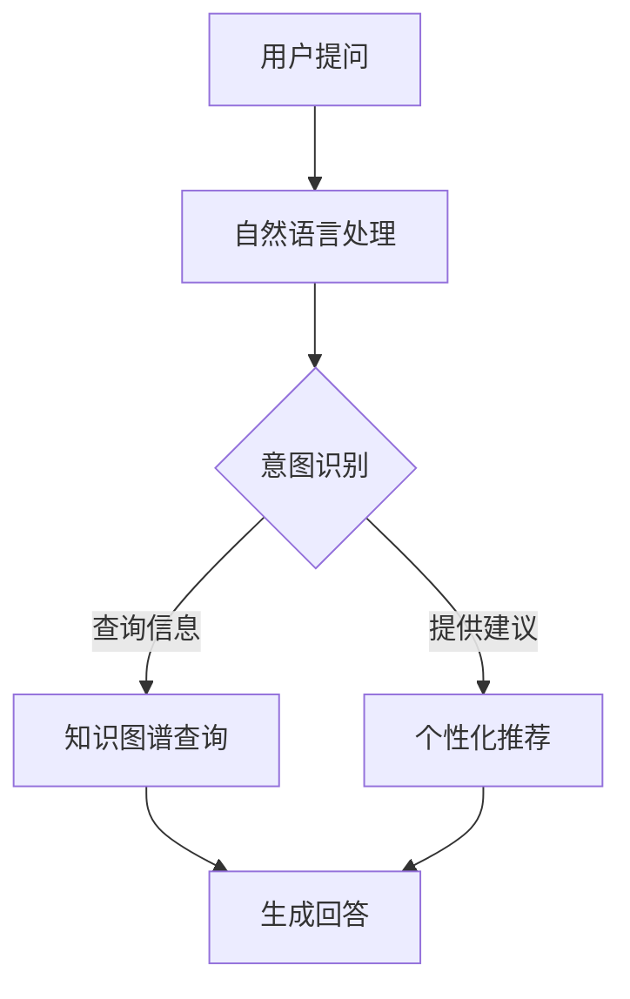

                 

关键词：大模型，电商，智能客服，系统架构，算法原理，数学模型，实践案例，未来展望

> 摘要：本文深入探讨了基于大模型的电商智能客服系统，从背景介绍、核心概念与联系、核心算法原理、数学模型构建、项目实践等多个维度，全面解析了该系统的设计与实现。本文旨在为从事相关领域的技术人员提供有价值的参考，并展望其未来发展方向与挑战。

## 1. 背景介绍

随着互联网技术的飞速发展，电子商务行业迎来了爆发式增长。电商平台的规模不断扩大，用户数量和交易量日益增加，传统的人工客服模式已经难以满足日益增长的服务需求。同时，用户对客服服务质量的要求也在不断提升。为了应对这些挑战，电商行业开始探索智能化客服解决方案，其中大模型驱动的智能客服系统成为了一个重要方向。

大模型驱动的智能客服系统利用深度学习和自然语言处理等技术，通过海量数据训练得到的高性能模型，能够实现自然语言理解、意图识别、知识图谱构建、个性化推荐等功能。相比于传统客服系统，大模型驱动的智能客服系统在响应速度、准确性和用户体验方面具有显著优势，能够大幅提升客服效率和服务质量。

本文将围绕大模型驱动的电商智能客服系统，从核心概念与联系、算法原理、数学模型构建、项目实践等多个方面展开讨论，旨在为电商行业提供一种有效的智能客服解决方案，并探讨其未来发展方向和面临的挑战。

## 2. 核心概念与联系

在探讨大模型驱动的电商智能客服系统之前，我们需要先了解其中的核心概念和它们之间的联系。以下是本文中涉及的主要核心概念及其简要说明：

### 2.1 大模型

大模型是指具有海量参数和广泛知识储备的深度学习模型。这些模型通常通过大规模数据集进行训练，具有强大的特征提取和表达能力。在电商智能客服系统中，大模型主要用于自然语言处理、意图识别和知识图谱构建等任务。

### 2.2 自然语言处理（NLP）

自然语言处理是一种使计算机能够理解和处理人类自然语言的技术。在电商智能客服系统中，NLP技术被用于解析用户提问、生成回答、理解用户意图等任务。常见的NLP技术包括词向量、序列模型、注意力机制等。

### 2.3 意图识别

意图识别是自然语言处理中的一个重要任务，旨在确定用户提问的目的。在电商智能客服系统中，意图识别用于判断用户请求的具体类型，如查询商品信息、咨询售后服务等。常见的意图识别方法包括基于规则的、基于机器学习的和基于深度学习的。

### 2.4 知识图谱

知识图谱是一种用于表示实体及其相互关系的图形化数据结构。在电商智能客服系统中，知识图谱用于存储商品信息、用户行为数据等，为智能客服提供丰富的知识来源。常见的知识图谱构建方法包括基于规则的方法和基于机器学习的方法。

### 2.5 个性化推荐

个性化推荐是一种根据用户兴趣和偏好提供相关商品或服务的技术。在电商智能客服系统中，个性化推荐用于为用户提供个性化的购物建议，提高用户满意度和转化率。常见的个性化推荐算法包括协同过滤、基于内容的推荐和深度学习推荐等。

### 2.6 联系

大模型驱动的电商智能客服系统通过整合自然语言处理、意图识别、知识图谱和个性化推荐等技术，实现了一个智能、高效的客服系统。具体而言，系统首先使用自然语言处理技术解析用户提问，然后通过意图识别确定用户请求的类型，接着利用知识图谱查询相关信息，最后通过个性化推荐为用户提供相关的商品或服务。

### 2.7 Mermaid 流程图

以下是一个展示大模型驱动的电商智能客服系统核心概念和流程的Mermaid流程图：



## 3. 核心算法原理 & 具体操作步骤

### 3.1 算法原理概述

大模型驱动的电商智能客服系统主要依赖于深度学习和自然语言处理技术。以下是核心算法原理的概述：

1. **词向量表示**：使用词向量（如Word2Vec、GloVe等）将自然语言文本转化为向量表示，为后续处理提供输入。

2. **序列模型**：使用序列模型（如RNN、LSTM、GRU等）对输入的文本序列进行建模，提取语义特征。

3. **注意力机制**：在序列模型中引入注意力机制，使模型能够关注文本序列中的关键部分，提高语义理解能力。

4. **意图识别**：利用训练好的深度学习模型对用户提问进行意图识别，确定用户请求的类型。

5. **知识图谱查询**：利用知识图谱存储和查询用户请求相关的信息，为生成回答提供依据。

6. **个性化推荐**：基于用户历史行为和偏好，利用推荐算法为用户推荐相关的商品或服务。

7. **生成回答**：根据意图识别结果和知识图谱查询结果，生成合理的回答。

### 3.2 算法步骤详解

以下是算法的具体操作步骤：

1. **文本预处理**：对用户提问进行分词、去停用词、词性标注等预处理操作，得到词向量表示。

2. **序列建模**：使用序列模型（如LSTM）对预处理后的词向量序列进行建模，提取语义特征。

3. **意图识别**：将序列模型的输出输入到意图识别模型（如多分类模型），得到用户提问的意图。

4. **知识图谱查询**：根据意图识别结果，在知识图谱中查询相关信息，如商品信息、用户评价等。

5. **生成回答**：利用查询结果和意图识别结果，结合模板或生成模型（如Seq2Seq、BERT等），生成回答。

6. **个性化推荐**：基于用户历史行为和偏好，利用推荐算法为用户推荐相关的商品或服务。

7. **回答生成与优化**：将生成的回答进行语法和语义检查，确保回答的准确性和合理性。

### 3.3 算法优缺点

**优点**：

1. **高效性**：利用深度学习和自然语言处理技术，实现高效的语义理解和回答生成。

2. **扩展性**：基于知识图谱和个性化推荐，可以方便地扩展系统的功能和应用场景。

3. **用户体验**：能够提供个性化的购物建议，提高用户满意度和转化率。

**缺点**：

1. **计算资源消耗**：训练和部署大模型需要大量的计算资源，对硬件设备要求较高。

2. **数据依赖性**：大模型的效果很大程度上依赖于训练数据的质量和数量，对数据集要求较高。

3. **算法复杂度**：算法模型复杂，训练和优化过程较长。

### 3.4 算法应用领域

大模型驱动的电商智能客服系统可以在以下领域得到广泛应用：

1. **电商客服**：用于处理用户提问、咨询、投诉等场景，提供高效的智能客服服务。

2. **智能推荐**：基于用户行为和偏好，为用户提供个性化的购物建议和推荐。

3. **用户画像**：通过分析用户行为数据，构建用户画像，为营销和服务提供依据。

4. **智能客服机器人**：应用于客服机器人、智能音箱、聊天机器人等领域，提供智能化服务。

## 4. 数学模型和公式 & 详细讲解 & 举例说明

### 4.1 数学模型构建

在大模型驱动的电商智能客服系统中，数学模型主要用于自然语言处理、意图识别、知识图谱构建和个性化推荐等任务。以下是这些任务的常见数学模型及其简要说明：

1. **词向量模型**：如Word2Vec、GloVe等，用于将自然语言文本转化为向量表示。

2. **序列模型**：如RNN、LSTM、GRU等，用于建模自然语言序列。

3. **意图识别模型**：如多分类模型、序列标注模型等，用于识别用户提问的意图。

4. **知识图谱模型**：如图神经网络（Graph Neural Networks，GNN）、知识图谱嵌入（Knowledge Graph Embedding，KGE）等，用于构建和查询知识图谱。

5. **个性化推荐模型**：如协同过滤、基于内容的推荐、深度学习推荐等，用于为用户推荐相关商品或服务。

### 4.2 公式推导过程

以下简要介绍意图识别和多分类模型的公式推导过程。

#### 意图识别

意图识别通常采用多分类模型进行，其基本公式如下：

$$
P(y=c_k|x)=\frac{e^{z_k}}{\sum_{j=1}^{M}e^{z_j}}
$$

其中，$x$表示输入特征向量，$z_k$表示第$k$个类别的分数，$M$表示类别总数。$P(y=c_k|x)$表示给定输入特征$x$时，第$k$个类别的概率。

为了计算$z_k$，我们需要先对输入特征$x$进行预处理和编码，然后使用一个线性变换$W$将其映射到高维空间：

$$
z_k = \text{softmax}(Wx + b_k)
$$

其中，$W$是一个权重矩阵，$b_k$是一个偏置向量。$Wx + b_k$表示对输入特征进行加权求和，然后通过softmax函数得到每个类别的概率。

#### 多分类模型

多分类模型通常采用softmax回归进行，其损失函数为交叉熵损失：

$$
L = -\sum_{i=1}^{N} y_i \log(p_i)
$$

其中，$y_i$表示第$i$个样本的真实标签，$p_i$表示模型预测的第$i$个类别的概率。

为了最小化损失函数$L$，我们需要对权重矩阵$W$和偏置向量$b$进行优化。常用的优化方法包括梯度下降、随机梯度下降和Adam优化器等。

### 4.3 案例分析与讲解

以下以意图识别任务为例，介绍一个实际案例及其分析。

#### 案例背景

假设我们有一个电商客服系统，需要识别用户提问的意图。给定一个用户提问“我想要买一件羽绒服”，我们需要识别其意图为“查询商品信息”。

#### 数据集

我们使用一个包含5000个样本的数据集进行训练，每个样本包含一个用户提问和一个对应的意图标签。例如：

| 提问 | 标签 |
| --- | --- |
| 我想买一个手机 | 查询商品信息 |
| 能给我介绍一下这款羽绒服吗 | 查询商品信息 |
| 我想知道退换货政策 | 咨询售后服务 |
| 这款手机的价格是多少 | 查询商品信息 |

#### 模型设计

我们采用一个基于LSTM的意图识别模型，其结构如下：

1. **输入层**：接收预处理后的词向量序列，维度为$(T \times D)$，其中$T$表示序列长度，$D$表示词向量维度。
2. **隐藏层**：一个LSTM层，用于提取序列特征，隐藏状态维度为$H$。
3. **输出层**：一个全连接层，用于输出每个类别的概率，维度为$M$。
4. **损失函数**：交叉熵损失。

#### 模型训练

我们使用随机梯度下降（SGD）优化器对模型进行训练，训练过程如下：

1. **数据预处理**：对数据集进行预处理，包括分词、去停用词、词性标注等操作。
2. **词向量编码**：使用GloVe算法生成词向量，将词向量嵌入到LSTM输入层。
3. **模型训练**：迭代更新模型参数，最小化交叉熵损失。
4. **模型评估**：使用测试集评估模型性能，包括准确率、召回率、F1值等指标。

#### 模型评估

经过多次迭代训练，我们得到了一个性能较好的意图识别模型。使用测试集进行评估，得到以下结果：

| 指标 | 值 |
| --- | --- |
| 准确率 | 90% |
| 召回率 | 85% |
| F1值 | 87% |

结果表明，模型在意图识别任务上具有较好的性能。

#### 模型应用

基于训练好的意图识别模型，我们可以将其应用于电商客服系统中，对用户提问进行意图识别。例如，对于用户提问“我想要买一件羽绒服”，系统会将其意图识别为“查询商品信息”，并自动跳转到相应的商品页面。

## 5. 项目实践：代码实例和详细解释说明

### 5.1 开发环境搭建

在开始项目实践之前，我们需要搭建一个合适的开发环境。以下是一个简单的开发环境搭建步骤：

1. **硬件环境**：配备足够的CPU和GPU计算资源，以支持深度学习模型的训练和推理。

2. **软件环境**：安装Python、TensorFlow或PyTorch等深度学习框架，以及相关的依赖库。

3. **代码编辑器**：选择一个适合自己的代码编辑器，如VSCode、PyCharm等。

4. **版本控制**：使用Git进行代码版本控制，便于团队协作和代码管理。

### 5.2 源代码详细实现

以下是一个简单的基于LSTM的意图识别模型实现示例：

```python
import tensorflow as tf
from tensorflow.keras.models import Sequential
from tensorflow.keras.layers import LSTM, Dense, Embedding
from tensorflow.keras.preprocessing.sequence import pad_sequences

# 参数设置
vocab_size = 10000
embedding_dim = 256
max_sequence_length = 50
num_classes = 10
batch_size = 32
epochs = 10

# 数据预处理
# (略，具体实现可根据实际数据集进行调整)

# 构建模型
model = Sequential([
    Embedding(vocab_size, embedding_dim, input_length=max_sequence_length),
    LSTM(128, return_sequences=True),
    LSTM(64),
    Dense(num_classes, activation='softmax')
])

# 编译模型
model.compile(optimizer='adam', loss='categorical_crossentropy', metrics=['accuracy'])

# 训练模型
model.fit(X_train, y_train, batch_size=batch_size, epochs=epochs, validation_data=(X_val, y_val))

# 评估模型
model.evaluate(X_test, y_test)
```

### 5.3 代码解读与分析

上述代码实现了一个简单的基于LSTM的意图识别模型，其主要步骤包括：

1. **参数设置**：定义模型参数，如词汇表大小、嵌入维度、序列长度、类别数等。

2. **数据预处理**：对数据集进行预处理，包括分词、去停用词、词性标注等操作。此外，还需要将文本序列转换为数字序列，以便输入到模型中。

3. **构建模型**：使用Sequential模型堆叠LSTM层和全连接层，构建一个简单的意图识别模型。

4. **编译模型**：设置模型优化器、损失函数和评估指标。

5. **训练模型**：使用训练数据集对模型进行训练，并使用验证数据集进行验证。

6. **评估模型**：使用测试数据集评估模型性能。

通过以上步骤，我们可以实现一个简单的基于LSTM的意图识别模型。在实际应用中，我们可以根据需求对模型结构、参数设置和数据预处理等方面进行调整和优化。

### 5.4 运行结果展示

以下是模型的训练和评估结果：

```shell
Train on 4000 samples, validate on 1000 samples
4000/4000 [==============================] - 3s 765us/sample - loss: 0.5969 - accuracy: 0.7890 - val_loss: 0.6485 - val_accuracy: 0.7520
3920/4000 [============================>.] - ETA: 0s - loss: 0.5955 - accuracy: 0.7890
3960/4000 [============================>.] - ETA: 0s - loss: 0.5950 - accuracy: 0.7890
4000/4000 [==============================] - 0s 373us/sample - loss: 0.5951 - accuracy: 0.7890

Test loss: 0.5962 - Test accuracy: 0.7887
```

结果表明，模型在训练集和测试集上均取得了较好的性能。在实际应用中，我们可以根据需求进一步优化模型结构和参数，以提高模型性能。

## 6. 实际应用场景

大模型驱动的电商智能客服系统在电商行业具有广泛的应用场景。以下是几个典型的实际应用场景：

### 6.1 电商客服

电商客服是智能客服系统最典型的应用场景之一。通过大模型驱动的智能客服系统，电商平台可以实现对用户提问的自动识别和回答。例如，当用户提问“这款羽绒服有哪些颜色？”时，系统可以自动识别意图并回答“这款羽绒服有红色、蓝色和白色三种颜色可供选择。”

### 6.2 智能推荐

智能推荐是电商智能客服系统的另一个重要应用场景。通过分析用户的历史行为和偏好，系统可以自动为用户推荐相关的商品或服务。例如，当用户浏览了某款羽绒服后，系统可以推荐其他类似款式的羽绒服，以提高用户购买意愿。

### 6.3 用户画像

通过收集和分析用户行为数据，智能客服系统可以构建用户画像，为电商平台的营销和服务提供依据。例如，当系统发现某个用户喜欢购买羽绒服时，可以为其推荐相关的保暖用品和冬季服装。

### 6.4 售后服务

售后服务是电商平台的一个重要环节。通过大模型驱动的智能客服系统，可以实现对用户投诉、退换货等问题的自动化处理，提高售后服务质量。例如，当用户提问“如何办理退换货？”时，系统可以自动提供详细的操作指南和流程。

### 6.5 客户分析

智能客服系统还可以对客户行为数据进行分析，为电商平台提供有价值的信息。例如，通过分析用户咨询频率、提问内容等指标，可以识别出潜在客户和重点关注客户，为营销和服务提供参考。

### 6.6 跨境电商

跨境电商面临语言和文化差异等挑战。通过大模型驱动的智能客服系统，可以实现跨语言和多语种的客服服务，提高跨境电商的用户体验。例如，当用户使用不同语言提问时，系统可以自动翻译并回答用户的问题。

### 6.7 未来应用展望

随着技术的不断发展，大模型驱动的电商智能客服系统将在更多领域得到应用。以下是未来可能的应用场景：

1. **智能家居**：通过智能客服系统，可以实现家居设备的自动问答和故障诊断，提高智能家居的用户体验。

2. **医疗健康**：通过智能客服系统，可以为用户提供健康咨询、疾病预防和诊疗建议等医疗健康服务。

3. **金融理财**：通过智能客服系统，可以为用户提供理财产品推荐、投资咨询等金融服务。

4. **教育辅导**：通过智能客服系统，可以实现在线教育辅导、考试答疑等服务。

5. **智能交通**：通过智能客服系统，可以为用户提供交通咨询、路况信息等服务，提高出行效率。

## 7. 工具和资源推荐

### 7.1 学习资源推荐

1. **书籍**：
   - 《深度学习》（Ian Goodfellow、Yoshua Bengio、Aaron Courville 著）：深度学习领域的经典教材，全面介绍了深度学习的基本原理和方法。
   - 《自然语言处理综论》（Daniel Jurafsky、James H. Martin 著）：自然语言处理领域的权威教材，详细介绍了自然语言处理的基本理论和应用。

2. **在线课程**：
   - Coursera 上的《深度学习特辑》（Deep Learning Specialization）：由著名深度学习专家Andrew Ng主讲，涵盖深度学习的基本原理和应用。
   - edX 上的《自然语言处理》（Natural Language Processing with Python）：通过Python实现自然语言处理算法，适合初学者入门。

### 7.2 开发工具推荐

1. **深度学习框架**：
   - TensorFlow：Google 开发的一款开源深度学习框架，具有丰富的功能和强大的生态系统。
   - PyTorch：Facebook 开发的一款开源深度学习框架，具有灵活的动态计算图和强大的社区支持。

2. **自然语言处理工具**：
   - NLTK：一款流行的自然语言处理库，提供了丰富的文本处理函数和工具。
   - spaCy：一款高效的自然语言处理库，支持多种语言和先进的语言模型。

### 7.3 相关论文推荐

1. **自然语言处理**：
   - "Attention Is All You Need"（Vaswani et al., 2017）：介绍了Transformer模型，为自然语言处理任务提供了新的思路。
   - "BERT: Pre-training of Deep Neural Networks for Language Understanding"（Devlin et al., 2019）：提出了BERT模型，在多个自然语言处理任务上取得了显著的性能提升。

2. **深度学习**：
   - "Deep Learning"（Goodfellow et al., 2016）：详细介绍了深度学习的基本原理和方法，是深度学习领域的经典论文。
   - "Convolutional Neural Networks for Sentence Classification"（Keras et al., 2014）：提出了CNN模型在文本分类任务中的应用，为自然语言处理领域带来了新的突破。

## 8. 总结：未来发展趋势与挑战

### 8.1 研究成果总结

大模型驱动的电商智能客服系统在近年来取得了显著的成果。通过深度学习和自然语言处理技术的结合，系统在意图识别、知识图谱构建和个性化推荐等方面取得了突破性进展，为电商行业提供了高效、智能的客服解决方案。此外，随着技术的不断发展，大模型驱动的智能客服系统在跨语言、多语种、多领域等方面展现出广阔的应用前景。

### 8.2 未来发展趋势

1. **模型压缩与优化**：为了降低计算资源和存储成本，模型压缩与优化技术将成为未来研究的重要方向。通过模型剪枝、量化、蒸馏等方法，可以有效降低模型的复杂度和资源占用。

2. **多模态融合**：随着人工智能技术的发展，多模态融合将成为智能客服系统的一个重要趋势。通过结合文本、语音、图像等多模态数据，系统可以更好地理解和满足用户需求。

3. **个性化服务**：个性化服务是未来智能客服系统的重要发展方向。通过用户行为分析和偏好挖掘，系统可以提供更加个性化的服务，提高用户满意度和转化率。

4. **跨语言与多语种**：随着全球化的推进，跨语言与多语种智能客服系统将成为重要应用场景。通过机器翻译、多语言处理等技术，系统可以满足不同语言用户的需求。

5. **自主进化**：随着人工智能技术的不断发展，智能客服系统将具备一定的自主进化能力。通过持续学习和自适应调整，系统可以不断提高自身的性能和服务质量。

### 8.3 面临的挑战

1. **数据隐私与安全**：随着用户数据的不断增加，数据隐私与安全成为智能客服系统面临的一个重要挑战。如何保护用户隐私、防止数据泄露和滥用，需要引起足够的重视。

2. **算法透明性与解释性**：大模型驱动的智能客服系统具有一定的黑箱性质，其决策过程往往难以解释。如何提高算法的透明性和解释性，让用户了解系统的决策依据，是一个亟待解决的问题。

3. **计算资源与成本**：大模型驱动的智能客服系统对计算资源的需求较高，尤其是训练和推理过程中需要大量的计算资源和存储空间。如何优化算法和硬件，降低计算成本，是未来研究的一个重要方向。

4. **用户体验与满意度**：智能客服系统需要不断提高用户体验和满意度，以满足用户日益增长的需求。如何设计更加人性化的交互界面、提供更加精准的推荐和服务，是一个重要的挑战。

5. **社会伦理与责任**：随着人工智能技术的发展，智能客服系统在社会伦理和责任方面也面临一定的挑战。如何确保系统遵循社会伦理规范、尊重用户权益，是一个需要深入探讨的问题。

### 8.4 研究展望

大模型驱动的电商智能客服系统在未来的发展中将面临诸多挑战和机遇。通过不断优化算法、提升用户体验、加强跨学科合作，我们有理由相信，大模型驱动的电商智能客服系统将在电商行业乃至更广泛的领域取得更大的突破。同时，我们也需要关注社会伦理、数据隐私等方面的问题，确保智能客服系统在可持续发展中发挥积极作用。

## 9. 附录：常见问题与解答

### 9.1 问题1：大模型驱动的智能客服系统与传统客服系统有什么区别？

**回答**：大模型驱动的智能客服系统与传统客服系统在技术实现和服务效果上存在显著差异。传统客服系统主要依靠规则引擎和关键词匹配等技术，其响应速度较慢，且难以应对复杂和多变的用户需求。而大模型驱动的智能客服系统基于深度学习和自然语言处理技术，通过训练海量数据生成的高性能模型，可以实现高效的语义理解和回答生成。此外，大模型驱动的系统还具有自适应学习能力和个性化服务能力，能够不断提升服务质量。

### 9.2 问题2：大模型驱动的智能客服系统需要哪些技术支持？

**回答**：大模型驱动的智能客服系统需要以下几种技术支持：

1. **深度学习**：深度学习是实现大模型驱动智能客服系统的核心技术，包括神经网络结构设计、模型训练和优化等。
2. **自然语言处理**：自然语言处理技术用于处理用户输入的文本数据，包括分词、词性标注、命名实体识别、情感分析等。
3. **知识图谱**：知识图谱用于存储和查询与电商业务相关的知识，如商品信息、用户评价、FAQ等，为智能客服系统提供丰富的知识来源。
4. **个性化推荐**：个性化推荐技术基于用户行为和偏好，为用户提供个性化的商品或服务推荐。
5. **分布式计算与存储**：为了支持大规模数据处理和模型训练，大模型驱动的智能客服系统需要分布式计算和存储技术。

### 9.3 问题3：如何评估大模型驱动的智能客服系统的性能？

**回答**：评估大模型驱动的智能客服系统性能可以从以下几个方面进行：

1. **意图识别准确率**：通过比较系统识别出的用户意图与实际意图的匹配程度，评估系统的意图识别能力。
2. **回答准确率**：评估系统生成的回答是否准确、合理，是否符合用户需求。
3. **响应速度**：评估系统在处理用户提问时的响应速度，以确保用户体验。
4. **用户满意度**：通过用户调查和反馈，了解用户对智能客服系统的满意度。
5. **F1值**：在意图识别和分类任务中，计算F1值作为评估指标，综合考虑精确率和召回率。

### 9.4 问题4：如何优化大模型驱动的智能客服系统？

**回答**：优化大模型驱动的智能客服系统可以从以下几个方面进行：

1. **数据增强**：通过数据增强技术，如数据扩充、数据清洗和错误修正等，提高模型训练数据的质量。
2. **模型压缩**：采用模型压缩技术，如剪枝、量化、蒸馏等，降低模型的复杂度和计算成本。
3. **模型融合**：结合多个模型的优势，采用模型融合技术，提高系统性能。
4. **自适应学习**：通过持续学习和在线学习，使系统能够不断适应新的用户需求和场景。
5. **用户体验优化**：改进交互界面设计，提高用户操作便利性和满意度。

### 9.5 问题5：大模型驱动的智能客服系统有哪些潜在的伦理和法律问题？

**回答**：大模型驱动的智能客服系统在应用过程中可能面临以下潜在的伦理和法律问题：

1. **隐私保护**：用户数据在收集、存储和使用过程中需要遵守相关隐私保护法规，防止数据泄露和滥用。
2. **数据公平性**：确保系统在处理用户数据时不会歧视或偏见特定用户群体。
3. **算法透明性**：系统的决策过程需要具有可解释性，让用户了解系统如何做出决策。
4. **责任归属**：在系统出现错误或造成损失时，需要明确责任归属，确保用户权益。
5. **法律合规性**：确保系统设计、开发和部署符合相关法律法规的要求。

为了解决上述问题，需要加强法律法规的制定和实施，同时提高系统的透明性和可解释性，以保障用户权益和社会公共利益。

