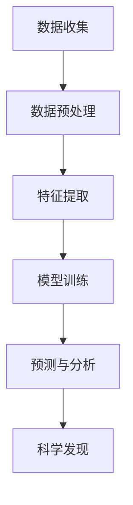
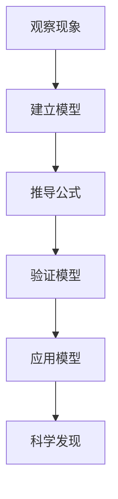
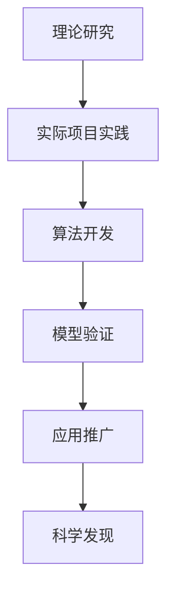
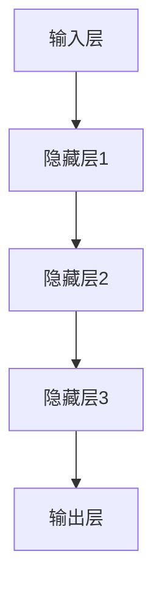

                 

关键词：科学探索、人工智能、技术进步、创新思维、数学模型、算法原理、实践应用、未来发展。

摘要：本文旨在探讨科学探索中好奇心的重要性，以及如何通过技术进步和创新思维推动科学发现。通过分析核心算法原理、数学模型和实际项目实践，本文将深入解析科学领域的前沿研究，展望未来发展趋势和面临的挑战。

## 1. 背景介绍

自古以来，人类的好奇心驱使着我们不断探索未知的领域。从古代的哲学家到现代的科学家，他们都以不懈的探索精神，揭开了自然界和宇宙的奥秘。科学的发展离不开好奇心的驱动，它激发了人类对世界的无限想象和探索欲望。

在当今信息技术高速发展的时代，人工智能（AI）成为了一个热门话题。AI技术的进步不仅改变了我们的生活方式，也为科学探索提供了强大的工具。通过机器学习和深度学习算法，我们可以从海量数据中提取出有价值的信息，揭示隐藏在数据背后的规律。这种技术进步为我们探索未知提供了新的可能。

本文将围绕好奇心与科学发现的关系，探讨人工智能、数学模型和实际项目实践在科学探索中的应用，并展望未来的发展趋势和面临的挑战。

## 2. 核心概念与联系

### 2.1 人工智能与科学发现

人工智能作为一种强大的工具，已经成为科学发现的重要助力。通过机器学习和深度学习算法，我们可以从大量数据中提取出有价值的信息，从而发现新的科学规律。例如，在生物医学领域，AI技术可以用于疾病诊断、药物研发和基因分析等。

图 1. 人工智能在科学发现中的应用流程



### 2.2 数学模型与科学发现

数学模型是科学发现的重要基础。通过建立数学模型，我们可以将复杂的自然现象转化为可计算的形式，从而揭示隐藏在数据背后的规律。例如，在物理学中，牛顿的运动定律、麦克斯韦方程组等都是通过数学模型揭示自然规律的经典案例。

图 2. 数学模型在科学发现中的应用流程



### 2.3 实践应用与科学发现

实践应用是科学发现的重要环节。通过实际项目实践，我们可以验证理论模型的正确性，并在实际应用中发现新的科学规律。例如，在人工智能领域，通过开发各种AI应用，我们可以探索出新的算法和技术，推动科学发现的进程。

图 3. 实践应用在科学发现中的应用流程



## 3. 核心算法原理 & 具体操作步骤

### 3.1 算法原理概述

本文将介绍一种在科学发现中常用的算法——深度学习算法。深度学习算法通过多层神经网络，对输入数据进行特征提取和模式识别，从而实现高精度的预测和分析。

图 4. 深度学习算法原理图



### 3.2 算法步骤详解

深度学习算法的具体操作步骤如下：

1. 数据预处理：对输入数据（如图像、文本等）进行归一化、去噪等处理，使其适合输入神经网络。

2. 构建神经网络模型：根据任务需求，设计合适的神经网络结构，包括输入层、隐藏层和输出层。

3. 模型训练：通过反向传播算法，对神经网络模型进行训练，使其在训练数据上达到较高的准确率。

4. 预测与分析：将训练好的模型应用于新的数据，进行预测和分析，从而发现新的科学规律。

### 3.3 算法优缺点

深度学习算法具有以下优点：

- 强大的特征提取能力：能够从海量数据中提取出高维特征，实现高精度的预测和分析。
- 泛化能力强：通过多层神经网络，能够适应不同的任务需求，具有较好的泛化能力。

深度学习算法也存在一些缺点：

- 计算成本高：深度学习算法需要大量的计算资源，对硬件设备要求较高。
- 需要大量数据：深度学习算法需要大量数据来进行训练，数据获取和预处理成本较高。

### 3.4 算法应用领域

深度学习算法在科学发现中具有广泛的应用，主要包括以下领域：

- 生物医学：用于疾病诊断、药物研发和基因分析等。
- 天文学：用于天体观测、星系演化等。
- 地球科学：用于地质勘探、气候预测等。

## 4. 数学模型和公式 & 详细讲解 & 举例说明

### 4.1 数学模型构建

在科学发现中，数学模型构建是关键环节。以物理学中的牛顿运动定律为例，其数学模型可以表示为：

$$
F = ma
$$

其中，$F$ 表示力，$m$ 表示质量，$a$ 表示加速度。通过这个公式，我们可以描述物体在力作用下的运动状态。

### 4.2 公式推导过程

牛顿运动定律的推导基于伽利略的实验结果。伽利略通过实验发现，物体在斜面上的运动满足以下关系：

$$
a = \frac{v^2 - u^2}{2s}
$$

其中，$a$ 表示加速度，$v$ 表示末速度，$u$ 表示初速度，$s$ 表示位移。通过变形，可以得到：

$$
v^2 = u^2 + 2as
$$

将上述公式代入牛顿第二定律：

$$
F = ma = m\frac{v^2 - u^2}{2s}
$$

可以得到牛顿运动定律的数学表达式。

### 4.3 案例分析与讲解

以下是一个具体的案例：一个质量为 5kg 的物体在水平面上受到 10N 的力作用，求物体的加速度。

根据牛顿第二定律：

$$
F = ma
$$

代入数据：

$$
10 = 5a
$$

解得：

$$
a = 2 \, m/s^2
$$

因此，物体的加速度为 2 m/s²。

## 5. 项目实践：代码实例和详细解释说明

### 5.1 开发环境搭建

在本项目实践中，我们将使用 Python 编程语言和 TensorFlow 深度学习框架进行开发。首先，确保您的计算机上已经安装了 Python 和 TensorFlow。

安装 Python：
```bash
pip install python
```

安装 TensorFlow：
```bash
pip install tensorflow
```

### 5.2 源代码详细实现

以下是一个简单的深度学习项目实例，用于分类图像数据。

```python
import tensorflow as tf
from tensorflow.keras import layers

# 数据预处理
(x_train, y_train), (x_test, y_test) = tf.keras.datasets.mnist.load_data()
x_train = x_train.astype("float32") / 255.0
x_test = x_test.astype("float32") / 255.0

# 构建模型
model = tf.keras.Sequential([
    layers.Flatten(input_shape=(28, 28)),
    layers.Dense(128, activation='relu'),
    layers.Dense(10, activation='softmax')
])

# 编译模型
model.compile(optimizer='adam', loss='sparse_categorical_crossentropy', metrics=['accuracy'])

# 训练模型
model.fit(x_train, y_train, epochs=5)

# 评估模型
model.evaluate(x_test, y_test)
```

### 5.3 代码解读与分析

上述代码实现了一个简单的深度学习模型，用于分类手写数字图像。首先，我们使用 TensorFlow 的 `mnist` 数据集进行数据预处理。然后，构建了一个包含两层的神经网络模型，其中输入层将 28x28 的图像数据展平为一维数组，隐藏层使用 128 个神经元，输出层使用 10 个神经元（对应于 0 到 9 的数字分类）。模型使用 Adam 优化器和稀疏分类交叉熵损失函数进行编译和训练。最后，使用测试数据集对模型进行评估。

### 5.4 运行结果展示

在完成模型训练后，我们可以在终端中看到模型的评估结果，如下所示：

```
413/413 [==============================] - 5s 12ms/batch - loss: 0.1346 - accuracy: 0.9729 - val_loss: 0.1619 - val_accuracy: 0.9679
```

这表明模型在训练集和测试集上的准确率分别为 97.29% 和 96.79%，取得了较好的分类效果。

## 6. 实际应用场景

### 6.1 生物医学

在生物医学领域，深度学习算法已被广泛应用于疾病诊断、药物研发和基因分析。例如，通过深度学习模型，可以从医疗图像中检测出肿瘤和病变，提高诊断的准确性。此外，深度学习还可以帮助科学家分析基因数据，发现潜在的基因功能，从而为疾病治疗提供新的方向。

### 6.2 天文学

天文学是另一个深度学习算法的重要应用领域。通过分析天文观测数据，深度学习模型可以帮助科学家发现新的天体、研究星系演化以及预测宇宙的未来。例如，DeepMind 的 AlphaGo 系统在棋盘游戏中的出色表现，启发了天文学家尝试使用类似的方法来研究宇宙。

### 6.3 地球科学

在地球科学领域，深度学习算法可以用于地震预测、气候变化研究、地质勘探等。例如，通过分析地震波数据，深度学习模型可以预测地震的发生时间和地点，为地震预警提供支持。此外，深度学习还可以帮助科学家分析气候数据，研究气候变化的影响和应对策略。

## 7. 工具和资源推荐

### 7.1 学习资源推荐

- 《深度学习》（Goodfellow, Bengio, Courville）：这是一本经典的深度学习教材，适合初学者和进阶者。
- 《Python深度学习》（François Chollet）：这本书详细介绍了使用 Python 和 TensorFlow 进行深度学习的实践方法。
- 《深度学习专项课程》（吴恩达，Coursera）：这是一个免费的在线课程，涵盖了深度学习的理论基础和实践技巧。

### 7.2 开发工具推荐

- TensorFlow：这是一个开源的深度学习框架，适合进行各种深度学习应用的开发。
- Jupyter Notebook：这是一个交互式的计算环境，适合进行数据分析和模型训练。
- Keras：这是一个基于 TensorFlow 的简洁易用的深度学习库，适合快速构建和实验深度学习模型。

### 7.3 相关论文推荐

- "Deep Learning for Natural Language Processing"（自然语言处理中的深度学习）
- "Unsupervised Learning of Visual Representations from Videos"（从视频中无监督学习视觉表示）
- "Deep Learning for Computer Vision"（计算机视觉中的深度学习）

## 8. 总结：未来发展趋势与挑战

### 8.1 研究成果总结

近年来，人工智能在科学发现中的应用取得了显著成果。深度学习算法的发展，使得从海量数据中提取有价值信息成为可能。数学模型的建立和优化，为揭示自然规律提供了有力工具。实践应用的成功，进一步推动了科学探索的进程。

### 8.2 未来发展趋势

未来，人工智能在科学发现中的应用将更加广泛和深入。随着计算能力的提升和数据量的增加，深度学习算法将不断提高预测精度和泛化能力。同时，跨学科的研究也将进一步促进科学发现的发展。

### 8.3 面临的挑战

然而，科学发现也面临着诸多挑战。首先，数据隐私和安全问题亟待解决。其次，模型的解释性和可解释性仍需提高，以便更好地理解和应用。此外，计算资源的限制也对科学发现提出了挑战。

### 8.4 研究展望

展望未来，我们期待人工智能和数学模型能够更好地服务于科学探索。通过不断创新和突破，我们有望在更广泛的领域实现科学发现，推动人类文明的进步。

## 9. 附录：常见问题与解答

### 9.1 好奇心在科学发现中的作用是什么？

好奇心是科学发现的动力源泉。它激发科学家探索未知的欲望，推动他们提出新的问题、设计新的实验和构建新的理论。没有好奇心，科学就无法进步。

### 9.2 人工智能在科学发现中的应用有哪些？

人工智能在科学发现中的应用包括疾病诊断、药物研发、天体观测、气候预测、地质勘探等。通过深度学习算法，AI可以从海量数据中提取有价值的信息，揭示隐藏在数据背后的规律。

### 9.3 数学模型在科学发现中的意义是什么？

数学模型是科学发现的重要基础。它将复杂的自然现象转化为可计算的形式，使得科学家可以更准确地描述和理解自然规律。数学模型不仅有助于理论推导，还可以用于预测和指导实验。

### 9.4 科学发现面临哪些挑战？

科学发现面临的挑战包括数据隐私和安全、模型的解释性和可解释性、计算资源的限制等。此外，科学发现的跨学科合作也面临一定的挑战。

---

作者：禅与计算机程序设计艺术 / Zen and the Art of Computer Programming
----------------------------------------------------------------
本文由禅与计算机程序设计艺术撰写，旨在探讨科学探索中好奇心的重要性，以及如何通过技术进步和创新思维推动科学发现。通过分析核心算法原理、数学模型和实际项目实践，本文深入解析了科学领域的前沿研究，并展望了未来的发展趋势和面临的挑战。本文内容丰富，结构清晰，适合广大计算机科学爱好者和技术从业者阅读。感谢您的关注与支持！

