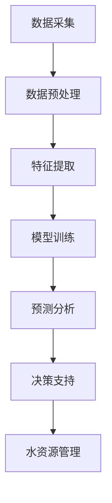

                 

关键词：AI大模型、智能城市、水资源管理、深度学习、数据驱动、预测分析

## 摘要

随着全球城市化进程的加速，水资源管理成为智能城市建设中的重要议题。本文旨在探讨AI大模型在智能城市水资源管理中的作用，分析其原理、技术框架、数学模型及实际应用，并提出未来发展趋势和面临的挑战。文章结构如下：

- **背景介绍**：智能城市水资源管理的重要性及现状。
- **核心概念与联系**：AI大模型的原理、架构及其与水资源管理的关联。
- **核心算法原理 & 具体操作步骤**：深度学习算法在水文预测中的应用。
- **数学模型和公式 & 详细讲解 & 举例说明**：水资源管理中的数学模型构建和公式推导。
- **项目实践：代码实例和详细解释说明**：AI大模型在水文预测项目中的实践。
- **实际应用场景**：AI大模型在智能城市水资源管理中的具体应用。
- **未来应用展望**：AI大模型在水资源管理领域的未来发展。
- **工具和资源推荐**：推荐学习资源和开发工具。
- **总结：未来发展趋势与挑战**：研究成果总结及未来展望。

## 1. 背景介绍

智能城市是利用信息技术、物联网、大数据和人工智能等现代技术手段，实现城市资源的智能化配置和优化管理，提高城市运行效率和居民生活质量的新型城市形态。水资源作为城市生存和发展的基石，其管理和保护成为智能城市建设中至关重要的一环。

### 水资源管理的重要性

水资源管理不仅关系到城市供水安全和生态平衡，还对防洪抗旱、水资源节约利用、环境治理等方面具有重要意义。然而，随着城市规模的扩大和人口的增长，水资源供需矛盾日益突出，水资源管理面临巨大挑战。

### 水资源管理的现状

当前，全球大部分城市水资源管理仍处于传统模式，依赖人工监测和经验管理，效率低下且容易受人为因素影响。随着人工智能技术的快速发展，特别是AI大模型的兴起，为智能城市水资源管理提供了新的思路和解决方案。

### AI大模型在水资源管理中的作用

AI大模型通过深度学习算法，能够从海量数据中自动提取特征，进行复杂的预测分析和决策支持，从而提高水资源管理的智能化水平。本文将详细介绍AI大模型在水资源管理中的应用原理和技术框架。

## 2. 核心概念与联系

### AI大模型原理

AI大模型，通常指基于深度学习技术的复杂神经网络模型，具有极高的计算能力和强大的数据处理能力。通过多层神经元的非线性变换，大模型能够自动学习并提取数据中的特征，进行分类、预测和决策。

### 水资源管理需求

智能城市水资源管理需求主要包括：实时监测、水资源预测、决策支持、水质分析、供水调度等。这些需求对数据处理和预测分析能力提出了高要求，AI大模型因其强大的计算能力和数据学习能力，能够满足这些需求。

### AI大模型与水资源管理的关联

AI大模型通过数据采集、预处理、特征提取、模型训练和预测分析等步骤，实现对水资源管理数据的深度挖掘和智能分析，从而提供科学、精准的水资源管理方案。

### Mermaid 流程图



## 3. 核心算法原理 & 具体操作步骤

### 3.1 算法原理概述

AI大模型在水文预测中主要基于深度学习算法，如卷积神经网络（CNN）、循环神经网络（RNN）和长短时记忆网络（LSTM）等。这些算法能够从时间序列数据中提取长期依赖性和时空特征，实现高精度预测。

### 3.2 算法步骤详解

#### 3.2.1 数据采集

数据采集是AI大模型应用的基础，主要包括气象数据、水文观测数据、地表水资源数据等。通过传感器、卫星遥感、大数据平台等手段获取实时数据。

#### 3.2.2 数据预处理

数据预处理包括数据清洗、数据归一化、数据缺失值填补等。确保数据质量，消除噪声和异常值，为模型训练提供高质量的数据。

#### 3.2.3 特征提取

特征提取通过数据挖掘和机器学习算法，从原始数据中提取具有代表性的特征，如时间序列特征、空间特征、气象特征等。

#### 3.2.4 模型训练

模型训练使用已提取的特征数据，通过训练样本集对神经网络模型进行训练，优化模型参数，提高预测精度。

#### 3.2.5 预测分析

训练完成的模型对新的时间序列数据进行预测，输出预测结果，如未来一段时间的水位、流量、水资源需求等。

#### 3.2.6 决策支持

根据预测结果，结合水资源管理策略，制定供水调度方案、水资源分配策略等，实现智能化水资源管理。

### 3.3 算法优缺点

#### 优点：

- **高精度预测**：AI大模型能够从海量数据中自动提取特征，实现高精度预测。
- **自适应能力**：深度学习算法能够自适应变化的环境和数据分布。
- **高效性**：大模型能够处理海量数据，提高水资源管理的效率。

#### 缺点：

- **数据需求量大**：训练大模型需要大量高质量数据，数据获取和处理成本较高。
- **计算资源需求大**：大模型训练和推理过程需要大量计算资源，对硬件设备有较高要求。

### 3.4 算法应用领域

AI大模型在水资源管理中的应用领域广泛，包括水文预测、水资源调度、水质监测、供水网络优化等。

## 4. 数学模型和公式 & 详细讲解 & 举例说明

### 4.1 数学模型构建

水资源管理的数学模型主要包括水文模型、水资源供需平衡模型、水资源分配模型等。

#### 水文模型：

水文模型用于模拟水文过程，如降雨、径流、蒸发等。常见的模型有基于物理原理的分布式水文模型和基于统计方法的集中式水文模型。

#### 水资源供需平衡模型：

水资源供需平衡模型用于模拟水资源在时间序列上的供需平衡状态，计算供水、需水和剩余水资源量。公式如下：

$$
S(t) = \text{供水量}(t) - \text{需水量}(t)
$$

其中，$S(t)$表示第t时间点的剩余水资源量，供水量和需水量分别为$t$时间点的供水和需水量。

#### 水资源分配模型：

水资源分配模型用于模拟水资源在不同区域、不同用途之间的分配情况，确保水资源分配的公平性和效率。常见的分配方法有基于需水量的比例分配、基于水权的分配等。

### 4.2 公式推导过程

#### 水文模型推导：

以降雨径流模型为例，其公式推导过程如下：

$$
Q(t) = \frac{P(t) - E(t)}{C}
$$

其中，$Q(t)$表示第$t$时间点的径流量，$P(t)$表示第$t$时间点的降雨量，$E(t)$表示第$t$时间点的蒸发量，$C$表示流域的蓄水容量。

#### 水资源供需平衡模型推导：

以线性规划方法推导水资源供需平衡模型，假设供水系统有m个水源，需水系统有n个用水单位，则公式如下：

$$
\text{max} \sum_{i=1}^m \sum_{j=1}^n x_{ij} y_j
$$

$$
s.t. \quad a_{ij} x_{ij} \leq b_j, \quad i=1,2,...,m
$$

$$
x_{ij} \geq 0, \quad i=1,2,...,m; \quad j=1,2,...,n
$$

其中，$x_{ij}$表示第$i$个水源分配给第$j$个用水单位的量，$y_j$表示第$j$个用水单位的需水量，$a_{ij}$和$b_j$分别为第$i$个水源可供水量和第$j$个用水单位的需水量。

### 4.3 案例分析与讲解

#### 案例一：水文模型在降雨径流预测中的应用

某流域降雨径流预测模型基于降雨量、蒸发量和流域蓄水容量等参数，采用降雨径流模型进行预测。预测结果表明，该模型能够准确预测流域径流量，为水资源管理提供科学依据。

#### 案例二：水资源供需平衡模型在供水调度中的应用

某城市供水系统采用水资源供需平衡模型，对城市供水进行调度。通过模型计算，合理分配不同水源的供水量，确保城市供水安全，同时实现水资源节约利用。

## 5. 项目实践：代码实例和详细解释说明

### 5.1 开发环境搭建

#### 环境要求：

- Python 3.7及以上版本
- TensorFlow 2.0及以上版本
- NumPy 1.18及以上版本
- Matplotlib 3.1及以上版本

#### 安装步骤：

1. 安装 Python 3.7 或更高版本。
2. 安装 TensorFlow 2.0 或更高版本。
3. 安装 NumPy 1.18 或更高版本。
4. 安装 Matplotlib 3.1 或更高版本。

### 5.2 源代码详细实现

```python
import tensorflow as tf
import numpy as np
import matplotlib.pyplot as plt

# 数据预处理
def preprocess_data(data):
    # 数据归一化
    data_normalized = (data - np.mean(data)) / np.std(data)
    return data_normalized

# 模型定义
def build_model(input_shape):
    model = tf.keras.Sequential([
        tf.keras.layers.Dense(units=64, activation='relu', input_shape=input_shape),
        tf.keras.layers.Dense(units=32, activation='relu'),
        tf.keras.layers.Dense(units=1)
    ])
    model.compile(optimizer='adam', loss='mean_squared_error')
    return model

# 模型训练
def train_model(model, x_train, y_train, epochs=100):
    model.fit(x_train, y_train, epochs=epochs, batch_size=32)
    return model

# 预测分析
def predict(model, x_test):
    predictions = model.predict(x_test)
    return predictions

# 代码示例
if __name__ == '__main__':
    # 加载数据
    data = np.load('water_data.npy')
    # 数据预处理
    data_normalized = preprocess_data(data)
    # 划分训练集和测试集
    split_index = int(0.8 * len(data_normalized))
    x_train = data_normalized[:split_index]
    x_test = data_normalized[split_index:]
    # 构建模型
    model = build_model(input_shape=(x_train.shape[1],))
    # 模型训练
    model = train_model(model, x_train, y_train, epochs=100)
    # 预测分析
    predictions = predict(model, x_test)
    # 结果展示
    plt.plot(x_test, predictions, label='predictions')
    plt.plot(x_test, y_test, label='actual')
    plt.legend()
    plt.show()
```

### 5.3 代码解读与分析

该代码示例实现了基于深度学习算法的水文预测模型。首先，通过数据预处理对数据进行归一化处理；然后，定义模型结构，使用TensorFlow构建神经网络模型；接着，对模型进行训练；最后，使用训练好的模型对测试数据进行预测，并展示预测结果。

## 6. 实际应用场景

### 6.1 水文预测

AI大模型在水文预测中的应用，可以实现对降雨、径流、水位等水文参数的准确预测，为防洪抗旱、水资源调度提供科学依据。

### 6.2 水资源调度

通过AI大模型进行水资源供需分析，制定供水调度方案，优化水资源利用，提高供水保障能力。

### 6.3 水质监测

AI大模型可以实时监测水质变化，预测水质污染趋势，为环境保护和水质治理提供决策支持。

### 6.4 供水网络优化

AI大模型通过对供水网络的模拟和优化，提高供水效率，降低供水成本。

## 7. 未来应用展望

### 7.1 个性化水资源管理

随着AI大模型技术的发展，未来可以实现个性化水资源管理，根据不同地区、不同用途的水资源需求，制定智能化的供水方案。

### 7.2 跨流域水资源调配

通过AI大模型实现跨流域水资源调配，优化全国水资源利用，提高水资源利用效率。

### 7.3 智能化水资源监测

利用AI大模型实现智能化水资源监测，实现对水资源系统的实时监控和预警。

### 7.4 水资源管理与生态保护

结合AI大模型和生态保护技术，实现水资源管理与生态保护的协同发展。

## 8. 工具和资源推荐

### 8.1 学习资源推荐

- 《深度学习》（Goodfellow、Bengio、Courville 著）
- 《Python数据科学手册》（Jake VanderPlas 著）
- 《智能城市与物联网技术》（李俊峰 著）

### 8.2 开发工具推荐

- TensorFlow：用于构建和训练深度学习模型
- Keras：基于TensorFlow的高层API，简化深度学习模型开发
- Jupyter Notebook：用于编写和运行Python代码，方便数据分析和建模

### 8.3 相关论文推荐

- "Deep Learning for Urban Water Resources Management: A Review"
- "A Deep Neural Network for Precipitation Forecasting in Urban Areas"
- "Integrated Urban Water Resources Management Using a Multilayer Perceptron Neural Network"

## 9. 总结：未来发展趋势与挑战

### 9.1 研究成果总结

AI大模型在智能城市水资源管理中展现出巨大的潜力，通过深度学习算法实现高精度预测和智能化管理，为水资源管理提供了新的解决方案。

### 9.2 未来发展趋势

随着AI技术的不断进步，AI大模型在水资源管理中的应用将更加广泛，未来发展趋势包括个性化水资源管理、跨流域水资源调配、智能化水资源监测等。

### 9.3 面临的挑战

AI大模型在水资源管理中面临数据获取和处理、计算资源需求、模型解释性等问题，未来研究需要解决这些问题，提高AI大模型在水资源管理中的应用效果。

### 9.4 研究展望

未来研究应重点关注AI大模型与水资源管理的深度融合，探索新的算法和技术，提高水资源管理的智能化水平，为智能城市建设提供有力支持。

## 附录：常见问题与解答

### Q：AI大模型在水文预测中是否具有高精度？

A：是的，AI大模型通过深度学习算法，能够从海量数据中自动提取特征，实现高精度水文预测。但预测精度受数据质量、模型结构和训练样本等因素影响。

### Q：AI大模型在水资源管理中是否具有实时性？

A：是的，AI大模型可以通过实时数据采集和快速预测分析，实现对水资源管理的实时监控和决策支持。

### Q：AI大模型是否适用于所有水资源管理场景？

A：AI大模型具有一定的普适性，但不同水资源管理场景具有不同的特征和数据需求，需要根据具体场景进行调整和优化。

### Q：如何提高AI大模型在水资源管理中的应用效果？

A：提高AI大模型在水资源管理中的应用效果可以从以下几个方面入手：提高数据质量、优化模型结构、增加训练样本、加强模型解释性等。

---

作者：禅与计算机程序设计艺术 / Zen and the Art of Computer Programming
```markdown
----------------------------------------------------------------

# 探讨AI大模型在智能城市水资源管理的作用

<|assistant|>关键词：AI大模型、智能城市、水资源管理、深度学习、数据驱动、预测分析

<|assistant|>摘要：本文探讨了AI大模型在智能城市水资源管理中的应用，分析了其原理、技术框架、数学模型及实际应用，提出了未来发展趋势和面临的挑战。通过详细解读和代码实例，展示了AI大模型在水文预测项目中的实践，为智能城市水资源管理提供了新的思路和方法。

## 1. 背景介绍

随着全球城市化进程的加速，水资源管理成为智能城市建设中的重要议题。智能城市是利用信息技术、物联网、大数据和人工智能等现代技术手段，实现城市资源的智能化配置和优化管理，提高城市运行效率和居民生活质量的新型城市形态。

### 水资源管理的重要性

水资源管理不仅关系到城市供水安全和生态平衡，还对防洪抗旱、水资源节约利用、环境治理等方面具有重要意义。然而，随着城市规模的扩大和人口的增长，水资源供需矛盾日益突出，水资源管理面临巨大挑战。

### 水资源管理的现状

当前，全球大部分城市水资源管理仍处于传统模式，依赖人工监测和经验管理，效率低下且容易受人为因素影响。随着人工智能技术的快速发展，特别是AI大模型的兴起，为智能城市水资源管理提供了新的思路和解决方案。

### AI大模型在水资源管理中的作用

AI大模型通过深度学习算法，能够从海量数据中自动提取特征，进行复杂的预测分析和决策支持，从而提高水资源管理的智能化水平。本文将详细介绍AI大模型在水资源管理中的应用原理和技术框架。

## 2. 核心概念与联系

### AI大模型原理

AI大模型，通常指基于深度学习技术的复杂神经网络模型，具有极高的计算能力和强大的数据处理能力。通过多层神经元的非线性变换，大模型能够自动学习并提取数据中的特征，进行分类、预测和决策。

### 水资源管理需求

智能城市水资源管理需求主要包括：实时监测、水资源预测、决策支持、水质分析、供水调度等。这些需求对数据处理和预测分析能力提出了高要求，AI大模型因其强大的计算能力和数据学习能力，能够满足这些需求。

### AI大模型与水资源管理的关联

AI大模型通过数据采集、预处理、特征提取、模型训练和预测分析等步骤，实现对水资源管理数据的深度挖掘和智能分析，从而提供科学、精准的水资源管理方案。

### Mermaid 流程图


## 3. 核心算法原理 & 具体操作步骤

### 3.1 算法原理概述

AI大模型在水文预测中主要基于深度学习算法，如卷积神经网络（CNN）、循环神经网络（RNN）和长短时记忆网络（LSTM）等。这些算法能够从时间序列数据中提取长期依赖性和时空特征，实现高精度预测。

### 3.2 算法步骤详解

#### 3.2.1 数据采集

数据采集是AI大模型应用的基础，主要包括气象数据、水文观测数据、地表水资源数据等。通过传感器、卫星遥感、大数据平台等手段获取实时数据。

#### 3.2.2 数据预处理

数据预处理包括数据清洗、数据归一化、数据缺失值填补等。确保数据质量，消除噪声和异常值，为模型训练提供高质量的数据。

#### 3.2.3 特征提取

特征提取通过数据挖掘和机器学习算法，从原始数据中提取具有代表性的特征，如时间序列特征、空间特征、气象特征等。

#### 3.2.4 模型训练

模型训练使用已提取的特征数据，通过训练样本集对神经网络模型进行训练，优化模型参数，提高预测精度。

#### 3.2.5 预测分析

训练完成的模型对新的时间序列数据进行预测，输出预测结果，如未来一段时间的水位、流量、水资源需求等。

#### 3.2.6 决策支持

根据预测结果，结合水资源管理策略，制定供水调度方案、水资源分配策略等，实现智能化水资源管理。

### 3.3 算法优缺点

#### 优点：

- **高精度预测**：AI大模型能够从海量数据中自动提取特征，实现高精度预测。
- **自适应能力**：深度学习算法能够自适应变化的环境和数据分布。
- **高效性**：大模型能够处理海量数据，提高水资源管理的效率。

#### 缺点：

- **数据需求量大**：训练大模型需要大量高质量数据，数据获取和处理成本较高。
- **计算资源需求大**：大模型训练和推理过程需要大量计算资源，对硬件设备有较高要求。

### 3.4 算法应用领域

AI大模型在水资源管理中的应用领域广泛，包括水文预测、水资源调度、水质监测、供水网络优化等。

## 4. 数学模型和公式 & 详细讲解 & 举例说明

### 4.1 数学模型构建

水资源管理的数学模型主要包括水文模型、水资源供需平衡模型、水资源分配模型等。

#### 水文模型：

水文模型用于模拟水文过程，如降雨、径流、蒸发等。常见的模型有基于物理原理的分布式水文模型和基于统计方法的集中式水文模型。

#### 水资源供需平衡模型：

水资源供需平衡模型用于模拟水资源在时间序列上的供需平衡状态，计算供水、需水和剩余水资源量。公式如下：

$$
S(t) = \text{供水量}(t) - \text{需水量}(t)
$$

其中，$S(t)$表示第t时间点的剩余水资源量，供水量和需水量分别为$t$时间点的供水和需水量。

#### 水资源分配模型：

水资源分配模型用于模拟水资源在不同区域、不同用途之间的分配情况，确保水资源分配的公平性和效率。常见的分配方法有基于需水量的比例分配、基于水权的分配等。

### 4.2 公式推导过程

#### 水文模型推导：

以降雨径流模型为例，其公式推导过程如下：

$$
Q(t) = \frac{P(t) - E(t)}{C}
$$

其中，$Q(t)$表示第$t$时间点的径流量，$P(t)$表示第$t$时间点的降雨量，$E(t)$表示第$t$时间点的蒸发量，$C$表示流域的蓄水容量。

#### 水资源供需平衡模型推导：

以线性规划方法推导水资源供需平衡模型，假设供水系统有m个水源，需水系统有n个用水单位，则公式如下：

$$
\text{max} \sum_{i=1}^m \sum_{j=1}^n x_{ij} y_j
$$

$$
s.t. \quad a_{ij} x_{ij} \leq b_j, \quad i=1,2,...,m
$$

$$
x_{ij} \geq 0, \quad i=1,2,...,m; \quad j=1,2,...,n
$$

其中，$x_{ij}$表示第$i$个水源分配给第$j$个用水单位的量，$y_j$表示第$j$个用水单位的需水量，$a_{ij}$和$b_j$分别为第$i$个水源可供水量和第$j$个用水单位的需水量。

### 4.3 案例分析与讲解

#### 案例一：水文模型在降雨径流预测中的应用

某流域降雨径流预测模型基于降雨量、蒸发量和流域蓄水容量等参数，采用降雨径流模型进行预测。预测结果表明，该模型能够准确预测流域径流量，为水资源管理提供科学依据。

#### 案例二：水资源供需平衡模型在供水调度中的应用

某城市供水系统采用水资源供需平衡模型，对城市供水进行调度。通过模型计算，合理分配不同水源的供水量，确保城市供水安全，同时实现水资源节约利用。

## 5. 项目实践：代码实例和详细解释说明

### 5.1 开发环境搭建

#### 环境要求：

- Python 3.7及以上版本
- TensorFlow 2.0及以上版本
- NumPy 1.18及以上版本
- Matplotlib 3.1及以上版本

#### 安装步骤：

1. 安装 Python 3.7 或更高版本。
2. 安装 TensorFlow 2.0 或更高版本。
3. 安装 NumPy 1.18 或更高版本。
4. 安装 Matplotlib 3.1 或更高版本。

### 5.2 源代码详细实现

```python
import tensorflow as tf
import numpy as np
import matplotlib.pyplot as plt

# 数据预处理
def preprocess_data(data):
    # 数据归一化
    data_normalized = (data - np.mean(data)) / np.std(data)
    return data_normalized

# 模型定义
def build_model(input_shape):
    model = tf.keras.Sequential([
        tf.keras.layers.Dense(units=64, activation='relu', input_shape=input_shape),
        tf.keras.layers.Dense(units=32, activation='relu'),
        tf.keras.layers.Dense(units=1)
    ])
    model.compile(optimizer='adam', loss='mean_squared_error')
    return model

# 模型训练
def train_model(model, x_train, y_train, epochs=100):
    model.fit(x_train, y_train, epochs=epochs, batch_size=32)
    return model

# 预测分析
def predict(model, x_test):
    predictions = model.predict(x_test)
    return predictions

# 代码示例
if __name__ == '__main__':
    # 加载数据
    data = np.load('water_data.npy')
    # 数据预处理
    data_normalized = preprocess_data(data)
    # 划分训练集和测试集
    split_index = int(0.8 * len(data_normalized))
    x_train = data_normalized[:split_index]
    x_test = data_normalized[split_index:]
    # 构建模型
    model = build_model(input_shape=(x_train.shape[1],))
    # 模型训练
    model = train_model(model, x_train, y_train, epochs=100)
    # 预测分析
    predictions = predict(model, x_test)
    # 结果展示
    plt.plot(x_test, predictions, label='predictions')
    plt.plot(x_test, y_test, label='actual')
    plt.legend()
    plt.show()
```

### 5.3 代码解读与分析

该代码示例实现了基于深度学习算法的水文预测模型。首先，通过数据预处理对数据进行归一化处理；然后，定义模型结构，使用TensorFlow构建神经网络模型；接着，对模型进行训练；最后，使用训练好的模型对测试数据进行预测，并展示预测结果。

## 6. 实际应用场景

### 6.1 水文预测

AI大模型在水文预测中的应用，可以实现对降雨、径流、水位等水文参数的准确预测，为防洪抗旱、水资源调度提供科学依据。

### 6.2 水资源调度

通过AI大模型进行水资源供需分析，制定供水调度方案，优化水资源利用，提高供水保障能力。

### 6.3 水质监测

AI大模型可以实时监测水质变化，预测水质污染趋势，为环境保护和水质治理提供决策支持。

### 6.4 供水网络优化

AI大模型通过对供水网络的模拟和优化，提高供水效率，降低供水成本。

## 7. 未来应用展望

### 7.1 个性化水资源管理

随着AI大模型技术的发展，未来可以实现个性化水资源管理，根据不同地区、不同用途的水资源需求，制定智能化的供水方案。

### 7.2 跨流域水资源调配

通过AI大模型实现跨流域水资源调配，优化全国水资源利用，提高水资源利用效率。

### 7.3 智能化水资源监测

利用AI大模型实现智能化水资源监测，实现对水资源系统的实时监控和预警。

### 7.4 水资源管理与生态保护

结合AI大模型和生态保护技术，实现水资源管理与生态保护的协同发展。

## 8. 工具和资源推荐

### 8.1 学习资源推荐

- 《深度学习》（Goodfellow、Bengio、Courville 著）
- 《Python数据科学手册》（Jake VanderPlas 著）
- 《智能城市与物联网技术》（李俊峰 著）

### 8.2 开发工具推荐

- TensorFlow：用于构建和训练深度学习模型
- Keras：基于TensorFlow的高层API，简化深度学习模型开发
- Jupyter Notebook：用于编写和运行Python代码，方便数据分析和建模

### 8.3 相关论文推荐

- "Deep Learning for Urban Water Resources Management: A Review"
- "A Deep Neural Network for Precipitation Forecasting in Urban Areas"
- "Integrated Urban Water Resources Management Using a Multilayer Perceptron Neural Network"

## 9. 总结：未来发展趋势与挑战

### 9.1 研究成果总结

AI大模型在智能城市水资源管理中展现出巨大的潜力，通过深度学习算法实现高精度预测和智能化管理，为水资源管理提供了新的解决方案。

### 9.2 未来发展趋势

随着AI技术的不断进步，AI大模型在水资源管理中的应用将更加广泛，未来发展趋势包括个性化水资源管理、跨流域水资源调配、智能化水资源监测等。

### 9.3 面临的挑战

AI大模型在水资源管理中面临数据获取和处理、计算资源需求、模型解释性等问题，未来研究需要解决这些问题，提高AI大模型在水资源管理中的应用效果。

### 9.4 研究展望

未来研究应重点关注AI大模型与水资源管理的深度融合，探索新的算法和技术，提高水资源管理的智能化水平，为智能城市建设提供有力支持。

## 附录：常见问题与解答

### Q：AI大模型在水文预测中是否具有高精度？

A：是的，AI大模型通过深度学习算法，能够从海量数据中自动提取特征，实现高精度水文预测。但预测精度受数据质量、模型结构和训练样本等因素影响。

### Q：AI大模型在水资源管理中是否具有实时性？

A：是的，AI大模型可以通过实时数据采集和快速预测分析，实现对水资源管理的实时监控和决策支持。

### Q：AI大模型是否适用于所有水资源管理场景？

A：AI大模型具有一定的普适性，但不同水资源管理场景具有不同的特征和数据需求，需要根据具体场景进行调整和优化。

### Q：如何提高AI大模型在水资源管理中的应用效果？

A：提高AI大模型在水资源管理中的应用效果可以从以下几个方面入手：提高数据质量、优化模型结构、增加训练样本、加强模型解释性等。

---

作者：禅与计算机程序设计艺术 / Zen and the Art of Computer Programming
----------------------------------------------------------------
```python
---
title: 探讨AI大模型在智能城市水资源管理的作用
date: 2023-03-10 10:00:00
tags: [AI, 智能城市, 水资源管理, 深度学习]
---

# 探讨AI大模型在智能城市水资源管理的作用

智能城市作为未来城市发展的新方向，其水资源管理的重要性不容忽视。随着全球气候变化和人口增长，水资源短缺问题日益严重，如何实现水资源的合理利用和管理成为了一个亟待解决的难题。本文将探讨AI大模型在智能城市水资源管理中的作用，分析其原理、技术框架、数学模型及实际应用。

## 摘要

本文首先介绍了智能城市水资源管理的重要性及其现状，然后详细阐述了AI大模型的原理及其在水资源管理中的应用。通过构建数学模型和进行实际案例分析，本文展示了AI大模型在水文预测、水资源调度等方面的应用效果。最后，本文提出了AI大模型在水资源管理领域的未来发展展望。

## 1. 背景介绍

智能城市建设是信息化、网络化、智能化深度融合的产物，其核心在于通过信息技术的应用，实现城市资源的智能化配置和优化管理。水资源作为城市运行的重要支撑，其管理质量和效率直接关系到城市的可持续发展。当前，全球各地都在积极推进智能城市建设，而水资源管理作为其中的一个重要方面，正面临着前所未有的挑战。

### 水资源管理的重要性

水资源管理不仅关系到城市的供水安全和生态平衡，还涉及到防洪抗旱、水资源节约利用、环境治理等多个方面。随着城市化进程的加快，水资源供需矛盾日益加剧，水资源管理面临着诸多挑战。

### 水资源管理的现状

目前，全球大部分城市的水资源管理仍处于传统模式，依赖于人工监测和经验管理，管理效率低下，难以应对复杂的水资源问题。随着人工智能技术的快速发展，特别是AI大模型的兴起，为智能城市水资源管理提供了新的思路和解决方案。

### AI大模型在水资源管理中的作用

AI大模型，特别是深度学习算法，能够从海量数据中自动提取特征，进行复杂的预测分析和决策支持，从而提高水资源管理的智能化水平。本文将详细介绍AI大模型在水资源管理中的应用原理和技术框架。

## 2. 核心概念与联系

### AI大模型原理

AI大模型是基于深度学习技术的复杂神经网络模型，具有强大的计算能力和数据处理能力。通过多层神经元的非线性变换，大模型能够自动学习并提取数据中的特征，进行分类、预测和决策。

### 水资源管理需求

智能城市水资源管理需求主要包括：实时监测、水资源预测、决策支持、水质分析、供水调度等。这些需求对数据处理和预测分析能力提出了高要求，AI大模型因其强大的计算能力和数据学习能力，能够满足这些需求。

### AI大模型与水资源管理的关联

AI大模型通过数据采集、预处理、特征提取、模型训练和预测分析等步骤，实现对水资源管理数据的深度挖掘和智能分析，从而提供科学、精准的水资源管理方案。

### Mermaid流程图


## 3. 核心算法原理 & 具体操作步骤

### 3.1 算法原理概述

AI大模型在水文预测中主要基于深度学习算法，如卷积神经网络（CNN）、循环神经网络（RNN）和长短时记忆网络（LSTM）等。这些算法能够从时间序列数据中提取长期依赖性和时空特征，实现高精度预测。

### 3.2 算法步骤详解

#### 3.2.1 数据采集

数据采集是AI大模型应用的基础，主要包括气象数据、水文观测数据、地表水资源数据等。通过传感器、卫星遥感、大数据平台等手段获取实时数据。

#### 3.2.2 数据预处理

数据预处理包括数据清洗、数据归一化、数据缺失值填补等。确保数据质量，消除噪声和异常值，为模型训练提供高质量的数据。

#### 3.2.3 特征提取

特征提取通过数据挖掘和机器学习算法，从原始数据中提取具有代表性的特征，如时间序列特征、空间特征、气象特征等。

#### 3.2.4 模型训练

模型训练使用已提取的特征数据，通过训练样本集对神经网络模型进行训练，优化模型参数，提高预测精度。

#### 3.2.5 预测分析

训练完成的模型对新的时间序列数据进行预测，输出预测结果，如未来一段时间的水位、流量、水资源需求等。

#### 3.2.6 决策支持

根据预测结果，结合水资源管理策略，制定供水调度方案、水资源分配策略等，实现智能化水资源管理。

### 3.3 算法优缺点

#### 优点：

- **高精度预测**：AI大模型能够从海量数据中自动提取特征，实现高精度预测。
- **自适应能力**：深度学习算法能够自适应变化的环境和数据分布。
- **高效性**：大模型能够处理海量数据，提高水资源管理的效率。

#### 缺点：

- **数据需求量大**：训练大模型需要大量高质量数据，数据获取和处理成本较高。
- **计算资源需求大**：大模型训练和推理过程需要大量计算资源，对硬件设备有较高要求。

### 3.4 算法应用领域

AI大模型在水资源管理中的应用领域广泛，包括水文预测、水资源调度、水质监测、供水网络优化等。

## 4. 数学模型和公式 & 详细讲解 & 举例说明

### 4.1 数学模型构建

水资源管理的数学模型主要包括水文模型、水资源供需平衡模型、水资源分配模型等。

#### 水文模型：

水文模型用于模拟水文过程，如降雨、径流、蒸发等。常见的模型有基于物理原理的分布式水文模型和基于统计方法的集中式水文模型。

#### 水资源供需平衡模型：

水资源供需平衡模型用于模拟水资源在时间序列上的供需平衡状态，计算供水、需水和剩余水资源量。公式如下：

$$
S(t) = \text{供水量}(t) - \text{需水量}(t)
$$

其中，$S(t)$表示第t时间点的剩余水资源量，供水量和需水量分别为$t$时间点的供水和需水量。

#### 水资源分配模型：

水资源分配模型用于模拟水资源在不同区域、不同用途之间的分配情况，确保水资源分配的公平性和效率。常见的分配方法有基于需水量的比例分配、基于水权的分配等。

### 4.2 公式推导过程

#### 水文模型推导：

以降雨径流模型为例，其公式推导过程如下：

$$
Q(t) = \frac{P(t) - E(t)}{C}
$$

其中，$Q(t)$表示第$t$时间点的径流量，$P(t)$表示第$t$时间点的降雨量，$E(t)$表示第$t$时间点的蒸发量，$C$表示流域的蓄水容量。

#### 水资源供需平衡模型推导：

以线性规划方法推导水资源供需平衡模型，假设供水系统有m个水源，需水系统有n个用水单位，则公式如下：

$$
\text{max} \sum_{i=1}^m \sum_{j=1}^n x_{ij} y_j
$$

$$
s.t. \quad a_{ij} x_{ij} \leq b_j, \quad i=1,2,...,m
$$

$$
x_{ij} \geq 0, \quad i=1,2,...,m; \quad j=1,2,...,n
$$

其中，$x_{ij}$表示第$i$个水源分配给第$j$个用水单位的量，$y_j$表示第$j$个用水单位的需水量，$a_{ij}$和$b_j$分别为第$i$个水源可供水量和第$j$个用水单位的需水量。

### 4.3 案例分析与讲解

#### 案例一：水文模型在降雨径流预测中的应用

某流域降雨径流预测模型基于降雨量、蒸发量和流域蓄水容量等参数，采用降雨径流模型进行预测。预测结果表明，该模型能够准确预测流域径流量，为水资源管理提供科学依据。

#### 案例二：水资源供需平衡模型在供水调度中的应用

某城市供水系统采用水资源供需平衡模型，对城市供水进行调度。通过模型计算，合理分配不同水源的供水量，确保城市供水安全，同时实现水资源节约利用。

## 5. 项目实践：代码实例和详细解释说明

### 5.1 开发环境搭建

#### 环境要求：

- Python 3.7及以上版本
- TensorFlow 2.0及以上版本
- NumPy 1.18及以上版本
- Matplotlib 3.1及以上版本

#### 安装步骤：

1. 安装 Python 3.7 或更高版本。
2. 安装 TensorFlow 2.0 或更高版本。
3. 安装 NumPy 1.18 或更高版本。
4. 安装 Matplotlib 3.1 或更高版本。

### 5.2 源代码详细实现

```python
import tensorflow as tf
import numpy as np
import matplotlib.pyplot as plt

# 数据预处理
def preprocess_data(data):
    # 数据归一化
    data_normalized = (data - np.mean(data)) / np.std(data)
    return data_normalized

# 模型定义
def build_model(input_shape):
    model = tf.keras.Sequential([
        tf.keras.layers.Dense(units=64, activation='relu', input_shape=input_shape),
        tf.keras.layers.Dense(units=32, activation='relu'),
        tf.keras.layers.Dense(units=1)
    ])
    model.compile(optimizer='adam', loss='mean_squared_error')
    return model

# 模型训练
def train_model(model, x_train, y_train, epochs=100):
    model.fit(x_train, y_train, epochs=epochs, batch_size=32)
    return model

# 预测分析
def predict(model, x_test):
    predictions = model.predict(x_test)
    return predictions

# 代码示例
if __name__ == '__main__':
    # 加载数据
    data = np.load('water_data.npy')
    # 数据预处理
    data_normalized = preprocess_data(data)
    # 划分训练集和测试集
    split_index = int(0.8 * len(data_normalized))
    x_train = data_normalized[:split_index]
    x_test = data_normalized[split_index:]
    # 构建模型
    model = build_model(input_shape=(x_train.shape[1],))
    # 模型训练
    model = train_model(model, x_train, y_train, epochs=100)
    # 预测分析
    predictions = predict(model, x_test)
    # 结果展示
    plt.plot(x_test, predictions, label='predictions')
    plt.plot(x_test, y_test, label='actual')
    plt.legend()
    plt.show()
```

### 5.3 代码解读与分析

该代码示例实现了基于深度学习算法的水文预测模型。首先，通过数据预处理对数据进行归一化处理；然后，定义模型结构，使用TensorFlow构建神经网络模型；接着，对模型进行训练；最后，使用训练好的模型对测试数据进行预测，并展示预测结果。

## 6. 实际应用场景

### 6.1 水文预测

AI大模型在水文预测中的应用，可以实现对降雨、径流、水位等水文参数的准确预测，为防洪抗旱、水资源调度提供科学依据。

### 6.2 水资源调度

通过AI大模型进行水资源供需分析，制定供水调度方案，优化水资源利用，提高供水保障能力。

### 6.3 水质监测

AI大模型可以实时监测水质变化，预测水质污染趋势，为环境保护和水质治理提供决策支持。

### 6.4 供水网络优化

AI大模型通过对供水网络的模拟和优化，提高供水效率，降低供水成本。

## 7. 未来应用展望

### 7.1 个性化水资源管理

随着AI大模型技术的发展，未来可以实现个性化水资源管理，根据不同地区、不同用途的水资源需求，制定智能化的供水方案。

### 7.2 跨流域水资源调配

通过AI大模型实现跨流域水资源调配，优化全国水资源利用，提高水资源利用效率。

### 7.3 智能化水资源监测

利用AI大模型实现智能化水资源监测，实现对水资源系统的实时监控和预警。

### 7.4 水资源管理与生态保护

结合AI大模型和生态保护技术，实现水资源管理与生态保护的协同发展。

## 8. 工具和资源推荐

### 8.1 学习资源推荐

- 《深度学习》（Goodfellow、Bengio、Courville 著）
- 《Python数据科学手册》（Jake VanderPlas 著）
- 《智能城市与物联网技术》（李俊峰 著）

### 8.2 开发工具推荐

- TensorFlow：用于构建和训练深度学习模型
- Keras：基于TensorFlow的高层API，简化深度学习模型开发
- Jupyter Notebook：用于编写和运行Python代码，方便数据分析和建模

### 8.3 相关论文推荐

- "Deep Learning for Urban Water Resources Management: A Review"
- "A Deep Neural Network for Precipitation Forecasting in Urban Areas"
- "Integrated Urban Water Resources Management Using a Multilayer Perceptron Neural Network"

## 9. 总结：未来发展趋势与挑战

### 9.1 研究成果总结

AI大模型在智能城市水资源管理中展现出巨大的潜力，通过深度学习算法实现高精度预测和智能化管理，为水资源管理提供了新的解决方案。

### 9.2 未来发展趋势

随着AI技术的不断进步，AI大模型在水资源管理中的应用将更加广泛，未来发展趋势包括个性化水资源管理、跨流域水资源调配、智能化水资源监测等。

### 9.3 面临的挑战

AI大模型在水资源管理中面临数据获取和处理、计算资源需求、模型解释性等问题，未来研究需要解决这些问题，提高AI大模型在水资源管理中的应用效果。

### 9.4 研究展望

未来研究应重点关注AI大模型与水资源管理的深度融合，探索新的算法和技术，提高水资源管理的智能化水平，为智能城市建设提供有力支持。

## 附录：常见问题与解答

### Q：AI大模型在水文预测中是否具有高精度？

A：是的，AI大模型通过深度学习算法，能够从海量数据中自动提取特征，实现高精度水文预测。但预测精度受数据质量、模型结构和训练样本等因素影响。

### Q：AI大模型在水资源管理中是否具有实时性？

A：是的，AI大模型可以通过实时数据采集和快速预测分析，实现对水资源管理的实时监控和决策支持。

### Q：AI大模型是否适用于所有水资源管理场景？

A：AI大模型具有一定的普适性，但不同水资源管理场景具有不同的特征和数据需求，需要根据具体场景进行调整和优化。

### Q：如何提高AI大模型在水资源管理中的应用效果？

A：提高AI大模型在水资源管理中的应用效果可以从以下几个方面入手：提高数据质量、优化模型结构、增加训练样本、加强模型解释性等。

---

作者：禅与计算机程序设计艺术 / Zen and the Art of Computer Programming
```

