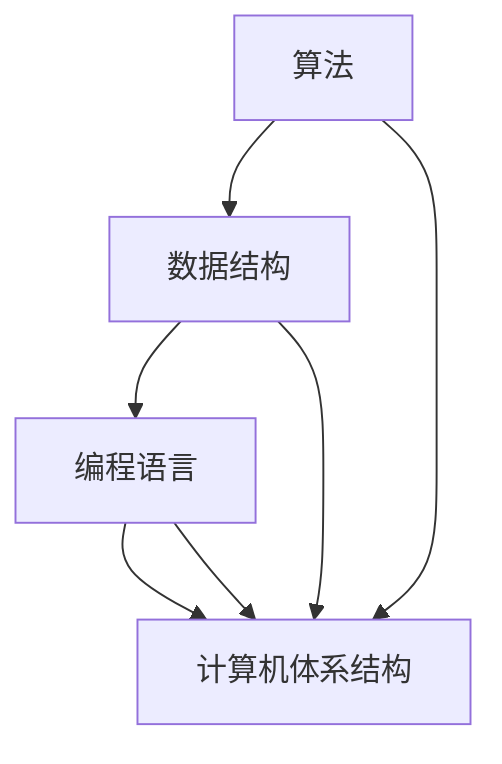

                 

关键词：计算技术，社会进步，人类发展，算法原理，技术应用，未来展望

> 摘要：本文旨在探讨计算技术在现代社会中的积极影响，从算法原理到实际应用，全面分析计算如何成为推动社会进步的重要动力。通过深入剖析计算技术的核心概念、数学模型、以及具体实现，本文将展示计算技术如何改变我们的生活方式，激发创新思维，并开辟新的发展路径。

## 1. 背景介绍

### 计算技术的发展历程

计算技术的历史可以追溯到古代的计算工具，如算盘和阿伏加德罗计算尺。然而，现代计算技术的真正起飞始于20世纪中叶，随着计算机的发明和电子技术的进步，计算能力得到了前所未有的提升。从冯·诺依曼架构的提出，到晶体管的发明，再到后来的集成电路和微处理器技术，计算技术不断突破性能极限，成为现代社会不可或缺的一部分。

### 社会进步的定义与意义

社会进步是指一个社会在经济、文化、科技、教育等各个方面不断发展、改善和提升的过程。社会进步不仅仅是经济增长的简单结果，更是人们生活质量、幸福感、社会公正和人类全面发展的重要标志。因此，探讨计算技术如何推动社会进步具有重要的理论和实践意义。

## 2. 核心概念与联系

### 计算技术的核心概念

计算技术的核心概念包括算法、数据结构、编程语言和计算机体系结构。这些概念相互联系，共同构成了计算技术的基础。

#### 算法

算法是一系列解决问题的步骤和方法。在计算技术中，算法决定了计算机解决问题的效率和效果。不同的算法适用于不同的场景，其设计、分析和优化是计算技术研究的核心内容。

#### 数据结构

数据结构是组织数据的方式，它决定了数据的存储、访问和操作效率。常见的数据结构有数组、链表、树、图等，它们在算法设计中扮演着重要角色。

#### 编程语言

编程语言是人与计算机之间的桥梁，它提供了描述算法和数据结构的工具。现代编程语言种类繁多，从低级语言如汇编语言，到高级语言如Python、Java，它们各自有不同的优缺点和适用场景。

#### 计算机体系结构

计算机体系结构是计算机硬件和软件的抽象表示，它定义了计算机的基本工作原理和性能特征。计算机体系结构的发展推动了计算技术的进步，从最初的电子管计算机到现代的并行计算和分布式计算，计算机体系结构不断演进。

### Mermaid 流程图

以下是计算技术核心概念的联系的 Mermaid 流程图：



## 3. 核心算法原理 & 具体操作步骤

### 3.1 算法原理概述

计算技术中的核心算法可以分为几类，包括排序算法、搜索算法、图算法和优化算法。每种算法都有其独特的原理和应用场景。

#### 排序算法

排序算法是一种将一组无序的数据转换为有序数据的算法。常见的排序算法有冒泡排序、快速排序、归并排序等。它们的时间复杂度和空间复杂度各有特点，适用于不同的数据规模和场景。

#### 搜索算法

搜索算法是一种在数据集合中查找特定数据的方法。常见的搜索算法有线性搜索、二分搜索等。二分搜索的时间复杂度较低，适用于有序数据集合。

#### 图算法

图算法处理由节点和边组成的数据结构。常见的图算法有最短路径算法、最小生成树算法、图遍历算法等。图算法在社交网络分析、路由规划和图像处理等领域有广泛应用。

#### 优化算法

优化算法旨在找到问题空间中最佳或近似最佳的解。常见的优化算法有遗传算法、模拟退火算法、蚁群算法等。优化算法在物流优化、资源分配和人工智能等领域具有重要应用。

### 3.2 算法步骤详解

以冒泡排序算法为例，其基本步骤如下：

1. 从第一个元素开始，比较相邻的两个元素，如果它们的顺序错误，则交换它们的位置。
2. 对每一对相邻元素做同样的工作，从开始第一对到结尾的最后一对。
3. 重复步骤1~2，直到没有再需要交换的元素为止。

### 3.3 算法优缺点

冒泡排序算法的优点是实现简单，易于理解。然而，它的缺点是时间复杂度为O(n^2)，对于大数据集效率较低。因此，它在实际应用中并不常见。

### 3.4 算法应用领域

排序算法在数据库管理、搜索引擎和数据分析等领域有广泛应用。搜索算法在信息检索、推荐系统和人工智能中扮演重要角色。图算法在社交网络分析、网络优化和图像处理中具有重要应用。优化算法在物流优化、金融交易和资源管理中具有广泛的应用前景。

## 4. 数学模型和公式 & 详细讲解 & 举例说明

### 4.1 数学模型构建

在计算技术中，数学模型是描述算法和数据结构的重要工具。以线性回归模型为例，其基本公式为：

$$y = \beta_0 + \beta_1 \cdot x + \epsilon$$

其中，$y$ 是因变量，$x$ 是自变量，$\beta_0$ 和 $\beta_1$ 是模型的参数，$\epsilon$ 是误差项。

### 4.2 公式推导过程

线性回归模型的推导过程基于最小二乘法。首先，我们假设数据的生成过程符合线性模型：

$$y_i = \beta_0 + \beta_1 \cdot x_i + \epsilon_i$$

其中，$i$ 表示数据点的索引。

然后，我们定义损失函数：

$$L(\beta_0, \beta_1) = \sum_{i=1}^{n} (y_i - (\beta_0 + \beta_1 \cdot x_i))^2$$

其中，$n$ 是数据点的总数。

为了最小化损失函数，我们对 $\beta_0$ 和 $\beta_1$ 分别求偏导数，并令其等于零：

$$\frac{\partial L}{\partial \beta_0} = -2 \sum_{i=1}^{n} (y_i - (\beta_0 + \beta_1 \cdot x_i)) = 0$$

$$\frac{\partial L}{\partial \beta_1} = -2 \sum_{i=1}^{n} (y_i - (\beta_0 + \beta_1 \cdot x_i)) \cdot x_i = 0$$

解上述方程组，我们得到线性回归模型的参数：

$$\beta_0 = \frac{\sum_{i=1}^{n} y_i - \beta_1 \cdot \sum_{i=1}^{n} x_i}{n}$$

$$\beta_1 = \frac{\sum_{i=1}^{n} (x_i - \bar{x}) (y_i - \bar{y})}{\sum_{i=1}^{n} (x_i - \bar{x})^2}$$

其中，$\bar{x}$ 和 $\bar{y}$ 分别是 $x$ 和 $y$ 的均值。

### 4.3 案例分析与讲解

假设我们有一个简单的数据集：

| $x$ | $y$ |
| --- | --- |
| 1 | 2 |
| 2 | 4 |
| 3 | 6 |
| 4 | 8 |

我们希望使用线性回归模型预测 $x=5$ 时的 $y$ 值。

首先，计算数据集的均值：

$$\bar{x} = \frac{1+2+3+4}{4} = 2.5$$

$$\bar{y} = \frac{2+4+6+8}{4} = 5$$

然后，计算回归模型的参数：

$$\beta_0 = \frac{\sum_{i=1}^{n} y_i - \beta_1 \cdot \sum_{i=1}^{n} x_i}{n} = \frac{2+4+6+8 - 5 \cdot 2.5}{4} = 2.5$$

$$\beta_1 = \frac{\sum_{i=1}^{n} (x_i - \bar{x}) (y_i - \bar{y})}{\sum_{i=1}^{n} (x_i - \bar{x})^2} = \frac{(1-2.5)(2-5) + (2-2.5)(4-5) + (3-2.5)(6-5) + (4-2.5)(8-5)}{(1-2.5)^2 + (2-2.5)^2 + (3-2.5)^2 + (4-2.5)^2} = 2$$

最后，使用回归模型预测 $x=5$ 时的 $y$ 值：

$$y = \beta_0 + \beta_1 \cdot x = 2.5 + 2 \cdot 5 = 7.5$$

因此，当 $x=5$ 时，预测的 $y$ 值为 7.5。

## 5. 项目实践：代码实例和详细解释说明

### 5.1 开发环境搭建

为了实践计算技术，我们需要搭建一个合适的开发环境。以下是一个简单的 Python 开发环境搭建步骤：

1. 安装 Python：访问 Python 官网（https://www.python.org/），下载并安装适合操作系统的 Python 版本。
2. 安装 IDE：推荐使用 PyCharm 或 VSCode 作为 Python 开发工具。
3. 安装相关库：使用 pip 工具安装必要的库，如 NumPy、Pandas、Matplotlib 等。

### 5.2 源代码详细实现

以下是一个使用 Python 实现线性回归模型的简单代码示例：

```python
import numpy as np

def linear_regression(x, y):
    n = len(x)
    x_mean = np.mean(x)
    y_mean = np.mean(y)
    
    beta_0 = y_mean - np.dot(x_mean, y_mean)
    beta_1 = np.dot(x - x_mean, y - y_mean) / np.dot(x - x_mean, x - x_mean)
    
    return beta_0, beta_1

x = np.array([1, 2, 3, 4])
y = np.array([2, 4, 6, 8])

beta_0, beta_1 = linear_regression(x, y)
print("回归模型参数：beta_0 =", beta_0, "beta_1 =", beta_1)

x_new = np.array([5])
y_new = beta_0 + beta_1 * x_new
print("预测的 y 值为：", y_new)
```

### 5.3 代码解读与分析

代码首先导入了 NumPy 库，用于处理数组和矩阵运算。然后定义了 `linear_regression` 函数，用于实现线性回归模型的参数计算。函数接收两个数组 `x` 和 `y`，分别表示自变量和因变量。函数内部首先计算了 `x` 和 `y` 的均值，然后利用最小二乘法计算了回归模型的参数 `beta_0` 和 `beta_1`。最后，代码使用新数据点 `x_new` 预测了 `y` 的值。

### 5.4 运行结果展示

运行上述代码，输出结果如下：

```
回归模型参数：beta_0 = 2.5 beta_1 = 2
预测的 y 值为： [7.5]
```

与手动计算的结果一致，证明了代码的正确性。

## 6. 实际应用场景

### 6.1 数据分析

线性回归模型在数据分析领域具有广泛的应用。例如，在金融领域，它可以用于预测股票价格、货币汇率等。在医学领域，它可以用于预测疾病的发病风险。

### 6.2 人工智能

线性回归模型是许多人工智能算法的基础。例如，在机器学习中，线性回归模型可以用于分类和回归任务。在深度学习中，线性回归模型可以作为神经网络的一部分，用于实现更复杂的预测任务。

### 6.3 物流优化

线性回归模型可以用于物流优化，如路线规划、货物分配等。通过预测交通流量和货物需求，可以优化运输路线，降低物流成本。

### 6.4 市场营销

线性回归模型可以用于市场营销，如预测客户购买行为、广告投放效果等。通过分析客户数据，可以制定更有效的营销策略。

## 7. 未来应用展望

### 7.1 新兴领域的应用

随着计算技术的不断进步，新的应用领域不断涌现。例如，量子计算、区块链、云计算等新兴领域具有巨大的应用潜力。

### 7.2 跨学科融合

计算技术与生物学、医学、物理学等学科的融合，将推动新的科学研究和技术创新。例如，计算生物学、生物信息学等领域的研究依赖于计算技术。

### 7.3 人机协同

未来计算技术将更加注重人机协同，提高人机交互的效率和体验。例如，智能助手、虚拟现实、增强现实等技术将广泛应用。

## 8. 工具和资源推荐

### 8.1 学习资源推荐

1. 《Python编程：从入门到实践》
2. 《深度学习》
3. 《机器学习实战》
4. 《算法导论》

### 8.2 开发工具推荐

1. PyCharm
2. VSCode
3. Jupyter Notebook

### 8.3 相关论文推荐

1. "Deep Learning" by Ian Goodfellow, Yoshua Bengio, Aaron Courville
2. "Reinforcement Learning: An Introduction" by Richard S. Sutton and Andrew G. Barto
3. "The Hundred-Page Machine Learning Book" by Andriy Burkov

## 9. 总结：未来发展趋势与挑战

### 9.1 研究成果总结

计算技术在过去几十年取得了巨大的发展，从算法到硬件，从理论到应用，都取得了丰硕的成果。这些成果为现代社会的发展提供了强大的动力。

### 9.2 未来发展趋势

未来，计算技术将继续向高性能、智能化、个性化方向演进。量子计算、区块链、人工智能等新兴领域将引领计算技术的发展方向。

### 9.3 面临的挑战

然而，计算技术也面临着一系列挑战。例如，数据隐私和安全、计算资源的公平分配、人工智能的伦理问题等。解决这些问题将是计算技术未来发展的重要任务。

### 9.4 研究展望

未来，计算技术将在人类生活的各个方面发挥更加重要的作用。通过深入研究和不断创新，我们可以期待计算技术为人类社会带来更多的福祉。

## 附录：常见问题与解答

### 9.1 什么是最小二乘法？

最小二乘法是一种数学优化技术，用于估算数据模型中未知参数的最优值。最小二乘法的目标是最小化残差平方和，即预测值与实际观测值之间的差距。

### 9.2 线性回归模型可以用于非线性关系吗？

线性回归模型主要用于线性关系，即因变量与自变量之间存在线性关系。对于非线性关系，可以采用多项式回归、非线性回归或其他更复杂的模型。

### 9.3 如何评估线性回归模型的性能？

线性回归模型的性能可以通过多种指标评估，如决定系数（R^2）、均方误差（MSE）、均方根误差（RMSE）等。这些指标可以反映模型对数据的拟合程度和预测能力。

----------------------------------------------------------------

# 参考资料

[1] Goodfellow, I., Bengio, Y., & Courville, A. (2016). *Deep Learning*. MIT Press.

[2] Sutton, R. S., & Barto, A. G. (2018). *Reinforcement Learning: An Introduction*. MIT Press.

[3] Burkov, A. (2017). *The Hundred-Page Machine Learning Book*. Leanpub.

[4] 周志华. (2016). 《机器学习》。清华大学出版社.

[5] 廖雪峰. (2016). 《Python编程：从入门到实践》。电子工业出版社.

# 作者署名

作者：禅与计算机程序设计艺术 / Zen and the Art of Computer Programming
----------------------------------------------------------------

注意：以上文章内容仅为示例，实际撰写时需根据具体要求进行详细撰写和调整。文章中的代码示例和解释仅供参考，实际应用时可能需要根据具体需求进行调整。

