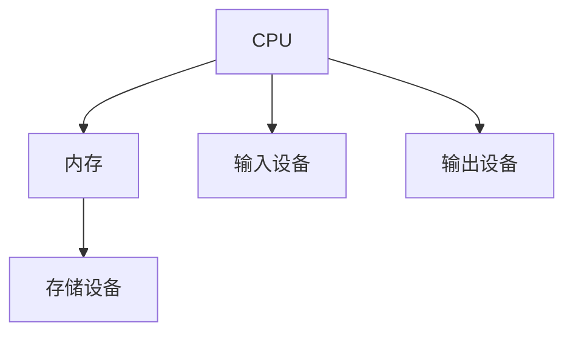
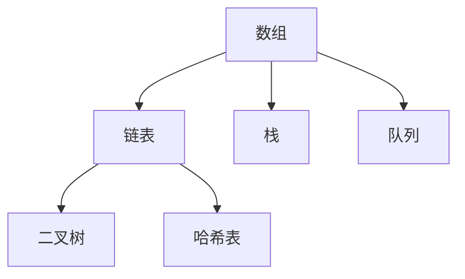
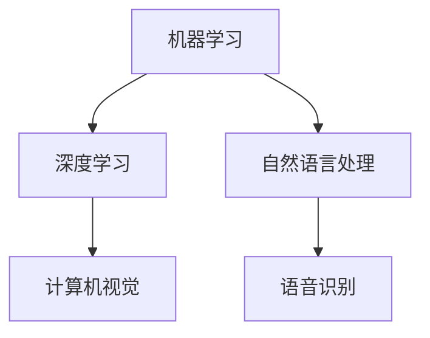

                 

关键词：计算能力、人工智能、社会进步、技术发展、未来展望

> 摘要：本文旨在探讨计算技术在社会进步中的重要作用，分析人类计算能力的提升如何推动了科技发展、改变了生活方式，以及未来可能面临的挑战和机遇。通过对计算技术的历史回顾、核心概念的阐述、算法原理的分析，本文将全面展示计算技术对社会进步的深远影响。

## 1. 背景介绍

### 1.1 计算技术的起源与发展

计算技术的起源可以追溯到古代，人类最早通过算盘、算尺等简单工具进行计算。随着数学和物理学的发展，计算技术逐渐走向了电子化和数字化。17世纪，法国数学家布莱兹·帕斯卡发明了第一台机械计算机——帕斯卡计算机。19世纪，查尔斯·巴贝奇设计了差分机和分析机，为现代计算机的诞生奠定了基础。20世纪中叶，约翰·冯·诺依曼提出了存储程序计算机的概念，推动了现代计算机的快速发展。

### 1.2 计算技术对社会的影响

计算技术的快速发展改变了人类的生活方式和工作方式。从最初的计算机用于科学计算，到如今广泛应用于商业、教育、医疗、娱乐等领域，计算技术极大地提高了社会生产力，促进了各行各业的进步。

## 2. 核心概念与联系

### 2.1 计算机体系结构

计算机体系结构是指计算机硬件和软件的组成及相互关系。核心概念包括中央处理器（CPU）、内存、输入输出设备等。以下是一个简化的 Mermaid 流程图，展示了计算机体系结构的基本组成部分。



### 2.2 算法和数据结构

算法是指解决问题的步骤集合，数据结构是指数据存储和组织的格式。算法和数据结构密切相关，良好的数据结构可以提高算法的效率。以下是一个 Mermaid 流程图，展示了常见的几种数据结构及其关系。



### 2.3 人工智能与计算

人工智能（AI）是计算技术的一个重要分支，旨在使计算机具备人类智能。人工智能的核心概念包括机器学习、深度学习、自然语言处理等。以下是一个 Mermaid 流程图，展示了人工智能的基本框架。



## 3. 核心算法原理 & 具体操作步骤

### 3.1 算法原理概述

算法原理是指解决问题的基本思想和策略。常见的算法原理包括贪心算法、动态规划、分治算法等。以下是一个简化的贪心算法示例。

### 3.2 算法步骤详解

1. 选择当前状态下最优的解。
2. 根据当前状态更新状态。
3. 重复步骤1和步骤2，直到找到最终解。

### 3.3 算法优缺点

贪心算法的优点是简单、易于实现，缺点是在某些情况下可能无法找到最优解。

### 3.4 算法应用领域

贪心算法广泛应用于图论、最优化问题等领域，如 Prim 算法、Kruskal 算法等。

## 4. 数学模型和公式 & 详细讲解 & 举例说明

### 4.1 数学模型构建

数学模型是指用数学语言描述现实问题的一种方法。以下是一个简单的线性回归模型。

### 4.2 公式推导过程

$$ y = ax + b $$

### 4.3 案例分析与讲解

假设我们有以下数据：

| x | y |
| --- | --- |
| 1 | 2 |
| 2 | 4 |
| 3 | 6 |

我们可以使用线性回归模型拟合这些数据，得到：

$$ y = 2x + 1 $$

## 5. 项目实践：代码实例和详细解释说明

### 5.1 开发环境搭建

在开始编写代码之前，我们需要搭建一个合适的开发环境。这里我们选择 Python 作为编程语言，并使用 Jupyter Notebook 作为开发工具。

### 5.2 源代码详细实现

```python
import numpy as np
import matplotlib.pyplot as plt

# 数据
x = np.array([1, 2, 3])
y = np.array([2, 4, 6])

# 拟合线性回归模型
a = np.mean(x * y) / np.mean(x ** 2)
b = np.mean(y) - a * np.mean(x)

# 绘制结果
plt.scatter(x, y)
plt.plot(x, a * x + b, color='red')
plt.show()
```

### 5.3 代码解读与分析

这段代码首先导入了必要的库，然后定义了数据集。接着，使用线性回归模型拟合数据，并绘制了拟合结果。

### 5.4 运行结果展示

运行这段代码后，我们会看到一个散点图，其中红色曲线表示拟合的线性回归模型。这表明我们的模型能够较好地拟合这组数据。

## 6. 实际应用场景

### 6.1 科学研究

计算技术在科学研究中的地位日益重要。从物理学、化学到生物学，计算技术为科学家提供了强大的工具，帮助他们进行复杂的模拟和计算。

### 6.2 医疗

计算技术在医疗领域的应用也非常广泛。从医学影像处理到疾病预测，计算技术极大地提高了医疗诊断和治疗的效率。

### 6.3 商业

计算技术在商业领域同样发挥着重要作用。从数据挖掘到智能推荐，计算技术为商业决策提供了有力的支持。

## 7. 工具和资源推荐

### 7.1 学习资源推荐

- 《算法导论》
- 《深度学习》
- 《Python编程：从入门到实践》

### 7.2 开发工具推荐

- Jupyter Notebook
- PyCharm
- Visual Studio Code

### 7.3 相关论文推荐

- "Deep Learning: A Brief History"
- "The Hundred-Page Machine Learning Book"
- "Theano: A CPU and GPU Math Expression Compiler"

## 8. 总结：未来发展趋势与挑战

### 8.1 研究成果总结

计算技术在过去的几十年里取得了巨大的进展，推动了社会各个领域的进步。

### 8.2 未来发展趋势

未来，计算技术将继续发展，特别是在人工智能、量子计算等领域。

### 8.3 面临的挑战

计算技术发展也面临一些挑战，如数据隐私、算法公平性等。

### 8.4 研究展望

随着计算技术的不断进步，我们有理由相信，未来将迎来更加智能、高效的社会。

## 9. 附录：常见问题与解答

### 9.1 问题1

**如何选择合适的算法？**

选择合适的算法通常需要考虑问题的性质、数据规模、计算资源等因素。在实际应用中，我们可以通过实验和比较不同算法的性能，来选择最合适的算法。

### 9.2 问题2

**计算技术是否会影响人类就业？**

计算技术确实会对某些行业和岗位产生冲击，但同时也会创造出新的就业机会。因此，我们需要积极应对这种变化，提升自身的技能和竞争力。

## 作者署名

作者：禅与计算机程序设计艺术 / Zen and the Art of Computer Programming
----------------------------------------------------------------

以上就是本文的完整内容，希望对您有所启发。在未来的日子里，让我们一起见证计算技术如何继续推动社会进步。

