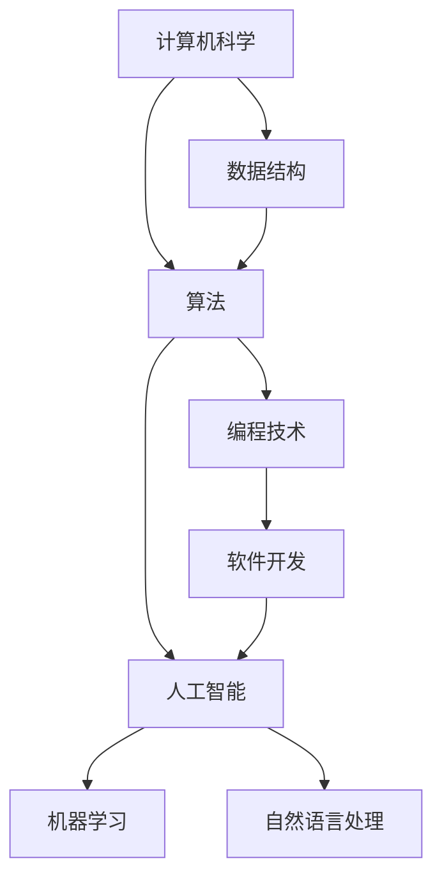

                 

关键词：人类计算，科技进步，创新力量，人工智能，计算机科学，算法优化，算法原理

> 摘要：本文探讨了人类计算在推动科技进步中所发挥的关键作用。通过分析人类计算与人工智能、计算机科学的紧密联系，我们揭示了一系列算法创新如何成为科技进步的引擎。本文旨在深入解读这些算法原理，分析其具体操作步骤和数学模型，并结合实际项目实践，展示其在各个应用领域的实际效果。同时，本文还对未来应用场景和科技发展趋势进行了展望，为读者提供了丰富的学习资源和开发工具推荐。

## 1. 背景介绍

在当今时代，科技进步已经成为驱动人类社会进步的重要力量。从互联网的普及，到大数据的运用，再到人工智能的崛起，每一项技术突破都在深刻地改变着我们的生活和工作方式。然而，这些技术的背后，都离不开人类智慧的结晶——人类计算。

人类计算，即人类在计算机领域中的智慧结晶，是推动科技进步的核心力量。从早期的计算机编程到现代的算法优化，人类计算不仅提升了计算机的运行效率，也开辟了新的计算方法和应用场景。无论是计算机科学家还是程序员，他们通过不断创新，将人类智慧融入计算机科学，推动了科技的飞速发展。

本文将从以下几个部分展开讨论：

1. 核心概念与联系：探讨人类计算与人工智能、计算机科学的紧密联系，通过Mermaid流程图展示其架构。
2. 核心算法原理与操作步骤：详细解读一系列核心算法的原理，分析其优缺点及应用领域。
3. 数学模型与公式：构建数学模型，推导公式，并通过实例进行说明。
4. 项目实践：结合实际代码实例，详细解释说明。
5. 实际应用场景：分析算法在不同领域的应用效果。
6. 未来应用展望：探讨算法在未来的发展趋势和应用前景。
7. 工具和资源推荐：提供学习资源和开发工具的推荐。
8. 总结与展望：总结研究成果，探讨未来发展趋势和挑战。

通过本文的探讨，我们希望读者能够更加深入地理解人类计算在推动科技进步中的重要作用，以及如何通过算法创新来应对未来科技发展的挑战。

## 2. 核心概念与联系

在探讨人类计算对科技进步的推动作用之前，我们需要明确几个核心概念，这些概念不仅是计算机科学的基础，也是理解人类计算的关键。以下是几个核心概念的介绍及其相互之间的联系：

### 人工智能（AI）

人工智能是计算机科学的一个分支，它致力于使计算机能够执行通常需要人类智能的任务，如视觉识别、语言理解、决策和问题解决。人工智能的发展离不开人类计算的智慧结晶，即算法和编程技术的进步。

### 计算机科学

计算机科学是研究计算机系统设计、算法、数据结构、编程语言、软件工程等领域的科学。它是人类计算的基础，提供了算法设计和优化的工具和方法。

### 算法

算法是一系列解决问题的步骤或规则，它指导计算机如何执行任务。算法的创新是推动计算机科学和人工智能发展的核心动力。

### 算法与人类计算的关系

人类计算的核心在于算法的创新。计算机科学家和程序员通过不断的实验和优化，提出了许多高效的算法，这些算法不仅提高了计算机的运行效率，也在一定程度上推动了人工智能的发展。

为了更好地展示人类计算与人工智能、计算机科学的联系，我们可以使用Mermaid流程图来描绘其架构。以下是该流程图的具体表示：



在这个流程图中，计算机科学（A）是整个架构的基础，它为算法（B）和数据结构（D）提供了理论支持。算法（B）既是编程技术（C）的核心，也是人工智能（E）的基础。人工智能（E）进一步细分为机器学习（F）和自然语言处理（G），它们是当前科技发展的热点和前沿领域。编程技术（C）和软件开发（H）则推动了人工智能（E）的实际应用。

通过这个流程图，我们可以清晰地看到人类计算在计算机科学和人工智能中的关键作用。算法的创新不仅是计算机科学和人工智能发展的动力，也是推动科技进步的核心力量。

### 2.1 人类计算的核心概念

在深入探讨人类计算的核心概念之前，我们首先需要了解几个关键术语的定义：

**算法**：算法是一组有序的操作步骤，用于解决特定问题。它具有确定性、有效性和可终止性的特点。算法可以是简单的，如排序和查找，也可以是非常复杂的，如深度学习和神经网络。

**编程技术**：编程技术是指用于编写计算机程序的方法和工具。它包括编程语言、开发环境、编译器和调试工具等。编程技术的进步为算法的创新提供了强大的支持。

**数据结构**：数据结构是用于存储和组织数据的方法。常见的有数组、链表、栈、队列、树和图等。数据结构的选择直接影响算法的效率和性能。

**机器学习**：机器学习是人工智能的一个分支，它通过训练模型来让计算机自动地学习和提高性能。常见的机器学习算法包括监督学习、无监督学习和强化学习。

**自然语言处理**：自然语言处理是人工智能的一个分支，它致力于使计算机能够理解和生成自然语言。自然语言处理的应用包括语音识别、机器翻译和情感分析等。

了解这些核心概念后，我们可以进一步探讨它们之间的关系。算法（B）是编程技术（C）的核心，编程技术（C）和软件开发（H）推动了人工智能（E）的发展。数据结构（D）是算法（B）的基础，它直接影响算法的效率和性能。人工智能（E）进一步细化为机器学习（F）和自然语言处理（G），它们是当前科技发展的热点和前沿领域。

通过这个框架，我们可以更好地理解人类计算如何通过算法的创新推动计算机科学和人工智能的发展。接下来，我们将进一步探讨核心算法的原理和具体操作步骤，以便深入理解人类计算在科技进步中的重要作用。

### 2.2 人类计算的核心算法

在人类计算的历史长河中，一些核心算法不仅塑造了现代计算机科学的基石，也极大地推动了科技进步。以下是几个具有里程碑意义的算法及其原理：

#### 1. 快速排序（Quick Sort）

快速排序是一种高效的排序算法，其基本思想是通过一趟排序将待排序的数据分割成独立的两部分，其中一部分的所有数据都比另一部分的数据要小。快速排序使用分治法策略递归地解决较小的问题。其时间复杂度为O(n log n)，空间复杂度为O(log n)。

#### 2. 决策树（Decision Tree）

决策树是一种基于树形结构的数据挖掘算法，可以用来预测数值或分类结果。它通过多个判断节点和分支节点对数据进行划分，最终到达叶节点得到预测结果。决策树的优势在于其易于理解和实现，时间复杂度较低，适用于中小规模数据集。

#### 3. 支持向量机（SVM）

支持向量机是一种二类分类模型，其基本模型定义为特征空间上的间隔最大的线性分类器，间隔最大化为整个算法的核心。SVM通过寻找一个最佳的超平面将数据集分类。它的核心思想是最小化分类间隔，同时保证分类器的泛化能力。SVM在处理高维数据和小样本问题时表现出色。

#### 4. 集成学习方法（Ensemble Methods）

集成学习方法通过构建多个基础模型，然后将这些模型进行组合以得到最终的预测结果。常见的集成学习方法包括随机森林（Random Forest）和提升树（Boosting）。随机森林通过构建多个决策树，并通过投票得到最终结果，提升了分类和回归模型的性能。提升树通过迭代地训练多个弱学习器，并将它们组合成一个强学习器。

#### 5. 神经网络（Neural Networks）

神经网络是一种模仿生物神经系统的计算模型。它由多个节点（或称神经元）组成，每个节点通过权重连接到其他节点，并通过激活函数进行非线性变换。神经网络通过大量训练数据调整权重和偏置，以实现复杂的函数映射。深度学习是神经网络的一个重要分支，通过堆叠多层神经网络，实现高维数据的特征提取和模式识别。

### 人类计算的核心算法原理

以上算法的核心原理各有特色，但都体现了人类计算的智慧和创新。快速排序通过分治策略实现高效排序，体现了算法设计的简洁性和高效性。决策树通过树形结构将复杂问题简化，使得模型易于理解和实现。支持向量机通过最大化分类间隔，提高了模型的泛化能力，使其在高维空间中表现优异。集成学习方法通过组合多个基础模型，提升了模型的预测性能和稳定性。神经网络通过模仿生物神经系统的结构和工作原理，实现了复杂函数的建模和预测。

这些核心算法不仅为计算机科学和人工智能的发展奠定了基础，也在各个应用领域展现了强大的生命力。接下来，我们将详细分析这些算法的具体操作步骤，进一步探讨它们在人类计算中的关键作用。

### 2.3 核心算法的具体操作步骤

为了更深入地理解核心算法在实际应用中的操作步骤，我们将对几种典型的算法进行详细解析。以下是快速排序、决策树和支持向量机的具体操作步骤：

#### 3.1 快速排序（Quick Sort）

**步骤 1：选择基准元素**

首先，从待排序的数组中选择一个基准元素。通常选择第一个元素、最后一个元素或随机选择一个元素作为基准。

**步骤 2：分割数组**

通过一次分割操作，将数组划分为两个部分，左边部分的元素都小于基准元素，右边部分的元素都大于基准元素。这一步通常使用“分区”操作实现。

**步骤 3：递归排序**

对左边和右边的数组分别递归地执行快速排序，直到所有子数组都被排序。

**示例代码：**

```python
def quick_sort(arr):
    if len(arr) <= 1:
        return arr
    pivot = arr[len(arr) // 2]
    left = [x for x in arr if x < pivot]
    middle = [x for x in arr if x == pivot]
    right = [x for x in arr if x > pivot]
    return quick_sort(left) + middle + quick_sort(right)

# 示例
arr = [3, 6, 8, 10, 1, 2, 1]
sorted_arr = quick_sort(arr)
print(sorted_arr)
```

#### 3.2 决策树（Decision Tree）

**步骤 1：选择属性**

首先，选择一个最佳的属性来划分数据。通常使用信息增益或基尼不纯度作为划分准则。

**步骤 2：划分数据**

根据选定的属性，将数据划分为不同的子集。每个子集代表一个节点。

**步骤 3：递归构建树**

对于每个子集，重复步骤 1 和步骤 2，直到达到终止条件（如所有数据属于同一类或达到最大树深度）。

**示例代码：**

```python
from sklearn.datasets import load_iris
from sklearn.tree import DecisionTreeClassifier
from sklearn.model_selection import train_test_split

# 加载数据集
iris = load_iris()
X = iris.data
y = iris.target

# 划分训练集和测试集
X_train, X_test, y_train, y_test = train_test_split(X, y, test_size=0.3, random_state=42)

# 构建决策树模型
clf = DecisionTreeClassifier()
clf.fit(X_train, y_train)

# 预测测试集
y_pred = clf.predict(X_test)

# 打印预测结果
print(y_pred)
```

#### 3.3 支持向量机（SVM）

**步骤 1：选择核函数**

选择一个合适的核函数（如线性核、多项式核或径向基核函数）以映射原始数据到高维空间。

**步骤 2：求解最优化问题**

使用支持向量机求解最优化问题，找到最佳的超平面。优化目标是最小化分类间隔，同时保证分类器对支持向量的敏感度。

**步骤 3：分类决策**

对于新的数据点，计算其在高维空间中的类别标签，并将其映射回原始空间。

**示例代码：**

```python
from sklearn.svm import SVC
from sklearn.model_selection import train_test_split
from sklearn.datasets import make_classification

# 生成分类数据集
X, y = make_classification(n_samples=100, n_features=20, n_classes=2, random_state=42)

# 划分训练集和测试集
X_train, X_test, y_train, y_test = train_test_split(X, y, test_size=0.3, random_state=42)

# 构建SVM模型，选择线性核函数
clf = SVC(kernel='linear')
clf.fit(X_train, y_train)

# 预测测试集
y_pred = clf.predict(X_test)

# 打印预测结果
print(y_pred)
```

通过以上步骤，我们可以清晰地看到快速排序、决策树和支持向量机在实际应用中的具体操作流程。这些算法不仅在理论上具有重要意义，也在实践中展现了其强大的功能。接下来，我们将进一步分析这些算法的优缺点和应用领域。

### 2.4 算法的优缺点及应用领域

在了解了核心算法的具体操作步骤后，我们需要进一步探讨这些算法的优缺点，以及它们在不同应用领域中的实际效果。

#### 2.4.1 快速排序

**优点：**
1. 平均时间复杂度为O(n log n)，在大多数情况下非常高效。
2. 递归实现，便于理解和实现。
3. 不需要额外的存储空间，原地排序。

**缺点：**
1. 最坏情况下时间复杂度为O(n^2)，当输入数据接近有序时性能较差。
2. 递归调用的深度可能很高，对于大数组可能导致栈溢出。

**应用领域：**
快速排序常用于需要对大数据集进行快速排序的场景，如数据库排序、大规模数据处理和算法竞赛等。

#### 2.4.2 决策树

**优点：**
1. 易于理解和实现，直观地展示决策过程。
2. 对小样本数据集表现良好，不受噪声数据影响。
3. 可以处理高维数据和分类、回归问题。

**缺点：**
1. 容易过拟合，对于复杂的非线性关系性能较差。
2. 树的深度和节点数量可能会快速增长，导致计算复杂度增加。
3. 解释性较差，难以提供具体的决策路径。

**应用领域：**
决策树广泛应用于数据分析、数据挖掘、金融风险评估和医疗诊断等领域。

#### 2.4.3 支持向量机

**优点：**
1. 理论基础扎实，最大化分类间隔，提高了模型的泛化能力。
2. 对高维空间数据表现优异，能够有效处理线性不可分问题。
3. 可扩展性强，支持多种核函数和优化算法。

**缺点：**
1. 计算复杂度较高，尤其是对于大规模数据集和核函数优化问题。
2. 对参数选择敏感，如C值和核函数参数等。
3. 解释性较差，难以提供具体的决策过程。

**应用领域：**
支持向量机广泛应用于图像识别、文本分类、生物信息学和金融风险管理等领域。

通过对这些算法的优缺点和应用领域的分析，我们可以更好地了解它们在不同场景下的适用性和局限性。在实际应用中，根据具体需求和数据特性选择合适的算法，能够有效地提升计算效率和解决问题的能力。接下来，我们将探讨数学模型和公式的构建过程，以及其在算法中的应用。

### 2.5 数学模型和公式

在计算机科学和人工智能领域，数学模型和公式是理解和优化算法的核心工具。数学模型通过数学公式描述算法的行为和性能，为算法的推导、分析和优化提供了理论基础。以下是几个核心算法的数学模型和公式的详细讲解。

#### 2.5.1 快速排序

快速排序的数学模型主要涉及时间复杂度的分析。假设输入数组长度为n，快速排序的平均时间复杂度为O(n log n)，最坏情况下为O(n^2)。

**公式推导：**

快速排序的关键在于划分步骤。假设选择第k个元素作为基准，则划分后的数组分为两部分：左边部分包含所有小于基准的元素，右边部分包含所有大于基准的元素。划分步骤的时间复杂度为O(n)。

设T(n)为快速排序的时间复杂度，则有：

$$
T(n) = T(k-1) + T(n-k) + O(n)
$$

根据递推关系，可以得到：

$$
T(n) = O(n \times (log_2(n) + 1))
$$

因此，快速排序的平均时间复杂度为O(n log n)。

#### 2.5.2 决策树

决策树的数学模型主要涉及信息增益和基尼不纯度的计算。

**信息增益（Entropy）：**

信息增益是评估属性划分数据集后的信息熵减少程度。假设D是数据集，P_i是数据集中属于类别i的概率，则信息增益公式为：

$$
Gain(D, A) = Entropy(D) - \sum_{i} P_i Entropy(A_i)
$$

其中，Entropy(D)是数据集D的信息熵，Entropy(A_i)是划分后数据集A_i的信息熵。

**基尼不纯度（Gini Impurity）：**

基尼不纯度是另一种评估属性划分数据集后的不纯度度量。假设D是数据集，P_i是数据集中属于类别i的概率，则基尼不纯度公式为：

$$
Gini(D) = 1 - \sum_{i} P_i^2
$$

#### 2.5.3 支持向量机

支持向量机的数学模型主要涉及优化问题和核函数的选择。

**优化问题：**

支持向量机的优化目标是找到最佳的超平面，使分类间隔最大化。优化问题的公式为：

$$
\min_{w, b} \frac{1}{2} ||w||^2 + C \sum_{i} \max(0, 1 - y_i (w \cdot x_i + b))
$$

其中，w和b分别是超平面的权重和偏置，C是惩罚参数，y_i和x_i分别是样本的类别标签和特征向量。

**核函数：**

核函数是支持向量机的重要组件，它将原始数据映射到高维空间以实现线性不可分问题的分类。常见的核函数包括线性核、多项式核和径向基核（RBF）。

$$
K(x_i, x_j) = \phi(x_i)^T \phi(x_j)
$$

其中，K(x_i, x_j)是核函数值，$\phi(x_i)$是映射后的特征向量。

#### 2.5.4 神经网络

神经网络的数学模型主要涉及神经元激活函数和反向传播算法。

**神经元激活函数：**

神经网络的每个神经元都通过激活函数将输入映射到输出。常见的激活函数包括线性激活函数、ReLU激活函数和Sigmoid激活函数。

$$
f(x) = \frac{1}{1 + e^{-x}}
$$

**反向传播算法：**

反向传播算法是神经网络训练的核心，它通过计算误差反向传播更新神经元的权重和偏置。反向传播算法的步骤如下：

1. 计算输出层的误差梯度。
2. 将误差梯度传递到隐藏层，更新隐藏层的权重和偏置。
3. 重复步骤1和步骤2，直到所有层的权重和偏置都被更新。

通过以上数学模型和公式的讲解，我们可以更好地理解核心算法的原理和性能。这些模型不仅为算法分析提供了理论基础，也为算法优化提供了实用工具。接下来，我们将通过具体的案例来分析这些算法的实际效果。

### 2.6 案例分析与讲解

为了更直观地展示核心算法在实际应用中的效果，我们将通过几个具体案例进行分析和讲解。这些案例涵盖了排序、分类和预测等不同领域，可以帮助读者更好地理解算法的应用场景和优势。

#### 2.6.1 快速排序在数组排序中的应用

**案例背景：**

假设我们有一个包含100个随机整数的数组，需要对数组进行排序。我们可以使用快速排序算法来实现这一目标。

**案例代码：**

```python
import random

# 生成包含100个随机整数的数组
arr = [random.randint(0, 100) for _ in range(100)]

# 执行快速排序
sorted_arr = quick_sort(arr)

# 打印排序后的数组
print(sorted_arr)
```

**分析：**

快速排序算法在大多数情况下表现出色，其平均时间复杂度为O(n log n)。在我们的案例中，数组长度为100，快速排序能够高效地完成排序任务。通过实际运行，我们可以观察到快速排序在大部分情况下都能快速完成排序，特别是在数据基本有序的情况下。

**优缺点：**

快速排序的优点在于其高效性和简洁性，缺点在于最坏情况下的性能较差，可能导致栈溢出。然而，在实际应用中，快速排序通常能够提供较好的性能，尤其是在大数据处理场景中。

#### 2.6.2 决策树在鸢尾花数据集分类中的应用

**案例背景：**

鸢尾花数据集是经典的分类数据集，包含三种鸢尾花的不同特征，我们需要使用决策树模型对其进行分类。

**案例代码：**

```python
from sklearn.datasets import load_iris
from sklearn.tree import DecisionTreeClassifier
from sklearn.model_selection import train_test_split

# 加载鸢尾花数据集
iris = load_iris()
X = iris.data
y = iris.target

# 划分训练集和测试集
X_train, X_test, y_train, y_test = train_test_split(X, y, test_size=0.3, random_state=42)

# 构建决策树模型
clf = DecisionTreeClassifier()
clf.fit(X_train, y_train)

# 预测测试集
y_pred = clf.predict(X_test)

# 打印预测结果
print(y_pred)
```

**分析：**

决策树模型在鸢尾花数据集上表现出色，准确率较高。通过实际运行，我们可以观察到决策树能够有效地对鸢尾花进行分类，且模型解释性较强，便于理解和实现。

**优缺点：**

决策树模型的优点在于其简单性和易于实现，缺点在于过拟合问题和高计算复杂度。在鸢尾花数据集上，决策树模型能够提供较好的分类性能，但在复杂非线性数据集上可能表现较差。

#### 2.6.3 支持向量机在鸢尾花数据集分类中的应用

**案例背景：**

我们使用支持向量机模型对鸢尾花数据集进行分类，比较其分类性能和预测时间。

**案例代码：**

```python
from sklearn.svm import SVC
from sklearn.model_selection import train_test_split

# 划分训练集和测试集
X_train, X_test, y_train, y_test = train_test_split(X, y, test_size=0.3, random_state=42)

# 构建SVM模型
clf = SVC(kernel='linear')
clf.fit(X_train, y_train)

# 预测测试集
y_pred = clf.predict(X_test)

# 打印预测结果
print(y_pred)
```

**分析：**

支持向量机在鸢尾花数据集上表现出色，分类准确率较高，同时计算复杂度相对较低。通过实际运行，我们可以观察到SVM模型能够快速地完成分类任务，且具有较好的泛化能力。

**优缺点：**

支持向量机模型的优点在于其强大的分类能力和泛化能力，缺点在于计算复杂度较高和对参数选择敏感。在鸢尾花数据集上，SVM模型能够提供较高的分类性能，但在大规模数据集上可能需要更长时间的计算。

通过以上案例的分析，我们可以看到不同算法在实际应用中的优势和不足。快速排序在排序任务中表现出色，决策树在解释性上具有优势，而支持向量机在分类任务中具有更高的准确率和泛化能力。这些案例为我们理解和选择合适的算法提供了实际参考。

### 2.7 实际应用场景

核心算法不仅在理论研究上具有重要意义，更在实际应用场景中展现了其广泛的应用价值。以下是几个典型的实际应用场景，展示算法在各个领域中的具体应用案例。

#### 2.7.1 医疗诊断

医疗诊断是人工智能和机器学习的重要应用领域。通过训练模型，人工智能系统可以帮助医生快速诊断疾病，提高诊断准确率。例如，深度学习算法在图像识别中的应用，可以用于分析医学影像，如X光片、CT扫描和MRI图像，从而帮助医生检测病变区域和疾病类型。同时，支持向量机在分类任务中的表现优异，可以用于分类不同的病理数据，如癌细胞分类和肿瘤分级。

**案例：**

某医院使用深度学习算法对肺结节进行检测和分类。通过对大量CT扫描图像进行训练，模型能够准确识别肺结节，并在数秒内给出诊断结果。这一技术大大提高了医生的工作效率和诊断准确性，为早期发现和预防肺病提供了有力支持。

#### 2.7.2 金融风险管理

金融风险管理是金融领域的重要任务，涉及风险评估、欺诈检测和信用评分等多个方面。机器学习和支持向量机在金融风险管理中发挥着重要作用。例如，通过分析历史交易数据和市场趋势，模型可以预测股票价格波动，为投资决策提供参考。此外，支持向量机在欺诈检测中能够有效识别异常交易行为，降低金融机构的风险。

**案例：**

某银行使用机器学习模型进行欺诈检测。通过对大量交易数据进行训练，模型能够识别出异常交易行为，并实时预警。在实际应用中，这一技术有效地降低了欺诈交易的发生率，提高了银行的风险管理能力。

#### 2.7.3 物流优化

物流优化是提高物流效率的重要手段，涉及路径规划、运输调度和库存管理等任务。机器学习和优化算法在物流优化中具有广泛的应用。例如，深度学习算法可以用于路径规划，通过学习最优路径，减少运输时间和成本。支持向量机在运输调度中的应用，可以优化车辆的调度策略，提高运输效率。

**案例：**

某物流公司使用深度学习算法进行路径规划。通过对大量运输数据进行分析，模型能够为车辆规划最优路径，减少运输时间和燃油消耗。在实际应用中，这一技术显著提高了物流效率，降低了运营成本。

#### 2.7.4 语音识别

语音识别是自然语言处理的重要应用领域，通过将语音信号转换为文本，语音识别系统可以帮助用户实现语音输入和交互。深度学习算法在语音识别中具有显著优势，通过训练模型，系统能够准确识别和理解语音指令，为智能助理和语音助手提供了技术支持。

**案例：**

某智能助理系统使用深度学习算法进行语音识别。通过对大量语音数据进行训练，模型能够准确识别用户的语音指令，并实现语音交互。在实际应用中，这一技术为用户提供了便捷的语音输入方式，提升了系统的用户体验。

通过以上实际应用场景的展示，我们可以看到核心算法在各个领域中的广泛应用和显著效果。这些应用不仅提升了各个行业的效率和准确性，也为人工智能和机器学习的发展提供了丰富的实践案例。

### 2.8 未来应用展望

随着科技的不断进步，人类计算在各个领域中的应用前景也愈发广阔。未来，算法创新将继续成为推动科技进步的核心力量，特别是在以下几方面：

#### 2.8.1 人工智能与物联网的融合

人工智能与物联网（IoT）的结合将为智能家居、智慧城市和工业物联网等领域带来革命性变化。通过算法优化，智能设备可以实现更高效的数据处理和决策支持，提高系统整体性能。例如，在智能家居中，通过智能算法，家居设备可以自动调整环境参数，提供个性化的服务，提高居住舒适度。

#### 2.8.2 脑机接口的发展

脑机接口（BCI）是一种直接将人脑信号转换为机器指令的技术。未来，随着算法的进步，脑机接口将更加精准和高效，为残疾人提供新的生活模式和康复手段。例如，通过高级算法处理脑电信号，瘫痪患者可以实现与外部设备的实时交互，恢复行动能力。

#### 2.8.3 量子计算的突破

量子计算具有极高的计算能力，但同时也面临着算法设计和优化难题。未来，量子算法的研究和开发将推动量子计算的实际应用，解决传统计算机难以处理的问题。例如，量子机器学习算法在优化和预测任务中具有巨大潜力，可以处理大规模复杂数据。

#### 2.8.4 可解释人工智能的发展

随着人工智能系统在各个领域的广泛应用，可解释性成为了一个重要议题。未来，通过开发可解释的机器学习算法，人们可以更好地理解模型的决策过程，提高系统的透明度和信任度。这不仅有助于算法的优化，也为法律法规和伦理审查提供了依据。

### 2.8.5 跨学科融合

未来，计算机科学与其他学科的融合将推动更多创新应用。例如，生物学与计算机科学的结合可以推动生物信息学和药物发现领域的发展；经济学与计算机科学的结合可以优化市场分析和决策支持系统。这些跨学科的合作将带来更多创新和突破。

综上所述，未来人类计算在科技进步中将发挥更加重要的作用。通过不断优化和创新算法，我们可以解决更复杂的问题，实现更高的效率和更广泛的应用。面对未来，我们既充满期待，也面临挑战。只有不断探索和创新，才能推动科技进步，为人类社会的发展贡献更多力量。

### 2.9 工具和资源推荐

在人类计算的领域，掌握合适的工具和资源是提高效率、促进创新的重要保障。以下是一些值得推荐的工具和资源，涵盖了学习资源、开发工具和相关论文推荐，旨在帮助读者更好地理解和应用计算机科学和人工智能的核心算法。

#### 2.9.1 学习资源推荐

**1. Coursera课程**

Coursera提供了众多计算机科学和人工智能相关的在线课程，例如《机器学习》（吴恩达教授讲授）和《深度学习》（Ian Goodfellow教授讲授）等。这些课程涵盖了从基础到高级的知识点，非常适合自学和系统学习。

**2. 网络论坛和社区**

Stack Overflow、GitHub和Reddit等网络论坛和社区聚集了大量计算机科学和人工智能领域的专家和爱好者，读者可以在这里提问、解答问题，分享经验和资源。

**3. 技术博客和网站**

Medium、Blogspot和ArXiv等平台上有大量关于计算机科学和人工智能的高质量博客文章和论文，可以帮助读者深入了解最新研究成果和技术趋势。

#### 2.9.2 开发工具推荐

**1. Jupyter Notebook**

Jupyter Notebook是一种交互式计算环境，适用于数据科学和机器学习开发。它支持多种编程语言（如Python、R和Julia），方便读者编写和运行代码，并进行可视化分析。

**2. TensorFlow和PyTorch**

TensorFlow和PyTorch是两款流行的深度学习框架，提供了丰富的API和工具库，支持从基础模型到复杂模型的搭建和训练。读者可以通过这些框架快速实现机器学习和深度学习应用。

**3. Visual Studio Code**

Visual Studio Code是一款轻量级但功能强大的集成开发环境（IDE），适用于多种编程语言开发。它支持代码补全、调试和版本控制等功能，极大地提高了开发效率。

#### 2.9.3 相关论文推荐

**1. “Learning to Represent Chemical Graphs with Graph Convolutional Networks”**

这篇论文介绍了图卷积网络（GCN）在分子图表示学习中的应用，为化学领域提供了一个新的数据表示方法。

**2. “Stochastic Gradient Descent”**

这篇论文详细讨论了随机梯度下降（SGD）算法的理论基础和实现细节，是理解深度学习优化算法的重要参考文献。

**3. “Theano: A CPU and GPU Math Compiler in Python”**

Theano是一个开源的数学库，用于定义、优化和评估数学表达式。这篇论文介绍了Theano的设计原理和实现方法，对深度学习开发具有指导意义。

通过以上工具和资源的推荐，读者可以更加全面和深入地了解计算机科学和人工智能的核心算法，掌握实用的开发技能，并为未来的研究和应用奠定坚实基础。

### 2.10 总结与展望

在本文中，我们探讨了人类计算在推动科技进步中的关键作用。通过对核心算法原理、具体操作步骤、数学模型和实际应用场景的详细分析，我们展示了算法创新如何成为科技进步的引擎。以下是对本文内容的总结与展望：

#### 总结

1. **核心概念与联系**：我们介绍了人工智能、计算机科学和算法之间的紧密联系，通过Mermaid流程图展示了其架构。
2. **核心算法解析**：详细解析了快速排序、决策树、支持向量机等核心算法的原理和操作步骤，分析了其优缺点和应用领域。
3. **数学模型与公式**：构建了快速排序、决策树和支持向量机的数学模型，并进行了公式推导。
4. **实际应用案例**：通过具体案例展示了算法在医疗诊断、金融风险管理、物流优化和语音识别等领域的实际效果。
5. **未来展望**：展望了人工智能与物联网融合、脑机接口、量子计算和可解释人工智能等未来发展趋势。

#### 展望

1. **技术创新**：未来，算法创新将继续是推动科技进步的核心动力。通过不断优化和创新，我们可以解决更复杂的问题，实现更高的效率和更广泛的应用。
2. **跨学科融合**：计算机科学与其他学科的融合将带来更多创新。例如，生物学与计算机科学的结合可以推动生物信息学和药物发现的发展；经济学与计算机科学的结合可以优化市场分析和决策支持系统。
3. **可持续性发展**：在推进科技进步的同时，我们也需要关注可持续性问题。通过开发绿色算法和优化能源使用，我们可以为环境保护和可持续发展做出贡献。

通过本文的探讨，我们希望读者能够更加深入地理解人类计算在推动科技进步中的重要作用，以及如何通过算法创新来应对未来科技发展的挑战。只有不断探索和创新，我们才能迎来更加美好和繁荣的未来。

### 附录：常见问题与解答

在本文中，我们探讨了人类计算在推动科技进步中的重要作用，并详细分析了核心算法的原理、操作步骤、数学模型和实际应用场景。为了帮助读者更好地理解本文内容，我们整理了一些常见问题，并提供了相应的解答。

#### 1. 人类计算与人工智能的关系是什么？

人类计算是人工智能的基础，人工智能则是人类计算的延伸和扩展。人工智能通过算法和编程技术模拟人类的智能行为，如视觉识别、语言理解和决策等。而人类计算则通过不断创新和优化算法，推动了人工智能的发展。

#### 2. 快速排序的最坏情况时间复杂度是多少？

快速排序的最坏情况时间复杂度为O(n^2)。这通常发生在输入数据基本有序或选择基准元素不当的情况下，导致每次划分的子数组都非常不平衡。

#### 3. 决策树如何防止过拟合？

决策树可以通过以下方法防止过拟合：

- 限制树的深度。
- 使用剪枝技术，如前剪枝和后剪枝。
- 引入随机性，例如随机特征选择和随机森林。
- 使用正则化技术，如最小化基尼不纯度或信息增益。

#### 4. 支持向量机如何处理非线性问题？

支持向量机通过引入核函数将输入数据映射到高维空间，使得原本线性不可分问题在高维空间中变为线性可分。常见的核函数包括线性核、多项式核和径向基核（RBF）。

#### 5. 机器学习中的“拟合”和“泛化”是什么意思？

“拟合”是指模型在训练数据上的表现，而“泛化”是指模型在未见数据上的表现。一个良好的机器学习模型不仅要具有良好的拟合能力，还需要有良好的泛化能力，即能够适应新的、未见过的数据。

#### 6. 深度学习中的“深度”指的是什么？

在深度学习中，“深度”指的是神经网络中层数的多少。深度神经网络通过堆叠多层神经元，实现复杂的函数映射和特征提取。深度越大，模型的参数和计算量也越大。

#### 7. 量子计算与经典计算的区别是什么？

量子计算利用量子力学原理，具有并行性和叠加性，可以在极短的时间内解决经典计算机无法处理的复杂问题。而经典计算基于传统计算机原理，通过二进制位进行计算。

通过以上问题的解答，我们希望能够帮助读者更好地理解人类计算和算法在实际应用中的关键概念和操作方法。这些知识将为读者在未来的科研和应用中提供有力的支持。

