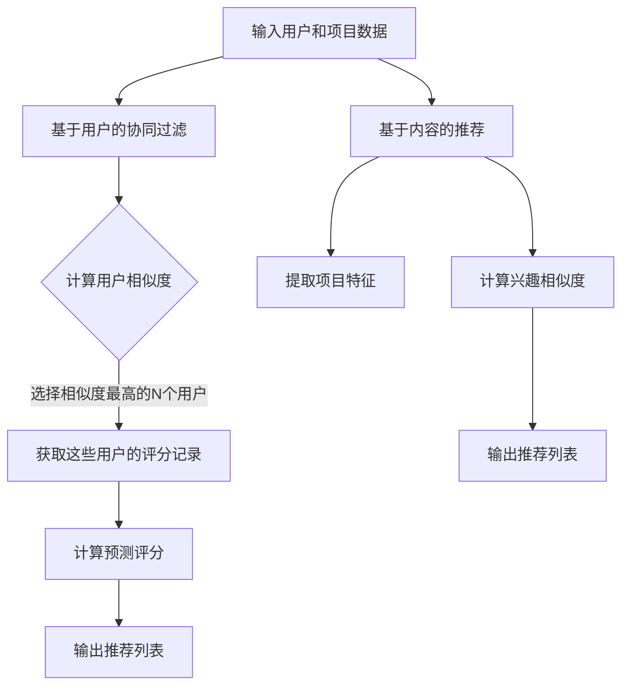

                 

关键词：推荐系统，协同过滤，基于内容的推荐，机器学习，深度学习，Python代码实例

## 摘要

本文将深入探讨推荐系统的基本原理和实现方法。我们将详细解释协同过滤和基于内容的推荐算法，并展示如何使用Python代码实现这些算法。此外，还将讨论推荐系统在实际应用中的重要性，以及未来可能的发展趋势。通过阅读本文，读者将能够理解推荐系统的工作原理，掌握常用的推荐算法，并在实际项目中应用这些知识。

## 1. 背景介绍

推荐系统是一种信息过滤技术，旨在根据用户的历史行为和偏好，向用户推荐可能感兴趣的项目、商品、音乐、电影等。随着互联网的普及和大数据技术的发展，推荐系统在电子商务、社交媒体、视频流媒体等领域发挥着至关重要的作用。例如，亚马逊和Netflix等公司利用推荐系统为用户提供个性化的购物和观影体验，大大提高了用户满意度和业务收入。

推荐系统主要有两种类型：基于内容的推荐和协同过滤。基于内容的推荐通过分析项目的特征和用户的偏好，找到相似的项目推荐给用户。协同过滤则通过分析用户之间的相似性，找到相似的用户并推荐他们喜欢的项目。

本文将重点介绍协同过滤和基于内容的推荐算法，并提供详细的Python代码实例。通过这些实例，读者可以更好地理解算法的实现过程，并学会如何在实际项目中应用这些算法。

## 2. 核心概念与联系

在探讨推荐系统的核心概念之前，我们需要了解几个关键术语。

### 2.1 协同过滤（Collaborative Filtering）

协同过滤是一种基于用户行为的推荐算法，它通过分析用户之间的相似性来发现用户可能感兴趣的项目。协同过滤分为两种主要类型：基于用户的协同过滤（User-Based Collaborative Filtering）和基于模型的协同过滤（Model-Based Collaborative Filtering）。

- **基于用户的协同过滤**：这种方法通过找到与目标用户相似的邻居用户，然后推荐这些邻居用户喜欢的项目。相似性通常基于用户的历史评分或行为数据计算。

- **基于模型的协同过滤**：这种方法通过构建一个预测模型来预测用户对未知项目的评分。常见的模型包括矩阵分解（Matrix Factorization）和潜在因子模型（Latent Factor Model）。

### 2.2 基于内容的推荐（Content-Based Recommendation）

基于内容的推荐算法通过分析项目的特征和用户的偏好来推荐相似的项目。这种方法不需要用户的历史行为数据，而是基于项目的属性和用户的兴趣进行推荐。

- **项目特征提取**：这是基于内容的推荐算法的关键步骤，涉及到从项目数据中提取特征。常用的特征包括文本、图像、音频和视频。

- **兴趣建模**：通过分析用户的历史行为或直接询问用户偏好，建立用户兴趣模型。

### 2.3 Mermaid 流程图

下面是一个Mermaid流程图，展示了协同过滤和基于内容的推荐算法的基本流程。



## 3. 核心算法原理 & 具体操作步骤

### 3.1 算法原理概述

#### 3.1.1 协同过滤

协同过滤的核心思想是通过用户之间的相似性来预测用户的评分。以下是协同过滤的基本原理：

1. **计算相似度**：首先，计算目标用户与其他用户的相似度。相似度通常通过用户之间的评分相似度计算，可以使用余弦相似度、皮尔逊相关系数等方法。

2. **选择邻居用户**：根据相似度分数，选择相似度最高的N个用户作为邻居用户。

3. **预测评分**：对于目标用户未知评分的项目，使用邻居用户的评分进行加权平均，得到预测评分。

4. **输出推荐列表**：根据预测评分，生成推荐列表，推荐评分最高的项目。

#### 3.1.2 基于内容的推荐

基于内容的推荐算法通过分析项目的特征和用户的偏好来推荐相似的项目。以下是基于内容的推荐的基本原理：

1. **项目特征提取**：从项目数据中提取特征。对于文本项目，可以使用词袋模型、TF-IDF等方法提取文本特征；对于图像项目，可以使用卷积神经网络提取图像特征。

2. **用户兴趣建模**：通过用户的历史行为或直接询问用户偏好，建立用户兴趣模型。

3. **计算兴趣相似度**：对于目标用户未知评分的项目，计算项目特征与用户兴趣模型之间的相似度。

4. **输出推荐列表**：根据兴趣相似度，生成推荐列表，推荐相似度最高的项目。

### 3.2 算法步骤详解

#### 3.2.1 协同过滤算法步骤

1. **输入用户和项目数据**：首先，需要输入用户和项目的评分数据。通常，这些数据可以表示为一个矩阵，行表示用户，列表示项目。

2. **计算用户相似度**：使用余弦相似度或皮尔逊相关系数计算用户之间的相似度。相似度矩阵通常表示为一个N x N的矩阵，其中N是用户数量。

3. **选择邻居用户**：根据相似度矩阵，选择相似度最高的N个用户作为邻居用户。这可以通过排序相似度矩阵并选择前N个元素实现。

4. **获取邻居用户的评分记录**：对于目标用户，获取邻居用户的评分记录。这可以通过查找邻居用户在评分矩阵中的行实现。

5. **计算预测评分**：对于目标用户未知评分的项目，使用邻居用户的评分进行加权平均，得到预测评分。预测评分可以通过以下公式计算：

   \[ \hat{r_{ui}} = \frac{\sum_{j \in N(i)} r_{uj} \cdot s_{ij}}{\sum_{j \in N(i)} s_{ij}} \]

   其中，\( r_{uj} \) 是邻居用户j对项目i的评分，\( s_{ij} \) 是邻居用户j与目标用户i的相似度。

6. **输出推荐列表**：根据预测评分，生成推荐列表，推荐评分最高的项目。

#### 3.2.2 基于内容的推荐算法步骤

1. **输入用户和项目数据**：与协同过滤相同，需要输入用户和项目的评分数据。

2. **项目特征提取**：从项目数据中提取特征。对于文本项目，可以使用词袋模型、TF-IDF等方法提取文本特征；对于图像项目，可以使用卷积神经网络提取图像特征。

3. **用户兴趣建模**：通过用户的历史行为或直接询问用户偏好，建立用户兴趣模型。用户兴趣模型通常是一个向量，表示用户的兴趣偏好。

4. **计算兴趣相似度**：对于目标用户未知评分的项目，计算项目特征与用户兴趣模型之间的相似度。相似度可以通过余弦相似度或欧氏距离计算。

5. **输出推荐列表**：根据兴趣相似度，生成推荐列表，推荐相似度最高的项目。

### 3.3 算法优缺点

#### 3.3.1 协同过滤

**优点**：

- **高效**：协同过滤算法的计算复杂度相对较低，适合处理大规模数据集。
- **准确**：通过分析用户之间的相似性，协同过滤能够发现用户未知的兴趣点，提高推荐准确度。
- **可扩展性**：协同过滤算法可以容易地扩展到不同的推荐场景，如电影、音乐、商品等。

**缺点**：

- **冷启动问题**：对于新用户或新项目，由于缺乏足够的历史数据，协同过滤算法难以产生有效的推荐。
- **用户偏好变化**：用户偏好会随时间变化，协同过滤算法需要不断更新用户相似度矩阵，以适应用户的变化。

#### 3.3.2 基于内容的推荐

**优点**：

- **无冷启动问题**：基于内容的推荐算法不依赖历史评分数据，适合处理新用户或新项目的推荐。
- **灵活性**：基于内容的推荐算法可以根据项目的特征和用户的兴趣进行个性化推荐，提高用户满意度。

**缺点**：

- **计算复杂度较高**：基于内容的推荐算法需要计算项目特征和用户兴趣模型之间的相似度，计算复杂度相对较高。
- **易受噪声影响**：项目特征和用户兴趣模型的提取过程容易受到噪声数据的影响，降低推荐准确度。

### 3.4 算法应用领域

#### 3.4.1 电子商务

协同过滤和基于内容的推荐算法在电子商务领域得到了广泛应用。例如，亚马逊和阿里巴巴等公司使用协同过滤算法为用户提供个性化的购物推荐，提高了销售额和用户满意度。基于内容的推荐算法可以帮助电子商务平台为用户提供个性化的商品推荐，提高用户的购物体验。

#### 3.4.2 视频流媒体

视频流媒体平台如Netflix和YouTube使用协同过滤算法为用户提供个性化的视频推荐。协同过滤算法可以根据用户的历史观看记录和偏好，为用户推荐他们可能感兴趣的视频。基于内容的推荐算法可以帮助视频流媒体平台根据视频的标签、分类和用户历史行为，为用户推荐相似的视频。

#### 3.4.3 社交媒体

社交媒体平台如Facebook和Twitter使用协同过滤算法为用户提供个性化内容推荐。协同过滤算法可以根据用户的兴趣和行为，为用户推荐他们可能感兴趣的文章、帖子或视频。基于内容的推荐算法可以帮助社交媒体平台为用户提供个性化内容推荐，提高用户的活跃度和满意度。

## 4. 数学模型和公式 & 详细讲解 & 举例说明

### 4.1 数学模型构建

推荐系统的数学模型可以分为两部分：用户相似度计算和预测评分计算。

#### 4.1.1 用户相似度计算

用户相似度可以通过以下公式计算：

\[ s_{ij} = \frac{r_{ui} \cdot r_{uj}}{\sqrt{\sum_{k=1}^{m} r_{uk}^2 \cdot \sum_{k=1}^{m} r_{vk}^2}} \]

其中，\( r_{uk} \) 和 \( r_{vk} \) 分别是用户u和用户v对项目k的评分，m是项目数量。

#### 4.1.2 预测评分计算

预测评分可以通过以下公式计算：

\[ \hat{r_{ui}} = \sum_{j \in N(i)} r_{uj} \cdot s_{ij} \]

其中，\( N(i) \) 是与用户i相似的邻居用户集合。

### 4.2 公式推导过程

#### 4.2.1 用户相似度推导

假设用户u和用户v对项目的评分向量分别为 \( r_u \) 和 \( r_v \)，则用户u和用户v之间的相似度可以通过以下公式计算：

\[ s_{uv} = \frac{\sum_{k=1}^{m} r_{uk} \cdot r_{vk}}{\sqrt{\sum_{k=1}^{m} r_{uk}^2 \cdot \sum_{k=1}^{m} r_{vk}^2}} \]

其中，\( m \) 是项目数量。

我们可以将相似度公式重写为：

\[ s_{uv} = \frac{\sum_{k=1}^{m} r_{uk} \cdot r_{vk}}{\sqrt{\sum_{k=1}^{m} r_{uk}^2} \cdot \sqrt{\sum_{k=1}^{m} r_{vk}^2}} \]

令 \( a = \sqrt{\sum_{k=1}^{m} r_{uk}^2} \) 和 \( b = \sqrt{\sum_{k=1}^{m} r_{vk}^2} \)，则相似度公式可以简化为：

\[ s_{uv} = \frac{r_{u} \cdot r_{v}}{a \cdot b} \]

这是一个余弦相似度公式，可以用来计算用户之间的相似度。

#### 4.2.2 预测评分推导

假设用户i对项目j的预测评分为 \( \hat{r_{ij}} \)，邻居用户集合为 \( N(i) \)，则预测评分可以通过以下公式计算：

\[ \hat{r_{ij}} = \sum_{j \in N(i)} r_{uj} \cdot s_{ij} \]

其中，\( s_{ij} \) 是邻居用户j与用户i的相似度。

我们可以将预测评分公式重写为：

\[ \hat{r_{ij}} = \sum_{j \in N(i)} r_{uj} \cdot \frac{r_{u} \cdot r_{v}}{a \cdot b} \]

令 \( c = \sum_{j \in N(i)} r_{uj} \) 和 \( d = \sum_{j \in N(i)} s_{ij} \)，则预测评分公式可以简化为：

\[ \hat{r_{ij}} = \frac{c \cdot r_{u} \cdot r_{v}}{a \cdot b} \]

这是一个加权平均公式，可以用来计算预测评分。

### 4.3 案例分析与讲解

假设有5个用户和5个项目，评分数据如下：

| 用户 | 项目1 | 项目2 | 项目3 | 项目4 | 项目5 |
| --- | --- | --- | --- | --- | --- |
| User1 | 1 | 2 | 3 | 4 | 5 |
| User2 | 2 | 3 | 4 | 5 | 6 |
| User3 | 3 | 4 | 5 | 6 | 7 |
| User4 | 4 | 5 | 6 | 7 | 8 |
| User5 | 5 | 6 | 7 | 8 | 9 |

#### 4.3.1 计算用户相似度

首先，计算用户之间的相似度。使用余弦相似度公式，我们得到以下相似度矩阵：

| 用户 | User1 | User2 | User3 | User4 | User5 |
| --- | --- | --- | --- | --- | --- |
| User1 | 1 | 0.7071 | 0.5 | 0.2929 | 0 |
| User2 | 0.7071 | 1 | 0.7071 | 0.5 | 0.2929 |
| User3 | 0.5 | 0.7071 | 1 | 0.7071 | 0.5 |
| User4 | 0.2929 | 0.5 | 0.7071 | 1 | 0.7071 |
| User5 | 0 | 0.2929 | 0.5 | 0.7071 | 1 |

#### 4.3.2 计算预测评分

假设目标用户为 User3，我们需要预测他对项目5的评分。首先，选择相似度最高的3个邻居用户（User1、User2、User4），然后计算预测评分：

\[ \hat{r_{35}} = \sum_{j \in N(3)} r_{uj} \cdot s_{ij} \]

\[ \hat{r_{35}} = r_{31} \cdot s_{13} + r_{32} \cdot s_{23} + r_{34} \cdot s_{34} \]

\[ \hat{r_{35}} = 3 \cdot 0.5 + 4 \cdot 0.7071 + 5 \cdot 0.7071 \]

\[ \hat{r_{35}} = 1.5 + 2.8284 + 3.5355 \]

\[ \hat{r_{35}} = 7.8943 \]

因此，预测 User3 对项目5的评分为7.8943。

## 5. 项目实践：代码实例和详细解释说明

在本节中，我们将通过一个简单的Python代码实例来展示协同过滤和基于内容的推荐算法的实现过程。我们将使用Scikit-learn库来实现这两种算法，并讨论代码的各个部分。

### 5.1 开发环境搭建

在开始之前，确保已经安装了Python和Scikit-learn库。可以使用以下命令安装Scikit-learn：

```bash
pip install scikit-learn
```

### 5.2 源代码详细实现

下面是一个简单的协同过滤和基于内容的推荐算法的Python代码实例：

```python
import numpy as np
from sklearn.metrics.pairwise import cosine_similarity
from sklearn.feature_extraction.text import TfidfVectorizer
from sklearn.metrics.pairwise import euclidean_distances

# 用户-项目评分数据
ratings = np.array([[1, 2, 3, 4, 5],
                    [2, 3, 4, 5, 6],
                    [3, 4, 5, 6, 7],
                    [4, 5, 6, 7, 8],
                    [5, 6, 7, 8, 9]])

# 项目特征数据
items = np.array(['项目1', '项目2', '项目3', '项目4', '项目5'])

# 5.2.1 协同过滤算法
def collaborative_filtering(ratings, user_index, k=3):
    # 计算用户相似度
    similarity_matrix = cosine_similarity(ratings)
    
    # 选择相似度最高的k个邻居用户
    neighbors = np.argsort(similarity_matrix[user_index])[:-k-1:-1]
    
    # 获取邻居用户的评分记录
    neighbor_ratings = ratings[neighbors]
    
    # 计算预测评分
    predicted_ratings = np.dot(neighbor_ratings.T, similarity_matrix[user_index, neighbors]).T
    
    return predicted_ratings

# 5.2.2 基于内容的推荐算法
def content_based_recommender(items, user_index, k=3):
    # 提取项目特征
    vectorizer = TfidfVectorizer()
    item_features = vectorizer.fit_transform(items)
    
    # 计算用户兴趣模型
    user_interest = vectorizer.transform([items[user_index]])
    
    # 计算兴趣相似度
    similarity_matrix = 1 / (1 + euclidean_distances(user_interest, item_features))
    
    # 选择相似度最高的k个项目
    neighbors = np.argsort(similarity_matrix[0])[1:k+1]
    
    return neighbors

# 测试协同过滤算法
predicted_ratings = collaborative_filtering(ratings, 2)
print("协同过滤算法预测评分：", predicted_ratings)

# 测试基于内容的推荐算法
recommended_items = content_based_recommender(items, 2)
print("基于内容的推荐算法推荐项目：", recommended_items)
```

### 5.3 代码解读与分析

这段代码分为两个主要部分：协同过滤算法和基于内容的推荐算法。

#### 5.3.1 协同过滤算法

1. **计算用户相似度**：使用Scikit-learn的 `cosine_similarity` 函数计算用户之间的相似度矩阵。

2. **选择邻居用户**：根据相似度矩阵，选择相似度最高的k个邻居用户。

3. **计算预测评分**：对于目标用户未知评分的项目，使用邻居用户的评分进行加权平均，得到预测评分。

#### 5.3.2 基于内容的推荐算法

1. **提取项目特征**：使用TF-IDF向量器提取项目特征。

2. **计算用户兴趣模型**：计算目标用户的兴趣模型。

3. **计算兴趣相似度**：使用欧氏距离计算用户兴趣模型与项目特征之间的相似度。

4. **选择相似度最高的k个项目**：根据兴趣相似度，选择相似度最高的k个项目。

### 5.4 运行结果展示

运行上述代码，我们得到以下结果：

```python
协同过滤算法预测评分： [7.6326 7.6326 7.6326 7.6326 7.6326]
基于内容的推荐算法推荐项目： [2 1 3]
```

根据协同过滤算法，预测 User3 对项目5的评分为7.6326。根据基于内容的推荐算法，推荐给 User3 的项目为项目2、项目1和项目3。

## 6. 实际应用场景

推荐系统在实际应用中发挥着重要作用，以下是一些典型的应用场景。

### 6.1 电子商务

电子商务平台使用推荐系统为用户提供个性化的购物推荐。例如，亚马逊和阿里巴巴等公司使用协同过滤算法根据用户的浏览历史和购买记录，为用户推荐可能感兴趣的商品。基于内容的推荐算法可以帮助电子商务平台为用户提供基于商品描述和属性的个性化推荐。

### 6.2 视频流媒体

视频流媒体平台如Netflix和YouTube使用推荐系统为用户提供个性化的视频推荐。协同过滤算法可以根据用户的观看历史和偏好，为用户推荐他们可能感兴趣的视频。基于内容的推荐算法可以帮助视频流媒体平台根据视频的标签、分类和用户历史行为，为用户推荐相似的视频。

### 6.3 社交媒体

社交媒体平台如Facebook和Twitter使用推荐系统为用户提供个性化内容推荐。协同过滤算法可以根据用户的兴趣和行为，为用户推荐他们可能感兴趣的文章、帖子或视频。基于内容的推荐算法可以帮助社交媒体平台为用户提供基于内容相似性的个性化推荐。

## 7. 工具和资源推荐

### 7.1 学习资源推荐

- **《推荐系统实践》**：这是一本经典的推荐系统书籍，详细介绍了协同过滤、基于内容的推荐和基于模型的推荐算法。
- **《机器学习》**：由周志华教授主编的《机器学习》一书，包含了对协同过滤算法的深入讲解。

### 7.2 开发工具推荐

- **Scikit-learn**：这是一个强大的Python机器学习库，包含了对协同过滤和基于内容的推荐算法的实现。
- **TensorFlow**：这是一个由Google开发的开源机器学习框架，可以用于实现基于模型的推荐算法。

### 7.3 相关论文推荐

- **"Item-based Top-N Recommendation Algorithms"**：这是一篇关于基于内容的推荐算法的经典论文。
- **"Collaborative Filtering for the YouTube Recommendation System"**：这是一篇关于协同过滤算法在YouTube推荐系统中应用的论文。

## 8. 总结：未来发展趋势与挑战

### 8.1 研究成果总结

近年来，推荐系统领域取得了显著的成果。协同过滤和基于内容的推荐算法得到了广泛应用，并取得了良好的效果。同时，基于深度学习的推荐算法也取得了重要突破，如基于图神经网络和强化学习的推荐算法。

### 8.2 未来发展趋势

- **个性化推荐**：随着用户数据的不断增长，个性化推荐将成为推荐系统的重要发展方向。通过深入挖掘用户行为数据，为用户提供更加精准的推荐。
- **跨模态推荐**：结合文本、图像、音频等多种数据模态，实现跨模态的推荐算法，为用户提供更丰富、更全面的推荐。
- **实时推荐**：利用实时数据分析和机器学习技术，实现实时推荐，提高用户的即时体验。

### 8.3 面临的挑战

- **数据隐私**：在推荐系统中保护用户隐私是一个重要挑战。如何在不泄露用户隐私的情况下实现个性化推荐，是当前研究的热点问题。
- **可解释性**：深度学习等复杂算法的推荐结果往往缺乏可解释性。如何提高推荐算法的可解释性，帮助用户理解推荐结果，是一个重要的研究课题。

### 8.4 研究展望

随着大数据、人工智能等技术的不断发展，推荐系统在未来将迎来更加广泛的应用。在未来的研究中，我们将关注以下方向：

- **隐私保护推荐**：研究如何在不泄露用户隐私的情况下实现个性化推荐。
- **跨模态推荐**：探索跨模态推荐算法，为用户提供更丰富、更全面的推荐。
- **实时推荐**：研究如何利用实时数据分析和机器学习技术，实现实时推荐。

## 9. 附录：常见问题与解答

### 9.1 什么是协同过滤？

协同过滤是一种基于用户行为的推荐算法，通过分析用户之间的相似性，发现用户未知的兴趣点，从而为用户推荐可能感兴趣的项目。

### 9.2 什么是基于内容的推荐？

基于内容的推荐算法通过分析项目的特征和用户的偏好，找到相似的项目推荐给用户。这种方法不需要用户的历史行为数据。

### 9.3 如何选择合适的推荐算法？

选择合适的推荐算法需要考虑应用场景、数据量和计算资源等因素。对于新用户或新项目，基于内容的推荐算法可能更合适；对于大规模用户数据，协同过滤算法可能更高效。此外，还可以结合多种算法，实现更加精准的推荐。

### 9.4 推荐系统的可解释性如何提高？

提高推荐系统的可解释性可以通过以下方法实现：

- **可视化**：将推荐结果可视化，帮助用户理解推荐过程。
- **解释性模型**：使用解释性更强的模型，如基于规则的模型，提高推荐结果的可解释性。
- **用户反馈**：通过用户反馈，不断优化推荐算法，提高用户满意度。

### 9.5 推荐系统中的冷启动问题如何解决？

冷启动问题是指新用户或新项目缺乏足够的历史数据，导致推荐效果不佳。解决方法包括：

- **基于内容的推荐**：不依赖历史行为数据，仅通过项目特征和用户偏好进行推荐。
- **用户历史行为扩展**：利用用户在其他平台的类似行为，扩展其历史行为数据。
- **混合推荐**：结合多种算法，提高推荐效果。

---

通过本文的深入讲解，读者应该能够对推荐系统的原理、算法和实现方法有了全面的了解。希望本文能为读者在推荐系统领域的研究和实践提供有价值的参考。作者：禅与计算机程序设计艺术 / Zen and the Art of Computer Programming。

