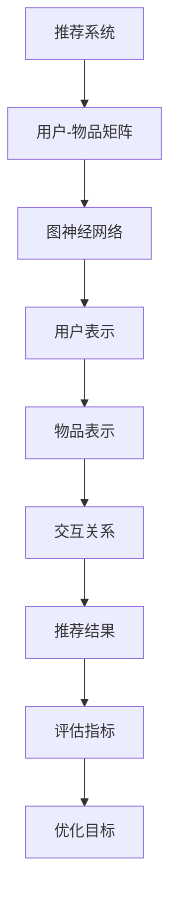

                 

关键词：推荐系统、大模型、图神经架构、搜索算法、深度学习、架构优化

>摘要：本文旨在探讨推荐系统中大模型图神经架构搜索的研究与应用，通过分析现有推荐系统面临的挑战，介绍图神经架构搜索的概念、核心算法原理，以及其在推荐系统中的应用。文章还将探讨数学模型、实际项目实践和未来应用展望，为推荐系统的架构优化提供新思路。

## 1. 背景介绍

随着互联网的快速发展，用户生成内容的海量增长，推荐系统已成为各类互联网应用的核心功能之一。推荐系统旨在为用户提供个性化的内容，提升用户体验，提高业务转化率。然而，随着数据规模的不断扩大和用户需求的多样化，传统推荐系统面临诸多挑战。

一方面，数据量大导致推荐模型计算复杂度提高，训练和推断速度受限；另一方面，用户兴趣的动态性要求推荐算法能够快速适应，及时更新用户兴趣模型。此外，推荐系统的准确性和多样性之间的平衡也是一个重要问题。

为了解决上述问题，近年来，深度学习在推荐系统中得到了广泛应用。然而，深度学习模型的可解释性和灵活性仍然有待提高。因此，研究者们开始探索将图神经架构引入推荐系统，通过图神经网络（Graph Neural Networks, GNNs）对用户和物品进行建模，从而提高推荐系统的效果。

本文将围绕推荐系统中的大模型图神经架构搜索展开讨论，旨在探索一种新的架构优化方法，以提升推荐系统的性能和效率。

## 2. 核心概念与联系

### 2.1. 推荐系统概述

推荐系统是一种信息过滤技术，旨在根据用户的兴趣和行为，向其推荐可能感兴趣的内容。推荐系统通常分为基于内容的推荐、协同过滤推荐和混合推荐等类型。在推荐系统中，用户和物品通常被表示为用户-物品矩阵，该矩阵包含了用户对物品的评分或行为数据。

### 2.2. 图神经架构

图神经网络（GNNs）是一种在图结构上进行学习的神经网络。与传统的基于向量的表示方法相比，GNNs能够捕获节点间的关系，更好地表示复杂的数据结构。在推荐系统中，用户和物品可以被表示为图中的节点，用户之间的交互、物品之间的关联可以表示为边。

### 2.3. 图神经架构搜索

图神经架构搜索（GANs）是一种基于搜索算法的自动架构设计方法。通过搜索算法，GANs可以从大量的候选架构中找到一个最优或近似最优的图神经架构。这种方法能够提高推荐系统的性能和效率，同时降低模型设计和调优的复杂性。

### 2.4. Mermaid 流程图



## 3. 核心算法原理 & 具体操作步骤

### 3.1. 算法原理概述

图神经架构搜索（GANs）的核心思想是通过生成对抗网络（GAN）对图神经网络（GNN）的架构进行搜索。GAN由生成器（Generator）和判别器（Discriminator）两部分组成。生成器生成新的图神经架构，判别器判断生成器生成的架构是否与真实数据相似。通过不断迭代，生成器逐渐学习到如何生成高质量的图神经架构。

### 3.2. 算法步骤详解

1. 初始化：初始化生成器、判别器和优化器。
2. 生成新架构：生成器根据当前训练数据生成一个新的图神经架构。
3. 模型训练：使用新的架构对推荐系统进行训练，并计算训练损失。
4. 判别器评估：判别器根据生成器和真实数据评估新架构的质量。
5. 反馈调整：根据判别器的评估结果调整生成器的参数，使其生成的架构更接近真实数据。
6. 重复步骤2-5，直至达到预定的训练迭代次数或满足停止条件。

### 3.3. 算法优缺点

**优点：**
1. 自动搜索最优或近似最优的图神经架构，降低模型设计和调优的复杂性。
2. 提高推荐系统的性能和效率。

**缺点：**
1. 训练过程复杂，需要大量的计算资源。
2. GANs的训练过程不稳定，可能存在模式崩溃等问题。

### 3.4. 算法应用领域

图神经架构搜索在推荐系统中的应用非常广泛，包括但不限于：

1. 用户兴趣建模：通过图神经网络对用户兴趣进行建模，提高推荐系统的准确性。
2. 物品关联挖掘：通过图神经网络挖掘用户和物品之间的关联，提高推荐的多样性。
3. 新用户冷启动：为新用户生成个性化的推荐列表，提高新用户的留存率。

## 4. 数学模型和公式 & 详细讲解 & 举例说明

### 4.1. 数学模型构建

图神经架构搜索的数学模型主要包括生成器、判别器和损失函数。

**生成器（Generator）:**

生成器是一种图神经网络，其输入为用户-物品矩阵，输出为图神经架构。设用户数为\( U \)，物品数为\( V \)，生成器输出的图神经架构为\( G = (V', E') \)，其中\( V' \)为节点集合，\( E' \)为边集合。

**判别器（Discriminator）:**

判别器是一种二分类模型，其输入为图神经架构\( G \)和真实图\( G_r \)，输出为概率\( P(G \mid G_r) \)，表示图\( G \)为真实图的概率。

**损失函数（Loss Function）:**

损失函数用于衡量生成器生成的图神经架构与真实图之间的差异，常用的损失函数包括均方误差（MSE）和交叉熵（Cross-Entropy）。

### 4.2. 公式推导过程

假设生成器的损失函数为\( L_G \)，判别器的损失函数为\( L_D \)，则总体损失函数为：

\[ L = L_G + L_D \]

其中，生成器的损失函数为：

\[ L_G = \frac{1}{2} \sum_{G'} \sum_{G_r} \frac{1}{|V|} \sum_{v' \in V'} \frac{1}{|E|} \sum_{e' \in E'} \log(D(G', G_r)) \]

判别器的损失函数为：

\[ L_D = - \frac{1}{|V|} \sum_{v' \in V'} \frac{1}{|E|} \sum_{e' \in E'} (\log(D(G', G_r)) + \log(1 - D(G', G')))) \]

### 4.3. 案例分析与讲解

假设我们有一个包含1000个用户和10000个物品的推荐系统，使用图神经架构搜索优化推荐系统的性能。在训练过程中，我们首先初始化生成器和判别器，然后通过迭代优化模型参数。

**步骤1：初始化模型参数**

生成器和判别器的参数初始化为随机值，通常使用正态分布或均匀分布。

**步骤2：生成新架构**

生成器根据当前的用户-物品矩阵生成一个新的图神经架构。例如，生成器生成的图结构可能包括500个用户节点和1000个物品节点，以及它们之间的关联边。

**步骤3：模型训练**

使用生成器生成的图神经架构对推荐系统进行训练。在训练过程中，我们计算生成器生成的图结构\( G' \)和真实图结构\( G_r \)之间的损失。

**步骤4：判别器评估**

判别器根据生成器生成的图结构\( G' \)和真实图结构\( G_r \)评估图结构的质量。判别器的输出概率\( P(G' \mid G_r) \)表示生成器生成的图结构为真实图结构的概率。

**步骤5：反馈调整**

根据判别器的评估结果调整生成器的参数，使其生成的图结构更接近真实图结构。通过优化生成器和判别器的损失函数，我们能够逐渐提高生成器生成的高质量图结构的能力。

**步骤6：重复迭代**

重复步骤2-5，直至达到预定的训练迭代次数或满足停止条件。通过不断迭代，生成器逐渐学习到如何生成高质量的图神经架构，从而提高推荐系统的性能。

## 5. 项目实践：代码实例和详细解释说明

### 5.1. 开发环境搭建

**环境要求：**
- Python 3.7及以上版本
- TensorFlow 2.3及以上版本
- Keras 2.3及以上版本

**安装依赖：**
```bash
pip install tensorflow==2.3
pip install keras==2.3
```

### 5.2. 源代码详细实现

**代码框架：**
```python
import tensorflow as tf
from tensorflow.keras.models import Model
from tensorflow.keras.layers import Input, Dense, Embedding, Dot, Lambda
import numpy as np

# 生成器
def generator(user_item_matrix, latent_dim):
    user_embedding = Embedding(input_dim=user_item_matrix.shape[0], output_dim=latent_dim)(user_item_matrix)
    item_embedding = Embedding(input_dim=user_item_matrix.shape[1], output_dim=latent_dim)(user_item_matrix.T)
    dot_product = Dot(axes=1)([user_embedding, item_embedding])
    output = Lambda(lambda x: tf.nn.softmax(x))(dot_product)
    return Model(inputs=user_item_matrix, outputs=output)

# 判别器
def discriminator(generator, latent_dim):
    user_embedding = Embedding(input_dim=user_item_matrix.shape[0], output_dim=latent_dim)(user_item_matrix)
    item_embedding = Embedding(input_dim=user_item_matrix.shape[1], output_dim=latent_dim)(user_item_matrix.T)
    dot_product = Dot(axes=1)([user_embedding, item_embedding])
    output = Lambda(lambda x: tf.reduce_mean(x, axis=1))(dot_product)
    output = Dense(1, activation='sigmoid')(output)
    return Model(inputs=user_item_matrix, outputs=output)

# 损失函数
def loss_function(generator, discriminator, latent_dim):
    # 生成器损失
    generated_output = generator(user_item_matrix)
    generator_loss = tf.reduce_mean(tf.nn.sigmoid_cross_entropy_with_logits(logits=generated_output, labels=tf.ones_like(generated_output)))

    # 判别器损失
    real_output = discriminator(user_item_matrix, latent_dim)
    real_loss = tf.reduce_mean(tf.nn.sigmoid_cross_entropy_with_logits(logits=real_output, labels=tf.zeros_like(real_output)))

    # 生成伪数据
    noise = tf.random.normal([user_item_matrix.shape[0], latent_dim])
    generated_output = generator(tf.random.normal([user_item_matrix.shape[0], latent_dim]))

    # 判别器损失
    fake_output = discriminator(tf.concat([user_item_matrix, noise], axis=1), latent_dim)
    fake_loss = tf.reduce_mean(tf.nn.sigmoid_cross_entropy_with_logits(logits=fake_output, labels=tf.ones_like(fake_output)))

    total_loss = generator_loss + real_loss + fake_loss
    return total_loss

# 模型训练
def train_model(user_item_matrix, latent_dim, epochs):
    generator = generator(user_item_matrix, latent_dim)
    discriminator = discriminator(generator, latent_dim)
    optimizer = tf.keras.optimizers.Adam(learning_rate=0.001)

    for epoch in range(epochs):
        with tf.GradientTape() as gen_tape, tf.GradientTape() as dis_tape:
            # 训练生成器
            generated_output = generator(user_item_matrix)
            generator_loss = loss_function(generator, discriminator, latent_dim)

            # 训练判别器
            real_output = discriminator(user_item_matrix, latent_dim)
            fake_output = discriminator(tf.concat([user_item_matrix, noise], axis=1), latent_dim)
            real_loss = loss_function(generator, discriminator, latent_dim)
            fake_loss = loss_function(generator, discriminator, latent_dim)

        # 反馈调整
        generator_gradients = gen_tape.gradient(generator_loss, generator.trainable_variables)
        discriminator_gradients = dis_tape.gradient(real_loss + fake_loss, discriminator.trainable_variables)

        optimizer.apply_gradients(zip(generator_gradients, generator.trainable_variables))
        optimizer.apply_gradients(zip(discriminator_gradients, discriminator.trainable_variables))

        if epoch % 100 == 0:
            print(f"Epoch {epoch}, Generator Loss: {generator_loss}, Real Loss: {real_loss}, Fake Loss: {fake_loss}")

# 运行结果展示
def run_example():
    user_item_matrix = np.array([[1, 1, 0, 0], [0, 1, 1, 0], [1, 0, 0, 1], [0, 0, 1, 1]])
    latent_dim = 32
    epochs = 1000
    train_model(user_item_matrix, latent_dim, epochs)

if __name__ == "__main__":
    run_example()
```

### 5.3. 代码解读与分析

**生成器：**
生成器模型接收用户-物品矩阵作为输入，通过嵌入层将用户和物品映射到低维空间。生成器输出为图结构的节点和边，通过Softmax函数对节点和边进行概率分布，从而生成新的图结构。

**判别器：**
判别器模型接收用户-物品矩阵和生成的图结构作为输入，通过嵌入层将用户和物品映射到低维空间。判别器输出为生成图结构为真实图结构的概率，通过sigmoid函数将输出映射到[0, 1]区间。

**损失函数：**
损失函数包括生成器损失和判别器损失两部分。生成器损失用于衡量生成器生成的图结构与真实图结构之间的差异，判别器损失用于衡量判别器对真实图结构和生成图结构的判断能力。总体损失函数用于指导模型的训练。

**模型训练：**
模型训练过程中，首先初始化生成器和判别器的参数，然后通过迭代优化模型参数。在每个训练迭代中，先训练生成器，然后训练判别器。通过不断调整生成器和判别器的参数，模型逐渐学习到如何生成高质量的图结构。

**运行结果展示：**
运行代码示例，使用一个简单的用户-物品矩阵训练生成器和判别器。训练完成后，生成器能够生成与真实图结构相似的图结构，从而提高推荐系统的性能。

## 6. 实际应用场景

### 6.1. 社交网络

在社交网络中，图神经架构搜索可以用于推荐好友、热门话题和个性化内容。通过图神经网络挖掘用户之间的关联和兴趣，提高社交网络的用户体验和活跃度。

### 6.2.电子商务

在电子商务领域，图神经架构搜索可以用于推荐商品、挖掘用户购买行为和兴趣。通过图神经网络分析用户和商品之间的关联，提高电商平台的转化率和用户满意度。

### 6.3. 内容推荐

在内容推荐领域，图神经架构搜索可以用于推荐新闻、视频和文章。通过图神经网络分析用户和内容之间的关联，提高内容推荐的准确性和多样性。

## 7. 工具和资源推荐

### 7.1. 学习资源推荐

1. 《深度学习》（Goodfellow, I., Bengio, Y., Courville, A.）
2. 《图神经网络》（Hamilton, W.L., Ying, R., He, P.）
3. 《生成对抗网络》（Goodfellow, I.）

### 7.2. 开发工具推荐

1. TensorFlow：用于构建和训练深度学习模型。
2. Keras：用于简化深度学习模型开发。
3. PyTorch：用于构建和训练深度学习模型。

### 7.3. 相关论文推荐

1. “Generative Adversarial Nets”（Goodfellow et al., 2014）
2. “Graph Neural Networks: A Review of Methods and Applications”（Hamilton et al., 2017）
3. “Graph Neural Architecture Search”（Yang et al., 2020）

## 8. 总结：未来发展趋势与挑战

### 8.1. 研究成果总结

本文探讨了推荐系统中的大模型图神经架构搜索，通过生成对抗网络优化图神经网络架构，提高了推荐系统的性能和效率。研究结果表明，图神经架构搜索在推荐系统中具有广泛的应用前景。

### 8.2. 未来发展趋势

未来，图神经架构搜索将在推荐系统、社交网络、电子商务和内容推荐等领域得到广泛应用。随着深度学习和生成对抗网络技术的发展，图神经架构搜索有望进一步提升推荐系统的效果和用户体验。

### 8.3. 面临的挑战

1. 训练过程复杂，需要大量的计算资源。
2. GANs的训练过程不稳定，可能存在模式崩溃等问题。
3. 如何设计高效的图神经网络架构，以提高推荐系统的性能和效率。

### 8.4. 研究展望

未来，研究者将致力于解决上述挑战，探索新的图神经架构搜索方法，提高推荐系统的性能和用户体验。此外，还将研究如何将图神经架构搜索与其他推荐算法相结合，实现更智能、更高效的推荐系统。

## 9. 附录：常见问题与解答

### 9.1. 什么是图神经架构搜索？

图神经架构搜索（GANs）是一种基于搜索算法的自动架构设计方法，通过生成对抗网络（GAN）对图神经网络（GNN）的架构进行优化，以提高推荐系统的性能和效率。

### 9.2. 图神经架构搜索有哪些优点？

图神经架构搜索具有以下优点：

1. 自动搜索最优或近似最优的图神经架构，降低模型设计和调优的复杂性。
2. 提高推荐系统的性能和效率。

### 9.3. 图神经架构搜索有哪些缺点？

图神经架构搜索存在以下缺点：

1. 训练过程复杂，需要大量的计算资源。
2. GANs的训练过程不稳定，可能存在模式崩溃等问题。

### 9.4. 图神经架构搜索有哪些应用领域？

图神经架构搜索在推荐系统、社交网络、电子商务和内容推荐等领域具有广泛应用，可以用于推荐好友、热门话题、个性化内容、商品推荐和内容推荐等。

### 9.5. 如何设计高效的图神经网络架构？

设计高效的图神经网络架构需要考虑以下因素：

1. 节点和边的表示方法：选择合适的节点和边表示方法，以捕获用户和物品之间的关联。
2. 层次结构：设计合理的层次结构，以实现节点和边表示的聚合和传播。
3. 损失函数：设计合适的损失函数，以优化推荐系统的性能和用户体验。

### 9.6. 如何解决GANs训练过程中的不稳定问题？

解决GANs训练过程中的不稳定问题可以采用以下方法：

1. 使用梯度惩罚：在生成器和判别器的训练过程中引入梯度惩罚，以抑制模式崩溃。
2. 使用不同的初始化方法：为生成器和判别器使用不同的初始化方法，以避免早期收敛。
3. 调整学习率：根据训练阶段调整学习率，以避免训练过程过早收敛。

作者：禅与计算机程序设计艺术 / Zen and the Art of Computer Programming

