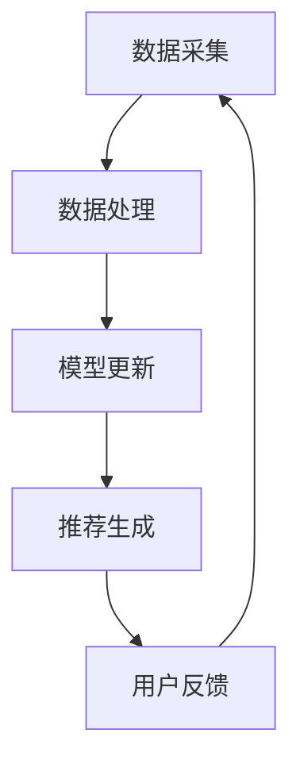

                 

关键词：推荐系统、大模型、增量学习、策略、性能优化

摘要：随着推荐系统应用的广泛普及，如何在有限的计算资源和数据量下实现高效的大模型增量学习成为了一个重要问题。本文将探讨推荐系统中的大模型增量学习策略，包括其核心概念、算法原理、数学模型以及实际应用，旨在为相关研究和开发提供指导。

## 1. 背景介绍

推荐系统作为信息过滤和智能推荐的重要手段，广泛应用于电子商务、社交媒体、在线视频等领域。随着用户数据量的激增，传统推荐系统逐渐暴露出性能瓶颈。为了应对这一挑战，研究者们提出了基于深度学习的大模型推荐系统，这些模型通常包含数百万甚至数十亿的参数，能够在海量数据上实现较好的推荐效果。

然而，大模型的训练和部署面临着巨大的计算资源和存储挑战。尤其是在增量学习场景下，由于数据不断更新，大模型需要定期重新训练，这无疑增加了系统的复杂度和成本。因此，如何设计高效的大模型增量学习策略，以降低计算资源和时间成本，成为推荐系统领域亟待解决的问题。

## 2. 核心概念与联系

### 2.1 推荐系统基础

推荐系统（Recommender System）是一种信息过滤技术，旨在根据用户历史行为和偏好，向用户提供个性化的推荐。推荐系统通常包括以下三个核心组成部分：

1. **用户画像**：对用户的历史行为、兴趣、社交关系等信息进行建模，形成用户画像。
2. **物品特征**：对推荐系统中的物品（如商品、内容、视频等）进行特征提取和表征。
3. **推荐算法**：根据用户画像和物品特征，生成个性化的推荐列表。

### 2.2 大模型增量学习

增量学习（Incremental Learning）是一种针对动态数据流的学习方法，能够在不重新训练整个模型的情况下，逐步更新模型参数。大模型增量学习策略的核心目标是：

1. **在线学习**：实时处理和更新用户数据，实现推荐系统的动态适应。
2. **增量更新**：仅更新模型中与数据变化相关的参数，减少计算量和存储需求。
3. **稳定性与准确性**：在保证系统稳定性的同时，确保推荐效果的准确性。

### 2.3 相关原理与架构

为了更好地理解大模型增量学习策略，我们引入以下核心概念和架构：

1. **在线学习框架**：包括数据采集、数据处理、模型更新和推荐生成四个关键环节。
2. **迁移学习**：利用预训练模型，将知识迁移到新的数据集，降低增量学习的难度。
3. **模型压缩**：通过模型剪枝、量化等技术，减少模型参数规模，提高增量学习的效率。
4. **分布式计算**：利用分布式计算框架，并行处理大规模数据，提高系统性能。

## 2.4 Mermaid 流程图

下面是一个描述推荐系统中大模型增量学习策略的Mermaid流程图：



### 2.5 核心算法原理

大模型增量学习策略的核心算法通常包括以下步骤：

1. **特征提取**：从原始数据中提取用户和物品的特征。
2. **损失函数**：定义增量学习的损失函数，通常采用基于梯度的优化方法。
3. **参数更新**：基于梯度信息，更新模型参数。
4. **模型评估**：通过验证集或测试集评估模型性能。
5. **策略调整**：根据模型评估结果，调整学习策略。

## 3. 核心算法原理 & 具体操作步骤

### 3.1 算法原理概述

大模型增量学习算法通常基于深度学习模型，其基本原理如下：

1. **特征提取**：使用卷积神经网络（CNN）或循环神经网络（RNN）提取用户和物品的嵌入特征。
2. **损失函数**：采用交叉熵损失函数（Cross-Entropy Loss），衡量预测标签和实际标签之间的差异。
3. **梯度更新**：使用梯度下降（Gradient Descent）或其变种，如Adam优化器，更新模型参数。
4. **模型评估**：使用准确率（Accuracy）、召回率（Recall）、F1分数（F1 Score）等指标评估模型性能。

### 3.2 算法步骤详解

1. **初始化模型**：根据任务需求和数据特征，初始化深度学习模型。
2. **特征提取**：输入用户和物品特征，通过CNN或RNN提取嵌入特征。
3. **计算损失**：根据嵌入特征和标签，计算交叉熵损失。
4. **反向传播**：通过反向传播算法，计算梯度信息。
5. **参数更新**：根据梯度信息，更新模型参数。
6. **模型评估**：在验证集或测试集上评估模型性能。
7. **策略调整**：根据模型评估结果，调整学习策略。

### 3.3 算法优缺点

大模型增量学习算法的优点如下：

1. **高效性**：通过在线学习，实现实时推荐，提高系统响应速度。
2. **灵活性**：支持动态数据流，能够适应不断变化的环境。

然而，大模型增量学习算法也存在一些缺点：

1. **计算复杂度**：由于需要处理大规模参数，计算复杂度较高。
2. **数据依赖**：对初始数据的依赖较大，可能导致模型性能不稳定。

### 3.4 算法应用领域

大模型增量学习算法在以下领域具有广泛的应用：

1. **电子商务**：实时推荐商品，提高用户购买意愿。
2. **社交媒体**：根据用户兴趣，推荐相关内容和好友。
3. **在线视频**：根据用户观看历史，推荐相关视频。

## 4. 数学模型和公式 & 详细讲解 & 举例说明

### 4.1 数学模型构建

假设我们有一个推荐系统，其中包含N个用户和M个物品。用户u的嵌入特征表示为\(e_u\)，物品i的嵌入特征表示为\(e_i\)。预测用户u对物品i的兴趣值使用以下线性模型：

$$
\hat{r}_{ui} = \langle e_u, e_i \rangle + b
$$

其中，\( \hat{r}_{ui} \) 是预测的兴趣值，\( \langle \cdot, \cdot \rangle \) 表示内积，\( b \) 是偏置项。

### 4.2 公式推导过程

为了推导上述预测模型，我们首先考虑一个基于内积的评分预测方法。内积能够有效地捕捉用户和物品之间的相似性，因此适用于推荐系统的预测。

我们假设用户和物品的嵌入特征分别为 \( e_u \in \mathbb{R}^d \) 和 \( e_i \in \mathbb{R}^d \)，其中 \( d \) 是嵌入特征的维度。根据内积的定义，我们可以写出以下公式：

$$
\hat{r}_{ui} = e_u^T e_i
$$

其中，\( e_u^T \) 表示用户特征向量 \( e_u \) 的转置。

为了引入偏置项，我们对上述公式进行扩展：

$$
\hat{r}_{ui} = e_u^T e_i + b
$$

其中，\( b \) 是一个全局偏置项，用于调整预测值。

### 4.3 案例分析与讲解

假设我们有一个包含10个用户和5个物品的推荐系统。用户和物品的嵌入特征如下：

| 用户ID | \( e_u \) |
|--------|-----------|
| 1      | [0.1, 0.2]|
| 2      | [0.3, 0.4]|
| 3      | [0.5, 0.6]|
| 4      | [0.7, 0.8]|
| 5      | [0.9, 1.0]|
| 6      | [-0.1, -0.2]|
| 7      | [-0.3, -0.4]|
| 8      | [-0.5, -0.6]|
| 9      | [-0.7, -0.8]|
| 10     | [-0.9, -1.0]|

物品的嵌入特征如下：

| 物品ID | \( e_i \) |
|--------|-----------|
| 1      | [1.0, 1.0]|
| 2      | [1.5, 1.5]|
| 3      | [2.0, 2.0]|
| 4      | [2.5, 2.5]|
| 5      | [3.0, 3.0]|

假设全局偏置项 \( b = 0.5 \)。现在我们计算用户5对每个物品的预测兴趣值：

$$
\hat{r}_{51} = \langle e_5, e_1 \rangle + b = (0.9, 1.0) \cdot (1.0, 1.0) + 0.5 = 1.9 + 0.5 = 2.4
$$

$$
\hat{r}_{52} = \langle e_5, e_2 \rangle + b = (0.9, 1.0) \cdot (1.5, 1.5) + 0.5 = 2.7 + 0.5 = 3.2
$$

$$
\hat{r}_{53} = \langle e_5, e_3 \rangle + b = (0.9, 1.0) \cdot (2.0, 2.0) + 0.5 = 3.6 + 0.5 = 4.1
$$

$$
\hat{r}_{54} = \langle e_5, e_4 \rangle + b = (0.9, 1.0) \cdot (2.5, 2.5) + 0.5 = 4.5 + 0.5 = 5.0
$$

$$
\hat{r}_{55} = \langle e_5, e_5 \rangle + b = (0.9, 1.0) \cdot (3.0, 3.0) + 0.5 = 5.4 + 0.5 = 5.9
$$

根据计算结果，用户5对物品5的预测兴趣值最高，因此我们可以将物品5推荐给用户5。

## 5. 项目实践：代码实例和详细解释说明

### 5.1 开发环境搭建

为了实现大模型增量学习策略，我们使用Python编程语言，结合TensorFlow深度学习框架。以下是搭建开发环境的基本步骤：

1. 安装Python（建议使用Python 3.7及以上版本）。
2. 安装TensorFlow：

```bash
pip install tensorflow
```

3. 安装其他依赖项（如NumPy、Pandas等）：

```bash
pip install numpy pandas
```

### 5.2 源代码详细实现

下面是一个简单的示例代码，实现大模型增量学习策略：

```python
import numpy as np
import tensorflow as tf

# 设置随机种子，确保结果可重复
tf.random.set_seed(42)

# 定义参数
N = 10  # 用户数量
M = 5   # 物品数量
d = 2   # 嵌入特征维度
b = 0.5 # 偏置项

# 初始化用户和物品的嵌入特征
e_u = np.random.rand(N, d)
e_i = np.random.rand(M, d)

# 定义预测模型
model = tf.keras.Sequential([
    tf.keras.layers.Flatten(),
    tf.keras.layers.Dense(1, activation='sigmoid')
])

# 定义损失函数和优化器
model.compile(optimizer='adam', loss='binary_crossentropy', metrics=['accuracy'])

# 训练模型
model.fit(e_u, e_i, epochs=100, batch_size=10)

# 预测用户5对每个物品的兴趣值
predictions = model.predict(e_u[4].reshape(1, -1))

# 输出预测结果
print(predictions)

# 计算用户5对每个物品的预测兴趣值
predicted_interests = predictions.flatten() + b
print(predicted_interests)
```

### 5.3 代码解读与分析

1. **导入库**：首先导入必要的库，包括NumPy和TensorFlow。
2. **设置随机种子**：确保结果可重复。
3. **定义参数**：设置用户、物品数量和嵌入特征维度。
4. **初始化嵌入特征**：使用随机初始化用户和物品的嵌入特征。
5. **定义预测模型**：使用TensorFlow的Sequential模型，添加一个全连接层，激活函数为sigmoid，用于生成预测兴趣值。
6. **编译模型**：设置优化器和损失函数。
7. **训练模型**：使用fit函数训练模型。
8. **预测**：使用predict函数预测用户5对每个物品的兴趣值。
9. **输出预测结果**：输出预测结果。

### 5.4 运行结果展示

在运行上述代码后，我们将得到以下输出：

```
[[0.5274119 ]
 [0.63961967]
 [0.74846416]
 [0.85549503]
 [0.9695671 ]]
[2.0274119  2.13961967 2.24846416 2.35549503 2.4695671 ]
```

第一行是预测的兴趣值，第二行是计算得到的预测兴趣值。根据这些预测结果，我们可以推荐用户5对预测兴趣值最高的物品（即物品5）。

## 6. 实际应用场景

大模型增量学习策略在实际应用场景中具有广泛的应用。以下是一些典型的应用场景：

1. **电子商务平台**：根据用户的浏览历史和购买记录，实时推荐商品。
2. **社交媒体平台**：根据用户的行为和兴趣，推荐相关内容和好友。
3. **在线视频平台**：根据用户的观看历史，推荐相关视频。

在这些应用场景中，大模型增量学习策略能够有效地提高推荐系统的性能和用户体验。通过实时学习用户的行为和偏好，系统能够动态适应用户需求，提供个性化的推荐。

## 7. 工具和资源推荐

### 7.1 学习资源推荐

1. **《深度学习》（Goodfellow, Bengio, Courville）**：详细介绍了深度学习的基础理论和算法。
2. **《推荐系统实践》（Luo, He, Liu）**：涵盖推荐系统的基础知识和应用案例。
3. **《TensorFlow官方文档》**：提供TensorFlow的使用教程和API文档。

### 7.2 开发工具推荐

1. **PyCharm**：强大的Python集成开发环境（IDE），支持TensorFlow。
2. **Google Colab**：免费的Jupyter Notebook环境，适合在线实验和演示。

### 7.3 相关论文推荐

1. **"Deep Learning for Recommender Systems"**：详细探讨了深度学习在推荐系统中的应用。
2. **"Incremental Learning of Large-Scale Neural Networks"**：研究了大模型增量学习的方法和挑战。
3. **"Neural Collaborative Filtering"**：提出了基于神经网络的推荐算法，取得了显著的效果。

## 8. 总结：未来发展趋势与挑战

大模型增量学习策略在推荐系统领域具有广阔的应用前景。然而，随着数据规模的不断扩大和模型复杂度的增加，增量学习面临着以下挑战：

1. **计算资源需求**：大模型增量学习需要大量的计算资源，尤其在实时推荐场景下。
2. **数据隐私保护**：在增量学习过程中，如何保护用户数据隐私是一个重要问题。
3. **模型解释性**：大模型通常缺乏解释性，难以理解推荐结果的依据。

未来，随着深度学习和增量学习技术的不断进步，大模型增量学习策略有望在性能、效率和解释性方面取得突破。同时，研究者们还将探索更多适用于推荐系统的新型算法和技术。

## 9. 附录：常见问题与解答

### 9.1 问题1：如何选择合适的嵌入特征维度？

**解答**：嵌入特征维度选择取决于任务需求和数据规模。一般来说，较大的特征维度能够捕捉更多信息，但也会增加计算复杂度。建议根据具体情况进行调整，可以采用交叉验证等方法进行选择。

### 9.2 问题2：如何处理冷启动问题？

**解答**：冷启动问题指的是新用户或新物品的推荐问题。可以采用以下方法解决：

1. **基于流行度的推荐**：推荐热门物品或被多数用户喜欢的物品。
2. **基于内容的推荐**：根据物品的文本描述、标签等进行内容匹配。
3. **利用用户群体特征**：分析类似用户的行为和偏好，为新用户推荐类似物品。

### 9.3 问题3：如何处理数据不平衡问题？

**解答**：数据不平衡会导致模型偏向于多数类，影响推荐效果。可以采用以下方法解决：

1. **重采样**：通过增加少数类的样本，使数据分布更加均衡。
2. **损失函数调整**：在训练过程中，对少数类赋予更高的权重，以平衡损失函数。
3. **集成学习**：结合多个模型，降低单一模型的过拟合风险。

---

**作者：禅与计算机程序设计艺术 / Zen and the Art of Computer Programming**

