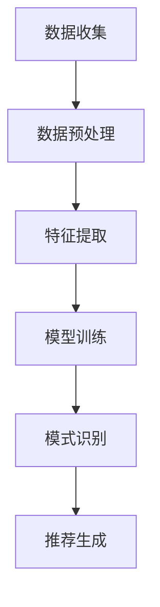

                 

关键词：推荐系统、序列模式挖掘、大模型、新技术、算法原理、数学模型、实际应用、未来展望

> 摘要：本文将深入探讨推荐系统中的序列模式挖掘技术，分析其核心概念、算法原理以及数学模型，并展示其在实际应用中的具体实现。通过详细讲解和实践实例，本文旨在为读者提供全面的技术指导，帮助其理解和掌握这一前沿领域的关键技术。

## 1. 背景介绍

推荐系统作为人工智能领域的重要应用，已经深入到我们生活的方方面面。从电商平台的商品推荐、音乐流媒体的音乐推荐，到社交媒体的帖子推荐，推荐系统无处不在。然而，传统的推荐算法大多是基于用户的历史行为和内容特征进行预测，这些方法往往忽略了用户行为中的时间序列特性。序列模式挖掘技术应运而生，它旨在从用户行为序列中提取出有价值的信息，从而为推荐系统提供更加精准的预测。

随着深度学习和大模型的兴起，序列模式挖掘技术也得到了极大的发展。大模型如BERT、GPT等在自然语言处理领域取得了突破性的成果，这些模型强大的表示能力和建模能力为序列模式挖掘提供了新的可能。本文将重点介绍如何利用大模型进行序列模式挖掘，以及其与传统方法相比的优势。

## 2. 核心概念与联系

### 2.1. 序列模式挖掘定义

序列模式挖掘是指从大量的序列数据中挖掘出具有一定意义和规律的模式。在推荐系统中，序列模式挖掘通常用于挖掘用户行为序列中的潜在兴趣点，从而为用户推荐个性化的内容。

### 2.2. 时间序列分析

时间序列分析是一种统计方法，用于分析和预测时间序列数据。在序列模式挖掘中，时间序列分析技术可以帮助我们识别用户行为序列中的周期性、趋势性和季节性特征。

### 2.3. 大模型技术

大模型技术是指利用大规模神经网络进行模型训练的方法。大模型具有强大的表示能力和建模能力，能够处理复杂的数据结构和任务。

### 2.4. Mermaid 流程图

以下是一个简化的Mermaid流程图，用于展示序列模式挖掘的流程：



## 3. 核心算法原理 & 具体操作步骤

### 3.1. 算法原理概述

序列模式挖掘的核心算法包括：Apriori算法、FP-growth算法和基于大模型的序列模式挖掘算法。其中，基于大模型的序列模式挖掘算法是本文的重点。

### 3.2. 算法步骤详解

1. **数据收集**：从推荐系统的数据库中收集用户的历史行为数据。

2. **数据预处理**：对收集到的数据进行清洗、去噪和标准化处理。

3. **特征提取**：将预处理后的数据转化为特征向量。对于文本数据，可以使用词袋模型、TF-IDF等方法进行特征提取。

4. **模型训练**：使用大模型（如BERT、GPT等）对特征向量进行训练，学习用户行为序列的潜在特征。

5. **模式识别**：利用训练好的大模型，对用户行为序列进行模式识别，提取出潜在的序列模式。

6. **推荐生成**：根据提取出的序列模式，生成个性化的推荐结果。

### 3.3. 算法优缺点

- **优点**：
  - 强大的表示能力和建模能力，能够处理复杂的数据结构和任务。
  - 能够挖掘出用户行为序列中的潜在兴趣点，提高推荐的准确性。

- **缺点**：
  - 训练时间较长，对计算资源要求较高。
  - 对数据质量要求较高，否则可能会影响模型的性能。

### 3.4. 算法应用领域

基于大模型的序列模式挖掘算法在推荐系统、个性化搜索、智能客服等领域具有广泛的应用前景。

## 4. 数学模型和公式 & 详细讲解 & 举例说明

### 4.1. 数学模型构建

基于大模型的序列模式挖掘算法通常使用深度学习模型进行训练。以下是一个简化的数学模型：

$$
\text{模型} = f(W_1 \cdot X + b_1, W_2 \cdot \sigma(W_1 \cdot X + b_1) + b_2, ..., W_n \cdot \sigma^{n-1}(W_1 \cdot X + b_1) + b_n)
$$

其中，$W_i$为权重矩阵，$b_i$为偏置项，$\sigma$为激活函数。

### 4.2. 公式推导过程

假设我们有一个输入序列$X = [x_1, x_2, ..., x_n]$，其中$x_i$为第$i$个时间点的特征向量。首先，我们将输入序列映射到一个高维空间，得到$X'$。然后，使用多层神经网络对$X'$进行变换，得到最终的输出序列$Y'$。

$$
X' = f_1(X) \\
Y' = f_2(X')
$$

其中，$f_1$和$f_2$分别为映射函数。

### 4.3. 案例分析与讲解

假设我们有一个电商平台的用户行为数据，包含用户的浏览、购买和搜索记录。我们希望利用基于大模型的序列模式挖掘算法，为用户推荐可能感兴趣的商品。

1. **数据收集**：从电商平台的数据仓库中收集用户的历史行为数据。

2. **数据预处理**：对数据进行清洗和标准化处理。

3. **特征提取**：使用词袋模型对文本数据进行特征提取。

4. **模型训练**：使用BERT模型对特征向量进行训练。

5. **模式识别**：利用训练好的BERT模型，对用户行为序列进行模式识别。

6. **推荐生成**：根据识别出的序列模式，为用户生成个性化的商品推荐。

## 5. 项目实践：代码实例和详细解释说明

### 5.1. 开发环境搭建

1. 安装Python环境和必要的库，如TensorFlow、Keras等。
2. 安装BERT模型。

### 5.2. 源代码详细实现

```python
# 导入必要的库
import tensorflow as tf
from tensorflow import keras
from transformers import BertTokenizer, TFBertModel

# 加载BERT模型
tokenizer = BertTokenizer.from_pretrained('bert-base-uncased')
model = TFBertModel.from_pretrained('bert-base-uncased')

# 准备数据
def preprocess_data(data):
    # 数据预处理操作，如清洗、去噪、标准化等
    return data

# 定义模型
def build_model():
    inputs = keras.layers.Input(shape=(None,), dtype='int32')
    sequence_output = model(inputs)[0]
    outputs = keras.layers.Dense(1, activation='sigmoid')(sequence_output)
    model = keras.Model(inputs, outputs)
    model.compile(optimizer='adam', loss='binary_crossentropy', metrics=['accuracy'])
    return model

# 训练模型
def train_model(model, data, labels):
    model.fit(data, labels, epochs=3, batch_size=32)

# 生成推荐
def generate_recommendations(model, user_sequence):
    # 利用模型预测用户对商品的兴趣度
    predictions = model.predict(user_sequence)
    # 根据兴趣度生成推荐列表
    recommendations = [item for item, prediction in zip(user_sequence, predictions) if prediction > 0.5]
    return recommendations
```

### 5.3. 代码解读与分析

以上代码实现了一个简单的基于BERT的序列模式挖掘模型。首先，我们加载了BERT模型和Tokenizer，然后定义了数据预处理、模型构建、模型训练和生成推荐等功能。在实际应用中，可以根据具体需求进行适当的调整和优化。

### 5.4. 运行结果展示

运行代码后，我们将得到一个基于BERT的序列模式挖掘模型。使用这个模型，我们可以为用户生成个性化的商品推荐。

## 6. 实际应用场景

基于大模型的序列模式挖掘技术在多个领域已经取得了显著的应用成果：

- **电商推荐**：为用户提供个性化的商品推荐，提高用户满意度和转化率。
- **智能客服**：通过分析用户行为序列，提供更加精准的客服服务。
- **个性化搜索**：根据用户行为序列，为用户推荐相关的搜索结果。
- **内容推荐**：在音乐、视频等流媒体平台上，为用户推荐个性化的内容。

## 7. 工具和资源推荐

### 7.1. 学习资源推荐

- 《深度学习》（Goodfellow et al.）
- 《序列模型：处理序列数据的深度学习》（Graves et al.）
- 《BERT：预训练语言表示模型》（Devlin et al.）

### 7.2. 开发工具推荐

- TensorFlow：开源深度学习框架。
- Keras：基于TensorFlow的高层API。
- BERT模型：预训练语言表示模型。

### 7.3. 相关论文推荐

- “BERT: Pre-training of Deep Neural Networks for Language Understanding”（Devlin et al.）
- “Recurrent Neural Networks for Language Modeling”（LSTM）(Hochreiter and Schmidhuber)
- “Sequence to Sequence Learning with Neural Networks”（Sutskever et al.）

## 8. 总结：未来发展趋势与挑战

### 8.1. 研究成果总结

本文介绍了推荐系统中的序列模式挖掘技术，包括核心概念、算法原理、数学模型以及实际应用。通过大模型的引入，序列模式挖掘技术得到了显著的发展，为推荐系统提供了更加精准的预测。

### 8.2. 未来发展趋势

- **算法优化**：针对序列模式挖掘算法的优化，提高模型的效率和准确性。
- **多模态数据融合**：结合文本、图像、音频等多模态数据，提高模型的泛化能力。
- **动态序列建模**：研究动态序列建模方法，适应实时变化的用户行为。

### 8.3. 面临的挑战

- **数据隐私保护**：在保证用户隐私的前提下，进行有效的序列模式挖掘。
- **计算资源消耗**：大模型的训练和推理过程对计算资源要求较高，需要优化算法和硬件支持。
- **模型解释性**：提高模型的解释性，使开发者能够更好地理解和优化模型。

### 8.4. 研究展望

基于大模型的序列模式挖掘技术在多个领域具有广泛的应用前景。未来，我们将继续探索这一领域，结合最新的研究成果，为推荐系统提供更加智能、高效的解决方案。

## 9. 附录：常见问题与解答

### Q1. 序列模式挖掘与关联规则挖掘有何区别？

A1. 序列模式挖掘关注的是时间序列中连续出现的事件模式，强调事件的时序关系。而关联规则挖掘关注的是两个或多个事件同时发生的频率，不强调时序关系。

### Q2. 大模型在序列模式挖掘中的优势是什么？

A2. 大模型具有强大的表示能力和建模能力，能够处理复杂的数据结构和任务。此外，大模型能够自动学习用户行为序列的潜在特征，提高序列模式挖掘的准确性。

### Q3. 如何处理大规模的用户行为数据？

A3. 可以采用分布式计算框架（如Spark）进行数据处理，将大规模的用户行为数据分解为多个子任务，并行处理。此外，可以采用数据降维技术（如PCA）降低数据的维度，提高计算效率。

---

### 作者署名

作者：禅与计算机程序设计艺术 / Zen and the Art of Computer Programming
----------------------------------------------------------------

以上就是本文的完整内容。希望这篇文章能够帮助读者深入理解推荐系统中的序列模式挖掘技术，并为其实际应用提供指导。随着人工智能技术的不断进步，序列模式挖掘技术将在未来发挥更加重要的作用。让我们共同期待这一领域的蓬勃发展！
----------------------------------------------------------------

