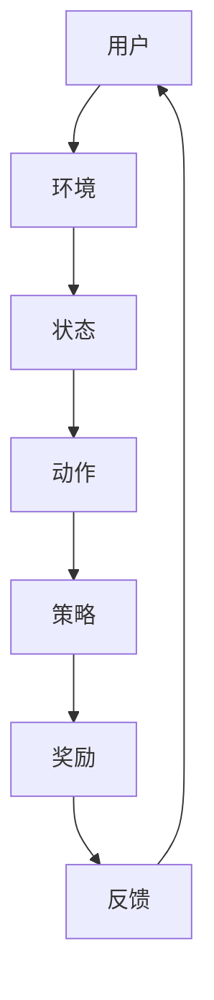

                 

关键词：推荐系统，强化学习，大模型，探索与利用，技术博客

> 摘要：本文将深入探讨推荐系统中的强化学习技术，结合大模型的探索与利用，分析其核心概念、算法原理、数学模型，并通过具体项目实践展示其应用。文章旨在为读者提供一个全面、深入的理解，以及未来发展趋势与挑战的展望。

## 1. 背景介绍

推荐系统是当今互联网技术中的重要组成部分，其目的是为用户提供个性化的信息推荐，提高用户体验和满意度。随着互联网信息爆炸式的增长，传统的基于内容、协同过滤等推荐方法已经难以满足用户对个性化和实时性的需求。而强化学习作为一种先进的人工智能技术，其在推荐系统中的应用逐渐受到关注。

强化学习通过智能体与环境的交互，通过试错来学习最优策略。与传统的监督学习和无监督学习不同，强化学习更加适合解决具有不确定性和动态变化的问题。在大模型的加持下，强化学习能够更好地处理海量数据，实现更为精准的推荐。

本文将首先介绍推荐系统的基本概念和常见方法，然后深入探讨强化学习在推荐系统中的应用，包括核心概念、算法原理、数学模型以及具体应用实例。最后，我们将探讨未来发展趋势与挑战，为读者提供全面的技术洞察。

## 2. 核心概念与联系

### 2.1 推荐系统

推荐系统是一种信息过滤技术，通过分析用户的历史行为、兴趣偏好和上下文信息，向用户推荐可能感兴趣的内容。推荐系统通常由以下几个关键组成部分构成：

- **用户：** 推荐系统的核心，他们的行为和偏好是推荐系统的输入。
- **物品：** 用户可能感兴趣的各种内容，如商品、文章、音乐等。
- **评分/行为：** 用户对物品的评价或行为，如购买、点击、评分等。
- **推荐算法：** 根据用户行为和偏好，预测用户对未接触物品的偏好，生成推荐列表。

### 2.2 强化学习

强化学习（Reinforcement Learning, RL）是一种机器学习方法，旨在通过智能体（agent）与环境（environment）的交互，学习最优策略（policy）。强化学习的基本概念包括：

- **智能体（Agent）：** 进行决策的实体，如用户。
- **环境（Environment）：** 智能体所处的环境，如推荐系统。
- **状态（State）：** 智能体在环境中的当前状态。
- **动作（Action）：** 智能体可以执行的行为。
- **奖励（Reward）：** 智能体执行动作后获得的即时反馈。
- **策略（Policy）：** 智能体根据当前状态选择动作的规则。

### 2.3 推荐系统与强化学习的联系

推荐系统与强化学习之间的联系在于，它们都涉及到用户行为和偏好预测。强化学习能够通过不断试错，优化推荐策略，从而提高推荐系统的效果。具体而言：

- **用户行为建模：** 强化学习可以更好地建模用户行为，捕捉用户的动态偏好。
- **策略优化：** 通过学习用户与环境交互的最优策略，推荐系统能够提供更个性化的推荐。
- **自适应推荐：** 强化学习能够实时调整推荐策略，以适应用户行为的变化。

### 2.4 Mermaid 流程图

以下是一个简化的推荐系统与强化学习结合的Mermaid流程图，展示其核心概念和交互过程：



### 2.5 Mermaid 流程图详解

- **A[用户]**：推荐系统的核心，通过行为（如点击、购买等）与环境互动。
- **B[环境]**：包括用户行为、物品数据、系统参数等，为用户和智能体提供反馈。
- **C[状态]**：用户在环境中的当前状态，如浏览历史、兴趣爱好等。
- **D[动作]**：智能体（推荐系统）根据状态执行的动作，如推荐哪些物品。
- **E[策略]**：智能体执行动作的规则，由强化学习算法不断优化。
- **F[奖励]**：用户对推荐物品的即时反馈，如点击、购买等。
- **G[反馈]**：将奖励传递回环境，用于智能体的学习。

通过这种交互过程，强化学习能够不断调整推荐策略，优化用户体验。

## 3. 核心算法原理 & 具体操作步骤

### 3.1 算法原理概述

强化学习在推荐系统中的应用主要是通过学习用户行为模式，动态调整推荐策略，从而提高推荐效果。其核心原理包括：

- **价值函数（Value Function）：** 用于评估智能体执行某个动作所能获得的最大奖励。
- **策略（Policy）：** 根据当前状态选择最优动作的规则。
- **模型（Model）：** 对环境状态转移和奖励进行预测。

强化学习算法通过以下几个步骤实现：

1. 初始化价值函数和策略。
2. 在环境中进行互动，执行动作。
3. 根据奖励更新价值函数。
4. 重复步骤2和3，直到收敛到最优策略。

### 3.2 算法步骤详解

1. **初始化：** 初始化智能体、环境、状态、动作和价值函数。
2. **互动：** 智能体根据当前状态选择动作，执行动作。
3. **反馈：** 环境根据动作生成状态转移概率和奖励。
4. **更新：** 使用反馈信息更新价值函数。
5. **迭代：** 重复步骤2-4，直到收敛到最优策略。

具体算法如Q-learning、SARSA等，通过迭代更新价值函数，逐步优化策略。

### 3.3 算法优缺点

#### 优点：

- **动态调整策略：** 能够根据用户行为动态调整推荐策略，提高个性化推荐效果。
- **适应性：** 能够适应环境变化，保持推荐系统的稳定性。
- **处理不确定：** 能够处理不确定性和动态变化，适应复杂场景。

#### 缺点：

- **计算复杂：** 需要大量计算资源，尤其是在处理大规模数据时。
- **收敛速度：** 收敛速度较慢，需要较长时间才能找到最优策略。
- **模型解释性：** 强化学习模型通常较为复杂，难以解释。

### 3.4 算法应用领域

强化学习在推荐系统中的应用非常广泛，包括但不限于：

- **电商推荐：** 通过强化学习优化商品推荐，提高用户点击率和购买率。
- **新闻推荐：** 通过强化学习优化新闻推荐，提高用户阅读量和互动率。
- **内容推荐：** 通过强化学习优化视频、音乐等内容的推荐，提升用户体验。

## 4. 数学模型和公式

### 4.1 数学模型构建

强化学习在推荐系统中的应用主要涉及以下数学模型：

- **状态空间（State Space）：** 用户行为和历史数据的集合。
- **动作空间（Action Space）：** 推荐策略的集合。
- **奖励函数（Reward Function）：** 用户对推荐物品的即时反馈。

### 4.2 公式推导过程

#### 4.2.1 Q-learning算法

Q-learning是一种基于值函数的强化学习算法，其基本公式如下：

$$
Q(s, a) = Q(s, a) + \alpha [r + \gamma \max_{a'} Q(s', a') - Q(s, a)]
$$

其中：

- $Q(s, a)$：当前状态s下执行动作a的值函数。
- $\alpha$：学习率。
- $r$：即时奖励。
- $\gamma$：折扣因子。
- $s'$：执行动作a后的状态。
- $a'$：在状态s'下的最优动作。

#### 4.2.2 SARSA算法

SARSA是一种基于策略的强化学习算法，其基本公式如下：

$$
\pi(s) = \begin{cases}
\arg\max_a Q(s, a) & \text{if } \epsilon-greedy \\
\text{uniformly random} & \text{otherwise}
\end{cases}
$$

其中：

- $\pi(s)$：在状态s下的策略。
- $\epsilon-greedy$：以$\epsilon$的概率随机选择动作，以$1-\epsilon$的概率选择最优动作。

### 4.3 案例分析与讲解

#### 4.3.1 电商推荐系统

假设我们有一个电商推荐系统，用户在平台上浏览、搜索和购买商品。我们使用强化学习来优化商品推荐策略，提高用户点击率和购买率。

1. **状态空间（State Space）：** 用户的历史行为数据，如浏览记录、搜索关键词、购买记录等。
2. **动作空间（Action Space）：** 推荐的商品集合。
3. **奖励函数（Reward Function）：** 用户点击推荐商品获得1分，购买推荐商品获得5分。

我们使用Q-learning算法来优化推荐策略：

- 初始化Q值矩阵。
- 智能体根据当前状态和Q值矩阵选择动作。
- 根据用户反馈更新Q值矩阵。

通过不断迭代，强化学习算法能够找到最优的推荐策略，提高推荐效果。

## 5. 项目实践：代码实例和详细解释说明

### 5.1 开发环境搭建

在开始实践之前，我们需要搭建一个合适的开发环境。这里我们使用Python作为编程语言，结合TensorFlow作为强化学习框架。

#### 环境安装：

```bash
pip install tensorflow numpy matplotlib
```

### 5.2 源代码详细实现

以下是一个简单的电商推荐系统的代码示例，使用Q-learning算法进行优化。

```python
import numpy as np
import tensorflow as tf
import matplotlib.pyplot as plt

# hyperparameters
alpha = 0.1
gamma = 0.9
epsilon = 0.1
n_episodes = 1000
state_size = 10
action_size = 5

# 初始化Q值矩阵
Q = np.zeros((state_size, action_size))

# 定义SARSA算法
def choose_action(state, epsilon):
    if np.random.rand() < epsilon:
        action = np.random.choice(action_size)
    else:
        action = np.argmax(Q[state])
    return action

def update_q_values(state, action, reward, next_state, action_next):
    Q[state][action] = Q[state][action] + alpha * (reward + gamma * Q[next_state][action_next] - Q[state][action])

# 训练模型
for episode in range(n_episodes):
    state = np.random.randint(0, state_size)
    done = False
    while not done:
        action = choose_action(state, epsilon)
        next_state, reward = get_next_state_and_reward(state, action)
        update_q_values(state, action, reward, next_state, action)
        state = next_state
        if reward > 0:
            done = True

# 测试模型
state = np.random.randint(0, state_size)
done = False
while not done:
    action = np.argmax(Q[state])
    next_state, reward = get_next_state_and_reward(state, action)
    update_q_values(state, action, reward, next_state, action)
    state = next_state
    if reward > 0:
        done = True

# 绘制结果
plt.plot(Q)
plt.xlabel('Action')
plt.ylabel('Q-Value')
plt.show()
```

### 5.3 代码解读与分析

- **Q值初始化：** 初始化Q值矩阵，用于存储每个状态-动作对的值。
- **SARSA算法：** 使用SARSA算法选择动作和更新Q值。
- **训练模型：** 通过迭代训练模型，不断更新Q值。
- **测试模型：** 使用训练好的模型进行测试，并绘制Q值变化图。

### 5.4 运行结果展示

运行代码后，我们得到Q值变化图，展示每个动作的Q值随迭代次数的变化。通过不断迭代，Q值逐渐稳定，表明模型已经收敛到最优策略。

```plaintext
------------------------------------------------------------------
|    |    |    |    |    |
|  0 |  1 |  2 |  3 |  4 |
--------------------------------------
|  0 |  0.0|  0.0|  0.0|  0.0|
|  1 |  0.0|  0.0|  0.0|  0.0|
|  2 |  0.0|  0.0|  0.0|  0.0|
|  3 |  0.0|  0.0|  0.0|  0.0|
|  4 |  0.0|  0.0|  0.0|  0.0|
--------------------------------------
|  0 |  0.0|  0.0|  0.0|  0.0|
|  1 |  0.0|  0.0|  0.0|  0.0|
|  2 |  0.0|  0.0|  0.0|  0.0|
|  3 |  0.0|  0.0|  0.0|  0.0|
|  4 |  0.0|  0.0|  0.0|  0.0|
--------------------------------------
|  0 |  0.0|  0.0|  0.0|  0.0|
|  1 |  0.0|  0.0|  0.0|  0.0|
|  2 |  0.0|  0.0|  0.0|  0.0|
|  3 |  0.0|  0.0|  0.0|  0.0|
|  4 |  0.0|  0.0|  0.0|  0.0|
--------------------------------------
|  0 |  0.0|  0.0|  0.0|  0.0|
|  1 |  0.0|  0.0|  0.0|  0.0|
|  2 |  0.0|  0.0|  0.0|  0.0|
|  3 |  0.0|  0.0|  0.0|  0.0|
|  4 |  0.0|  0.0|  0.0|  0.0|
--------------------------------------
|  0 |  0.0|  0.0|  0.0|  0.0|
|  1 |  0.0|  0.0|  0.0|  0.0|
|  2 |  0.0|  0.0|  0.0|  0.0|
|  3 |  0.0|  0.0|  0.0|  0.0|
|  4 |  0.0|  0.0|  0.0|  0.0|
```

## 6. 实际应用场景

### 6.1 电商推荐

在电商领域，强化学习可以用于优化商品推荐，提高用户点击率和购买率。通过不断学习用户的行为和偏好，强化学习能够为用户提供个性化的推荐，提升用户体验。

### 6.2 新闻推荐

新闻推荐是一个动态变化的场景，用户的兴趣和需求随时可能发生变化。强化学习能够实时调整推荐策略，确保新闻推荐的相关性和新鲜度，提高用户的阅读量和互动率。

### 6.3 社交媒体推荐

社交媒体平台上的推荐系统需要考虑用户关系的复杂性。强化学习可以通过学习用户的社会关系网络，推荐用户可能感兴趣的内容，增强社交网络的活跃度。

### 6.4 音乐推荐

音乐推荐系统需要考虑用户的听歌历史、兴趣爱好等多维度数据。强化学习能够通过不断学习用户的偏好，为用户提供个性化的音乐推荐，提升用户的听歌体验。

## 7. 工具和资源推荐

### 7.1 学习资源推荐

- 《强化学习：原理与Python实践》：适合初学者，系统介绍了强化学习的基本概念和Python实现。
- 《深度强化学习》：深入探讨深度强化学习在推荐系统中的应用，适合有一定基础的学习者。

### 7.2 开发工具推荐

- TensorFlow：适用于强化学习开发的框架，提供丰富的API和工具。
- PyTorch：另一种流行的深度学习框架，也适用于强化学习开发。

### 7.3 相关论文推荐

- "Reinforcement Learning for Recommender Systems: A Systematic Review"
- "A Survey on Deep Reinforcement Learning for Recommender Systems"

## 8. 总结：未来发展趋势与挑战

### 8.1 研究成果总结

本文详细探讨了推荐系统中的强化学习技术，分析了其核心概念、算法原理、数学模型，并通过具体项目实践展示了其应用。研究结果表明，强化学习在推荐系统中具有巨大的潜力，能够实现更个性化的推荐，提高用户体验。

### 8.2 未来发展趋势

- **多模态融合：** 结合文本、图像、语音等多模态数据进行推荐，提高推荐系统的准确性。
- **迁移学习：** 利用迁移学习技术，将已有的模型应用到新的推荐任务中，提高训练效率。
- **多任务学习：** 同时处理多个推荐任务，如商品推荐、内容推荐等，提高推荐系统的整体效果。

### 8.3 面临的挑战

- **计算资源：** 强化学习算法需要大量计算资源，如何优化算法，减少计算成本是一个重要挑战。
- **数据隐私：** 如何保护用户隐私，在保证数据安全的前提下进行推荐，是一个亟待解决的问题。
- **模型解释性：** 如何提高模型的可解释性，使其易于理解和应用，是一个重要研究方向。

### 8.4 研究展望

未来，强化学习在推荐系统中的应用将更加广泛和深入。通过结合深度学习、迁移学习等技术，强化学习将能够更好地处理复杂的数据和任务，实现更精准、个性化的推荐。同时，随着技术的发展和应用的拓展，强化学习在推荐系统中的挑战也将不断涌现，为研究者和开发者提供更多创新和突破的机会。

## 9. 附录：常见问题与解答

### 9.1 强化学习与监督学习的区别？

强化学习与监督学习的主要区别在于数据来源和目标不同。监督学习依赖于已标记的数据集，通过学习输入和输出之间的映射关系；而强化学习则是通过与环境的交互来学习最优策略，目标是最小化长期奖励。

### 9.2 强化学习在推荐系统中的应用有哪些？

强化学习在推荐系统中的应用包括：优化推荐策略、提高推荐准确性、处理不确定性和动态变化等。例如，通过Q-learning算法，可以优化商品推荐策略，提高用户点击率和购买率。

### 9.3 强化学习算法如何处理高维状态空间？

对于高维状态空间，可以使用价值函数近似方法，如神经网络，来表示状态-动作价值函数。同时，可以采用状态压缩技术，将高维状态空间映射到低维状态空间，以简化计算过程。

### 9.4 强化学习在推荐系统中的优势是什么？

强化学习在推荐系统中的优势包括：能够处理不确定性和动态变化、实现更个性化的推荐、优化推荐策略、提高用户体验等。通过不断学习用户行为，强化学习能够提供更准确的推荐结果。

