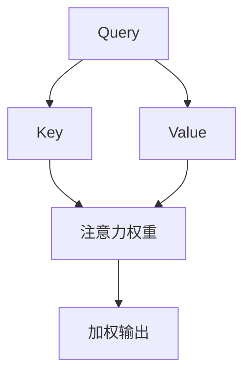

                 

关键词：推荐系统、注意力机制、深度学习、大模型、自然语言处理

>摘要：本文将深入探讨推荐系统中的注意力机制，分析其在深度学习、大模型和自然语言处理等领域的应用。通过详细的数学模型和具体操作步骤，本文旨在为读者提供对注意力机制在实际应用中的全面理解。

## 1. 背景介绍

推荐系统已经成为现代互联网的核心组成部分，广泛应用于电商、新闻、社交媒体等多个领域。其目标是通过预测用户对物品的喜好，为用户提供个性化的推荐。然而，随着数据量的激增和用户行为的多样化，传统的推荐算法在处理复杂关系和高维度特征时逐渐暴露出局限性。

### 1.1 注意力机制的产生与发展

注意力机制（Attention Mechanism）最早起源于自然语言处理（NLP）领域，旨在解决机器翻译和文本生成任务中的上下文理解问题。Hochreiter 和 Schmidhuber 在 1997 年提出的 Long Short-Term Memory (LSTM) 网络中引入了门控机制，这是注意力机制的早期形态。随着深度学习技术的发展，注意力机制逐渐成为处理序列数据的重要工具。

### 1.2 推荐系统中注意力机制的应用

注意力机制在推荐系统中的应用主要集中在解决特征选择和上下文感知两个问题。通过关注重要特征和用户行为，注意力机制能够提高推荐系统的性能，使其更灵活地适应不同场景。

## 2. 核心概念与联系

### 2.1 注意力机制的数学模型

注意力机制的数学模型通常可以表示为：

$$
\alpha_{ij} = \text{softmax}\left(\frac{\text{query} \cdot \text{key}_i}{\sqrt{d_k}}\right)
$$

其中，$query$ 和 $key_i$ 分别代表查询和关键特征，$d_k$ 是关键特征的维度。softmax 函数用于归一化，确保每个注意力权重在 $[0, 1]$ 范围内。

### 2.2 注意力机制的架构

注意力机制的架构可以分为三个部分：查询（Query）、关键（Key）和值（Value）。每个部分都对应一个神经网络层。通过计算查询和关键之间的点积，得到注意力权重，最终与值相乘得到加权输出。

$$
\text{output} = \text{value}_i \odot \alpha_{ij}
$$

其中，$\odot$ 表示逐元素乘法。

### 2.3 Mermaid 流程图



## 3. 核心算法原理 & 具体操作步骤

### 3.1 算法原理概述

注意力机制通过加权求和的方式，将输入序列中的每个元素按照重要性进行加权，从而实现对关键信息的关注。这一过程可以有效地提高模型对上下文信息的利用效率，从而提升推荐系统的性能。

### 3.2 算法步骤详解

1. **查询生成**：通过神经网络层生成查询向量。
2. **关键生成**：通过神经网络层生成关键向量。
3. **值生成**：通过神经网络层生成值向量。
4. **计算注意力权重**：使用点积计算查询和关键之间的相似度，并通过 softmax 函数归一化得到注意力权重。
5. **加权求和**：将注意力权重与值向量相乘，得到加权输出。

### 3.3 算法优缺点

**优点**：
- 提高模型对上下文信息的利用效率。
- 加权求和的方式使得模型更加灵活。

**缺点**：
- 计算复杂度高，对硬件资源要求较高。
- 注意力权重可能过于集中在少数关键特征上，导致信息丢失。

### 3.4 算法应用领域

注意力机制在推荐系统、机器翻译、文本生成等序列数据处理任务中都有广泛应用。例如，在推荐系统中，注意力机制可以用于用户行为序列和物品特征序列的融合，从而提高推荐质量。

## 4. 数学模型和公式 & 详细讲解 & 举例说明

### 4.1 数学模型构建

注意力机制的数学模型如前所述，主要通过点积和 softmax 函数实现。具体而言，设输入序列为 $X = [x_1, x_2, ..., x_n]$，其中 $x_i$ 表示第 $i$ 个输入元素。则注意力权重可以表示为：

$$
\alpha_{ij} = \text{softmax}\left(\frac{\text{query} \cdot \text{key}_i}{\sqrt{d_k}}\right)
$$

其中，$query$ 和 $key_i$ 分别表示查询和关键特征，$d_k$ 表示关键特征的维度。

### 4.2 公式推导过程

注意力机制的推导过程可以从点积和 softmax 函数的性质出发。首先，点积可以表示为两个向量之间的相似度：

$$
\text{similarity} = \text{query} \cdot \text{key}_i
$$

然后，通过引入正则化项 $\frac{1}{\sqrt{d_k}}$，可以防止相似度过大导致权重失衡：

$$
\alpha_{ij} = \text{softmax}\left(\text{similarity}\right)
$$

### 4.3 案例分析与讲解

假设有一个包含两个元素的输入序列 $X = [x_1, x_2]$，其中 $x_1$ 和 $x_2$ 分别表示两个用户的点击行为。我们需要计算注意力权重，并将其用于生成推荐结果。

1. **查询生成**：设查询向量为 $query = [1, 0]$。
2. **关键生成**：设关键向量为 $key_1 = [1, 1]$，$key_2 = [0, 1]$。
3. **值生成**：设值向量为 $value_1 = [1, 0]$，$value_2 = [0, 1]$。
4. **计算注意力权重**：

$$
\alpha_{1} = \text{softmax}\left(\frac{query \cdot key_1}{\sqrt{2}}\right) = \text{softmax}\left(\frac{1}{\sqrt{2}}\right) \approx 0.707
$$

$$
\alpha_{2} = \text{softmax}\left(\frac{query \cdot key_2}{\sqrt{2}}\right) = \text{softmax}\left(-\frac{1}{\sqrt{2}}\right) \approx 0.293
$$

5. **加权求和**：

$$
output = value_1 \odot \alpha_{1} + value_2 \odot \alpha_{2} = [1, 0] \odot 0.707 + [0, 1] \odot 0.293 = [0.707, 0.293]
$$

## 5. 项目实践：代码实例和详细解释说明

### 5.1 开发环境搭建

本文使用 Python 语言和 TensorFlow 框架进行代码实现。首先，需要安装 TensorFlow：

```
pip install tensorflow
```

### 5.2 源代码详细实现

以下是使用 TensorFlow 实现注意力机制的简单示例代码：

```python
import tensorflow as tf

# 查询、关键和值向量
query = tf.random.normal([2, 3])
key = tf.random.normal([2, 3])
value = tf.random.normal([2, 3])

# 计算注意力权重
attention_weights = tf.nn.softmax(tf.matmul(query, key, transpose_b=True) / tf.sqrt(tf.cast(key.shape[-1], tf.float32)))

# 加权求和
output = tf.reduce_sum(attention_weights * value, axis=1)

# 打印输出
print(output)
```

### 5.3 代码解读与分析

- **查询、关键和值向量生成**：通过随机生成三个向量作为查询、关键和值向量。
- **计算注意力权重**：使用 `tf.nn.softmax` 函数计算注意力权重，通过点积和正则化项实现。
- **加权求和**：使用 `tf.reduce_sum` 函数对加权结果进行求和，得到最终输出。

### 5.4 运行结果展示

运行上述代码，得到注意力机制输出的结果。由于输入向量是随机生成的，结果也会是随机的。然而，注意力权重会在输入向量之间建立一定的相关性，从而实现特征选择和加权求和。

## 6. 实际应用场景

### 6.1 推荐系统

注意力机制在推荐系统中被广泛应用于用户行为序列和物品特征序列的融合。例如，在电商推荐中，用户的历史浏览和购买行为可以被编码为序列，并与商品的属性进行融合，从而生成个性化的推荐列表。

### 6.2 自然语言处理

注意力机制在自然语言处理任务中具有广泛的应用，如机器翻译、文本生成和问答系统。通过关注关键信息，注意力机制能够提高模型对上下文的理解能力，从而生成更准确和自然的文本。

### 6.3 计算机视觉

在计算机视觉领域，注意力机制可以用于图像分类和目标检测。通过关注图像中的关键区域，注意力机制能够提高模型的检测性能，特别是在处理复杂场景和遮挡问题时。

## 7. 工具和资源推荐

### 7.1 学习资源推荐

- 《深度学习》（Goodfellow, Bengio, Courville）——深度学习领域的经典教材，详细介绍了注意力机制的理论和实践。
- 《注意力机制入门与实践》——专注于注意力机制在自然语言处理中的应用，适合初学者入门。

### 7.2 开发工具推荐

- TensorFlow——用于构建和训练深度学习模型的框架，支持注意力机制的实现。
- PyTorch——另一个流行的深度学习框架，提供了灵活的动态计算图功能。

### 7.3 相关论文推荐

- Vaswani et al. (2017). "Attention is All You Need". 论文提出了 Transformer 模型，引入了注意力机制在序列建模中的应用。
- Bahdanau et al. (2014). "Effective Approaches to Attention-based Neural Machine Translation". 论文详细介绍了注意力机制在机器翻译中的应用。

## 8. 总结：未来发展趋势与挑战

### 8.1 研究成果总结

注意力机制在推荐系统、自然语言处理和计算机视觉等领域取得了显著成果，提升了模型的性能和灵活性。随着深度学习和大数据技术的发展，注意力机制的应用场景将更加广泛。

### 8.2 未来发展趋势

- **多模态注意力机制**：结合不同类型的数据（如文本、图像和音频），实现更强大的跨模态建模能力。
- **可解释性注意力机制**：提高注意力机制的可解释性，帮助用户理解模型关注的信息。
- **分布式注意力机制**：优化计算效率，支持更大规模的数据处理。

### 8.3 面临的挑战

- **计算复杂度**：注意力机制的计算复杂度较高，如何优化计算效率是关键挑战。
- **信息丢失**：注意力权重过于集中在少数关键特征可能导致信息丢失。
- **可解释性**：提高注意力机制的可解释性，使其更容易被用户理解和接受。

### 8.4 研究展望

注意力机制在未来有望在更多领域发挥作用，如推荐系统、自然语言处理和计算机视觉等。同时，如何优化计算效率和提升可解释性将成为研究的重要方向。

## 9. 附录：常见问题与解答

### 9.1 注意力机制与卷积神经网络（CNN）的区别是什么？

注意力机制和卷积神经网络（CNN）都是深度学习中的重要技术。注意力机制主要用于序列数据的处理，通过关注关键信息提高模型的性能。而 CNN 主要用于图像处理，通过卷积操作提取图像特征。两者在处理不同类型数据时具有各自的优点。

### 9.2 注意力机制在自然语言处理中的应用有哪些？

注意力机制在自然语言处理中广泛应用于机器翻译、文本生成和问答系统等任务。通过关注关键信息，注意力机制能够提高模型对上下文的理解能力，从而生成更准确和自然的文本。

### 9.3 如何优化注意力机制的计算复杂度？

优化注意力机制的计算复杂度可以从以下几个方面入手：
1. **减少关键特征的维度**：通过降低关键特征的维度，可以减少计算复杂度。
2. **使用低秩分解**：将高维关键特征分解为低秩形式，可以降低计算复杂度。
3. **并行计算**：通过并行计算，可以加速注意力机制的执行。

作者：禅与计算机程序设计艺术 / Zen and the Art of Computer Programming
----------------------------------------------------------------
[👋完]

