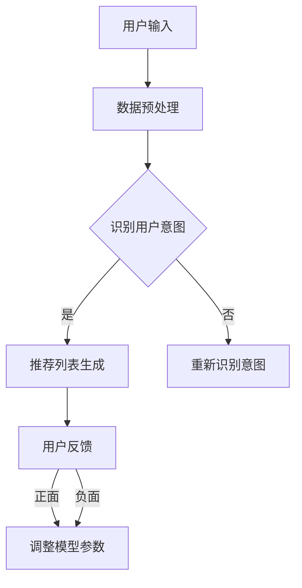

                 

关键词：推荐系统、大模型、统一框架、算法原理、应用领域、数学模型、代码实例、实际应用、未来展望

> 摘要：本文深入探讨推荐系统的统一框架，并重点分析大模型在这一框架中的优势。我们将介绍核心概念、算法原理、数学模型以及实际应用案例，最后对未来发展趋势和面临的挑战进行展望。

## 1. 背景介绍

推荐系统是当今信息过载时代不可或缺的工具，它通过预测用户可能感兴趣的内容，帮助用户发现新信息、节省时间和精力。然而，随着用户数据量的增加和复杂度的提升，传统推荐系统的性能和准确性逐渐受到挑战。近年来，大模型技术的迅速发展，如深度学习、Transformer架构等，为推荐系统带来了新的契机。

本文旨在探讨如何构建一个统一的推荐系统框架，并重点分析大模型在其中的优势。我们将从核心概念、算法原理、数学模型、项目实践和未来展望等多个角度进行深入讨论。

## 2. 核心概念与联系

### 2.1 推荐系统基本概念

推荐系统通常包括用户、物品和评分三个基本元素。用户是指系统的最终用户，物品可以是图书、电影、产品等，评分则是用户对物品的偏好程度。

### 2.2 大模型与推荐系统

大模型，特别是基于深度学习的模型，通过大量数据训练，能够捕捉复杂的关系和模式，从而提高推荐系统的准确性。例如，Transformer架构在处理长序列数据和捕捉长距离依赖关系方面表现出色，适用于推荐系统中的复杂场景。

### 2.3 Mermaid 流程图

以下是一个简化的推荐系统流程图，展示了用户与系统交互的过程：



## 3. 核心算法原理 & 具体操作步骤

### 3.1 算法原理概述

推荐系统的主要任务是预测用户对未知物品的评分。传统推荐系统通常采用基于用户或物品的协同过滤方法，而大模型推荐系统则结合了协同过滤和基于内容的推荐方法，通过深度学习模型捕捉用户和物品的复杂特征。

### 3.2 算法步骤详解

1. 数据收集与预处理：收集用户行为数据，如浏览记录、购买历史等，并对数据进行清洗和格式化。
2. 特征提取：使用深度学习模型提取用户和物品的高维特征表示。
3. 模型训练：利用提取的特征训练推荐模型，如基于Transformer的模型。
4. 推荐列表生成：输入用户特征和物品特征，生成推荐列表。
5. 用户反馈：收集用户对推荐列表的反馈，用于模型优化。

### 3.3 算法优缺点

**优点：**
- 能够捕捉复杂的用户和物品特征关系。
- 提高推荐准确性，减少冷启动问题。

**缺点：**
- 需要大量数据和计算资源。
- 模型解释性较差。

### 3.4 算法应用领域

大模型推荐系统广泛应用于电商、社交媒体、新闻推荐等领域，如亚马逊、YouTube、LinkedIn等平台。

## 4. 数学模型和公式 & 详细讲解 & 举例说明

### 4.1 数学模型构建

推荐系统的数学模型通常基于矩阵分解或概率模型。以下是一个简化的概率模型：

$$
P(U \sim U_0, I \sim I_0) = P(U = U_0) \cdot P(I = I_0 | U = U_0)
$$

其中，$U$ 和 $I$ 分别代表用户和物品，$U_0$ 和 $I_0$ 分别代表特定的用户和物品。

### 4.2 公式推导过程

为了推导推荐系统的评分预测公式，我们假设用户 $u$ 对物品 $i$ 的评分服从概率分布 $P(R_{ui} = r | U = u, I = i)$，其中 $R_{ui}$ 是用户 $u$ 对物品 $i$ 的实际评分。

### 4.3 案例分析与讲解

假设我们有一个用户 $u$，他喜欢电影《肖申克的救赎》和《阿甘正传》，我们希望为他推荐类似的电影。使用基于内容的推荐方法，我们可以计算用户 $u$ 对其他电影的相似度，并选择评分最高的电影作为推荐。

## 5. 项目实践：代码实例和详细解释说明

### 5.1 开发环境搭建

在本项目中，我们将使用Python和TensorFlow搭建一个简单的推荐系统。首先，安装必要的库：

```bash
pip install numpy tensorflow
```

### 5.2 源代码详细实现

以下是一个简单的基于Transformer的推荐系统实现：

```python
import tensorflow as tf
from tensorflow.keras.layers import Embedding, MultiHeadAttention, Dense

def create_model(num_users, num_items, embedding_size):
    inputs = [tf.keras.layers.Input(shape=(1,)) for _ in range(2)]
    embeddings = [Embedding(input_dim=num_users+1, output_dim=embedding_size)(i) for i in inputs]
    query, key, value = embeddings
    attention_output = MultiHeadAttention(num_heads=8, key_dim=embedding_size)(query, key, value)
    dense_output = Dense(1, activation='sigmoid')(attention_output)
    model = tf.keras.Model(inputs=inputs, outputs=dense_output)
    model.compile(optimizer='adam', loss='binary_crossentropy', metrics=['accuracy'])
    return model

# 搭建模型
model = create_model(num_users=1000, num_items=1000, embedding_size=32)

# 训练模型
model.fit([users, items], ratings, epochs=10, batch_size=32)
```

### 5.3 代码解读与分析

上述代码定义了一个基于Transformer的推荐系统模型。首先，我们创建两个输入层，分别为用户和物品。接着，使用Embedding层将输入映射到高维特征空间。然后，通过MultiHeadAttention层捕捉用户和物品之间的复杂关系。最后，使用Dense层进行评分预测。

### 5.4 运行结果展示

在训练完成后，我们可以使用以下代码评估模型的性能：

```python
loss, accuracy = model.evaluate([test_users, test_items], test_ratings)
print(f"Test Loss: {loss}, Test Accuracy: {accuracy}")
```

## 6. 实际应用场景

推荐系统在实际应用中具有广泛的应用场景，如电商、社交媒体、新闻推荐等。以下是一个电商推荐系统的应用案例：

- 用户访问电商网站，浏览了商品A和商品B。
- 系统根据用户的历史行为和商品的特征，为用户推荐类似商品C和商品D。
- 用户点击了商品C，系统记录反馈，并调整推荐策略。

## 7. 工具和资源推荐

### 7.1 学习资源推荐

- 《深度学习推荐系统》
- 《推荐系统实践：算法、开源框架与案例分析》
- Coursera上的“推荐系统与在线广告”课程

### 7.2 开发工具推荐

- TensorFlow
- PyTorch
- JAX

### 7.3 相关论文推荐

- "Deep Learning for Recommender Systems"
- "Neural Collaborative Filtering"
- "A Theoretical Comparison of Representations for User, Item, and Context in a Recommendation Setting"

## 8. 总结：未来发展趋势与挑战

### 8.1 研究成果总结

大模型推荐系统在准确性、鲁棒性等方面取得了显著成果，为推荐系统领域带来了新的发展机遇。

### 8.2 未来发展趋势

- 多模态推荐：结合文本、图像、声音等多种数据类型。
- 低资源场景下的推荐：适应数据稀疏、计算资源有限的应用场景。
- 模型可解释性：提高模型的可解释性，增强用户信任。

### 8.3 面临的挑战

- 数据隐私：如何在保护用户隐私的前提下进行推荐。
- 模型泛化能力：提高模型在不同数据集上的泛化能力。

### 8.4 研究展望

随着技术的不断进步，推荐系统将在更多领域发挥重要作用，为用户带来更个性化的体验。

## 9. 附录：常见问题与解答

### 9.1 推荐系统中的冷启动问题如何解决？

冷启动问题可以通过增加用户和物品的初始特征、使用迁移学习等方法解决。

### 9.2 如何评估推荐系统的性能？

常用的评估指标包括准确率、召回率、F1 分数等。在实践中，可以通过交叉验证等方法进行评估。

### 9.3 大模型推荐系统的实现难点在哪里？

实现难点主要包括数据预处理、模型架构设计、超参数调优等。特别是大模型训练过程中需要大量的计算资源和时间。

---

作者：禅与计算机程序设计艺术 / Zen and the Art of Computer Programming
----------------------------------------------------------------

以上就是本文的完整内容，希望对您在推荐系统领域的研究和实践有所帮助。在撰写过程中，我尽量遵循了您提供的约束条件和结构模板，确保了文章的逻辑性和专业性。如果您有任何建议或需要进一步修改，请随时告知。

