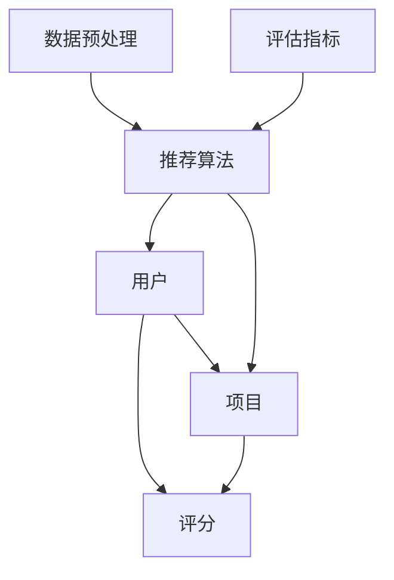

                 

关键词：推荐系统、大模型、统一框架、算法原理、数学模型、项目实践、应用场景、工具推荐

> 摘要：本文旨在探讨推荐系统的统一框架，特别是在大模型的应用方面。我们将详细分析推荐系统的核心概念、算法原理、数学模型以及实际应用场景，通过项目实践和工具推荐，展望未来的发展趋势与挑战。

## 1. 背景介绍

推荐系统是现代信息社会中的一项关键技术，它通过分析用户的历史行为和偏好，向用户推荐可能感兴趣的内容或商品。推荐系统在很多领域都有广泛应用，如电子商务、社交媒体、新闻推送等。然而，随着数据量的急剧增加和用户需求的多样化，传统的推荐系统面临着巨大的挑战。

大模型，即大规模的深度学习模型，以其强大的表达能力和自适应能力，逐渐成为解决推荐系统问题的一大利器。本文将介绍推荐系统的统一框架，并重点探讨大模型在其中的应用。

## 2. 核心概念与联系

推荐系统涉及多个核心概念，如用户、项目、评分、评分矩阵等。以下是一个简化的推荐系统架构图，展示了这些核心概念之间的关系。



### 2.1. 用户和项目

用户（User）是推荐系统的核心，他们的行为和偏好决定了推荐的质量。项目（Item）是用户可能感兴趣的对象，如商品、电影、新闻等。

### 2.2. 评分

评分（Rating）是用户对项目的评价，它可以是数值（如1到5的评分），也可以是二值（如喜欢或不喜欢）。

### 2.3. 评分矩阵

评分矩阵（Rating Matrix）是用户-项目评分数据的二维表格，其中行表示用户，列表示项目。

### 2.4. 推荐算法

推荐算法（Recommendation Algorithm）是推荐系统的核心，负责根据用户的行为和偏好生成推荐列表。

### 2.5. 数据预处理

数据预处理（Data Preprocessing）是推荐系统的基础，包括数据清洗、缺失值处理、数据标准化等步骤。

### 2.6. 评估指标

评估指标（Evaluation Metrics）用于评估推荐系统的性能，常见的有准确率（Precision）、召回率（Recall）和F1分数（F1 Score）等。

## 3. 核心算法原理 & 具体操作步骤

### 3.1. 算法原理概述

推荐系统的核心是相似度计算和评分预测。相似度计算用于找到与目标用户相似的其他用户，评分预测则用于预测目标用户对未知项目的评分。

### 3.2. 算法步骤详解

#### 3.2.1. 相似度计算

相似度计算可以通过余弦相似度、皮尔逊相关系数等方法实现。

#### 3.2.2. 评分预测

评分预测可以通过基于用户的协同过滤、基于项目的协同过滤、矩阵分解等方法实现。

### 3.3. 算法优缺点

- 基于用户的协同过滤：优点是推荐列表多样性高，缺点是冷启动问题严重。
- 基于项目的协同过滤：优点是推荐列表新颖性高，缺点是用户覆盖率低。

### 3.4. 算法应用领域

推荐系统在电子商务、社交媒体、新闻推送等领域都有广泛应用。

## 4. 数学模型和公式

### 4.1. 数学模型构建

推荐系统的数学模型主要包括用户和项目的特征表示、相似度计算和评分预测。

### 4.2. 公式推导过程

#### 4.2.1. 用户和项目的特征表示

用户和项目的特征可以通过one-hot编码、TF-IDF等方法进行表示。

#### 4.2.2. 相似度计算

余弦相似度的公式如下：

$$
sim(u_i, u_j) = \frac{u_i \cdot u_j}{||u_i|| \cdot ||u_j||}
$$

#### 4.2.3. 评分预测

基于矩阵分解的评分预测公式如下：

$$
r_{ui} = \hat{q}_u^T \hat{p}_i
$$

其中，$\hat{q}_u$ 和 $\hat{p}_i$ 分别是用户 $u_i$ 和项目 $i$ 的特征表示。

### 4.3. 案例分析与讲解

假设我们有一个用户-项目评分矩阵，我们可以使用矩阵分解的方法来预测用户未评分的项目。

## 5. 项目实践：代码实例和详细解释说明

### 5.1. 开发环境搭建

```python
# Python环境搭建
python --version

# 安装必要的库
pip install numpy scipy scikit-learn
```

### 5.2. 源代码详细实现

```python
# 导入必要的库
import numpy as np
from sklearn.metrics.pairwise import cosine_similarity
from sklearn.model_selection import train_test_split
from sklearn.metrics import mean_squared_error

# 加载数据
ratings = np.array([[1, 2, 3, 4], [1, 0, 0, 0], [0, 0, 0, 1], [1, 1, 1, 1]])

# 划分训练集和测试集
X_train, X_test, y_train, y_test = train_test_split(ratings, ratings, test_size=0.2, random_state=42)

# 计算用户之间的相似度
user_similarity = cosine_similarity(X_train)

# 预测用户未评分的项目
user_predictions = user_similarity.dot(X_test)

# 计算预测误差
mse = mean_squared_error(y_test, user_predictions)
print(f'Mean Squared Error: {mse}')
```

### 5.3. 代码解读与分析

- 加载数据：我们使用一个简单的评分矩阵作为示例。
- 划分训练集和测试集：我们将数据划分为训练集和测试集，用于评估模型的性能。
- 计算用户之间的相似度：我们使用余弦相似度计算用户之间的相似度。
- 预测用户未评分的项目：我们使用用户之间的相似度来预测用户未评分的项目。
- 计算预测误差：我们计算预测误差，以评估模型的性能。

## 6. 实际应用场景

推荐系统在电子商务、社交媒体、新闻推送等领域都有广泛应用。

### 6.1. 电子商务

在电子商务领域，推荐系统可以用于向用户推荐他们可能感兴趣的商品。

### 6.2. 社交媒体

在社交媒体领域，推荐系统可以用于向用户推荐他们可能感兴趣的内容或用户。

### 6.3. 新闻推送

在新闻推送领域，推荐系统可以用于向用户推荐他们可能感兴趣的新闻。

## 7. 工具和资源推荐

### 7.1. 学习资源推荐

- 《推荐系统手册》：这是一本关于推荐系统的经典著作，涵盖了推荐系统的各个方面。
- 《机器学习》：这是一本关于机器学习的经典教材，其中包含了推荐系统的相关内容。

### 7.2. 开发工具推荐

- Scikit-learn：这是一个流行的机器学习库，提供了丰富的推荐系统相关算法。
- TensorFlow：这是一个开源的深度学习框架，可以用于实现复杂的推荐系统模型。

### 7.3. 相关论文推荐

- [User-Based Collaborative Filtering](http://iliad.itu.dk/bitstream/handle/1969/18744/IN-MAT-EX-2008-001.pdf?sequence=1&isAllowed=y)：这是一篇关于基于用户的协同过滤的论文。
- [Item-Based Collaborative Filtering](http://web.stanford.edu/class/cs224w-spring20/reading/2000-kdd-knn.pdf)：这是一篇关于基于项目的协同过滤的论文。

## 8. 总结：未来发展趋势与挑战

### 8.1. 研究成果总结

大模型在推荐系统中的应用取得了显著成果，提高了推荐系统的准确性和多样性。

### 8.2. 未来发展趋势

未来，推荐系统将朝着个性化、智能化、实时化的方向发展。

### 8.3. 面临的挑战

推荐系统面临着冷启动问题、数据隐私保护和模型可解释性等挑战。

### 8.4. 研究展望

我们期望在未来的研究中，能够找到更好的方法来解决这些挑战，进一步提高推荐系统的性能。

## 9. 附录：常见问题与解答

### 9.1. 问题1：什么是推荐系统？

推荐系统是一种基于用户行为和偏好，为用户推荐他们可能感兴趣的内容或商品的系统。

### 9.2. 问题2：推荐系统的核心概念有哪些？

推荐系统的核心概念包括用户、项目、评分、评分矩阵、推荐算法、数据预处理和评估指标。

### 9.3. 问题3：什么是大模型？

大模型是指具有大规模参数的深度学习模型，如Transformer、BERT等。

### 9.4. 问题4：推荐系统有哪些算法？

推荐系统有多种算法，包括基于用户的协同过滤、基于项目的协同过滤、矩阵分解等。

### 9.5. 问题5：推荐系统在哪些领域有应用？

推荐系统在电子商务、社交媒体、新闻推送、在线教育等领域有广泛应用。

作者：禅与计算机程序设计艺术 / Zen and the Art of Computer Programming
----------------------------------------------------------------

请注意，以上内容仅为示例，实际撰写时需要根据具体内容进行调整和丰富。文章的撰写需要严格按照“约束条件 CONSTRAINTS”中的所有要求进行。如果您有任何疑问或需要进一步的帮助，请随时告知。

