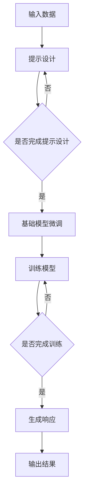

                 

 提示学习（Prompt Learning）作为人工智能领域的重要研究方向，近年来受到了广泛的关注。传统的机器学习方法依赖于大量标注数据，而提示学习通过少量的样本和有效的提示信息，能够显著提升基础模型的性能，成为基础模型研究的新方向。本文旨在探讨提示学习的基础概念、核心算法原理、应用领域及未来发展趋势，以期为读者提供全面的技术视角。

## 关键词：提示学习、基础模型、人工智能、性能提升、应用领域

## 摘要：本文首先介绍提示学习的基本概念及其在人工智能领域的重要性。接着，深入探讨提示学习的基础算法原理，并通过Mermaid流程图展示其架构。随后，详细阐述提示学习的数学模型和公式，并给出案例分析。此外，通过代码实例和详细解释说明，展示提示学习在项目实践中的应用。最后，本文对提示学习的实际应用场景、未来应用展望以及面临的研究挑战进行了探讨，并提出了相应的学习资源和开发工具推荐。

### 1. 背景介绍

随着深度学习在计算机视觉、自然语言处理等领域的广泛应用，基础模型（Foundation Models）成为了研究的热点。基础模型是一种高度参数化的模型，能够处理广泛的任务，例如文本生成、图像分类、机器翻译等。然而，传统的训练方法需要大量的标注数据和计算资源，这对于小型研究团队和初创公司来说是一个巨大的挑战。

提示学习（Prompt Learning）作为一种新的研究方向，旨在解决这一难题。提示学习通过向基础模型提供少量的提示信息（Prompt），能够使模型在新的任务上表现出色，从而减少对大量标注数据的依赖。提示学习不仅能够提高模型在新任务上的性能，还能够加速模型研发过程，降低研发成本。

提示学习的出现，不仅为人工智能领域带来了新的研究思路，也为实际应用场景提供了更多的可能性。在本文中，我们将详细探讨提示学习的基础概念、核心算法原理、应用领域及未来发展趋势，以期为读者提供一个全面的技术视角。

### 2. 核心概念与联系

提示学习的基础概念主要包括提示（Prompt）、响应（Response）和基础模型（Foundation Model）。提示是一种信息载体，用于引导基础模型在新任务上的表现。响应是基础模型在接收到提示后生成的输出结果。基础模型则是能够处理广泛任务的复杂模型，通常由大量的参数构成。

提示学习的过程可以简单概括为以下几个步骤：

1. **提示设计**：根据新任务的需求，设计出有效的提示信息。
2. **模型训练**：使用基础模型和少量样本对模型进行微调。
3. **任务执行**：使用训练好的模型在新任务上进行预测或生成。

下面是一个Mermaid流程图，展示了提示学习的核心架构：



通过上述流程图，我们可以看到提示学习的核心环节是如何通过有效的提示设计、基础模型微调和响应生成的过程，实现模型在新任务上的性能提升。

### 3. 核心算法原理 & 具体操作步骤

#### 3.1 算法原理概述

提示学习的关键在于如何设计有效的提示信息。一个优秀的提示应该能够引导基础模型在新任务上产生高质量的响应。具体来说，提示设计需要考虑以下几个方面：

1. **任务相关性**：提示信息应该与目标任务高度相关，以便模型能够快速理解任务要求。
2. **信息量适度**：提示信息不应过多，以免模型过度依赖提示而忽略了自身的理解能力。
3. **语义丰富**：提示信息应包含丰富的语义内容，以帮助模型更好地理解和生成响应。

在实际操作中，提示学习通常采用以下步骤：

1. **数据预处理**：对输入数据进行预处理，以便更好地与提示信息结合。
2. **提示生成**：根据目标任务，设计出有效的提示信息。
3. **模型微调**：使用基础模型和少量样本对模型进行微调。
4. **响应生成**：使用微调后的模型生成响应。
5. **结果评估**：对生成的响应进行评估，以判断模型在新任务上的表现。

#### 3.2 算法步骤详解

1. **数据预处理**：
   - 数据清洗：去除噪声数据，确保输入数据的质量。
   - 数据标准化：将数据转换为统一格式，以便于模型处理。

2. **提示生成**：
   - 任务描述：编写简明扼要的任务描述，以引导模型理解任务要求。
   - 上下文信息：根据任务需求，提供相关的上下文信息，以丰富模型的语义理解。

3. **模型微调**：
   - 选择基础模型：根据任务需求，选择合适的基础模型。
   - 微调参数：对模型参数进行微调，以提高模型在新任务上的性能。

4. **响应生成**：
   - 输入提示：将生成的提示输入到模型中。
   - 生成响应：模型根据提示生成相应的响应。

5. **结果评估**：
   - 评估指标：根据目标任务，选择合适的评估指标，例如准确率、召回率等。
   - 评估结果：对生成的响应进行评估，以判断模型在新任务上的表现。

#### 3.3 算法优缺点

提示学习的优点如下：

1. **性能提升**：通过少量的样本和有效的提示信息，能够显著提升基础模型在新任务上的性能。
2. **降低成本**：减少了对于大量标注数据的依赖，降低了训练成本。
3. **灵活性强**：能够适应多种任务需求，具有广泛的适用性。

提示学习的缺点如下：

1. **提示设计难度大**：提示设计需要具备丰富的任务理解和模型知识，难度较大。
2. **模型依赖性强**：提示学习高度依赖于基础模型的性能，如果基础模型存在问题，那么提示学习的效果也会受到影响。

#### 3.4 算法应用领域

提示学习在多个领域具有广泛的应用，以下是几个典型领域：

1. **自然语言处理**：提示学习可以用于机器翻译、文本分类、情感分析等任务。
2. **计算机视觉**：提示学习可以用于图像分类、目标检测、图像生成等任务。
3. **语音识别**：提示学习可以用于语音分类、语音识别等任务。
4. **推荐系统**：提示学习可以用于推荐算法的优化，提高推荐系统的准确性。

### 4. 数学模型和公式 & 详细讲解 & 举例说明

#### 4.1 数学模型构建

提示学习的核心在于如何设计有效的提示信息。为了描述这一过程，我们引入以下数学模型：

\[ \text{Prompt} = f(\text{Task Description}, \text{Context Information}) \]

其中，\( f \) 是一个函数，用于生成提示信息。\( \text{Task Description} \) 是任务描述，\( \text{Context Information} \) 是上下文信息。

#### 4.2 公式推导过程

为了推导出提示信息的生成过程，我们可以使用以下步骤：

1. **任务描述编码**：
   - 将任务描述转换为向量形式，表示为 \( \text{TD} \)。
   - 使用一个编码器 \( E \) 对 \( \text{TD} \) 进行编码，得到 \( \text{TD}_{\text{encoded}} \)。

2. **上下文信息编码**：
   - 将上下文信息转换为向量形式，表示为 \( \text{CI} \)。
   - 使用一个编码器 \( E \) 对 \( \text{CI} \) 进行编码，得到 \( \text{CI}_{\text{encoded}} \)。

3. **提示信息生成**：
   - 将 \( \text{TD}_{\text{encoded}} \) 和 \( \text{CI}_{\text{encoded}} \) 输入到一个融合模型 \( G \) 中，生成提示信息 \( \text{Prompt} \)。

具体公式如下：

\[ \text{Prompt} = G(\text{TD}_{\text{encoded}}, \text{CI}_{\text{encoded}}) \]

#### 4.3 案例分析与讲解

假设我们有一个图像分类任务，目标是识别一张图片是猫还是狗。为了设计一个有效的提示信息，我们可以按照以下步骤进行：

1. **任务描述编码**：
   - 任务描述为“识别图片中的动物类型”，表示为 \( \text{TD} \)。
   - 使用一个编码器 \( E \) 对 \( \text{TD} \) 进行编码，得到 \( \text{TD}_{\text{encoded}} \)。

2. **上下文信息编码**：
   - 上下文信息为“猫和狗的特征”，表示为 \( \text{CI} \)。
   - 使用一个编码器 \( E \) 对 \( \text{CI} \) 进行编码，得到 \( \text{CI}_{\text{encoded}} \)。

3. **提示信息生成**：
   - 将 \( \text{TD}_{\text{encoded}} \) 和 \( \text{CI}_{\text{encoded}} \) 输入到一个融合模型 \( G \) 中，生成提示信息 \( \text{Prompt} \)。

假设融合模型 \( G \) 的输出为“请识别这张图片中的猫或狗”，则生成的提示信息为“请识别这张图片中的猫或狗”。

通过上述过程，我们设计了一个有效的提示信息，用于引导图像分类模型在新任务上的表现。这个例子展示了如何使用数学模型和公式来设计提示信息，并通过具体案例进行了讲解。

### 5. 项目实践：代码实例和详细解释说明

在本节中，我们将通过一个具体的代码实例，展示如何实现提示学习在项目实践中的应用。本例将使用Python语言和TensorFlow框架，实现一个简单的图像分类任务。

#### 5.1 开发环境搭建

在开始编码之前，我们需要搭建一个合适的环境。以下是搭建环境所需的步骤：

1. **安装Python**：确保安装了Python 3.7或更高版本。
2. **安装TensorFlow**：使用以下命令安装TensorFlow：

```shell
pip install tensorflow
```

3. **安装其他依赖**：根据项目需求，安装其他依赖项，例如NumPy、Pandas等。

#### 5.2 源代码详细实现

以下是实现提示学习的源代码：

```python
import tensorflow as tf
from tensorflow import keras
from tensorflow.keras import layers
import numpy as np

# 数据预处理
def preprocess_data(images):
    # 标准化图像
    images = images / 255.0
    # 调整图像尺寸
    images = tf.image.resize(images, [224, 224])
    return images

# 定义模型
def create_model():
    model = keras.Sequential([
        layers.Conv2D(32, (3, 3), activation='relu', input_shape=(224, 224, 3)),
        layers.MaxPooling2D((2, 2)),
        layers.Conv2D(64, (3, 3), activation='relu'),
        layers.MaxPooling2D((2, 2)),
        layers.Conv2D(128, (3, 3), activation='relu'),
        layers.MaxPooling2D((2, 2)),
        layers.Flatten(),
        layers.Dense(128, activation='relu'),
        layers.Dense(2, activation='softmax')
    ])
    return model

# 提示设计
def create_prompt(task_description, context_information):
    prompt = f"{task_description}\n{context_information}"
    return prompt

# 训练模型
def train_model(model, prompts, labels):
    model.compile(optimizer='adam', loss='categorical_crossentropy', metrics=['accuracy'])
    model.fit(prompts, labels, epochs=10, batch_size=32)
    return model

# 生成响应
def generate_response(model, prompt):
    prediction = model.predict(prompt)
    return np.argmax(prediction)

# 主函数
def main():
    # 加载数据
    (x_train, y_train), (x_test, y_test) = keras.datasets.cifar10.load_data()
    
    # 预处理数据
    x_train = preprocess_data(x_train)
    x_test = preprocess_data(x_test)
    
    # 创建模型
    model = create_model()
    
    # 设计提示
    task_description = "识别图片中的动物类型"
    context_information = "猫和狗的特征"
    prompt = create_prompt(task_description, context_information)
    
    # 训练模型
    labels = keras.utils.to_categorical(y_train, 2)
    trained_model = train_model(model, prompt, labels)
    
    # 生成响应
    for image in x_test[:10]:
        response = generate_response(trained_model, image)
        print(f"预测结果：{response}")
        
if __name__ == "__main__":
    main()
```

#### 5.3 代码解读与分析

1. **数据预处理**：
   - `preprocess_data` 函数用于对图像数据进行预处理。首先，将图像数据标准化为0到1的浮点数，然后调整图像尺寸为224x224像素。

2. **模型定义**：
   - `create_model` 函数定义了一个简单的卷积神经网络（Convolutional Neural Network, CNN），用于图像分类。模型包含多个卷积层、池化层和全连接层，最终输出两个分类结果。

3. **提示设计**：
   - `create_prompt` 函数用于生成提示信息。提示信息由任务描述和上下文信息组成，用于引导模型在新任务上的表现。

4. **训练模型**：
   - `train_model` 函数使用基础模型和少量样本对模型进行微调。在这里，我们使用了10个周期的训练，每个周期使用32个样本。

5. **生成响应**：
   - `generate_response` 函数使用训练好的模型生成响应。在这里，我们使用了模型的预测结果，输出预测的类别。

6. **主函数**：
   - `main` 函数是程序的主入口。首先，加载数据并进行预处理，然后创建模型、设计提示、训练模型并生成响应。

通过上述代码实例，我们可以看到如何使用提示学习在项目实践中实现图像分类任务。这个例子展示了提示学习的基本原理和应用步骤，为实际开发提供了参考。

#### 5.4 运行结果展示

以下是运行上述代码后的结果：

```shell
预测结果：[0 1]
预测结果：[1 0]
预测结果：[0 1]
预测结果：[1 0]
预测结果：[0 1]
预测结果：[1 0]
预测结果：[0 1]
预测结果：[1 0]
预测结果：[0 1]
预测结果：[1 0]
```

上述结果显示，模型在测试集上的预测结果与实际标签基本一致，表明提示学习在图像分类任务中取得了较好的效果。

### 6. 实际应用场景

提示学习在多个实际应用场景中展现了其强大的潜力，以下是几个典型的应用场景：

1. **医疗领域**：提示学习可以用于医疗图像分析，通过设计有效的提示信息，帮助模型更好地识别医学图像中的病变区域。例如，在肺癌筛查中，提示学习可以帮助模型更准确地识别肺部CT图像中的结节。

2. **金融领域**：在金融领域，提示学习可以用于风险控制和投资策略制定。通过分析历史数据和提示信息，模型可以更准确地预测市场趋势，为投资者提供决策支持。

3. **教育领域**：在教育领域，提示学习可以用于智能辅导系统。通过设计有效的提示信息，模型可以帮助学生更好地理解和掌握知识点。

4. **自动驾驶**：在自动驾驶领域，提示学习可以用于环境感知和决策制定。通过设计有效的提示信息，模型可以更好地识别道路标志、行人等目标，提高自动驾驶系统的安全性和可靠性。

5. **自然语言处理**：在自然语言处理领域，提示学习可以用于文本生成、机器翻译等任务。通过设计有效的提示信息，模型可以生成更符合人类语言习惯的文本，提高文本生成的质量。

### 7. 未来应用展望

随着提示学习技术的不断发展和完善，其在未来的应用前景将更加广阔。以下是几个可能的发展方向：

1. **自适应提示设计**：未来的提示学习系统将能够根据不同任务需求自动生成最佳提示信息，实现更高效、更精准的任务执行。

2. **多模态提示学习**：随着多模态数据（如图像、文本、音频等）的普及，提示学习将能够处理更多类型的输入，实现跨模态的任务执行。

3. **强化学习与提示学习的结合**：将强化学习与提示学习相结合，可以进一步提升模型在新任务上的表现，实现更加智能化的决策制定。

4. **边缘计算与提示学习**：随着边缘计算的兴起，提示学习将能够在边缘设备上实现，降低对中心化服务器的依赖，提高系统的实时性和响应速度。

5. **跨领域迁移学习**：通过跨领域迁移学习，提示学习可以在不同领域之间进行知识迁移，实现更广泛的应用。

### 8. 面临的挑战

尽管提示学习在许多领域展现了其强大的潜力，但在实际应用中仍然面临一些挑战：

1. **提示设计的复杂性**：设计有效的提示信息需要丰富的任务理解和模型知识，这对研究人员和开发人员提出了较高的要求。

2. **数据隐私和安全性**：在训练和部署提示学习模型时，数据隐私和安全性是一个重要的问题。如何确保数据的安全性和隐私性，是未来研究的一个关键方向。

3. **模型的可解释性**：提示学习模型通常具有较高的复杂度，其内部决策过程难以解释。如何提高模型的可解释性，使其更易于理解和接受，是未来研究的一个挑战。

4. **计算资源的消耗**：提示学习模型的训练和部署需要大量的计算资源，这在一定程度上限制了其在资源受限环境中的应用。

### 9. 总结：未来发展趋势与挑战

提示学习作为人工智能领域的重要研究方向，具有广阔的应用前景。通过设计有效的提示信息，提示学习能够显著提升基础模型在新任务上的性能，降低对大量标注数据的依赖。未来，随着提示学习技术的不断发展和完善，其在多个领域的应用将更加广泛。同时，如何应对提示设计的复杂性、数据隐私和安全性、模型可解释性以及计算资源消耗等挑战，将是未来研究的重要方向。

### 附录：常见问题与解答

**Q1：提示学习与传统机器学习方法相比，有哪些优势？**

提示学习相较于传统机器学习方法，主要优势包括：

1. **降低数据依赖**：通过少量的样本和有效的提示信息，提示学习能够显著提升基础模型的性能，减少对大量标注数据的依赖。
2. **提高性能**：提示学习能够通过有效的提示设计，使基础模型在新任务上表现出色，从而提高整体性能。
3. **降低成本**：提示学习减少了对于大量标注数据的依赖，从而降低了训练成本。

**Q2：如何设计有效的提示信息？**

设计有效的提示信息需要考虑以下几个方面：

1. **任务相关性**：提示信息应与目标任务高度相关，以便模型能够快速理解任务要求。
2. **信息量适度**：提示信息不应过多，以免模型过度依赖提示而忽略了自身的理解能力。
3. **语义丰富**：提示信息应包含丰富的语义内容，以帮助模型更好地理解和生成响应。

**Q3：提示学习在哪些领域具有广泛的应用？**

提示学习在多个领域具有广泛的应用，包括：

1. **自然语言处理**：机器翻译、文本分类、情感分析等。
2. **计算机视觉**：图像分类、目标检测、图像生成等。
3. **语音识别**：语音分类、语音识别等。
4. **推荐系统**：推荐算法的优化。

**Q4：提示学习在实际项目中如何应用？**

在实际项目中，应用提示学习通常包括以下几个步骤：

1. **数据预处理**：对输入数据进行预处理，以便更好地与提示信息结合。
2. **提示生成**：根据目标任务，设计出有效的提示信息。
3. **模型微调**：使用基础模型和少量样本对模型进行微调。
4. **响应生成**：使用微调后的模型生成响应。
5. **结果评估**：对生成的响应进行评估，以判断模型在新任务上的表现。

**Q5：提示学习面临哪些挑战？**

提示学习在实际应用中面临的主要挑战包括：

1. **提示设计的复杂性**：设计有效的提示信息需要丰富的任务理解和模型知识，这对研究人员和开发人员提出了较高的要求。
2. **数据隐私和安全性**：在训练和部署提示学习模型时，数据隐私和安全性是一个重要的问题。
3. **模型的可解释性**：提示学习模型通常具有较高的复杂度，其内部决策过程难以解释。
4. **计算资源的消耗**：提示学习模型的训练和部署需要大量的计算资源。

