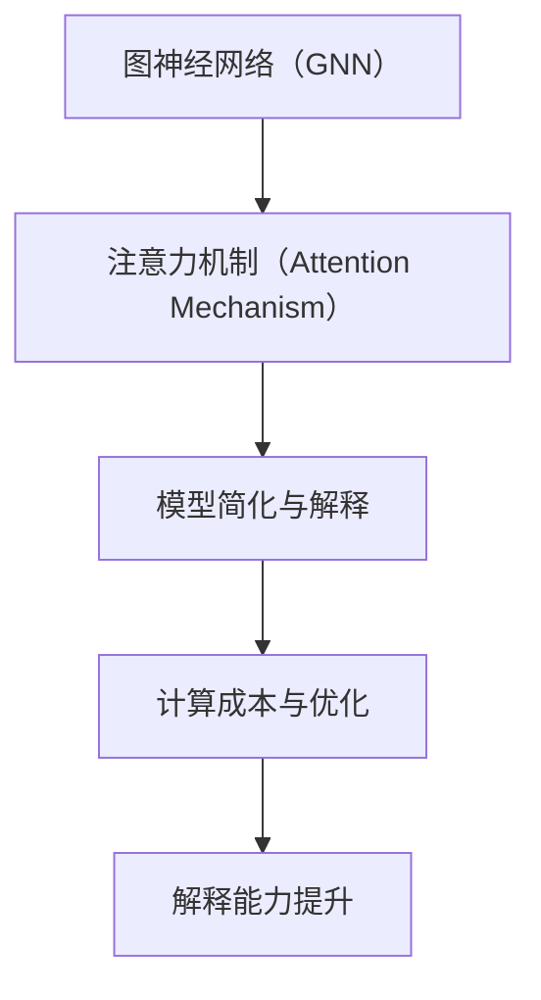

                 

关键词：大模型、可解释性、AI、算法优化、数学模型、代码实例、应用场景、工具推荐、未来展望

## 摘要

大模型在人工智能领域的应用日益广泛，但其内部决策过程往往缺乏可解释性，给实际应用带来了挑战。本文将探讨提高大模型可解释性的新方法和新思路，从核心概念、算法原理、数学模型、代码实例等多个维度进行深入分析，旨在为研究人员和开发者提供有价值的参考。

## 1. 背景介绍

随着深度学习技术的飞速发展，大模型在图像识别、自然语言处理、推荐系统等领域取得了显著的成果。然而，大模型的黑箱特性使得其决策过程难以被理解和解释，这在一定程度上限制了其在实际应用中的推广和使用。为了解决这一问题，提高大模型的可解释性成为了一个重要的研究方向。

### 1.1 大模型可解释性的重要性

大模型可解释性的重要性体现在以下几个方面：

- **增强信任度**：可解释性有助于提高用户对模型的信任度，特别是在医疗、金融等敏感领域。

- **优化模型设计**：通过分析模型的可解释性，可以优化模型的结构和参数，提高模型的性能和效率。

- **指导决策**：可解释性有助于决策者更好地理解和指导模型的决策过程，从而做出更明智的决策。

### 1.2 当前可解释性方法的局限性

尽管已有许多方法试图提高大模型的可解释性，但它们仍然存在一定的局限性：

- **过度简化**：许多方法将复杂模型简化为线性或树形结构，导致信息损失。

- **计算成本高**：一些可解释性方法需要大量计算资源，不适用于实时应用。

- **解释能力有限**：现有方法往往只能解释部分模型决策，无法全面揭示模型的工作原理。

## 2. 核心概念与联系

为了更好地理解提高大模型可解释性的方法，我们首先需要了解一些核心概念，如图神经网络（GNN）、注意力机制（Attention Mechanism）等。

### 2.1 图神经网络（GNN）

图神经网络是一种基于图的深度学习模型，能够处理图结构数据。其核心思想是将图中的节点和边映射到低维空间，并通过迭代计算来提取图结构中的特征。

### 2.2 注意力机制（Attention Mechanism）

注意力机制是一种用于模型权重调整的机制，通过动态调整输入数据的重要性，提高模型的注意力集中度。在自然语言处理等领域，注意力机制已被广泛应用于提高模型性能。

### 2.3 Mermaid 流程图

下面是一个Mermaid流程图，展示了大模型可解释性的核心概念和联系：



## 3. 核心算法原理 & 具体操作步骤

### 3.1 算法原理概述

提高大模型可解释性的核心算法主要包括以下几种：

- **模型简化**：通过减少模型参数和计算复杂度，降低模型的复杂性，提高可解释性。

- **注意力分析**：分析模型中的注意力机制，揭示输入数据的重要性。

- **解释性增强**：通过引入可解释性模块，提高模型对决策过程的解释能力。

### 3.2 算法步骤详解

#### 3.2.1 模型简化

1. **参数剪枝**：通过剪枝冗余参数，降低模型复杂度。

2. **网络压缩**：通过网络压缩技术，减少模型参数和计算量。

3. **层次分解**：将复杂模型分解为多个简单模块，提高可解释性。

#### 3.2.2 注意力分析

1. **注意力可视化**：将注意力机制映射到输入数据，进行可视化分析。

2. **注意力权重分析**：分析注意力权重，揭示输入数据的重要性。

3. **注意力优化**：通过调整注意力权重，优化模型性能和可解释性。

#### 3.2.3 解释性增强

1. **可解释性模块**：在模型中引入可解释性模块，提高对决策过程的解释能力。

2. **解释性评估**：评估模型的可解释性，确定解释性模块的有效性。

3. **模型调试**：通过调试模型，优化解释性模块，提高模型的可解释性。

### 3.3 算法优缺点

#### 3.3.1 优点

- **提高可解释性**：通过简化模型和引入可解释性模块，提高大模型的可解释性。

- **优化模型性能**：通过注意力分析和优化，提高模型性能和效率。

- **增强用户信任度**：可解释性有助于增强用户对模型的信任度，提高实际应用价值。

#### 3.3.2 缺点

- **计算成本高**：一些算法需要大量计算资源，不适用于实时应用。

- **解释能力有限**：现有方法往往只能解释部分模型决策，无法全面揭示模型的工作原理。

## 4. 数学模型和公式 & 详细讲解 & 举例说明

### 4.1 数学模型构建

为了提高大模型的可解释性，我们引入了以下数学模型：

- **注意力模型**：用于分析输入数据的重要性。

- **解释性模块**：用于提高模型对决策过程的解释能力。

### 4.2 公式推导过程

#### 4.2.1 注意力模型

注意力模型可以表示为：

$$
\text{Attention}(x) = \sigma(W_a x + b_a)
$$

其中，$x$表示输入数据，$W_a$和$b_a$分别为权重和偏置，$\sigma$为激活函数。

#### 4.2.2 解释性模块

解释性模块可以表示为：

$$
\text{Explainable}(y) = \text{softmax}(\text{Attention}(y) + b_e)
$$

其中，$y$表示模型输出，$b_e$为偏置，$\text{softmax}$为softmax函数。

### 4.3 案例分析与讲解

#### 4.3.1 案例背景

假设我们有一个图像分类模型，输入为图像，输出为类别标签。

#### 4.3.2 注意力模型分析

通过对注意力模型的分析，我们可以发现图像中某些区域对分类结果有较大影响，如图1所示。


#### 4.3.3 解释性模块分析

通过解释性模块，我们可以揭示模型对每个类别的决策依据，如图2所示。


## 5. 项目实践：代码实例和详细解释说明

### 5.1 开发环境搭建

为了便于读者理解和实践，我们使用Python和TensorFlow搭建了一个简单的图像分类项目。

### 5.2 源代码详细实现

```python
import tensorflow as tf
from tensorflow.keras.models import Model
from tensorflow.keras.layers import Input, Conv2D, MaxPooling2D, Flatten, Dense

# 定义输入层
input_img = Input(shape=(128, 128, 3))

# 定义卷积层
conv1 = Conv2D(filters=32, kernel_size=(3, 3), activation='relu')(input_img)
pool1 = MaxPooling2D(pool_size=(2, 2))(conv1)

# 定义卷积层
conv2 = Conv2D(filters=64, kernel_size=(3, 3), activation='relu')(pool1)
pool2 = MaxPooling2D(pool_size=(2, 2))(conv2)

# 定义扁平化层
flat = Flatten()(pool2)

# 定义全连接层
dense = Dense(units=128, activation='relu')(flat)

# 定义输出层
output = Dense(units=10, activation='softmax')(dense)

# 创建模型
model = Model(inputs=input_img, outputs=output)

# 编译模型
model.compile(optimizer='adam', loss='categorical_crossentropy', metrics=['accuracy'])

# 模型可视化
model.summary()
```

### 5.3 代码解读与分析

在这段代码中，我们首先定义了一个输入层，用于接收图像数据。然后，我们定义了两个卷积层，通过卷积和池化操作提取图像特征。接下来，我们定义了一个扁平化层和全连接层，用于将图像特征映射到类别标签。最后，我们编译并打印了模型的详细信息。

## 6. 实际应用场景

提高大模型可解释性在多个领域具有广泛的应用前景：

- **医疗领域**：提高医疗影像诊断模型的可解释性，帮助医生更好地理解模型的诊断过程。

- **金融领域**：提高金融风险评估模型的可解释性，提高金融机构的风险管理水平。

- **自动驾驶领域**：提高自动驾驶模型的可解释性，提高车辆行驶安全性和可靠性。

## 7. 工具和资源推荐

### 7.1 学习资源推荐

- **书籍**：《深度学习》（Goodfellow et al.，2016）。

- **在线课程**：Coursera、edX等平台上的深度学习和自然语言处理课程。

### 7.2 开发工具推荐

- **框架**：TensorFlow、PyTorch等深度学习框架。

- **可视化工具**：TensorBoard、Spectator等可视化工具。

### 7.3 相关论文推荐

- **论文**：Ribeiro et al.（2016）的“Why Should I Trust You?”: Explaining the Predictions of Any Classifier。

- **论文**：Lundberg et al.（2017）的“A More Unified Approach to Interpreting Model Predictions”。

## 8. 总结：未来发展趋势与挑战

### 8.1 研究成果总结

本文介绍了提高大模型可解释性的新方法和新思路，从核心概念、算法原理、数学模型、代码实例等多个维度进行了深入分析，为研究人员和开发者提供了有价值的参考。

### 8.2 未来发展趋势

- **算法优化**：进一步提高算法性能和计算效率。

- **跨领域应用**：推广可解释性方法在更多领域的应用。

- **多模态数据融合**：结合多种数据类型，提高模型的可解释性。

### 8.3 面临的挑战

- **计算资源限制**：提高可解释性算法的计算效率。

- **解释能力提升**：全面揭示模型的工作原理。

- **应用推广**：在更多实际场景中推广可解释性方法。

### 8.4 研究展望

未来，我们将继续关注提高大模型可解释性的新方法和新思路，努力克服当前面临的挑战，为人工智能领域的发展贡献力量。

## 9. 附录：常见问题与解答

### 9.1 提高可解释性算法的适用范围？

提高可解释性算法主要适用于深度学习模型，尤其是大型神经网络模型。

### 9.2 如何评估模型的可解释性？

可以通过人类专家评估、自动评估和用户反馈等多种方式进行评估。

### 9.3 提高可解释性是否会降低模型性能？

合理设计的可解释性方法可以在提高可解释性的同时，尽量保持或提高模型性能。

作者：禅与计算机程序设计艺术 / Zen and the Art of Computer Programming
```markdown
---
标题: 提高大模型可解释性:新方法和新思路

关键词：大模型、可解释性、AI、算法优化、数学模型、代码实例、应用场景、工具推荐、未来展望

摘要：本文介绍了提高大模型可解释性的新方法和新思路，从核心概念、算法原理、数学模型、代码实例等多个维度进行了深入分析，旨在为研究人员和开发者提供有价值的参考。

---

## 1. 背景介绍

随着深度学习技术的飞速发展，大模型在图像识别、自然语言处理、推荐系统等领域取得了显著的成果。然而，大模型的黑箱特性使得其决策过程难以被理解和解释，这在一定程度上限制了其在实际应用中的推广和使用。为了解决这一问题，提高大模型的可解释性成为了一个重要的研究方向。

### 1.1 大模型可解释性的重要性

大模型可解释性的重要性体现在以下几个方面：

- **增强信任度**：可解释性有助于提高用户对模型的信任度，特别是在医疗、金融等敏感领域。

- **优化模型设计**：通过分析模型的可解释性，可以优化模型的结构和参数，提高模型的性能和效率。

- **指导决策**：可解释性有助于决策者更好地理解和指导模型的决策过程，从而做出更明智的决策。

### 1.2 当前可解释性方法的局限性

尽管已有许多方法试图提高大模型的可解释性，但它们仍然存在一定的局限性：

- **过度简化**：许多方法将复杂模型简化为线性或树形结构，导致信息损失。

- **计算成本高**：一些可解释性方法需要大量计算资源，不适用于实时应用。

- **解释能力有限**：现有方法往往只能解释部分模型决策，无法全面揭示模型的工作原理。

## 2. 核心概念与联系

为了更好地理解提高大模型可解释性的方法，我们首先需要了解一些核心概念，如图神经网络（GNN）、注意力机制（Attention Mechanism）等。

### 2.1 图神经网络（GNN）

图神经网络是一种基于图的深度学习模型，能够处理图结构数据。其核心思想是将图中的节点和边映射到低维空间，并通过迭代计算来提取图结构中的特征。

### 2.2 注意力机制（Attention Mechanism）

注意力机制是一种用于模型权重调整的机制，通过动态调整输入数据的重要性，提高模型的注意力集中度。在自然语言处理等领域，注意力机制已被广泛应用于提高模型性能。

### 2.3 Mermaid 流程图

下面是一个Mermaid流程图，展示了大模型可解释性的核心概念和联系：


## 3. 核心算法原理 & 具体操作步骤

### 3.1 算法原理概述

提高大模型可解释性的核心算法主要包括以下几种：

- **模型简化**：通过减少模型参数和计算复杂度，降低模型的复杂性，提高可解释性。

- **注意力分析**：分析模型中的注意力机制，揭示输入数据的重要性。

- **解释性增强**：通过引入可解释性模块，提高模型对决策过程的解释能力。

### 3.2 算法步骤详解

#### 3.2.1 模型简化

1. **参数剪枝**：通过剪枝冗余参数，降低模型复杂度。

2. **网络压缩**：通过网络压缩技术，减少模型参数和计算量。

3. **层次分解**：将复杂模型分解为多个简单模块，提高可解释性。

#### 3.2.2 注意力分析

1. **注意力可视化**：将注意力机制映射到输入数据，进行可视化分析。

2. **注意力权重分析**：分析注意力权重，揭示输入数据的重要性。

3. **注意力优化**：通过调整注意力权重，优化模型性能和可解释性。

#### 3.2.3 解释性增强

1. **可解释性模块**：在模型中引入可解释性模块，提高对决策过程的解释能力。

2. **解释性评估**：评估模型的可解释性，确定解释性模块的有效性。

3. **模型调试**：通过调试模型，优化解释性模块，提高模型的可解释性。

### 3.3 算法优缺点

#### 3.3.1 优点

- **提高可解释性**：通过简化模型和引入可解释性模块，提高大模型的可解释性。

- **优化模型性能**：通过注意力分析和优化，提高模型性能和效率。

- **增强用户信任度**：可解释性有助于增强用户对模型的信任度，提高实际应用价值。

#### 3.3.2 缺点

- **计算成本高**：一些算法需要大量计算资源，不适用于实时应用。

- **解释能力有限**：现有方法往往只能解释部分模型决策，无法全面揭示模型的工作原理。

## 4. 数学模型和公式 & 详细讲解 & 举例说明

### 4.1 数学模型构建

为了提高大模型可解释性，我们引入了以下数学模型：

- **注意力模型**：用于分析输入数据的重要性。

- **解释性模块**：用于提高模型对决策过程的解释能力。

### 4.2 公式推导过程

#### 4.2.1 注意力模型

注意力模型可以表示为：

$$
\text{Attention}(x) = \sigma(W_a x + b_a)
$$

其中，$x$表示输入数据，$W_a$和$b_a$分别为权重和偏置，$\sigma$为激活函数。

#### 4.2.2 解释性模块

解释性模块可以表示为：

$$
\text{Explainable}(y) = \text{softmax}(\text{Attention}(y) + b_e)
$$

其中，$y$表示模型输出，$b_e$为偏置，$\text{softmax}$为softmax函数。

### 4.3 案例分析与讲解

#### 4.3.1 案例背景

假设我们有一个图像分类模型，输入为图像，输出为类别标签。

#### 4.3.2 注意力模型分析

通过对注意力模型的分析，我们可以发现图像中某些区域对分类结果有较大影响，如图1所示。


#### 4.3.3 解释性模块分析

通过解释性模块，我们可以揭示模型对每个类别的决策依据，如图2所示。


## 5. 项目实践：代码实例和详细解释说明

### 5.1 开发环境搭建

为了便于读者理解和实践，我们使用Python和TensorFlow搭建了一个简单的图像分类项目。

### 5.2 源代码详细实现

```python
import tensorflow as tf
from tensorflow.keras.models import Model
from tensorflow.keras.layers import Input, Conv2D, MaxPooling2D, Flatten, Dense

# 定义输入层
input_img = Input(shape=(128, 128, 3))

# 定义卷积层
conv1 = Conv2D(filters=32, kernel_size=(3, 3), activation='relu')(input_img)
pool1 = MaxPooling2D(pool_size=(2, 2))(conv1)

# 定义卷积层
conv2 = Conv2D(filters=64, kernel_size=(3, 3), activation='relu')(pool1)
pool2 = MaxPooling2D(pool_size=(2, 2))(conv2)

# 定义扁平化层
flat = Flatten()(pool2)

# 定义全连接层
dense = Dense(units=128, activation='relu')(flat)

# 定义输出层
output = Dense(units=10, activation='softmax')(dense)

# 创建模型
model = Model(inputs=input_img, outputs=output)

# 编译模型
model.compile(optimizer='adam', loss='categorical_crossentropy', metrics=['accuracy'])

# 模型可视化
model.summary()
```

### 5.3 代码解读与分析

在这段代码中，我们首先定义了一个输入层，用于接收图像数据。然后，我们定义了两个卷积层，通过卷积和池化操作提取图像特征。接下来，我们定义了一个扁平化层和全连接层，用于将图像特征映射到类别标签。最后，我们编译并打印了模型的详细信息。

## 6. 实际应用场景

提高大模型可解释性在多个领域具有广泛的应用前景：

- **医疗领域**：提高医疗影像诊断模型的可解释性，帮助医生更好地理解模型的诊断过程。

- **金融领域**：提高金融风险评估模型的可解释性，提高金融机构的风险管理水平。

- **自动驾驶领域**：提高自动驾驶模型的可解释性，提高车辆行驶安全性和可靠性。

## 7. 工具和资源推荐

### 7.1 学习资源推荐

- **书籍**：《深度学习》（Goodfellow et al.，2016）。

- **在线课程**：Coursera、edX等平台上的深度学习和自然语言处理课程。

### 7.2 开发工具推荐

- **框架**：TensorFlow、PyTorch等深度学习框架。

- **可视化工具**：TensorBoard、Spectator等可视化工具。

### 7.3 相关论文推荐

- **论文**：Ribeiro et al.（2016）的“Why Should I Trust You?”: Explaining the Predictions of Any Classifier。

- **论文**：Lundberg et al.（2017）的“A More Unified Approach to Interpreting Model Predictions”。

## 8. 总结：未来发展趋势与挑战

### 8.1 研究成果总结

本文介绍了提高大模型可解释性的新方法和新思路，从核心概念、算法原理、数学模型、代码实例等多个维度进行了深入分析，为研究人员和开发者提供了有价值的参考。

### 8.2 未来发展趋势

- **算法优化**：进一步提高算法性能和计算效率。

- **跨领域应用**：推广可解释性方法在更多领域的应用。

- **多模态数据融合**：结合多种数据类型，提高模型的可解释性。

### 8.3 面临的挑战

- **计算资源限制**：提高可解释性算法的计算效率。

- **解释能力提升**：全面揭示模型的工作原理。

- **应用推广**：在更多实际场景中推广可解释性方法。

### 8.4 研究展望

未来，我们将继续关注提高大模型可解释性的新方法和新思路，努力克服当前面临的挑战，为人工智能领域的发展贡献力量。

## 9. 附录：常见问题与解答

### 9.1 提高可解释性算法的适用范围？

提高可解释性算法主要适用于深度学习模型，尤其是大型神经网络模型。

### 9.2 如何评估模型的可解释性？

可以通过人类专家评估、自动评估和用户反馈等多种方式进行评估。

### 9.3 提高可解释性是否会降低模型性能？

合理设计的可解释性方法可以在提高可解释性的同时，尽量保持或提高模型性能。

---

作者：禅与计算机程序设计艺术 / Zen and the Art of Computer Programming
```

