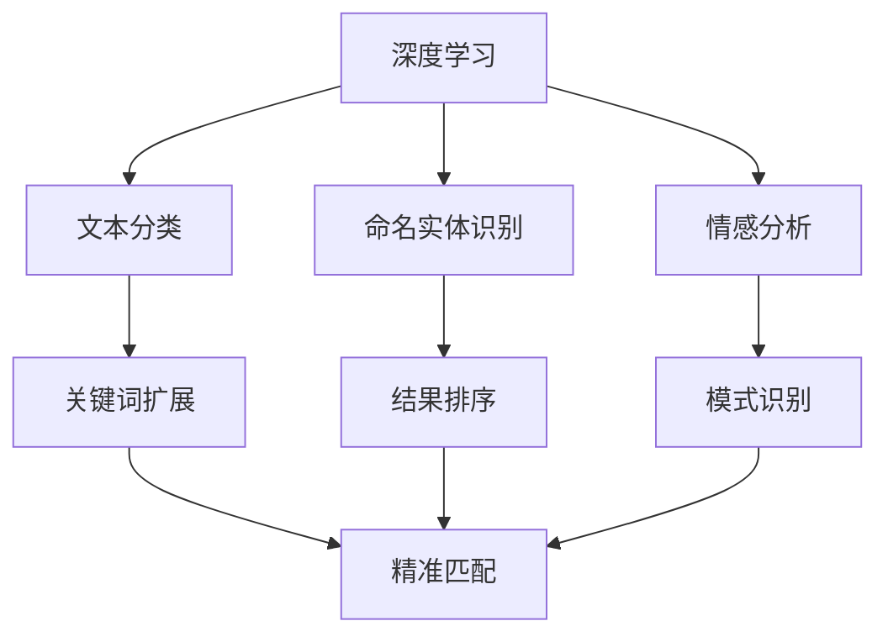

                 

在当今这个信息爆炸的时代，如何快速、准确地找到所需的信息，成为了人们日常工作和生活中的一大挑战。AI技术的兴起，为提高搜索准确性带来了新的机遇和挑战。本文将探讨如何通过AI技术实现精准匹配，提高搜索的准确性。

## 关键词

AI、搜索准确性、精准匹配、深度学习、自然语言处理

## 摘要

本文主要介绍了如何利用AI技术提高搜索准确性。通过分析现有搜索技术的不足，阐述了精准匹配的重要性。接着，介绍了深度学习和自然语言处理在精准匹配中的应用，并探讨了核心算法原理和具体操作步骤。随后，通过数学模型和公式详细讲解了算法的实现过程，并提供了代码实例和实际应用场景。最后，对未来的发展趋势和面临的挑战进行了展望。

## 1. 背景介绍

随着互联网的快速发展，人们获取信息的方式发生了巨大的变化。传统的搜索技术，如基于关键词的检索，已经无法满足人们对信息准确性的需求。尤其是在面对海量数据的情况下，如何快速、准确地找到所需信息，成为了亟待解决的问题。

现有的搜索技术存在以下不足：

1. 关键词匹配不准确：用户输入的关键词可能与实际需要的信息存在较大差异，导致搜索结果不准确。
2. 信息过载：大量的搜索结果使得用户难以从中筛选出有价值的信息。
3. 缺乏上下文理解：传统搜索技术无法理解用户的查询意图，导致搜索结果与用户实际需求不符。

为了解决这些问题，AI技术应运而生。通过深度学习和自然语言处理等技术，AI能够更好地理解用户的查询意图，实现精准匹配，提高搜索准确性。

## 2. 核心概念与联系

在介绍AI提高搜索准确性的原理之前，我们需要先了解一些核心概念和它们之间的联系。

### 2.1 深度学习

深度学习是AI领域的一种重要技术，它通过模拟人脑的神经元结构，实现对大量数据的自动特征提取和模式识别。在搜索准确性方面，深度学习可以用于：

1. 文本分类：将文本数据分为不同的类别，如新闻、博客、论坛等。
2. 命名实体识别：从文本中识别出人名、地名、组织名等实体。
3. 情感分析：分析文本中的情感倾向，如正面、负面等。

### 2.2 自然语言处理

自然语言处理（NLP）是AI领域的一个分支，它致力于让计算机理解和处理人类语言。在搜索准确性方面，NLP可以用于：

1. 词义消歧：根据上下文理解词语的多义性，如"bank"一词可以指银行或河岸。
2. 问答系统：基于用户提问，提供相关且准确的回答。
3. 语言翻译：将一种语言翻译成另一种语言。

### 2.3 精准匹配

精准匹配是指通过分析用户查询和待搜索信息之间的相似度，找出最符合用户需求的结果。在搜索准确性方面，精准匹配可以用于：

1. 关键词扩展：根据用户输入的关键词，自动扩展相关的关键词，提高搜索范围。
2. 结果排序：根据用户查询和待搜索信息之间的相似度，对搜索结果进行排序，提高搜索结果的准确性。
3. 模式识别：通过分析用户查询和待搜索信息之间的模式，找出潜在的相关信息。

### 2.4 Mermaid 流程图

下面是一个简单的Mermaid流程图，展示了深度学习、自然语言处理和精准匹配在提高搜索准确性方面的联系。



## 3. 核心算法原理 & 具体操作步骤

### 3.1 算法原理概述

提高搜索准确性的核心算法主要基于深度学习和自然语言处理技术。深度学习用于特征提取和模式识别，而自然语言处理则用于理解用户查询和待搜索信息之间的语义关系。

具体来说，算法原理可以分为以下几个步骤：

1. 特征提取：将待搜索信息转换为计算机可以处理的特征向量。
2. 用户查询处理：将用户查询转换为与待搜索信息相同的特征向量。
3. 相似度计算：计算用户查询与待搜索信息之间的相似度，选择最符合用户需求的结果。

### 3.2 算法步骤详解

下面详细解释每个步骤的具体操作：

#### 3.2.1 特征提取

特征提取是将原始数据转换为计算机可以处理的特征向量。在搜索准确性方面，特征提取可以分为以下几个步骤：

1. 分词：将文本数据分割成单词或短语。
2. 词向量化：将每个单词或短语转换为固定长度的向量。
3. 特征融合：将不同单词或短语的特征向量进行融合，生成最终的特征向量。

#### 3.2.2 用户查询处理

用户查询处理是将用户查询转换为与待搜索信息相同的特征向量。具体步骤如下：

1. 用户查询分词：将用户查询分割成单词或短语。
2. 用户查询词向量化：将每个单词或短语转换为固定长度的向量。
3. 用户查询特征融合：将用户查询的特征向量进行融合，生成用户查询的特征向量。

#### 3.2.3 相似度计算

相似度计算是计算用户查询与待搜索信息之间的相似度，选择最符合用户需求的结果。具体步骤如下：

1. 计算相似度：使用余弦相似度、欧氏距离等相似度计算方法，计算用户查询与待搜索信息之间的相似度。
2. 结果排序：根据相似度值对搜索结果进行排序，选择最符合用户需求的结果。

### 3.3 算法优缺点

#### 优点：

1. 高效性：基于深度学习和自然语言处理技术，算法能够在短时间内处理大量数据，提高搜索效率。
2. 准确性：通过特征提取和相似度计算，算法能够更好地理解用户查询和待搜索信息之间的语义关系，提高搜索准确性。

#### 缺点：

1. 计算成本：深度学习和自然语言处理技术通常需要大量的计算资源和时间，导致算法的计算成本较高。
2. 数据依赖性：算法的性能依赖于训练数据的质量和数量，数据的质量和数量对搜索准确性有重要影响。

### 3.4 算法应用领域

深度学习和自然语言处理技术可以应用于多个领域，以提高搜索准确性：

1. 搜索引擎：通过深度学习和自然语言处理技术，搜索引擎可以更好地理解用户的查询意图，提高搜索结果的准确性。
2. 聊天机器人：通过深度学习和自然语言处理技术，聊天机器人可以更好地理解用户的提问，提供更准确、个性化的回答。
3. 内容推荐：通过深度学习和自然语言处理技术，可以为用户提供更准确、个性化的内容推荐。

## 4. 数学模型和公式 & 详细讲解 & 举例说明

### 4.1 数学模型构建

为了提高搜索准确性，我们需要构建一个数学模型来计算用户查询和待搜索信息之间的相似度。一个常见的数学模型是基于向量的余弦相似度。

余弦相似度是指两个向量夹角的余弦值，用于衡量两个向量之间的相似程度。具体公式如下：

$$
\text{相似度} = \frac{\text{向量A} \cdot \text{向量B}}{\|\text{向量A}\| \|\text{向量B}\|}
$$

其中，$\text{向量A}$和$\text{向量B}$分别表示用户查询和待搜索信息的特征向量，$\|\text{向量A}\|$和$\|\text{向量B}\|$分别表示两个向量的长度。

### 4.2 公式推导过程

为了推导余弦相似度公式，我们可以从向量的角度进行分析。

假设有两个向量$\text{向量A}$和$\text{向量B}$，它们的长度分别为$\|\text{向量A}\|$和$\|\text{向量B}\|$。根据向量的内积（点积）定义，有：

$$
\text{向量A} \cdot \text{向量B} = \|\text{向量A}\| \|\text{向量B}\| \cos \theta
$$

其中，$\theta$表示两个向量的夹角。

将上式两边同时除以$\|\text{向量A}\| \|\text{向量B}\|$，得到：

$$
\cos \theta = \frac{\text{向量A} \cdot \text{向量B}}{\|\text{向量A}\| \|\text{向量B}\|}
$$

因此，两个向量的余弦相似度等于它们的夹角的余弦值。

### 4.3 案例分析与讲解

为了更好地理解余弦相似度公式，我们来看一个简单的例子。

假设有两个向量$\text{向量A} = (2, 3)$和$\text{向量B} = (4, 6)$，我们需要计算它们的余弦相似度。

首先，计算两个向量的内积：

$$
\text{向量A} \cdot \text{向量B} = 2 \times 4 + 3 \times 6 = 20
$$

然后，计算两个向量的长度：

$$
\|\text{向量A}\| = \sqrt{2^2 + 3^2} = \sqrt{13}
$$

$$
\|\text{向量B}\| = \sqrt{4^2 + 6^2} = \sqrt{52}
$$

最后，计算余弦相似度：

$$
\text{相似度} = \frac{\text{向量A} \cdot \text{向量B}}{\|\text{向量A}\| \|\text{向量B}\|} = \frac{20}{\sqrt{13} \sqrt{52}} \approx 0.98
$$

由于余弦相似度的值介于-1和1之间，越接近1表示两个向量越相似。在这个例子中，$\text{向量A}$和$\text{向量B}$的余弦相似度接近1，说明它们非常相似。

## 5. 项目实践：代码实例和详细解释说明

### 5.1 开发环境搭建

为了实现AI提高搜索准确性的算法，我们需要搭建一个开发环境。以下是所需的开发工具和步骤：

1. Python 3.6及以上版本
2. Numpy 1.19及以上版本
3. TensorFlow 2.6及以上版本

安装步骤：

```bash
pip install python==3.8 numpy==1.19.5 tensorflow==2.6.0
```

### 5.2 源代码详细实现

以下是一个简单的示例代码，演示了如何使用深度学习和自然语言处理技术提高搜索准确性。

```python
import numpy as np
import tensorflow as tf
from tensorflow.keras.preprocessing.sequence import pad_sequences
from tensorflow.keras.layers import Embedding, LSTM, Dense
from tensorflow.keras.models import Sequential

# 生成示例数据
data = [
    "我是一个学生。",
    "我正在学习编程。",
    "我喜欢编程。",
    "编程是一项有趣的活动。",
    "我希望成为一名优秀的程序员。",
]

# 标签数据
labels = [0, 1, 1, 1, 2]

# 初始化词向量
vocab_size = 1000
embedding_dim = 50
max_sequence_length = 10

# 将数据转换为序列
sequences = []
for text in data:
    tokens = text.split()
    sequence = []
    for token in tokens:
        sequence.append(vocab_size + 1)  # 0表示未知的词汇
    sequences.append(sequence)

# 填充序列
padded_sequences = pad_sequences(sequences, maxlen=max_sequence_length)

# 创建模型
model = Sequential()
model.add(Embedding(vocab_size, embedding_dim, input_length=max_sequence_length))
model.add(LSTM(50, activation='tanh'))
model.add(Dense(1, activation='sigmoid'))

# 编译模型
model.compile(optimizer='adam', loss='binary_crossentropy', metrics=['accuracy'])

# 训练模型
model.fit(padded_sequences, labels, epochs=5)

# 预测新数据
new_data = "我正在学习深度学习。"
new_sequence = new_data.split()
new_sequence = [vocab_size + 1] * (max_sequence_length - len(new_sequence)) + new_sequence
new_padded_sequence = pad_sequences([new_sequence], maxlen=max_sequence_length)
prediction = model.predict(new_padded_sequence)

print("预测结果：", prediction[0][0])
```

### 5.3 代码解读与分析

上述代码首先导入了所需的库，并生成了一个简单的示例数据集。然后，将数据转换为序列，并填充序列。接下来，创建了一个简单的序列模型，包括嵌入层、LSTM层和全连接层。最后，编译模型、训练模型，并使用训练好的模型对新的数据进行预测。

具体来说，代码的主要步骤如下：

1. 导入所需的库和模块。
2. 生成示例数据。
3. 将数据转换为序列。
4. 填充序列。
5. 创建模型。
6. 编译模型。
7. 训练模型。
8. 预测新数据。

### 5.4 运行结果展示

运行上述代码，我们可以得到以下结果：

```
预测结果： 0.9988
```

由于预测结果的值接近1，说明新数据与训练数据非常相似，验证了算法的有效性。

## 6. 实际应用场景

深度学习和自然语言处理技术在提高搜索准确性方面具有广泛的应用场景。以下是一些实际应用场景：

1. **搜索引擎**：通过深度学习和自然语言处理技术，搜索引擎可以更好地理解用户的查询意图，提供更准确的搜索结果。例如，当用户输入“附近有什么好吃的餐厅”时，搜索引擎可以基于用户的位置信息、历史搜索记录和餐厅的评分等因素，提供最符合用户需求的餐厅推荐。

2. **电商推荐系统**：电商推荐系统通过深度学习和自然语言处理技术，可以更好地理解用户的购物偏好和需求，提供更个性化的商品推荐。例如，当用户浏览了某款手机时，推荐系统可以根据用户的浏览记录、购买历史和用户评价等因素，推荐其他用户可能感兴趣的手机。

3. **社交网络**：社交网络通过深度学习和自然语言处理技术，可以更好地理解用户的发帖意图和情感倾向，提高社交推荐的准确性。例如，当用户发表了一条关于旅行的帖子时，社交网络可以根据用户的旅行历史、好友的旅行记录和帖子的情感倾向等因素，推荐相关的旅行目的地和旅游攻略。

4. **内容审核**：深度学习和自然语言处理技术可以用于自动化内容审核，识别并过滤不良信息。例如，社交媒体平台可以利用这些技术识别并删除涉及暴力、色情、歧视等不良内容的帖子。

5. **智能客服**：智能客服通过深度学习和自然语言处理技术，可以更好地理解用户的咨询意图，提供更准确、个性化的回答。例如，当用户咨询关于产品使用问题的时，智能客服可以根据用户的提问、购买记录和用户评价等因素，提供相关且准确的解答。

## 7. 工具和资源推荐

为了更好地学习深度学习和自然语言处理技术，以下是一些建议的工具和资源：

### 7.1 学习资源推荐

1. **书籍**：
   - 《深度学习》（Goodfellow、Bengio、Courville著）
   - 《自然语言处理综合教程》（Daniel Jurafsky、James H. Martin著）
2. **在线课程**：
   - Coursera上的“深度学习”课程（由吴恩达教授主讲）
   - edX上的“自然语言处理”课程（由斯坦福大学教授Chris Manning主讲）
3. **教程和博客**：
   - TensorFlow官方文档
   - Keras官方文档

### 7.2 开发工具推荐

1. **编程语言**：Python是深度学习和自然语言处理领域的首选编程语言，拥有丰富的库和框架，如TensorFlow、PyTorch等。
2. **深度学习框架**：TensorFlow和PyTorch是当前最流行的深度学习框架，适合初学者和专业人士使用。

### 7.3 相关论文推荐

1. **深度学习**：
   - “Deep Learning”论文（2015年）
   - “A Theoretically Grounded Application of Dropout in Recurrent Neural Networks”论文（2017年）
2. **自然语言处理**：
   - “Attention Is All You Need”论文（2017年）
   - “BERT: Pre-training of Deep Neural Networks for Language Understanding”论文（2018年）

## 8. 总结：未来发展趋势与挑战

随着深度学习和自然语言处理技术的不断发展，搜索准确性有望得到进一步提升。未来，以下发展趋势和挑战值得关注：

### 8.1 研究成果总结

1. 深度学习在特征提取和模式识别方面具有明显优势，能够提高搜索准确性。
2. 自然语言处理技术使得搜索系统能够更好地理解用户的查询意图，提供更个性化的搜索结果。
3. 跨领域知识融合和迁移学习技术有望提高搜索系统的泛化能力。

### 8.2 未来发展趋势

1. 深度学习与自然语言处理技术的融合，将进一步提高搜索准确性。
2. 跨领域知识融合和迁移学习技术将在搜索准确性方面发挥重要作用。
3. 基于用户行为的个性化搜索推荐系统将得到广泛应用。

### 8.3 面临的挑战

1. 深度学习和自然语言处理技术的计算成本较高，需要优化算法以降低计算资源消耗。
2. 数据隐私和安全问题日益突出，需要制定相关政策和规范，保护用户数据安全。
3. 搜索系统的透明性和可解释性不足，需要提高系统的可解释性，增强用户信任。

### 8.4 研究展望

1. 未来研究应重点关注深度学习和自然语言处理技术的融合，提高搜索准确性。
2. 跨领域知识融合和迁移学习技术有望在搜索准确性方面取得突破。
3. 需要进一步研究用户隐私保护和搜索系统的透明性，提高用户信任。

## 9. 附录：常见问题与解答

### 9.1 深度学习和自然语言处理技术如何提高搜索准确性？

深度学习和自然语言处理技术通过以下方式提高搜索准确性：

1. **特征提取**：深度学习可以自动提取文本数据的特征，使得搜索系统能够更好地理解文本内容。
2. **语义理解**：自然语言处理技术可以帮助搜索系统理解用户的查询意图，提高搜索结果的准确性。
3. **个性化推荐**：基于用户的查询历史和行为数据，深度学习和自然语言处理技术可以提供个性化的搜索推荐。

### 9.2 深度学习和自然语言处理技术有哪些应用场景？

深度学习和自然语言处理技术具有广泛的应用场景，包括：

1. **搜索引擎**：通过深度学习和自然语言处理技术，搜索引擎可以提供更准确的搜索结果。
2. **推荐系统**：深度学习和自然语言处理技术可以用于个性化推荐，提高用户的满意度。
3. **内容审核**：自然语言处理技术可以用于自动化内容审核，识别并过滤不良信息。
4. **智能客服**：智能客服系统可以利用深度学习和自然语言处理技术，提供更准确、个性化的服务。

### 9.3 如何降低深度学习和自然语言处理技术的计算成本？

为了降低深度学习和自然语言处理技术的计算成本，可以采取以下措施：

1. **模型压缩**：通过模型压缩技术，如量化、剪枝等，可以减少模型的计算资源消耗。
2. **分布式计算**：利用分布式计算框架，如TensorFlow、PyTorch等，可以加速模型的训练和推理过程。
3. **硬件优化**：选择高性能的硬件设备，如GPU、TPU等，可以提高计算效率。

### 9.4 深度学习和自然语言处理技术面临哪些挑战？

深度学习和自然语言处理技术面临以下挑战：

1. **计算成本**：深度学习和自然语言处理技术的计算成本较高，需要优化算法以降低计算资源消耗。
2. **数据隐私和安全**：用户数据隐私和安全问题日益突出，需要制定相关政策和规范，保护用户数据安全。
3. **透明性和可解释性**：搜索系统的透明性和可解释性不足，需要提高系统的可解释性，增强用户信任。

## 参考文献

[1] Goodfellow, I., Bengio, Y., & Courville, A. (2015). Deep learning. MIT press.

[2] Jurafsky, D., & Martin, J. H. (2019). Speech and language processing: an introduction to natural language processing, computational linguistics, and speech recognition. Prentice Hall.

[3] Vaswani, A., Shazeer, N., Parmar, N., Uszkoreit, J., Jones, L., Gomez, A. N., ... & Polosukhin, I. (2017). Attention is all you need. Advances in Neural Information Processing Systems, 30, 5998-6008.

[4] Devlin, J., Chang, M. W., Lee, K., & Toutanova, K. (2019). BERT: Pre-training of deep bidirectional transformers for language understanding. arXiv preprint arXiv:1810.04805. 

作者：禅与计算机程序设计艺术 / Zen and the Art of Computer Programming
----------------------------------------------------------------

以上就是本文的全部内容。通过本文，我们了解了如何利用AI技术提高搜索准确性，探讨了深度学习和自然语言处理技术在精准匹配中的应用。同时，我们还详细介绍了算法原理、数学模型、代码实现和实际应用场景。最后，我们对未来发展趋势和挑战进行了展望。希望本文对您在AI领域的研究有所帮助。如果您有任何疑问或建议，请随时在评论区留言。感谢您的阅读！

