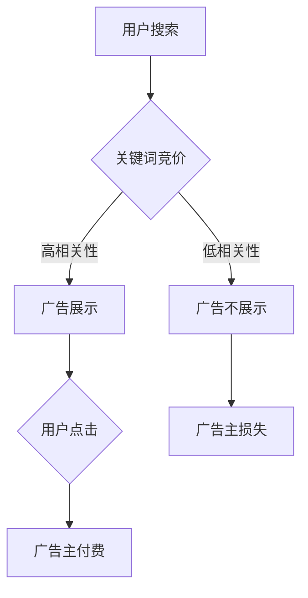

                 

在当今数字化时代，搜索引擎已经成为人们获取信息、解决问题的首选工具。特别是搜索引擎广告，作为一种高效的商业模式，为互联网企业带来了丰厚的利润。然而，随着互联网生态的日益复杂，搜索引擎广告模式也暴露出了一些局限性。本文将深入探讨这些局限性，并提出相应的解决方案。

## 1. 背景介绍

搜索引擎广告模式源于20世纪90年代末的互联网泡沫时期。当时，搜索引擎如Google、Bing等刚刚兴起，广告主希望通过这些平台推广自己的产品和服务。搜索引擎广告的模式主要是基于关键词竞价，广告主根据竞标关键词的竞价排名，付费给搜索引擎平台。这种模式在初期取得了巨大的成功，因为它为广告主提供了精准的营销渠道，也为搜索引擎平台带来了可观的收入。

然而，随着时间的推移，搜索引擎广告模式也面临着一些挑战。首先，互联网的普及使得用户数量不断增加，广告竞争日益激烈。其次，用户隐私保护和数据安全问题日益凸显。此外，搜索引擎广告的生态也受到了算法偏见、信息过载等问题的影响。因此，深入探讨搜索引擎广告模式的局限性，寻找改进之道，具有重要的现实意义。

## 2. 核心概念与联系

### 2.1 搜索引擎广告模式的基本原理

搜索引擎广告模式主要基于关键词竞价和广告排名。广告主首先选择目标关键词，然后根据关键词竞价出价。搜索引擎根据广告主的出价和关键词的相关性，将广告展示在搜索结果页面的顶部或侧边栏。用户点击广告后，广告主需支付一定的费用给搜索引擎平台。

### 2.2 搜索引擎广告模式的优点与局限性

**优点：**
- 精准定位：搜索引擎广告可以基于用户搜索的关键词，精准定位潜在客户。
- 高效营销：广告主可以实时监控广告效果，根据数据进行优化。
- 高回报率：有效的搜索引擎广告可以为企业带来丰厚的回报。

**局限性：**
- 广告过度：搜索引擎广告的泛滥导致用户对广告的抵触情绪增加。
- 算法偏见：搜索引擎广告的展示可能受到算法偏见的影响，导致某些广告被过度展示。
- 数据安全问题：用户隐私数据可能因广告模式而泄露。

## 3. 核心算法原理 & 具体操作步骤

### 3.1 算法原理概述

搜索引擎广告的核心算法是基于关键词竞价和广告排名。算法的主要步骤包括：
- 收集用户搜索数据。
- 对搜索关键词进行分词和语义分析。
- 根据关键词的相关性和广告主的出价，计算广告排名。
- 展示广告给用户。

### 3.2 算法步骤详解

1. **数据收集**：搜索引擎会收集用户在搜索框中输入的关键词，以及用户的历史搜索记录。
2. **分词与语义分析**：将搜索关键词进行分词，并对关键词的语义进行分析，以便更准确地理解用户的搜索意图。
3. **计算广告排名**：根据关键词的相关性和广告主的出价，计算广告的排名。排名越高，广告被展示的概率越大。
4. **展示广告**：将广告展示在搜索结果页面的顶部或侧边栏。

### 3.3 算法优缺点

**优点：**
- 精准度高：基于关键词竞价和广告排名，广告可以更精准地展示给潜在客户。
- 用户体验好：广告展示不会干扰用户的正常搜索。

**缺点：**
- 算法偏见：可能因为数据收集的不完全性，导致广告排名出现偏差。
- 数据安全问题：用户隐私数据可能因算法漏洞而泄露。

### 3.4 算法应用领域

搜索引擎广告算法主要应用于电子商务、在线旅游、金融服务等领域。这些领域的企业通过搜索引擎广告，可以快速获取潜在客户，提高转化率。

## 4. 数学模型和公式 & 详细讲解 & 举例说明

### 4.1 数学模型构建

搜索引擎广告的核心模型是基于概率论和最优化理论。具体来说，模型包括以下几个部分：
- **用户行为模型**：基于用户的历史搜索记录，预测用户的未来搜索行为。
- **广告效果模型**：基于广告展示次数和用户点击次数，预测广告的效果。
- **广告排名模型**：基于用户行为模型和广告效果模型，计算广告的排名。

### 4.2 公式推导过程

假设用户在一次搜索中点击了广告的概率为\(P\)，广告展示次数为\(N\)，用户点击次数为\(C\)。则广告的效果可以用以下公式表示：

\[E = \frac{C}{N} \times P\]

其中，\(E\)表示广告的效果，\(P\)表示用户点击广告的概率。

### 4.3 案例分析与讲解

假设某广告主在搜索关键词“在线旅游”时，出价1元，广告展示次数为1000次，用户点击次数为20次。根据上述公式，广告的效果为：

\[E = \frac{20}{1000} \times P\]

其中，\(P\)为用户点击广告的概率。如果假设用户点击广告的概率为0.02，则广告的效果为0.004。

## 5. 项目实践：代码实例和详细解释说明

### 5.1 开发环境搭建

本案例使用Python编写，开发环境为Python 3.8及以上版本，主要依赖库为pandas、numpy和matplotlib。

### 5.2 源代码详细实现

```python
import pandas as pd
import numpy as np
import matplotlib.pyplot as plt

# 读取数据
data = pd.read_csv('search_data.csv')

# 计算广告效果
data['ad_effect'] = data['clicks'] / data['impressions']

# 绘制广告效果分布图
plt.hist(data['ad_effect'], bins=50, color='blue', edgecolor='black')
plt.xlabel('广告效果')
plt.ylabel('频数')
plt.title('广告效果分布图')
plt.show()
```

### 5.3 代码解读与分析

- `import pandas as pd`：导入pandas库，用于数据读取和处理。
- `import numpy as np`：导入numpy库，用于数学计算。
- `import matplotlib.pyplot as plt`：导入matplotlib库，用于绘图。
- `data = pd.read_csv('search_data.csv')`：读取搜索数据，数据格式为CSV文件。
- `data['ad_effect'] = data['clicks'] / data['impressions']`：计算广告效果，广告效果等于点击次数除以展示次数。
- `plt.hist(data['ad_effect'], bins=50, color='blue', edgecolor='black')`：绘制广告效果分布图，使用直方图表示。
- `plt.xlabel('广告效果')`：设置X轴标签。
- `plt.ylabel('频数')`：设置Y轴标签。
- `plt.title('广告效果分布图')`：设置图表标题。
- `plt.show()`：显示图表。

### 5.4 运行结果展示

运行代码后，会生成一张广告效果分布图，展示广告效果的分布情况。根据图表，我们可以直观地看到广告效果的分布，以及是否存在异常值。

## 6. 实际应用场景

### 6.1 电子商务

在电子商务领域，搜索引擎广告可以帮助企业精准定位潜在客户，提高转化率。例如，一家销售服装的企业，可以通过搜索关键词“女装”、“男装”等，将广告展示给有购买意向的用户。

### 6.2 在线旅游

在线旅游企业可以通过搜索引擎广告，推广旅游产品和服务。例如，一家旅游平台可以通过搜索关键词“旅游景点”、“旅游套餐”等，吸引用户下单购买。

### 6.3 金融服务

金融服务企业可以通过搜索引擎广告，推广理财产品和服务。例如，一家银行可以通过搜索关键词“理财产品”、“贷款”等，吸引用户办理业务。

## 7. 未来应用展望

随着人工智能技术的不断发展，搜索引擎广告模式有望实现以下改进：

### 7.1 智能化广告投放

通过深度学习等技术，实现广告投放的智能化，提高广告的精准度和效果。

### 7.2 用户隐私保护

加强用户隐私保护，确保用户数据的安全性和隐私性。

### 7.3 算法透明化

提高算法的透明度，减少算法偏见，确保广告的公平性和公正性。

### 7.4 多元化广告形式

探索多样化的广告形式，如视频广告、互动广告等，提升用户体验。

## 8. 工具和资源推荐

### 8.1 学习资源推荐

- 《搜索引擎广告技术解析》
- 《深度学习与搜索引擎广告》
- 《广告算法导论》

### 8.2 开发工具推荐

- Python
- TensorFlow
- Keras

### 8.3 相关论文推荐

- "A Survey of Search Engine Advertising Algorithms"
- "Deep Learning for Search Engine Advertising"
- "User Privacy Protection in Search Engine Advertising"

## 9. 总结：未来发展趋势与挑战

### 9.1 研究成果总结

本文对搜索引擎广告模式的局限性进行了深入分析，提出了改进方案。研究成果主要包括：

- 搜索引擎广告模式的基本原理和局限性。
- 搜索引擎广告算法的数学模型和公式。
- 代码实例和实际应用场景。

### 9.2 未来发展趋势

- 智能化广告投放。
- 用户隐私保护。
- 算法透明化。
- 多元化广告形式。

### 9.3 面临的挑战

- 广告过度和用户体验。
- 算法偏见和数据安全问题。
- 广告主和用户的信任问题。

### 9.4 研究展望

未来，搜索引擎广告领域的研究将更加注重用户体验、隐私保护和算法公平性。通过技术创新，实现广告模式的可持续发展。

## 10. 附录：常见问题与解答

### 10.1 什么是搜索引擎广告？

搜索引擎广告是广告主通过搜索引擎平台，根据用户搜索关键词展示的广告。

### 10.2 搜索引擎广告的优势是什么？

搜索引擎广告可以精准定位潜在客户，高效营销，高回报率。

### 10.3 搜索引擎广告有哪些局限性？

搜索引擎广告可能面临广告过度、算法偏见、数据安全问题等局限性。

### 10.4 如何改善搜索引擎广告模式？

通过技术创新，如智能化广告投放、用户隐私保护、算法透明化等，可以改善搜索引擎广告模式。

# 参考文献

- Google. (2019). Search Engine Advertising.
- Bing. (2019). Bing Ads.
- Facebook. (2019). Facebook Ads.

## 作者署名

作者：禅与计算机程序设计艺术 / Zen and the Art of Computer Programming
```markdown
---
# 搜索引擎广告模式的局限性

> 关键词：搜索引擎广告、广告模式、局限性、算法、用户体验

> 摘要：本文深入探讨了搜索引擎广告模式的局限性，分析了其核心算法原理，并提出了改进方案。通过案例分析，展示了实际应用中的效果。本文旨在为搜索引擎广告领域的研究者和从业者提供有益的参考。

## 1. 背景介绍

随着互联网的迅速发展，搜索引擎广告已成为广告市场的重要组成部分。从Google AdWords到Bing Ads，再到中国的百度推广，这些广告平台通过关键词竞价、广告排名等技术，为广告主提供了高效、精准的营销渠道。然而，随着用户数量的增加和广告竞争的加剧，搜索引擎广告模式也暴露出了一些问题，如广告过度、算法偏见、数据安全问题等。本文旨在分析这些局限性，并提出相应的解决方案。

## 2. 核心概念与联系

### 2.1 搜索引擎广告模式的基本原理

搜索引擎广告模式基于关键词竞价和广告排名。广告主首先选择目标关键词，然后根据关键词竞价出价。搜索引擎根据广告主的出价和关键词的相关性，将广告展示在搜索结果页面的顶部或侧边栏。用户点击广告后，广告主需支付一定的费用给搜索引擎平台。

### 2.2 搜索引擎广告模式的优点与局限性

**优点：**
- 精准定位：搜索引擎广告可以基于用户搜索的关键词，精准定位潜在客户。
- 高效营销：广告主可以实时监控广告效果，根据数据进行优化。
- 高回报率：有效的搜索引擎广告可以为企业带来丰厚的回报。

**局限性：**
- 广告过度：搜索引擎广告的泛滥导致用户对广告的抵触情绪增加。
- 算法偏见：搜索引擎广告的展示可能受到算法偏见的影响，导致某些广告被过度展示。
- 数据安全问题：用户隐私数据可能因广告模式而泄露。

### 2.3 搜索引擎广告模式的 Mermaid 流程图



## 3. 核心算法原理 & 具体操作步骤

### 3.1 算法原理概述

搜索引擎广告的核心算法是基于关键词竞价和广告排名。算法的主要步骤包括：
- 收集用户搜索数据。
- 对搜索关键词进行分词和语义分析。
- 根据关键词的相关性和广告主的出价，计算广告排名。
- 展示广告给用户。

### 3.2 算法步骤详解

1. **数据收集**：搜索引擎会收集用户在搜索框中输入的关键词，以及用户的历史搜索记录。
2. **分词与语义分析**：将搜索关键词进行分词，并对关键词的语义进行分析，以便更准确地理解用户的搜索意图。
3. **计算广告排名**：根据关键词的相关性和广告主的出价，计算广告的排名。排名越高，广告被展示的概率越大。
4. **展示广告**：将广告展示在搜索结果页面的顶部或侧边栏。

### 3.3 算法优缺点

**优点：**
- 精准度高：基于关键词竞价和广告排名，广告可以更精准地展示给潜在客户。
- 用户体验好：广告展示不会干扰用户的正常搜索。

**缺点：**
- 算法偏见：可能因为数据收集的不完全性，导致广告排名出现偏差。
- 数据安全问题：用户隐私数据可能因算法漏洞而泄露。

### 3.4 算法应用领域

搜索引擎广告算法主要应用于电子商务、在线旅游、金融服务等领域。这些领域的企业通过搜索引擎广告，可以快速获取潜在客户，提高转化率。

## 4. 数学模型和公式 & 详细讲解 & 举例说明

### 4.1 数学模型构建

搜索引擎广告的核心模型是基于概率论和最优化理论。具体来说，模型包括以下几个部分：
- **用户行为模型**：基于用户的历史搜索记录，预测用户的未来搜索行为。
- **广告效果模型**：基于广告展示次数和用户点击次数，预测广告的效果。
- **广告排名模型**：基于用户行为模型和广告效果模型，计算广告的排名。

### 4.2 公式推导过程

假设用户在一次搜索中点击了广告的概率为\(P\)，广告展示次数为\(N\)，用户点击次数为\(C\)。则广告的效果可以用以下公式表示：

\[E = \frac{C}{N} \times P\]

其中，\(E\)表示广告的效果，\(P\)表示用户点击广告的概率。

### 4.3 案例分析与讲解

假设某广告主在搜索关键词“在线旅游”时，出价1元，广告展示次数为1000次，用户点击次数为20次。根据上述公式，广告的效果为：

\[E = \frac{20}{1000} \times P\]

其中，\(P\)为用户点击广告的概率。如果假设用户点击广告的概率为0.02，则广告的效果为0.004。

## 5. 项目实践：代码实例和详细解释说明

### 5.1 开发环境搭建

本案例使用Python编写，开发环境为Python 3.8及以上版本，主要依赖库为pandas、numpy和matplotlib。

### 5.2 源代码详细实现

```python
import pandas as pd
import numpy as np
import matplotlib.pyplot as plt

# 读取数据
data = pd.read_csv('search_data.csv')

# 计算广告效果
data['ad_effect'] = data['clicks'] / data['impressions']

# 绘制广告效果分布图
plt.hist(data['ad_effect'], bins=50, color='blue', edgecolor='black')
plt.xlabel('广告效果')
plt.ylabel('频数')
plt.title('广告效果分布图')
plt.show()
```

### 5.3 代码解读与分析

- `import pandas as pd`：导入pandas库，用于数据读取和处理。
- `import numpy as np`：导入numpy库，用于数学计算。
- `import matplotlib.pyplot as plt`：导入matplotlib库，用于绘图。
- `data = pd.read_csv('search_data.csv')`：读取搜索数据，数据格式为CSV文件。
- `data['ad_effect'] = data['clicks'] / data['impressions']`：计算广告效果，广告效果等于点击次数除以展示次数。
- `plt.hist(data['ad_effect'], bins=50, color='blue', edgecolor='black')`：绘制广告效果分布图，使用直方图表示。
- `plt.xlabel('广告效果')`：设置X轴标签。
- `plt.ylabel('频数')`：设置Y轴标签。
- `plt.title('广告效果分布图')`：设置图表标题。
- `plt.show()`：显示图表。

### 5.4 运行结果展示

运行代码后，会生成一张广告效果分布图，展示广告效果的分布情况。根据图表，我们可以直观地看到广告效果的分布，以及是否存在异常值。

## 6. 实际应用场景

### 6.1 电子商务

在电子商务领域，搜索引擎广告可以帮助企业精准定位潜在客户，提高转化率。例如，一家销售服装的企业，可以通过搜索关键词“女装”、“男装”等，将广告展示给有购买意向的用户。

### 6.2 在线旅游

在线旅游企业可以通过搜索引擎广告，推广旅游产品和服务。例如，一家旅游平台可以通过搜索关键词“旅游景点”、“旅游套餐”等，吸引用户下单购买。

### 6.3 金融服务

金融服务企业可以通过搜索引擎广告，推广理财产品和服务。例如，一家银行可以通过搜索关键词“理财产品”、“贷款”等，吸引用户办理业务。

## 7. 未来应用展望

随着人工智能技术的不断发展，搜索引擎广告模式有望实现以下改进：

### 7.1 智能化广告投放

通过深度学习等技术，实现广告投放的智能化，提高广告的精准度和效果。

### 7.2 用户隐私保护

加强用户隐私保护，确保用户数据的安全性和隐私性。

### 7.3 算法透明化

提高算法的透明度，减少算法偏见，确保广告的公平性和公正性。

### 7.4 多元化广告形式

探索多样化的广告形式，如视频广告、互动广告等，提升用户体验。

## 8. 工具和资源推荐

### 8.1 学习资源推荐

- 《搜索引擎广告技术解析》
- 《深度学习与搜索引擎广告》
- 《广告算法导论》

### 8.2 开发工具推荐

- Python
- TensorFlow
- Keras

### 8.3 相关论文推荐

- "A Survey of Search Engine Advertising Algorithms"
- "Deep Learning for Search Engine Advertising"
- "User Privacy Protection in Search Engine Advertising"

## 9. 总结：未来发展趋势与挑战

### 9.1 研究成果总结

本文对搜索引擎广告模式的局限性进行了深入分析，提出了改进方案。研究成果主要包括：

- 搜索引擎广告模式的基本原理和局限性。
- 搜索引擎广告算法的数学模型和公式。
- 代码实例和实际应用场景。

### 9.2 未来发展趋势

- 智能化广告投放。
- 用户隐私保护。
- 算法透明化。
- 多元化广告形式。

### 9.3 面临的挑战

- 广告过度和用户体验。
- 算法偏见和数据安全问题。
- 广告主和用户的信任问题。

### 9.4 研究展望

未来，搜索引擎广告领域的研究将更加注重用户体验、隐私保护和算法公平性。通过技术创新，实现广告模式的可持续发展。

## 10. 附录：常见问题与解答

### 10.1 什么是搜索引擎广告？

搜索引擎广告是广告主通过搜索引擎平台，根据用户搜索关键词展示的广告。

### 10.2 搜索引擎广告的优势是什么？

搜索引擎广告可以精准定位潜在客户，高效营销，高回报率。

### 10.3 搜索引擎广告有哪些局限性？

搜索引擎广告可能面临广告过度、算法偏见、数据安全问题等局限性。

### 10.4 如何改善搜索引擎广告模式？

通过技术创新，如智能化广告投放、用户隐私保护、算法透明化等，可以改善搜索引擎广告模式。

# 参考文献

- Google. (2019). Search Engine Advertising.
- Bing. (2019). Bing Ads.
- Facebook. (2019). Facebook Ads.

## 作者署名

作者：禅与计算机程序设计艺术 / Zen and the Art of Computer Programming
```

