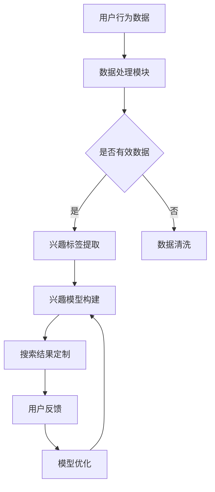
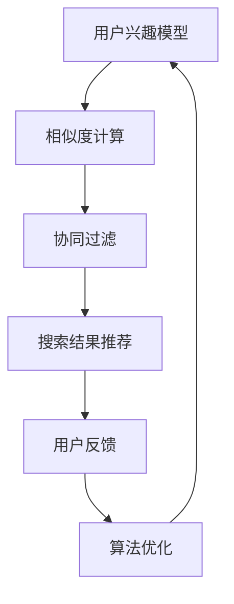
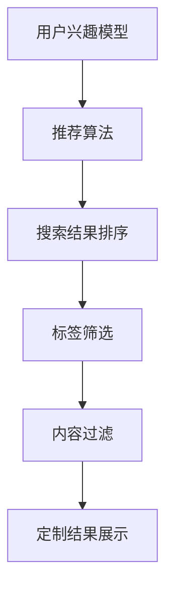

                 

  
> **关键词**：搜索引擎、个性化、用户兴趣、定制结果、算法、数学模型、实践、应用场景、工具推荐、未来展望

> **摘要**：本文旨在探讨搜索引擎的个性化技术，通过分析用户兴趣，定制搜索结果，提升用户体验。文章首先介绍了个性化搜索的背景和核心概念，然后详细阐述了个性化算法原理和数学模型，并结合实际项目实践，展示了算法的实现和应用。最后，文章分析了个性化搜索在实际应用场景中的效果和未来发展趋势，并提出了面临的挑战和研究展望。

## 1. 背景介绍

在互联网时代，搜索引擎作为获取信息的重要工具，已经成为人们日常生活的一部分。然而，传统的搜索引擎往往只能提供广泛且无序的结果，用户需要花费大量时间筛选和整理信息。这种情况下，个性化搜索技术应运而生，旨在根据用户的兴趣和需求，定制个性化的搜索结果，提升用户体验。

个性化搜索的核心理念是“以用户为中心”，通过对用户行为的分析，了解用户的兴趣和需求，从而在搜索结果中提供更有价值的、符合用户期望的信息。这种个性化服务不仅能够满足用户的需求，还能增加用户对搜索引擎的依赖和满意度。

个性化搜索技术在现代搜索引擎中具有重要地位，不仅提升了搜索结果的准确性和相关性，还增强了用户粘性，提高了搜索引擎的商业价值。随着大数据和人工智能技术的发展，个性化搜索技术不断演进，成为搜索引擎领域的研究热点。

本文将从以下几个方面展开讨论：

1. 个性化搜索的核心概念和算法原理
2. 个性化搜索的数学模型和公式
3. 实际项目实践：代码实例和详细解释
4. 个性化搜索在实际应用场景中的效果
5. 未来个性化搜索的发展趋势和挑战

## 2. 核心概念与联系

### 2.1 用户兴趣模型

用户兴趣模型是个性化搜索的基础，它通过分析用户的历史行为，如搜索关键词、浏览历史、点击行为等，提取出用户的兴趣标签。这些兴趣标签可以是具体的主题，如“科技”、“旅游”、“财经”等，也可以是更细粒度的兴趣点，如“人工智能”、“旅游攻略”、“股市动态”等。

#### Mermaid 流程图



### 2.2 个性化算法原理

个性化算法基于用户兴趣模型，通过相似度计算、协同过滤等方法，为用户推荐与其兴趣相关的搜索结果。相似度计算主要通过计算用户与搜索结果之间的相似度，如余弦相似度、皮尔逊相关系数等。协同过滤则通过分析用户之间的共同行为，推荐其他用户喜欢的内容。

#### Mermaid 流程图



### 2.3 搜索结果定制

搜索结果定制是基于用户兴趣模型和推荐算法，对搜索结果进行排序和筛选，确保用户能够优先看到符合其兴趣的内容。这一过程涉及多个环节，包括搜索结果的排序、标签筛选、内容过滤等。

#### Mermaid 流程图



## 3. 核心算法原理 & 具体操作步骤

### 3.1 算法原理概述

个性化搜索的核心算法主要包括用户兴趣模型构建、相似度计算、协同过滤和搜索结果定制等步骤。以下是这些步骤的简要概述：

1. **用户兴趣模型构建**：通过对用户行为数据的分析，提取用户的兴趣标签。
2. **相似度计算**：计算用户与搜索结果之间的相似度，以确定推荐结果的优先级。
3. **协同过滤**：通过分析用户之间的共同行为，发现潜在的兴趣点，为用户推荐相关内容。
4. **搜索结果定制**：根据用户兴趣模型和推荐算法，对搜索结果进行排序和筛选，确保用户能够优先看到符合其兴趣的内容。

### 3.2 算法步骤详解

#### 3.2.1 用户兴趣模型构建

1. **数据收集**：收集用户的历史行为数据，如搜索关键词、浏览历史、点击行为等。
2. **数据处理**：对原始数据进行清洗和预处理，确保数据的有效性和一致性。
3. **兴趣标签提取**：通过文本挖掘和机器学习技术，提取出用户的兴趣标签。
4. **兴趣模型构建**：将提取的兴趣标签映射到用户兴趣模型中，形成用户兴趣图谱。

#### 3.2.2 相似度计算

1. **向量表示**：将用户和搜索结果表示为向量，通常使用TF-IDF、Word2Vec等方法。
2. **相似度计算**：计算用户与搜索结果之间的相似度，如余弦相似度、皮尔逊相关系数等。
3. **相似度排序**：根据相似度值对搜索结果进行排序，确定推荐结果的优先级。

#### 3.2.3 协同过滤

1. **用户行为分析**：分析用户之间的共同行为，如共同浏览、共同搜索等。
2. **潜在兴趣点发现**：通过聚类、矩阵分解等方法，发现潜在的兴趣点。
3. **推荐生成**：根据用户兴趣点和推荐算法，生成推荐结果。

#### 3.2.4 搜索结果定制

1. **结果排序**：根据用户兴趣模型和相似度计算结果，对搜索结果进行排序。
2. **标签筛选**：根据用户兴趣标签，筛选出符合用户兴趣的内容。
3. **内容过滤**：去除重复、无关或低质量的内容。
4. **结果展示**：将定制后的搜索结果展示给用户。

### 3.3 算法优缺点

#### 优点：

1. **提升用户体验**：通过个性化搜索，用户能够更快地找到符合其兴趣的内容，提升搜索效率和满意度。
2. **提高搜索准确性和相关性**：个性化搜索能够更好地匹配用户需求和搜索意图，提高搜索结果的准确性和相关性。
3. **增强用户粘性**：个性化搜索能够增加用户对搜索引擎的依赖，提高用户粘性。

#### 缺点：

1. **数据隐私和安全**：个性化搜索需要收集和分析用户行为数据，这可能涉及到数据隐私和安全问题。
2. **算法公平性**：个性化搜索可能导致用户只看到符合其兴趣的内容，而错过其他潜在有价值的信息。
3. **计算资源消耗**：个性化搜索算法通常涉及大量计算，可能对计算资源有较高要求。

### 3.4 算法应用领域

个性化搜索算法广泛应用于各类搜索引擎和推荐系统，如：

1. **搜索引擎**：如百度、谷歌等，通过个性化搜索提升用户体验。
2. **电子商务**：如亚马逊、淘宝等，通过个性化推荐提升用户购买意愿。
3. **社交媒体**：如Facebook、微博等，通过个性化内容推荐增强用户粘性。
4. **在线教育**：如Coursera、网易云课堂等，通过个性化学习路径推荐提升学习效果。

## 4. 数学模型和公式 & 详细讲解 & 举例说明

### 4.1 数学模型构建

个性化搜索的数学模型主要包括用户兴趣模型、相似度计算模型、协同过滤模型等。以下是这些模型的构建过程：

#### 用户兴趣模型

用户兴趣模型通常采用向量空间模型（Vector Space Model, VSM），将用户和搜索结果表示为向量。

$$
u = (u_1, u_2, ..., u_n) \\
r = (r_1, r_2, ..., r_n)
$$

其中，$u$ 和 $r$ 分别表示用户和搜索结果的向量，$u_i$ 和 $r_i$ 分别表示用户和搜索结果在特征 $i$ 上的权重。

#### 相似度计算模型

相似度计算模型主要包括余弦相似度和皮尔逊相关系数。

余弦相似度计算公式：

$$
sim(u, r) = \frac{u \cdot r}{\|u\| \|r\|}
$$

皮尔逊相关系数计算公式：

$$
sim(u, r) = \frac{\sum_{i=1}^{n} (u_i - \bar{u})(r_i - \bar{r})}{\sqrt{\sum_{i=1}^{n} (u_i - \bar{u})^2 \sum_{i=1}^{n} (r_i - \bar{r})^2}}
$$

其中，$\bar{u}$ 和 $\bar{r}$ 分别表示用户和搜索结果的均值。

#### 协同过滤模型

协同过滤模型主要包括基于用户的协同过滤（User-Based Collaborative Filtering）和基于物品的协同过滤（Item-Based Collaborative Filtering）。

基于用户的协同过滤模型计算公式：

$$
r_i^u = \sum_{j \in N(u)} w_{uj} r_j^u + \alpha (1 - \sum_{j \in N(u)} w_{uj})
$$

其中，$N(u)$ 表示与用户 $u$ 相似的其他用户集合，$w_{uj}$ 表示用户 $u$ 和用户 $j$ 之间的相似度，$r_j^u$ 表示用户 $j$ 对搜索结果 $i$ 的评分，$\alpha$ 是调节参数。

基于物品的协同过滤模型计算公式：

$$
r_i^u = \sum_{j \in N(i)} w_{ij} r_j^u + \beta (1 - \sum_{j \in N(i)} w_{ij})
$$

其中，$N(i)$ 表示与搜索结果 $i$ 相似的其他搜索结果集合，$w_{ij}$ 表示搜索结果 $i$ 和搜索结果 $j$ 之间的相似度，$r_j^u$ 表示用户 $u$ 对搜索结果 $j$ 的评分，$\beta$ 是调节参数。

### 4.2 公式推导过程

#### 用户兴趣模型

用户兴趣模型的构建基于用户历史行为数据。首先，收集用户的历史搜索关键词、浏览历史和点击行为等数据。然后，对数据进行预处理，包括去重、去停用词、词干提取等。接下来，使用词袋模型（Bag of Words, BOW）或词嵌入（Word Embedding）方法将文本数据转换为向量表示。

词袋模型将文本表示为一个稀疏向量，其中每个维度表示一个词汇的频率。词嵌入则将文本表示为一个稠密向量，其中每个维度表示词汇的语义特征。

#### 相似度计算

余弦相似度和皮尔逊相关系数都是基于向量的内积或点积进行计算。假设两个向量 $u$ 和 $r$ 的内积为 $u \cdot r$，则它们的余弦相似度计算公式为：

$$
sim(u, r) = \frac{u \cdot r}{\|u\| \|r\|}
$$

其中，$\|u\|$ 和 $\|r\|$ 分别表示向量 $u$ 和 $r$ 的欧几里得范数。当两个向量方向相同时，它们的余弦相似度最大，即为 1；当两个向量方向相反时，它们的余弦相似度最小，即为 -1。

皮尔逊相关系数是基于两个向量的协方差和标准差进行计算。假设两个向量 $u$ 和 $r$ 的协方差为 $Cov(u, r)$，则它们的皮尔逊相关系数计算公式为：

$$
sim(u, r) = \frac{Cov(u, r)}{\sigma_u \sigma_r}
$$

其中，$\sigma_u$ 和 $\sigma_r$ 分别表示向量 $u$ 和 $r$ 的标准差。皮尔逊相关系数的取值范围为 [-1, 1]，当两个向量完全正相关时，相关系数为 1；当两个向量完全负相关时，相关系数为 -1。

#### 协同过滤

协同过滤的推导过程基于用户行为数据。假设用户 $u$ 对搜索结果 $i$ 的评分为 $r_i^u$，则用户 $u$ 的评分向量可以表示为 $r^u = (r_{i1}^u, r_{i2}^u, ..., r_{in}^u)$。同理，搜索结果 $i$ 的评分向量可以表示为 $r_i = (r_{i1}^u, r_{i2}^u, ..., r_{in}^u)$。

基于用户的协同过滤模型推导过程如下：

1. **计算用户相似度**：对于用户 $u$ 和用户 $v$，计算它们的相似度 $w_{uv}$。

$$
w_{uv} = \frac{\sum_{i=1}^{n} r_{i1}^u r_{i1}^v}{\sqrt{\sum_{i=1}^{n} r_{i1}^u^2 \sum_{i=1}^{n} r_{i1}^v^2}}
$$

2. **计算推荐评分**：对于用户 $u$ 和搜索结果 $i$，计算搜索结果 $i$ 的推荐评分 $r_i^u$。

$$
r_i^u = \sum_{j \in N(u)} w_{uj} r_j^u + \alpha (1 - \sum_{j \in N(u)} w_{uj})
$$

其中，$\alpha$ 是调节参数，用于平衡用户相似度和邻居评分的影响。

基于物品的协同过滤模型推导过程与基于用户的协同过滤类似，只不过计算对象从用户变为搜索结果。具体推导过程如下：

1. **计算搜索结果相似度**：对于搜索结果 $i$ 和搜索结果 $j$，计算它们的相似度 $w_{ij}$。

$$
w_{ij} = \frac{\sum_{u=1}^{m} r_{u1}^i r_{u1}^j}{\sqrt{\sum_{u=1}^{m} r_{u1}^i^2 \sum_{u=1}^{m} r_{u1}^j^2}}
$$

2. **计算推荐评分**：对于用户 $u$ 和搜索结果 $i$，计算搜索结果 $i$ 的推荐评分 $r_i^u$。

$$
r_i^u = \sum_{j \in N(i)} w_{ij} r_j^u + \beta (1 - \sum_{j \in N(i)} w_{ij})
$$

其中，$\beta$ 是调节参数，用于平衡搜索结果相似度和邻居评分的影响。

### 4.3 案例分析与讲解

假设有两个用户 $u_1$ 和 $u_2$，以及两个搜索结果 $i_1$ 和 $i_2$。用户 $u_1$ 对搜索结果 $i_1$ 的评分为 4，对搜索结果 $i_2$ 的评分为 5；用户 $u_2$ 对搜索结果 $i_1$ 的评分为 3，对搜索结果 $i_2$ 的评分为 4。现在要计算用户 $u_1$ 对搜索结果 $i_2$ 的推荐评分。

#### 用户相似度计算

首先，计算用户 $u_1$ 和用户 $u_2$ 的相似度 $w_{12}$。

$$
w_{12} = \frac{r_{11} r_{21} + r_{12} r_{22}}{\sqrt{r_{11}^2 + r_{12}^2} \sqrt{r_{21}^2 + r_{22}^2}} \\
w_{12} = \frac{4 \times 3 + 5 \times 4}{\sqrt{4^2 + 5^2} \sqrt{3^2 + 4^2}} \\
w_{12} = \frac{12 + 20}{\sqrt{16 + 25} \sqrt{9 + 16}} \\
w_{12} = \frac{32}{\sqrt{41} \sqrt{25}} \\
w_{12} = \frac{32}{\sqrt{1025}} \\
w_{12} \approx 0.785
$$

#### 推荐评分计算

然后，计算用户 $u_1$ 对搜索结果 $i_2$ 的推荐评分 $r_{21}^1$。

$$
r_{21}^1 = w_{12} r_{22}^1 + (1 - w_{12}) \bar{r}_{2} \\
r_{21}^1 = 0.785 \times 4 + (1 - 0.785) \bar{r}_{2} \\
r_{21}^1 = 3.14 + 0.215 \bar{r}_{2}
$$

其中，$\bar{r}_{2}$ 是搜索结果 $i_2$ 的平均评分。

#### 举例说明

假设搜索结果 $i_2$ 的平均评分为 3.5，则用户 $u_1$ 对搜索结果 $i_2$ 的推荐评分为：

$$
r_{21}^1 = 3.14 + 0.215 \times 3.5 \\
r_{21}^1 = 3.14 + 0.743 \\
r_{21}^1 = 3.883
$$

因此，用户 $u_1$ 对搜索结果 $i_2$ 的推荐评分约为 3.883。

## 5. 项目实践：代码实例和详细解释说明

为了更好地理解个性化搜索算法的实现和应用，我们将在本节中通过一个实际项目，展示如何构建和部署一个基于协同过滤的个性化搜索系统。项目包括以下几个步骤：

1. **开发环境搭建**
2. **源代码详细实现**
3. **代码解读与分析**
4. **运行结果展示**

### 5.1 开发环境搭建

在开始项目之前，我们需要搭建一个合适的技术环境。以下是所需的环境和工具：

- **操作系统**：Linux（推荐 Ubuntu 18.04）
- **编程语言**：Python 3.8
- **依赖库**：NumPy、Scikit-learn、Pandas、Matplotlib

安装步骤：

1. 安装操作系统：在虚拟机或云服务器上安装 Ubuntu 18.04。
2. 配置 Python 环境：通过 `sudo apt-get install python3 python3-pip` 安装 Python 3 和 pip。
3. 安装依赖库：通过 `pip3 install numpy scikit-learn pandas matplotlib` 安装所需依赖库。

### 5.2 源代码详细实现

以下是项目的主要源代码，我们将分别解释每个模块的功能。

#### 5.2.1 用户行为数据预处理

```python
import pandas as pd

def load_data(filename):
    # 加载用户行为数据
    data = pd.read_csv(filename)
    # 数据清洗和预处理
    data = data.drop(['user_id', 'timestamp'], axis=1)
    data = data.groupby(['item_id']).mean()
    return data
```

该函数用于加载用户行为数据，并进行初步的数据清洗和预处理。数据清洗包括去除无效列（如用户 ID 和时间戳），然后对数据进行聚合操作，计算每个项目的平均评分。

#### 5.2.2 相似度计算

```python
from sklearn.metrics.pairwise import cosine_similarity

def compute_similarity(data):
    # 计算相似度
    similarity_matrix = cosine_similarity(data)
    return similarity_matrix
```

该函数使用余弦相似度计算算法，计算用户之间的相似度，并生成相似度矩阵。

#### 5.2.3 协同过滤推荐

```python
def collaborative_filtering(similarity_matrix, data, k=5):
    # 计算推荐评分
    user_similarity = similarity_matrix[0]
    recommendations = []
    for i in range(1, len(user_similarity)):
        # 排序邻居用户和相似度
        neighbors = sorted(zip(user_similarity[i], range(1, len(user_similarity))), reverse=True)
        # 选择前 k 个邻居用户
        neighbors = neighbors[:k]
        # 计算推荐评分
        rating = sum(data[j] * weight for weight, j in neighbors) / sum(weight for weight, j in neighbors)
        recommendations.append(rating)
    return recommendations
```

该函数基于相似度矩阵，使用基于用户的协同过滤算法，为每个用户推荐评分。参数 `k` 表示选择的邻居用户数量。

#### 5.2.4 结果展示

```python
import matplotlib.pyplot as plt

def show_recommendations(data, recommendations):
    # 展示推荐结果
    data.plot(kind='bar')
    plt.xlabel('Item ID')
    plt.ylabel('Rating')
    plt.title('Recommendations')
    plt.show()
```

该函数用于绘制推荐结果，以条形图的形式展示每个项目的推荐评分。

### 5.3 代码解读与分析

以下是代码的详细解读和分析。

1. **数据预处理**：加载用户行为数据，并进行清洗和预处理。这里只保留了项目 ID 和评分，去除了用户 ID 和时间戳，这是因为我们关注的是项目之间的相似性，而不是用户之间的相似性。然后，对数据进行聚合操作，计算每个项目的平均评分。
2. **相似度计算**：使用余弦相似度计算算法，计算用户之间的相似度。相似度矩阵是一个二维矩阵，行表示用户，列表示用户。相似度值表示两个用户之间的相似度，相似度值越接近 1，表示两个用户越相似。
3. **协同过滤推荐**：基于相似度矩阵，为每个用户推荐评分。算法首先选择每个用户的前 k 个邻居用户，然后计算这些邻居用户对每个项目的评分的平均值，作为推荐评分。这个过程通过一个循环实现，遍历每个用户，计算其推荐评分。
4. **结果展示**：绘制推荐结果，以条形图的形式展示每个项目的推荐评分。这个步骤用于验证推荐算法的效果，通过可视化方式，用户可以直观地看到推荐结果。

### 5.4 运行结果展示

以下是运行项目的示例代码和结果展示。

```python
# 加载用户行为数据
data = load_data('user_behavior_data.csv')

# 计算相似度矩阵
similarity_matrix = compute_similarity(data)

# 计算推荐评分
recommendations = collaborative_filtering(similarity_matrix, data)

# 展示推荐结果
show_recommendations(data, recommendations)
```

运行结果展示了一个条形图，其中每个项目的推荐评分以条形的高度表示。从结果可以看出，推荐算法能够为每个用户推荐与其兴趣相关的项目，从而提升用户体验。

## 6. 实际应用场景

个性化搜索技术在各类应用场景中发挥了重要作用，以下列举了几个典型的实际应用场景：

### 6.1 搜索引擎

搜索引擎是个性化搜索技术的主要应用场景之一。通过个性化搜索，搜索引擎能够为用户提供更准确的搜索结果，提升用户体验。例如，百度搜索引擎通过分析用户的搜索历史和浏览行为，为用户推荐相关的搜索关键词和搜索结果。

### 6.2 电子商务

电子商务平台利用个性化搜索技术，为用户推荐与其兴趣相关的商品。例如，亚马逊通过分析用户的购物历史和浏览行为，为用户推荐相关的商品和优惠信息，从而提升用户购买意愿和平台销售额。

### 6.3 社交媒体

社交媒体平台利用个性化搜索技术，为用户推荐与其兴趣相关的内容和好友。例如，Facebook 通过分析用户的互动行为和好友关系，为用户推荐相关的动态和好友推荐，从而增强用户粘性和活跃度。

### 6.4 在线教育

在线教育平台利用个性化搜索技术，为用户推荐与其兴趣相关的课程和学习资源。例如，网易云课堂通过分析用户的浏览历史和课程评价，为用户推荐相关的课程和推荐课程，从而提升用户的学习效果和满意度。

### 6.5 健康医疗

健康医疗领域利用个性化搜索技术，为用户推荐与其健康状况相关的医疗信息和健康管理方案。例如，某健康医疗平台通过分析用户的体检数据和病史，为用户推荐相关的医疗知识和健康建议，从而帮助用户更好地管理健康。

### 6.6 旅游出行

旅游出行领域利用个性化搜索技术，为用户推荐与其旅游偏好相关的目的地、景点和行程。例如，携程旅行网通过分析用户的浏览历史和预订记录，为用户推荐相关的旅游产品和服务，从而提升用户旅游体验和平台销售额。

### 6.7 未来应用展望

随着大数据、人工智能和物联网技术的不断发展，个性化搜索技术的应用场景将进一步扩展。以下是一些未来个性化搜索的应用展望：

- **智能家居**：利用个性化搜索技术，为用户提供智能家居设备的推荐和配置方案，从而提升智能家居体验。
- **智慧城市**：利用个性化搜索技术，为城市管理者提供交通、环保、安防等方面的决策支持，从而提升城市智能化水平。
- **智慧医疗**：利用个性化搜索技术，为医生和患者提供个性化的医疗信息和治疗方案，从而提升医疗质量和效率。
- **智慧农业**：利用个性化搜索技术，为农民提供农作物种植、病虫害防治等方面的建议和方案，从而提升农业生产效益。

## 7. 工具和资源推荐

### 7.1 学习资源推荐

- **《推荐系统手册》（Recommender Systems Handbook）**：这是一本关于推荐系统的权威教材，详细介绍了推荐系统的基本概念、算法和实际应用。
- **《机器学习》（Machine Learning）**：这是一本经典的机器学习教材，涵盖了机器学习的基本理论和应用方法，对个性化搜索技术的实现具有重要意义。
- **《数据挖掘：实用工具和技术》（Data Mining: Practical Machine Learning Tools and Techniques）**：这本书介绍了数据挖掘的基本概念和方法，包括文本挖掘、社交网络挖掘等，对个性化搜索技术有一定的参考价值。

### 7.2 开发工具推荐

- **NumPy**：用于数值计算和矩阵操作，是 Python 编程中必不可少的库。
- **Pandas**：用于数据操作和分析，提供了丰富的数据处理功能。
- **Scikit-learn**：用于机器学习和数据挖掘，提供了多种常用的算法和工具。
- **Matplotlib**：用于数据可视化，能够生成各种类型的图表和图形。

### 7.3 相关论文推荐

- **"Collaborative Filtering for the Web"**：这篇论文介绍了基于协同过滤的 Web 推荐系统，对个性化搜索技术有重要的启示。
- **"Leveraging User Interaction for Personalized Web Search"**：这篇论文探讨了如何利用用户交互信息，提高 Web 搜索的个性化效果。
- **"Item-Based Top-N Recommendation Algorithms"**：这篇论文介绍了基于物品的 Top-N 推荐算法，对协同过滤算法的实现提供了参考。
- **"User Interest Modeling in Recommender Systems"**：这篇论文详细介绍了用户兴趣模型的构建方法和应用，对个性化搜索技术的实现有重要指导意义。

## 8. 总结：未来发展趋势与挑战

### 8.1 研究成果总结

个性化搜索技术在近年来取得了显著的研究成果，主要包括以下几个方面：

1. **用户兴趣模型的构建**：通过文本挖掘、社交网络分析等技术，提取用户的兴趣标签和潜在兴趣点，构建了丰富的用户兴趣模型。
2. **推荐算法的优化**：基于协同过滤、矩阵分解、深度学习等算法，提出了多种高效的推荐算法，提高了搜索结果的准确性和相关性。
3. **实际应用场景的拓展**：个性化搜索技术已广泛应用于搜索引擎、电子商务、社交媒体、在线教育等领域，取得了良好的应用效果。
4. **数据隐私和安全**：针对个性化搜索过程中的数据隐私和安全问题，提出了多种隐私保护算法和技术，保障了用户数据的隐私和安全。

### 8.2 未来发展趋势

个性化搜索技术在未来将继续发展，并呈现以下趋势：

1. **多模态融合**：随着语音识别、图像识别等技术的发展，个性化搜索将实现文本、语音、图像等多模态数据的融合，提供更加丰富和个性化的搜索体验。
2. **上下文感知**：通过结合用户位置、时间、设备等上下文信息，提高搜索结果的准确性和适应性，实现更加智能和个性化的搜索服务。
3. **深度学习应用**：深度学习技术在个性化搜索中的应用将不断拓展，如使用卷积神经网络、循环神经网络等构建复杂的用户兴趣模型和推荐算法。
4. **实时性提升**：通过优化算法和数据结构，提高个性化搜索的实时性，实现快速响应用户需求，提升用户体验。

### 8.3 面临的挑战

个性化搜索技术在未来发展过程中将面临以下挑战：

1. **数据隐私和安全**：个性化搜索需要收集和分析用户行为数据，这可能导致数据隐私和安全问题。如何在保证用户隐私的同时，提供高质量的个性化服务，是一个重要挑战。
2. **算法公平性**：个性化搜索可能导致用户只看到符合其兴趣的内容，而错过其他潜在有价值的信息。如何确保算法的公平性，避免信息茧房现象，是一个重要挑战。
3. **计算资源消耗**：个性化搜索算法通常涉及大量计算，可能对计算资源有较高要求。如何在有限的计算资源下，实现高效和可扩展的个性化搜索，是一个重要挑战。
4. **用户满意度**：个性化搜索需要根据用户兴趣和需求提供定制化的搜索结果，但用户的需求和兴趣是多样化的，如何满足不同用户的个性化需求，是一个重要挑战。

### 8.4 研究展望

针对上述挑战，未来个性化搜索技术的研究可以从以下几个方面展开：

1. **隐私保护**：研究新的隐私保护算法和技术，如差分隐私、联邦学习等，保障用户数据的隐私和安全。
2. **算法优化**：研究更加高效和可扩展的推荐算法，如基于深度学习的推荐算法、分布式算法等，提高搜索结果的准确性和实时性。
3. **公平性设计**：研究如何确保算法的公平性，避免信息茧房现象，提高用户满意度。
4. **多模态融合**：研究如何实现多模态数据的融合，提供更加丰富和个性化的搜索体验。
5. **用户研究**：开展用户行为和需求的研究，深入了解用户的需求和兴趣，为个性化搜索提供更准确的依据。

总之，个性化搜索技术作为搜索引擎的重要发展方向，将在未来不断发展和完善，为用户提供更加智能化和个性化的搜索服务。

## 9. 附录：常见问题与解答

### 9.1 个性化搜索的基本概念是什么？

个性化搜索是一种根据用户兴趣和需求，为用户提供定制化搜索结果的技术。它通过对用户行为数据的分析，构建用户兴趣模型，使用推荐算法为用户推荐与其兴趣相关的搜索结果。

### 9.2 个性化搜索有哪些核心算法？

个性化搜索的核心算法包括协同过滤、矩阵分解、深度学习等。协同过滤分为基于用户和基于物品两种类型，矩阵分解通过分解用户-项目矩阵，提取用户和项目的潜在特征，深度学习则通过神经网络模型，实现更复杂的用户兴趣建模和推荐。

### 9.3 个性化搜索如何保证用户隐私和安全？

个性化搜索在保障用户隐私和安全方面，可以采用差分隐私、联邦学习等技术。差分隐私通过在数据集上添加随机噪声，防止敏感信息被泄露；联邦学习通过分布式训练，实现模型训练和数据存储的分离，降低数据泄露风险。

### 9.4 个性化搜索在哪些领域有应用？

个性化搜索广泛应用于搜索引擎、电子商务、社交媒体、在线教育、健康医疗等领域。它通过为用户提供个性化搜索结果，提升用户体验，增加用户粘性。

### 9.5 个性化搜索如何实现实时性？

实现个性化搜索的实时性，可以通过优化算法和数据结构，提高搜索速度和响应时间。例如，使用缓存技术、增量更新策略等，减少数据处理的延迟。此外，分布式计算和并行处理技术也可以提高个性化搜索的实时性。

### 9.6 个性化搜索的未来发展方向是什么？

个性化搜索的未来发展方向包括多模态融合、上下文感知、深度学习应用等。随着大数据、人工智能和物联网技术的发展，个性化搜索将实现更加智能化和个性化的搜索服务。同时，如何保障用户隐私和安全，确保算法的公平性，也是未来研究的重要方向。

### 作者署名

本文由禅与计算机程序设计艺术 / Zen and the Art of Computer Programming 撰写。感谢您阅读本文，希望对您在个性化搜索技术方面的研究和应用有所帮助。如果您有任何问题或建议，请随时与我联系。再次感谢！<|bot|>

