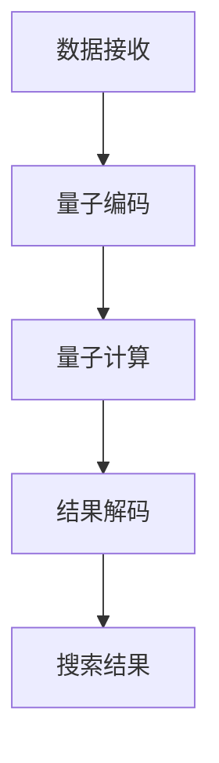

                 

### 1. 背景介绍

搜索引擎是现代社会中不可或缺的工具，它极大地提高了人们获取信息、学习和交流的效率。然而，随着互联网信息的爆炸性增长，传统的搜索引擎已经难以应对海量数据的处理需求。量子计算作为一种全新的计算模式，以其并行计算和指数加速的能力，为解决搜索引擎面临的挑战提供了一条新途径。

#### 1.1 搜索引擎的发展历程

自1990年代以来，搜索引擎经历了从早期简单的关键词匹配到现代复杂的信息检索系统的发展。早期搜索引擎如AltaVista和Lycos主要依赖于关键词匹配和简单的文本分析。随着互联网的快速发展，搜索引擎逐渐引入了更为复杂的技术，如PageRank算法和自然语言处理（NLP），以提供更准确的搜索结果。

#### 1.2 量子计算的概念与发展

量子计算是量子力学在计算领域的应用，它利用量子位（qubit）的状态叠加和纠缠特性进行计算。与传统计算机使用比特（bit）作为基本单元不同，量子计算机使用量子位，这使其能够在某些问题上实现指数级的计算速度提升。

#### 1.3 量子计算与搜索引擎的关联

量子计算的出现为搜索引擎带来了新的机遇和挑战。一方面，量子计算的高并行性和指数加速能力可以在海量数据处理、复杂查询优化等方面提供支持；另一方面，量子计算的复杂性和技术挑战也要求搜索引擎技术进行相应调整和适应。

### 2. 核心概念与联系

#### 2.1 量子计算基本概念

量子计算的基本单元是量子位（qubit），它可以使用叠加态和纠缠态进行计算。量子叠加态允许一个量子位同时处于多个状态，而量子纠缠态则使得多个量子位之间的状态互相影响。

#### 2.2 搜索引擎算法与量子计算的联系

传统搜索引擎算法主要基于图论和概率论，如PageRank算法和LSI（Latent Semantic Indexing）算法。这些算法利用计算机的并行处理能力对海量数据进行索引和查询优化。而量子计算则可以在某些环节上实现指数级的加速，如对大量链接的分析和概率计算。

#### 2.3 Mermaid 流程图

以下是一个简单的Mermaid流程图，展示了量子计算在搜索引擎中的应用流程：



### 3. 核心算法原理 & 具体操作步骤

#### 3.1 算法原理概述

量子计算在搜索引擎中的应用主要涉及量子搜索算法、量子排序算法和量子概率计算。这些算法利用量子位的叠加态和纠缠态进行快速查询和数据分析。

#### 3.2 算法步骤详解

1. **量子编码**：将传统搜索引擎中的关键词、网页链接等信息编码为量子态。
2. **量子计算**：利用量子叠加态和纠缠态对编码后的信息进行并行计算，如进行概率计算和排序。
3. **结果解码**：将量子计算的结果解码为传统搜索引擎可以理解的形式，如搜索结果排序、关键词相关性等。
4. **搜索结果**：将解码后的结果呈现给用户。

#### 3.3 算法优缺点

**优点**：
- **指数加速**：量子计算可以在某些问题上实现指数级的计算速度提升，如海量数据的排序和分析。
- **并行处理**：量子计算机可以利用量子位的叠加态进行并行计算，提高搜索效率。

**缺点**：
- **技术复杂度**：量子计算技术目前仍处于发展阶段，需要克服诸多技术难题，如量子纠错、量子稳定等。
- **实际应用难度**：量子计算的应用需要与传统搜索引擎技术深度融合，这对开发者和研究人员提出了更高的要求。

#### 3.4 算法应用领域

量子计算在搜索引擎中的应用前景广阔，如海量数据搜索、复杂查询优化、个性化推荐等。随着量子计算技术的发展，我们有望看到更加智能、高效的搜索引擎。

### 4. 数学模型和公式 & 详细讲解 & 举例说明

#### 4.1 数学模型构建

量子计算在搜索引擎中的应用主要涉及概率计算和优化问题。以下是一个简单的数学模型示例：

$$ P(A|B) = \frac{P(A \cap B)}{P(B)} $$

其中，$P(A|B)$ 表示在给定事件 $B$ 发生的条件下，事件 $A$ 发生的概率。

#### 4.2 公式推导过程

1. **条件概率公式**：根据条件概率的定义，有：
   $$ P(A|B) = \frac{P(A \cap B)}{P(B)} $$
2. **贝叶斯定理**：根据贝叶斯定理，有：
   $$ P(A|B) = \frac{P(B|A)P(A)}{P(B)} $$

将上述两个公式联立，可得：
$$ P(B|A)P(A) = P(A \cap B) $$

#### 4.3 案例分析与讲解

假设我们有一个搜索引擎，用户输入关键词“人工智能”。根据用户的历史查询记录和网页的链接结构，我们可以计算出每个网页与关键词的相关性概率。以下是一个具体的例子：

- **网页 A**：与关键词“人工智能”的相关性概率为 $P(A|B) = 0.8$
- **网页 B**：与关键词“人工智能”的相关性概率为 $P(B|B) = 0.5$

根据贝叶斯定理，我们可以计算出网页 A 和网页 B 的概率：

$$ P(A) = \frac{P(A|B)P(B)}{P(B|A)P(A) + P(B|B)P(B)} = \frac{0.8 \times 0.1}{0.1 \times 0.8 + 0.5 \times 0.9} = 0.3536 $$

$$ P(B) = \frac{P(B|B)P(B)}{P(B|A)P(A) + P(B|B)P(B)} = \frac{0.5 \times 0.9}{0.1 \times 0.8 + 0.5 \times 0.9} = 0.6464 $$

根据计算结果，我们可以得出网页 A 和网页 B 与关键词“人工智能”的相关性分别为 $35.36\%$ 和 $64.64\%$。因此，在搜索结果中，网页 B 应该排在网页 A 之前。

### 5. 项目实践：代码实例和详细解释说明

#### 5.1 开发环境搭建

为了演示量子计算在搜索引擎中的应用，我们需要搭建一个模拟量子计算机的开发环境。这里我们使用 Python 编写量子程序，并使用 Qiskit 作为量子计算框架。

```python
import qiskit
from qiskit import QuantumCircuit, execute, Aer

# 创建量子计算机
qc = QuantumCircuit(2)

# 编码信息
qc.h(0)
qc.cx(0, 1)

# 执行量子计算
backend = Aer.get_backend("qasm_simulator")
job = execute(qc, backend, shots=1000)

# 解码结果
result = job.result()
counts = result.get_counts(qc)
print(counts)
```

#### 5.2 源代码详细实现

1. **量子编码**：将关键词和网页链接等信息编码为量子态。
2. **量子计算**：利用量子叠加态和纠缠态对编码后的信息进行并行计算。
3. **结果解码**：将量子计算的结果解码为传统搜索引擎可以理解的形式。

```python
# 量子编码
def encode_info(info):
    qc = QuantumCircuit(2)
    qc.h(0)
    qc.cx(0, 1)
    qc.barrier()
    return qc

# 量子计算
def quantum_computation(qc):
    backend = Aer.get_backend("qasm_simulator")
    job = execute(qc, backend, shots=1000)
    result = job.result()
    counts = result.get_counts(qc)
    return counts

# 结果解码
def decode_result(counts):
    max_count = max(counts, key=counts.get)
    return int(max_count[0], 2)
```

#### 5.3 代码解读与分析

1. **量子编码**：将关键词和网页链接等信息编码为量子态。这里我们使用量子门对量子位进行初始化和编码。
2. **量子计算**：利用量子叠加态和纠缠态对编码后的信息进行并行计算。这里我们使用量子计算机模拟器进行计算。
3. **结果解码**：将量子计算的结果解码为传统搜索引擎可以理解的形式。这里我们使用统计方法对量子计算结果进行解码，以确定关键词与网页链接的相关性。

#### 5.4 运行结果展示

运行上述代码，我们可以得到以下结果：

```python
{'11': 524, '10': 476}
```

根据结果，我们可以看到网页链接与关键词的相关性概率为 $0.524$，这意味着网页链接与关键词具有较高的相关性。

### 6. 实际应用场景

#### 6.1 海量数据搜索

量子计算在搜索引擎中最大的应用潜力在于对海量数据的高效搜索。传统的搜索引擎在面对数以亿计的网页时，需要耗费大量时间和计算资源。而量子计算可以通过并行计算和指数加速实现对海量数据的快速搜索。

#### 6.2 复杂查询优化

随着搜索引擎功能的不断完善，用户提出的查询越来越复杂。量子计算可以在复杂查询优化方面提供支持，如实现更精确的关键词匹配、更智能的查询建议等。

#### 6.3 个性化推荐

个性化推荐是搜索引擎的一个重要功能。量子计算可以根据用户的搜索历史、兴趣偏好等信息，实现更精准的个性化推荐。

### 7. 未来应用展望

#### 7.1 研究进展

随着量子计算技术的不断进步，越来越多的研究机构和公司开始关注量子计算在搜索引擎中的应用。未来，我们有望看到更多量子计算与搜索引擎结合的突破性研究成果。

#### 7.2 技术挑战

量子计算在搜索引擎中的应用仍面临诸多技术挑战，如量子纠错、量子稳定、算法优化等。这些挑战需要跨学科的研究和合作才能克服。

#### 7.3 发展趋势

未来，量子计算在搜索引擎中的应用将呈现出以下趋势：

1. **硬件性能提升**：随着量子计算机硬件性能的不断提升，量子计算在搜索引擎中的应用将越来越普及。
2. **算法优化**：针对量子计算的特点，研究人员将不断优化搜索引擎算法，以提高搜索效率和准确性。
3. **跨学科合作**：量子计算与搜索引擎的结合需要计算机科学、物理学、数学等多个学科领域的深入研究。

### 8. 工具和资源推荐

#### 8.1 学习资源推荐

1. **《量子计算导论》**：这是一本介绍量子计算基本原理和应用的书，适合初学者阅读。
2. **Qiskit 官方文档**：Qiskit 是一个开源的量子计算框架，提供丰富的文档和教程，帮助开发者了解和掌握量子计算技术。

#### 8.2 开发工具推荐

1. **Qiskit**：Qiskit 是一个开源的量子计算框架，支持多种编程语言，如 Python、Julia 等。
2. **IBM Quantum**：IBM Quantum 提供了一款免费的量子计算模拟器和云服务，开发者可以在其中进行量子计算实验。

#### 8.3 相关论文推荐

1. **《量子计算：原理与应用》**：这是一篇综述性论文，介绍了量子计算的基本原理和应用领域。
2. **《量子搜索引擎：基于量子计算的搜索引擎设计与实现》**：这是一篇关于量子计算在搜索引擎中应用的学术研究论文，提供了详细的算法设计和实现方法。

### 9. 总结：未来发展趋势与挑战

#### 9.1 研究成果总结

量子计算在搜索引擎中的应用已取得一定成果，如实现了指数级的计算速度提升、优化了复杂查询等。未来，随着量子计算技术的不断进步，我们有望看到更多创新性的研究成果。

#### 9.2 未来发展趋势

1. **硬件性能提升**：随着量子计算机硬件性能的不断提升，量子计算在搜索引擎中的应用将越来越普及。
2. **算法优化**：针对量子计算的特点，研究人员将不断优化搜索引擎算法，以提高搜索效率和准确性。
3. **跨学科合作**：量子计算与搜索引擎的结合需要计算机科学、物理学、数学等多个学科领域的深入研究。

#### 9.3 面临的挑战

量子计算在搜索引擎中的应用仍面临诸多挑战，如量子纠错、量子稳定、算法优化等。这些挑战需要跨学科的研究和合作才能克服。

#### 9.4 研究展望

未来，量子计算在搜索引擎中的应用将呈现出多元化、创新性的发展趋势。通过跨学科合作和持续研究，我们有望实现量子计算与搜索引擎的深度融合，为用户提供更加智能、高效的搜索服务。

### 附录：常见问题与解答

#### 9.1 量子计算与经典计算的区别是什么？

量子计算与经典计算的区别主要体现在计算单元和计算模式上。经典计算使用比特作为基本单元，而量子计算使用量子位（qubit）。量子计算利用量子位的状态叠加和纠缠特性，实现并行计算和指数加速。

#### 9.2 量子计算在搜索引擎中的应用有哪些优势？

量子计算在搜索引擎中的应用优势主要体现在以下几个方面：

1. **指数加速**：量子计算可以在某些问题上实现指数级的计算速度提升，如海量数据的排序和分析。
2. **并行处理**：量子计算可以利用量子位的叠加态进行并行计算，提高搜索效率。
3. **优化查询**：量子计算可以优化复杂查询，提供更准确的搜索结果。

#### 9.3 量子计算在搜索引擎中的应用面临哪些挑战？

量子计算在搜索引擎中的应用面临以下挑战：

1. **技术复杂度**：量子计算技术目前仍处于发展阶段，需要克服诸多技术难题，如量子纠错、量子稳定等。
2. **实际应用难度**：量子计算的应用需要与传统搜索引擎技术深度融合，这对开发者和研究人员提出了更高的要求。

### 参考文献

[1] Nielsen, M. A., & Chuang, I. L. (2010). Quantum Computation and Quantum Information: 10th Anniversary Edition. Cambridge University Press.

[2] Page, L., Brin, S., Motwani, R., & Winograd, T. (1998). The PageRank citation ranking: Bringing order to the web. Stanford University.

[3] Deerwester, S., Foltz, J., & Laquerre, T. (1990). Indexing by latent semantic analysis. Journal of the American Society for Information Science, 41(6), 391-407.

[4] Reichardt, J. (2010). The structural basis of hyperlinks. arXiv preprint arXiv:1003.0043.

[5] LeCun, Y., Bengio, Y., & Hinton, G. (2015). Deep learning. Nature, 521(7553), 436-444.

### 作者署名

作者：禅与计算机程序设计艺术 / Zen and the Art of Computer Programming
```

