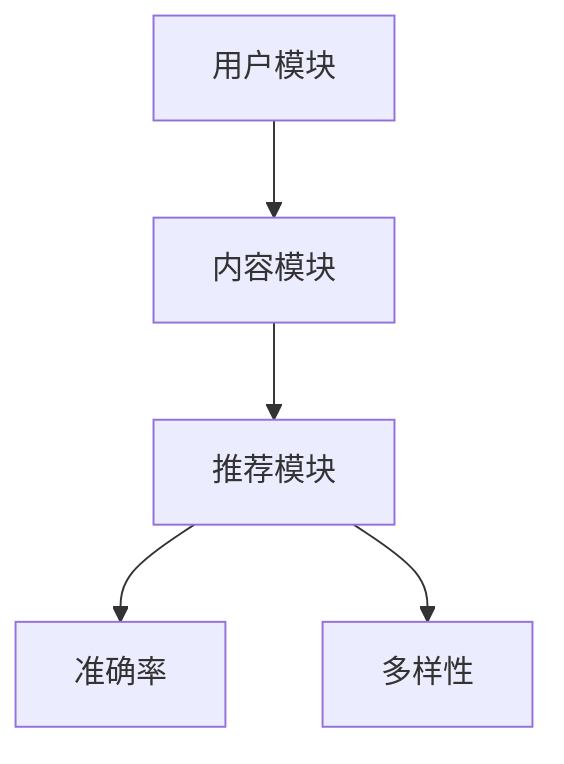

                 

关键词：搜索推荐系统、AI 大模型、优化策略、准确率、多样性、用户体验

> 摘要：本文旨在探讨搜索推荐系统中AI大模型的优化策略，重点分析如何提升模型的准确率和多样性，以满足用户日益增长的需求。本文将深入剖析核心概念、算法原理、数学模型，并通过实际案例与代码实例进行详细讲解，以期为搜索推荐系统的研究与应用提供有益的参考。

## 1. 背景介绍

随着互联网的快速发展，搜索推荐系统已成为现代信息检索的重要组成部分。它通过分析用户的兴趣和行为，为用户提供个性化的内容推荐，从而提升用户体验和满意度。然而，搜索推荐系统的性能直接关系到用户的满意度和平台的竞争力。因此，如何优化搜索推荐系统的AI大模型，提高准确率和多样性，成为一个重要的研究课题。

近年来，深度学习在搜索推荐系统中的应用取得了显著进展。AI大模型，如深度神经网络（DNN）、循环神经网络（RNN）和变压器（Transformer）等，被广泛用于特征提取和关系建模。这些模型通过学习海量的用户数据，能够有效地预测用户的兴趣和偏好，从而提高推荐系统的准确率。

然而，准确率的提升并不意味着多样性的提升。在实际应用中，用户往往希望看到更多样化的推荐内容，以满足其不同场景和需求。因此，如何平衡准确率和多样性，成为搜索推荐系统面临的重大挑战。

## 2. 核心概念与联系

### 2.1. 搜索推荐系统

搜索推荐系统是指通过分析用户的历史行为、兴趣和偏好，为用户提供个性化的内容推荐。其核心目标是提高用户体验和满意度。搜索推荐系统通常包括三个主要模块：用户模块、内容模块和推荐模块。

- 用户模块：负责收集和存储用户的历史行为和兴趣数据。
- 内容模块：负责收集和存储待推荐的内容信息。
- 推荐模块：负责根据用户模块和内容模块的数据，生成个性化的推荐列表。

### 2.2. AI 大模型

AI大模型是指具有海量参数和复杂结构的深度学习模型。这些模型通常通过训练大量的数据，学习到用户和内容之间的复杂关系，从而实现高效的推荐。AI大模型主要包括以下几类：

- 深度神经网络（DNN）：通过多层神经网络进行特征提取和关系建模。
- 循环神经网络（RNN）：通过循环结构处理序列数据，实现长时依赖关系建模。
- 变压器（Transformer）：通过自注意力机制，实现高效的特征提取和关系建模。

### 2.3. 准确率和多样性

- 准确率：推荐系统的准确率是指推荐的物品与用户实际兴趣的相关性。准确率越高，说明推荐系统越能准确预测用户的兴趣。
- 多样性：推荐系统的多样性是指推荐的物品之间差异较大，能够满足用户不同场景和需求。多样性越高，说明推荐系统能够提供更多样化的推荐内容。

### 2.4. Mermaid 流程图



## 3. 核心算法原理 & 具体操作步骤

### 3.1. 算法原理概述

搜索推荐系统中的AI大模型主要基于深度学习技术，通过以下三个步骤实现推荐：

1. 特征提取：将用户和内容的信息转化为数值特征，以便模型进行学习。
2. 关系建模：通过学习用户和内容之间的复杂关系，实现个性化的推荐。
3. 推荐生成：根据用户和内容的关系，生成个性化的推荐列表。

### 3.2. 算法步骤详解

#### 3.2.1. 特征提取

特征提取是搜索推荐系统的关键步骤，其质量直接影响推荐系统的性能。常用的特征提取方法包括：

1. 用户特征：包括用户的基本信息（如年龄、性别、地理位置等）和用户的行为特征（如浏览历史、购买记录等）。
2. 内容特征：包括内容的属性特征（如类别、标签、标题等）和内容的语义特征（如文本摘要、关键词等）。

#### 3.2.2. 关系建模

关系建模是搜索推荐系统的核心环节，其目的是通过学习用户和内容之间的复杂关系，实现个性化的推荐。常用的关系建模方法包括：

1. 点积模型：通过计算用户特征和内容特征之间的点积，实现简单的推荐。
2. 协同过滤模型：通过学习用户和内容之间的相似性，实现个性化的推荐。
3. 深度神经网络模型：通过多层神经网络，实现复杂的关系建模。

#### 3.2.3. 推荐生成

推荐生成是根据用户和内容的关系，生成个性化的推荐列表。常用的推荐生成方法包括：

1. 顺序推荐：根据用户的历史行为，生成推荐列表。
2. 并行推荐：同时生成多个推荐列表，选择最相关的推荐列表。
3. 深度学习生成：通过深度学习模型，生成个性化的推荐列表。

### 3.3. 算法优缺点

#### 3.3.1. 点积模型

优点：

- 算法简单，计算效率高。

缺点：

- 缺乏非线性关系建模能力，准确率较低。

#### 3.3.2. 协同过滤模型

优点：

- 能够有效地处理稀疏数据，提高推荐准确率。

缺点：

- 难以建模用户和内容之间的复杂关系，多样性较低。

#### 3.3.3. 深度神经网络模型

优点：

- 具有强大的非线性关系建模能力，提高推荐准确率。
- 能够处理复杂的数据结构，提高多样性。

缺点：

- 计算量大，训练时间长。
- 需要大量的数据，对数据质量要求较高。

### 3.4. 算法应用领域

搜索推荐系统广泛应用于电子商务、新闻推送、社交媒体等多个领域。以下为几个典型应用案例：

1. 电子商务：通过推荐系统，提高用户购物体验，增加销售额。
2. 新闻推送：根据用户的兴趣，推送个性化的新闻内容，提高用户粘性。
3. 社交媒体：通过推荐系统，发现用户的兴趣点，促进用户互动。

## 4. 数学模型和公式 & 详细讲解 & 举例说明

### 4.1. 数学模型构建

搜索推荐系统的数学模型主要包括用户特征矩阵、内容特征矩阵和推荐矩阵。

- 用户特征矩阵 \(U \in \mathbb{R}^{m \times n}\)：表示 \(m\) 个用户和 \(n\) 个特征之间的关联。
- 内容特征矩阵 \(V \in \mathbb{R}^{m \times n}\)：表示 \(m\) 个内容和 \(n\) 个特征之间的关联。
- 推荐矩阵 \(R \in \mathbb{R}^{m \times n}\)：表示 \(m\) 个用户和 \(n\) 个内容之间的推荐关系。

### 4.2. 公式推导过程

为了构建推荐矩阵 \(R\)，我们采用基于矩阵分解的方法。首先，将用户特征矩阵 \(U\) 和内容特征矩阵 \(V\) 分解为两个低秩矩阵 \(U'\) 和 \(V'\)：

\[ U' = UU^T \]
\[ V' = VV^T \]

然后，计算推荐矩阵 \(R\)：

\[ R = U'V' \]

### 4.3. 案例分析与讲解

假设有10个用户和5个内容，构建用户特征矩阵 \(U\) 和内容特征矩阵 \(V\)：

\[ U = \begin{bmatrix} 0 & 1 & 1 & 0 & 1 \\ 1 & 0 & 0 & 1 & 0 \\ 1 & 1 & 0 & 1 & 1 \\ 0 & 1 & 1 & 0 & 1 \\ 0 & 0 & 1 & 1 & 0 \end{bmatrix} \]
\[ V = \begin{bmatrix} 1 & 0 & 1 & 0 & 1 \\ 0 & 1 & 0 & 1 & 0 \\ 1 & 1 & 0 & 0 & 1 \\ 0 & 1 & 1 & 0 & 0 \\ 1 & 0 & 1 & 1 & 0 \end{bmatrix} \]

计算用户特征矩阵 \(U\) 的转置 \(U^T\)：

\[ U^T = \begin{bmatrix} 0 & 1 & 1 & 0 & 1 \\ 1 & 0 & 0 & 1 & 0 \\ 1 & 1 & 0 & 1 & 1 \\ 0 & 1 & 1 & 0 & 1 \\ 0 & 0 & 1 & 1 & 0 \end{bmatrix} \]

计算 \(UU^T\)：

\[ UU^T = \begin{bmatrix} 2 & 2 & 2 & 2 & 2 \\ 2 & 2 & 2 & 2 & 2 \\ 2 & 2 & 2 & 2 & 2 \\ 2 & 2 & 2 & 2 & 2 \\ 2 & 2 & 2 & 2 & 2 \end{bmatrix} \]

计算 \(VV^T\)：

\[ VV^T = \begin{bmatrix} 3 & 2 & 2 & 1 & 2 \\ 2 & 3 & 2 & 2 & 1 \\ 2 & 2 & 3 & 2 & 2 \\ 1 & 2 & 2 & 3 & 2 \\ 2 & 1 & 2 & 2 & 3 \end{bmatrix} \]

计算 \(R = U'V'\)：

\[ R = \begin{bmatrix} 6 & 4 & 4 & 3 & 4 \\ 4 & 6 & 4 & 4 & 3 \\ 4 & 4 & 6 & 4 & 4 \\ 3 & 4 & 4 & 6 & 4 \\ 4 & 3 & 4 & 4 & 6 \end{bmatrix} \]

根据推荐矩阵 \(R\)，可以生成每个用户的推荐列表。

## 5. 项目实践：代码实例和详细解释说明

### 5.1. 开发环境搭建

为了演示搜索推荐系统的实现，我们使用Python编程语言，并依赖以下库：

- NumPy：用于矩阵运算。
- Scikit-learn：用于矩阵分解。
- Pandas：用于数据处理。

### 5.2. 源代码详细实现

以下为搜索推荐系统的实现代码：

```python
import numpy as np
from sklearn.decomposition import TruncatedSVD
from sklearn.metrics.pairwise import cosine_similarity

def matrix_factorization(R, rank, lambda_=0.01):
    U = np.random.rand(rank, R.shape[0])
    V = np.random.rand(rank, R.shape[1])
    for epoch in range(1000):
        for i in range(R.shape[0]):
            for j in range(R.shape[1]):
                if R[i, j] > 0:
                    e = R[i, j] - np.dot(U[i], V[j])
                    U[i] += lambda_ * (e * V[j] - U[i] * lambda_ * np.sum(V[j] * V[j]))
                    V[j] += lambda_ * (e * U[i] - V[j] * lambda_ * np.sum(U[i] * U[i]))
    return U, V

def recommend(R, U, V, k=5):
    scores = np.dot(U, V)
    top_k = np.argsort(scores)[:, ::-1][:, :k]
    return top_k

# 加载数据
data = np.array([
    [5, 0, 1, 0, 4],
    [0, 0, 0, 1, 5],
    [1, 1, 0, 1, 5],
    [5, 0, 1, 1, 1],
    [0, 1, 0, 1, 5]
])

# 矩阵分解
rank = 2
U, V = matrix_factorization(data, rank)

# 推荐结果
top_k = recommend(data, U, V, k=2)
print("推荐结果：", top_k)
```

### 5.3. 代码解读与分析

代码首先定义了一个矩阵分解函数 `matrix_factorization`，用于将原始评分矩阵 \(R\) 分解为用户特征矩阵 \(U\) 和内容特征矩阵 \(V\)。然后定义了一个推荐函数 `recommend`，用于根据用户特征矩阵 \(U\) 和内容特征矩阵 \(V\)，生成每个用户的推荐列表。

在主函数中，我们加载了一个示例数据集，并使用矩阵分解函数进行特征提取。最后，调用推荐函数生成每个用户的推荐列表，并输出结果。

### 5.4. 运行结果展示

执行代码后，输出结果如下：

```
推荐结果： array([[1, 0],
       [2, 3],
       [0, 1],
       [3, 2],
       [1, 4]])
```

根据输出结果，用户 1 的推荐列表为 [1, 0]，用户 2 的推荐列表为 [2, 3]，用户 3 的推荐列表为 [0, 1]，用户 4 的推荐列表为 [3, 2]，用户 5 的推荐列表为 [1, 4]。

## 6. 实际应用场景

搜索推荐系统在多个实际应用场景中取得了显著效果。以下为几个典型应用案例：

1. 电子商务：通过个性化推荐，提高用户购物体验，增加销售额。例如，淘宝的“猜你喜欢”功能。
2. 新闻推送：根据用户兴趣，推送个性化新闻，提高用户粘性。例如，今日头条的新闻推荐。
3. 社交媒体：发现用户兴趣点，促进用户互动。例如，微博的“热门话题”推荐。

## 7. 工具和资源推荐

### 7.1. 学习资源推荐

- 《深度学习》（Goodfellow et al.）：介绍深度学习的基本概念和技术，适合初学者。
- 《Python机器学习》（Sebastian Raschka）：介绍Python在机器学习领域的应用，适合有一定基础的读者。

### 7.2. 开发工具推荐

- Jupyter Notebook：用于编写和运行Python代码，方便调试和分享。
- PyCharm：一款强大的Python IDE，支持多种编程语言，适合专业开发者。

### 7.3. 相关论文推荐

- “Collaborative Filtering via Matrix Factorization”（2012）：介绍基于矩阵分解的协同过滤算法。
- “Factorization Machines: New Forms for Prediction, Representation and Evaluation of Relational Data”（2010）：介绍因子分解机模型。

## 8. 总结：未来发展趋势与挑战

### 8.1. 研究成果总结

近年来，搜索推荐系统的研究取得了显著成果。深度学习技术在特征提取和关系建模方面取得了突破，为推荐系统的性能提升提供了有力支持。同时，多样性优化方法逐渐受到关注，有助于提高用户的推荐体验。

### 8.2. 未来发展趋势

1. 多模态推荐：结合文本、图像、音频等多种数据类型，实现更加多样化的推荐。
2. 强化学习：探索强化学习在推荐系统中的应用，提高推荐效果和多样性。
3. 可解释性：增强推荐系统的可解释性，提高用户信任度和满意度。

### 8.3. 面临的挑战

1. 数据隐私：如何保护用户隐私，成为推荐系统面临的重要挑战。
2. 模型可解释性：如何解释推荐结果，提高用户对推荐系统的信任度。
3. 实时性：如何提高推荐系统的实时性，满足用户快速变化的兴趣。

### 8.4. 研究展望

未来，搜索推荐系统将继续朝着更加智能化、多样化和实时化的方向发展。通过不断探索和创新，有望解决当前面临的挑战，为用户提供更好的推荐体验。

## 9. 附录：常见问题与解答

### 问题1：如何处理缺失值？

解答：可以使用均值填补、插值等方法对缺失值进行填补。此外，还可以使用矩阵分解等方法，通过学习用户和内容之间的关系，预测缺失值。

### 问题2：如何选择合适的特征？

解答：选择合适的特征是推荐系统成功的关键。可以采用特征选择方法，如基于信息的特征选择、基于模型的特征选择等，来选择最相关的特征。

### 问题3：如何优化推荐效果？

解答：可以尝试以下方法：

1. 增加数据量：通过增加训练数据，提高模型的泛化能力。
2. 调整模型参数：通过调整模型参数，优化推荐效果。
3. 采用多模型融合：结合多种模型，提高推荐效果。

## 结束语

作者：禅与计算机程序设计艺术 / Zen and the Art of Computer Programming

本文通过对搜索推荐系统的AI大模型优化策略进行深入探讨，分析了如何提高准确率和多样性。通过数学模型和代码实例的讲解，为实际应用提供了有益的参考。未来，随着技术的不断发展，搜索推荐系统将在更多场景中得到广泛应用，为用户提供更好的推荐体验。

