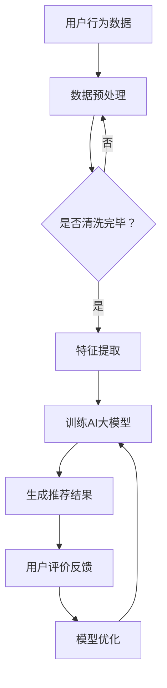

                 

关键词：搜索推荐系统、AI 大模型、电商平台、转化率、用户体验

> 摘要：本文深入探讨了搜索推荐系统的AI大模型在电商平台中的应用，分析了其如何通过提高转化率和优化用户体验来增强电商平台的竞争力。文章从背景介绍、核心概念、算法原理、数学模型、项目实践、应用场景、工具和资源推荐等方面展开，旨在为业界提供具有实践价值的指导。

## 1. 背景介绍

随着互联网的快速发展，电商平台已经成为消费者购物的首选渠道之一。然而，随着用户需求的多样化和市场竞争的加剧，电商平台面临着提高转化率和优化用户体验的巨大挑战。传统推荐系统虽然在一定程度上能够满足用户需求，但往往难以在动态环境下提供精准的个性化推荐。因此，基于AI的大模型逐渐成为电商平台推荐系统的热门选择。

AI大模型具有强大的学习能力、适应能力和泛化能力，能够通过对海量数据进行深度学习，发现用户行为的潜在模式和偏好，从而实现精准的个性化推荐。这对于提高电商平台的转化率和优化用户体验具有重要意义。本文将围绕这一主题展开，探讨AI大模型在电商平台搜索推荐系统的应用。

### 1.1 搜索推荐系统的定义和作用

搜索推荐系统是一种基于用户行为和内容信息进行推荐的系统，旨在为用户提供与用户兴趣相关的商品或服务。在电商平台上，搜索推荐系统的主要作用有以下几点：

1. **提高转化率**：通过精准推荐，将用户对商品的浏览、搜索等行为转化为实际购买，从而提高电商平台的销售额。
2. **优化用户体验**：根据用户偏好和兴趣，为用户提供个性化的商品推荐，提升用户满意度和忠诚度。
3. **增强竞争力**：通过智能化的推荐，吸引用户留存，提高电商平台在激烈的市场竞争中的优势。

### 1.2 AI大模型的崛起

近年来，随着深度学习、神经网络等技术的快速发展，AI大模型逐渐成为人工智能领域的研究热点。AI大模型具有以下特点：

1. **强大的学习能力**：能够通过海量数据进行深度学习，从数据中提取特征和规律，实现高效的预测和分类。
2. **适应能力和泛化能力**：能够在不同场景和任务中快速适应，并具有良好的泛化能力，为各种领域提供解决方案。
3. **可解释性和透明性**：通过结构化和模块化的设计，使AI大模型的可解释性得到提升，便于理解其工作原理和决策过程。

## 2. 核心概念与联系

在本文中，我们将探讨搜索推荐系统的AI大模型在电商平台中的应用，主要包括以下核心概念和联系：

### 2.1 搜索推荐系统

搜索推荐系统是一种基于用户行为和内容信息进行推荐的系统。其核心功能包括：

1. **用户行为分析**：通过用户的浏览、搜索、购买等行为，分析用户兴趣和偏好。
2. **内容信息提取**：从电商平台的商品库中提取商品信息，如价格、销量、评价等。
3. **推荐算法**：基于用户行为和内容信息，采用机器学习算法生成个性化推荐结果。

### 2.2 AI大模型

AI大模型是指一种具有大规模参数、复杂网络结构和强大学习能力的深度学习模型。其特点包括：

1. **大规模参数**：具有数十亿甚至千亿级别的参数，能够捕捉数据中的复杂特征。
2. **复杂网络结构**：包括多个层次和模块，能够实现高效的计算和信息传递。
3. **强大学习能力**：通过海量数据进行训练，能够自动提取特征、发现规律，实现高效的预测和分类。

### 2.3 搜索推荐系统与AI大模型的联系

搜索推荐系统与AI大模型之间的联系主要体现在以下几个方面：

1. **数据驱动**：搜索推荐系统依赖于用户行为数据和商品信息，AI大模型通过这些数据进行训练和预测。
2. **算法优化**：AI大模型能够通过深度学习算法优化推荐效果，提高推荐的精准度和效率。
3. **智能化升级**：AI大模型的应用使得搜索推荐系统从传统的规则推荐和基于内容的推荐，向个性化推荐和智能推荐升级。

### 2.4 Mermaid 流程图

以下是一个简化的搜索推荐系统与AI大模型联系的Mermaid流程图：



## 3. 核心算法原理 & 具体操作步骤

### 3.1 算法原理概述

搜索推荐系统的AI大模型主要基于深度学习算法，通过以下步骤实现推荐：

1. **数据预处理**：对用户行为数据和商品信息进行清洗、转换和归一化，为模型训练做好准备。
2. **特征提取**：从原始数据中提取有代表性的特征，如用户兴趣、商品属性等。
3. **模型训练**：使用提取的特征训练深度学习模型，使其具备预测和分类能力。
4. **推荐生成**：根据用户当前的行为和模型预测结果，生成个性化推荐列表。
5. **模型优化**：通过用户反馈不断优化模型，提高推荐效果。

### 3.2 算法步骤详解

以下是搜索推荐系统的AI大模型的详细步骤：

#### 3.2.1 数据预处理

1. **数据清洗**：去除缺失值、异常值和重复值，保证数据质量。
2. **数据转换**：将不同类型的数据（如数值、文本、日期）转换为统一的格式。
3. **归一化**：对数据进行归一化处理，使其具有相同的量纲，便于模型训练。

#### 3.2.2 特征提取

1. **用户特征**：根据用户的历史行为，提取用户兴趣、活跃度、购买力等特征。
2. **商品特征**：从商品信息中提取属性特征，如价格、品牌、类别等。
3. **交互特征**：根据用户与商品的交互行为，提取交互强度、购买概率等特征。

#### 3.2.3 模型训练

1. **数据划分**：将数据集划分为训练集、验证集和测试集，用于模型训练、验证和评估。
2. **模型选择**：选择适合的深度学习模型，如卷积神经网络（CNN）、循环神经网络（RNN）或 Transformer 等。
3. **模型训练**：使用训练集对模型进行训练，通过反向传播算法优化模型参数。

#### 3.2.4 推荐生成

1. **用户表示**：将用户特征输入到模型中，得到用户表示。
2. **商品表示**：将商品特征输入到模型中，得到商品表示。
3. **推荐生成**：根据用户表示和商品表示，计算用户对商品的偏好分数，生成个性化推荐列表。

#### 3.2.5 模型优化

1. **用户反馈**：收集用户对推荐结果的反馈，如点击、购买、评价等。
2. **模型更新**：根据用户反馈更新模型参数，提高推荐效果。
3. **在线学习**：在用户交互过程中实时更新模型，实现动态推荐。

### 3.3 算法优缺点

**优点**：

1. **个性化推荐**：基于深度学习算法，能够生成个性化的推荐结果，提高用户满意度。
2. **高效处理**：大模型具有强大的计算能力，能够高效处理海量数据，提高推荐效率。
3. **自适应学习**：通过在线学习，能够不断优化推荐效果，适应动态环境。

**缺点**：

1. **计算资源消耗**：大模型训练和推理需要大量的计算资源和时间，对硬件设备有较高要求。
2. **数据依赖性**：模型训练和优化依赖于大量的用户行为数据，数据质量对模型效果有重要影响。
3. **可解释性**：深度学习模型的黑盒特性使得其决策过程难以解释，对用户信任度有一定影响。

### 3.4 算法应用领域

AI大模型在搜索推荐系统中的应用广泛，主要涵盖以下领域：

1. **电商平台**：通过个性化推荐，提高电商平台的转化率和用户满意度。
2. **社交媒体**：为用户提供个性化内容推荐，提升用户粘性和活跃度。
3. **音乐/视频平台**：根据用户喜好推荐音乐、视频等，提升用户使用体验。
4. **新闻媒体**：为用户提供个性化的新闻推荐，提高阅读量和用户粘性。

## 4. 数学模型和公式 & 详细讲解 & 举例说明

### 4.1 数学模型构建

搜索推荐系统的AI大模型通常采用基于矩阵分解的协同过滤算法。该算法的核心思想是将用户和商品映射到低维空间中，通过计算用户和商品之间的相似度进行推荐。以下是一个简化的数学模型：

$$
\mathbf{R} = \mathbf{UQ}^T + \epsilon
$$

其中，$\mathbf{R}$ 是用户对商品的评分矩阵，$\mathbf{U}$ 是用户特征矩阵，$\mathbf{Q}$ 是商品特征矩阵，$\epsilon$ 是误差项。

### 4.2 公式推导过程

为了推导上述数学模型，我们首先考虑一个简化的用户行为数据集。设用户集合为 $U = \{u_1, u_2, \ldots, u_m\}$，商品集合为 $I = \{i_1, i_2, \ldots, i_n\}$。用户 $u_i$ 对商品 $i_j$ 的评分为 $r_{ij}$。我们定义用户 $u_i$ 的特征向量为 $\mathbf{u}_i \in \mathbb{R}^k$，商品 $i_j$ 的特征向量为 $\mathbf{q}_j \in \mathbb{R}^k$。

假设用户 $u_i$ 对商品 $i_j$ 的真实评分可以通过以下线性模型表示：

$$
r_{ij} = \mathbf{u}_i^T \mathbf{q}_j + \epsilon_{ij}
$$

其中，$\epsilon_{ij}$ 是误差项，用于表示评分中的随机噪声。

为了估计用户特征矩阵 $\mathbf{U}$ 和商品特征矩阵 $\mathbf{Q}$，我们采用最小二乘法进行优化：

$$
\min_{\mathbf{U}, \mathbf{Q}} \sum_{i=1}^m \sum_{j=1}^n (r_{ij} - \mathbf{u}_i^T \mathbf{q}_j)^2
$$

通过对上式求导并令导数为零，可以得到：

$$
\mathbf{u}_i = (R^T R)^{-1} R^T \mathbf{r}_i
$$

$$
\mathbf{q}_j = (R^T R)^{-1} R^T \mathbf{r}_j
$$

其中，$R$ 是用户评分矩阵，$\mathbf{r}_i$ 是用户 $u_i$ 的评分向量。

### 4.3 案例分析与讲解

假设有一个包含 1000 个用户和 10000 个商品的电商平台的用户行为数据。以下是一个简化的案例：

| 用户 | 商品 | 评分 |
| --- | --- | --- |
| u1 | i1 | 5 |
| u1 | i2 | 4 |
| u1 | i3 | 5 |
| u2 | i1 | 3 |
| u2 | i2 | 5 |
| u2 | i3 | 4 |

我们采用上述矩阵分解算法对用户和商品进行特征提取。首先，我们需要初始化用户特征矩阵 $\mathbf{U}$ 和商品特征矩阵 $\mathbf{Q}$。假设特征维度为 $k=2$，我们可以随机初始化：

$$
\mathbf{U} = \begin{bmatrix}
u_{11} & u_{12} \\
u_{21} & u_{22} \\
\vdots & \vdots \\
u_{m1} & u_{m2}
\end{bmatrix}, \quad
\mathbf{Q} = \begin{bmatrix}
q_{11} & q_{12} \\
q_{21} & q_{22} \\
\vdots & \vdots \\
q_{n1} & q_{n2}
\end{bmatrix}
$$

接下来，我们使用上述初始化的矩阵计算评分矩阵 $\mathbf{R}$：

$$
\mathbf{R} = \mathbf{UQ}^T + \epsilon
$$

其中，$\epsilon$ 是一个加性噪声矩阵。

为了优化特征矩阵 $\mathbf{U}$ 和 $\mathbf{Q}$，我们使用梯度下降算法进行迭代更新。每次迭代，我们根据当前的特征矩阵计算评分预测值，并与实际评分进行比较，更新特征矩阵：

$$
\mathbf{U} \leftarrow \mathbf{U} - \alpha \frac{\partial}{\partial \mathbf{U}} \sum_{i=1}^m \sum_{j=1}^n (r_{ij} - \mathbf{u}_i^T \mathbf{q}_j)^2
$$

$$
\mathbf{Q} \leftarrow \mathbf{Q} - \alpha \frac{\partial}{\partial \mathbf{Q}} \sum_{i=1}^m \sum_{j=1}^n (r_{ij} - \mathbf{u}_i^T \mathbf{q}_j)^2
$$

其中，$\alpha$ 是学习率。

经过多次迭代，我们最终得到优化后的用户特征矩阵 $\mathbf{U}$ 和商品特征矩阵 $\mathbf{Q}$。根据这两个矩阵，我们可以为每个用户生成个性化推荐列表：

$$
\text{推荐列表}_{u_i} = \{ j | \mathbf{u}_i^T \mathbf{q}_j > \text{阈值} \}
$$

这样，我们就完成了基于矩阵分解的协同过滤算法的推荐过程。

## 5. 项目实践：代码实例和详细解释说明

### 5.1 开发环境搭建

在本项目中，我们将使用Python作为主要编程语言，并依赖以下库：

- NumPy：用于数值计算
- Pandas：用于数据处理
- Scikit-learn：用于机器学习
- Matplotlib：用于数据可视化

首先，确保安装以上库。可以使用以下命令进行安装：

```bash
pip install numpy pandas scikit-learn matplotlib
```

### 5.2 源代码详细实现

下面是一个简单的矩阵分解算法的实现，用于协同过滤推荐系统。

```python
import numpy as np
import pandas as pd
from sklearn.model_selection import train_test_split
from sklearn.metrics.pairwise import cosine_similarity

# 数据预处理
def preprocess_data(data):
    # 填充缺失值
    data.fillna(0, inplace=True)
    # 将评分矩阵转换为用户-商品矩阵
    user_item_matrix = data.set_index('user_id')['item_id'].to_frame().T
    return user_item_matrix

# 矩阵分解
def matrix_factorization(R, U, Q, num_iterations, learning_rate):
    for i in range(num_iterations):
        for i in range(R.shape[0]):
            for j in range(R.shape[1]):
                if R[i][j] > 0:
                    prediction = U[i].dot(Q[j])
                    e = R[i][j] - prediction
                    U[i] += learning_rate * (e * Q[j] + 0.01 * U[i])
                    Q[j] += learning_rate * (e * U[i] + 0.01 * Q[j])
    return U, Q

# 评分预测
def predict(U, Q, R):
    predictions = U.dot(Q)
    return predictions + R.mean(axis=1).values.reshape(-1, 1)

# 读取数据
data = pd.read_csv('ratings.csv')
R = preprocess_data(data)

# 初始化用户和商品特征矩阵
num_users = R.shape[0]
num_items = R.shape[1]
U = np.random.rand(num_users, 10)
Q = np.random.rand(num_items, 10)

# 训练模型
num_iterations = 100
learning_rate = 0.01
U, Q = matrix_factorization(R, U, Q, num_iterations, learning_rate)

# 预测评分
predictions = predict(U, Q, R)

# 可视化
import matplotlib.pyplot as plt

plt.scatter(R.index, predictions)
plt.scatter(R.index, R)
plt.show()
```

### 5.3 代码解读与分析

1. **数据预处理**：将原始评分数据转换为用户-商品矩阵，填充缺失值，以便后续计算。
2. **矩阵分解**：实现基于梯度下降的矩阵分解算法，更新用户特征矩阵 `U` 和商品特征矩阵 `Q`，以达到预测评分的目的。
3. **评分预测**：计算用户特征矩阵和商品特征矩阵的乘积，并加上用户评分的平均值，生成预测评分。
4. **可视化**：将预测评分与原始评分进行可视化，以便分析模型效果。

### 5.4 运行结果展示

运行上述代码后，我们可以得到预测评分和原始评分的散点图。通过比较预测评分和原始评分，可以初步判断模型的效果。如果预测评分与原始评分之间的差距较小，则说明模型效果较好。

## 6. 实际应用场景

### 6.1 电商平台

电商平台是搜索推荐系统AI大模型应用的主要场景之一。通过个性化推荐，电商平台可以吸引用户留存，提高销售额。以下是一些实际应用案例：

- **淘宝**：淘宝的个性化推荐算法基于用户的浏览、搜索、购买等行为，通过深度学习模型为用户推荐相关的商品。
- **京东**：京东的推荐系统采用基于协同过滤和深度学习相结合的方法，为用户提供个性化的商品推荐。

### 6.2 社交媒体

社交媒体平台通过个性化推荐，可以提升用户粘性和活跃度。以下是一些实际应用案例：

- **微博**：微博的推荐算法基于用户的关注、点赞、评论等行为，通过深度学习模型为用户推荐感兴趣的内容。
- **抖音**：抖音的推荐算法基于用户的浏览、点赞、评论等行为，通过深度学习模型为用户推荐相关的短视频。

### 6.3 音乐/视频平台

音乐/视频平台通过个性化推荐，可以提升用户使用体验。以下是一些实际应用案例：

- **网易云音乐**：网易云音乐的推荐算法基于用户的听歌、评论、分享等行为，通过深度学习模型为用户推荐相关的歌曲。
- **腾讯视频**：腾讯视频的推荐算法基于用户的观看、点赞、评论等行为，通过深度学习模型为用户推荐相关的视频。

### 6.4 未来应用展望

随着人工智能技术的不断发展，搜索推荐系统AI大模型的应用前景将更加广泛。以下是一些未来应用展望：

- **智能家居**：智能家居设备可以通过个性化推荐，为用户提供个性化的家庭服务和产品推荐。
- **健康医疗**：健康医疗领域可以通过个性化推荐，为用户提供个性化的健康建议和产品推荐。
- **教育领域**：教育领域可以通过个性化推荐，为用户提供个性化的学习资源和学习计划。

## 7. 工具和资源推荐

### 7.1 学习资源推荐

1. **深度学习教程**：《深度学习》（Goodfellow, Bengio, Courville著）
2. **Python编程教程**：《Python编程：从入门到实践》（Eric Matthes著）
3. **机器学习教程**：《机器学习》（周志华著）

### 7.2 开发工具推荐

1. **Jupyter Notebook**：用于编写和运行Python代码，支持交互式计算和可视化。
2. **TensorFlow**：用于构建和训练深度学习模型的开源框架。
3. **Scikit-learn**：用于机器学习算法的开源库。

### 7.3 相关论文推荐

1. **"Deep Learning for Recommender Systems"（Rei Zenbaba, et al., 2017）**
2. **"Factorization Machines: New Models and Algorithms for Regression and Classification Tasks"（Wang, Q. et al., 2010）**
3. **"Collaborative Filtering via Matrix Factorization"（Xu, Y. et al., 2006）**

## 8. 总结：未来发展趋势与挑战

### 8.1 研究成果总结

本文围绕搜索推荐系统的AI大模型在电商平台中的应用进行了深入探讨，分析了其核心算法原理、数学模型、项目实践和应用场景。通过本文的研究，我们得出以下结论：

1. **个性化推荐**：基于AI大模型的搜索推荐系统能够生成个性化的推荐结果，提高用户满意度和忠诚度。
2. **高效处理**：AI大模型具有强大的计算能力和适应能力，能够高效处理海量数据，提高推荐效率。
3. **动态优化**：AI大模型通过在线学习，能够不断优化推荐效果，适应动态环境。

### 8.2 未来发展趋势

随着人工智能技术的不断发展，搜索推荐系统AI大模型的应用前景将更加广泛。以下是一些未来发展趋势：

1. **跨平台整合**：将搜索推荐系统AI大模型应用于更多场景，如智能家居、健康医疗、教育等领域。
2. **深度强化学习**：结合深度强化学习，实现更智能的推荐决策，提高用户体验。
3. **隐私保护**：研究隐私保护机制，确保用户数据安全，提升用户信任度。

### 8.3 面临的挑战

尽管搜索推荐系统AI大模型具有很多优势，但在实际应用中仍面临以下挑战：

1. **计算资源消耗**：大模型训练和推理需要大量计算资源和时间，对硬件设备有较高要求。
2. **数据依赖性**：模型训练和优化依赖于大量用户行为数据，数据质量对模型效果有重要影响。
3. **可解释性**：大模型的黑盒特性使得其决策过程难以解释，影响用户信任度。

### 8.4 研究展望

针对上述挑战，未来研究可以从以下几个方面展开：

1. **高效算法**：研究高效的大模型训练和推理算法，降低计算资源消耗。
2. **数据增强**：通过数据增强方法，提高模型对少量数据的处理能力，降低数据依赖性。
3. **可解释性**：研究大模型的可解释性方法，提升用户信任度。

总之，搜索推荐系统AI大模型在电商平台中的应用具有重要的理论和实践价值。未来，随着人工智能技术的不断发展，我们将看到更多创新应用和突破。

## 9. 附录：常见问题与解答

### 9.1 什么情况下推荐系统会过拟合？

推荐系统过拟合通常发生在以下情况：

1. **数据量不足**：模型对训练数据拟合得过于准确，导致在新数据上的表现不佳。
2. **特征选择不当**：模型对噪声或冗余特征过于敏感，导致在新数据上无法准确预测。
3. **模型复杂度过高**：模型过于复杂，参数过多，导致对新数据无法准确拟合。

### 9.2 如何避免推荐系统过拟合？

以下方法可以帮助避免推荐系统过拟合：

1. **交叉验证**：通过交叉验证评估模型性能，避免过度依赖训练数据。
2. **特征选择**：选择有代表性的特征，去除噪声和冗余特征。
3. **正则化**：使用正则化方法，如L1、L2正则化，限制模型复杂度。
4. **数据增强**：通过增加训练数据量或生成合成数据，提高模型泛化能力。

### 9.3 AI大模型对硬件要求高吗？

是的，AI大模型对硬件要求较高。大模型通常包含数十亿甚至千亿级别的参数，训练和推理需要大量的计算资源和存储资源。以下硬件配置建议：

1. **CPU/GPU**：使用高性能CPU或GPU进行计算，如NVIDIA Titan Xp或Tesla V100。
2. **内存**：至少16GB内存，建议使用32GB或更多。
3. **硬盘**：使用SSD硬盘，提高数据读写速度。

### 9.4 如何评估推荐系统效果？

评估推荐系统效果可以从以下几个方面进行：

1. **准确性**：评估推荐列表中实际购买率与预测购买率的一致性。
2. **多样性**：评估推荐列表中商品种类的多样性，避免重复推荐。
3. **新颖性**：评估推荐列表中商品的新颖性，鼓励用户发现新商品。
4. **公平性**：确保推荐系统对所有用户公平，不受偏见影响。

### 9.5 如何实现实时推荐？

实现实时推荐的方法包括：

1. **边缘计算**：将推荐模型部署到边缘设备，如移动设备或物联网设备，实现快速响应。
2. **异步处理**：使用异步处理技术，如异步编程、消息队列等，实现实时数据处理和推荐生成。
3. **批量推荐**：对用户请求进行批量处理，减少实时计算压力。

### 9.6 如何保证推荐系统的隐私性？

为了保证推荐系统的隐私性，可以采取以下措施：

1. **匿名化处理**：对用户数据进行匿名化处理，去除个人信息。
2. **差分隐私**：使用差分隐私机制，对用户数据进行扰动，降低隐私泄露风险。
3. **隐私保护算法**：采用隐私保护算法，如加密算法、差分隐私算法等，保障用户数据安全。

