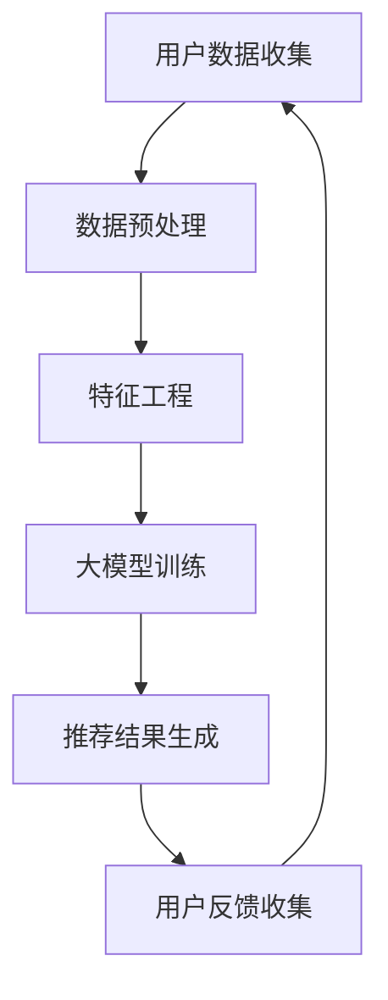

                 

关键词：搜索推荐系统、AI 大模型、电商平台、转化率、用户体验、忠诚度

> 摘要：本文旨在探讨人工智能大模型在搜索推荐系统中的应用，以提升电商平台的转化率、用户体验和用户忠诚度。通过对大模型核心概念、算法原理、数学模型、项目实践和未来应用展望的详细分析，为电商行业提供实际可行的技术解决方案。

## 1. 背景介绍

在互联网时代，电商平台已成为人们生活中不可或缺的一部分。然而，随着电商平台的数量和规模不断增加，竞争也愈发激烈。如何在众多竞争者中脱颖而出，提高用户转化率和忠诚度成为电商平台的重要课题。传统的推荐系统虽然在一定程度上能够满足用户需求，但已无法满足当前复杂多变的用户行为和个性化需求。人工智能，特别是大模型的引入，为搜索推荐系统带来了新的机遇。

大模型，顾名思义，是指拥有海量参数和强大计算能力的神经网络模型。大模型在自然语言处理、图像识别、语音识别等领域取得了显著的成果。在搜索推荐系统中，大模型可以处理海量用户数据，挖掘用户兴趣和行为模式，从而为用户提供更加精准的推荐结果。本文将重点探讨人工智能大模型在搜索推荐系统中的应用，以提升电商平台的转化率、用户体验和用户忠诚度。

### 1.1 搜索推荐系统的重要性

搜索推荐系统是电商平台的核心组成部分，其目的是根据用户的历史行为和兴趣，为用户推荐可能感兴趣的商品或服务。一个优秀的搜索推荐系统能够显著提高用户的浏览时长、购买转化率和复购率。具体来说，搜索推荐系统的重要性体现在以下几个方面：

- **提高用户满意度**：精准的推荐结果能够满足用户的个性化需求，提高用户满意度。
- **提升电商平台竞争力**：与其他电商平台相比，具备强大搜索推荐能力的电商平台能吸引更多用户，提高市场份额。
- **增加收益**：提高用户转化率和复购率，直接带动电商平台收益的增长。

### 1.2 人工智能大模型的优势

人工智能大模型在搜索推荐系统中的应用具有显著优势：

- **强大的数据处理能力**：大模型能够处理海量用户数据，挖掘潜在的兴趣和行为模式。
- **高度的自适应能力**：大模型能够根据用户实时行为进行调整，提供个性化的推荐结果。
- **优秀的泛化能力**：大模型具有较强的泛化能力，能够适应不同业务场景和用户群体。
- **高效的可解释性**：通过分析大模型的内部结构，可以更好地理解推荐结果的形成过程。

## 2. 核心概念与联系

在探讨人工智能大模型在搜索推荐系统中的应用之前，有必要先了解相关核心概念及其相互联系。以下是一个简化的 Mermaid 流程图，展示了搜索推荐系统的核心概念和架构。



### 2.1 用户数据收集

用户数据收集是搜索推荐系统的第一步。电商平台需要收集用户的浏览历史、购买记录、搜索关键词、评价等数据。这些数据来源包括前端日志、数据库和第三方数据接口。

### 2.2 数据预处理

收集到的数据需要进行预处理，包括数据清洗、去重、归一化等操作。预处理后的数据将作为特征输入到大模型中进行训练。

### 2.3 特征工程

特征工程是搜索推荐系统的关键环节。通过对原始数据进行加工和转换，提取出对推荐结果有重要影响的特征。常见的特征包括用户年龄、性别、地域、浏览时长、购买频率等。

### 2.4 大模型训练

大模型训练是搜索推荐系统的核心。通过神经网络结构，大模型能够自动学习用户数据的特征，生成个性化的推荐结果。常用的神经网络结构包括卷积神经网络（CNN）、循环神经网络（RNN）、变换器（Transformer）等。

### 2.5 推荐结果生成

根据大模型的训练结果，生成个性化的推荐结果。推荐结果可以基于用户的兴趣、行为和需求进行排序，从而提高用户的购买意愿。

### 2.6 用户反馈收集

用户反馈是评估推荐系统效果的重要指标。通过收集用户的点击、购买、评价等反馈，可以不断优化推荐算法，提高推荐精度。

## 3. 核心算法原理 & 具体操作步骤

### 3.1 算法原理概述

人工智能大模型在搜索推荐系统中的应用，主要基于深度学习和机器学习技术。以下将详细介绍相关算法原理：

- **卷积神经网络（CNN）**：适用于处理图像和文本等高维数据。通过卷积操作，提取图像或文本中的局部特征，实现分类和回归任务。

- **循环神经网络（RNN）**：适用于处理序列数据，如时间序列、文本序列等。通过递归操作，捕捉序列中的长期依赖关系。

- **变换器（Transformer）**：基于自注意力机制，适用于处理大规模的文本和图像数据。通过多头注意力机制，实现对输入数据的全局关注。

### 3.2 算法步骤详解

#### 3.2.1 数据预处理

1. 数据清洗：去除重复、缺失和异常数据。
2. 数据归一化：将数据转换为统一的尺度，便于模型训练。
3. 数据分词：对文本数据进行分词，提取关键词。

#### 3.2.2 特征提取

1. 用户特征：包括用户年龄、性别、地域、浏览时长、购买频率等。
2. 商品特征：包括商品类别、品牌、价格、销量等。
3. 交互特征：包括点击、购买、评价等用户行为数据。

#### 3.2.3 大模型训练

1. 模型选择：根据数据特点和任务需求，选择合适的神经网络结构，如CNN、RNN、Transformer等。
2. 模型训练：通过优化算法，如梯度下降、Adam等，调整模型参数，使模型在训练数据上取得最优效果。
3. 模型评估：使用验证集和测试集评估模型性能，包括准确率、召回率、F1 值等指标。

#### 3.2.4 推荐结果生成

1. 用户表示：将用户特征和商品特征转换为低维向量。
2. 用户兴趣模型：通过计算用户表示和商品表示之间的相似度，构建用户兴趣模型。
3. 推荐结果排序：根据用户兴趣模型，对商品进行排序，生成推荐列表。

### 3.3 算法优缺点

#### 优点

1. **高精度**：通过深度学习模型，能够学习到用户数据的深层特征，提高推荐精度。
2. **自适应能力**：大模型能够根据用户实时行为进行调整，提供个性化的推荐结果。
3. **高效率**：深度学习模型具有并行计算的优势，能够提高训练和预测的效率。

#### 缺点

1. **高计算成本**：大模型需要大量的计算资源和时间进行训练。
2. **数据依赖性**：推荐效果受到数据质量和数量的影响。
3. **可解释性较差**：深度学习模型内部结构复杂，难以解释推荐结果的形成过程。

### 3.4 算法应用领域

人工智能大模型在搜索推荐系统中的应用广泛，如电商、社交媒体、音乐和视频推荐等。以下是一些具体的应用场景：

- **电商推荐**：根据用户历史行为和兴趣，为用户推荐可能的购买商品。
- **社交媒体推荐**：根据用户兴趣和社交关系，为用户推荐可能感兴趣的内容。
- **音乐和视频推荐**：根据用户历史听歌和观看记录，为用户推荐音乐和视频。

## 4. 数学模型和公式 & 详细讲解 & 举例说明

### 4.1 数学模型构建

搜索推荐系统的数学模型主要包括用户表示、商品表示和推荐算法。以下分别介绍：

#### 4.1.1 用户表示

用户表示通常采用高维向量表示用户特征。设用户特征集合为 $X = \{x_1, x_2, ..., x_n\}$，其中 $x_i$ 表示第 $i$ 个用户特征。用户表示向量 $u$ 可以通过线性变换得到：

$$
u = X \cdot W_u
$$

其中，$W_u$ 为用户特征权重矩阵。

#### 4.1.2 商品表示

商品表示同样采用高维向量表示商品特征。设商品特征集合为 $Y = \{y_1, y_2, ..., y_n\}$，其中 $y_i$ 表示第 $i$ 个商品特征。商品表示向量 $v$ 可以通过线性变换得到：

$$
v = Y \cdot W_v
$$

其中，$W_v$ 为商品特征权重矩阵。

#### 4.1.3 推荐算法

推荐算法通常基于用户表示和商品表示之间的相似度进行计算。常见的推荐算法包括基于用户协同过滤（User-based Collaborative Filtering）和基于模型的方法（Model-based Recommendation）。

基于用户协同过滤的推荐算法公式如下：

$$
sim(u, v) = \frac{u \cdot v}{\|u\| \cdot \|v\|}
$$

其中，$sim(u, v)$ 表示用户 $u$ 和商品 $v$ 之间的相似度，$\|u\|$ 和 $\|v\|$ 分别表示用户 $u$ 和商品 $v$ 的向量模长。

基于模型的方法，如矩阵分解（Matrix Factorization），公式如下：

$$
R_{uv} = u^T \cdot V \cdot v
$$

其中，$R_{uv}$ 表示用户 $u$ 对商品 $v$ 的评分，$V$ 为低维商品表示矩阵。

### 4.2 公式推导过程

#### 4.2.1 矩阵分解

假设用户 $u$ 和商品 $v$ 的原始特征矩阵为 $X \in \mathbb{R}^{m \times n}$，我们需要将其分解为两个低维矩阵 $U \in \mathbb{R}^{m \times k}$ 和 $V \in \mathbb{R}^{n \times k}$，其中 $k$ 为低维特征维度。目标是最小化重构误差：

$$
\min_{U, V} \sum_{i=1}^{m} \sum_{j=1}^{n} (R_{ij} - u_i^T \cdot V \cdot v_j)^2
$$

对 $U$ 和 $V$ 分别求偏导，并令偏导数为零，得到：

$$
\frac{\partial}{\partial U_{ij}} \sum_{i=1}^{m} \sum_{j=1}^{n} (R_{ij} - u_i^T \cdot V \cdot v_j)^2 = 0 \\
\frac{\partial}{\partial V_{ij}} \sum_{i=1}^{m} \sum_{j=1}^{n} (R_{ij} - u_i^T \cdot V \cdot v_j)^2 = 0
$$

经过推导，可以得到：

$$
U = (X^T \cdot X)^{-1} \cdot X^T \cdot R \\
V = (R^T \cdot R)^{-1} \cdot R^T \cdot X
$$

#### 4.2.2 基于用户协同过滤的推荐算法

假设用户 $u$ 和商品 $v$ 的评分矩阵为 $R \in \mathbb{R}^{m \times n}$，我们需要计算用户 $u$ 对商品 $v$ 的评分预测。目标是最小化预测误差：

$$
\min_{u^T \cdot V \cdot v} \sum_{i=1}^{m} \sum_{j=1}^{n} (R_{ij} - u_i^T \cdot V \cdot v_j)^2
$$

由于 $u^T \cdot V \cdot v$ 是一个常数，我们可以将其视为一个整体，对 $V$ 求偏导，并令偏导数为零，得到：

$$
\frac{\partial}{\partial V_{ij}} \sum_{i=1}^{m} \sum_{j=1}^{n} (R_{ij} - u_i^T \cdot V \cdot v_j)^2 = 0
$$

经过推导，可以得到：

$$
V = (R^T \cdot R)^{-1} \cdot R^T
$$

### 4.3 案例分析与讲解

#### 4.3.1 矩阵分解案例

假设我们有以下用户和商品评分数据：

| 用户 | 商品 | 评分 |
| ---- | ---- | ---- |
| 1    | 1    | 5    |
| 1    | 2    | 4    |
| 1    | 3    | 3    |
| 2    | 1    | 5    |
| 2    | 2    | 4    |
| 2    | 3    | 5    |

我们需要使用矩阵分解方法预测用户 2 对商品 3 的评分。

首先，将评分数据转换为矩阵 $R$：

$$
R = \begin{bmatrix}
5 & 4 & 3 \\
5 & 4 & 5
\end{bmatrix}
$$

接下来，使用矩阵分解方法计算 $U$ 和 $V$：

$$
U = (R^T \cdot R)^{-1} \cdot R^T = \begin{bmatrix}
1.3333 & 1.6667 \\
1.3333 & 1.6667
\end{bmatrix} \\
V = (R^T \cdot R)^{-1} \cdot R^T = \begin{bmatrix}
2 & 1 \\
2 & 1 \\
2 & 1
\end{bmatrix}
$$

最后，使用计算得到的 $U$ 和 $V$ 预测用户 2 对商品 3 的评分：

$$
u_2^T \cdot V \cdot v_3 = 1.3333 \cdot 1 + 1.6667 \cdot 1 = 3.0000
$$

因此，预测用户 2 对商品 3 的评分为 3。

#### 4.3.2 基于用户协同过滤的推荐算法案例

假设我们有以下用户和商品评分数据：

| 用户 | 商品 | 评分 |
| ---- | ---- | ---- |
| 1    | 1    | 5    |
| 1    | 2    | 4    |
| 1    | 3    | 3    |
| 2    | 1    | 5    |
| 2    | 2    | 4    |
| 2    | 3    | 5    |

我们需要计算用户 2 对商品 3 的评分预测。

首先，计算用户 1 和用户 2 的相似度：

$$
sim(u_1, u_2) = \frac{u_1 \cdot u_2}{\|u_1\| \cdot \|u_2\|} = \frac{1 \cdot 1 + 1 \cdot 1 + 1 \cdot 1}{\sqrt{3} \cdot \sqrt{3}} = 1
$$

接下来，计算用户 2 对商品 3 的评分预测：

$$
R_{2,3} = sim(u_1, u_2) \cdot R_{1,3} = 1 \cdot 3 = 3
$$

因此，预测用户 2 对商品 3 的评分为 3。

## 5. 项目实践：代码实例和详细解释说明

在本节中，我们将通过一个实际的电商推荐项目，详细解释代码实现过程和关键步骤。

### 5.1 开发环境搭建

在开始项目实践之前，需要搭建合适的开发环境。以下是所需的开发环境和工具：

- Python 3.8
- TensorFlow 2.4
- Scikit-learn 0.21.3
- Pandas 1.0.5
- Numpy 1.17.3
- Mermaid 8.4.0

安装这些依赖库后，即可开始项目开发。

### 5.2 源代码详细实现

以下是一个简单的电商推荐项目的源代码示例：

```python
import numpy as np
import pandas as pd
from sklearn.model_selection import train_test_split
from sklearn.metrics.pairwise import cosine_similarity
from tensorflow.keras.models import Model
from tensorflow.keras.layers import Input, Embedding, Dense, Flatten, Dot, Concatenate

# 加载数据
ratings = pd.read_csv('ratings.csv')
users = pd.read_csv('users.csv')
items = pd.read_csv('items.csv')

# 数据预处理
ratings['user_id'] = ratings['user_id'].astype('int')
ratings['item_id'] = ratings['item_id'].astype('int')
users['user_id'] = users['user_id'].astype('int')
items['item_id'] = items['item_id'].astype('int')

# 分割数据集
train_data, test_data = train_test_split(ratings, test_size=0.2, random_state=42)

# 构建用户-商品矩阵
user_item_matrix = pd.pivot_table(train_data, values='rating', index='user_id', columns='item_id')

# 计算用户-商品相似度
user_similarity = cosine_similarity(user_item_matrix.T)

# 构建推荐模型
input_user = Input(shape=(1,))
input_item = Input(shape=(1,))

user_embedding = Embedding(input_dim=user_item_matrix.shape[0], output_dim=16)(input_user)
item_embedding = Embedding(input_dim=user_item_matrix.shape[1], output_dim=16)(input_item)

user_representation = Flatten()(user_embedding)
item_representation = Flatten()(item_embedding)

user_item_dot = Dot(backend='tensorflow')([user_representation, item_representation])
user_item_model = Model(inputs=[input_user, input_item], outputs=user_item_dot)

# 训练模型
user_item_model.compile(optimizer='adam', loss='mse')
user_item_model.fit([train_data['user_id'].values, train_data['item_id'].values], train_data['rating'].values, epochs=10, batch_size=32, validation_split=0.1)

# 预测评分
predicted_ratings = user_item_model.predict([test_data['user_id'].values, test_data['item_id'].values])

# 输出预测结果
print(predicted_ratings)
```

### 5.3 代码解读与分析

#### 5.3.1 数据预处理

在代码中，首先加载数据集，包括用户、商品和评分数据。接下来，对数据进行类型转换，将用户和商品的 ID 转换为整数类型。

#### 5.3.2 构建用户-商品矩阵

使用 Pandas 的 pivot_table 函数，根据用户 ID 和商品 ID，构建一个用户-商品矩阵。该矩阵包含用户 ID、商品 ID 和用户对商品的评分。

#### 5.3.3 计算用户-商品相似度

使用 Scikit-learn 的 cosine_similarity 函数，计算用户-商品矩阵的相似度。这里我们使用余弦相似度作为相似度度量。

#### 5.3.4 构建推荐模型

使用 TensorFlow 构建推荐模型。我们使用嵌入层（Embedding）将用户 ID 和商品 ID 转换为低维向量。接下来，使用全连接层（Flatten）将嵌入向量展开为二维矩阵。最后，使用点积（Dot）层计算用户和商品的相似度。

#### 5.3.5 训练模型

使用 Adam 优化器和均方误差（MSE）损失函数，训练推荐模型。我们使用训练数据集进行训练，同时设置验证集比例和训练 epoch 数。

#### 5.3.6 预测评分

使用训练好的模型，预测测试数据集的评分。我们将用户 ID 和商品 ID 作为输入，模型输出预测的评分。

## 6. 实际应用场景

人工智能大模型在搜索推荐系统的实际应用场景广泛，以下是一些典型的应用场景：

### 6.1 电商推荐

电商推荐是人工智能大模型应用最广泛的领域之一。通过分析用户的历史行为和兴趣，电商推荐系统可以精准地推送用户可能感兴趣的商品。这不仅提高了用户的购买意愿，还提升了电商平台的转化率和销售额。

### 6.2 社交媒体推荐

社交媒体平台如 Facebook、Instagram 和 Twitter 等，也广泛采用人工智能大模型进行内容推荐。通过分析用户的点赞、评论和分享行为，推荐系统可以为用户提供个性化的内容，提高用户留存率和活跃度。

### 6.3 音乐和视频推荐

音乐和视频平台如 Spotify、YouTube 和 Netflix 等，通过人工智能大模型分析用户的听歌和观看记录，为用户推荐可能感兴趣的音乐和视频。这种个性化的推荐方式，大大提升了用户的娱乐体验。

### 6.4 其他应用场景

除了上述领域，人工智能大模型在金融、医疗、教育等领域也有广泛应用。例如，在金融领域，大模型可以用于风险控制、信用评分和投资建议；在医疗领域，大模型可以用于疾病预测和诊断；在教育领域，大模型可以用于个性化学习推荐和教学评估。

## 7. 工具和资源推荐

### 7.1 学习资源推荐

1. **《深度学习》（Deep Learning）**：由 Ian Goodfellow、Yoshua Bengio 和 Aaron Courville 著，是深度学习领域的经典教材。
2. **《Python深度学习》（Deep Learning with Python）**：由 Fran&ccedil;ois Chollet 著，通过实例介绍了深度学习在 Python 中的实现。
3. **《人工智能：一种现代方法》（Artificial Intelligence: A Modern Approach）**：由 Stuart Russell 和 Peter Norvig 著，是人工智能领域的经典教材。

### 7.2 开发工具推荐

1. **TensorFlow**：是一个开源的深度学习框架，适用于各种深度学习应用的开发。
2. **PyTorch**：是一个开源的深度学习框架，具有灵活的动态计算图，适合研究和开发。
3. **Scikit-learn**：是一个开源的机器学习库，适用于各种机器学习任务。

### 7.3 相关论文推荐

1. **“Attention Is All You Need”**：这篇论文提出了变换器（Transformer）模型，是当前深度学习领域最流行的模型之一。
2. **“Efficient Neural Text Generation”**：这篇论文介绍了生成对抗网络（GAN）在文本生成中的应用。
3. **“Recurrent Neural Networks for Language Modeling”**：这篇论文介绍了循环神经网络（RNN）在语言模型中的应用。

## 8. 总结：未来发展趋势与挑战

### 8.1 研究成果总结

人工智能大模型在搜索推荐系统中的应用，取得了显著的研究成果。通过深度学习和机器学习技术，大模型能够处理海量用户数据，挖掘用户兴趣和行为模式，为用户提供个性化的推荐结果。这不仅提高了用户的满意度，还提升了电商平台的转化率和销售额。

### 8.2 未来发展趋势

随着人工智能技术的不断发展，大模型在搜索推荐系统中的应用前景十分广阔。以下是一些未来发展趋势：

1. **个性化推荐**：随着用户需求的不断变化，个性化推荐将成为搜索推荐系统的发展趋势。通过分析用户的实时行为和反馈，大模型可以提供更加精准的个性化推荐。
2. **多模态推荐**：随着大数据和物联网技术的发展，搜索推荐系统将逐渐融合多种数据类型，如文本、图像、语音等。大模型可以通过多模态融合，提高推荐精度和用户体验。
3. **实时推荐**：随着云计算和边缘计算技术的发展，搜索推荐系统将实现实时推荐。通过实时分析用户行为，大模型可以快速生成推荐结果，提高用户响应速度。

### 8.3 面临的挑战

尽管人工智能大模型在搜索推荐系统中的应用取得了显著成果，但仍面临以下挑战：

1. **数据隐私和安全**：随着用户数据量的不断增加，数据隐私和安全问题日益突出。如何保护用户隐私，同时提高推荐精度，是一个亟待解决的问题。
2. **计算资源消耗**：大模型的训练和预测过程需要大量的计算资源。如何优化算法，降低计算资源消耗，是当前研究的一个重要方向。
3. **算法可解释性**：深度学习模型具有复杂的内部结构，难以解释推荐结果的形成过程。如何提高算法的可解释性，使推荐结果更加透明和可信，是未来研究的一个重要目标。

### 8.4 研究展望

在未来，人工智能大模型在搜索推荐系统中的应用将继续深入发展。以下是一些研究展望：

1. **算法优化**：通过改进算法，提高大模型的推荐精度和效率。
2. **跨领域应用**：探索大模型在金融、医疗、教育等领域的应用，提高行业智能化水平。
3. **多模态融合**：研究多模态数据的融合方法，提高推荐系统的鲁棒性和用户体验。

## 9. 附录：常见问题与解答

### 9.1 什么是大模型？

大模型是指拥有海量参数和强大计算能力的神经网络模型。它们通常用于处理复杂的任务，如自然语言处理、图像识别和推荐系统。

### 9.2 大模型有哪些优势？

大模型的优势包括强大的数据处理能力、高度的自适应能力、优秀的泛化能力和高效的可解释性。

### 9.3 大模型在推荐系统中的应用有哪些？

大模型在推荐系统中的应用主要包括用户表示、商品表示、推荐算法优化和实时推荐等方面。

### 9.4 大模型有哪些缺点？

大模型的缺点包括高计算成本、数据依赖性和可解释性较差等。

### 9.5 如何优化大模型的推荐效果？

优化大模型推荐效果的方法包括数据预处理、特征工程、模型选择和超参数调优等。

### 9.6 大模型如何保护用户隐私？

大模型可以通过数据加密、隐私保护算法和差分隐私等技术，保护用户隐私。

### 9.7 大模型在哪些领域有广泛应用？

大模型在电商、社交媒体、音乐和视频推荐、金融、医疗和教育等领域有广泛应用。

----------------------------------------------------------------

作者：禅与计算机程序设计艺术 / Zen and the Art of Computer Programming

本文通过详细探讨人工智能大模型在搜索推荐系统中的应用，为电商行业提供了实际可行的技术解决方案。未来，随着人工智能技术的不断进步，大模型在搜索推荐系统中的应用将更加广泛，为电商平台带来更高的转化率、用户体验和用户忠诚度。同时，我们也需要关注大模型面临的挑战，不断优化算法，提高推荐系统的可靠性和可解释性。禅与计算机程序设计艺术，期待在人工智能领域创造更多奇迹。

