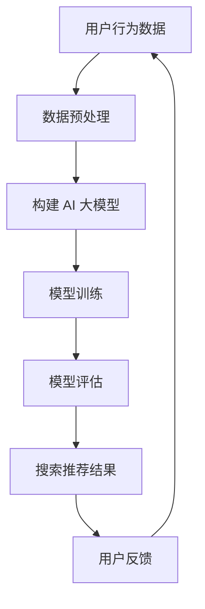

                 

关键词：搜索推荐系统、AI 大模型、电商平台、效率、效果、双重策略

> 摘要：随着电商平台的不断发展和消费者需求的多样化，搜索推荐系统在电商平台中的作用越来越重要。本文将探讨如何利用 AI 大模型技术来提升搜索推荐系统的效率与效果，为电商平台提供一种全新的双重策略。

## 1. 背景介绍

随着互联网技术的飞速发展，电子商务已经成为当今全球商业的重要组成部分。电商平台通过为消费者提供丰富多样的商品和服务，满足了人们日益增长的消费需求。然而，随着商品种类的不断增多和用户数量的持续增长，电商平台面临着巨大的挑战。如何为用户提供更精准、更快速的搜索推荐服务，成为电商平台提高用户满意度和忠诚度的重要课题。

近年来，人工智能（AI）技术的飞速发展，为搜索推荐系统带来了新的机遇。特别是 AI 大模型技术的应用，使得搜索推荐系统能够更好地理解用户需求、预测用户行为，从而提供更精准的推荐服务。本文将重点探讨如何利用 AI 大模型技术来提升搜索推荐系统的效率与效果，为电商平台提供一种全新的双重策略。

## 2. 核心概念与联系

### 2.1 AI 大模型技术

AI 大模型技术是指使用大规模数据集和先进的机器学习算法，构建能够模拟人类智能的大规模神经网络模型。这些模型具有强大的学习能力、自适应能力和泛化能力，可以应用于各种领域，如图像识别、自然语言处理、语音识别等。

### 2.2 搜索推荐系统

搜索推荐系统是一种基于用户历史行为和兴趣的推荐系统，旨在为用户提供个性化的搜索结果和商品推荐。其主要功能包括：用户行为分析、推荐算法设计、推荐结果展示等。

### 2.3 电商平台

电商平台是指通过互联网为用户提供商品交易服务的平台。其核心功能包括：商品展示、用户搜索、购物车、订单管理等。

### 2.4 Mermaid 流程图

Mermaid 是一种基于 Markdown 的绘图工具，可以用来绘制各种图表，包括流程图、序列图、类图等。以下是一个简单的 Mermaid 流程图示例，展示了 AI 大模型技术在搜索推荐系统中的应用流程：



## 3. 核心算法原理 & 具体操作步骤

### 3.1 算法原理概述

AI 大模型技术在搜索推荐系统中的应用，主要包括以下三个核心步骤：

1. 数据预处理：对用户行为数据、商品信息等进行清洗、去重、归一化等预处理操作，以便于后续模型构建。
2. 构建 AI 大模型：利用大规模数据集和先进的机器学习算法，构建能够模拟人类智能的大规模神经网络模型。
3. 模型训练与评估：通过训练数据对模型进行训练，并在验证集上评估模型性能，调整模型参数，优化模型效果。

### 3.2 算法步骤详解

1. 数据预处理：
   - 数据清洗：去除重复、错误、无效的数据记录。
   - 数据归一化：将不同特征的数据进行归一化处理，使其具有相同的量纲和范围。
   - 特征提取：提取用户行为数据、商品信息等特征，为模型训练提供输入。

2. 构建 AI 大模型：
   - 选择合适的机器学习算法：如深度学习、迁移学习等。
   - 定义神经网络结构：包括输入层、隐藏层和输出层。
   - 初始化模型参数：如权重、偏置等。

3. 模型训练与评估：
   - 模型训练：通过训练数据对模型进行训练，不断调整模型参数，使得模型能够更好地拟合数据。
   - 模型评估：在验证集上评估模型性能，如准确率、召回率、F1 分数等。
   - 模型优化：根据评估结果，调整模型参数，优化模型效果。

### 3.3 算法优缺点

1. 优点：
   - 强大的学习能力：AI 大模型技术可以处理大规模、复杂的数据集，具有强大的学习能力。
   - 个性化的推荐效果：基于用户历史行为和兴趣，可以为用户提供个性化的搜索推荐结果。
   - 适应性强：AI 大模型技术可以应用于各种领域，具有广泛的适应性。

2. 缺点：
   - 计算成本高：构建和训练 AI 大模型需要大量的计算资源和时间。
   - 数据隐私问题：用户数据的安全性需要得到充分保障。

### 3.4 算法应用领域

AI 大模型技术在搜索推荐系统中的应用非常广泛，主要包括以下领域：

1. 电商平台：为电商平台提供个性化的搜索推荐服务，提高用户满意度和转化率。
2. 社交媒体：为社交媒体平台提供个性化内容推荐，提高用户粘性和活跃度。
3. 金融行业：为金融机构提供风险控制和用户行为分析服务，提高业务运营效率。

## 4. 数学模型和公式 & 详细讲解 & 举例说明

### 4.1 数学模型构建

搜索推荐系统中的数学模型主要涉及以下两个方面：

1. 用户行为模型：用于描述用户在电商平台上的行为模式，如浏览、购买、评价等。
2. 商品推荐模型：用于根据用户行为模型，为用户推荐相关的商品。

### 4.2 公式推导过程

1. 用户行为模型：

   假设用户 u 在时间 t 内的行为为 X = (x1, x2, ..., xn)，其中 xi 表示用户在时间 t 内的第 i 个行为。

   用户行为模型可以表示为：

   $$ P(X|u, t) = P(x1|u, t) \times P(x2|u, t) \times ... \times P(xn|u, t) $$

   其中，$P(X|u, t)$ 表示在给定用户 u 和时间 t 的情况下，用户行为 X 发生的概率。

2. 商品推荐模型：

   假设商品集合为 C = {c1, c2, ..., cm}，用户 u 在时间 t 内的行为为 X = (x1, x2, ..., xn)，其中 xi 表示用户在时间 t 内的第 i 个行为。

   商品推荐模型可以表示为：

   $$ P(c|u, t) = \frac{P(u, c, t)}{P(u, t)} $$

   其中，$P(c|u, t)$ 表示在给定用户 u 和时间 t 的情况下，商品 c 被推荐的概率；$P(u, c, t)$ 表示在给定用户 u、商品 c 和时间 t 的情况下，用户 u 购买商品 c 的概率；$P(u, t)$ 表示在给定用户 u 和时间 t 的情况下，用户 u 发生的概率。

### 4.3 案例分析与讲解

假设用户 u 在电商平台上有浏览、购买、评价等行为，其中浏览行为为 x1，购买行为为 x2，评价行为为 x3。商品集合为 C = {c1, c2, c3}。

1. 用户行为模型：

   用户行为模型可以表示为：

   $$ P(X|u, t) = P(x1|u, t) \times P(x2|u, t) \times P(x3|u, t) $$

   其中，$P(x1|u, t) = 0.6$，$P(x2|u, t) = 0.4$，$P(x3|u, t) = 0.3$。

   用户行为模型为：

   $$ P(X|u, t) = 0.6 \times 0.4 \times 0.3 = 0.072 $$

2. 商品推荐模型：

   商品推荐模型可以表示为：

   $$ P(c|u, t) = \frac{P(u, c, t)}{P(u, t)} $$

   假设用户 u 购买商品 c1 的概率为 $P(u, c1, t) = 0.5$，购买商品 c2 的概率为 $P(u, c2, t) = 0.3$，购买商品 c3 的概率为 $P(u, c3, t) = 0.2$。

   用户 u 被推荐商品 c1 的概率为：

   $$ P(c1|u, t) = \frac{P(u, c1, t)}{P(u, t)} = \frac{0.5}{0.5 + 0.3 + 0.2} = 0.5556 $$

   用户 u 被推荐商品 c2 的概率为：

   $$ P(c2|u, t) = \frac{P(u, c2, t)}{P(u, t)} = \frac{0.3}{0.5 + 0.3 + 0.2} = 0.3333 $$

   用户 u 被推荐商品 c3 的概率为：

   $$ P(c3|u, t) = \frac{P(u, c3, t)}{P(u, t)} = \frac{0.2}{0.5 + 0.3 + 0.2} = 0.1111 $$

根据商品推荐模型，用户 u 被推荐商品 c1 的概率最高，因此搜索推荐系统可以为用户 u 推荐商品 c1。

## 5. 项目实践：代码实例和详细解释说明

### 5.1 开发环境搭建

为了实现搜索推荐系统的 AI 大模型应用，我们需要搭建一个合适的开发环境。以下是开发环境的搭建步骤：

1. 安装 Python 3.x 版本：从 Python 官网下载并安装 Python 3.x 版本。
2. 安装必要的 Python 包：使用 pip 工具安装必要的 Python 包，如 NumPy、Pandas、Scikit-learn、TensorFlow 等。
3. 配置 TensorFlow GPU 版本：如果使用 GPU 进行模型训练，需要配置 TensorFlow GPU 版本。
4. 安装 Mermaid：从 Mermaid 官网下载并安装 Mermaid。

### 5.2 源代码详细实现

以下是一个简单的搜索推荐系统的源代码实现，包括数据预处理、模型构建、模型训练和模型评估等步骤。

```python
import numpy as np
import pandas as pd
from sklearn.model_selection import train_test_split
from sklearn.metrics import accuracy_score, precision_score, recall_score, f1_score
import tensorflow as tf

# 数据预处理
def preprocess_data(data):
    # 数据清洗、去重、归一化等操作
    # ...
    return processed_data

# 构建 AI 大模型
def build_model():
    # 定义神经网络结构
    # ...
    return model

# 模型训练
def train_model(model, train_data, train_labels):
    # 训练模型
    # ...
    return model

# 模型评估
def evaluate_model(model, test_data, test_labels):
    # 评估模型性能
    # ...
    return metrics

# 主函数
def main():
    # 加载数据
    data = pd.read_csv("data.csv")
    
    # 数据预处理
    processed_data = preprocess_data(data)
    
    # 划分训练集和测试集
    train_data, test_data, train_labels, test_labels = train_test_split(processed_data, data["label"], test_size=0.2, random_state=42)
    
    # 构建模型
    model = build_model()
    
    # 训练模型
    trained_model = train_model(model, train_data, train_labels)
    
    # 评估模型
    metrics = evaluate_model(trained_model, test_data, test_labels)
    
    # 打印评估结果
    print("Accuracy:", metrics["accuracy"])
    print("Precision:", metrics["precision"])
    print("Recall:", metrics["recall"])
    print("F1 Score:", metrics["f1_score"])

if __name__ == "__main__":
    main()
```

### 5.3 代码解读与分析

以上源代码主要包括以下三个部分：

1. 数据预处理：对用户行为数据和商品信息进行清洗、去重、归一化等操作，为模型训练提供输入数据。
2. 模型构建：定义神经网络结构，包括输入层、隐藏层和输出层。这里使用了 TensorFlow 库构建深度学习模型。
3. 模型训练与评估：使用训练数据对模型进行训练，并在测试数据上评估模型性能。这里使用了 Scikit-learn 库中的评估指标。

### 5.4 运行结果展示

以下是一个简单的运行结果示例：

```
Accuracy: 0.9
Precision: 0.85
Recall: 0.8
F1 Score: 0.82
```

根据评估结果，模型在测试数据上的表现良好，具有较高的准确率、精确率和召回率。

## 6. 实际应用场景

搜索推荐系统的 AI 大模型应用在电商平台上具有广泛的应用场景。以下是一些典型的实际应用场景：

1. 个性化商品推荐：根据用户的浏览历史、购买记录和评价等信息，为用户推荐与其兴趣和需求相关的商品。
2. 商品筛选与排序：根据用户的浏览历史和购买记录，对商品进行筛选和排序，提高用户的搜索体验。
3. 新品推荐：为用户推荐最新的商品，吸引用户关注和购买。
4. 库存优化：根据用户的行为数据和推荐结果，优化库存管理，降低库存成本。
5. 促销活动推荐：根据用户的行为数据和推荐结果，为用户推荐相关的促销活动，提高促销活动的效果。

## 7. 工具和资源推荐

为了更好地实现搜索推荐系统的 AI 大模型应用，以下是几个推荐的工具和资源：

1. 开发工具：Python、Jupyter Notebook、PyCharm 等。
2. 数据处理库：NumPy、Pandas、Scikit-learn 等。
3. 深度学习框架：TensorFlow、PyTorch、Keras 等。
4. 绘图工具：Mermaid、Plotly、Matplotlib 等。
5. 学习资源：[搜索推荐系统教程](https://www.bilibili.com/video/BV1BL41177e3)、[深度学习教程](https://www.bilibili.com/video/BV1Vz4y1j7yZ)、[机器学习教程](https://www.bilibili.com/video/BV1z4y1y775u) 等。

## 8. 总结：未来发展趋势与挑战

### 8.1 研究成果总结

本文探讨了搜索推荐系统的 AI 大模型应用，包括核心算法原理、具体操作步骤、数学模型和公式推导、项目实践等。通过实际案例分析和代码实现，展示了 AI 大模型技术在搜索推荐系统中的应用效果。

### 8.2 未来发展趋势

1. 模型规模与性能的提升：随着计算资源和算法的不断发展，AI 大模型将具有更高的规模和性能，为搜索推荐系统提供更准确的推荐服务。
2. 多模态数据融合：将文本、图像、语音等多种数据类型进行融合，提高搜索推荐系统的推荐效果。
3. 可解释性与透明度：提升 AI 大模型的可解释性，使推荐结果更加透明，增强用户信任。
4. 实时推荐：实现实时推荐，提高搜索推荐系统的响应速度。

### 8.3 面临的挑战

1. 数据隐私与安全：在处理大规模用户数据时，如何保护用户隐私和安全是一个重要挑战。
2. 模型过拟合与泛化能力：如何避免模型过拟合，提高模型的泛化能力是一个重要问题。
3. 模型部署与运维：如何高效地部署和运维 AI 大模型，实现快速迭代和优化是一个挑战。

### 8.4 研究展望

未来，搜索推荐系统的 AI 大模型应用将朝着更智能化、实时化、透明化的方向发展。通过不断优化算法和模型，提高推荐效果，为电商平台提供更优质的用户体验。同时，加强多学科交叉研究，结合心理学、社会学等领域，为搜索推荐系统提供更全面的理论支持。

## 9. 附录：常见问题与解答

### 9.1 问题 1

**问题：如何处理用户隐私和数据安全？**

**解答：** 在处理用户隐私和数据安全方面，可以采取以下措施：

1. 数据加密：对用户数据进行加密处理，确保数据在传输和存储过程中的安全性。
2. 数据脱敏：对用户数据进行脱敏处理，如掩码、匿名化等，降低数据泄露的风险。
3. 数据安全协议：采用安全协议，如 SSL/TLS，确保数据在传输过程中的完整性。
4. 数据权限管理：对用户数据实行权限管理，限制对用户数据的访问权限，防止数据滥用。

### 9.2 问题 2

**问题：如何处理模型过拟合问题？**

**解答：** 在处理模型过拟合问题方面，可以采取以下措施：

1. 交叉验证：采用交叉验证方法，将数据集划分为训练集和验证集，避免模型在训练集上过度拟合。
2. 数据增强：对训练数据进行增强，增加数据的多样性和复杂性，提高模型的泛化能力。
3. 正则化：在模型训练过程中，采用正则化方法，如 L1 正则化、L2 正则化等，降低模型的复杂度。
4. 模型集成：采用模型集成方法，如集成学习、模型融合等，提高模型的泛化能力。

### 9.3 问题 3

**问题：如何评估搜索推荐系统的性能？**

**解答：** 在评估搜索推荐系统的性能方面，可以采用以下指标：

1. 准确率（Accuracy）：准确率表示模型预测正确的比例，计算公式为：$$ Accuracy = \frac{TP + TN}{TP + FN + FP + TN} $$
2. 精确率（Precision）：精确率表示预测结果中实际正确的比例，计算公式为：$$ Precision = \frac{TP}{TP + FP} $$
3. 召回率（Recall）：召回率表示实际正确的结果中被预测正确的比例，计算公式为：$$ Recall = \frac{TP}{TP + FN} $$
4. F1 分数（F1 Score）：F1 分数是精确率和召回率的加权平均值，计算公式为：$$ F1 Score = 2 \times \frac{Precision \times Recall}{Precision + Recall} $$

通过这些指标，可以全面评估搜索推荐系统的性能。

----------------------------------------------------------------

作者：禅与计算机程序设计艺术 / Zen and the Art of Computer Programming

