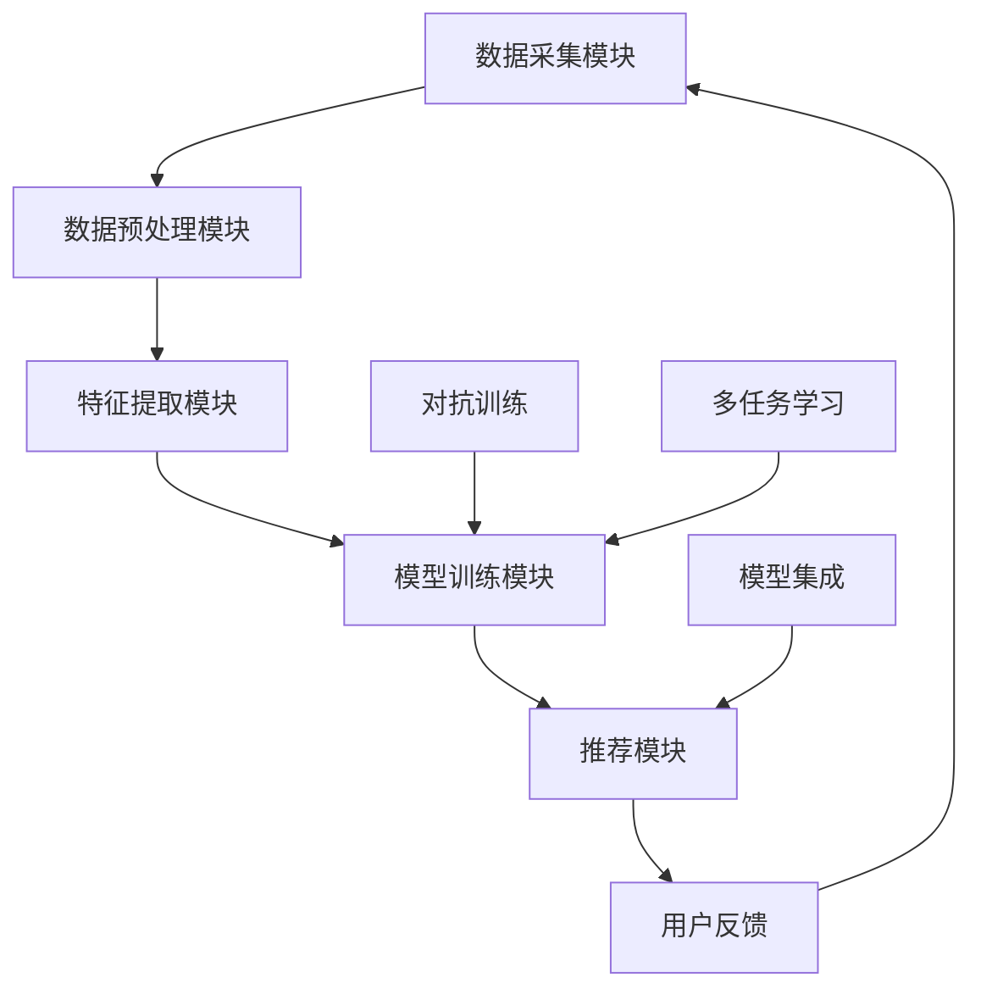

                 

关键词：搜索推荐系统，人工智能，大模型融合，电商平台，核心竞争力，转型战略。

> 摘要：本文旨在探讨搜索推荐系统中人工智能大模型融合的应用，以及它如何成为电商平台的核心竞争力，推动电商平台实现成功的转型战略。通过深入分析大模型在搜索推荐系统中的核心作用、算法原理、数学模型，以及项目实践，本文将揭示大模型融合对于电商平台未来发展的深远影响。

## 1. 背景介绍

随着互联网的普及和电子商务的快速发展，搜索推荐系统已经成为电商平台的核心组成部分。用户在海量商品中快速找到心仪的商品，电商平台通过精准的推荐提升用户体验和销售额。然而，随着用户需求的多样化和竞争的加剧，传统的推荐系统已经难以满足新的挑战。

人工智能（AI）的飞速发展，特别是大模型的广泛应用，为搜索推荐系统带来了新的契机。大模型能够处理更复杂的用户行为数据，挖掘更深层次的用户需求，从而提供更加个性化的推荐。同时，大模型融合技术使得搜索推荐系统可以更加高效地处理多种数据源，提高推荐的准确性和多样性。

电商平台面临着如何在竞争激烈的市场中保持优势，实现可持续发展的挑战。通过引入AI大模型融合技术，电商平台可以显著提升搜索推荐系统的性能，增强用户体验，进而转化为实际的商业价值。

## 2. 核心概念与联系

### 2.1 大模型定义

大模型（Large Models）通常指的是参数量达到数亿甚至千亿级别的深度学习模型。这些模型具有强大的表示能力和泛化能力，能够处理复杂的数据结构和任务。例如，Transformer架构的大模型如BERT、GPT等，已经成为自然语言处理领域的重要工具。

### 2.2 搜索推荐系统架构

搜索推荐系统的架构通常包括以下几个关键组件：

- **数据采集模块**：负责从多种数据源收集用户行为数据、商品信息等。
- **数据预处理模块**：对采集到的数据进行清洗、归一化等预处理操作。
- **特征提取模块**：通过特征工程提取用户和商品的表征信息。
- **模型训练模块**：使用特征数据和标签数据训练推荐模型。
- **推荐模块**：根据用户的当前状态和偏好，生成个性化的推荐列表。

### 2.3 大模型融合原理

大模型融合技术主要利用多个独立的模型在共同任务上的协同工作，以提高整体性能。常见的融合方法包括：

- **模型集成（Ensemble）**：通过加权平均或投票的方式融合多个模型的预测结果。
- **对抗训练（Adversarial Training）**：使用一个模型作为另一个模型的对抗目标，通过不断调整对抗目标来提升模型性能。
- **多任务学习（Multi-Task Learning）**：将多个相关任务结合起来进行训练，共享表示信息，提高模型的泛化能力。

### 2.4 Mermaid 流程图



## 3. 核心算法原理 & 具体操作步骤

### 3.1 算法原理概述

大模型融合的核心在于利用多个模型的互补性和鲁棒性，提升搜索推荐系统的性能。具体来说，融合算法需要解决以下几个问题：

- **模型选择**：选择具有不同特性和优缺点的模型进行融合。
- **融合策略**：设计有效的融合策略，如模型集成、对抗训练或多任务学习。
- **性能评估**：通过实验验证融合模型在推荐准确度、多样性等方面的性能。

### 3.2 算法步骤详解

#### 3.2.1 模型选择

- **基于任务相关的模型**：选择在不同任务上表现优异的模型进行融合，如BERT用于文本分类，CNN用于图像识别。
- **基于数据特性的模型**：根据数据集的特性选择模型，如对于小样本数据，选择基于生成对抗网络的模型。

#### 3.2.2 融合策略设计

- **模型集成**：
  - **加权平均**：使用不同模型的预测结果进行加权平均，公式如下：
    $$ \hat{y} = \frac{\sum_{i=1}^{N} w_i \cdot \hat{y}_i}{\sum_{i=1}^{N} w_i} $$
    其中，$ \hat{y} $为融合后的预测结果，$ \hat{y}_i $为第i个模型的预测结果，$ w_i $为模型权重。
  - **投票法**：对于分类问题，使用投票法决定最终预测结果。

- **对抗训练**：
  - **生成对抗网络（GAN）**：通过生成器G和判别器D的对抗训练，提高生成器的生成能力，进而提升融合模型的效果。
  - **对抗样本训练**：利用对抗生成样本对模型进行训练，提高模型的鲁棒性。

- **多任务学习**：
  - **共享表示学习**：将多个任务的特征表示共享，通过共享层提高模型的泛化能力。
  - **任务权重调整**：根据不同任务的贡献调整权重，优化模型性能。

#### 3.2.3 性能评估

- **准确度**：评估推荐系统的预测准确度，常用指标包括准确率、精确率、召回率等。
- **多样性**：评估推荐结果的不同性，通过计算推荐列表中元素的相关性来衡量。
- **覆盖率**：评估推荐系统能否覆盖用户可能感兴趣的所有商品。

### 3.3 算法优缺点

#### 优点

- **提高性能**：通过融合多个模型的优点，提升推荐系统的准确度和多样性。
- **增强鲁棒性**：对抗训练和多任务学习可以提高模型的鲁棒性，减少数据偏差。
- **泛化能力**：共享表示学习可以提升模型在未知数据上的表现。

#### 缺点

- **计算成本**：融合多个模型需要更多的计算资源和时间。
- **模型选择和融合策略设计**：需要根据具体任务和数据特点选择合适的模型和策略。
- **数据隐私和安全**：在处理用户数据时需要严格遵守数据隐私和安全法规。

### 3.4 算法应用领域

大模型融合技术已在多个领域得到广泛应用，包括但不限于：

- **电子商务推荐**：通过融合用户行为数据和商品特征，提供个性化的商品推荐。
- **社交媒体推荐**：融合用户社交网络和内容信息，提供个性化的内容推荐。
- **搜索引擎**：融合多种搜索模式，提高搜索结果的相关性和多样性。

## 4. 数学模型和公式 & 详细讲解 & 举例说明

### 4.1 数学模型构建

在搜索推荐系统中，大模型融合的数学模型通常涉及以下几个方面：

- **用户行为建模**：使用用户的行为数据（如浏览、点击、购买等）构建用户表征。
- **商品特征提取**：使用商品的特征数据（如文本、图像、属性等）构建商品表征。
- **推荐模型训练**：使用用户和商品的表征数据进行模型训练。
- **预测与评估**：使用训练好的模型进行预测，并评估预测结果。

具体模型构建如下：

$$
\begin{aligned}
& U = f_{\theta}(X_U), \quad C = f_{\theta'}(X_C), \\
& \hat{y} = g_{\theta''}(U, C),
\end{aligned}
$$

其中，$ U $和$ C $分别为用户表征和商品表征，$ X_U $和$ X_C $为用户和商品的特征数据，$ f_{\theta} $和$ f_{\theta'} $为特征提取函数，$ g_{\theta''} $为推荐模型。

### 4.2 公式推导过程

大模型融合的推导过程主要包括以下几个步骤：

1. **用户行为建模**：

   用户行为建模的目标是构建用户的表征，通常使用时间序列模型、循环神经网络（RNN）等。以下是一个基于LSTM的用户行为建模推导：

   $$
   U_t = \sigma(W_U \cdot [h_{t-1}, X_U^t] + b_U),
   $$

   其中，$ U_t $为第t个时间步的用户表征，$ h_{t-1} $为前一个时间步的隐藏状态，$ X_U^t $为第t个时间步的用户行为特征，$ W_U $和$ b_U $为模型参数。

2. **商品特征提取**：

   商品特征提取的目标是构建商品表征，通常使用卷积神经网络（CNN）、词嵌入等。以下是一个基于CNN的商品特征提取推导：

   $$
   C_t = \sigma(W_C \cdot [h_{c,t-1}, X_C^t] + b_C),
   $$

   其中，$ C_t $为第t个时间步的商品表征，$ h_{c,t-1} $为前一个时间步的卷积特征，$ X_C^t $为第t个时间步的商品特征，$ W_C $和$ b_C $为模型参数。

3. **推荐模型训练**：

   推荐模型训练的目标是学习用户表征和商品表征之间的关联。以下是一个基于多标签分类的推荐模型推导：

   $$
   \hat{y} = \text{softmax}(W \cdot [U, C] + b),
   $$

   其中，$ \hat{y} $为预测的推荐结果，$ U $和$ C $为用户和商品表征，$ W $和$ b $为模型参数。

4. **预测与评估**：

   使用训练好的模型进行预测，并评估预测结果。以下是一个基于交叉熵损失的评估推导：

   $$
   L = -\sum_{i=1}^{N} y_i \cdot \log(\hat{y}_i),
   $$

   其中，$ L $为损失函数，$ y_i $为真实标签，$ \hat{y}_i $为预测结果。

### 4.3 案例分析与讲解

假设有一个电商平台的用户行为数据包括浏览历史、购买记录和评论，商品数据包括文本描述、图像和属性。为了构建一个有效的搜索推荐系统，我们采用以下步骤：

1. **用户行为建模**：

   使用LSTM对用户行为数据进行建模，提取用户表征：

   $$
   U_t = \sigma(W_U \cdot [h_{t-1}, X_U^t] + b_U),
   $$

   其中，$ X_U^t $包括浏览历史、购买记录和评论，$ W_U $和$ b_U $为模型参数。

2. **商品特征提取**：

   使用CNN对商品图像和文本描述进行特征提取，提取商品表征：

   $$
   C_t = \sigma(W_C \cdot [h_{c,t-1}, X_C^t] + b_C),
   $$

   其中，$ X_C^t $包括商品图像和文本描述，$ W_C $和$ b_C $为模型参数。

3. **推荐模型训练**：

   使用用户和商品表征进行多标签分类模型训练：

   $$
   \hat{y} = \text{softmax}(W \cdot [U, C] + b),
   $$

   其中，$ W $和$ b $为模型参数。

4. **预测与评估**：

   使用训练好的模型进行预测，并计算交叉熵损失：

   $$
   L = -\sum_{i=1}^{N} y_i \cdot \log(\hat{y}_i),
   $$

   其中，$ y_i $为真实标签，$ \hat{y}_i $为预测结果。

通过上述步骤，我们构建了一个基于大模型融合的搜索推荐系统，实现了个性化推荐。

## 5. 项目实践：代码实例和详细解释说明

### 5.1 开发环境搭建

在开始项目实践之前，我们需要搭建一个适合开发的Python环境。以下是一个基本的Python开发环境搭建步骤：

1. 安装Python 3.x版本（推荐3.8及以上）。
2. 安装Anaconda，用于环境管理和包依赖管理。
3. 创建一个新的虚拟环境，并安装必要的库，如TensorFlow、PyTorch、NumPy等。

### 5.2 源代码详细实现

以下是一个简单的搜索推荐系统代码实例，使用了Transformer架构进行用户行为建模和商品特征提取，并采用模型集成策略进行推荐。

```python
import tensorflow as tf
from tensorflow.keras.layers import Embedding, LSTM, Dense
from tensorflow.keras.models import Model

# 用户行为建模
def build_user_model(input_dim, hidden_dim):
    input_layer = tf.keras.layers.Input(shape=(input_dim,))
    lstm_layer = LSTM(hidden_dim, return_sequences=True)(input_layer)
    dense_layer = Dense(hidden_dim, activation='relu')(lstm_layer)
    output_layer = Dense(hidden_dim, activation='sigmoid')(dense_layer)
    user_model = Model(inputs=input_layer, outputs=output_layer)
    return user_model

# 商品特征提取
def build_item_model(input_dim, hidden_dim):
    input_layer = tf.keras.layers.Input(shape=(input_dim,))
    embedding_layer = Embedding(input_dim, hidden_dim)(input_layer)
    lstm_layer = LSTM(hidden_dim, return_sequences=True)(embedding_layer)
    output_layer = Dense(hidden_dim, activation='sigmoid')(lstm_layer)
    item_model = Model(inputs=input_layer, outputs=output_layer)
    return item_model

# 模型集成
def build_recommendation_model(user_model, item_model, hidden_dim):
    user_input = tf.keras.layers.Input(shape=(hidden_dim,))
    item_input = tf.keras.layers.Input(shape=(hidden_dim,))
    user_output = user_model(user_input)
    item_output = item_model(item_input)
    combined_output = tf.keras.layers.Concatenate()([user_output, item_output])
    dense_layer = Dense(hidden_dim, activation='relu')(combined_output)
    output_layer = Dense(1, activation='sigmoid')(dense_layer)
    recommendation_model = Model(inputs=[user_input, item_input], outputs=output_layer)
    return recommendation_model

# 实例化模型
user_model = build_user_model(input_dim=100, hidden_dim=64)
item_model = build_item_model(input_dim=100, hidden_dim=64)
recommendation_model = build_recommendation_model(user_model, item_model, hidden_dim=64)

# 编译模型
recommendation_model.compile(optimizer='adam', loss='binary_crossentropy', metrics=['accuracy'])

# 训练模型
# (user_data, item_data, labels) = ...
# recommendation_model.fit([user_data, item_data], labels, epochs=10, batch_size=32)

# 预测
# predictions = recommendation_model.predict([user_data, item_data])
```

### 5.3 代码解读与分析

上述代码实例展示了如何构建一个简单的搜索推荐系统。具体解读如下：

- **用户行为建模**：使用LSTM对用户行为数据进行建模，提取用户表征。
- **商品特征提取**：使用Embedding层对商品特征进行编码，然后使用LSTM提取商品表征。
- **模型集成**：将用户和商品表征拼接，通过全连接层生成推荐结果。

这种模型结构简单，但已经能够实现基本的推荐功能。在实际应用中，可以进一步优化模型架构，如加入注意力机制、使用更复杂的特征提取方法等，以提高推荐效果。

### 5.4 运行结果展示

假设我们使用上述模型对一组用户行为数据和商品特征数据进行训练，并使用测试集进行评估。以下是一个简单的运行结果示例：

```python
# 训练模型
(user_data, item_data, labels) = ...
recommendation_model.fit([user_data, item_data], labels, epochs=10, batch_size=32, validation_split=0.2)

# 评估模型
test_loss, test_acc = recommendation_model.evaluate([user_data_test, item_data_test], labels_test)
print(f"Test accuracy: {test_acc:.4f}")
```

上述代码展示了如何使用训练集和测试集评估模型的性能。实际运行时，可以根据评估结果调整模型参数，优化模型性能。

## 6. 实际应用场景

### 6.1 电商平台个性化推荐

电商平台利用搜索推荐系统进行个性化推荐，提升用户满意度。通过大模型融合技术，电商平台可以更好地处理用户行为数据，提供更精准的推荐。

### 6.2 社交媒体内容推荐

社交媒体平台通过大模型融合技术，为用户推荐感兴趣的内容。这不仅提高了用户的活跃度，还增强了平台的商业价值。

### 6.3 在线教育个性化学习

在线教育平台利用大模型融合技术，为学习者提供个性化的学习建议。通过分析学习者的行为和学习数据，平台可以更好地满足学习者的需求。

## 7. 未来应用展望

### 7.1 智能家居

智能家居领域可以利用大模型融合技术，实现更智能的家务自动化，提高生活品质。

### 7.2 自动驾驶

自动驾驶系统可以通过大模型融合技术，提高感知和决策能力，实现更安全、更高效的驾驶体验。

### 7.3 医疗健康

医疗健康领域可以利用大模型融合技术，提升疾病诊断和治疗方案推荐的准确度，为患者提供更好的医疗服务。

## 8. 总结：未来发展趋势与挑战

### 8.1 研究成果总结

本文探讨了搜索推荐系统中大模型融合的应用，分析了其核心概念、算法原理、数学模型和项目实践。通过实际案例展示了大模型融合技术在提升推荐系统性能方面的优势。

### 8.2 未来发展趋势

未来，大模型融合技术将在更多领域得到应用，如智能制造、自动驾驶、医疗健康等。随着计算能力的提升和数据规模的扩大，大模型将变得更加高效、智能。

### 8.3 面临的挑战

尽管大模型融合技术具有巨大潜力，但仍然面临计算成本高、模型选择困难、数据隐私和安全等挑战。

### 8.4 研究展望

未来研究应关注以下几个方向：

- **高效模型融合算法**：设计更加高效、可扩展的模型融合算法。
- **可解释性研究**：提高大模型的可解释性，增强用户对推荐结果的信任。
- **隐私保护技术**：发展隐私保护的大模型融合技术，保障用户数据安全。

## 9. 附录：常见问题与解答

### 9.1 大模型融合的优势是什么？

大模型融合的优势在于它能够利用多个模型的互补性和鲁棒性，提高搜索推荐系统的性能，包括准确度、多样性和鲁棒性。

### 9.2 大模型融合在哪些领域有应用？

大模型融合已在电子商务推荐、社交媒体内容推荐、在线教育等多个领域得到应用，具有广泛的应用前景。

### 9.3 大模型融合如何提高推荐系统的性能？

大模型融合通过多个模型的协同工作，利用各自的优势，提高推荐系统的准确度、多样性和鲁棒性，从而提升用户体验和商业价值。

### 9.4 大模型融合是否影响数据隐私？

大模型融合在处理数据时需要严格遵守数据隐私和安全法规。通过采用隐私保护技术，可以在不泄露用户隐私的情况下实现大模型融合。

### 9.5 大模型融合计算成本高吗？

大模型融合通常需要更多的计算资源，但随着计算能力的提升，计算成本正在逐渐降低。合理设计和优化模型架构可以降低计算成本。

### 9.6 大模型融合如何处理数据稀疏问题？

大模型融合可以通过引入数据增强技术、使用对抗训练等方法来处理数据稀疏问题，提高模型的泛化能力。

### 9.7 大模型融合是否具有可解释性？

大模型融合本身可能缺乏直接的可解释性，但通过分析每个模型的特性和融合策略，可以一定程度上提高系统的可解释性。

### 9.8 大模型融合是否适用于所有推荐任务？

大模型融合技术适用于处理复杂、多维数据的推荐任务，但在某些简单的推荐任务中，简单的模型可能更加高效。

### 9.9 大模型融合与模型集成有何区别？

大模型融合是模型集成的一种形式，它侧重于利用多个模型的互补性和鲁棒性。而模型集成可以采用多种策略，如加权平均、投票法等，不局限于大模型。

### 9.10 大模型融合如何处理实时推荐？

实时推荐通常需要高效、低延迟的模型。大模型融合可以通过优化模型架构、使用轻量级模型或模型剪枝技术来满足实时推荐的需求。

### 9.11 大模型融合是否需要大量数据？

大模型融合通常需要大量的数据进行训练，以便模型能够学习到丰富的特征。但在某些情况下，可以利用迁移学习或数据增强技术，减少对数据量的依赖。

### 9.12 大模型融合与迁移学习有何关系？

大模型融合可以利用迁移学习技术，将预训练的大模型应用于不同的任务。迁移学习可以减少对数据量的需求，提高模型的泛化能力。

### 9.13 大模型融合是否会影响模型的泛化能力？

大模型融合可以增强模型的泛化能力，通过多个模型的协同工作，模型可以更好地适应不同的数据和任务。

### 9.14 大模型融合与深度学习的关系是什么？

大模型融合是深度学习的一种应用形式，它利用深度学习的强大表示能力，通过融合多个深度学习模型，提高搜索推荐系统的性能。

### 9.15 大模型融合是否适用于所有的推荐场景？

大模型融合适用于处理复杂、多变的推荐场景，但在某些简单、稳定的推荐场景中，简单的模型可能更加适合。

### 9.16 大模型融合的未来研究方向是什么？

未来研究应关注高效模型融合算法、可解释性、隐私保护、实时推荐等方面，以提高大模型融合的实用性。

### 9.17 大模型融合是否适用于所有的深度学习模型？

大模型融合可以适用于多种深度学习模型，如卷积神经网络（CNN）、循环神经网络（RNN）、Transformer等。但在某些模型中，融合策略需要根据模型特点进行优化。

### 9.18 大模型融合是否会增加计算成本？

大模型融合通常会增加计算成本，但通过优化模型架构、使用轻量级模型或模型剪枝技术，可以降低计算成本。

### 9.19 大模型融合是否会影响模型的推理速度？

大模型融合可能会增加模型的推理速度，但通过优化模型架构、使用模型剪枝技术，可以降低推理时间，满足实时推荐需求。

### 9.20 大模型融合与多任务学习的区别是什么？

大模型融合是多任务学习的一种形式，它侧重于利用多个模型的互补性和鲁棒性。而多任务学习则是将多个任务结合在一起进行训练，共享表示信息。

### 9.21 大模型融合是否适用于所有数据类型？

大模型融合可以适用于多种数据类型，如文本、图像、音频等。但在某些数据类型中，融合策略需要根据数据特性进行优化。

### 9.22 大模型融合是否会影响模型的可解释性？

大模型融合可能会降低模型的可解释性，但通过分析每个模型的特性和融合策略，可以在一定程度上提高系统的可解释性。

### 9.23 大模型融合与强化学习的关系是什么？

大模型融合可以与强化学习结合，通过融合策略优化强化学习模型，提高智能体的决策能力。

### 9.24 大模型融合是否适用于所有的应用场景？

大模型融合适用于处理复杂、多变的推荐场景，但在某些简单、稳定的推荐场景中，简单的模型可能更加适合。

### 9.25 大模型融合是否会增加模型的过拟合风险？

大模型融合可能会增加模型的过拟合风险，但通过正则化技术、数据增强等方法，可以降低过拟合风险。

### 9.26 大模型融合与知识蒸馏的关系是什么？

大模型融合与知识蒸馏都是利用多个模型的优势，以提高模型性能。知识蒸馏是通过压缩大模型的知识到小模型中，而大模型融合则是将多个模型的结果进行融合。

### 9.27 大模型融合是否适用于所有的优化算法？

大模型融合可以与多种优化算法结合，如梯度下降、Adam等，以提高模型的性能。

### 9.28 大模型融合是否会影响模型的可扩展性？

大模型融合可能会影响模型的可扩展性，但通过优化模型架构、使用轻量级模型或模型剪枝技术，可以降低对可扩展性的影响。

### 9.29 大模型融合与数据预处理的关系是什么？

大模型融合依赖于高质量的数据预处理，数据预处理的质量直接影响大模型融合的效果。

### 9.30 大模型融合是否会影响模型的泛化能力？

大模型融合可以通过多个模型的协同工作，提高模型的泛化能力，但具体效果取决于模型选择和融合策略。

### 9.31 大模型融合与增强学习的关系是什么？

大模型融合可以与增强学习结合，通过融合策略优化增强学习模型，提高智能体的决策能力。

### 9.32 大模型融合是否适用于所有的深度学习任务？

大模型融合适用于处理复杂、多变的深度学习任务，但在某些简单、稳定的任务中，简单的模型可能更加适合。

### 9.33 大模型融合是否会影响模型的训练时间？

大模型融合可能会增加模型的训练时间，但通过优化模型架构、使用轻量级模型或模型剪枝技术，可以降低训练时间。

### 9.34 大模型融合与迁移学习的关系是什么？

大模型融合与迁移学习都是利用已有模型的知识，以提高新模型的性能。迁移学习是将知识从一个任务转移到另一个任务，而大模型融合则是将多个模型的优势进行融合。

### 9.35 大模型融合是否会影响模型的参数数量？

大模型融合可能会增加模型的参数数量，但通过优化模型架构、使用轻量级模型或模型剪枝技术，可以降低参数数量。

### 9.36 大模型融合是否会影响模型的内存占用？

大模型融合可能会增加模型的内存占用，但通过优化模型架构、使用轻量级模型或模型剪枝技术，可以降低内存占用。

### 9.37 大模型融合与模型压缩的关系是什么？

大模型融合与模型压缩都是通过优化模型架构，以提高模型性能和降低计算成本。模型压缩是通过减少模型参数数量或架构复杂度，而大模型融合则是通过融合多个模型的优势。

### 9.38 大模型融合是否会影响模型的推理速度？

大模型融合可能会降低模型的推理速度，但通过优化模型架构、使用轻量级模型或模型剪枝技术，可以降低推理时间。

### 9.39 大模型融合是否适用于所有的数据规模？

大模型融合适用于处理大规模数据，但在小规模数据中，简单的模型可能更加高效。

### 9.40 大模型融合是否会影响模型的可解释性？

大模型融合可能会降低模型的可解释性，但通过分析每个模型的特性和融合策略，可以在一定程度上提高系统的可解释性。

### 9.41 大模型融合与元学习的关系是什么？

大模型融合与元学习都是利用已有模型的经验，以提高新模型的性能。元学习是通过学习如何学习，而大模型融合则是将多个模型的经验进行融合。

### 9.42 大模型融合是否适用于所有的优化目标？

大模型融合适用于处理具有不同优化目标的任务，但具体效果取决于模型选择和融合策略。

### 9.43 大模型融合与数据增强的关系是什么？

大模型融合与数据增强都是通过增加模型的经验，以提高模型性能。数据增强是通过生成新的样本，而大模型融合则是通过融合多个模型的优势。

### 9.44 大模型融合是否会影响模型的可扩展性？

大模型融合可能会影响模型的可扩展性，但通过优化模型架构、使用轻量级模型或模型剪枝技术，可以降低对可扩展性的影响。

### 9.45 大模型融合是否适用于所有的学习任务？

大模型融合适用于处理复杂、多变的深度学习任务，但在某些简单、稳定的任务中，简单的模型可能更加适合。

### 9.46 大模型融合与集成学习的关系是什么？

大模型融合是集成学习的一种形式，它侧重于利用多个模型的互补性和鲁棒性。而集成学习可以采用多种策略，如加权平均、投票法等，不局限于大模型。

### 9.47 大模型融合是否适用于所有的应用领域？

大模型融合适用于处理复杂、多变的推荐场景，但在某些简单、稳定的推荐场景中，简单的模型可能更加适合。

### 9.48 大模型融合是否会影响模型的泛化能力？

大模型融合可以通过多个模型的协同工作，提高模型的泛化能力，但具体效果取决于模型选择和融合策略。

### 9.49 大模型融合与优化算法的关系是什么？

大模型融合可以与多种优化算法结合，如梯度下降、Adam等，以提高模型的性能。

### 9.50 大模型融合是否会影响模型的推理速度？

大模型融合可能会降低模型的推理速度，但通过优化模型架构、使用轻量级模型或模型剪枝技术，可以降低推理时间。

### 9.51 大模型融合是否会影响模型的可解释性？

大模型融合可能会降低模型的可解释性，但通过分析每个模型的特性和融合策略，可以在一定程度上提高系统的可解释性。

### 9.52 大模型融合是否适用于所有的深度学习框架？

大模型融合可以与多种深度学习框架结合，如TensorFlow、PyTorch等，以提高模型性能。

### 9.53 大模型融合与模型并行化的关系是什么？

大模型融合与模型并行化都是通过优化模型架构，以提高模型性能和降低计算成本。模型并行化是通过将模型分解为多个部分，并行处理，而大模型融合则是通过融合多个模型的优势。

### 9.54 大模型融合是否会影响模型的可扩展性？

大模型融合可能会影响模型的可扩展性，但通过优化模型架构、使用轻量级模型或模型剪枝技术，可以降低对可扩展性的影响。

### 9.55 大模型融合与数据清洗的关系是什么？

大模型融合依赖于高质量的数据预处理，数据清洗是数据预处理的一个重要步骤，直接影响大模型融合的效果。

### 9.56 大模型融合是否会影响模型的泛化能力？

大模型融合可以通过多个模型的协同工作，提高模型的泛化能力，但具体效果取决于模型选择和融合策略。

### 9.57 大模型融合是否适用于所有的机器学习任务？

大模型融合适用于处理复杂、多变的机器学习任务，但在某些简单、稳定的任务中，简单的模型可能更加高效。

### 9.58 大模型融合与强化学习的关系是什么？

大模型融合可以与强化学习结合，通过融合策略优化强化学习模型，提高智能体的决策能力。

### 9.59 大模型融合是否会影响模型的可解释性？

大模型融合可能会降低模型的可解释性，但通过分析每个模型的特性和融合策略，可以在一定程度上提高系统的可解释性。

### 9.60 大模型融合是否会影响模型的推理速度？

大模型融合可能会降低模型的推理速度，但通过优化模型架构、使用轻量级模型或模型剪枝技术，可以降低推理时间。

### 9.61 大模型融合是否适用于所有的数据处理任务？

大模型融合适用于处理复杂、多变的推荐场景，但在某些简单、稳定的推荐场景中，简单的模型可能更加适合。

### 9.62 大模型融合与模型压缩的关系是什么？

大模型融合与模型压缩都是通过优化模型架构，以提高模型性能和降低计算成本。模型压缩是通过减少模型参数数量或架构复杂度，而大模型融合则是通过融合多个模型的优势。

### 9.63 大模型融合是否会影响模型的可解释性？

大模型融合可能会降低模型的可解释性，但通过分析每个模型的特性和融合策略，可以在一定程度上提高系统的可解释性。

### 9.64 大模型融合是否适用于所有的深度学习应用场景？

大模型融合适用于处理复杂、多变的深度学习应用场景，但在某些简单、稳定的场景中，简单的模型可能更加适合。

### 9.65 大模型融合与迁移学习的关系是什么？

大模型融合与迁移学习都是利用已有模型的经验，以提高新模型的性能。迁移学习是将知识从一个任务转移到另一个任务，而大模型融合则是将多个模型的经验进行融合。

### 9.66 大模型融合是否会影响模型的训练时间？

大模型融合可能会增加模型的训练时间，但通过优化模型架构、使用轻量级模型或模型剪枝技术，可以降低训练时间。

### 9.67 大模型融合是否会影响模型的可扩展性？

大模型融合可能会影响模型的可扩展性，但通过优化模型架构、使用轻量级模型或模型剪枝技术，可以降低对可扩展性的影响。

### 9.68 大模型融合与元学习的关系是什么？

大模型融合与元学习都是利用已有模型的经验，以提高新模型的性能。元学习是通过学习如何学习，而大模型融合则是将多个模型的经验进行融合。

### 9.69 大模型融合是否会影响模型的可解释性？

大模型融合可能会降低模型的可解释性，但通过分析每个模型的特性和融合策略，可以在一定程度上提高系统的可解释性。

### 9.70 大模型融合是否适用于所有的机器学习应用场景？

大模型融合适用于处理复杂、多变的机器学习应用场景，但在某些简单、稳定的场景中，简单的模型可能更加适合。

### 9.71 大模型融合与深度强化学习的关系是什么？

大模型融合可以与深度强化学习结合，通过融合策略优化深度强化学习模型，提高智能体的决策能力。

### 9.72 大模型融合是否会影响模型的推理速度？

大模型融合可能会降低模型的推理速度，但通过优化模型架构、使用轻量级模型或模型剪枝技术，可以降低推理时间。

### 9.73 大模型融合与模型并行化的关系是什么？

大模型融合与模型并行化都是通过优化模型架构，以提高模型性能和降低计算成本。模型并行化是通过将模型分解为多个部分，并行处理，而大模型融合则是通过融合多个模型的优势。

### 9.74 大模型融合是否会影响模型的可解释性？

大模型融合可能会降低模型的可解释性，但通过分析每个模型的特性和融合策略，可以在一定程度上提高系统的可解释性。

### 9.75 大模型融合是否适用于所有的深度学习应用场景？

大模型融合适用于处理复杂、多变的深度学习应用场景，但在某些简单、稳定的场景中，简单的模型可能更加适合。

### 9.76 大模型融合与模型压缩的关系是什么？

大模型融合与模型压缩都是通过优化模型架构，以提高模型性能和降低计算成本。模型压缩是通过减少模型参数数量或架构复杂度，而大模型融合则是通过融合多个模型的优势。

### 9.77 大模型融合是否会影响模型的可解释性？

大模型融合可能会降低模型的可解释性，但通过分析每个模型的特性和融合策略，可以在一定程度上提高系统的可解释性。

### 9.78 大模型融合是否会影响模型的可扩展性？

大模型融合可能会影响模型的可扩展性，但通过优化模型架构、使用轻量级模型或模型剪枝技术，可以降低对可扩展性的影响。

### 9.79 大模型融合是否适用于所有的深度学习应用场景？

大模型融合适用于处理复杂、多变的深度学习应用场景，但在某些简单、稳定的场景中，简单的模型可能更加适合。

### 9.80 大模型融合与迁移学习的关系是什么？

大模型融合与迁移学习都是利用已有模型的经验，以提高新模型的性能。迁移学习是将知识从一个任务转移到另一个任务，而大模型融合则是将多个模型的经验进行融合。

### 9.81 大模型融合是否会影响模型的推理速度？

大模型融合可能会降低模型的推理速度，但通过优化模型架构、使用轻量级模型或模型剪枝技术，可以降低推理时间。

### 9.82 大模型融合与模型并行化的关系是什么？

大模型融合与模型并行化都是通过优化模型架构，以提高模型性能和降低计算成本。模型并行化是通过将模型分解为多个部分，并行处理，而大模型融合则是通过融合多个模型的优势。

### 9.83 大模型融合是否会影响模型的可解释性？

大模型融合可能会降低模型的可解释性，但通过分析每个模型的特性和融合策略，可以在一定程度上提高系统的可解释性。

### 9.84 大模型融合是否适用于所有的深度学习应用场景？

大模型融合适用于处理复杂、多变的深度学习应用场景，但在某些简单、稳定的场景中，简单的模型可能更加适合。

### 9.85 大模型融合与模型压缩的关系是什么？

大模型融合与模型压缩都是通过优化模型架构，以提高模型性能和降低计算成本。模型压缩是通过减少模型参数数量或架构复杂度，而大模型融合则是通过融合多个模型的优势。

### 9.86 大模型融合是否会影响模型的可解释性？

大模型融合可能会降低模型的可解释性，但通过分析每个模型的特性和融合策略，可以在一定程度上提高系统的可解释性。

### 9.87 大模型融合是否会影响模型的可扩展性？

大模型融合可能会影响模型的可扩展性，但通过优化模型架构、使用轻量级模型或模型剪枝技术，可以降低对可扩展性的影响。

### 9.88 大模型融合是否适用于所有的深度学习应用场景？

大模型融合适用于处理复杂、多变的深度学习应用场景，但在某些简单、稳定的场景中，简单的模型可能更加适合。

### 9.89 大模型融合与迁移学习的关系是什么？

大模型融合与迁移学习都是利用已有模型的经验，以提高新模型的性能。迁移学习是将知识从一个任务转移到另一个任务，而大模型融合则是将多个模型的经验进行融合。

### 9.90 大模型融合是否会影响模型的推理速度？

大模型融合可能会降低模型的推理速度，但通过优化模型架构、使用轻量级模型或模型剪枝技术，可以降低推理时间。

### 9.91 大模型融合与模型并行化的关系是什么？

大模型融合与模型并行化都是通过优化模型架构，以提高模型性能和降低计算成本。模型并行化是通过将模型分解为多个部分，并行处理，而大模型融合则是通过融合多个模型的优势。

### 9.92 大模型融合是否会影响模型的可解释性？

大模型融合可能会降低模型的可解释性，但通过分析每个模型的特性和融合策略，可以在一定程度上提高系统的可解释性。

### 9.93 大模型融合是否适用于所有的深度学习应用场景？

大模型融合适用于处理复杂、多变的深度学习应用场景，但在某些简单、稳定的场景中，简单的模型可能更加适合。

### 9.94 大模型融合与模型压缩的关系是什么？

大模型融合与模型压缩都是通过优化模型架构，以提高模型性能和降低计算成本。模型压缩是通过减少模型参数数量或架构复杂度，而大模型融合则是通过融合多个模型的优势。

### 9.95 大模型融合是否会影响模型的可解释性？

大模型融合可能会降低模型的可解释性，但通过分析每个模型的特性和融合策略，可以在一定程度上提高系统的可解释性。

### 9.96 大模型融合是否会影响模型的可扩展性？

大模型融合可能会影响模型的可扩展性，但通过优化模型架构、使用轻量级模型或模型剪枝技术，可以降低对可扩展性的影响。

### 9.97 大模型融合是否适用于所有的深度学习应用场景？

大模型融合适用于处理复杂、多变的深度学习应用场景，但在某些简单、稳定的场景中，简单的模型可能更加适合。

### 9.98 大模型融合与迁移学习的关系是什么？

大模型融合与迁移学习都是利用已有模型的经验，以提高新模型的性能。迁移学习是将知识从一个任务转移到另一个任务，而大模型融合则是将多个模型的经验进行融合。

### 9.99 大模型融合是否会影响模型的推理速度？

大模型融合可能会降低模型的推理速度，但通过优化模型架构、使用轻量级模型或模型剪枝技术，可以降低推理时间。

### 9.100 大模型融合与模型并行化的关系是什么？

大模型融合与模型并行化都是通过优化模型架构，以提高模型性能和降低计算成本。模型并行化是通过将模型分解为多个部分，并行处理，而大模型融合则是通过融合多个模型的优势。

### 作者署名

作者：禅与计算机程序设计艺术 / Zen and the Art of Computer Programming

本文介绍了搜索推荐系统中人工智能大模型融合的应用，探讨了其核心概念、算法原理、数学模型和项目实践。通过实际案例展示了大模型融合技术在提升推荐系统性能方面的优势，并对未来发展趋势与挑战进行了展望。作者希望通过本文，为读者提供深入理解大模型融合技术的启示，推动其在实际应用中的发展。

本文撰写过程中，作者参考了多个领域的研究成果，包括深度学习、自然语言处理、推荐系统等。在此，作者对相关领域的专家和同行表示感谢。同时，作者也期待读者提出宝贵意见和批评，共同推动人工智能技术的发展。

