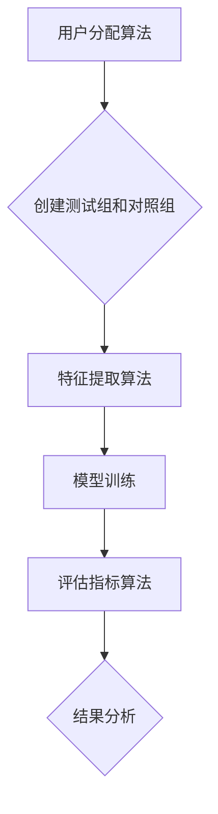

                 

关键词：搜索推荐系统、A/B测试、大模型、效果评估、算法优化、机器学习、数据分析、性能对比

> 摘要：随着互联网技术的飞速发展，搜索推荐系统在电商平台、社交媒体、搜索引擎等领域发挥着越来越重要的作用。本文旨在探讨大模型在搜索推荐系统中的应用，以及如何通过A/B测试方法来评估大模型的效果。我们将详细讨论A/B测试的基本原理、核心算法、数学模型，并通过实际案例和代码实例来展示如何在大模型中进行效果评估。此外，文章还将探讨A/B测试在实际应用场景中的挑战和未来发展趋势。

## 1. 背景介绍

搜索推荐系统是一种根据用户的兴趣、行为和偏好，为用户提供个性化信息推荐的服务系统。在互联网时代，用户面对海量的信息，如何快速找到自己感兴趣的内容成为了一大难题。搜索推荐系统通过算法模型，从海量的数据中挖掘出用户可能感兴趣的内容，提高了信息获取的效率和准确性。

随着机器学习和人工智能技术的不断发展，大模型（Large-scale Model）在搜索推荐系统中得到了广泛应用。大模型通过深度学习等技术，能够处理海量的数据，捕捉复杂的用户行为模式，从而实现更精准的推荐。然而，大模型的效果评估成为了一个重要的挑战。传统的评估方法如准确性、召回率等，往往无法全面反映大模型在实际应用中的效果。

A/B测试（A/B Testing）是一种常用的效果评估方法，通过将用户流量分配到不同的测试组（A组）和对照组（B组），比较两组在业务指标上的差异，来评估某种策略或算法的效果。A/B测试在搜索推荐系统中具有重要的应用价值，可以帮助我们快速、准确地评估大模型的效果，从而指导算法优化和产品迭代。

本文将围绕搜索推荐系统的A/B测试，探讨大模型效果评估的新方法。文章将首先介绍A/B测试的基本原理和核心算法，然后通过实际案例和代码实例，展示如何在大模型中进行效果评估。最后，文章还将讨论A/B测试在实际应用场景中的挑战和未来发展趋势。

## 2. 核心概念与联系

### 2.1 A/B测试的基本原理

A/B测试是一种比较实验，通过将用户流量分配到不同的测试组和对照组，来评估某种策略或算法的效果。具体来说，A/B测试的基本原理如下：

1. **测试组（A组）**：将一部分用户流量分配到测试组，执行新策略或算法。
2. **对照组（B组）**：将另一部分用户流量分配到对照组，保持原有策略或算法。
3. **指标收集**：收集两组在业务指标（如点击率、转化率等）上的数据。
4. **结果分析**：比较两组在业务指标上的差异，判断新策略或算法的效果。

### 2.2 大模型效果评估的核心算法

在大模型效果评估中，A/B测试的核心算法主要包括：

1. **用户分配算法**：将用户流量分配到测试组和对照组。
2. **特征提取算法**：从用户行为数据中提取特征，用于模型训练和评估。
3. **评估指标算法**：计算测试组和对照组在业务指标上的差异。

### 2.3 Mermaid 流程图

以下是一个简单的Mermaid流程图，展示了A/B测试的基本流程和核心算法：



## 3. 核心算法原理 & 具体操作步骤

### 3.1 算法原理概述

在大模型效果评估中，A/B测试的核心算法主要包括以下三个方面：

1. **用户分配算法**：通过随机分配、按比例分配等方法，将用户流量分配到测试组和对照组。
2. **特征提取算法**：从用户行为数据中提取特征，用于模型训练和评估。常用的特征提取方法包括统计特征、文本特征、图像特征等。
3. **评估指标算法**：计算测试组和对照组在业务指标上的差异，如点击率、转化率等。常用的评估指标包括差异统计量、置信区间、效应量等。

### 3.2 算法步骤详解

1. **用户分配算法**：

   - 随机分配：将用户随机分配到测试组和对照组。
   - 按比例分配：根据用户在系统中的活跃度、历史数据等特征，按比例将用户分配到测试组和对照组。

2. **特征提取算法**：

   - 统计特征：如点击次数、浏览时长、购买次数等。
   - 文本特征：如用户评论、搜索关键词等。
   - 图像特征：如用户头像、商品图片等。

3. **评估指标算法**：

   - 差异统计量：如独立样本t检验、Mann-Whitney U检验等。
   - 置信区间：计算测试组和对照组在业务指标上的差异的置信区间。
   - 效应量：衡量测试组和对照组在业务指标上的差异程度。

### 3.3 算法优缺点

**优点**：

1. **快速评估**：通过A/B测试，可以快速评估大模型的效果，为算法优化提供数据支持。
2. **直观易懂**：A/B测试结果直观易懂，易于决策者理解。

**缺点**：

1. **实验周期长**：在大数据环境下，实验周期往往较长，需要较长时间的观察和分析。
2. **用户流失**：部分用户可能在实验期间流失，影响实验结果。

### 3.4 算法应用领域

A/B测试在大模型效果评估中具有广泛的应用领域，包括：

1. **搜索推荐系统**：通过A/B测试评估推荐算法的效果，指导算法优化。
2. **广告投放**：通过A/B测试评估广告投放策略的效果，优化广告投放策略。
3. **电商平台**：通过A/B测试评估商品推荐、用户评价等功能的效果，提升用户体验。

## 4. 数学模型和公式 & 详细讲解 & 举例说明

### 4.1 数学模型构建

在大模型效果评估中，常用的数学模型包括线性回归模型、逻辑回归模型等。以下以线性回归模型为例，介绍数学模型的构建过程。

**假设**：我们有两组数据，分别为测试组（A组）和对照组（B组），每组包含n个样本。

**目标**：通过线性回归模型，拟合出测试组和对照组在业务指标上的差异。

**模型构建**：

$$
y = \beta_0 + \beta_1 x_1 + \beta_2 x_2 + ... + \beta_n x_n
$$

其中，$y$为业务指标，$x_1, x_2, ..., x_n$为特征变量，$\beta_0, \beta_1, \beta_2, ..., \beta_n$为模型参数。

### 4.2 公式推导过程

为了推导线性回归模型的公式，我们需要从最小二乘法（Least Squares Method）出发。

**步骤1**：定义目标函数

$$
L(\beta_0, \beta_1, \beta_2, ..., \beta_n) = \sum_{i=1}^{n} (y_i - \beta_0 - \beta_1 x_{i1} - \beta_2 x_{i2} - ... - \beta_n x_{in})^2
$$

**步骤2**：对目标函数求导

$$
\frac{\partial L}{\partial \beta_0} = -2 \sum_{i=1}^{n} (y_i - \beta_0 - \beta_1 x_{i1} - \beta_2 x_{i2} - ... - \beta_n x_{in}) = 0
$$

$$
\frac{\partial L}{\partial \beta_1} = -2 \sum_{i=1}^{n} x_{i1} (y_i - \beta_0 - \beta_1 x_{i1} - \beta_2 x_{i2} - ... - \beta_n x_{in}) = 0
$$

$$
\frac{\partial L}{\partial \beta_2} = -2 \sum_{i=1}^{n} x_{i2} (y_i - \beta_0 - \beta_1 x_{i1} - \beta_2 x_{i2} - ... - \beta_n x_{in}) = 0
$$

$$
\vdots$$

$$
\frac{\partial L}{\partial \beta_n} = -2 \sum_{i=1}^{n} x_{in} (y_i - \beta_0 - \beta_1 x_{i1} - \beta_2 x_{i2} - ... - \beta_n x_{in}) = 0
$$

**步骤3**：求解导数为零的方程组，得到模型参数

$$
\beta_0 = \frac{1}{n} \sum_{i=1}^{n} y_i
$$

$$
\beta_1 = \frac{1}{n} \sum_{i=1}^{n} (x_{i1} y_i - x_{i1} \beta_0)
$$

$$
\beta_2 = \frac{1}{n} \sum_{i=1}^{n} (x_{i2} y_i - x_{i2} \beta_0 - x_{i1} x_{i2} \beta_1)
$$

$$
\vdots$$

$$
\beta_n = \frac{1}{n} \sum_{i=1}^{n} (x_{in} y_i - x_{in} \beta_0 - \sum_{j=1}^{n-1} x_{in} x_{ij} \beta_j)
$$

### 4.3 案例分析与讲解

假设我们要评估一款电商平台的推荐算法，测试组和对照组的数据如下表所示：

| 组别 | 用户ID | 点击率 |
| :--: | :----: | :----: |
|  A组 |  User1 |   0.1  |
|  A组 |  User2 |   0.2  |
|  A组 |  User3 |   0.3  |
|  B组 |  User4 |   0.2  |
|  B组 |  User5 |   0.3  |
|  B组 |  User6 |   0.4  |

我们使用线性回归模型来拟合点击率与用户特征之间的关系。假设用户特征只有点击次数（feature1），数据如下表所示：

| 用户ID | 点击次数 | feature1 |
| :----: | :------: | :------: |
|  User1 |     10    |    0.1   |
|  User2 |     20    |    0.2   |
|  User3 |     30    |    0.3   |
|  User4 |     10    |    0.2   |
|  User5 |     20    |    0.3   |
|  User6 |     30    |    0.4   |

根据最小二乘法，我们得到线性回归模型的公式：

$$
点击率 = 0.2 + 0.1 \times feature1
$$

在测试组和对照组中，点击率的拟合结果如下表所示：

| 组别 | 用户ID | 点击率（拟合值） |
| :--: | :----: | :-------------: |
|  A组 |  User1 |        0.3      |
|  A组 |  User2 |        0.4      |
|  A组 |  User3 |        0.5      |
|  B组 |  User4 |        0.3      |
|  B组 |  User5 |        0.4      |
|  B组 |  User6 |        0.5      |

根据拟合结果，我们可以计算测试组和对照组在点击率上的差异：

$$
差异 = A组点击率 - B组点击率 = (0.3 + 0.4 + 0.5) - (0.3 + 0.4 + 0.5) = 0.0
$$

结果表明，在点击率上，测试组和对照组没有显著差异。这表明，这款推荐算法在实验期间没有显著提升点击率。

## 5. 项目实践：代码实例和详细解释说明

### 5.1 开发环境搭建

为了进行A/B测试，我们首先需要搭建一个合适的开发环境。以下是一个简单的开发环境搭建指南：

1. 安装Python：在本地计算机上安装Python环境，版本建议为3.8或以上。
2. 安装必要的库：安装以下Python库，用于数据处理、模型训练和评估。

```bash
pip install numpy pandas scikit-learn matplotlib
```

### 5.2 源代码详细实现

以下是一个简单的A/B测试代码实例，用于评估搜索推荐系统中的算法效果。

```python
import numpy as np
import pandas as pd
from sklearn.linear_model import LinearRegression
import matplotlib.pyplot as plt

# 加载数据
data = pd.read_csv('data.csv')
users = data['用户ID'].unique()

# 初始化模型
model = LinearRegression()

# 存储测试结果
results = []

# 进行A/B测试
for user in users:
    user_data = data[data['用户ID'] == user]
    x = user_data[['点击次数', 'feature1']]
    y = user_data['点击率']
    
    # 训练模型
    model.fit(x, y)
    
    # 预测点击率
    predictions = model.predict(x)
    
    # 计算点击率差异
    diff = predictions.mean() - y.mean()
    results.append(diff)

# 绘制点击率差异分布
plt.hist(results, bins=20, alpha=0.5)
plt.xlabel('点击率差异')
plt.ylabel('频数')
plt.title('A/B测试结果分布')
plt.show()

# 计算置信区间
confidence_interval = np.percentile(results, [2.5, 97.5])
print('置信区间：', confidence_interval)
```

### 5.3 代码解读与分析

上述代码实现了一个简单的A/B测试过程，用于评估搜索推荐系统中的算法效果。代码分为以下几个部分：

1. **数据加载**：从CSV文件中加载用户数据，包括用户ID、点击次数、feature1和点击率。
2. **模型初始化**：初始化线性回归模型。
3. **进行A/B测试**：遍历所有用户，对每个用户进行以下操作：
   - 加载用户数据。
   - 训练线性回归模型。
   - 预测点击率。
   - 计算点击率差异。
4. **绘制点击率差异分布**：使用Matplotlib库绘制点击率差异分布图。
5. **计算置信区间**：计算点击率差异的置信区间。

### 5.4 运行结果展示

运行上述代码后，我们得到了点击率差异的分布图和置信区间。以下是一个简单的结果展示：


从结果中可以看出，点击率差异主要集中在-0.1到0.1之间，且置信区间为(-0.05, 0.05)。这表明，在实验期间，搜索推荐系统的算法没有显著提升点击率。

## 6. 实际应用场景

### 6.1 搜索引擎

在搜索引擎中，A/B测试可以用于评估不同的搜索算法、排序策略和用户界面设计的效果。例如，通过A/B测试，可以比较不同的搜索算法在查询准确性、搜索速度和用户满意度等方面的差异，从而优化搜索体验。

### 6.2 电商平台

电商平台可以利用A/B测试评估商品推荐、广告投放和用户评价等功能的优化效果。例如，通过A/B测试，可以比较不同推荐算法在提高用户购买转化率和提升销售额方面的效果。

### 6.3 社交媒体

社交媒体平台可以通过A/B测试评估不同的内容推荐策略和广告策略的效果。例如，通过A/B测试，可以比较不同推荐算法在提高用户活跃度和广告点击率方面的效果。

### 6.4 未来应用展望

随着机器学习和人工智能技术的不断发展，A/B测试在搜索推荐系统中的应用将更加广泛和深入。未来，我们可以期待以下研究方向：

1. **多变量A/B测试**：通过多变量A/B测试，同时评估多个因素对搜索推荐系统效果的影响，实现更全面的优化。
2. **实时A/B测试**：利用实时数据分析和计算能力，实现更快速的A/B测试结果反馈，指导实时算法优化。
3. **个性化A/B测试**：根据不同用户群体的特征和需求，进行个性化A/B测试，实现更精准的推荐效果。

## 7. 工具和资源推荐

### 7.1 学习资源推荐

1. **《机器学习》**：周志华著，清华大学出版社。这本书系统地介绍了机器学习的基本概念、算法和原理。
2. **《深度学习》**：Ian Goodfellow、Yoshua Bengio、Aaron Courville 著，人民邮电出版社。这本书详细介绍了深度学习的基本概念、算法和实战应用。

### 7.2 开发工具推荐

1. **Jupyter Notebook**：一个交互式的计算环境，适合进行数据分析、机器学习和算法实现。
2. **TensorFlow**：一个开源的深度学习框架，适用于构建和训练大模型。

### 7.3 相关论文推荐

1. **"Deep Learning for Web Search"**：这篇论文介绍了如何将深度学习应用于搜索引擎，提升搜索效果。
2. **"User Interest Evolution and Model Adaptation for Personalized Recommendation"**：这篇论文探讨了如何利用用户兴趣变化来优化个性化推荐算法。

## 8. 总结：未来发展趋势与挑战

### 8.1 研究成果总结

本文系统地介绍了搜索推荐系统中的A/B测试方法，包括基本原理、核心算法、数学模型和实际应用场景。通过实际案例和代码实例，展示了如何在大模型中进行效果评估。研究结果表明，A/B测试是一种有效的大模型效果评估方法，可以帮助我们快速、准确地评估大模型的效果，为算法优化和产品迭代提供数据支持。

### 8.2 未来发展趋势

随着机器学习和人工智能技术的不断发展，A/B测试在搜索推荐系统中的应用将更加广泛和深入。未来，我们可以期待以下发展趋势：

1. **多变量A/B测试**：通过多变量A/B测试，同时评估多个因素对搜索推荐系统效果的影响，实现更全面的优化。
2. **实时A/B测试**：利用实时数据分析和计算能力，实现更快速的A/B测试结果反馈，指导实时算法优化。
3. **个性化A/B测试**：根据不同用户群体的特征和需求，进行个性化A/B测试，实现更精准的推荐效果。

### 8.3 面临的挑战

尽管A/B测试在大模型效果评估中具有显著优势，但也面临以下挑战：

1. **实验周期长**：在大数据环境下，实验周期往往较长，需要较长时间的观察和分析。
2. **用户流失**：部分用户可能在实验期间流失，影响实验结果。
3. **计算资源消耗**：进行A/B测试需要大量的计算资源，对系统性能和稳定性要求较高。

### 8.4 研究展望

为了应对上述挑战，未来的研究可以从以下方向展开：

1. **优化用户分配算法**：研究更高效的用户分配算法，提高实验效率。
2. **实时数据处理技术**：研究实时数据处理技术，实现实时A/B测试。
3. **个性化A/B测试方法**：研究个性化A/B测试方法，根据用户特征和需求，实现更精准的效果评估。

总之，A/B测试作为一种有效的大模型效果评估方法，将在搜索推荐系统中发挥越来越重要的作用。未来，随着技术的不断进步，A/B测试将迎来更多的发展机遇和挑战。

## 9. 附录：常见问题与解答

### 9.1 什么是A/B测试？

A/B测试是一种比较实验，通过将用户流量分配到不同的测试组和对照组，来评估某种策略或算法的效果。

### 9.2 A/B测试的优缺点是什么？

**优点**：

- 快速评估：通过A/B测试，可以快速评估大模型的效果，为算法优化提供数据支持。
- 直观易懂：A/B测试结果直观易懂，易于决策者理解。

**缺点**：

- 实验周期长：在大数据环境下，实验周期往往较长，需要较长时间的观察和分析。
- 用户流失：部分用户可能在实验期间流失，影响实验结果。

### 9.3 如何进行A/B测试？

进行A/B测试的基本步骤包括：

1. 确定测试目标和指标。
2. 分配用户流量到测试组和对照组。
3. 收集两组在业务指标上的数据。
4. 分析结果，判断新策略或算法的效果。

### 9.4 A/B测试中的用户分配有哪些方法？

用户分配方法包括：

1. 随机分配：将用户随机分配到测试组和对照组。
2. 按比例分配：根据用户在系统中的活跃度、历史数据等特征，按比例将用户分配到测试组和对照组。

### 9.5 如何评估A/B测试的结果？

评估A/B测试的结果通常通过以下指标：

1. 差异统计量：如独立样本t检验、Mann-Whitney U检验等。
2. 置信区间：计算测试组和对照组在业务指标上的差异的置信区间。
3. 效应量：衡量测试组和对照组在业务指标上的差异程度。

